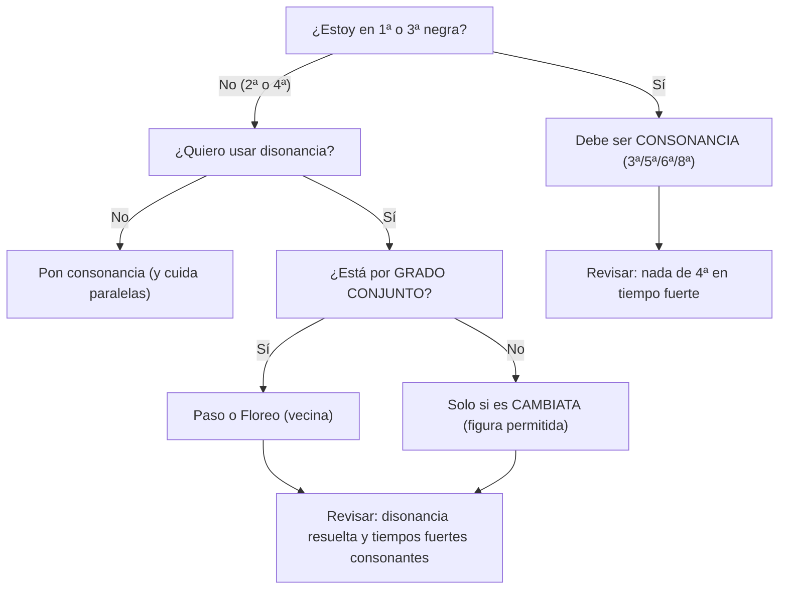
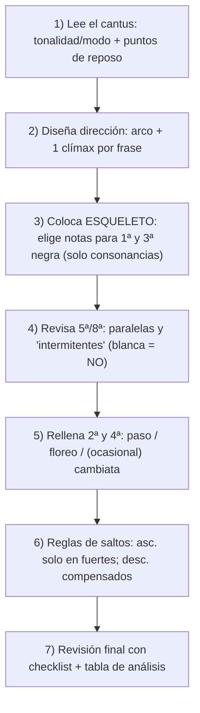

La **tercera especie** consiste en escribir una voz de **negras contra redondas** del _cantus firmus_ (velocidad ×4). Aunque en el siglo XVI los flujos continuos de negras eran más bien **ocasionales y decorativos**, en el aprendizaje se usa como “laboratorio” para dominar **control rítmico, dirección melódica y disonancia en tiempos débiles**.

---

## 1) Estructura rítmica: el “tactus” y qué tiempos importan

En cada compás (4/4), tus 4 negras no pesan igual:

|Negra|Nombre|Importancia|Regla armónica|
|---|---|--:|---|
|1ª|**tempo forte**|máxima|**solo consonancias**|
|2ª|tempo débil|mínima|consonancia **o** disonancia controlada|
|3ª|**tempo forte**|alta|**solo consonancias**|
|4ª|tempo débil|mínima|consonancia **o** disonancia controlada|

Esto es el corazón de la 3ª especie: **1 y 3 son “pilares” consonantes; 2 y 4 pueden ornamentar**.

---

## 2) Consonancia vs disonancia: la regla de oro

### Regla de oro (obligatoria)

- **Negras fuertes (1ª y 3ª): SIEMPRE consonantes.**
    
- **Negras débiles (2ª y 4ª): pueden ser disonantes**, pero **solo** si se justifican como:
    
    - **nota de paso**
        
    - **floreo/bordadura**
        
    - **cambiata**
        

### Intervalos típicos (según la guía)

En tiempos fuertes, la guía trabaja con consonancias como **3ª, 5ª, 6ª y 8ª**.

⚠️ Ojo importante del propio material: la **4ª** aquí se trata como **disonante en tiempo fuerte** (por ejemplo, sobre G en el bajo, un C arriba “4ª” en tiempo 1 se marca como problema).

---

## 3) Tratamiento de disonancias (solo en 2ª y 4ª): “qué se permite y cómo”

### 3.1 Nota de paso

Disonancia **entre dos consonancias**, conectada **por grado conjunto** (arriba o abajo). Patrón prototípico:

- Consonancia → **disonancia** → consonancia  
    Ej.: **E–F–G** (F es la disonancia)
    

### 3.2 Floreo / bordadura (vecina)

Te separas por paso a una vecina y vuelves:

- Nota base → **vecina** → nota base  
    Ej.: **C–D–C** o **C–B–C**
    

### 3.3 Cambiata (especial del estilo XVI)

Figura característica (se recomienda incluirla ocasionalmente por autenticidad):

- Cambiata descendente típica: **F–E–C–D**
    
- Cambiata ascendente (menos común): **C–D–F–E**
    

> La guía insiste en que la cambiata es **fundamental** en el estilo del siglo XVI y “debe incluirse ocasionalmente”.

---

## 4) Mini “árbol de decisión” (Mermaid) para cada negra



Esto resume literalmente la lógica del material: **fuerte = consonante**, **débil = consonante o disonante justificada**.

---

## 5) Vocabulario obligatorio: los **6 patrones melódicos** (y cuánto usarlos)

La guía reduce el repertorio “realmente efectivo” a estos patrones (con proporciones orientativas):

- **60%** escala (patrón 1)
    
- **20%** floreos/bordaduras (patrón 2)
    
- **10%** vueltas de tercera (patrón 3, _versión usable_)
    
- **5%** saltos iniciales compensados (patrón 4)
    
- **3%** saltos finales (patrón 5)
    
- **2%** cambiatas/saltos centrales (patrón 6)
    

### Tabla-resumen de los 6 patrones

|Patrón|Nombre|Qué hace|Riesgo típico|
|---|---|---|---|
|1|Escala|Línea continua por grado conjunto|monotonía si no cambias dirección|
|2|Floreo|Vecinas (arriba/abajo)|disonancia mal resuelta en 2ª/4ª|
|3|Vuelta de 3ª|Pequeña figura con retorno|puede forzar saltos/tiempos fuertes peligrosos si se coloca mal|
|4|Salto inicial (2ª negra)|**salto descendente** temprano + relleno|si subes con salto en débil, mal; si no compensas, mal|
|5|Salto final (4ª negra)|cierre del grupo con salto descendente|saltos de 4ª “límite”; requiere compensación|
|6|Salto central + Cambiata|salto en 3ª negra + cambiata|abusar rompe estilo; úsala “ocasionalmente”|

---

## 6) Biblioteca de patrones en **music-abc** (para que los “veas” rápido)

> Nota: son **micro-ejemplos pedagógicos**. En ejercicios reales, revisa siempre que 1ª y 3ª negras formen consonancia con el cantus.

### 6.1 Patrón 1 — Escala (C D E F)

```music-abc
X:1
T:Patrón 1 - Escala (4 negras)
M:4/4
L:1/4
K:C
C D E F |
```

Ejemplos del material: **C D E F** o **C B A G**.

---

### 6.2 Patrón 2 — Floreo (vecina)

```music-abc
X:2
T:Patrón 2 - Floreo (vecina)
M:4/4
L:1/4
K:C
C D C B |
```

Ejemplos del material: **C D C B**, **C B C D**, etc.

---

### 6.3 Patrón 3 — Vuelta de tercera (familia)

```music-abc
X:3
T:Patrón 3 - Vueltas de 3a (familia)
M:4/4
L:1/4
K:C
% Ejemplos de formas
C D C E |
E D E C |
C B C A |
```

Formas listadas: **C D C E**, **E D E C**, **C B C A**, y una versión “completa” **C D E C** marcada como problemática.

---

### 6.4 Patrón 4 — Salto inicial (2ª negra, descendente)

```music-abc
X:4
T:Patrón 4 - Salto inicial (2ª negra)
M:4/4
L:1/4
K:C
% "Salto + relleno"
C G A B |
% "Salto + compensación"
C G F E |
```

Reglas: solo **saltos descendentes** en posiciones débiles; **compensar**; evitar saltos > 5ª.

---

### 6.5 Patrón 5 — Salto final (4ª negra)

```music-abc
X:5
T:Patrón 5 - Salto final (4ª negra)
M:4/4
L:1/4
K:C
C B A F |
```

Observación del material: saltos de 4ª están “en el límite”; 3ª preferible; compensación posterior.

---

### 6.6 Patrón 6 — Salto central + Cambiata

```music-abc
X:6
T:Patrón 6 - Salto central + Cambiata
M:4/4
L:1/4
K:C
% Salto central simple
C D G F |
% Cambiata descendente (característica)
F E C D |
% Cambiata ascendente (menos común)
C D F E |
```

La cambiata se considera **fundamental** y recomendable “de vez en cuando”.

---

## 7) Reglas melódicas específicas de 3ª especie (saltos y compensaciones)

### 7.1 Saltos ascendentes vs descendentes (muy estricto)

- **Saltos ascendentes**:
    
    - ✅ permitidos **solo** en negras fuertes (1ª y 3ª)
        
    - ❌ prohibidos en negras débiles (2ª y 4ª)
        
- **Saltos descendentes**:
    
    - ✅ permitidos en cualquier posición
        
    - ⚠️ condición: **compensar siempre** con movimiento contrario
        
    - límite preferible: no más de **quinta**
        

### 7.2 Compensación obligatoria después de saltos

Después de saltos de **3ª o mayores**:

- cambia dirección inmediatamente,
    
- continúa por grados conjuntos,
    
- evita saltos compuestos (varios seguidos).
    

La guía incluso propone “fórmulas” típicas:

- Ascendente: **3–2–2…** o excepcionalmente **4–2–2…**
    
- Descendente: **…2–2–3** o excepcionalmente **…2–2–4**
    

### 7.3 Checklist melódico rápido

- Predominio de **grado conjunto**
    
- Saltos compensados
    
- Cambio de dirección cada **2–3 notas**
    
- No dos saltos grandes consecutivos
    
- Rango no excede **octava y media**
    

---

## 8) Movimiento armónico entre voces: paralelas y “intermitentes”

### 8.1 Regla general

- ❌ Nada de **quintas u octavas paralelas** (y cuidado con el directo hacia perfectas).  
    Esto aparece como principio general del contrapunto (paralelo prohibido) y se recuerda en checklist.
    

### 8.2 Regla ESPECÍFICA de 3ª especie: **quintas/octavas intermitentes**

Aquí viene lo “técnico fino”:

- ❌ Prohibidas a distancia de **blanca** (entre negras fuertes contiguas: 1ª→3ª dentro del mismo compás)
    
- ✅ Permitidas a distancia de **redonda** (entre negras fuertes de compases distintos)
    

Esto existe porque hay **dos tiempos fuertes por compás** y puedes “fabricar” perfectas repetidas sin ser paralelas estrictas… pero suenan igual de vacías.

---

## 9) Inicio, desarrollo y final (lo mínimo que no puedes romper)

La guía de trabajo formal (sesión 2) pide:

- **Inicio**: consonancia perfecta obligatoria
    
- **Desarrollo**: aplicación variada de los 6 patrones
    
- **Conclusión**: fórmula cadencial característica (se remite a cuarta especie)
    
- **Nota final**: **redonda** en consonancia perfecta
    

Y en los ejemplos de tercera especie aparece el arranque con **“Silencio | …”** (tradición de entrar después de un pequeño silencio).

---

## 10) Método paso a paso para componer (de forma “segura”)



La lógica del esqueleto (tiempos fuertes consonantes) y el relleno en débiles es exactamente la esencia de la especie.

---

## 11) Plantilla de análisis (tabla “tipo conservatorio”)

Úsala para revisar **cada negra**:

|Compás|Tiempo (1-4)|CF|CP|Intervalo|¿Cons/Dis?|Si dis: ¿Paso / Floreo / Cambiata?|Nota|
|--:|--:|---|---|---|---|---|---|
|1|1|C|E|3ª|Cons ✅|—|ok|
|1|2|C|F|4ª|Dis ✅|Paso|E–F–G|
|1|3|C|G|5ª|Cons ✅|—|ok|
|1|4|C|A|6ª|Cons ✅|—|ok|

Puedes copiarla y hacer tu auditoría compás por compás.

---

## 12) Checklist final (de la propia guía)

Te la dejo como tabla compacta (basada en el checklist del documento):

|Área|Revisión|
|---|---|
|Armonía|Disonancias preparadas y resueltas; final con octava o unísono|
|Movimiento melódico|Predomina grado conjunto; saltos compensados; cambios de dirección cada 2–3 notas; no 2 saltos grandes seguidos; rango ≤ octava y media|
|Contrapunto|No hay 5ª/8ª paralelas; equilibrio entre movimiento contrario y directo; independencia clara; un clímax por frase|

---

## 13) Errores comunes (con “antídoto” inmediato)

### Error 1: disonancia en tiempo fuerte

Ejemplo del material: sobre **C** en el cantus, poner **F** en tiempo 1 crea **4ª** disonante (prohibido).  
Solución: reubicar para que el tiempo 1 sea consonante (E en 3ª).

### Error 2: falta de dirección (escala infinita hacia arriba)

Se muestra como error una subida continua (C D E F | G A B C | …).  
Solución: introducir cambios de dirección y micro-figuras para crear discurso.

### Error 3: saltos grandes sin compensación

Error: C–G–D–A (saltos grandes seguidos).  
Solución: compensar con descenso gradual tras el salto (C–G–F–E).

---

## 14) Plan de estudio “serio” (3–4 sesiones) para dominar la especie

### Sesión 1 — Fragmentos cortos (3 notas de cantus)

- Objetivo: entrenar búsqueda de soluciones y asimilación de normas.
    
- Tarea: encontrar **2 soluciones distintas** por fragmento; escribir intervalos; maximizar grado conjunto; cumplir reglas de saltos.
    

### Sesión 2 — Cantus firmus completo

Criterios de evaluación:

1. armonía (consonancia/disonancia), 2) variedad de patrones, 3) clímax por frase, 4) “sorpresa” controlada.  
    Y estructura formal: inicio perfecto, desarrollo con los 6 patrones, cadencia, nota final en perfecta.
    

### Sesión 3 — Disminución (de 1ª especie a 3ª)

Método: tomar un contrapunto de 1ª especie y “ornamentarlo” en 3ª, pasando por las mismas notas del original en cada compás (si no en la 1ª negra, en alguna posterior).

### Sesión 4 — Libre (integración 1ª–2ª–3ª)

Se permite combinar especies, cadencias intermedias, imitaciones sencillas, y ampliar longitud (siempre cantable).

---

## 15) Ejercicios progresivos (incluye aplicación a progresiones)

El documento propone:

- **Básico** (CF): `F - C - D - Bb - C - F`  
    Tarea: tercera especie superior + al menos 1 nota de paso y 1 bordadura.
    
- **Intermedio modal (dórico)** (CF): `D - G - F - A - G - D`  
    Tarea: tercera especie inferior + arco melódico.
    
- **Avanzado moderno** (progresión): `Am7 - Dm7 - G7 - Cmaj7`  
    Tarea: extraer un “cantus” de la progresión y componer tercera especie adaptando reglas al contexto armónico.
    

Y además se sugiere la aplicación creativa: jazz (walking bass), popular (contramelodías) y clásico-romántico (variaciones).

---

## 16) Truco práctico para “progresiones” (sin traicionar la lógica de especie)

Si estás sobre acordes (Am7–Dm7–G7–Cmaj7), piensa así:

- **Tiempos fuertes (1 y 3)** = **notas estructurales** (tensiones estables / chord tones / guías)
    
- **Tiempos débiles (2 y 4)** = **conectores** (paso, vecinas, cambiata) que **resuelven** hacia un tiempo fuerte consonante
    

Es literalmente el mismo principio de “pilares vs ornamentos” que define la especie.

---

Si quieres, en tu próximo mensaje pega un **cantus firmus** (6–10 notas) y te lo convierto en:

1. **esqueleto** (solo 1ª y 3ª negras),
    
2. **versión completa** en 3ª especie con patrones etiquetados (paso/floreo/cambiata),
    
3. **tabla de análisis** ya rellenada.