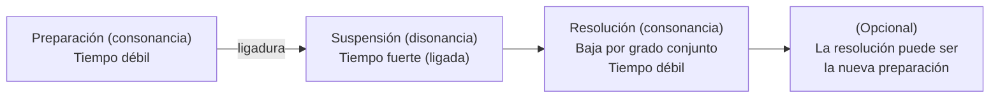
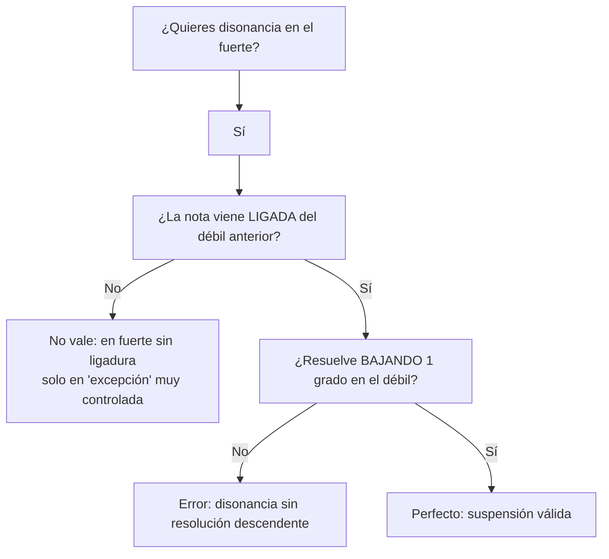
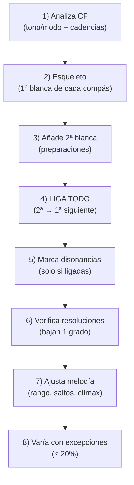

# Guía **súper mega** del Contrapunto de **4ª Especie** (Síncopa / Suspensiones)

La **cuarta especie** (también llamada **contrapunto sincopado**) es el entrenamiento “oficial” para dominar **suspensiones**: crear tensión manteniendo una nota (ligadura) y resolverla con elegancia. En tus notas se describe como un **2 contra 1** (dos blancas contra cada redonda del cantus firmus) con **ligaduras sistemáticas**, donde la disonancia en tiempo fuerte **se permite** si viene **ligada**, y toda disonancia debe **resolver descendiendo por grado conjunto**.

---

## 0) Diccionario express (para que tu alumno no se pierda)

|Término|En cristiano|Lo que significa en 4ª especie|
|---|---|---|
|**Cantus firmus (CF)**|“melodía base”|La voz dada (normalmente en **redondas**)|
|**Síncopa**|acento “corridito”|Acentuación de tiempos débiles / desplazamiento rítmico|
|**Suspensión**|“me quedo pegado”|Nota que se mantiene y resuelve **descendiendo**|
|**Retardación**|“me quedo pegado” (pero al revés)|Mantener y resolver **ascendiendo** (útil como extra, no es lo típico aquí)|
|**Consonancia / Disonancia**|estable / inestable|La disonancia **exige** resolución|

> Nota importante para esta guía: asumiré el caso clásico de especie: **CF abajo** (bajo) en redondas y **contrapunto arriba** en blancas (2:1) con ligaduras.

---

## 1) El “motor” de la 4ª especie: la **ligadura obligatoria**

### Regla #1 (la que manda)

**OBLIGATORIO**: _La segunda blanca de cada compás SIEMPRE debe ligarse con la primera blanca del compás siguiente._

Si no haces esto… ya no es 4ª especie (o al menos pierdes el carácter sincopado).

### Ejemplo (correcto vs incorrecto)

```music-abc
X:1
T:Ligadura obligatoria (idea)
M:4/4
L:1/2
K:C
V:1 clef=treble name="Contrapunto"
V:2 clef=bass name="Cantus"
[V:2] C,2 | F,2 | G,2 | C,2 |]
[V:1] G E- | E D- | D C- | C B |]
```

- En cada compás, la **2ª blanca** (tiempo débil) se liga hacia la **1ª blanca** del compás siguiente (tiempo fuerte).
    
- Esa ligadura es lo que permite que _la misma nota_ cambie de función al cambiar el CF.
    

Tus notas también muestran explícitamente el “✅ con ligadura / ❌ sin ligadura”.

---

## 2) Jerarquía rítmica (qué importa más y por qué)

En tus notas aparece esta tabla (clave total):

- **1ª blanca (tiempo fuerte)**: máxima importancia. Puede ser **consonancia** o **disonancia ligada** (si es suspensión).
    
- **2ª blanca (tiempo débil)**: importancia media. Normalmente consonancia, funcionando como **resolución** o **preparación**.
    

Eso explica por qué en 4ª especie “rompemos” la regla de especies previas: aquí la disonancia puede caer en el fuerte… **pero** solo si está amarrada (ligada) y se resuelve como Dios manda.

---

## 3) La regla “revolucionaria”: disonancia en tiempo fuerte ✅ (pero con condiciones)

**Regla**: En 4ª especie, las disonancias **están permitidas en tiempo fuerte** si están **ligadas** desde el tiempo débil anterior.

Traducción pedagógica para tu alumno:

> “No ‘ataco’ una disonancia. La **sostengo** y el **CF cambia abajo**, entonces aparece la disonancia.”

---

## 4) El patrón rey: **P–S–R** (Preparación → Suspensión → Resolución)

Tus notas lo modelan tal cual: **Preparación–Suspensión–Resolución**, y dicen explícitamente que la resolución debe ser **por grado conjunto descendente**.

### Diagrama (mermaid) del “ciclo” P–S–R



### Regla #2 (importantísima)

**Toda disonancia debe resolver por grado conjunto descendente**.

---

## 5) “Cómo se fabrica” una suspensión (paso a paso, sin humo)

Voy a describirlo como un algoritmo que tu alumno puede repetir:

### Algoritmo de 3 pasos

1. **Elige una resolución consonante** en el tiempo débil (por ejemplo, una 3ª o 6ª).
    
2. **Sube 1 grado** (o define la nota que al bajarla por grado conjunto te lleve a esa resolución). Esa nota será la **nota de suspensión**.
    
3. Asegúrate de que esa nota de suspensión **esté preparada como consonancia** en el compás anterior y **ligada** al tiempo fuerte donde se vuelve disonancia.
    

### Diagrama (decisión rápida)



---

## 6) Tipos de síncopas / suspensiones (tu “vocabulario”)

Tus notas listan como principales: **4ª, 7ª, 2ª, 9ª**, con su preparación y resolución típicas.

### Tabla de referencia (súper útil para clase)

|Tipo|Fórmula (intervalo)|Preparación típica|Resolución típica|Uso|
|---|---|---|---|---|
|**4ª**|4–3|5ª o 3ª|3ª|Muy común|
|**7ª**|7–6|8ª o 6ª|6ª|Moderado|
|**2ª**|2–1|3ª o unísono|1|Ocasional|
|**9ª**|9–8|8ª|8ª|Raro|

> **Cómo leer “4–3”**: en el tiempo fuerte suena una **4ª** (disonante) y en el tiempo débil resuelve a **3ª** (consonante).

---

## 7) Biblioteca de patrones en `music-abc` (para que lo veas y lo copies)

### 7.1 Suspensión 4–3 (la clásica)

```music-abc
X:10
T:Suspensión 4-3 (CP arriba)
M:4/4
L:1/2
K:C
V:1 clef=treble name="CP"
V:2 clef=bass name="CF"
[V:2] D,2 | C,2 |]
[V:1] A  F- | F  E |]
```

- Compás 1 (CF = D): **F** es 3ª (preparación consonante)
    
- Compás 2 (CF = C): **F** pasa a ser 4ª (suspensión disonante), resuelve a **E** (3ª)
    

Tus notas también dan el ejemplo de síncopa de 4ª y la señalan como la más común.

---

### 7.2 Suspensión 7–6

```music-abc
X:11
T:Suspensión 7-6
M:4/4
L:1/2
K:C
V:1 clef=treble name="CP"
V:2 clef=bass name="CF"
[V:2] D,2 | C,2 |]
[V:1] G  B- | B  A |]
```

Tus notas también muestran un ejemplo de síncopa de 7ª (7–6).

---

### 7.3 Suspensión 2–1 (muy “picante”)

```music-abc
X:12
T:Suspensión 2-1
M:4/4
L:1/2
K:C
V:1 clef=treble name="CP"
V:2 clef=bass name="CF"
[V:2] F,2 | C,2 |]
[V:1] A  D- | D  C |]
```

Tus notas la describen como “muy disonante, uso ocasional”.

---

### 7.4 Suspensión 9–8 (rara, pero hermosa)

```music-abc
X:13
T:Suspensión 9-8
M:4/4
L:1/2
K:C
V:1 clef=treble name="CP"
V:2 clef=bass name="CF"
[V:2] D,2 | C,2 |]
[V:1] A  d- | d  c |]
```

---

## 8) Reglas de inicio y final (cadencias)

### Inicio

**Debe comenzar con consonancia perfecta: 8ª o 5ª.**

> Pedagógico: inicia “limpio”, para que el oído entienda el modo/tono desde el primer compás.

### Final

**Debe terminar con consonancia perfecta (preferiblemente 8ª).**

Tus notas incluyen fórmulas cadenciales típicas, con y sin sensible.  
Y también ponen ejercicios donde se pide terminar en octava.

---

## 9) Reglas de intervalos por “posición” (lo que puede caer en cada blanca)

### Regla práctica (ultra útil)

- **Tiempo fuerte (1ª blanca)**:
    
    - ✅ Consonancia **o** disonancia **si está ligada** (suspensión).
        
- **Tiempo débil (2ª blanca)**:
    
    - ✅ Normalmente consonancia (resolución o preparación).
        

> Truco: en 4ª especie, el tiempo débil es “taller de carpintería”: o preparas la siguiente tensión o recoges (resuelves) la tensión anterior.

---

## 10) Reglas de **resolución** (la policía de la 4ª especie)

### Regla #3

La disonancia **resuelve** (sí o sí) por **grado conjunto descendente**.

En tus notas incluso aparece el “incorrecto por salto” vs “correcto descendente”.

---

## 11) Excepciones (sí, pero con bozal)

### 11.1 Consonancias en tiempo fuerte sin ligadura (excepción “de estilo”)

Tus notas permiten romper la cadena **ocasionalmente** para variedad:

- máximo **20%** del contrapunto
    
- preferir consonancias imperfectas (**3ª, 6ª**)
    
- mantener el carácter sincopado
    

Esto es clave: si lo haces demasiado, se te deshace el “idioma” de la 4ª especie.

### 11.2 “Versión fácil” (pedagógica)

Tus notas también mencionan ejercicios preparatorios donde se aceptan disonancias en tiempo débil sin resolución obligatoria.  
Úsalo como _nivel tutorial_, no como la regla final del estilo estricto.

---

## 12) Reglas melódicas generales (sí aplican aquí)

En 4ª especie, aunque el ritmo “te amarra”, la melodía sigue teniendo que cantar.

De tu guía general (Repaso 13), reglas base muy útiles para exigir a un alumno:

- ❌ No más de **3 intervalos del mismo tipo** consecutivos (evita monotonía)
    
- ❌ Evitar repetir la misma nota (salvo excepción justificada)
    
- ✅ Mantenerte **dentro de una octava** (como regla académica de especie)
    
- ✅ Preferir movimiento contrario y oblicuo; revisar independencia
    

> Extra (fuera de tus notas, pero súper estándar):
> 
> - Prefiere **grados conjuntos** (sobre todo porque la resolución de suspensiones ya te obliga a bajar por paso).
>     
> - Si saltas, que sea pequeño (3ª) y compensa cambiando dirección después.
>     

---

## 13) Conducción entre voces: paralelas, ocultas, etc. (qué revisar)

De tus notas generales:

- Movimiento **contrario** preferido; **oblicuo** siempre aceptable; **directo** con cuidado; **paralelo** prohibido en 5tas/8vas.
    

### ¿Por qué en 4ª especie parece “más fácil” evitar paralelas?

Porque con la ligadura obligatoria, a menudo:

- en el **fuerte** cambia el CF y el CP se mantiene (oblicuo)
    
- en el **débil** cambia el CP y el CF se mantiene (oblicuo)
    

Así que la especie “te empuja” a movimientos oblicuos.

### PERO ojo:

- En **cadencias** y en **excepciones** (cuando rompes la ligadura), sí puede haber movimiento directo hacia 5ª/8ª (ocultas). Tus notas explican qué es una oculta: dos voces en movimiento directo hacia 5ª u 8ª.
    

> **Regla pedagógica**: en 4ª especie, revisa ocultas/ directas sobre todo en:
> 
> 1. compases donde **no** ligas (excepción)
>     
> 2. los **dos últimos** compases (cadencia)
>     

---

## 14) Metodología para componer (tu “receta” paso a paso)

Tus notas proponen un proceso por etapas que está buenísimo para enseñar (y evaluar):

1. **Planificación estructural**: tonalidad/modo, inicio y final, puntos de máxima tensión, arco melódico.
    
2. **Esqueleto básico**: primeras blancas (tiempos fuertes), contorno, plan de resoluciones.
    
3. **Completar ligaduras**: segundas blancas, ligar sistemáticamente, comprobar resoluciones.
    
4. **Refinamiento**: excepciones consonantes, balance tensión/reposo, cantabilidad.
    

### Mermaid (flujo de trabajo)



---

## 15) Checklist de corrección (para que tu alumno “debuggee”)

### Lista corta (lo esencial)

-  ¿La **2ª blanca** de _cada_ compás está **ligada** a la 1ª del siguiente?
    
-  ¿Toda disonancia en fuerte está **ligada**?
    
-  ¿Toda disonancia **resuelve descendiendo** por grado conjunto?
    
-  ¿Inicio y final con consonancia perfecta?
    
-  ¿Excepciones ≤ 20%?
    
-  ¿Rango dentro de una octava y sin repeticiones bestias?
    

### Errores comunes (de tus notas) + solución

- ❌ Falta de ligaduras → ✅ Ligar sistemáticamente
    
- ❌ Resolución por salto → ✅ Resolución descendente
    
- ❌ Exceso de excepciones → ✅ Equilibrio síncopa/excepción
    

---

## 16) Ejercicios progresivos (listos para clase)

Tus notas traen una progresión didáctica muy usable (te la dejo como plantilla):

- **Básico**: CF corto en mayor, con requisitos claros (inicio perfecto, al menos 2 síncopas disonantes, cadencia en octava, 1 excepción).
    
- **Intermedio (menor)**: CF en La menor, usar sensible (G#) en cadencia, integrar una síncopa de 7ª.
    
- **Avanzado (modal)**: Dórico, evitar “sensible moderna”, usar nota característica (Bb).
    

---

## 17) Aplicación real (por qué esto importa fuera del examen)

Tus notas conectan directamente la 4ª especie con:

- **suspensiones en jazz** (sus4 → 3, etc.)
    
- **walking bass sincopado**
    
- contramelodías expresivas
    

Y también recomiendan repertorio para escuchar suspensiones “de verdad” (Palestrina, Bach).

---

## 18) Chuleta final (1 minuto antes de entregar)

| Si quieres…                   | Haz esto                                                     |
| ----------------------------- | ------------------------------------------------------------ |
| “Sonido 4ª especie auténtico” | Ligadura constante 2ª→1ª siguiente                           |
| Tensión rica                  | Usa 4–3 como default; mete 7–6 con moderación                |
| Que no te penalicen           | Toda disonancia en fuerte: ligada + resuelve bajando 1 grado |
| Variedad                      | Excepciones consonantes ≤ 20%                                |
| Buen cierre                   | Cadencia + final en 8ª (preferible)                          |
|                               |                                                              |

---

Si quieres, en el siguiente paso puedo hacerte **una plantilla imprimible** para tu alumno (tipo “worksheet”):

1. tabla para anotar intervalos por blancas,
    
2. checklist de entrega,
    
3. 3 cantus firmus listos (mayor, menor, modal) con espacio para escribir encima,  
    y con ejemplos `music-abc` ya preparados para que él solo copie/pegue y escuche.