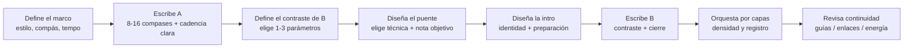
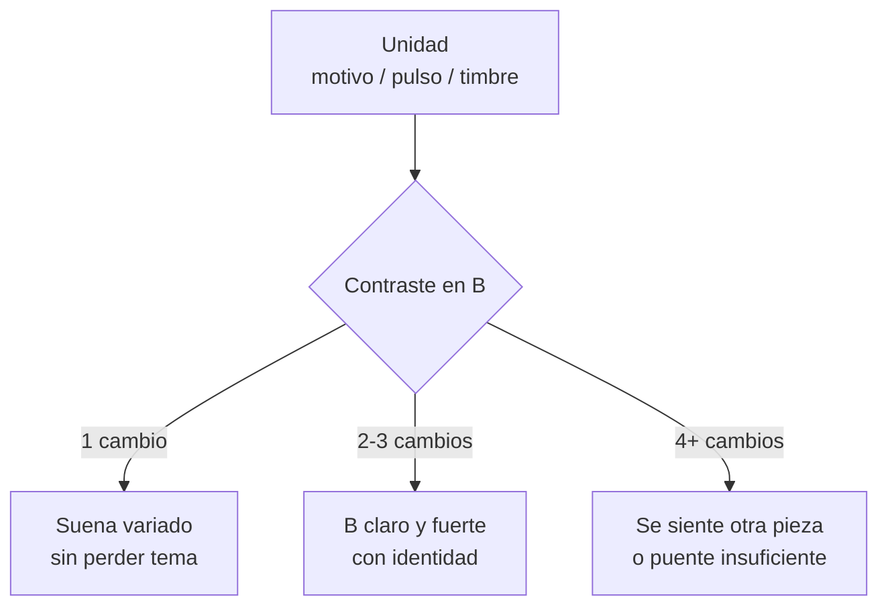

# Repaso 25: Composición binaria — **Contraste, Intro y Puente (enlaces)**

> Este repaso nace de `Notas 25. Composición binaria.md` y se integra con las ideas de:
> - `Repaso 24. Composición binaria.md` (forma AB / ABA', plan tonal y cadencial)
> - `Repaso 22. Enlaces 1.0.md` + `Repaso 23. Enlaces 2.0 y motivos.md` (conexiones melódicas/armónicas)
> - `Repaso 21. Tonos guías.md` (3ª y 7ª como brújula de dirección)

## Índice
1. [Qué significa “contraste” en binaria (sin perder unidad)](#qué-significa-contraste-en-binaria-sin-perder-unidad)
2. [Procedimiento ultra-detallado (pipeline)](#procedimiento-ultra-detallado-pipeline)
3. [Intro: funciones, tipos y longitudes](#intro-funciones-tipos-y-longitudes)
4. [Puente/Enlace: el “pegamento” entre secciones](#puenteenlace-el-pegamento-entre-secciones)
5. [Librería de puentes (por técnica) con `music-abc`](#librería-de-puentes-por-técnica-con-music-abc)
6. [Caja de herramientas para crear contraste en la Parte B](#caja-de-herramientas-para-crear-contraste-en-la-parte-b)
7. [Contraste por voces (capas) y textura](#contraste-por-voces-capas-y-textura)
8. [Plantillas completas (con compases y objetivos)](#plantillas-completas-con-compases-y-objetivos)
9. [Ejemplos `music-abc` (A / puente / B)](#ejemplos-music-abc-a--puente--b)
10. [Diagramas Mermaid (mapas de forma y energía)](#diagramas-mermaid-mapas-de-forma-y-energía)
11. [Ejercicios (con reloj) + checklist profesional](#ejercicios-con-reloj--checklist-profesional)
12. [Bibliografía citada](#bibliografía-citada)

---

## Qué significa “contraste” en binaria (sin perder unidad)

En forma binaria (AB o binaria redondeada ABA'), **la Parte B debe sentirse diferente** a la Parte A, pero sin “borrar” la identidad del tema.

### Regla de oro (20 años de aula, composición y arreglos)
**Cambia 1–3 parámetros en B (no 7).**  
Si cambias demasiadas cosas a la vez, el oyente siente “otra canción”; si no cambias nada, B se siente como repetición.

### Unidad vs. variedad (tabla de control)

| Si quieres… | Mantén (unidad) | Cambia (variedad/contraste) |
|---|---|---|
| Que la pieza sea reconocible | **Motivo** (contorno o ritmo), tempo base, “sonido” central | Registro, densidad, armonía, compás, modo |
| Que B sea claramente otra sección | 1 ancla: motivo, guía tonal, patrón rítmico | 2–3 cambios: compás + textura, o modo + armonía, etc. |

### En binaria tonal “clásica”
El contraste suele estar en:
- **Tonalidad/área** (A suele apuntar a V/III; B vuelve a I/i y desarrolla)
- **Desarrollo** (secuencia, fragmentación, dominantes de paso)

En binaria moderna (verso-coro):
- A = verso (menos denso), B = coro (más denso / hook)
- El puente (bridge) se usa para “reiniciar” tensión o cambiar perspectiva

Referencia formal: distinción AB vs. ABA' y rol cadencial/funcional.[^caplin][^green]

---

## Procedimiento ultra-detallado (pipeline)

La forma más rápida de que una binaria “suene compuesta” (y no pegada) es tratar **Intro** y **Puente** como decisiones formales, no como adorno.

### Pipeline (de idea a estructura)



### Hoja de decisiones (tabla)

| Pregunta | Respuesta | Consecuencia compositiva |
|---|---|---|
| ¿Qué hace que esto sea “mi tema”? | motivo / timbre / ritmo | eso **no se rompe** en B |
| ¿Cómo será diferente B? | compás / modo / textura / armonía / registro | elige solo 1–3 |
| ¿Qué nota objetivo “abre” B? | 3ª o 7ª del 1er acorde de B | el puente “apunta” ahí[^guia] |
| ¿Qué tipo de intro necesito? | teaser / pedal / progresión | intro prepara el primer gesto de A |

### Regla de maestro: “si no lo puedes describir, no lo puedes controlar”
Antes de escribir B, completa esta frase:

> **“En B voy a cambiar ____ y ____ (máx. 3) mientras mantengo ____ (unidad).”**

---

## Intro: funciones, tipos y longitudes

La **Intro** no es “relleno”: es la primera decisión de *dirección*. No hay número fijo de compases; lo importante es **a qué punto quieres llegar**.

### Funciones típicas de una Intro

| Función | Qué logra | Señales auditivas |
|---|---|---|
| **Anclar tonalidad** | El oído entiende el “hogar” | pedal, I–V, bordón |
| **Presentar groove/compás** | El cuerpo entiende el pulso | patrón de batería/bajo |
| **Sembrar el motivo** | La mente reconoce identidad | “teaser” del motivo |
| **Crear expectativa** | Hace que A entre con sentido | subida de energía / pausa |

### Tipos de Intro (plantillas)

| Tipo | Longitud común | Material | Ideal para |
|---|---:|---|---|
| **Pick-up / anacrusa** | 1–2 tiempos o 1 compás | fragmento del motivo | temas cantables |
| **Pedal + color** | 1–4 compases | nota pedal + acordes | ambient/dream pop |
| **Progresión mini** | 2–4 compases | I–IV–V (o ii–V) | pop/rock/jazz |
| **Motivo “a contraluz”** | 2–8 compases | ritmo del motivo sin melodía | música cinematográfica |
| **Intro con puente interno** | 4–8 compases | intro modula y aterriza | si A entra en tono “no obvio” |

### Checklist de intro (rápido)
- [ ] ¿Se entiende el pulso y el compás?
- [ ] ¿Presenta 1 identidad (motivo / timbre / pedal)?
- [ ] ¿La última figura “invita” a A (pickup, silencio, dominante, fill)?

### Biblioteca de intros (rápidas) en `music-abc`

#### Intro 1: anacrusa (pickup) con el “cabezal” del motivo

```music-abc
X:3
T:Intro pickup (1 compas) hacia A
M:4/4
L:1/8
Q:1/4=96
K:C
%%score (Mel|Bas)
V:Mel clef=treble name="Mel"
V:Bas clef=bass name="Bas"
V:Bas z6 "G" G,,2 |
V:Mel z6 G A |
```

Idea: el pickup “tira” del oyente hacia el compás 1 de A.

#### Intro 2: pedal + color (2 compases) para atmósfera

```music-abc
X:4
T:Intro pedal (2 compases) + color
M:4/4
L:1/8
Q:1/4=84
K:C
%%score (Top|Bas)
V:Top clef=treble name="Top"
V:Bas clef=bass name="Bas"
V:Bas "C" C,2 z2 "C" C,2 z2 | "C" C,2 z2 "C" C,2 z2 |
V:Top "Cmaj7" E2 G2 B2 G2 | "Cmaj7(#11)" E2 ^F2 G2 B2 |
```

#### Intro 3: mini-progresión (2 compases) que instala función

```music-abc
X:5
T:Intro mini-progresion (I-vi-IV-V)
M:4/4
L:1/8
Q:1/4=96
K:C
%%score (Mel|Bas)
V:Mel clef=treble name="Mel"
V:Bas clef=bass name="Bas"
V:Bas "C" C,2 "Am" A,,2 "F" F,,2 "G" G,,2 |
V:Mel E2 E2 F2 G2 |
```

---

## Puente/Enlace: el “pegamento” entre secciones

En tus notas: **Puente = lo que existe entre partes**. Su objetivo no es “lucirse”: es **unir**.

### Qué hace un buen puente

| Objetivo del puente | Qué cambia | Qué conserva |
|---|---|---|
| **Reencuadrar** (pasar de A a B) | armonía / modo / compás / textura | pulso o motivo |
| **Preparar regreso** (B → A') | tensión → resolución | identidad temática |
| **Evitar el “corte”** | suaviza el salto | continuidad de conducción de voces |

### Técnicas de puente (las de tus notas + cómo decidir)

| Técnica | Cómo suena | Cuándo usar | Regla práctica |
|---|---|---|---|
| **Tonos guía** (3ª/7ª) | línea “inevitable” | cuando hay acordes claros | llega por semitono al destino[^guia] |
| **Movimiento cromático** | tensión controlada | si B cambia de tonalidad o color | cromatismo con objetivo (nota de llegada) |
| **Salto de 4ª** | gesto “heroico”/abierto | para despegar energía | compensa con movimiento contrario después |
| **Acorde de paso** | escalón lógico | para modular o acercar cadencia | úsalo en tiempo débil |
| **Mini-resolución** | micro-cadencia | para “cerrar” A antes de B | HC o IAC antes del cambio |
| **Un nuevo acorde** (pivote) | puerta a otro mundo | cuando B es modal/relativa | que comparta notas con ambos lados |

> Puente “libre” no significa “sin reglas”: significa que **no repite la forma** de A ni B, pero sigue obedeciendo dirección y objetivo.

### Errores comunes de puente
- Puente demasiado largo (olvidas que era transición).
- Cromatismo sin objetivo (tensión sin llegada).
- Cambiar todo (compás + tempo + textura + tonalidad) y perder continuidad.

---

## Librería de puentes (por técnica) con `music-abc`

Esta sección es para cuando estás componiendo y dices: “necesito un puente de 1–2 compases y no sé qué escribir”.

### Plantilla universal (1 compás)
1. Elige la **nota objetivo** (3ª o 7ª del primer acorde de B).[^guia]  
2. Decide cómo llegas: diatónico, cromático, salto (4ª), acorde de paso, mini-cadencia.  
3. Coloca la llegada en un lugar “fuerte” (inicio de B) y el movimiento en lugar “débil”.

### A) Puente con tonos guía (mínimo y elegante)
Ejemplo: de **G7** a **Am** (objetivo: **C** o **E** en Am; aquí apuntamos a **C** por semitono).

```music-abc
X:10
T:Puente por tonos guía (G7 -> Am)
M:4/4
L:1/8
Q:1/4=92
K:C
%%score (Lin|Bas)
V:Lin clef=treble name="Linea"
V:Bas clef=bass name="Bajo"
V:Bas "G7" G,,2 z2 z4 |
V:Lin "G7" B A G ^G | "Am" A2 c2 z2 |
```

Qué escuchar:
- La línea superior hace **G → G# → A** (tensión-resolución clara).

### B) Puente cromático (tensión dirigida)
Ejemplo: de **F** a **G** (cromatismo al V para preparar el regreso).

```music-abc
X:11
T:Puente cromático (F -> G)
M:4/4
L:1/8
Q:1/4=96
K:C
%%score (Lin|Bas)
V:Lin clef=treble name="Linea"
V:Bas clef=bass name="Bajo"
V:Bas "F" F,,2 z2 "G" G,,2 z2 |
V:Lin "F" A G ^G A | "G" B A G z |
```

Regla: cromático sin objetivo = ruido; cromático con objetivo = puente.

### C) Puente con salto de 4ª (gesto que abre espacio)
Ejemplo: salto **D → G** para anunciar cambio de sección; luego aterriza por paso.

```music-abc
X:12
T:Puente con salto de 4a (gesto) + aterrizaje
M:4/4
L:1/8
Q:1/4=92
K:G
%%score (Lin|Bas)
V:Lin clef=treble name="Linea"
V:Bas clef=bass name="Bajo"
V:Bas "D" D,2 z2 "G" G,2 z2 |
V:Lin D2 G2 F# E | "G" D2 B2 z2 |
```

Uso: cuando B necesita “levantar la ceja” sin cambiar todo.

### D) Puente con acorde de paso (escalón armónico)
Ejemplo: **C → C#° → Dm** (paso cromático funcional).

```music-abc
X:13
T:Puente con acorde de paso (C -> C#dim -> Dm)
M:4/4
L:1/8
Q:1/4=88
K:C
%%score (Arp|Bas)
V:Arp clef=treble name="Arpegio"
V:Bas clef=bass name="Bajo"
V:Bas "C" C,2 "C#dim" ^C,2 "Dm" D,2 z2 |
V:Arp "C" E G c z2 | "C#dim" ^C E G z2 | "Dm" D F A z2 |
```

### E) Puente con mini-resolución (micro-cadencia)
Ejemplo: termina A en **HC** (dominante), y B entra como respuesta.

```music-abc
X:14
T:Mini-resolucion (HC) antes de entrar a B
M:4/4
L:1/8
Q:1/4=96
K:C
%%score (Mel|Bas)
V:Mel clef=treble name="Mel"
V:Bas clef=bass name="Bas"
% Fin de A: prepara dominante
V:Bas "Dm" D,2 "G" G,,2 z4 |
V:Mel A G F E | D2 G2 z2 |
% Entrada de B: responde y cierra en I
V:Bas "C" C,2 z2 z4 |
V:Mel E G F E | D2 C2 z2 |
```

### F) Puente con “nuevo acorde” pivote (puerta de color)
Ejemplo: A en C mayor, B entra con color mixolidio usando **Bb** como acorde pivote hacia bVII → I.

```music-abc
X:15
T:Pivote (Bb) para color mixolidio en B
M:4/4
L:1/8
Q:1/4=92
K:C
%%score (Mel|Bas)
V:Mel clef=treble name="Mel"
V:Bas clef=bass name="Bas"
V:Bas "C" C,2 "Bb" _B,,2 "F" F,,2 "C" C,2 |
V:Mel E2 D2 C2 _B2 | A2 G2 F4 |
```

---

## Caja de herramientas para crear contraste en la Parte B

### 1) Contraste por compás (métrica)

| A | B | Efecto | Uso típico |
|---:|---:|---|---|
| 4/4 | 6/8 | “rodar” ternario | coro más cantable, gigue feel |
| 4/4 | 3/4 | danza/elegancia | minuet feel |
| 6/8 | 4/4 | aterrizaje | final más “cuadrado” |

Regla: si cambias compás, **mantén el pulso** (misma negra o misma corchea) para que no parezca cambio de tempo.

### 2) Contraste por modo (modalidad)

| A (mayor) | B (opción) | Color | Ejemplo práctico |
|---|---|---|---|
| Iónico | **Lidio** | brillo (#11) | Imaj7(#11) |
| Iónico | **Mixolidio** | rock/blues | bVII → I |
| Mayor | **Menor relativo** | introspectivo | C → Am |
| Menor | **Dórico** | “menor luminoso” | i con 6 mayor |

### 3) Contraste por ritmo (células)
Usa una célula nueva **pero derivada** (misma densidad o misma acentuación base).

| Técnica | Qué haces | Resultado |
|---|---|---|
| **Desplazamiento** | mueves el inicio 1/8 | groove “adelantado” |
| **Aumentación** | duplicas duraciones | B se siente más grande |
| **Diminución** | mitad de duraciones | B se siente más activo |
| **Sincopa selectiva** | 1–2 ataques fuera de pulso | energía sin caos |

### 4) Contraste por armonía (sin complicarte)

| Contraste | Cómo hacerlo | “Seguro” en pop/tonal |
|---|---|---|
| **Más tensión** | dominantes secundarios | V/V, V/ii |
| **Más color** | intercambio modal | iv en mayor, bVII |
| **Más estabilidad** | pedal + acordes lentos | tónica prolongada |
| **Más dirección** | secuencias | ii–V encadenados |

### 5) Contraste por resolución (tu nota: “resolución diferente”)
Una forma fina de contraste es **cambiar el tipo de cierre**:

| En A cierras con… | En B prueba… | Efecto |
|---|---|---|
| PAC | IAC + coda | final “más hablado” |
| HC | PAC fuerte | B se siente conclusivo |
| auténtica | deceptiva (V→vi) | sorpresa emocional |

---

## Contraste por voces (capas) y textura

Tu nota es clave: **usar otras voces genera contraste** incluso si los acordes siguen parecidos.

### Tabla de “densidad por capas”

| Sección | Capas sugeridas | Sensación |
|---|---|---|
| **Intro** | 1–2 (pad + motivo sombra) | expectativa |
| **A** | 2–3 (bajo + armonía + melodía) | claridad |
| **Puente** | 1–4 (depende: puede desnudar o escalar) | transición |
| **B** | 3–5 (sumar contramelodía o ritmo) | clímax/contraste |

### Dos estrategias profesionales (muy usadas)
- **Estrategia “strip”**: antes de B, quitas capas (dejas solo bajo/pedal) → B entra grande.
- **Estrategia “riser”**: puente suma tensión (cromatismo + densidad + registro) → B aterriza.

---

## Plantillas completas (con compases y objetivos)

### Plantilla A: binaria moderna (Intro + Verso/Coro)
```
Intro (2–4) → A (8–16) → Puente (1–2) → B (8–16) → (A' opcional) → Outro
```

**Objetivos**
- Intro: pulso + identidad
- Puente: unión + preparación (sin robar escena)
- B: contraste claro (1–3 cambios) + hook

### Plantilla B: binaria redondeada (estilo danza)
```
||: A (8) :||: B (8) con regreso de A' (2–4) :||
```
Aquí el “puente” muchas veces está embebido: secuencias → dominante → regreso del motivo.

### Plantilla C: A cambia de tonalidad, B vuelve (clásico tonal)
```
A: I → V (o i → III)
Puente: pivote / dominante de preparación
B: V/III → I/i con cierre fuerte
```

---

## Ejemplos `music-abc` (A / puente / B)

> Nota: los ejemplos son deliberadamente “claros” (no virtuosísticos). Úsalos como plantilla: cambia acordes, registro, ritmo y textura.

### Ejemplo 1: A (C mayor, 4/4) → Puente cromático → B (A menor relativo)

```music-abc
X:1
T:Repaso 25 - A (C) puente cromático B (Am)
M:4/4
L:1/8
Q:1/4=96
K:C
%%score (Mel|Arp|Bas)
V:Mel clef=treble name="Mel"
V:Arp clef=treble name="Arp"
V:Bas clef=bass name="Bas"
% Intro (2): pedal + teaser
V:Bas "C" C,2 z2 "C" C,2 z2 |
V:Arp "Cmaj7" E G B G "Cmaj7" E G B G |
V:Mel z2 E2 z2 G2 |
% A (4): motivo simple + cadencia a G (V)
V:Bas "C" C,2 "Am" A,,2 "F" F,,2 "G" G,,2 |
V:Arp "C" E G c G "Am" E A c A "F" A c e c "G" B d g d |
V:Mel E D E G | A G F E | D E F A | G2 z2 |
% Puente (2): cromatismo dirigido (G -> G# -> A)
V:Bas "G" G,,2 "E7" E,,2 |
V:Arp "G7" B d g f "E7" ^G B e d |
V:Mel G A ^G F | E2 z2 |
% B (4): cambia modo y densidad (Am) + regreso a C al final
V:Bas "Am" A,,2 "Dm" D,,2 "E7" E,,2 "Am" A,,2 |
V:Arp "Am" A c e c "Dm" A d f d "E7" ^G B e d "Am" A c e c |
V:Mel A G E D | F E D C | B ^G A B | A2 z2 |
```

Qué observar:
- Contraste en B: **modo** (Am) + **densidad** (más arpegio) sin cambiar tempo.
- Puente: cromatismo con objetivo (**G#** como guía hacia Am).

### Ejemplo 2: Contraste por compás (A en 4/4 → B en 6/8) con mismo tempo percibido

```music-abc
X:2
T:A 4/4 -> Puente -> B 6/8 (mismo pulso)
M:4/4
L:1/8
Q:1/4=92
K:G
%%score (Mel|Bas)
V:Mel clef=treble name="Mel"
V:Bas clef=bass name="Bas"
% A (2): estable (4/4)
V:Bas "G" G,2 "Em" E,2 "C" C,2 "D" D,2 |
V:Mel B A G F# | E2 z2 |
% Puente (1): mini-resolución (HC) a D
V:Bas "Am" A,2 "D" D,2 |
V:Mel A B c2 |
% B (2): cambia a 6/8 (misma negra ≈ pulso), motivo rítmico nuevo
M:6/8
L:1/8
V:Bas "Em" E,3 "C" C,3 | "D" D,3 "G" G,3 |
V:Mel B A G | A B c | d c B | B3 |
```

---

## Diagramas Mermaid (mapas de forma y energía)

### Mapa de forma (binaria con intro y puente)


### “Perilla de contraste”: cambia 1–3 cosas



### Curva de energía típica (Intro → A → Puente → B)

```mermaid
gantt
title Curva de energia (modelo practico)
dateFormat  X
axisFormat  %L
section Secciones
Intro (identidad)     :a1, 0, 2
A (tema)              :a2, 2, 8
Puente (tension)      :a3, 10, 2
B (contraste/climax)  :a4, 12, 8
```



---

## Ejercicios (con reloj) + checklist profesional

### Ejercicio 1 (15 min): contraste mínimo que funciona
- Escribe A de 8 compases en 4/4 (I–vi–IV–V).
- Escribe B de 8 compases **solo cambiando 1 parámetro**:
  - opción A: cambia **registro** (una octava arriba)
  - opción B: cambia **densidad** (arpegios vs. acordes)
  - opción C: cambia **modo** (relativo menor)

### Ejercicio 0 (10 min): “poco tiempo para crear” (método de emergencia)
Cuando no hay tiempo, tu meta no es “una obra perfecta”, sino un **borrador tocable**.

1. **Min 0–2**: escribe un motivo de 2 compases (solo ritmo + contorno).
2. **Min 2–5**: armoniza A (4 compases) con I–vi–IV–V (o i–VI–III–VII).
3. **Min 5–7**: decide contraste de B (1 cosa): modo *o* densidad *o* registro.
4. **Min 7–9**: escribe puente de 1 compás apuntando a 3ª/7ª del primer acorde de B.[^guia]
5. **Min 9–10**: cierra B con una cadencia clara (PAC o equivalente).

Regla: si al final puedes tocar **Intro–A–Puente–B** sin parar, vas bien.

### Ejercicio 2 (20 min): puente “con objetivo”
Toma tu A y crea un puente de 1–2 compases usando 2 técnicas:
- tonos guía + acorde de paso, o
- cromatismo + mini-resolución

Regla: el puente debe “apuntar” a una nota objetivo (3ª o 7ª del primer acorde de B).[^guia]

### Ejercicio 3 (30 min): intro funcional (no decorativa)
Compón 4 compases de intro con una función clara:
- 2 compases pedal + teaser del motivo
- 1 compás fill o pausa
- 1 compás pickup hacia A

### Checklist profesional (antes de dar por “terminado”)
- [ ] **B se siente diferente** (puedo nombrar 1–3 cambios concretos).
- [ ] Hay **unidad** (motivo/pulso/timbre sigue presente).
- [ ] El **puente une** (no se siente corte; cromatismos tienen llegada).
- [ ] La **intro tiene función** (pulso + identidad + preparación).
- [ ] La conducción de voces en el puente y cadencias apunta a tonos guía (3ª/7ª).[^guia]

### Conexiones con otros repasos (para profundizar)
- Si tu puente suena “cortado”: revisa `Repaso 22. Enlaces 1.0.md` (enlace por paso/vecina/enclosure) y `Repaso 21. Tonos guías.md` (3ª/7ª como objetivo).
- Si B suena “igual” que A: vuelve a `Repaso 24. Composición binaria.md` (plan tonal/cadencial) y aplica la regla de 1–3 cambios.
- Si quieres que el contraste sea rítmico sin perder identidad: toma ideas de tu librería de motivos rítmicos (si estás usando ABC) y plántalas por capas (melodía vs bajo).

---

## Bibliografía citada

[^caplin]: Caplin, William E. *Classical Form: A Theory of Formal Functions for the Instrumental Music of Haydn, Mozart, and Beethoven*. Oxford University Press, 1998.
[^green]: Green, Douglass M. *Form in Tonal Music: An Introduction to Analysis*. 2nd ed., Holt, Rinehart and Winston, 1979.
[^guia]: Sobre tonos guía (3ª/7ª) y su rol en dirección y resolución: ver `Repaso 21. Tonos guías.md` en tu carpeta `Teoría musical/Tema`.
[^schoenberg]: Schoenberg, Arnold. *Fundamentals of Musical Composition*. Faber & Faber, 1967. (Unidad/variedad por motivo y desarrollo).
[^piston]: Piston, Walter. *Harmony*. (Varias ediciones; cadencias, dominantes, acordes de paso y función).
