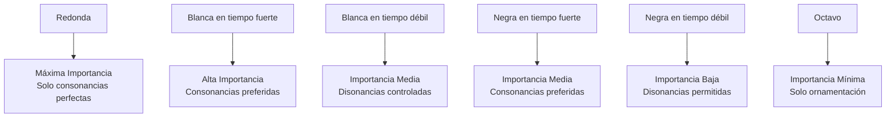
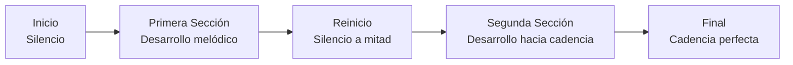
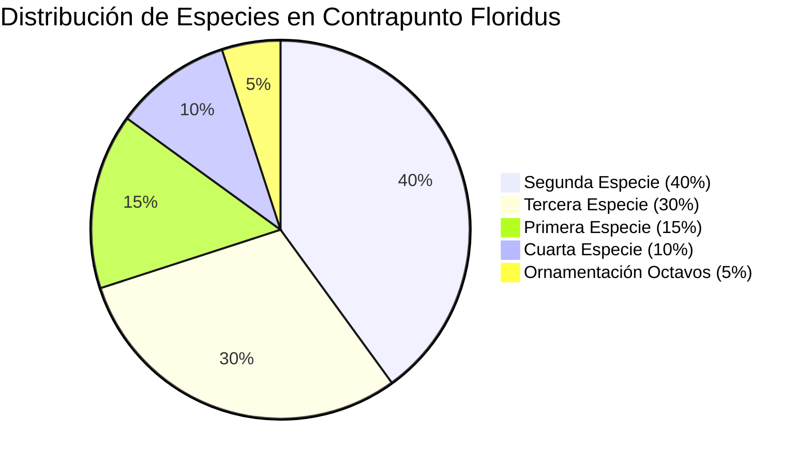
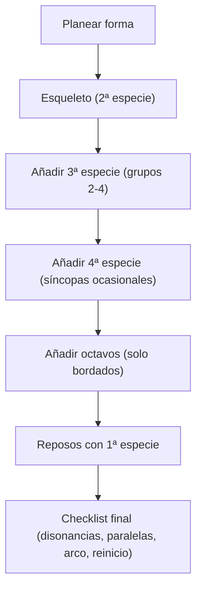
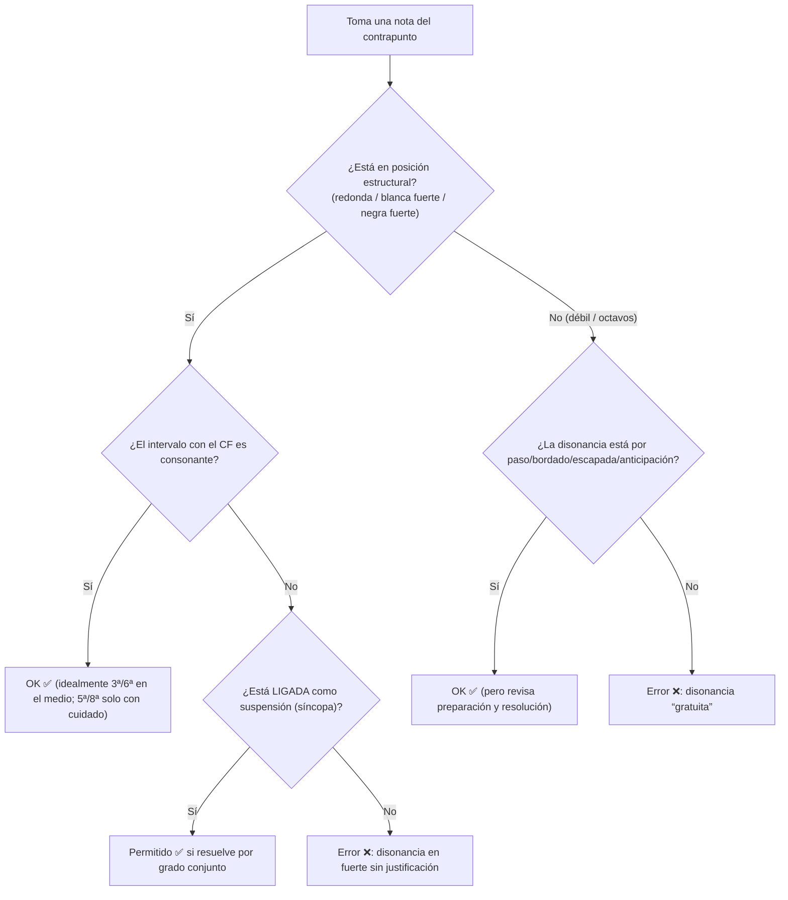

# Súper guía extendida: Contrapunto de 5ª especie (Contrapunto _floridus_)

## 0) Qué es (en una frase) y qué lo hace distinto

La **quinta especie (floridus)** es la **combinación libre** de las especies anteriores en **una sola línea**: mezcla de valores rítmicos (redondas/blancas/negras/octavos), mezcla de técnicas (pasos, bordados, síncopas, etc.) y, por eso, es la que más exige **planificación formal** (no solo “poner notas bonitas”).

---

## 1) La regla madre: “importancia rítmica” = “exigencia armónica”

En quinta especie **no todas las notas pesan igual**. Las notas que caen en posiciones más importantes (o duran más) necesitan más “estabilidad” armónica.

En tus notas está muy claro como **jerarquía**:



### Traducción práctica (para escribir sin perderte)

Piensa tu contrapunto como dos capas:

- **Esqueleto (notas estructurales)**: caen en tiempos fuertes / duraciones largas ⇒ casi siempre **consonantes**.
    
- **Decoración (notas de paso/vecinas)**: caen en tiempos débiles / subdivisiones ⇒ ahí viven las **disonancias bien tratadas**.
    

---

## 2) Ritmos permitidos (y su “para qué” real)

Tus notas te dan una tabla muy útil:

|Valor rítmico|Uso principal|Restricciones|Función expresiva|
|---|---|---|---|
|**Redonda**|Reposo/énfasis|**Solo consonancias perfectas**|estabilidad, conclusión|
|**Blanca**|estructura base|**síncopas permitidas**|movimiento moderado|
|**Negra**|ornamentación|grupos de 2–4|actividad melódica|
|**Octavo**|bordados|**solo en bordados, por grado conjunto**|refinamiento|

---

## 3) Qué es “tiempo fuerte” y “tiempo débil” aquí

En el enfoque típico de especies (y el de tus ejemplos en 4/4 con **cantus firmus en redondas**), lo útil es pensar así:

### 3.1 Si estás en **blancas** (2:1)

- **1ª blanca del compás = tiempo fuerte**
    
- **2ª blanca del compás = tiempo débil**
    

### 3.2 Si estás en **negras** (4:1)

Tus notas de 3ª especie lo resumen así (te sirve perfecto como mapa en 5ª especie):

|Tiempo|Importancia|Comentario|
|---|--:|---|
|**1**|fuerte|base armónica|
|**2**|débil|flexible|
|**3**|**semi-fuerte**|mejor consonar|
|**4**|débil|prepara el siguiente compás|

👉 **En 5ª especie**, como cambias de ritmos, la pregunta no es “¿qué compás es?”, sino:  
**¿esta nota cae en una posición estructural (fuerte) o ornamental (débil)?**

---

## 4) Consonancias y disonancias: reglas “por posición” (lo que te pedías)

### 4.1 Regla base (heredada de las especies “de paso”)

En especies como la 2ª:

- **Tiempo fuerte ⇒ consonancias**
    
- **Tiempo débil ⇒ puede haber disonancia**, pero **solo** si está **por grado conjunto** como nota de paso
    

Esa lógica es el ADN de 5ª especie, solo que ahora hay más ritmos.

### 4.2 Regla esencial de 5ª especie (tu “cheat code”)

Tu tabla rápida lo dice sin rodeos:

- **Disonancias: solo en tiempos débiles** (en negras: típicamente 2ª y 4ª; y en octavos cuando corresponda)
    

---

## 5) Reglas específicas de 5ª especie que DEBES memorizar

## 5.1 Octavos: “solo en bordado” (regla dura)

Tus notas lo ponen como **regla fundamental**:

- Los **octavos SIEMPRE** deben estar en **bordado (floreo)**
    
- Y además: **todos los octavos por grado conjunto**
    

### Patrones en music-abc (correctos vs incorrectos)

✅ Bordado superior (correcto):

```abc
X:1
T:Octavos Correctos - Bordado Superior
M:4/4
L:1/8
K:C
C4 D2C2 D4 |
w:Negra Octavos Negra
```

✅ Bordado inferior (correcto):

```abc
X:2
T:Octavos Correctos - Bordado Inferior
M:4/4
L:1/8
K:C
E4 D2E2 F4 |
w:Negra Octavos Negra
```

❌ Octavos sin bordado (incorrecto):

```abc
X:3
T:Octavos INCORRECTOS - Sin bordado
M:4/4
L:1/8
K:C
C4 D2E2 F4 |
w:❌ ❌ ❌ ❌
```

### ¿Puede haber disonancia en octavos?

Sí, pero con una condición súper concreta:

> En octavos, **el segundo octavo puede ser disonante si forma parte del bordado**.

Ejemplo (con dos voces):

```abc
X:5
T:Disonancia en Segundo Octavo (Permitida)
M:4/4
L:1/8
K:C
V:1 clef=treble
C4 D2C2 E4 |
V:2 clef=bass
C2 C2 C2 C2 |
w:Cons. Dis. Cons. Cons.
```

---

## 5.2 Integrar síncopas (4ª especie) dentro de 5ª

En 5ª especie, la **blanca** admite **síncopas** y tu método dice explícitamente: “integrar síncopas ocasionales (cuarta especie)”.

La regla clave (de 4ª especie) que “habilita” disonancias en fuerte:

- **Disonancia en tiempo fuerte permitida solo si está ligada desde el tiempo débil anterior**
    

Y el patrón canónico es:  
**Preparación (consonante) → Suspensión (disonante ligada) → Resolución (grado conjunto, típicamente descendente)**

> Ojo: en el estilo más estricto, las suspensiones suelen resolver **hacia abajo**; resolver hacia arriba existe (retardación), pero es mucho más “caso especial” y conviene dejarlo para cuando ya domines lo normal.

---

## 5.3 “Reinicio a mitad”: regla formal propia de tu guía

Esto es MUY tuyo y está súper bien como recurso didáctico:  
En la mitad del cantus firmus, haces un **nuevo inicio** con **silencio** para crear “cierre + nuevo comienzo”.

Diagrama (tal cual la idea):



Y su función expresiva:

- articulación formal / respiración / sensación de cierre / renovación
    

---

## 5.4 Equilibrio entre especies (si no, no es “floridus”: es “caótico”)

Tu guía lo dice con tabla + proporción recomendada:

- 1ª especie para reposos
    
- 2ª especie como **base**
    
- 3ª para ornamentación activa
    
- 4ª ocasional para tensión
    
- octavos como “detalle fino”
    

Y hasta sugiere una proporción aproximada:



---

## 6) Catálogo de “disonancias permitidas” en 5ª especie (con patrones)

### 6.1 Nota de paso (la más básica)

**Qué es:** disonancia que conecta dos consonancias por grado conjunto.  
**Dónde vive:** en **tiempos débiles** (o posiciones de baja importancia).  
**Cómo se trata:** llega por grado conjunto y sale por grado conjunto (misma dirección).  
Esto es literalmente el corazón de 2ª especie y se recicla en 5ª.

### 6.2 Bordadura (floreo / bordado)

**Qué es:** sales a la vecina y vuelves a la nota (superior o inferior).  
En 5ª especie, el “bordado con octavos” es el rey, pero recuerda: **octavos solo bordado**.

### 6.3 Cambiata (y “cambiata elaborada” en 5ª)

Tus notas distinguen:

- cambiata simple (más típica de 3ª)
    
- cambiata **elaborada** (propia de 5ª)
    

Ejemplo (cambiata elaborada):

```abc
X:12
T:Cambiata Elaborada (Quinta Especie)
M:4/4
L:1/8
K:C
F4 E/2F/2E2 C2 D4 |
w:Base Bordado Salto Resolución
```

### 6.4 Escapada

Definición de tus notas:

> **Salto desde una consonancia hacia una disonancia que resuelve por grado conjunto**

Ejemplo:

```abc
X:13
T:Escapada en Quinta Especie
M:4/4
L:1/4
K:C
C E D C |
w:Cons. Escapada Resolución Cons.
```

### 6.5 Anticipación

Definición + ejemplo en tus notas:

```abc
X:14
T:Anticipación
M:4/4
L:1/8
K:C
D4 C2D2 C4 B4 |
w:Prep. Anticipación Resolución
```

### 6.6 Síncopa / suspensión (tomada de 4ª especie)

**Cuándo usarla en 5ª:** “para expresividad” y contraste rítmico (no todo el tiempo).

---

## 7) Inicio, final y cadencia (reglas “de marco”)

### 7.1 Inicio (silencio + entrada)

En tu análisis del ejemplo se menciona el **silencio inicial** como tradición.  
En 5ª especie es muy común arrancar así para evitar rigidez y “respirar” desde el inicio.

### 7.2 Finales permitidos

Tus notas lo fijan:

- ✅ **Octava**: la más común/estable
    
- ✅ **Quinta**: permitida
    
- ❌ otros intervalos: no apropiados
    

---

## 8) Método real para escribir 5ª especie (paso a paso, sin improvisar a ciegas)

Tu guía propone un proceso por etapas que es oro:

1. **Planificación estructural**: reinicio a mitad, arco melódico, clímax, cadencia final
    
2. **Esqueleto básico**: primero escribe una **segunda especie** bien correcta
    
3. **Ornamentación**: agrega 3ª, síncopas ocasionales (4ª), bordados con octavos, y 1ª especie para reposos
    
4. **Refinamiento**: revisa disonancias, variedad rítmica, reinicio, cantabilidad
    

### Flowchart “modo examen”



---

## 9) Ejemplo completo “de taller” (lo mejor para aprender)

Tus notas incluyen un proceso entero (CF → esqueleto → ornamentación → versión final). Úsalo como plantilla.

### Cantus firmus

```abc
X:17
T:Cantus Firmus para Quinta Especie
M:4/4
L:1/1
K:C
C | G | A | F | G | C |]
```

### Etapa 1 – Esqueleto (2ª especie)

```abc
X:18
T:Etapa 1 - Esqueleto Básico
M:4/4
L:1/2
K:C
z G A B c B A G F G A B G E C2 |]
```

### Etapa 2 – Ornamentación (metes 3ª y variación)

```abc
X:19
T:Etapa 2 - Con Ornamentación
M:4/4
L:1/4
K:C
z2 G A B c B A G F G A2 z2 B c B A G F E F G E C2 |]
```

### Etapa 3 – Versión final (octavos controlados + reinicio)

```abc
X:20
T:Versión Final - Contrapunto Floridus Completo
M:4/4
L:1/8
K:C
z4 G2A2 B2c2 B/2c/2B2 A2G2 F2G2 A4 z4 B2c2 B2A2 G2F2 E/2F/2E2 F2G2 E4 C4 |]
w:Silencio Primera-sección Reinicio Segunda-sección Final
```

---

## 10) Cómo revisar (de verdad) tiempos fuertes/débiles + disonancias

Usa este “algoritmo mental” compás por compás:



Puntos clave de tus propias tablas:

- En 5ª especie, **disonancias solo en tiempos débiles**
    
- Excepción elegante: **disonancia en fuerte** solo como **suspensión ligada** (lógica de 4ª especie)
    

---

## 11) Higiene contrapuntística (se aplica TODO el tiempo)

Aunque aquí estemos en 5ª especie, siguen vigentes los fundamentos:

- Preferir **movimiento contrario** (y oblicuo) sobre directo/paralelo
    
- Evitar **paralelas de 5ª y 8ª** (y en general tratar con cuidado los perfectos)
    
- Mantener rango razonable (tus notas mencionan rango de octava como norma general)
    
- Evitar repetir notas sin razón (regla general)
    

> Si quieres, en otro mensaje te hago un “sistema de chequeo de 5tas/8vas (paralelas y directas)” específicamente para 5ª especie, porque ahí el truco es **qué notas cuentan como “estructurales”** cuando hay ornamentación.

---

## 12) Errores típicos (y cómo se corrigen)

Tu guía ya trae “casos clínicos” buenísimos:

### 12.1 Exceso de octavos

❌ demasiados octavos sin criterio → ✅ octavos controlados (solo bordado)

### 12.2 Reinicio que no se siente como cierre

❌ reinicio “pegado” → ✅ reinicio con preparación (que realmente cierre)

### 12.3 Desequilibrio de especies

❌ todo tercera especie → ✅ equilibrio real

---

## 13) Ejercicios progresivos (para que esto se vuelva automático)

Tu guía propone:

### Básico (CF corto)

```abc
X:24
T:Ejercicio Básico - CF Corto
M:4/4
L:1/1
K:C
C | F | G | C |]
```

Requisitos: reinicio en compás 3, 3 especies, 1 bordado con octavos, arco coherente

### Intermedio (modo dórico)

Incluye el reto de usar Bb correctamente y hacer contraste entre secciones

### Avanzado (CF largo)

Planificar **dos reinicios**, varios clímax y equilibrio total

---

## 14) Mini “chuleta” final (una pantalla)

|Si cae en…|Entonces…|Disonancia|
|---|---|---|
|**Redonda**|reposo total|❌ (solo consonancias perfectas)|
|**Blanca fuerte**|estructura|casi siempre consonante|
|**Blanca débil**|transición|disonancia _controlada_ posible|
|**Negra fuerte**|soporte|mejor consonar|
|**Negra débil**|ornamentación|✅ disonancia permitida|
|**Octavos**|solo detalle|✅ solo si es bordado|

---

Si me pasas un **cantus firmus** (o una mini progresión armónica y me dices qué voz es el CF), te puedo hacer un **contrapunto floridus completo** siguiendo este método: esqueleto 2ª especie → ornamentación → octavos → revisión con checklist.