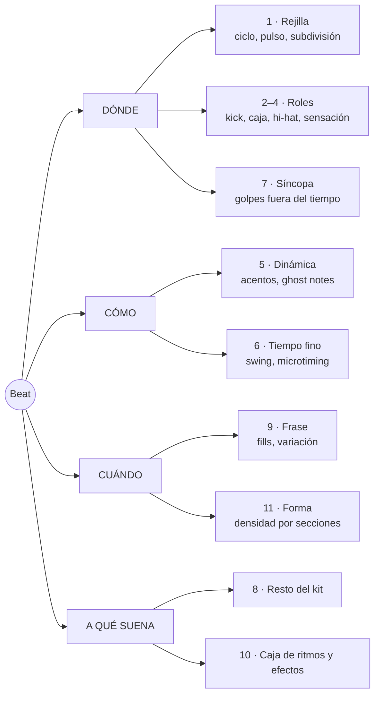

# Beats con Strudel, desde cero

> [!abstract] Qué es esta guía
> Cómo se arma un beat, pieza por pieza: qué hace cada instrumento de la batería,
> dónde cae, con qué fuerza, con qué microtiempo, y cómo se convierte en la forma
> de una canción. Cada idea trae un bloque de Strudel para oírla y termina en
> **la decisión que te deja tomar en una pieza tuya**.
>
> Es material de apoyo generado por IA. La síntesis, o sea qué es un beat *para ti*,
> va en tu nota de concepto [[1. Teoría/6. Ritmo/0. Introducción]], y esa la escribes tú.

> [!tip] Cómo usarla
> - Dale play a cada bloque. Luego **cambia una sola cosa** y vuelve a escuchar. Si cambias tres, no sabes cuál hizo qué.
> - Para silenciar una capa, coméntala con `//` al principio de la línea.
> - Los bloques suenan **en Obsidian**, porque el plugin carga las cajas de ritmo. El motor local de [[4. Instrumento/2. Strudel/README]] no carga samples, solo manda MIDI a Sonar, así que ahí un `s("bd")` no suena.
> - Sintaxis general y mini-notación completa: [[4. Instrumento/2. Strudel/0. Qué es y cómo se usa]].

---

## 0. El mapa

Un beat se reduce a cuatro preguntas: **dónde** caen los golpes, **cómo** caen,
**cuándo** cambian y **a qué** suenan. La guía sigue ese orden.



---

## 1. La rejilla: ciclo, pulso y subdivisión

### 1.1 Un ciclo = un compás

Strudel no mide en BPM, mide en **ciclos**. Todo lo que escribas dentro de
unas comillas se reparte a lo largo de un ciclo. La convención de esta guía y
de tus plantillas es **un ciclo = un compás**:

| Métrica | Pulsos por compás | Tempo en Strudel |
|---|---:|---|
| 4/4 | 4 negras | `setcpm(BPM/4)` |
| 3/4 | 3 negras | `setcpm(BPM/3)` |
| 6/8 | 2 negras con punto | `setcpm(BPM/2)`, con el BPM de la negra con punto |
| 12/8 | 4 negras con punto | `setcpm(BPM/4)`, con el BPM de la negra con punto |
| 5/4 | 5 negras | `setcpm(BPM/5)` |

`cpm` significa *cycles per minute*. A 80 BPM en 4/4 caben 20 compases por
minuto, así que `setcpm(80/4)`.

```strudel
setcpm(80/4)     // 80 BPM · 1 ciclo = 1 compás de 4/4
s("hh*4")        // cuatro golpes por ciclo: el pulso, en negras
```

### 1.2 Subdivisión: en cuántas partes cortas el pulso

El **pulso** es donde darías palmas. La **subdivisión** es en cuántos trozos
cortas cada pulso. Es la rejilla sobre la que caen todos los golpes.

```text
negras        1       2       3       4
corcheas      1   &   2   &   3   &   4   &
semicorcheas  1 e & a 2 e & a 3 e & a 4 e & a
tresillos     1 - -   2 - -   3 - -   4 - -
```

`1 e & a` se lee "uno-i-y-a". Es la forma estándar de contar semicorcheas en
batería y la que vas a ver en cualquier transcripción.

Escucha la escalera, con el kick marcando el pulso para no perderte. Cada
compás cambia la subdivisión del hi-hat: negras, corcheas, semicorcheas, tresillos.

```strudel
setcpm(80/4)
s("bd*4, hh*<4 8 16 12>")
  .bank("RolandTR909")
```

El tempo no cambió en ningún momento. Lo que cambió es cuánto **parece** correr.

### 1.3 Escribir en la rejilla: una caja por tiempo

Lo mínimo de mini-notación para beats:

| Escribes | Significa |
|---|---|
| `"bd sd bd sd"` | cuatro pasos iguales en el ciclo |
| `~` | silencio: un paso vacío |
| `[ ]` | mete varios pasos dentro de uno |
| `*n` | repite n veces dentro del paso |
| `,` | capas simultáneas |
| `< >` | uno distinto en cada ciclo, o sea en cada compás |

**La convención que te conviene:** escribe **un grupo `[ ]` por tiempo, con
cuatro posiciones dentro**. Así el texto *es* la rejilla de semicorcheas
(4 × 4 = 16 pasos), y mover un golpe es mover un carácter.

Estos tres compases alternan. Los dos primeros **suenan idéntico**: son el mismo
ritmo escrito corto y escrito en rejilla. El tercero mueve un solo kick a la
"a" del 2.

```strudel
setcpm(80/4)
s(cat(
  "bd ~ bd ~",                                  // corto
  "[bd ~ ~ ~] [~ ~ ~ ~] [bd ~ ~ ~] [~ ~ ~ ~]",  // en rejilla: suena igual
  "[bd ~ ~ ~] [~ ~ ~ bd] [bd ~ ~ ~] [~ ~ ~ ~]", // un kick movido a la "a" del 2
)).bank("RolandTR909")
```

`cat(a, b, c)` toca `a` en el primer ciclo, `b` en el segundo y `c` en el
tercero, y vuelve a empezar. Es la forma más legible de comparar compases.

> [!tip] Qué decide en tu pieza
> La subdivisión más fina que uses fija la **velocidad aparente**. A 70 BPM con
> semicorcheas la pieza corre; a 110 BPM con negras, flota. Antes de mover el
> tempo, prueba a mover la subdivisión.

---

## 2. Los tres roles: kick, caja y hi-hat

Una batería es un coro de tres voces. Igual que en tus corales, cada voz tiene
**registro** y **función**, y si dos hacen lo mismo, sobra una.

| Pieza | En Strudel | Registro | Función | La pregunta que contesta |
|---|---|---|---|---|
| **Kick** (bombo) | `bd` | grave | peso, apoyo | ¿dónde se apoya el cuerpo? |
| **Caja** (snare) | `sd`, o palmas `cp`, o aro `rim` | medio | respuesta, acento | ¿dónde contesta la frase? |
| **Hi-hat** | `hh` cerrado, `oh` abierto | agudo | reloj, subdivisión | ¿a qué velocidad corre el tiempo? |

Construye el beat más básico del pop y el rock capa por capa. Escucha cada
bloque antes de pasar al siguiente.

**Solo kick**, en 1 y 3: ya hay un suelo, pero no hay frase.

```strudel
setcpm(90/4)
s("bd ~ bd ~").bank("RolandTR909")
```

**Más caja**, en 2 y 4: ahora hay pregunta y respuesta.

```strudel
setcpm(90/4)
stack(
  s("bd ~ bd ~"),     // kick: 1 y 3
  s("~ sd ~ sd"),     // caja: 2 y 4
).bank("RolandTR909")
```

**Más hi-hat**, en corcheas: ahora hay un reloj que dice a qué velocidad vive la música.

```strudel
setcpm(90/4)
stack(
  s("bd ~ bd ~"),     // kick: 1 y 3
  s("~ sd ~ sd"),     // caja: 2 y 4
  s("hh*8"),          // hi-hat: corcheas
).bank("RolandTR909")
```

Así se ve en la rejilla. **Aprende a leer y escribir esta tabla**: es como se
anotan los beats en cualquier caja de ritmos, y es lo que vas a transcribir de oído.

```text
        1 e & a 2 e & a 3 e & a 4 e & a
hh      x . x . x . x . x . x . x . x .
caja    . . . . x . . . . . . . x . . .
kick    x . . . . . . . x . . . . . . .
```

> [!note] `stack` o `$:`
> `stack(a, b, c)` es lo mismo que escribir tres líneas que empiecen con `$:`.
> Aquí se usa `stack` porque es lo que usan tus plantillas ([[strudel — capas]]).
> `.bank()` al final del `stack` aplica la misma caja de ritmos a todas las capas.

> [!tip] Qué decide en tu pieza
> Antes de escribir un solo golpe, decide **quién lleva el pulso**. En pop lo
> lleva el hi-hat. En una balada triste puede que no lo lleve nadie, y ese
> vacío también es una decisión.

---

## 3. El backbeat: por qué la caja va en 2 y 4

En 4/4 los tiempos 1 y 3 son **fuertes** y el 2 y el 4 son **débiles** (la
jerarquía fuerte-débil de [[1. Teoría/6. Ritmo/0. Introducción]]). El backbeat
hace algo a propósito contradictorio: pone el golpe más brillante, la caja, en
los tiempos débiles. El kick dice dónde está el suelo y la caja contesta a
contratiempo del peso. Esa contradicción es la que hace que el cuerpo se mueva.

En casi todo el pop, rock y folk **la caja no se mueve y el kick sí**. Estas
son cuatro colocaciones de kick sobre la misma caja, un compás cada una:

```text
        1 e & a 2 e & a 3 e & a 4 e & a
A       x . . . . . . . x . . . . . . .     1 y 3: el básico
B       x . . . . . . . . . x . . . . .     1 y "&" del 3: el más usado en pop
C       x . . . . . x . x . . . . . . .     1, "&" del 2 y 3: empuja hacia el 3
D       x . . x . . . . . . x . . . . .     1, "a" del 1 y "&" del 3: rebota
```

```strudel
setcpm(90/4)
stack(
  s(cat(
    "bd ~ bd ~",               // A
    "bd ~ [~ bd] ~",           // B
    "bd [~ bd] bd ~",          // C
    "[bd ~ ~ bd] ~ [~ bd] ~",  // D
  )),
  s("~ sd ~ sd"),
  s("hh*8"),
).bank("RolandTR909")
```

> [!tip] Qué decide en tu pieza
> Si mueves el kick, cambias de canción. Si mueves la caja fuera de 2 y 4,
> cambias de sensación (siguiente sección). Cuando un beat "no funciona", casi
> siempre es el kick.

---

## 4. La sensación: half-time, normal y double-time

Con **el mismo BPM** puedes hacer que una música se sienta la mitad de lenta o
el doble de rápida. Lo que manda es **cada cuánto cae la caja**.

| Sensación | Caja | Se siente | Dónde vive |
|---|---|---|---|
| **Half-time** | solo en el 3 | pesada, lenta, grande | baladas tristes, dream pop, post-rock, trap |
| **Normal** | 2 y 4 | caminar | casi todo |
| **Double-time** | en cada "&" | urgente, despega | coros que suben sin cambiar de tempo |

```text
half-time
        1 e & a 2 e & a 3 e & a 4 e & a
hh      x . x . x . x . x . x . x . x .
caja    . . . . . . . . x . . . . . . .
kick    x . . . . . . . . . . . . . . .

double-time
hh      x x x x x x x x x x x x x x x x
caja    . . x . . . x . . . x . . . x .
kick    x . . . x . . . x . . . x . . .
```

Dos compases de cada una, sin tocar el tempo:

```strudel
setcpm(84/4)

const normal = stack(s("bd ~ bd ~"), s("~ sd ~ sd"),  s("hh*8"))
const media  = stack(s("bd ~ ~ ~"),  s("~ ~ sd ~"),   s("hh*8"))
const doble  = stack(s("bd*4"),      s("[~ sd]*4"),   s("hh*16"))

arrange(
  [2, normal],
  [2, media],
  [2, doble],
).bank("RolandTR909")
```

`arrange([n, patrón], …)` toca cada patrón durante `n` compases y luego pasa al
siguiente. Vuelve a aparecer en la sección 11 para armar la forma.

> [!tip] Qué decide en tu pieza
> Puedes pasar de verso a coro **sin tocar el BPM**: verso en half-time y coro
> en normal, o al revés. Es la herramienta de contraste más fuerte que tiene la
> batería, y la más barata.

---

## 5. Dinámica: no todos los golpes pesan lo mismo

Una batería real nunca golpea dos veces igual. En Strudel la fuerza de cada
golpe se controla con **`.velocity()`**, de 0 a 1. Usa `velocity` para la fuerza
de cada golpe y `gain` para el volumen de toda la capa.

La clave está en cómo se reparten los valores. `.velocity("1 .5")` sobre ocho
hats **no** alterna: da `1` a la primera mitad del compás y `.5` a la segunda.
Para alternar, el patrón de valores tiene que tener la misma rejilla que los
golpes: `"[1 .5]*4"` son ocho valores para ocho hats.

### 5.1 Acentos

Primer compás, todos los hats iguales. Segundo compás, fuerte en el tiempo y
débil en el "&".

```strudel
setcpm(90/4)
stack(
  s("bd ~ [~ bd] ~"),
  s("~ sd ~ sd"),
  s("hh*8").velocity("<1 [1 .5]*4>"),
).bank("RolandTR909")
```

### 5.2 Ghost notes

Son golpes de caja **casi inaudibles** entre los backbeats. No se escuchan como
notas; se escuchan como *movimiento*. En la rejilla, `X` es fuerte, `x` es medio
y `g` es ghost:

```text
        1 e & a 2 e & a 3 e & a 4 e & a
hh      X . x . X . x . X . x . X . x .
caja    . . . g X . g . . g . . X . . g
kick    X . . . . . . . . . X . . . . .
```

El primer compás va sin ghosts y el segundo con ellos. Escucha que el segundo
"camina" más aunque apenas se oigan.

```strudel
setcpm(88/4)
stack(
  s("bd ~ [~ bd] ~"),
  s("~ sd ~ sd"),
  s("[~ ~ ~ sd] [~ ~ sd ~] [~ sd ~ ~] [~ ~ ~ sd]")
    .velocity(.2)
    .mask("<0 1>"),                        // compás 1 sin ghosts, compás 2 con ghosts
  s("hh*8").velocity("[.9 .5]*4"),
).bank("RolandTR909")
```

`.mask("<0 1>")` deja pasar la capa solo donde hay un `1`. Es un interruptor por
compás, y sirve para cualquier comparación A/B.

### 5.3 Humanizar

`rand.range(a, b)` da un valor al azar entre `a` y `b` en cada golpe:

```strudel
setcpm(90/4)
stack(
  s("bd ~ [~ bd] ~"),
  s("~ sd ~ sd"),
  s("hh*8").velocity(rand.range(.55, .9)),
).bank("RolandTR909")
```

> [!note] El azar de Strudel se repite
> Es determinista: depende de la posición en el tiempo, así que cada vez que le
> das play suena igual. Eso es bueno, porque puedes volver a una versión que te gustó.

> [!tip] Qué decide en tu pieza
> Una batería con todos los golpes iguales suena a máquina aunque el ritmo sea
> bueno. La pregunta es cuál es el golpe importante de cada tiempo. Ese va
> fuerte y el resto no.

---

## 6. Tiempo fino: swing y microtiming

### 6.1 Swing

Swing es **atrasar la segunda corchea de cada par**. En recto, el "&" cae justo
a la mitad del tiempo. Con swing completo, cae en el último tercio, como un
tresillo con el hueco del medio vacío.

```text
un tiempo partido en 6:  | 1 . . . . . | 2 . . . . . |
recto                    | x . . x . . | x . . x . . |   "&" en la mitad
swing de tresillo        | x . . . x . | x . . . x . |   "&" en el último tercio
```

En Strudel: **`.swingBy(cantidad, n)`**

- **cantidad**: `0` es recto y `.33` es tresillo completo (shuffle). Todo lo que
  queda en medio es "algo de swing".
- **n**: cuántos pares hay por compás. `4` hace swing de corcheas y `8` de semicorcheas.
- Atajo: `.swing(4)` es `.swingBy(1/3, 4)`.

Primer compás recto, segundo con swing de tresillo:

```strudel
setcpm(90/4)
stack(
  s("bd ~ [~ bd] ~"),
  s("~ sd ~ sd"),
  s("hh*8").velocity("[.9 .5]*4"),
).bank("RolandTR909")
 .swingBy("<0 .33>", 4)
```

El swing se escribe también **directamente en la rejilla de tresillos**. Este
bloque suena igual que el compás con swing de arriba (`.33` se queda a un milisegundo del tresillo exacto):

```strudel
setcpm(90/4)
stack(
  s("bd ~ [~ bd] ~"),
  s("~ sd ~ sd"),
  s("[hh ~ hh]*4"),       // cada tiempo en 3: golpe, hueco, golpe
).bank("RolandTR909")
```

Si vienes del mundo de los samplers (MPC), el swing se expresa en porcentaje.
La conversión es `cantidad = 2 × (porcentaje − 0.5)`:

| Swing MPC | `swingBy` | Se siente |
|---:|---:|---|
| 50 % | `0` | recto, cuantizado |
| 54 % | `.08` | apenas, pero ya no es máquina |
| 58 % | `.16` | relajado |
| 62 % | `.24` | hip-hop con swing marcado |
| 66 % | `.33` | shuffle, tresillo completo |

### 6.2 Microtiming: tocar detrás del tiempo

No todo es rejilla. Atrasar **una sola capa** unos milisegundos cambia el peso
de todo el beat. Una caja un poco tarde suena perezosa y pesada; es lo que en
hip-hop y neo-soul se llama *tocar detrás del tiempo*.

`.late(x)` atrasa `x` ciclos. Como aquí un ciclo es un compás, en 4/4 la cuenta es:

> **milisegundos = x × 240 000 / BPM**. A 90 BPM, `.late(.012)` ≈ 32 ms.

Primer compás con la caja a tiempo, segundo con la caja atrasada:

```strudel
setcpm(90/4)
stack(
  s("bd ~ [~ bd] ~"),
  s("~ sd ~ sd").late("<0 .012>"),
  s("hh*8").velocity("[.9 .5]*4"),
).bank("RolandTR909")
```

`.early(x)` hace lo contrario: un hi-hat adelantado empuja la música hacia adelante.

> [!tip] Qué decide en tu pieza
> El swing funciona como un dial emocional. En recto suena tenso, moderno,
> mecánico; con swing completo, relajado, bailable, antiguo. Casi todo lo
> que suena humano vive entre los dos. Y una caja atrasada hace que la misma
> canción pese más sin cambiar una sola nota.

---

## 7. Síncopa: el kick fuera del tiempo

Un golpe es **sincopado** cuando cae en una parte débil y no le sigue otro en la
parte fuerte siguiente, así que el acento se adelanta. Es la base de
[[2. Cursos/1. Cresciente/2C. Síncopa y polirritmia/Estudios/0. Actividad 2C — creando música sincopada]].
En batería, casi siempre la síncopa la lleva el kick.

### 7.1 Ritmos euclidianos

`"bd(k,n)"` reparte **k golpes en n pasos, lo más uniforme posible**. Resulta que
esa regla matemática produce muchas de las claves tradicionales del mundo.

```text
bd(3,8)      x . . x . . x .     tresillo, 3+3+2
bd(5,8)      x . x x . x x .     cinquillo
bd(3,8,2)    x . x . . x . .     el tresillo rotado: 2+3+3
```

El tercer número **rota** el patrón. El tresillo es la misma célula de
[[1. Teoría/6. Ritmo/1. Motivos rítmicos]], ahora en el kick y contra un backbeat:

```strudel
setcpm(95/4)
stack(
  s("bd(3,8)"),                        // tresillo en el kick
  s("~ sd ~ sd"),                      // backbeat normal
  s("hh*8").velocity("[.7 .4]*4"),
).bank("RolandTR808")
```

Cambia `(3,8)` por `(5,8)`, por `(3,8,2)` o por `(5,16)` y escucha cómo la misma
caja de fondo aguanta ritmos muy distintos encima.

> [!tip] Qué decide en tu pieza
> La síncopa del kick es el **empuje** de una sección. Un verso con el kick en
> los tiempos y un coro con el kick sincopado se sienten distintos aunque la caja
> y los acordes no cambien.

---

## 8. El resto del kit

| Pieza | En Strudel | Su trabajo típico |
|---|---|---|
| Hi-hat abierto | `oh` | respiración en los "&"; con `.cut(1)` el cerrado lo corta, como un hi-hat de verdad |
| Palmas | `cp` | backbeat alternativo, o doblando la caja |
| Aro / cross-stick | `rim` | backbeat suave: baladas, versos, intimidad |
| Toms | `lt` `mt` `ht` | fills; patrones tribales |
| Crash | `cr` | marca el primer tiempo de una sección |
| Ride | `rd` | sustituye al hi-hat en los coros: más brillo, más aire |
| Shaker, pandereta | `sh`, `tb` | textura en semicorcheas, bajito y a un lado |
| Cencerro, otros | `cb`, `perc` | color |

No todos los bancos tienen todas las piezas (ver 10.1).

```strudel
setcpm(96/4)
stack(
  s("bd ~ [~ bd] ~").bank("RolandTR808"),
  s("~ rim ~ rim").bank("RolandTR808"),           // aro en vez de caja: backbeat suave
  s("[hh oh]*4").cut(1).bank("RolandTR808"),       // abierto en cada "&"; el cerrado lo corta
  s("shaker_small*16")                             // shaker acústico: sin .bank()
    .velocity("[.5 .2 .35 .2]*4")
    .pan(.7),                                      // 0 izquierda · .5 centro · 1 derecha
)
```

Quita `.cut(1)` y escucha cómo el hat abierto se queda sonando encima de todo.

> [!warning] `.bank()` y los sonidos sueltos
> `.bank("RolandTR808")` solo antepone el nombre del banco: `hh` pasa a ser
> `RolandTR808_hh`. Si lo pones al final de un `stack` que tiene una capa de otro
> sitio (`shaker_small`, un sintetizador…), esa capa busca `RolandTR808_shaker_small`,
> no la encuentra y **no suena**. En ese caso pon el banco capa por capa, como arriba.

> [!tip] Qué decide en tu pieza
> Cada pieza extra tiene que tener un trabajo. Si no puedes decir cuál es, quítala.

---

## 9. La frase: fills y variación

Los beats piensan en **frases de 4 compases**, igual que la melodía (ver
[[1. Teoría/5. Forma/2. Composición binaria — contraste, intro y puente]]).
Tres compases establecen y el cuarto anuncia que algo viene. Ese anuncio es el **fill**.

```text
compás     1          2          3          4
           crash      ·          ·          FILL  →  (compás 1 de la frase siguiente)
           establece  confirma   confirma   anuncia
```

```strudel
setcpm(90/4)
stack(
  s("<cr ~ ~ ~>"),                                  // crash solo en el compás 1 de cada 4
  s("bd ~ [~ bd] ~")
    .lastOf(4, x => x.mask("1 1 0 0")),             // el kick deja sitio al fill
  s(cat(
    "~ sd ~ sd",
    "~ sd ~ sd",
    "~ sd ~ sd",
    "~ sd [ht ht mt mt] [lt lt sd sd]",             // compás 4: el fill en toms
  )),
  s("hh*8").velocity("[.8 .4]*4")
    .lastOf(4, x => x.mask("1 1 0 0")),             // los hats se callan durante el fill
).bank("RolandTR909")
```

| Herramienta                       | Qué hace                                | Para qué                              |
| --------------------------------- | --------------------------------------- | ------------------------------------- |
| `"<a b c d>"` o `cat(a, b, c, d)` | un compás distinto por ciclo            | fills escritos a mano                 |
| `.lastOf(n, f)`                   | aplica `f` al último de cada n compases | fill por transformación               |
| `.firstOf(n, f)` (o `.every`)     | aplica `f` al primero de cada n         | variación al abrir la frase           |
| `.ply(n)`                         | repite cada golpe n veces               | redobles: `.lastOf(4, x => x.ply(2))` |
| `.degradeBy(p)`                   | quita golpes al azar con probabilidad p | hi-hats que respiran                  |
| `.sometimesBy(p, f)`              | aplica `f` a algunos golpes             | variación que no escribiste           |
| `hh*8?`                           | cada golpe tiene 50 % de sonar          | lo mismo, en mini-notación            |


Variación sin escribir un solo compás nuevo:

```strudel
setcpm(90/4)

stack(
	stack(
	  s("bd ~ [~ bd] ~"),
	  s("~ sd ~ sd").lastOf(4, x => x.ply(2)),                    // redoble en el compás 4
	  s("hh*16").velocity("[.7 .3 .5 .3]*4").degradeBy(.25),       // hats que respiran
	).bank("RolandTR909"),
)

```

> [!tip] Qué decide en tu pieza
> El fill es una señal que dice "algo va a cambiar". Si hay fill cada cuatro
> compases y nunca cambia nada, la señal se gasta. **Pon los fills donde la forma
> cambia**, no donde toca por calendario.

---

## 10. El sonido: la caja de ritmos y cómo esculpirla

### 10.1 Elegir la caja

El banco decide **la época y el género** antes que el patrón. Estos son los que
carga tu plugin y que vale la pena conocer:

| Banco | Carácter | Suele vivir en |
|---|---|---|
| *(sin `.bank()`)* | **E-mu SP-12**: sampler de 12 bits, sucio, con pegada | boom bap, hip-hop de los 80–90 |
| `RolandTR808` | kick largo y grave, casi un bajo; caja fina; palmas | hip-hop, trap, R&B lento, pop triste |
| `RolandTR909` | seco, con pegada, hats brillantes | house, techno, pop electrónico |
| `LinnDrum` | caja con cuerpo, sonido de los 80 | pop de los 80, synth-pop |
| `RolandCompurhythm78` | la CR-78: cálida, antigua, casi de juguete | dream pop, indie, electrónica vintage |
| `KorgMinipops` | preset de órgano de los 70: frágil y lejano | dream pop, lo-fi |
| `RhythmAce` | caja de ritmos de los 60 | vintage, lo-fi |
| `CasioVL1` | un juguete | lo-fi extremo, humor |
| *acústicos, sin banco* | `bassdrum2` (bombo de concierto), `clap`, `tambourine`, `shaker_small`, `cajon`, `framedrum`, `snare_rim`, `woodblock` | folk, orgánico |

Hay 71 bancos en total. Las piezas que **faltan** en algunos:

| Banco | No tiene |
|---|---|
| sin banco (SP-12) | `sh`, `tb` |
| `RolandTR909` | `sh`, `tb`, `cb` |
| `RolandCompurhythm78` | `rim`, `cp`, toms, `cr`, `rd`, `sh` |
| `KorgMinipops` | todo salvo `bd` `sd` `hh` `oh` |

Además, **el número después de `:` elige la variante**: el 808 trae 25 cajas
distintas, y `s("~ sd:3 ~ sd:3")` usa la cuarta (se cuenta desde 0).

El mismo beat pasando por seis cajas, dos compases cada una:

```strudel
setcpm(84/4)

const beat = stack(
  s("bd ~ [~ bd] ~"),
  s("~ sd ~ sd"),
  s("hh*8").velocity("[.8 .4]*4"),
)

arrange(
  [2, beat],                                // sin banco: E-mu SP-12
  [2, beat.bank("RolandTR808")],
  [2, beat.bank("RolandTR909")],
  [2, beat.bank("LinnDrum")],
  [2, beat.bank("RolandCompurhythm78")],
  [2, beat.bank("KorgMinipops")],
)
```

Puedes mezclar bancos: cada capa lleva el suyo. Un kick de 808 con una caja de
LinnDrum es un truco de producción muy común.

### 10.2 Esculpir

| Función | Qué hace | En un beat |
|---|---|---|
| `.lpf(hz)` | pasa-bajos: quita brillo | beat oscuro, lejano, tras una pared |
| `.hpf(hz)` | pasa-altos: quita grave | hats finos; beat "de radio"; deja sitio al bajo |
| `.room(0–1)` y `.roomsize(n)` | reverb: cuánta y qué tan grande | espacio; dream pop |
| `.delay(0–1)` | eco | aro o caja que se repiten a lo lejos |
| `.shape(0–1)` | saturación | pegada, calidez |
| `.crush(bits)` | menos bits: 16 limpio, 4 destruido | lo-fi |
| `.speed(n)` | velocidad del sample, y con ella el tono | por debajo de 1 suena más grave y más lento, como cinta |
| `.pan(0–1)` | panorama | percusión a los lados |

El sonido **dream pop**: caja de ritmos vieja, lenta, con la caja muy lejos.

```strudel
setcpm(72/4)
stack(
  s("bd ~ [~ bd] ~").lpf(900),                            // kick redondo, sin clic
  s("~ sd ~ sd").velocity(.7).room(.8).roomsize(7),       // la caja se va lejos
  s("hh*8").velocity("[.45 .2]*4").hpf(5000),             // hats finos, casi aire
).bank("RolandCompurhythm78")
```

> [!warning] La reverb no va en el kick
> Mucha reverb en el kick convierte el grave en barro. La reverb va arriba (caja,
> aro, hats) y el kick se queda seco y cerca.

> [!tip] Qué decide en tu pieza
> El mismo patrón en 909 es una pista de baile; en CR-78 con la caja lejos es un
> recuerdo. **Elige el sonido al final**: si el patrón no funciona seco, la
> reverb no lo va a arreglar.

---

## 11. El beat dentro de la canción

### 11.1 Kick y bajo: una sola decisión

El kick y el bajo comparten registro. O se **abrazan** (tocan juntos) o se
**turnan** (el bajo en los huecos del kick). Si ninguna de las dos cosas es
deliberada, se pisan.

La forma más limpia de abrazarlos es que compartan **el mismo ritmo**, escrito
una sola vez:

```strudel
setcpm(84/4)

const golpes = "x ~ ~ x ~ ~ x ~"                  // un solo ritmo, compartido

stack(
  stack(
    s("bd").struct(golpes),
    s("~ sd ~ sd"),
    s("hh*8").velocity("[.6 .3]*4"),
  ).bank("RolandTR808"),                          // el banco solo para la batería
  note("a1").struct(golpes)                       // una sola nota: aquí importa el ritmo
    .s("sawtooth").lpf(300),
)
```

`.struct(golpes)` le pone a una capa el ritmo de `golpes` (cada `x` es un golpe).
Cambias `golpes` y el kick y el bajo se mueven juntos.

Es la prueba de tu [[2. Cursos/1. Cresciente/Cierre de módulo 2/Estudios/0. Proyecto 2 — comencemos por el ritmo]]:
**solo el bajo con la percusión deberían bastar para que la música exista.**

### 11.2 La forma por densidad

La batería es lo que más barato cambia la forma. Cada sección tiene un nivel de
densidad, y la canción es la curva que dibujan:

```text
densidad
  alta   │                    ██████████            ██████████
  media  │          ██████████                                   
  baja   │██████████                    ██████████               
         └──────────────────────────────────────────────────────
           intro     verso      coro       puente     coro
           solo hats kick+aro   todo+crash half-time  todo+crash
```

```strudel
setcpm(80/4)

const kick     = s("bd ~ [~ bd] ~")
const caja     = s("~ sd ~ sd")
const aro      = s("~ rim ~ rim")
const hats     = s("hh*8").velocity("[.6 .3]*4")
const abiertos = s("[hh oh]*4").cut(1).velocity(.6)
const crash    = s("<cr ~ ~ ~>")
const media    = stack(s("bd ~ ~ ~"), s("~ ~ sd ~"), hats)

arrange(
  [4, hats],                                   // intro: solo el reloj
  [4, stack(kick, aro, hats)],                 // verso: suave, con aro
  [4, stack(crash, kick, caja, abiertos)],     // coro: todo, hats abiertos
  [4, media],                                  // puente: half-time
  [4, stack(crash, kick, caja, abiertos)],     // coro
).bank("RolandTR909")
```

La plantilla vacía para esto es [[strudel — secciones]].

> [!tip] Qué decide en tu pieza
> Antes de escribir una sección nueva, prueba a **cambiar solo la batería**:
> quitar el kick, pasar a half-time, cambiar caja por aro, abrir los hats. A
> menudo la sección que buscabas ya estaba, solo que con otra batería.

---

## 12. Arquetipos: vocabulario para reconocer

No son plantillas para tu pieza. Sirven para **escuchar qué decisión toma cada
género**: cuando oigas uno en una canción, vas a poder nombrarlo y transcribirlo.

| Arquetipo | Kick | Caja | Hat | Tiempo fino | Banco típico |
|---|---|---|---|---|---|
| Pop / rock | 1 y 3, con variaciones | 2 y 4 | corcheas | recto | cualquiera |
| Half-time | 1 | 3 | corcheas | recto | 808, acústico |
| Four on the floor | los 4 tiempos | palmas 2 y 4 | abierto en los "&" | recto | 909 |
| Boom bap | sincopado | 2 y 4 | semicorcheas | swing de 16 | SP-12 |
| Folk stomp-clap | pisotón 1 y 3 | palmas 2 y 4 | pandereta | recto, humano | acústico |
| Dream pop | escaso | lejana, con reverb | suaves | recto | CR-78, Minipops |
| Balada 6/8 | 1 | aro en el 4 | corcheas | recto | LinnDrum, acústico |
| 5/4 | abre cada grupo | cierra cada grupo | corcheas | recto | cualquiera |

**Pop / rock** y **half-time** están en las secciones 2 y 4. **Dream pop** está en 10.2.

### Four on the floor

El kick en cada tiempo, como un corazón; lo que se mueve está arriba.

```strudel
setcpm(120/4)
stack(
  s("bd*4"),
  s("~ cp ~ cp"),
  s("[~ oh]*4").velocity(.6),
).bank("RolandTR909")
```

### Boom bap

Kick sincopado, semicorcheas con swing y el polvo del sampler.

```text
        1 e & a 2 e & a 3 e & a 4 e & a
hh      X x x x X x x x X x x x X x x x
caja    . . . . X . . . . . . . X . . .
kick    X . . . . . . x . . X . . . . .
```

```strudel
setcpm(88/4)
stack(
  s("[bd ~ ~ ~] [~ ~ ~ bd] [~ ~ bd ~] [~ ~ ~ ~]"),
  s("~ sd ~ sd"),
  s("hh*16").velocity("[.7 .25 .45 .25]*4"),
).swingBy(.2, 8)          // swing de semicorcheas, ~60 % de MPC
 .crush(10).lpf(4000)     // el polvo del sampler
```

### Folk stomp-clap

Pisotones, palmas y pandereta, el esqueleto de la escena de The Lumineers. Se
puede tocar con el cuerpo, y por eso suena a gente en una habitación.

```strudel
setcpm(76/4)
stack(
  s("bassdrum2 ~ bassdrum2 ~").velocity(.9),       // pisotón: 1 y 3
  s("~ clap ~ clap"),                              // palmas: 2 y 4
  s("tambourine*8").velocity("[.5 .25]*4"),        // pandereta en corcheas
).room(.2)                                         // una habitación, no un estadio
```

### Dream pop

La caja de ritmos barata, lenta y con mucha reverb que Beach House usó tanto
en sus primeros discos. El bloque está en 10.2. Pruébalo también con
`KorgMinipops` y `RhythmAce`.

### Balada en 6/8

Dos pulsos de tres corcheas por compás. Es el balanceo de las canciones de cuna,
del vals lento y de mucha música triste.

```text
        1 . . 2 . .
hh      x x x x x x
aro     . . . x . .
kick    x . . . . .
```

```strudel
setcpm(52/2)                                   // 6/8 a 52 negras con punto
stack(
  s("bd ~ ~ ~ ~ ~"),
  s("~ ~ ~ rim ~ ~").room(.4),
  s("hh*6").velocity("[.6 .25 .35]*2"),
).bank("LinnDrum")
```

Para **12/8**, que es la métrica de tu nocturno, usa `setcpm(BPM/4)` y 12 pasos por compás.

### 5/4

Cinco tiempos que el oído agrupa en **3+2** o **2+3**. La regla para la batería:
**el kick abre cada grupo y la caja lo cierra**. "15 Step" de Radiohead está en 5/4.

```text
             1 2 3 4 5
3+2   kick   x . . x .
      caja   . . x . x
2+3   kick   x . x . .
      caja   . x . . x
```

```strudel
setcpm(120/5)                                  // 5/4 · 1 ciclo = 1 compás de 5 negras
stack(
  s(cat(
    "bd ~ sd bd sd",                           // 3+2
    "bd sd bd ~ sd",                           // 2+3
  )),                                          // una capa puede mezclar sonidos
  s("hh*10").velocity("[.6 .3]*5"),
).bank("RolandTR909")
```

---

## 13. Cómo componer un beat: el método

En orden. Cada paso responde **una** pregunta, y no pasas al siguiente hasta
contestarla.

| # | Paso | La pregunta | Ver |
|---:|---|---|---|
| 1 | Emoción → tempo y sensación | ¿half, normal o double? ¿qué BPM? | §4 |
| 2 | Kick | ¿dónde se apoya el cuerpo? Empieza en 1 y 3 y mueve **un** golpe | §3, §7 |
| 3 | Caja | ¿dónde contesta? ¿caja, palmas o aro? | §2, §8 |
| 4 | Hi-hat | ¿a qué velocidad corre el tiempo? ¿o no hay reloj? | §1 |
| 5 | Dinámica | ¿cuál es el golpe importante de cada tiempo? | §5 |
| 6 | Tiempo fino | ¿recto o swing? ¿alguna capa detrás del tiempo? | §6 |
| 7 | **Un** adorno | hat abierto, ghost o percusión: uno solo | §8 |
| 8 | Frase | ¿dónde cambia la forma? Ahí va el fill | §9 |
| 9 | Sonido | banco y efectos, **al final** | §10 |
| 10 | La prueba | solo kick y bajo: ¿sostienen la música? | §11 |

El paso 7 es tu regla de **una dificultad nueva por proyecto**, aplicada al beat.

### Errores comunes

| Síntoma | Causa probable | Arreglo |
|---|---|---|
| Suena a máquina | todos los golpes con la misma fuerza | acentos y humanizar (§5) |
| Suena lleno pero no se mueve | demasiadas capas en la misma subdivisión | cada pieza con un trabajo; quita (§8) |
| El grave es un barro | kick y bajo pisándose, o reverb en el kick | mismo `struct` o huecos complementarios; reverb solo arriba (§10, §11) |
| La balada corre | hi-hat en semicorcheas a tempo lento | baja la subdivisión o quita el hat (§1) |
| El coro no despega | la misma batería que el verso | cambia la sensación o la densidad, no el BPM (§4, §11) |
| El fill no sorprende | fill cada cuatro compases sin que cambie nada | fills solo donde la forma cambia (§9) |
| Un golpe no suena | el banco no tiene esa pieza, o `.bank()` cayó sobre una capa de otro origen | tablas de §10.1 y el aviso de §8 |

---

## 14. Ejercicios

Son instrucciones, no respuestas: el tempo, el patrón y el sonido los decides tú.

**1 · De la rejilla al código.** Escoge una de las rejillas de esta guía, tápate
el bloque y escríbela en Strudel.
*Hecho cuando* suena igual que el bloque original.

**2 · Un beat, tres sensaciones.** Escribe un beat tuyo de kick, caja y hat.
Con `arrange`, hazlo sonar en half-time, normal y double-time.
*Hecho cuando* puedes decir en una frase qué emoción sugiere cada uno y cuál
usarías en qué sección de una pieza tuya.

**3 · La escalera de swing.** Tu beat del ejercicio 2, cuatro compases, con
`swingBy` en cuatro valores distintos entre `0` y `.33`, uno por compás (usa `"< >"`).
*Hecho cuando* eliges un valor y escribes por qué es ese y no el de al lado.

**4 · Transcribir de oído.** Una canción de tus influencias. Primero la rejilla
en texto, solo kick, caja y hat; después, Strudel.
*Hecho cuando* al sonar junto a la grabación, los golpes coinciden.

**5 · Frase de cuatro.** Tu beat con crash en el compás 1 y un fill en el 4, y un
cambio real en lo que viene después.
*Hecho cuando* el fill anuncia algo, y ese algo ocurre.

**6 · Kick y bajo.** Un beat y una línea de bajo con el mismo `struct`, o con
huecos deliberadamente complementarios.
*Hecho cuando* bajo y batería solos sostienen la música.

Y el audio: **semana sin audio es semana en blanco.** Graba 30 segundos de lo que
salga, aunque esté feo. Git ignora el audio en cualquier ruta.

### Dónde va lo que hagas

La regla de ruteo de [[Inicio]], aplicada a beats:

| Si el beat… | Va a |
|---|---|
| nace de una lección (la 2C, el Proyecto 2…) | `2. Cursos/<fuente>/<lección>/Estudios/`, dentro de la nota |
| es para una pieza tuya | `3. Composiciones/<obra>/` |
| es la transcripción de una canción de otro | `5. Referencias/` |
| ninguna de las anteriores | `0. Entrada/`, y se decide en la revisión semanal |

---

## Chuleta

**Piezas:** `bd` kick · `sd` caja · `cp` palmas · `rim` aro · `hh` hat cerrado ·
`oh` hat abierto · `lt` `mt` `ht` toms · `cr` crash · `rd` ride · `sh` shaker ·
`tb` pandereta · `cb` cencerro

**Mini-notación para beats**

| | |
|---|---|
| `"[bd ~ ~ ~] [~ ~ ~ ~] …"` | un grupo por tiempo = rejilla de semicorcheas |
| `"bd(3,8)"` · `"bd(3,8,2)"` | euclidiano · rotado |
| `"sd:3"` | variante 3 del sample |
| `"bd@3 sd"` | `bd` ocupa 3 de 4 partes, así que `sd` cae en la última |
| `"bd!3 sd"` | `bd bd bd sd` |
| `"hh*8?"` | cada golpe con 50 % de sonar |
| `"<cr ~ ~ ~>"` | solo en el compás 1 de cada 4 |

**Funciones**

| | |
|---|---|
| `setcpm(BPM/4)` | tempo, con 1 ciclo = 1 compás de 4/4 |
| `stack(a, b)` · `cat(a, b)` · `arrange([n, a], …)` | capas · un compás cada uno · secciones |
| `.bank("…")` | caja de ritmos |
| `.velocity(0–1)` · `.gain()` | fuerza del golpe · volumen de la capa |
| `.swingBy(c, n)` · `.swing(n)` | swing |
| `.late(x)` · `.early(x)` | microtiming, en fracciones de compás |
| `.struct("x ~ x")` · `.mask("<1 0>")` | imponer un ritmo · interruptor por compás |
| `.lastOf(n, f)` · `.firstOf(n, f)` | transformar el último / primero de cada n |
| `.ply(n)` · `.degradeBy(p)` · `.sometimesBy(p, f)` | redoble · quitar al azar · variar al azar |
| `.cut(1)` | grupo de corte: el hat cerrado corta al abierto |
| `.lpf()` `.hpf()` `.room()` `.roomsize()` `.crush()` `.speed()` `.pan()` | esculpir |

---

## Enlaces

**En la bóveda**

- Concepto al que sirve: [[1. Teoría/6. Ritmo/0. Introducción]]
- [[1. Teoría/6. Ritmo/1. Motivos rítmicos]]: células y motivos, el tresillo
- [[1. Teoría/6. Ritmo/2. Path completo]]: el camino largo del ritmo, que termina en percusión
- Guías de ritmo: [[1. Teoría/6. Ritmo/AI/11. AI Ritmos/0. Guía integral - Ritmos y diseño de motivos]] · [[1. Teoría/6. Ritmo/AI/11. AI Ritmos/1. Guía ritmos]]
- Strudel: [[4. Instrumento/2. Strudel/0. Qué es y cómo se usa]] · plantillas [[strudel — ritmo]], [[strudel — capas]], [[strudel — secciones]]
- Donde se usa: [[2. Cursos/1. Cresciente/2C. Síncopa y polirritmia/Estudios/0. Actividad 2C — creando música sincopada]] · [[2. Cursos/1. Cresciente/Cierre de módulo 2/Estudios/0. Proyecto 2 — comencemos por el ritmo]]
- Por qué el ritmo es prioridad: [[6. Práctica/3. Diagnóstico]]

**Fuera**

- [Workshop de Strudel: primeros sonidos](https://strudel.cc/workshop/first-sounds/): el mismo camino, en inglés
- [Samples y bancos](https://strudel.cc/learn/samples/) · [Efectos](https://strudel.cc/learn/effects/) · [Mini-notación](https://strudel.cc/learn/mini-notation/)
