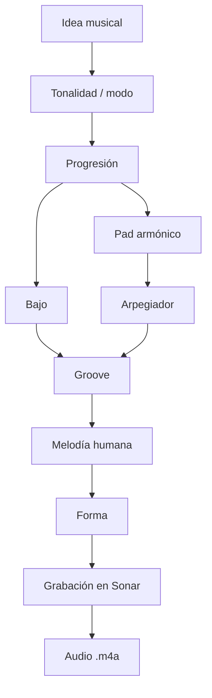
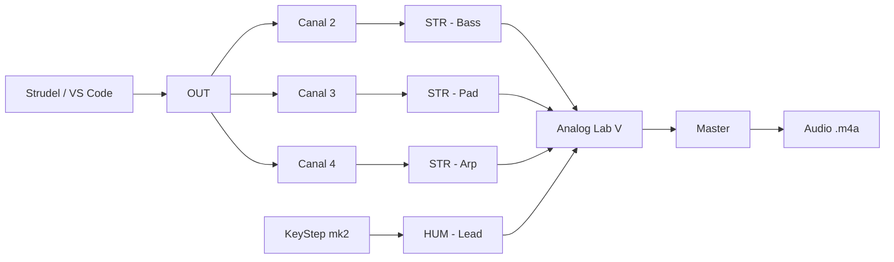
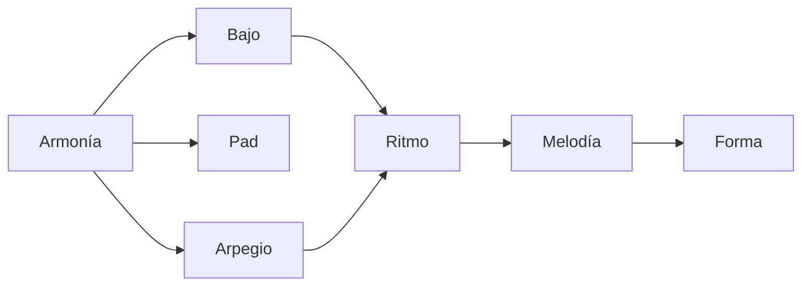
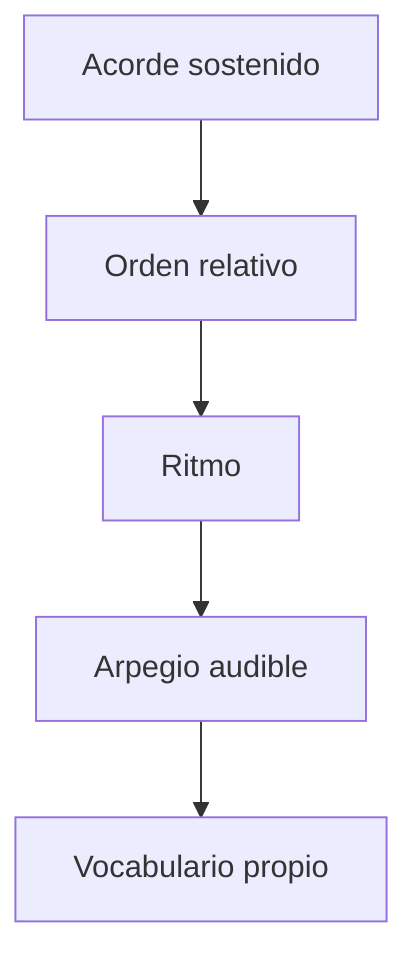

# Guía Strudel — Armonía, Melodía y Arpegiador

> [!abstract] Objetivo
> Construir una canción desde Strudel empezando por **armonía, bajo, arpegiador y melodía humana**, antes de entrar a beats, house y batería.
>
> La sesión termina en audio: un archivo `.m4a` de 30–60 segundos.

---

## 0. Mapa completo



---

## 1. Principio

Strudel no es “la canción entera”. En este sistema, Strudel funciona como **acompañante determinista**:

| Capa        | Quién decide | Quién toca         |
| ----------- | ------------ | ------------------ |
| Tonalidad   | tú           | Strudel la ejecuta |
| Progresión  | tú           | `STR - Pad`        |
| Bajo        | tú           | `STR - Bass`       |
| Arpegiador  | tú           | `STR - Arp`        |
| Melodía     | tú, tocando  | `HUM - Lead`       |
| Audio final | tú grabas    | Sonar              |

> [!important]
> En el motor local, Strudel manda MIDI a Sonar. Los bloques con `s("bd")` sirven para estudiar en Obsidian, pero en el motor local no suenan como samples.

---

## 2. Ruta de señal



| Voz  | Canal MIDI | Pista en Sonar | Función              |
| ---- | ---------: | -------------- | -------------------- |
| Bajo |          2 | `STR - Bass`   | raíz, suelo, empuje  |
| Pad  |          3 | `STR - Pad`    | color armónico       |
| Arp  |          4 | `STR - Arp`    | movimiento           |
| Lead |          — | `HUM - Lead`   | improvisación humana |

Sonar ya está documentado como el lugar donde los controladores suenan mediante pistas de instrumento con Analog Lab V. Para escuchar MIDI entrante, la pista necesita instrumento e **Input Echo** encendido.

---

## 3. Estructura mental de una canción



| Pregunta               | Decisión audible |
| ---------------------- | ---------------- |
| ¿Dónde está el centro? | tonalidad/modo   |
| ¿Qué emoción tiene?    | progresión       |
| ¿Dónde pesa el cuerpo? | bajo             |
| ¿Qué se mueve?         | arpegiador       |
| ¿Qué canto encima?     | melodía          |
| ¿Cuándo cambia?        | forma            |

---

## 4. Flujo de sesión

### Objetivo observable

Al final existe:

```text
3. Composiciones/<obra>/render/2026-09-30 armonia-arp-01.m4a
```

con:

- bajo en `STR - Bass`;
- pad en `STR - Pad`;
- arpegio en `STR - Arp`;
- una toma humana en `HUM - Lead`.

---

## 5. Antes de empezar

- [ ] Cerrar Next, MidiSuite y MIDI Control Center.
- [ ] Abrir Sonar.
- [ ] Confirmar que `STR - Bass`, `STR - Pad`, `STR - Arp` tienen Input Echo encendido.
- [ ] Confirmar que Analog Lab V escucha en **MIDI Channel = All**.
- [ ] Hacer Fase 2: `npm run prueba` → debe sonar `STR - Bass`.

---

## 6. Decisiones mínimas

No empieces programando. Primero llena esto:

| Decisión                 | Valor                                           |
| ------------------------ | ----------------------------------------------- |
| Obra activa              | `__________`                                    |
| Tonalidad / modo         | `__________`                                    |
| BPM                      | `__________`                                    |
| Progresión de 4 compases | `__________`                                    |
| Tipo de arpegio          | lento / pulse / broken / house                  |
| Lead humano              | nota larga / motivo corto / improvisación libre |

---

## 7. Partitura mínima de referencia

Esto no es para componer por partitura. Es solo para visualizar la idea: **bajo abajo, acordes arriba, arpegio como movimiento**.

```music-abc
X:1
T:Esqueleto armonia + arp
M:4/4
L:1/4
Q:1/4=120
K:C
V:1 name="Pad"
V:2 name="Bass" clef=bass
[V:1] "I"C2 "vi"Am2 | "IV"F2 "V"G2 |
[V:2] C,,4 | F,,2 G,,2 |
```

> [!note]
> Cambia los acordes. Este bloque solo muestra la relación entre capas.

---

## 8. Esqueleto Strudel

```strudel
// 1 ciclo = 1 compás en 4/4
const BPM = 120 // TÚ: cambia el tempo
setcpm(BPM/4)

// TÚ: progresión de 4 compases.
// Usa símbolos de acorde.
const PROG = "<ACORDE_1 ACORDE_2 ACORDE_3 ACORDE_4>"

// TÚ: raíces o notas de bajo.
const BASS = "<BAJO_1 BAJO_2 BAJO_3 BAJO_4>"

// TÚ: orden relativo del arpegio.
// 0 = primera nota del voicing, 1 = segunda, etc.
const ARP = "0 2 1 3 2 1"

// Bajo
$: note(BASS)
  .midichan(2)
  .midi(OUT)

// Pad
$: chord(PROG)
  .voicing()
  .midichan(3)
  .midi(OUT)

// Arpegio
$: n(ARP)
  .chord(PROG)
  .voicing()
  .midichan(4)
  .midi(OUT)
```

---

## 9. Cómo pensar el arpegiador

Un arpegiador no es solo “Up” o “Down”. Es una decisión musical con cuatro partes:

| Elemento | Pregunta                             |
| -------- | ------------------------------------ |
| Orden    | ¿qué nota del acorde suena primero?  |
| Ritmo    | ¿cada cuánto aparece una nota?       |
| Duración | ¿son notas cortas o ligadas?         |
| Registro | ¿se queda en una octava o sube/baja? |

En Sonar, un patrón de arpegiador puede guardar ritmo, orden relativo, duración y velocity. La ventaja de pensar en grados relativos es que el mismo movimiento puede aplicarse a acordes distintos.



---

## 10. Tres arpegios para probar

### A. Arpegio lento

```strudel
const ARP = "0 ~ 2 ~ 1 ~ 3 ~"
```

| Sensación  | Uso                          |
| ---------- | ---------------------------- |
| abierto    | intro, verso, dream pop      |
| poco denso | deja espacio a la voz        |
| estable    | bueno para improvisar encima |

### B. Pulse

```strudel
const ARP = "0 1 2 1 0 1 2 3"
```

| Sensación | Uso                           |
| --------- | ----------------------------- |
| mecánico  | house, synth-pop              |
| constante | crea motor                    |
| claro     | fácil de seguir con el cuerpo |

### C. Broken chord

```strudel
const ARP = "0 2 1 3 2 1"
```

| Sensación      | Uso                             |
| -------------- | ------------------------------- |
| melódico       | dream pop / indie               |
| menos cuadrado | acompaña sin sonar a ejercicio  |
| reusable       | buen candidato para vocabulario |

---

## 11. Motivo melódico humano

Antes de improvisar mucho, limita el material.

```music-abc
X:2
T:Motivo humano minimo
M:4/4
L:1/8
Q:1/4=120
K:C
C2 E2 G4 | E2 D2 C4 |
```

Regla:

| Compás | Acción           |
| -----: | ---------------- |
|      1 | tocar motivo     |
|      2 | repetir          |
|      3 | cambiar una nota |
|      4 | dejar silencio   |

---

## 12. Forma mínima

```mermaid
gantt
  title Forma de 32 compases
  dateFormat X
  axisFormat %s
  section Intro
  Pad solo           :0, 4
  section A
  Bajo + Pad         :4, 8
  section B
  Bajo + Pad + Arp   :12, 8
  section Toma humana
  Lead improvisado   :20, 8
  section Cierre
  Quitar Arp         :28, 4
```



| Sección | Compases | Capas               |
| ------- | -------: | ------------------- |
| Intro   |      1–4 | pad                 |
| A       |     5–12 | pad + bajo          |
| B       |    13–20 | pad + bajo + arp    |
| Lead    |    21–28 | todo + `HUM - Lead` |
| Cierre  |    29–32 | pad + bajo          |

---

## 13. Versión con forma en Strudel

```strudel
const BPM = 120
setcpm(BPM/4)

const PROG = "<ACORDE_1 ACORDE_2 ACORDE_3 ACORDE_4>"
const BASS = "<BAJO_1 BAJO_2 BAJO_3 BAJO_4>"
const ARP = "0 2 1 3 2 1"

const bass = note(BASS).midichan(2).midi(OUT)

const pad = chord(PROG)
  .voicing()
  .midichan(3)
  .midi(OUT)

const arp = n(ARP)
  .chord(PROG)
  .voicing()
  .midichan(4)
  .midi(OUT)

// Activa por secciones manualmente.
// Primero pad.
// Luego pad + bass.
// Luego pad + bass + arp.

$: pad
$: bass
$: arp
```

---

## 14. Registro de sesión

```markdown
# 2026-09-30 — Armonía
```
