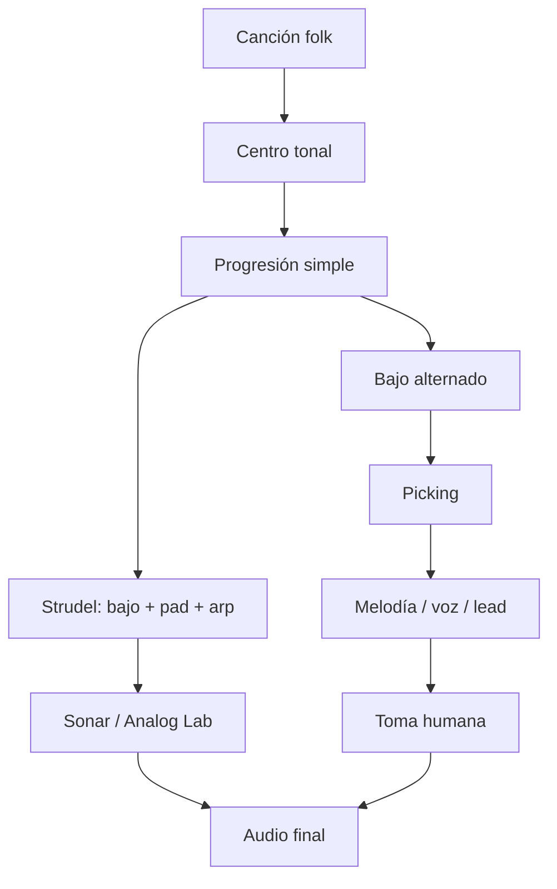
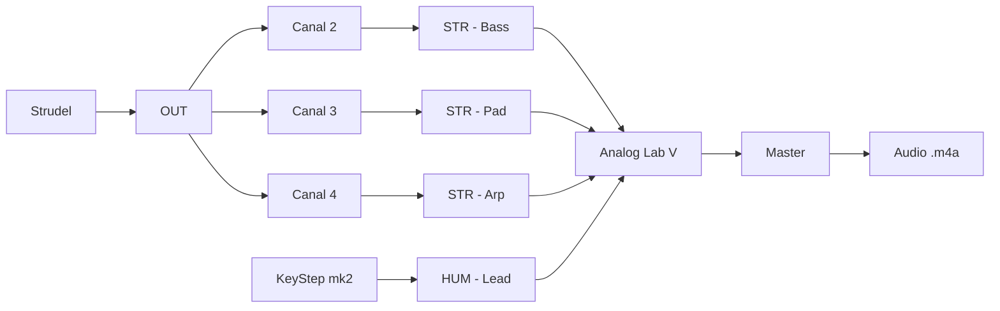
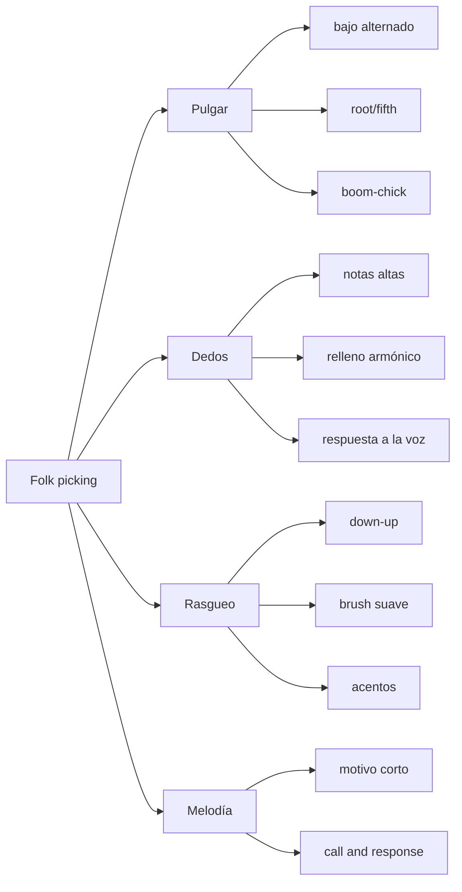

# Guía full — Folk, picking y Strudel

> [!abstract] Objetivo  
> Construir una canción folk desde cero usando:
> 
> - guitarra acústica / picking;
>     
> - Strudel como acompañante MIDI;
>     
> - bajo, pad y arpegio en Sonar;
>     
> - una toma humana que termine en audio.
>     
> 
> **Definición de hecho:** existe un `.m4a` de 30–60 segundos, aunque suene crudo.

---

## 0. Advertencia útil

Esta guía no transcribe canciones de Bob Dylan ni copia tabs. Trabaja con **gestos generales del folk**: acordes abiertos, bajo alternado, melodía encima, rasgueo imperfecto, voz o lead humano.

El enfoque acústico asociado a Dylan suele moverse entre acordes básicos rasgueados y patrones de fingerpicking en posiciones abiertas, no en armonías densas o voicings complicados.

---

## 1. Mapa general



---

## 2. Qué es folk aquí

Folk no significa “sonar viejo”. En este sistema significa:

|Elemento|Función|
|---|---|
|**Acordes abiertos**|claridad, fragilidad, aire|
|**Bajo alternado**|hace que una sola guitarra parezca tener bajo + armonía|
|**Picking repetitivo**|motor íntimo, hipnótico|
|**Melodía simple**|frase cantable, poco virtuosismo|
|**Imperfección rítmica**|humano, narrativo|
|**Forma clara**|verso, verso, coro, puente, verso|

La técnica de Travis picking se basa en que el pulgar mantiene un bajo alternado constante mientras los dedos tocan notas superiores. En folk/americana, ese bajo alternado ayuda a crear la ilusión de más de un instrumento: una línea grave y una melodía arriba.

---

## 3. Rutas posibles

### A. Ruta documentada con Sonar / Strudel



|Capa|Canal|Pista|Papel folk|
|---|---|---|---|
|Bajo|2|`STR - Bass`|raíz / pulso grave|
|Pad|3|`STR - Pad`|acorde largo|
|Arp|4|`STR - Arp`|picking programado|
|Lead humano|—|`HUM - Lead`|melodía tocada|

En Sonar, las pistas que suenan son pistas de instrumento con Analog Lab V; para escuchar MIDI entrante necesitas instrumento e **Input Echo** encendido.

### B. Ruta de guitarra real

> [!warning] Por verificar  
> La ruta de grabación de guitarra no está documentada todavía. Para una sesión real, falta decidir si grabas la guitarra con interfaz, micrófono, teléfono o grabadora.
> 
> Mientras eso no esté documentado, el audio garantizado viene de Sonar/Strudel, y la guitarra funciona como estudio físico.

---

## 4. Vocabulario base



|Palabra|Traducción práctica|
|---|---|
|**Root**|raíz del acorde|
|**Fifth**|quinta del acorde|
|**Alternating bass**|pulgar alterna dos notas graves|
|**Pinch**|pulgar + dedo al mismo tiempo|
|**Brush**|mini-rasgueo con dedos|
|**Boom-chick**|bajo + acorde|
|**Drone**|una cuerda abierta que se repite|
|**Walk-up / walk-down**|bajo que conecta acordes|

---

## 5. Mano derecha: PIMA

|Letra|Dedo|Trabajo principal|
|---|---|---|
|`p`|pulgar|cuerdas graves|
|`i`|índice|tercera cuerda|
|`m`|medio|segunda cuerda|
|`a`|anular|primera cuerda|

### Regla base

```
Pulgar = tiempo
Dedos = historia
```

Si el pulgar se pierde, el picking se cae. Si los dedos se pierden, todavía hay canción.

---

## 6. Patrón 1 — bajo alternado puro

### Idea

El pulgar toca dos notas graves. Todavía no hay melodía.

```music-abc
X:1
T:Bajo alternado sobre C
M:4/4
L:1/4
Q:1/4=80
K:C
V:1 name="Pulgar" clef=bass
[V:1] C,, G,, C,, G,, | C,, G,, C,, G,, |
```

|Cuenta|Acción|
|---|---|
|1|raíz|
|2|quinta|
|3|raíz|
|4|quinta|

### En guitarra

|Acorde|Bajo 1|Bajo 2|
|---|---|---|
|C|raíz en 5ª cuerda|nota en 4ª cuerda|
|G|raíz en 6ª cuerda|nota en 4ª cuerda|
|D|raíz en 4ª cuerda|nota en 5ª cuerda|
|Am|raíz en 5ª cuerda|nota en 4ª cuerda|
|Em|raíz en 6ª cuerda|nota en 4ª cuerda|

> [!tip] Decisión
> 
> - Bajo alternado en acordes abiertos — hace que una sola guitarra sostenga pulso y armonía. → [[fingerpicking]]
>     

---

## 7. Patrón 2 — bajo + nota alta

### Idea

Pulgar mantiene el piso. Un dedo responde arriba.

```music-abc
X:2
T:Bajo + respuesta alta
M:4/4
L:1/8
Q:1/4=80
K:C
V:1 name="Dedos" clef=treble
V:2 name="Pulgar" clef=bass
[V:1] z E z G z E z G |
[V:2] C,,2 G,,2 C,,2 G,,2 |
```

|Tiempo|Pulgar|Dedo|
|---|---|---|
|1|bajo|—|
|&|—|nota alta|
|2|bajo|—|
|&|—|nota alta|

### Ejercicio

```
p   i   p   m   p   i   p   m
1   &   2   &   3   &   4   &
```

No lo hagas rápido. Hazlo **feo pero estable**.

---

## 8. Patrón 3 — Travis simple

### Idea

Pulgar constante + dedos alternados.

```
X:3
T:Travis simple - ejercicio original
M:4/4
L:1/8
Q:1/4=84
K:C
V:1 name="Dedos" clef=treble
V:2 name="Pulgar" clef=bass
[V:1] E G c G E G c G |
[V:2] C,,2 G,,2 C,,2 G,,2 |
```

### Mano derecha

```
p i p m p i p m
1 & 2 & 3 & 4 &
```

|Nivel|Qué debe pasar|
|---|---|
|1|tocar solo pulgar|
|2|agregar índice|
|3|agregar medio|
|4|cantar o tararear encima|
|5|grabar 30 segundos|

> [!tip] Decisión
> 
> - Travis simple en verso — da movimiento sin meter batería todavía. → [[Travis picking]]
>     

---

## 9. Patrón 4 — pinch folk

### Idea

Pulgar y dedo juntos en el 1, luego respuesta.

```
X:4
T:Pinch folk
M:4/4
L:1/8
Q:1/4=78
K:C
V:1 name="Dedos" clef=treble
V:2 name="Pulgar" clef=bass
[V:1] E2 z G z E z G |
[V:2] C,,2 G,,2 C,,2 G,,2 |
```

```
1       &   2   &   3   &   4   &
p+i         p   m   p   i   p   m
```

|Sensación|Uso|
|---|---|
|más narrativa|verso|
|menos motor|intro|
|más humana|canción triste|

---

## 10. Patrón 5 — boom-chick

### Idea

Bajo + mini-acorde. Más cercano al rasgueo.

```
X:5
T:Boom-chick folk
M:4/4
L:1/4
Q:1/4=92
K:C
V:1 name="Acorde" clef=treble
V:2 name="Bajo" clef=bass
[V:1] z [E G c] z [E G c] |
[V:2] C,, z G,, z |
```

|Cuenta|Acción|
|---|---|
|1|bajo|
|2|acorde|
|3|bajo|
|4|acorde|

Esto sirve para folk más directo, stomp-clap, country-folk o canciones que necesitan caminar.

---

## 11. Progresiones folk

No busques progresiones raras al principio. La canción vive en **ritmo, letra, textura y voz**.

|Tipo|Grados|Sensación|
|---|---|---|
|circular|I – V – vi – IV|familiar, abierto|
|triste simple|vi – IV – I – V|melancólico|
|narrativo|I – IV – I – V|tradicional|
|menor|i – VI – III – VII|oscuro, modal|
|drone|I – ♭VII – IV – I|folk-rock, antiguo|
|waltz|I – V – I – IV|canción vieja|

### Plantilla de decisión

```
## Armonía

- Tonalidad/modo: `__________`
- Progresión: `__________`
- Acorde más estable: `__________`
- Acorde que más duele: `__________`
```

---

## 12. Strudel como guitarra fantasma

Strudel no reemplaza la guitarra. Hace una **guitarra fantasma**: bajo, pad y arpegio para que tú toques encima.

> [!note]  
> En esta bóveda se usa la convención de que **un ciclo = un compás**; para 4/4 se usa `setcpm(BPM/4)`.

```
// Folk backing skeleton
const BPM = 84
setcpm(BPM/4)

// TÚ: decide progresión
const PROG = "<ACORDE_1 ACORDE_2 ACORDE_3 ACORDE_4>"

// TÚ: raíces del bajo
const BASS = "<BAJO_1 BAJO_2 BAJO_3 BAJO_4>"

// Picking relativo:
// 0,1,2,3 = notas del voicing, no notas absolutas
const PICK = "0 2 1 3 0 2 1 3"

// Bajo: pulgar imaginario
$: note(BASS)
  .midichan(2)
  .midi(OUT)

// Pad: acorde sostenido
$: chord(PROG)
  .voicing()
  .midichan(3)
  .midi(OUT)

// Arp: picking imaginario
$: n(PICK)
  .chord(PROG)
  .voicing()
  .midichan(4)
  .midi(OUT)
```

---

## 13. Tres modos de folk en Strudel

### A. Folk íntimo

|Capa|Decisión|
|---|---|
|Bajo|raíces largas|
|Pad|acordes sostenidos|
|Arp|lento, con silencios|
|Lead|pocas notas|

```
const PICK = "0 ~ 2 ~ 1 ~ 3 ~"
```

### B. Folk caminando

|Capa|Decisión|
|---|---|
|Bajo|pulso constante|
|Pad|bajo volumen|
|Arp|corcheas estables|
|Lead|frases cortas|

```
const PICK = "0 2 1 3 0 2 1 3"
```

### C. Folk-house / indie electrónico

|Capa|Decisión|
|---|---|
|Bajo|más repetitivo|
|Pad|ancho|
|Arp|pulse constante|
|Beat|después, no ahora|

```
const PICK = "0 1 2 1 0 1 2 3"
```

---

## 14. Picking tipo Dylan, sin copiar Dylan

### Lo que sí vamos a estudiar

|Gesto|Qué entrenas|
|---|---|
|acordes abiertos|claridad|
|bajo alternado|independencia del pulgar|
|hammer-on dentro del acorde|movimiento folk|
|bajo caminante|conexión entre acordes|
|rasgueo irregular|narración humana|
|voz/lead encima|canción, no ejercicio|

### Lo que no vamos a hacer

|No|Por qué|
|---|---|
|copiar tabs exactas|no desarrolla tu vocabulario|
|copiar letras|no hace falta|
|perseguir el sonido exacto|tu sistema es Strudel + Sonar + instrumentos|
|meter demasiados acordes|el folk se rompe si todo cambia todo el tiempo|

---

## 15. Ejercicio Dylan-esque 1 — bajo alternado + melodía mínima

```
X:6
T:Folk picking original 1
M:4/4
L:1/8
Q:1/4=82
K:G
V:1 name="Melodia" clef=treble
V:2 name="Bajo" clef=bass
[V:1] z B z d z B z d | z A z c z A z c |
[V:2] G,,2 D,,2 G,,2 D,,2 | C,,2 G,,2 C,,2 G,,2 |
```

### Práctica

|Minuto|Acción|
|---|---|
|0–2|solo bajo|
|2–5|bajo + una nota alta|
|5–8|bajo + dos notas altas|
|8–10|tararear encima|
|10–12|grabar|

---

## 16. Ejercicio Dylan-esque 2 — walk-up

### Idea

El bajo conecta dos acordes. No cambia la armonía completa: solo el camino.

```
X:7
T:Walk-up folk original
M:4/4
L:1/4
Q:1/4=84
K:G
V:1 name="Acordes" clef=treble
V:2 name="Bajo" clef=bass
[V:1] "G"[B d g]2 "G"[B d g]2 | "C"[c e g]4 |
[V:2] G,, A,, B,, D, | C,2 G,,2 |
```

|Bajo|Función|
|---|---|
|G|estoy en casa|
|A|paso|
|B|paso|
|D|empuje|
|C|llegué al IV|

> [!tip] Decisión
> 
> - Walk-up antes del IV — anuncia cambio sin agregar acordes nuevos. → [[bajo caminante]]
>     

---

## 17. Ejercicio Dylan-esque 3 — 3/4 folk

Muchas canciones narrativas funcionan en 3/4 o 6/8 porque se sienten como balanceo.

```
X:8
T:Folk 3/4 picking
M:3/4
L:1/8
Q:1/4=78
K:D
V:1 name="Dedos" clef=treble
V:2 name="Pulgar" clef=bass
[V:1] z F A z F A | z E A z E A |
[V:2] D,,2 A,,2 D,,2 | G,,2 D,,2 G,,2 |
```

|Cuenta|Acción|
|---|---|
|1|bajo|
|2|nota alta|
|3|nota alta|

---

## 18. Rasgueo folk

El rasgueo no debe ser perfecto como metrónomo. Debe tener **peso**.

|Patrón|Texto|
|---|---|
|básico|`D D U U D U`|
|balada|`D U D U`|
|empuje|`D D U U D U`|
|apagado|`D x U x U D U`|

```
D = downstroke
U = upstroke
x = golpe apagado
```

### Regla

```
Si el rasgueo compite con la voz, toca menos.
Si la canción se cae, marca más el 1.
```

---

## 19. Motivo vocal / lead

No escribas melodía larga. Escribe una célula.

```
X:9
T:Motivo folk minimo
M:4/4
L:1/8
Q:1/4=84
K:G
G2 B2 A4 | G2 E2 D4 |
```

|Compás|Acción|
|---|---|
|1|frase|
|2|respuesta|
|3|repetir con una nota cambiada|
|4|silencio|

> [!tip] Decisión
> 
> - Motivo de dos compases — permite que la guitarra respire entre frases. → [[melodía]]
>     

---

## 20. Forma folk mínima

```
gantt
  title Forma folk de 32 compases
  dateFormat X
  axisFormat %s
  section Intro
  Picking solo        :0, 4
  section Verso 1
  Voz / lead simple   :4, 8
  section Verso 2
  Más bajo            :12, 8
  section Coro
  Rasgueo o arp denso :20, 8
  section Cierre
  Picking solo        :28, 4
```

|Sección|Capas|
|---|---|
|Intro|guitarra o arp solo|
|Verso 1|picking + voz/lead|
|Verso 2|picking + bajo más claro|
|Coro|rasgueo o arpegio más denso|
|Cierre|quitar capas|

---

## 21. Strudel con forma

```
const BPM = 84
setcpm(BPM/4)

const PROG = "<ACORDE_1 ACORDE_2 ACORDE_3 ACORDE_4>"
const BASS = "<BAJO_1 BAJO_2 BAJO_3 BAJO_4>"

const pickIntro = "0 ~ 2 ~ 1 ~ 3 ~"
const pickVerse = "0 2 1 3 0 2 1 3"
const pickChorus = "0 1 2 3 2 1 0 2"

const bass = note(BASS)
  .midichan(2)
  .midi(OUT)

const pad = chord(PROG)
  .voicing()
  .midichan(3)
  .midi(OUT)

const arpIntro = n(pickIntro)
  .chord(PROG)
  .voicing()
  .midichan(4)
  .midi(OUT)

const arpVerse = n(pickVerse)
  .chord(PROG)
  .voicing()
  .midichan(4)
  .midi(OUT)

const arpChorus = n(pickChorus)
  .chord(PROG)
  .voicing()
  .midichan(4)
  .midi(OUT)

// Manual por ahora:
// intro: pad + arpIntro
// verso: pad + bass + arpVerse
// coro: pad + bass + arpChorus

$: pad
$: bass
$: arpVerse
```

---

## 22. Percusión folk mínima

No empieces con batería completa. Primero:

|Sonido|Papel|
|---|---|
|stomp / kick|pie|
|clap / snare|manos|
|shaker / hat|aire|

Tu SMC-PAD ya tiene banco 3 como kit GM: 36 bombo, 38 caja, 42/46 hi-hat, 39 palmas, entre otras notas; ese banco está documentado como el que sirve para ritmo con Strudel o General MIDI Drums.

> [!warning]  
> En Sonar todavía no está documentada una pista de batería GM para el SMC-PAD. En Next sí está documentada una pista `General MIDI Drums`.

### Patrón físico con pads

|Tiempo|Pad|
|---|---|
|1|bombo / stomp|
|2|palma|
|3|bombo / stomp|
|4|palma|

```
1   2   3   4
BD  CP  BD  CP
```

---

## 23. Flujo de sesión — Folk 01

### 1. Objetivo observable

Existe:

```
3. Composiciones/<obra>/render/2026-09-30 folk-picking-01.m4a
```

con:

- progresión folk de 4 compases;
    
- backing en Strudel;
    
- picking practicado en guitarra;
    
- lead humano o guitarra grabada si la ruta está disponible.
    

### 2. Con o sin partitura

**Con mini-partitura** `**music-abc**`**, sin MuseScore completo.**

Razón: hoy no estamos estudiando conducción de voces; estamos estudiando **patrón de mano derecha + audio**.

### 3. Ruta de señal

```
Strudel → OUT → canales 2/3/4 → Sonar / Analog Lab → audio
Guitarra → ruta por verificar → audio
```

### 4. Checklist

- Cerrar Next, MidiSuite y MIDI Control Center.
    
- Abrir Sonar.
    
- Confirmar Input Echo en `STR - Bass`, `STR - Pad`, `STR - Arp`.
    
- Confirmar Analog Lab V en `MIDI Channel = All`.
    
- Elegir una sola progresión.
    
- Elegir un solo patrón de picking.
    

### 5. Pasos con tiempo

|Tiempo|Acción|
|---|---|
|0–5 min|recordar sin apuntes: bajo alternado + dedos arriba|
|5–10 min|elegir progresión|
|10–20 min|practicar solo pulgar|
|20–30 min|agregar dedos|
|30–40 min|montar backing en Strudel|
|40–50 min|grabar toma humana|
|50–52 min|exportar audio|

### 6. Definición de hecho

```
Audio existe.
No se evalúa hasta mañana.
```

---

## 24. Registro de sesión

```
# 2026-09-30 — Folk picking 01

## Objetivo
Grabar 30–60 segundos de una idea folk con bajo alternado, picking y backing en Strudel.

## Decisiones
- Obra activa:
- Tonalidad:
- Progresión:
- Patrón de picking:
- BPM:
- Sonido de Analog Lab:
- ¿Guitarra grabada? sí / no / por verificar

## Evidencia
- `3. Composiciones/<obra>/render/2026-09-30 folk-picking-01.m4a`

## No evaluar hoy
Escuchar después de 24 h.
```

---

## 25. Dónde va cada cosa

|Archivo|Ruta|
|---|---|
|Código Strudel|`3. Composiciones/<obra>/1. Acompañamientos/3. Open/<obra> - folk-picking-01.js`|
|Audio|`3. Composiciones/<obra>/render/2026-09-30 folk-picking-01.m4a`|
|Bitácora|`6. Práctica/4. Bitácora/2026-09-30.md`|
|Si nace de clase|`2. Cursos/<fuente>/<lección>/Estudios/`|

Commit:

```
git add .
git commit -m "Crear estudio folk con bajo alternado y picking"
```

---

## 26. Si falla

|Síntoma|Causa probable|Arreglo|
|---|---|---|
|el picking se rompe|pulgar inestable|tocar solo bajo 3 minutos|
|suena a ejercicio|todas las notas pesan igual|acentuar tiempo 1|
|no hay folk, hay loop electrónico|arp demasiado perfecto|meter silencios en `PICK`|
|la melodía no entra|acompañamiento muy denso|quitar pad o bajar arp|
|guitarra no queda grabada|ruta no documentada|usar backing de Sonar como evidencia y documentar ruta|
|bajo y pad se embarran|registros muy bajos|subir pad o simplificar bajo|

---

## 27. Decisiones para la nota

```
## Decisiones

- Bajo alternado con pulgar — convierte una guitarra en bajo + armonía. → [[fingerpicking]]
- Picking sobre acordes abiertos — deja aire para la voz o lead. → [[folk]]
- Arpegio MIDI como guitarra fantasma — permite practicar forma sin depender de grabar guitarra todavía. → [[Strudel]]
- Walk-up antes del IV — anuncia cambio armónico sin agregar acordes nuevos. → [[bajo caminante]]
- Motivo de dos compases — prioriza canción sobre virtuosismo. → [[melodía]]
```

---

## 28. Camino de 4 sesiones

```
flowchart TD
  S1["Sesión 1: pulgar + bajo alternado"] --> S2["Sesión 2: Travis simple"]
  S2 --> S3["Sesión 3: walk-up + forma"]
  S3 --> S4["Sesión 4: audio con lead humano"]
```

|Sesión|Nueva dificultad|Audio|
|---|---|---|
|1|pulgar estable|bajo alternado|
|2|dedos arriba|Travis simple|
|3|bajo caminante|cambio I → IV|
|4|forma completa|30–60 s|

---

## 29. Siguiente módulo

**Folk 02 — Rasgueo, stomp-clap y forma de canción**

Objetivo:

```
Misma progresión.
Dos versiones:
A = picking íntimo.
B = rasgueo + stomp-clap.
Un audio comparando ambas.
```

No se cambia la canción. Solo se cambia el motor rítmico.