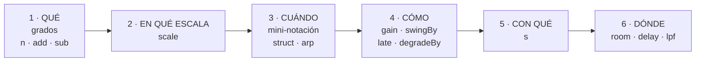
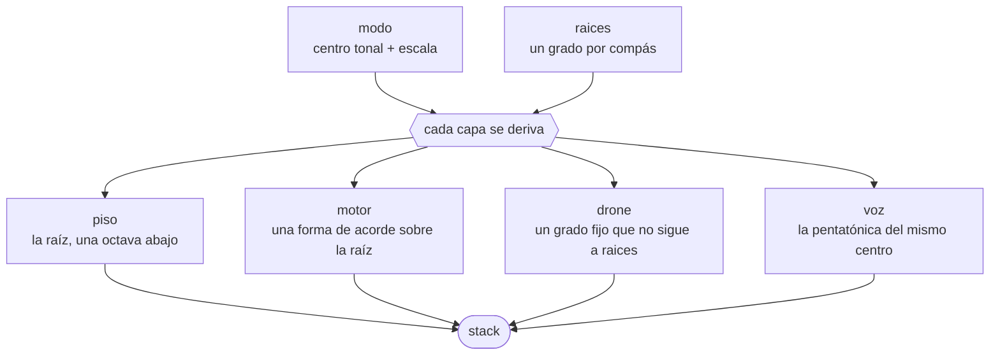
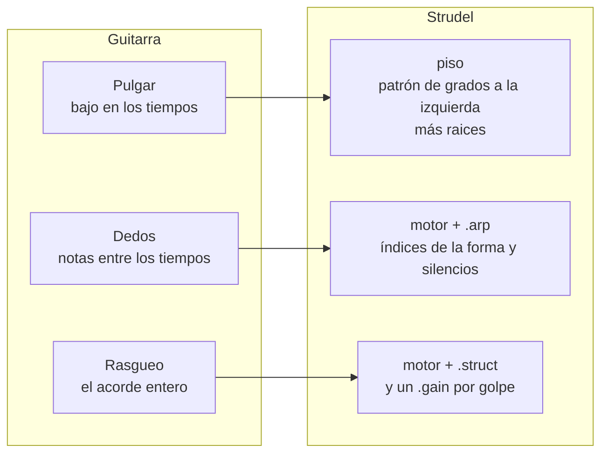
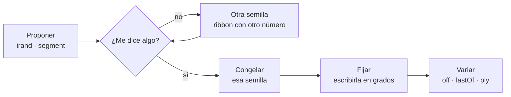
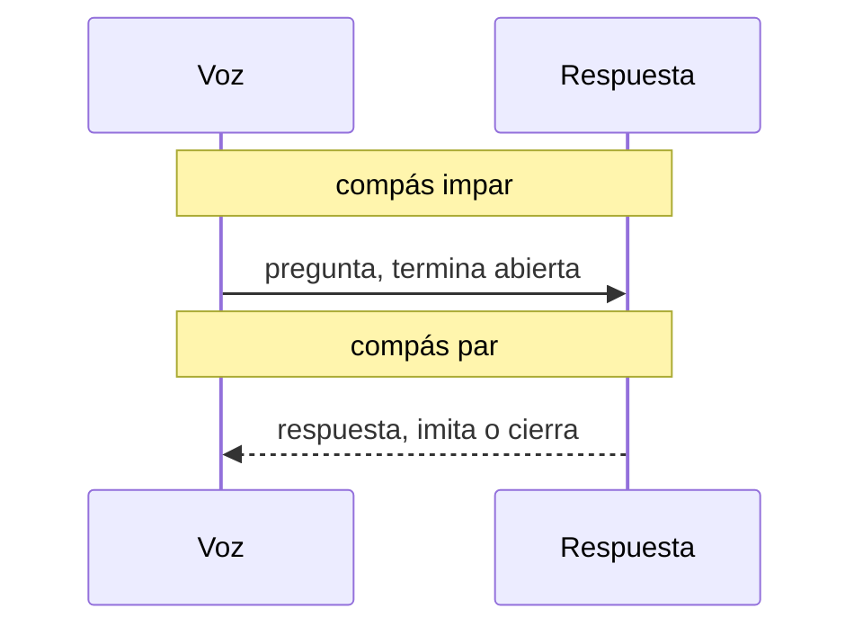
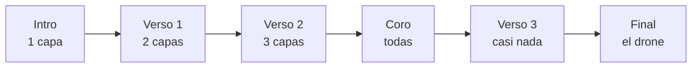
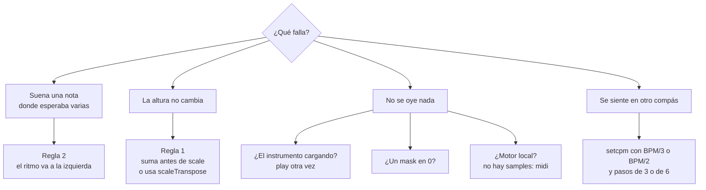

# Folk con Strudel, desde cero

> [!abstract] Qué es esta guía
> Un taller para **armar folk tú mismo** en Strudel, no un cancionero. Cada gesto
> del género (bajo alternado, picking, vals, drone, pregunta y respuesta) se
> descompone en **las piezas de Strudel que lo construyen** y en **los pasos para
> ensamblarlas**.
>
> Casi no hay respuestas. Hay **retos** con un *hecho cuando* para que sepas tú
> solo si lo lograste, y **pistas plegadas**, de menos a más. Los bloques que
> suenan son mecanismos sobre un acorde: la tonalidad, la progresión, el tempo y
> el motivo los pones tú.
>
> Es material de apoyo generado por IA. Complementa a [[3. Folk]] (la guitarra
> real, el picking, Sonar) y a [[1. Beats desde cero]] (rejilla, dinámica y swing,
> que aquí se dan por sabidos).

> [!tip] Cómo usarla
> - **Cada sección va en el mismo orden:** el gesto → las piezas → cómo se arma →
>   reto → qué decide en tu pieza.
> - **Los pentagramas son el objetivo.** Cada bloque `music-abc` es lo que tu código
>   tiene que sonar. Leerlo y escribirlo en mini-notación es la mitad del ejercicio,
>   y entrena justo tu punto débil: el ritmo. La octava del pentagrama es
>   orientativa; lo que cuenta es **dónde cae** cada nota y **qué voz** la toca.
> - **Abre una pista solo después de cinco minutos atascado.** Clic en el título.
> - **Los bloques suenan en Obsidian**, donde cargan los instrumentos `gm_*`. La
>   primera vez que pides uno puede tardar en cargar: si el primer compás sale
>   mudo, dale play otra vez.
> - **Para Sonar:** el motor local no carga samples. Cambia `.s("gm_…")` por
>   `.midichan(n).midi(OUT)`, como en `.motor/prueba-midi.js`
>   ([[4. Instrumento/2. Strudel/README]]).

---

## 0. El método

### 0.1 Las seis preguntas de un patrón

Un patrón de Strudel es una cadena de funciones que contesta seis preguntas, **en
este orden**:



```js
n( GRADOS )          // 1 · qué notas, como números de escala
  .scale( MODO )     // 2 · en qué escala
  .struct( RITMO )   // 3 · cuándo suena (o .arp)
  .gain( MANO )      // 4 · cómo se toca
  .s( SONIDO )       // 5 · con qué instrumento
  .room( ESPACIO )   // 6 · en qué sala
```

**Construye una línea por pregunta y escucha después de cada una.** Si cambias tres
cosas a la vez, no sabes cuál hizo qué.

### 0.2 Dos reglas que te ahorran horas

> [!warning] Regla 1 · Los grados se tocan antes de `.scale()`
> Antes de `.scale()` los valores son **grados** (0, 1, 2…): se suman, se restan, se
> apilan. Después ya son **notas**, y un `.add(n(7))` detrás de `.scale()` no
> cambia la altura.
>
> Para mover algo que ya pasó por la escala: `.scaleTranspose(7)` (dentro de la
> escala) o `.transpose(12)` (en semitonos).

> [!warning] Regla 2 · El ritmo sale del patrón de la izquierda
> En `a.add(b)` los ataques son los de `a`; `b` solo aporta valores. Si quieres el
> ritmo de `b`, ponlo a la izquierda (`b.add(a)`) o usa `a.add.out(b)`.

Escúchala. Mismo material, distinto lado:

```strudel
setcpm(80/4)
let raiz = "<0>"
cat(
  n(raiz.add("0 4 0 4")),   // compás 1: el ritmo sale de raiz → UNA nota
  n("0 4 0 4".add(raiz)),   // compás 2: el ritmo sale de "0 4 0 4" → cuatro
).scale("C2:major").s("gm_acoustic_bass")
```

### 0.3 Herramientas para escuchar

| Quiero… | Hago |
|---|---|
| ver qué suena | el pianoroll del bloque |
| apagar una capa | `//` al principio de su línea |
| comparar dos versiones | `cat(a, b)`: un compás cada una |
| oír un efecto con y sin | `.firstOf(2, x => x.efecto())`: un compás con, otro sin |

---

## 1. La arquitectura: una progresión, muchas capas

El truco que hace fácil todo lo demás: **escribe la progresión una sola vez, en
grados, y deriva de ella cada capa.** Cambiar de tonalidad, de modo o de acordes
pasa a ser cambiar una línea, y toda la banda la sigue.



En una escala de siete notas, **7 grados son una octava** (en una pentatónica, 5).
Por eso `.sub(7)` baja la raíz una octava sin salirse de la escala.

El esqueleto. Suena un solo acorde **a propósito**: la progresión es tuya.

```strudel
setcpm(80/4)
let modo   = "C:major"   // ← tu centro tonal y tu modo
let raices = "<0>"       // ← tu progresión: un grado por compás

let piso  = n(raices.sub(7))           // la raíz, una octava abajo
let motor = n(raices.add("[0,2,4]"))   // la tríada sobre esa raíz

stack(
  piso.scale(modo).s("gm_acoustic_bass"),
  motor.scale(modo).s("gm_acoustic_guitar_steel").gain(.6),
)
```

> [!question] Reto 1 · Tu progresión en el esqueleto
> Copia el esqueleto a tu nota de trabajo y pon en `raices` una progresión de
> cuatro compases: la tuya o una de §2.1.
>
> *Hecho cuando* el pianoroll muestra el piso cambiando una vez por compás y el
> motor siempre con tres notas encima.

> [!hint]- Pista 1
> Un elemento por compás va entre `< >`: `"<a b c d>"` son cuatro compases.

> [!hint]- Pista 2
> De romano a grado: I = 0, ii = 1, iii = 2, IV = 3, V = 4, vi = 5, vii° = 6.
> Se cuenta desde la tónica del modo, empezando en cero.

---

## 2. Armonía: pocos acordes, mucho color

Teoría detrás: [[0. Modos]], [[6. Crear progresiones tonales]],
[[3. Intercambios modales]].

### 2.1 Las familias de progresión

El folk cambia poco de acorde y se queda mucho en cada uno. Casi todo el
repertorio sale de cinco familias:

| Familia                 | Romanos            | Sensación                      | `modo`       | Grados |
| ----------------------- | ------------------ | ------------------------------ | ------------ | ------ |
| Tres acordes            | I · IV · V         | himno, plaza, canción protesta | `major`      |        |
| Los cuatro del pop-folk | I · V · vi · IV    | coro grande, optimista         | `major`      | ?      |
| Balada menor            | i · VII · VI · VII | tradicional, oscura            | `minor`      | ?      |
| Mixolidia               | I · bVII · IV · I  | celta, abierta, de tarde       | `mixolydian` | ?      |
| Dórica                  | i · IV             | antigua y luminosa a la vez    | `dorian`     | ?      |

> [!important] No escribas alteraciones: cambia el modo
> En Strudel la escala ya trae sus alteraciones. El bVII de la mixolidia es,
> simplemente, el grado 6 de `mixolydian`. Por eso la columna **Grados** es tu
> primer reto: traducir romanos a números dentro de cada modo.

> [!question] Reto 2.1 · Traduce la tabla
> Llena la columna *Grados* de las cinco familias y prueba cada una en el
> esqueleto de §1, cambiando solo `raices` y `modo` (`"D:dorian"`, `"G:mixolydian"`…).
>
> *Hecho cuando* puedes nombrar en una palabra la emoción de cada familia, y sabes
> cuál querrías para tu próxima pieza.

> [!hint]- Pista
> Cuenta desde la tónica **del modo**: en `G:mixolydian` el grado 6 es F natural,
> que es exactamente el bVII de G.

### 2.2 La forma del acorde

La progresión dice **dónde** está cada acorde; la forma dice **qué** se monta
encima. Como la forma también son grados, se adapta sola al modo.

| Forma | Grados | Por qué suena a folk |
|---|---|---|
| tríada | `[0,2,4]` | la base |
| vacía, sin tercera | `[0,4,7]` | ni mayor ni menor: celta, antigua |
| sus2 | `[0,1,4]` | cuerdas al aire, suspenso abierto |
| sus4 | `[0,3,4]` | pide resolver a la tríada |
| add9 | `[0,2,4,8]` | la frontera con el dream pop |
| con octava | `[0,2,4,7]` | dobla la raíz, como un acorde abierto de guitarra |

Las seis, una por compás, sobre la misma raíz:

```strudel
setcpm(60/4)
let formas = "<[0,2,4] [0,4,7] [0,1,4] [0,3,4] [0,2,4,8] [0,2,4,7]>"
n("<0>".add(formas)).scale("C:major")
  .s("gm_acoustic_guitar_steel").room(.3)
```

> [!question] Reto 2.2 · Una suspensión que resuelve
> Haz que, dentro de **un mismo compás**, un acorde empiece suspendido y resuelva
> a su tríada.
>
> *Hecho cuando* oyes las dos formas y puedes señalar en el pianoroll la única nota
> que se mueve.

> [!hint]- Pista 1
> Dos formas en un compás se escriben como una secuencia de dos apilados:
> `"[[…] […]]"`.

> [!hint]- Pista 2
> Si solo suena la primera forma, ¿de qué lado del `.add` está saliendo el ritmo?
> (Regla 2.)

### 2.3 El ritmo armónico: cuánto dura cada acorde

| Escribes | Pasa |
|---|---|
| `"<0 0 3 4>"` o `"<0!2 3 4>"` | el I suena dos compases, **atacado dos veces** |
| `"<0@2 3 4>"` | el I es **una sola nota larga** de dos compases |

Sin nada detrás, `@` deja que la guitarra se apague. Con `.struct()` detrás da
igual cuál uses: los ataques los pone el `struct`. Con `.arp()` **no**: el arpegio
toca solo el primer compás de una nota `@2` y deja mudo el segundo. Si vas a
arpegiar, alarga con `!`.

> [!question] Reto 2.3 · Quedarse en casa
> Haz que tu I dure el doble que los demás acordes.
>
> *Hecho cuando* al contar los compases en voz alta, el cambio cae donde lo esperas.

### 2.4 El drone: la cuerda que no se mueve

En la guitarra folk las cuerdas al aire suenan **encima de todos los acordes**.
Esa nota fija choca suave con algunos y crea el sonido "de madera". Es la manera
más rápida de sonar a folk sin tocar la progresión.

```music-abc
X:1
T:Drone: una nota que no se mueve
M:4/4
L:1/1
Q:1/4=66
K:C
V:1 clef=treble name="Drone"
V:2 clef=treble name="Acordes"
[V:1] G | G |
[V:2] [CEG] | [FAc] |
```

```strudel
setcpm(66/4)
let modo   = "C:major"
let raices = "<0 3>"     // dos acordes, solo para oír el roce
let drone  = "4"         // ← un grado fijo: NO sigue a raices

stack(
  n(raices.add("[0,2,4]")).scale(modo).s("gm_acoustic_guitar_steel").gain(.6),
  n(drone).struct("x*4").scale(modo).s("gm_acoustic_guitar_steel").gain(.4),
)
```

> [!question] Reto 2.4 · Busca tu cuerda al aire
> Pon el drone sobre **tu** progresión y pruébalo en cada grado, del 0 al 6.
> Para cada uno, anota contra qué acorde roza y qué intervalo forma.
>
> *Hecho cuando* tienes una tabla *grado → acorde → intervalo* y eliges un drone.
> Los roces que te gusten son tensiones: compáralos con [[8. Tensiones]].

> [!tip] Qué decide en tu pieza
> Tres cosas: la familia de progresión, cuánto dura cada acorde y cuál es tu
> cuerda al aire.

---

## 3. La mano derecha: el ritmo del folk

En el folk la guitarra también es la batería: el pulgar hace de bombo y los dedos
o el rasgueo hacen de caja y hi-hat. En Strudel, **cada parte de la mano es una
capa**.



Todos los retos de esta sección parten del esqueleto de §1.

### 3.1 Boom-chick

Bajo en 1 y 3, acorde en 2 y 4. Lo más antiguo del género.

```music-abc
X:2
T:Boom-chick
M:4/4
L:1/4
Q:1/4=90
K:C
V:1 clef=treble name="Acorde"
V:2 clef=bass name="Bajo"
[V:1] z [CEG] z [CEG] | z [CEG] z [CEG] |
[V:2] C, z C, z | C, z C, z |
```

**Las piezas:** `.struct("…")` impone los ataques: `x` es golpe, `~` es silencio.

**Cómo se arma:**

1. Dale al piso un `struct` con los tiempos del bajo.
2. Dale al motor el `struct` complementario.
3. Escucha cada capa sola, comentando la otra, y luego juntas.

> [!question] Reto 3.1 · Boom-chick
> Reproduce el pentagrama.
>
> *Hecho cuando* puedes decir "BUM-cha-BUM-cha" encima y coincide, y en el
> pianoroll el grave y el acorde nunca caen juntos.

### 3.2 Bajo alternado

El pulgar alterna raíz y quinta. Una sola guitarra parece bajo más armonía.

```music-abc
X:3
T:Bajo alternado: raíz y quinta abajo
M:4/4
L:1/4
Q:1/4=90
K:C
V:1 clef=bass name="Pulgar"
[V:1] "C"C, G,, C, G,, | "F"F, C, F, C, |
```

**Las piezas:** en grados, **la quinta está 4 arriba o 3 abajo** (`+4`, `-3`; es
la quinta de la escala, así que solo sobre el vii° sale disminuida). El patrón de
alternancia tiene que ir **a la izquierda** y `raices` a la derecha (Regla 2).

**Cómo se arma:**

1. Escribe la alternancia como grados relativos a la raíz, uno por tiempo.
2. Súmale `raices`.
3. Ajusta la octava con `.sub(7)` si queda alta.

> [!question] Reto 3.2 · El pulgar
> Reproduce el pentagrama, con la quinta **abajo**.
>
> *Hecho cuando* el pianoroll dibuja un zigzag que se desplaza con cada cambio de
> acorde.

> [!hint]- Pista 1
> Si suena una sola nota por compás, el ritmo está saliendo de `raices`. Regla 2.

> [!hint]- Pista 2
> La forma del código, sin los números:
> ```js
> n("? ? ? ?".add(raices)).scale(modo)
> ```

> [!question] Reto 3.2b · Walk-up
> En el último tiempo antes de un cambio de acorde, haz que el bajo **camine** por
> grados hacia la raíz siguiente.
>
> *Hecho cuando* el cambio de acorde se oye anunciado un tiempo antes.

> [!hint]- Pista 1
> No hay una función de "siguiente acorde". El paso se escribe en el patrón del
> compás que lo necesita, y `< >` deja un patrón distinto por compás.

> [!hint]- Pista 2
> Otra vía: transforma solo el último compás de cada cuatro con
> `.lastOf(4, x => …)`. Ojo: antes de `.scale()` (Regla 1).

### 3.3 Travis: pulgar en los tiempos, dedos entre ellos

El pulgar mantiene el bajo alternado de §3.2; los dedos tocan notas del acorde en
los contratiempos. En el 1, pulgar y dedo a la vez: el *pinch*.

```music-abc
X:4
T:Travis: pulgar en los números, dedos en las y
M:4/4
L:1/8
Q:1/4=84
K:C
V:1 clef=treble name="Dedos"
V:2 clef=bass name="Pulgar"
[V:1] e G z c z G z c | e G z c z G z c |
[V:2] C,2 G,,2 C,2 G,,2 | C,2 G,,2 C,2 G,,2 |
```

**Las piezas:** `.arp("…")` toca la forma del acorde por **índices**, en el orden en
que la escribiste: si la escribes de grave a agudo, `0` es la más grave, `1` la
siguiente… `~` deja un hueco y `[0,4]` toca dos índices a la vez. Así recorre una
forma de cinco notas:

```strudel
setcpm(84/4)
n("<0>".add("[0,2,4,7,9]")).scale("C:major")
  .arp("0 1 2 3 4 3 2 1")    // índices de la forma, de grave a agudo
  .s("gm_acoustic_guitar_nylon")
```

**Cómo se arma:**

1. El pulgar es tu bajo alternado de §3.2, en negras.
2. Los dedos son una forma con suficientes notas agudas y un `arp` con silencios
   donde cae el pulgar.
3. `stack` de las dos.

> [!question] Reto 3.3 · Travis
> Reproduce el pentagrama.
>
> *Hecho cuando* al contar "1 y 2 y 3 y 4 y", el pulgar cae en los números y los
> dedos en las "y", salvo el pinch del 1.

> [!hint]- Pista 1
> Son dos capas. El pinch sale solo: pulgar y dedo coinciden en el 1 porque viven
> en capas distintas.

> [!hint]- Pista 2
> En `[0,2,4,7,9]` los índices son `0 1 2 3 4`, de grave a agudo. Busca qué nota
> del pentagrama es cada uno.

> [!hint]- Pista 3
> ```js
> n(raices.add("[0,2,4,7,9]")).scale(modo).arp("? ? ~ ? ~ ? ~ ?")
> ```

El roll del banjo es el mismo mecanismo con otra agrupación: ocho corcheas en
**3 + 3 + 2**.

```music-abc
X:5
T:Roll hacia delante: 3 + 3 + 2
M:4/4
L:1/8
Q:1/4=100
K:G
!>!GBd !>!GBd !>!GB | !>!GBd !>!GBd !>!GB |
```

> [!question] Reto 3.3b · Roll de banjo
> Reproduce el roll con sus acentos, con `gm_banjo`.
>
> *Hecho cuando* puedes palmear los acentos, 3 + 3 + 2, mientras suena.

> [!hint]- Pista
> `.gain()` con ocho valores, uno por corchea. Acento = valor más alto.

### 3.4 Rasgueo

Abajo en los tiempos, arriba en los contratiempos, y los de abajo pesan más. El
rasgueo de siempre: abajo, abajo-arriba, arriba-abajo-arriba.

```music-abc
X:6
T:Rasgueo: abajo, abajo-arriba, arriba-abajo-arriba
M:4/4
L:1/8
Q:1/4=90
K:C
"C"!downbow!B2 !downbow!B!upbow!B z!upbow!B !downbow!B!upbow!B |
```

**Las piezas:** `.struct()` con ocho pasos (corcheas) para dónde hay golpe, y
`.gain()` con ocho valores para cuánto pesa cada uno.

> [!question] Reto 3.4 · Rasgueo
> Reproduce el pentagrama.
>
> *Hecho cuando* con los ojos cerrados distingues los golpes de abajo de los de
> arriba.

> [!hint]- Pista 1
> El silencio del 3 es un `~`: la mano baja sin tocar las cuerdas.

> [!hint]- Pista 2
> `.gain()` lee su valor en el instante de cada golpe. Si escribes sus ocho valores
> alineados con los del `struct`, cada golpe toma el suyo.

> [!note] Un límite de Strudel
> El acorde suena en bloque. Una guitarra real lo abanica: al bajar entran primero
> los graves y al subir, los agudos.

> [!question] Reto 3.4b · El abanico (avanzado)
> Imita el abanico del rasgueo.
>
> *Hecho cuando* a tempo lento oyes las cuerdas entrar una detrás de otra.

> [!hint]- Pista 1
> Una capa por cuerda, cada una con un `.late()` un poco mayor que la anterior.

> [!hint]- Pista 2
> Una función de JavaScript fabrica las capas:
> ```js
> let cuerda = (grado, retraso) =>
>   n(raices.add(grado)).scale(modo).struct(golpes).late(retraso)
> stack(cuerda(0, 0), cuerda(2, ?), cuerda(4, ?), cuerda(7, ?))
> ```
> El retraso está en fracciones de compás: a 90 BPM en 4/4, `.008` son unos 20 ms.

> [!tip] Qué decide en tu pieza
> Tu mano derecha: boom-chick, alternado, Travis o rasgueo. Una por sección, dos
> como mucho.

---

## 4. El compás: 4/4, vals y 6/8

Media tradición folk va en tres. Cambiar de compás cambia más la emoción que
cambiar de acordes. La regla de siempre: **un ciclo = un compás**
([[1. Beats desde cero#1.1 Un ciclo = un compás]]).

| Compás | Tempo en Strudel | Se cuenta | Sensación |
|---|---|---|---|
| 4/4 | `setcpm(BPM/4)` | 1 2 3 4 | marcha, canción |
| 3/4 | `setcpm(BPM/3)` | 1 2 3 | vals, nana |
| 6/8 | `setcpm(BPM/2)`, con el BPM de la negra con punto | 1 y a 2 y a | mecedora, balada antigua |

Un metrónomo de 3/4. El acento en el 1 es lo que hace oír el compás:

```strudel
setcpm(120/3)          // 3/4: un ciclo = tres negras
n("<0>".add("[0,2,4]")).scale("C:major")
  .struct("x x x")
  .gain("1 .5 .5")
  .s("gm_acoustic_guitar_steel")
```

### 4.1 Vals

En el vals el bajo va en el 1, el acorde en el 2 y el 3, y la alternancia del bajo
pasa **de compás a compás**, no de tiempo a tiempo.

```music-abc
X:7
T:Vals: bajo en 1, acorde en 2 y 3
M:3/4
L:1/4
Q:1/4=120
K:G
V:1 clef=treble name="Acorde"
V:2 clef=bass name="Bajo"
[V:1] z [GBd] [GBd] | z [GBd] [GBd] |
[V:2] G,, z z | D, z z |
```

**Las piezas:** `< >` da un valor por compás, así que una alternancia escrita dentro
de `< >` alterna por compás.

> [!question] Reto 4.1 · Tu progresión en vals
> Pasa tu progresión a 3/4, con el bajo alternando raíz y quinta por compás.
>
> *Hecho cuando* puedes contar "UNO dos tres" y el bajo cambia de nota en cada UNO.

> [!hint]- Pista
> Un acorde de vals suele durar dos compases: uno para la raíz y otro para la
> quinta. Mira §2.3 para alargar los acordes de `raices`.

### 4.2 6/8

Seis corcheas en dos grupos de tres. Se siente en **dos** pulsos grandes.

```music-abc
X:8
T:6/8: dos pulsos de tres corcheas
M:6/8
L:1/8
Q:3/8=60
K:D
V:1 clef=treble name="Dedos"
V:2 clef=bass name="Bajo"
[V:1] DFA dAF | DFA dAF |
[V:2] D,3 A,,3 | D,3 A,,3 |
```

> [!question] Reto 4.2 · Balada en 6/8
> Reproduce el pentagrama sobre tu progresión.
>
> *Hecho cuando* sientes dos pulsos por compás, no seis: te puedes mecer encima.

> [!hint]- Pista
> `setcpm(BPM/2)` con el BPM de la negra con punto. El arpegio son seis índices;
> el bajo, dos pasos. Más contexto: [[1. Beats desde cero#Balada en 6/8]].

> [!tip] Qué decide en tu pieza
> El compás. Antes de cambiar de acordes, prueba la misma progresión en 3/4.

---

## 5. La mano humana: sacar al folk de la rejilla

Strudel es una rejilla perfecta y el folk vive un poco fuera de ella. La técnica
completa está en [[1. Beats desde cero#5.3 Humanizar]] y
[[1. Beats desde cero#6.1 Swing]]; aquí, cómo aplicarla a una guitarra.

| Imperfección               | La pieza                         | Explora entre                        |
| -------------------------- | -------------------------------- | ------------------------------------ |
| acentos de la mano         | `.gain("1 .6 .8 .6")`            | tu propio patrón                     |
| dinámica que respira       | `.gain(perlin.range(a, b))`      | `a` y `b` entre 0 y 1                |
| galope                     | `.swingBy(x, 4)`                 | `0` (recto) y `1/3` (tresillo)       |
| llegar tarde               | `.late("0 .01")`                 | `0` y `.02`, en fracciones de compás |
| notas que se comen         | `.degradeBy(p)`                  | `0` y `.3`                           |
| un adorno de vez en cuando | `.sometimesBy(p, x => x.ply(2))` | `0` y `.2`                           |

El laboratorio: una guitarra perfectamente mecánica, con las imperfecciones
apagadas. Descomenta **una** línea, escucha cuatro compases y vuelve a comentarla.

```strudel
setcpm(84/4)
n("<0>".add("[0,2,4,7]")).scale("C:major")
  .arp("0 2 1 3 0 2 1 3")
   .gain("1 .6 .8 .6 1 .6 .8 .6")
  // .gain(perlin.range(.4, .9))
   //.swingBy(1/3, 4)
   //.late("0 .01")
  // .degradeBy(.1)
  // .sometimesBy(.1, x => x.ply(2))
  .s("gm_acoustic_guitar_steel")
```

> [!note] Cómo funciona `swingBy(x, n)`
> Corta el compás en `n` partes y retrasa la segunda mitad de cada una. Con
> corcheas en 4/4, `n = 4`. Si tu capa solo tiene negras, el swing no tiene nada
> que mover.

> [!question] Reto 5.1 · La escalera de swing
> Cuatro compases, cuatro valores de swing entre `0` y `1/3`, uno por compás
> (`swingBy` acepta `"< >"`).
>
> *Hecho cuando* eliges un valor y puedes decir por qué ese y no el de al lado.

> [!question] Reto 5.2 · Tu mano, como función
> Escribe tu humanización como una función y aplícala a todas las capas:
> ```js
> let mano = p => p.swingBy(?, 4).gain(?)   // …lo que elegiste
> ```
> y luego `mano(motor)`, `mano(piso)`…
>
> *Hecho cuando* quitar y poner `mano` cambia la sensación de la banda entera.
> Cuando pase las cuatro pruebas (tocada, escuchada, usada al improvisar y
> grabada), es candidata a `2. Vocabulario/` ([[4. Instrumento/2. Strudel/README]]).

> [!tip] Qué decide en tu pieza
> Tu mano: qué imperfección te importa más. Casi siempre es la dinámica, no el
> tiempo; compruébalo tú.

---

## 6. Melodía: improvisar dentro de la escala

Teoría detrás: [[1. Composición melódica]], [[0. Enlaces 2.0 y motivos]].

### 6.1 La pentatónica

La mayoría de las melodías folk caben en cinco notas. Casi no tiene semitonos, así
que es difícil chocar con los acordes. La mayor y su relativa menor son **las
mismas cinco notas** con otro centro:

```music-abc
X:9
T:Pentatónica mayor de C y menor de A
M:none
L:1/4
K:C
"^C mayor"C D E G A c | "^A menor"A, C D E G A |]
```

En Strudel: `"C4:major:pentatonic"` y `"A3:minor:pentatonic"`. En la pentatónica,
**5 grados son una octava**. Usa la del mismo centro que tu `modo`.

### 6.2 Strudel como dado: proponer, congelar, fijar

Strudel puede tirar frases al azar dentro de la escala. Tú no improvisas notas:
**improvisas escuchando** y te quedas con lo que te dice algo.



| La pieza | Qué controla |
|---|---|
| `irand(k)` | un grado al azar entre `0` y `k-1`: el **ámbito** |
| `.segment(m)` | `m` notas por compás: el ritmo base |
| `.ribbon(semilla, ciclos)` | repite un trozo fijo del azar: un **motivo** |
| `.add(k)` antes de `.scale()` | mueve el ámbito arriba o abajo |
| `.struct("…")` | un ritmo propio en vez de notas iguales |
| `.degradeBy(p)` | silencios: la voz respira |

El dado, sobre un acorde:

```strudel
setcpm(80/4)
let escala = "C4:major:pentatonic"
stack(
  n("<0>".add("[0,2,4]")).scale("C:major").s("gm_acoustic_guitar_steel").gain(.5),
  n(irand(5).segment(4))
    // .ribbon(0, 2)      // ← descomenta: congela dos compases del azar
    .scale(escala).s("gm_fiddle"),
)
```

> [!question] Reto 6.2a · Tres semillas
> Con `ribbon` activo, cambia la semilla (el primer número) hasta encontrar tres
> que te digan algo.
>
> *Hecho cuando* tienes anotadas tres semillas, con una frase sobre cada una.

> [!question] Reto 6.2b · Fíjala
> Pasa una semilla a grados escritos a mano, sin azar.
>
> *Hecho cuando* tu versión escrita y la congelada suenan igual (compáralas con
> `cat`).

> [!hint]- Pista
> Puedes leerla en el pianoroll. Mejor todavía: sácala de oído en la guitarra o el
> teclado. Es entrenamiento auditivo gratis.

> [!question] Reto 6.2c · Ámbito de habla
> Una línea de solo tres notas con un ritmo irregular, como de alguien hablando.
>
> *Hecho cuando* puedes recitar una frase encima y encaja.

### 6.3 Pregunta y respuesta

La voz dice algo y un instrumento contesta en el hueco: la armónica entre dos
versos.



**Las piezas:** `.mask("<1 0>")` y `.mask("<0 1>")`, dos interruptores
complementarios: uno suena en los compases impares y el otro en los pares. Aquí
con azar, para oír solo el mecanismo:

```strudel
setcpm(80/4)
let escala = "C4:major:pentatonic"
stack(
  n(irand(5).segment(4)).scale(escala).s("gm_voice_oohs").mask("<1 0>"),
  n(irand(5).segment(4).add(5)).scale(escala).s("gm_harmonica").mask("<0 1>"),
)
```

> [!question] Reto 6.3 · Tu diálogo
> Tu motivo fijo de 6.2b como pregunta, y una respuesta que lo imite o lo cierre,
> en otro timbre y otro registro.
>
> *Hecho cuando* en el pianoroll nunca suenan a la vez, y la respuesta termina en
> un grado más estable que la pregunta.

> [!hint]- Pista 1
> `.scaleTranspose(5)` sube una octava **dentro** de la pentatónica, aunque ya
> hayas pasado por `.scale()`.

> [!hint]- Pista 2
> Imitar es el mismo ritmo con otras notas. Cerrar es terminar en el grado 0.

Para variar un motivo ya fijo: `.off(1/8, x => x.scaleTranspose(2))` le pone un eco
dos grados arriba; `.lastOf(4, x => …)` cambia solo el último compás de cada cuatro.

> [!tip] Qué decide en tu pieza
> Un motivo de dos compases, y su papel: pregunta o respuesta.

---

## 7. Arreglo: la banda y la forma

### 7.1 La paleta

| Papel           | Instrumentos que existen en tu plugin                                                                        |
| --------------- | ------------------------------------------------------------------------------------------------------------ |
| motor           | `gm_acoustic_guitar_steel` · `gm_acoustic_guitar_nylon` · `gm_banjo` · `gm_dulcimer` · `gm_orchestral_harp`  |
| piso            | `gm_acoustic_bass` · `gm_contrabass` · `gm_cello`                                                            |
| voz y respuesta | `gm_fiddle` · `gm_violin` · `gm_harmonica` · `gm_recorder` · `gm_whistle` · `gm_pan_flute` · `gm_voice_oohs` |
| colchón         | `gm_accordion` · `gm_bandoneon` · `gm_string_ensemble_1` · `gm_choir_aahs` · `gm_pad_warm`                   |
| textura         | `gm_guitar_fret_noise` · `gm_guitar_harmonics` · `gm_kalimba`                                                |

La percusión folk (pisotón, palmas, pandereta) está armada en
[[1. Beats desde cero#Folk stomp-clap]].

Para audicionar, un instrumento por compás. Cambia la lista:

```strudel
setcpm(70/4)
n("<0>".add("[0,2,4,7]")).scale("C:major").arp("0 1 2 3")
  .s("<gm_acoustic_guitar_steel gm_acoustic_guitar_nylon gm_banjo gm_dulcimer gm_orchestral_harp>")
```

> [!question] Reto 7.1 · Tu trío
> Elige piso, motor y voz.
>
> *Hecho cuando* en el pianoroll las tres capas ocupan franjas de altura distintas
> y ninguna pisa a otra.

### 7.2 La forma por densidad

El folk tradicional repite **la misma música** con letra nueva. El arco no viene de
cambiar acordes, sino de **cuántas capas suenan**, y rara vez hay más de tres a la
vez. Este es el arco típico, no el tuyo:



| La pieza | Qué hace |
|---|---|
| `.mask("<0!4 1!12>")` | el mapa de entradas de una capa: 0 fuera, 1 dentro, un valor por compás |
| `!` | repite: `0!4` son cuatro compases fuera |
| `arrange([n, patrón], …)` | secciones con nombre, como en [[strudel — secciones]] |

Tu partitura de capas, para llenar en papel antes de tocar código:

| Capa | 1–4 | 5–8 | 9–12 | 13–16 |
|---|---|---|---|---|
| piso | | | | |
| motor | | | | |
| voz | | | | |
| drone | | | | |

Cada fila es un `.mask()`.

> [!question] Reto 7.2 · Tu arco
> Dibuja tu arco (en papel o en Mermaid) y escribe un `mask` por capa.
>
> *Hecho cuando* el código suena como tu dibujo, y cada sección añade o quita
> exactamente una capa.

> [!hint]- Pista
> La entrada del bajo en el segundo verso es el clímax más barato del género.

### 7.3 La mesa de mezcla

Aquí se juntan todas las secciones. Cada capa trae un comentario con la sección
que la completa. Arranca con todo en `<1>` y ve escribiendo tus mapas.

```strudel
setcpm(80/4)
let modo   = "C:major"              // §2.1
let raices = "<0>"                  // §2.1 · §2.3
let escala = "C4:major:pentatonic"  // §6.1

let piso  = n(raices.sub(7))                      // §3.1 · §3.2: dale ritmo
              .scale(modo).s("gm_acoustic_bass")
let motor = n(raices.add("[0,2,4]"))              // §2.2 · §3.3 · §3.4: forma y mano
              .scale(modo).s("gm_acoustic_guitar_steel").gain(.6)
let voz   = n(irand(5).segment(4)).ribbon(0, 2)   // §6.2: tu motivo fijo
              .scale(escala).s("gm_fiddle").gain(.6)
let drone = n("4").struct("x*4")                  // §2.4: tu cuerda al aire
              .scale(modo).s("gm_acoustic_guitar_steel").gain(.3)

stack(
  piso .mask("<1>"),    // §7.2: el mapa de entradas de cada capa
  motor.mask("<1>"),
  voz  .mask("<1>"),
  drone.mask("<0>"),
).room(.3)
```

---

## 8. Dream-folk: tu frontera

Entre Bon Iver, Beach House y Harmless hay un punto donde el folk se vuelve dream
pop. Ese punto **se puede medir en código**.

| La pieza | Qué hace |
|---|---|
| `.room(x)` · `.size(x)` | de habitación con gente a recuerdo |
| `.delay(x).delaytime(t).delayfeedback(f)` | ecos: `t` en fracciones de ciclo |
| `.lpf(perlin.range(a, b).slow(8))` | un filtro que respira despacio |
| `gm_acoustic_guitar_nylon` · forma add9 · tempo lento | el resto del color |

```strudel
setcpm(66/4)
n("<0>".add("[0,2,4,8]")).scale("A:minor")
  .arp("0 1 2 3 2 1")
  .s("gm_acoustic_guitar_nylon")
  .room(.2)                                   // ← súbelo de .1 en .1
  // .size(.9)
  // .delay(.3).delaytime(3/8).delayfeedback(.4)
  // .lpf(perlin.range(900, 2500).slow(8))
```

> [!question] Reto 8 · La frontera
> Sube `room` de `.1` en `.1`, y luego descomenta las demás líneas una a una.
>
> *Hecho cuando* anotas en la bitácora el valor exacto en que deja de sonar a
> habitación y empieza a sonar a recuerdo. Ese número es parte de tu sonido.

### Mapa de influencias

No es para copiar: es **qué palanca mover primero** para ir hacia allá.

| Para ir hacia… | Mueve primero | Sección |
|---|---|---|
| Bob Dylan | tres acordes, ámbito corto, armónica en el hueco | §2.1 · §6.2c · §6.3 |
| The Lumineers | boom-chick, palmas, la entrada del bajo | §3.1 · §7.2 |
| Bon Iver | drone, voz una octava arriba, reverb | §2.4 · §6 · §8 |
| Andrew Bird | pregunta y respuesta, ecos con `off` | §6.3 |
| Avi Buffalo | los roces del drone, una mano muy suelta | §2.4 · §5 |
| Harmless · Twin Cabins | nylon, tempo lento, add9 | §2.2 · §8 |
| Beach House | reverb, el filtro que respira, colchón | §7.1 · §8 |

---

## 9. Cuando no suena como esperas



| Síntoma | Causa | Arreglo |
|---|---|---|
| el bajo alternado suena una nota por compás | el ritmo está a la derecha del `.add` | Regla 2 |
| `.add(n(7))` no sube nada | ya pasaste por `.scale()` | Regla 1: `.scaleTranspose(7)` |
| la segunda forma del compás no suena | el ritmo sale de `raices` | Regla 2 |
| el swing no hace nada | la capa no tiene notas entre los pulsos, o `n` no coincide | §5 |
| el acorde de dos compases no se repite | `@2` es una sola nota larga | `!2` repite el ataque |
| el arpegio se calla en el segundo compás de un acorde largo | un `@2` en `raices` con `.arp()` detrás | `!2` en vez de `@2` (§2.3) |
| todo suena una octava arriba o abajo | `scale("C:major")` empieza en la octava 3 | `"C2:major"`, `"C4:major"` o `.sub(7)` |
| el 3/4 suena cojo | el ciclo no mide un compás | `setcpm(BPM/3)` y tres pasos |

---

## 10. Una sesión de exploración

Veinticinco minutos. Cada paso responde **una** pregunta, y no pasas al siguiente
hasta contestarla.

| Min | Qué | § |
|---|---|---|
| 0–3 | modo y familia de progresión, en `raices` | 2 |
| 3–8 | mano derecha y compás | 3 · 4 |
| 8–12 | tu mano humana | 5 |
| 12–18 | dado → semilla → motivo fijo | 6 |
| 18–22 | partitura de capas | 7 |
| 22–25 | **audio** | — |

> [!danger] Semana sin audio es semana en blanco
> Regla dura de [[Inicio]]. Para grabar, pasa el patrón al motor local y a Sonar
> ([[4. Instrumento/2. Strudel/README#Configurar Sonar]]). Treinta segundos
> bastan, aunque estén feos.

### Ejercicios

Son instrucciones, no respuestas: el material lo decides tú.

**1 · Una progresión, cuatro manos.** La misma `raices` con boom-chick, alternado,
Travis y rasgueo, una por sección con `arrange`.
*Hecho cuando* puedes decir qué emoción da cada mano, y cuál usarías en qué sección.

**2 · Tres compases.** Un acompañamiento tuyo en 4/4, 3/4 y 6/8.
*Hecho cuando* eliges uno para una pieza tuya y escribes por qué.

**3 · Folk de dado.** Dieciséis compases con un motivo fijado desde una semilla,
pregunta y respuesta, y tu partitura de capas.
*Hecho cuando* existe el audio.

**4 · De oído.** Una canción folk de tus influencias: su progresión en grados y su
mano derecha.
*Hecho cuando* al sonar junto a la grabación, coincide.

### Dónde va lo que hagas

La regla de ruteo de [[Inicio]]:

| Si el patrón… | Va a |
|---|---|
| nace de una lección | `2. Cursos/<fuente>/<lección>/Estudios/`, dentro de la nota |
| es para una pieza tuya | `3. Composiciones/<obra>/` |
| transcribe o imita a otro | `5. Referencias/` |
| es exploración sin destino | `0. Entrada/`, y se decide en la revisión semanal |
| es un gesto que pasó las cuatro pruebas | `2. Vocabulario/` |

---

## Chuleta

**Intervalos en grados, contados desde la tónica**

| | escala de 7 | pentatónica |
|---|---|---|
| octava | `7` | `5` |
| quinta arriba / abajo | `+4` / `-3` | `+3` / `-2` |
| tercera | `+2` | — |

**Formas de acorde:** `[0,2,4]` tríada · `[0,4,7]` vacía · `[0,1,4]` sus2 ·
`[0,3,4]` sus4 · `[0,2,4,8]` add9 · `[0,2,4,7]` con octava

**Funciones**

| | |
|---|---|
| `setcpm(BPM/4)` · `BPM/3` · `BPM/2` | 4/4 · 3/4 · 6/8 |
| `n("…").scale("C:major")` | grados → notas. Toda la aritmética, antes |
| `raices.add("[0,2,4]")` · `raices.sub(7)` | forma de acorde · bajar una octava |
| `"0 4 0 4".add(raices)` | patrón de grados con el ritmo a la izquierda |
| `.scaleTranspose(k)` · `.transpose(k)` | mover tras `.scale()`: grados · semitonos |
| `.struct("x ~ x ~")` · `.arp("0 ~ [1,3]")` | ataques · recorrer la forma por índices |
| `"<a b>"` · `"a!2"` · `"a@2"` | uno por compás · repetir · alargar |
| `.gain()` · `.velocity()` · `perlin.range(a, b)` | dinámica · señal que respira |
| `.swingBy(x, n)` · `.late("0 .01")` | galope · llegar tarde |
| `.degradeBy(p)` · `.sometimesBy(p, f)` | quitar al azar · variar al azar |
| `irand(k).segment(m)` · `.ribbon(s, c)` | dado · congelar |
| `.mask("<1 0>")` · `.firstOf(n, f)` · `.lastOf(n, f)` | interruptor por compás · primero / último de cada n |
| `.off(t, f)` · `.ply(n)` | eco transformado · repetir cada nota |
| `stack()` · `cat()` · `arrange([n, p], …)` | capas · un compás cada una · secciones |
| `.room()` `.size()` `.delay()` `.lpf()` | espacio |

---

## Enlaces

**En la bóveda**

- Concepto al que sirve: [[4. Instrumento/2. Strudel/0. Qué es y cómo se usa]]
- Guías hermanas: [[3. Folk]] (guitarra real y Sonar) · [[1. Beats desde cero]] ·
  [[1. Componiendo]] (recursos avanzados)
- Plantillas: [[strudel — capas]] · [[strudel — secciones]] · [[strudel — acordes]]
- Armonía: [[0. Modos]] · [[6. Crear progresiones tonales]] ·
  [[3. Intercambios modales]] · [[8. Tensiones]]
- Ritmo y melodía: [[1. Motivos rítmicos]] · [[1. Composición melódica]] ·
  [[0. Enlaces 2.0 y motivos]]

**Fuera**

- [Funciones tonales](https://strudel.cc/learn/tonal/) · [Mini-notación](https://strudel.cc/learn/mini-notation/) ·
  [Azar](https://strudel.cc/learn/random-modifiers/) · [Señales](https://strudel.cc/learn/signals/)
