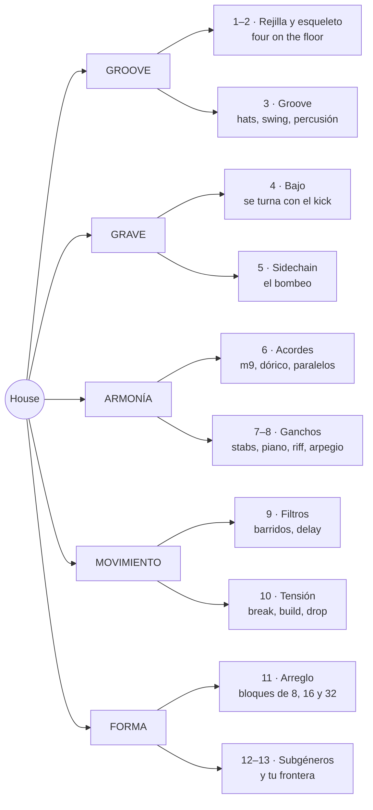
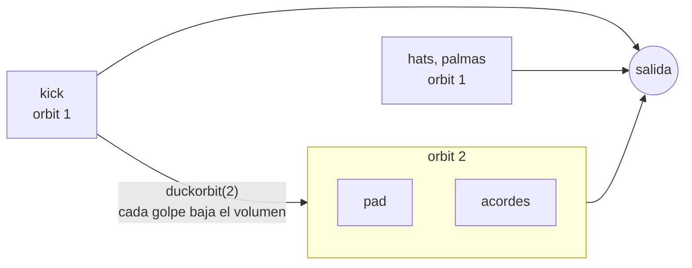
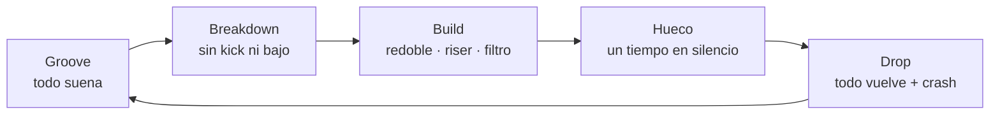

# House con Strudel, desde cero

> [!abstract] Qué es esta guía
> Cómo se arma un track de house completo, capa por capa: el esqueleto de batería,
> el groove, el bajo, el bombeo del sidechain, los acordes, los ganchos, los filtros,
> la tensión y el arreglo de pista de baile. Cada idea trae **pentagrama** cuando hay
> notas, **rejilla** cuando hay golpes y un **bloque de Strudel** para oírla, y
> termina en **la decisión que te deja tomar en una pieza tuya**.
>
> Da por sabido [[4. Instrumento/2. Strudel/3. Beats/1. Beats desde cero|Beats desde cero]]:
> rejilla, `stack`, `velocity`, swing, `cut`, `arrange`. Aquí se usan sin volver a explicarlos.
>
> Es material de apoyo generado por IA. La síntesis, o sea qué es el house *para ti*
> y qué te llevas a tus piezas, va en tus notas de concepto, y esas las escribes tú.

> [!tip] Cómo usarla
> - Dale play a cada bloque. Luego **cambia una sola cosa** y vuelve a escuchar.
> - **Los pentagramas son lo que suena.** Cada bloque `music-abc` está escrito con las
>   mismas notas que toca el bloque de Strudel que lo acompaña. Leer uno y escribir el
>   otro es la mitad del ejercicio.
> - Los bloques suenan **en Obsidian**, donde cargan las cajas de ritmos y los
>   instrumentos `gm_*`. La primera vez que pides un `gm_*` tarda en cargar: si el
>   primer compás sale mudo, dale play otra vez. El motor local
>   ([[4. Instrumento/2. Strudel/README|README]]) no carga samples; para Sonar ver §14.
> - Cada sección tiene su sesión práctica en `_lessons/` (§17). La guía explica; la
>   lección es donde lo escribes tú.
> - El house se oye con graves. Con los parlantes del portátil el bajo y el kick
>   casi desaparecen: usa audífonos.

---

## 0. El mapa

Un track de house contesta cinco preguntas: **qué late** (el groove), **qué
empuja abajo** (el grave), **qué color tiene** (la armonía), **qué se mueve**
(filtros y tensión) y **cuándo cambia** (la forma). La guía sigue ese orden.



### 0.1 De dónde viene

El house es **disco sin orquesta**. A finales de los 70 los DJs de Chicago y Nueva
York mezclaban disco para que la pista no parara; a mediados de los 80, en Chicago,
empezaron a hacer sus propios tracks con lo que había barato: cajas de ritmos de
Roland (TR-707, TR-909), un sinte de bajo que había fracasado (la TB-303) y un
sampler o un teclado. El nombre viene de **The Warehouse**, el club donde pinchaba
Frankie Knuckles.

| Época | Qué pasó | Para escuchar |
|---|---|---|
| finales de los 70 | disco: kick en negras, hat abierto en el contratiempo | Larry Levan en el Paradise Garage (NY) |
| 1984–86 | Chicago: cajas de ritmos + la idea del disco = house | Jesse Saunders, *On and On* · Marshall Jefferson, *Move Your Body* |
| 1986 | **deep house**: acordes de jazz y soul, menos golpe | Mr. Fingers (Larry Heard), *Can You Feel It* |
| 1987 | **acid**: la TB-303 con el filtro girando | Phuture, *Acid Tracks* |
| los 90 | **garage** de NY y NJ, piano house, **French house** filtrado | Robin S, *Show Me Love* · Stardust, *Music Sounds Better With You* |
| 2000s | el sidechain exagerado se vuelve estilo | Eric Prydz, *Call On Me* |
| 2010s–hoy | tech house, **lo-fi house**, afro house, melodic house | DJ Seinfeld · Black Coffee · Caribou, *Can't Do Without You* |

> [!tip] Qué decide en tu pieza
> El house es un género de **repetición con cambios mínimos**. Si vienes de componer
> canciones, el reto no es inventar más material: es **sostener poco material**
> durante mucho tiempo, cambiando una cosa cada vez. Es lo contrario de una forma
> binaria con contraste, y por eso entrena algo que la canción no entrena.

### 0.2 Cinco cosas que te ahorran horas

> [!warning] 1 · `.bank()` solo en la batería
> `.bank("RolandTR909")` antepone el nombre del banco a **todo** lo que toca. Si lo
> pones al final de un `stack` que también tiene un sinte, el sinte busca
> `RolandTR909_sawtooth`, no existe y **no suena**. Pon el banco capa por capa, o
> agrupa la batería en su propio `stack` (ver el aviso de §8 en Beats).

> [!warning] 2 · Para transponer notas con nombre, `.transpose()`
> `note("a2").add(12)` **no mueve nada**: suena `a2`. Usa `note("a2").transpose(12)`,
> o mete la suma dentro de las comillas: `note("a2".add(12))`.

> [!warning] 3 · Acordes: `F^7`, no `Fmaj7`
> Un símbolo que Strudel no conoce da **silencio sin error**. `Fmaj7`, `Cmaj9` y
> `Am13` no suenan. Los que sí, comprobados: `Am` `Am7` `Am9` `Am11` `Am6` · `D7` `D9`
> `G13` `G7sus` `Asus` · `F^7` (o `FM7`) `C^9` · `C6` `C69` `Cadd9` · `F` `C` `G`.

> [!warning] 4 · Una barra en las comillas no divide
> Dentro de comillas `/` es **ralentizar**: `"3/16"` es el 3 tocado cada 16 ciclos.
> Fuera de comillas es JavaScript: `.delaysync(3/16)` sí es tres dieciseisavos. Para
> un patrón de fracciones escribe decimales: `"<.1875 .125>"`.

> [!warning] 5 · Las señales se leen al empezar cada nota
> `.lpf(sine.range(300, 3000).slow(8))` fija el filtro **al inicio** de cada nota. En
> stabs cortos el barrido suena continuo; en un acorde de un compás entero, el filtro
> salta una vez por compás. Para barrer algo largo, pártelo en notas cortas o usa la
> envolvente del filtro (§9.3).

---

## 1. La rejilla del house

### 1.1 Tempo

El house vive entre **118 y 130 BPM**, casi siempre en 4/4. Con la convención de
siempre (1 ciclo = 1 compás) el tempo es `setcpm(BPM/4)`. La tabla dice cuánto dura
cada bloque de la forma, que es como piensa un track (§11):

| BPM | 1 compás | 8 compases | 32 compases |
|---:|---:|---:|---:|
| 118 | 2,03 s | 16,3 s | 65 s |
| 120 | 2,00 s | 16,0 s | 64 s |
| 122 | 1,97 s | 15,7 s | 63 s |
| 124 | 1,94 s | 15,5 s | 62 s |
| 126 | 1,90 s | 15,2 s | 61 s |
| 128 | 1,88 s | 15,0 s | 60 s |

Qué tempo para qué subgénero está en la tabla de §12.

### 1.2 La rejilla de 16 y `beat()`

Una TR-909 tiene **16 botones por compás**: cada uno es una semicorchea. El house se
programa así, encendiendo pasos. En Strudel hay dos maneras de escribirlo, y suenan
idéntico:

```text
paso    0 1 2 3   4 5 6 7   8 9 10 11   12 13 14 15
cuenta  1 e & a   2 e & a   3 e &  a    4  e  &  a
```

- **Por tiempos**, con un grupo `[ ]` por tiempo (la convención de Beats).
- **Por pasos**, con `.beat("posiciones", 16)`: la lista de botones encendidos,
  contando desde 0. Es la 909 escrita en texto.

| Por pasos | Por tiempos | Qué es |
|---|---|---|
| `s("bd").beat("0,4,8,12", 16)` | `s("bd*4")` | kick en los cuatro tiempos |
| `s("oh").beat("2,6,10,14", 16)` | `s("[~ oh]*4")` | hat abierto en los cuatro "&" |
| `s("cp").beat("4,12", 16)` | `s("~ cp ~ cp")` | palmas en 2 y 4 |
| `s("rim").beat("0,3,6,10,12", 16)` | `s("[rim ~ ~ rim] [~ ~ rim ~] [~ ~ rim ~] [rim ~ ~ ~]")` | clave son 3-2 |

```strudel
setcpm(124/4)
stack(
  s("bd").beat("0,4,8,12", 16),     // los cuatro tiempos
  s("oh").beat("2,6,10,14", 16),    // los cuatro "&"
).bank("RolandTR909")
```

Usa `beat` cuando pienses en **botones** (el kick en el 0, el rim en el 11) y los
grupos cuando pienses en **tiempos**. La última fila de la tabla es la razón para
conocer los dos: una clave se lee mucho mejor por pasos.

### 1.3 La frase: todo cambia en el compás 1 de un bloque de 8

El house piensa en **bloques de 8 compases**, y los bloques se agrupan en 16 y 32.
Un DJ mezcla dos tracks contando esos bloques, así que todo lo que entra o sale lo
hace **en el compás 1 de un bloque**. El compás 8 avisa con un fill o con un hueco.

```text
compás   1   2   3   4   5   6   7   8 │ 9   10 …
         ▲                           ▲ │ ▲
         entra o sale algo     hueco o fill   lo nuevo empieza aquí
```

```strudel
setcpm(124/4)
stack(
  s("<cr ~ ~ ~ ~ ~ ~ ~>"),                       // crash solo en el compás 1 de cada 8
  s("bd*4").lastOf(8, x => x.mask("1 1 1 0")),   // compás 8: el kick calla en el 4
  s("~ cp ~ cp"),
  s("[~ oh]*4"),
).bank("RolandTR909")
```

Dale play y cuenta hasta 8: el silencio del kick en el compás 8 hace que el 1
siguiente **pegue**. Es la herramienta de tensión más barata del género.

> [!tip] Qué decide en tu pieza
> El tempo decide el subgénero antes que cualquier sonido: a 118 es deep, a 128 es
> tech. Y el bloque de 8 decide **cuándo** puedes cambiar algo. Un cambio fuera de
> la rejilla de 8 suena a error, no a sorpresa.

---

## 2. El esqueleto: four on the floor

Cuatro capas, en este orden. Escucha cada bloque antes de pasar al siguiente.

**Solo kick**, en los cuatro tiempos. Es el corazón, y en house **no se mueve**: a
120 BPM un golpe por tiempo es el paso de alguien caminando rápido, y le da al DJ
una referencia constante para cuadrar dos tracks.

```strudel
setcpm(124/4)
s("bd*4").bank("RolandTR909")
```

**Más palmas** en 2 y 4: el backbeat de siempre. En house es más común la palma que
la caja: la palma suena a gente.

```strudel
setcpm(124/4)
stack(
  s("bd*4"),          // kick: los cuatro tiempos
  s("~ cp ~ cp"),     // palmas: 2 y 4
).bank("RolandTR909")
```

**Más hat abierto** en cada "&". Esto es **el** sonido del house: el kick dice
"tum", el hat abierto contesta "tss" justo en medio. Tum-tss-tum-tss. Sin él, un
four on the floor es techno o es una marcha.

```strudel
setcpm(124/4)
stack(
  s("bd*4"),
  s("~ cp ~ cp"),
  s("[~ oh]*4"),      // hat abierto: los cuatro "&"
).bank("RolandTR909")
```

**Más hats cerrados** rellenando las semicorcheas, con el abierto en el "&". Una
sola capa y `.cut(1)`: el cerrado corta la cola del abierto, como un hi-hat de verdad.

```strudel
setcpm(124/4)
stack(
  s("bd*4"),                              // kick: los cuatro tiempos
  s("~ cp ~ cp"),                         // palmas: 2 y 4
  s("[hh hh oh hh]*4").cut(1)             // cerrado, cerrado, ABIERTO, cerrado
    .velocity("[.5 .3 .8 .35]*4"),
).bank("RolandTR909")
```

En el pentagrama de percusión, con las plicas de las manos arriba y las del pie abajo:

```music-abc
X:1
T:Four on the floor
M:4/4
L:1/16
Q:1/4=124
K:C clef=perc
V:1 clef=perc stem=up name="Platos"
V:2 clef=perc stem=down name="Kick y palmas"
[V:1] !style=x!g!style=x!g!open!!style=x!g!style=x!g !style=x!g!style=x!g!open!!style=x!g!style=x!g !style=x!g!style=x!g!open!!style=x!g!style=x!g !style=x!g!style=x!g!open!!style=x!g!style=x!g |
[V:2] F4 [Fc]4 F4 [Fc]4 |
```

| En el pentagrama | Pieza | Strudel |
|---|---|---|
| ✕ encima de la última línea | hat cerrado | `hh` |
| ✕ con un círculo encima | hat abierto | `oh` |
| nota en el tercer espacio | palmas o caja | `cp` · `sd` |
| nota en el primer espacio | kick | `bd` |

Y en la rejilla, que es como lo vas a transcribir de oído:

```text
        1 e & a 2 e & a 3 e & a 4 e & a
oh      . . x . . . x . . . x . . . x .
hh      x x . x x x . x x x . x x x . x
palmas  . . . . x . . . . . . . x . . .
kick    x . . . x . . . x . . . x . . .
```

### 2.1 El backbeat: palmas, caja o las dos

| Backbeat | En Strudel | Carácter | Dónde vive |
|---|---|---|---|
| palmas | `cp` | abierto, humano | Chicago, deep |
| caja | `sd` | seco, con pegada | garage, tech |
| las dos | `[cp,sd]` | gordo | garage, piano house |
| aro | `rim` | íntimo, pequeño | deep, minimal |

```strudel
setcpm(124/4)
stack(
  s("bd*4"),
  s(cat(
    "~ cp ~ cp",               // palmas
    "~ sd ~ sd",               // caja
    "~ [cp,sd] ~ [cp,sd]",     // las dos a la vez: más gorda
    "~ rim ~ rim",             // aro: íntimo
  )),
  s("[~ oh]*4").velocity(.7),
).bank("RolandTR909")
```

La 909 trae 16 cajas y 5 palmas: prueba `sd:3`, `sd:9`, `cp:2` (se cuenta desde 0).

> [!tip] Qué decide en tu pieza
> En house **el kick no se mueve nunca**; lo que decide el subgénero es todo lo que
> pasa encima. Si un track tuyo "no suena a house", antes de tocar acordes revisa
> dos cosas: ¿hay hat abierto en el "&"? ¿el kick cae en los cuatro tiempos?

---

## 3. El groove: lo que pasa encima del kick

### 3.1 Cuatro maneras de tocar los hats

| Patrón | Por tiempo | En Strudel | Dónde |
|---|---|---|---|
| solo abierto | `. . x .` | `[~ oh]*4` | deep, minimal |
| corcheas | `c . a .` | `[hh oh]*4` | clásico, disco |
| galope | `x x . x` | `[hh hh ~ hh]*4` | Chicago, *jackin'* |
| semicorcheas | `x x X x` | `hh*16` con acentos | tech, garage |

```strudel
setcpm(124/4)
stack(
  s("bd*4, ~ cp ~ cp"),
  s(cat(
    "[~ oh]*4",               // 1 · solo el abierto
    "[hh oh]*4",              // 2 · cerrado en el tiempo, abierto en el "&"
    "[hh hh ~ hh]*4",         // 3 · galope
    "hh*16",                  // 4 · semicorcheas
  )).cut(1).velocity("[.45 .3 .75 .3]*4"),
).bank("RolandTR909")
```

`.velocity("[.45 .3 .75 .3]*4")` tiene 16 valores, uno por paso, así que sirve para
las cuatro variantes: siempre acentúa el "&".

### 3.2 Swing de semicorcheas

El swing del house es **de semicorcheas** y **poco**: `.swingBy(x, 8)` parte el
compás en 8 pares de semicorcheas y atrasa la segunda de cada par, o sea la "e" y la
"a". Fíjate en lo que eso implica:

```text
paso    0 1 2 3 4 5 6 7 8 9 10 11 12 13 14 15
        1 e & a 2 e & a 3 e &  a  4  e  &  a
se mueve  ↑   ↑   ↑   ↑   ↑    ↑     ↑     ↑      solo los pasos impares
```

El kick, las palmas y el hat abierto caen en pasos pares, así que **no se mueven**.
El swing solo empuja los hats cerrados y la percusión que caen entre medias. Por eso
puedes poner mucho swing sin que el track se tambalee.

| Swing MPC | `swingBy(x, 8)` | Se siente |
|---:|---:|---|
| 50 % | `0` | recto, de máquina |
| 54 % | `.08` | apenas: ya respira |
| 56 % | `.12` | el punto dulce de mucho deep house |
| 58 % | `.16` | relajado, garage |
| 62 % | `.24` | shuffle marcado |
| 66 % | `.33` | tresillo completo |

Un compás por valor: 50 %, 54 %, 58 % y 62 %.

```strudel
setcpm(124/4)
stack(
  s("bd*4, ~ cp ~ cp").bank("RolandTR909"),
  s("[hh hh oh hh]*4").cut(1).velocity("[.45 .3 .75 .3]*4").bank("RolandTR909"),
  s("shaker_small*16").velocity("[.5 .25 .35 .25]*4").pan(.7),
).swingBy("<0 .08 .16 .24>", 8)
```

### 3.3 La percusión: la raíz latina

El house heredó del disco y de la salsa de Nueva York una banda de percusión. Cada
instrumento tiene un trabajo y un sitio en el panorama:

| Instrumento | En Strudel | Dónde cae | Trabajo | Pan |
|---|---|---|---|---|
| shaker | `shaker_small`, `shaker_large` | semicorcheas, bajito | aire, velocidad | a un lado |
| pandereta | `tambourine` | 2 y 4, o en el "&" | brillo, gospel | al otro |
| conga abierta | `conga:4` | síncopas | la conversación | centro-izquierda |
| quinto (aguda) | `conga:14` | pocas, sorpresas | el adorno | izquierda |
| tumba (grave) | `conga:26` | antes del 1 | empuja al tiempo fuerte | centro |
| clave | `clave` | patrón fijo | el reloj latino | centro |
| cencerro | `cb` del `RolandTR808` | uno o dos por compás | color, humor | un lado |
| bongó, cabasa, agogó | `bongo`, `cabasa`, `agogo` | — | color | — |

Sin banco: casi todos vienen de la biblioteca acústica (VCSL), y `.bank()` los
rompería. Las tres congas del mismo instrumento, en la rejilla:

```text
        1 e & a 2 e & a 3 e & a 4 e & a
quinto  . . . x . . . . . . x . . . . .
conga   x . . . . . x . x . . . x . x .
tumba   . . . . . . . . . . . . . . . x
kick    x . . . x . . . x . . . x . . .
```

```strudel
setcpm(124/4)
stack(
  s("bd*4, ~ cp ~ cp").bank("RolandTR909"),
  s("[~ oh]*4").bank("RolandTR909").velocity(.6),
  s("conga:4").beat("0,6,8,12,14", 16).velocity(.6).pan(.35),   // conga abierta
  s("conga:14").beat("3,10", 16).velocity(.5).pan(.25),         // quinto
  s("conga:26").beat("15", 16).velocity(.7).pan(.45),           // tumba: empuja al 1
  s("tambourine").beat("4,12", 16).velocity(.4).pan(.75),       // pandereta con las palmas
  s("shaker_small*16").velocity("[.35 .15 .25 .15]*4").pan(.7),
).swingBy(.12, 8)
```

### 3.4 La clave encima del cuatro

Una clave es un patrón **irregular** que se repite: contra un kick perfectamente
regular, genera la tensión del afro house y del house latino. Las dos más útiles:

```text
                1 e & a 2 e & a 3 e & a 4 e & a
tresillo doble  x . . x . . x . x . . x . . x .     3+3+2 en cada mitad
clave son 3-2   x . . x . . x . . . x . x . . .     tres golpes, luego dos
kick            x . . . x . . . x . . . x . . .
```

El tresillo es la célula de [[1. Teoría/6. Ritmo/1. Motivos rítmicos]], ahora en
semicorcheas. Un compás de cada uno:

```strudel
setcpm(122/4)
stack(
  s("bd*4, [~ oh]*4").bank("RolandTR909"),
  s("clave")
    .beat("<[0,3,6,8,11,14] [0,3,6,10,12]>", 16)   // compás 1 tresillo doble · compás 2 clave 3-2
    .velocity(.7),
)
```

> [!tip] Qué decide en tu pieza
> El groove es **qué se mueve encima de algo que no se mueve**. Elige uno solo de
> estos ejes como protagonista: los hats, el swing o la percusión. Si los tres
> compiten, el oído no sabe a quién seguir y el track se siente nervioso en lugar
> de bailable.

---

## 4. El bajo: el otro corazón

En house el bajo es **el segundo tambor**. Su regla viene de
[[4. Instrumento/2. Strudel/3. Beats/1. Beats desde cero|Beats §11.1]]:
el kick y el bajo comparten registro, así que o se abrazan o **se turnan**. El house
casi siempre elige turnarse:

```text
        1 e & a 2 e & a 3 e & a 4 e & a
kick    x . . . x . . . x . . . x . . .
bajo    . . x . . . x . . . x . . . x .     cada uno en su hueco: el grave nunca choca
```

Todos los ejemplos están en **la menor**, la tonalidad más común del house (y la
más cómoda para leer).

### 4.1 En contratiempo

El bajo más básico del deep y del tech house: una nota en cada "&", exactamente
donde no está el kick. Kick y bajo forman un solo instrumento que hace tum-bom-tum-bom.

```music-abc
X:2
T:Bajo en contratiempo
M:4/4
L:1/8
Q:1/4=124
K:Am
V:1 clef=bass name="Bajo"
[V:1] "Am"z A,, z A,, z A,, z A,, | "Am"z A,, z A,, z A,, z A,, | "F"z F,, z F,, z F,, z F,, | "G"z G,, z G,, z G,, z G,, |
```

```strudel
setcpm(124/4)
stack(
  s("bd*4, [~ oh]*4").bank("RolandTR909"),
  note("<a2 a2 f2 g2>").struct("[~ x]*4")   // una raíz por compás, tocada en cada "&"
    .s("sawtooth").lpf(400)
    .decay(.2).sustain(0),                 // corta: deja el hueco para el kick siguiente
)
```

`.struct("[~ x]*4")` pone el ritmo; `note("<a2 a2 f2 g2>")` pone qué nota suena en
cada compás. Separar **qué** de **cuándo** es la idea que más se repite en esta guía.

### 4.2 De octavas: el bajo del disco

Raíz abajo en el tiempo, la misma nota una octava arriba en el "&". Es el bajo del
disco y del French house: rebota.

```music-abc
X:3
T:Bajo de octavas
M:4/4
L:1/8
Q:1/4=124
K:Am
V:1 clef=bass name="Bajo"
[V:1] "Am"A,,A, A,,A, A,,A, A,,A, | "G"G,,G, G,,G, G,,G, G,,G, |
```

```strudel
setcpm(124/4)
stack(
  s("bd*4, [~ oh]*4").bank("RolandTR909"),
  note("<a2 g2>").struct("x*8")      // la raíz del compás, en corcheas
    .transpose("[0 12]*4")           // abajo, arriba, abajo, arriba
    .s("sawtooth").lpf(700).decay(.15).sustain(0),
)
```

Aquí el bajo **sí** coincide con el kick en cada tiempo: se abrazan. Funciona
porque la nota de abajo es corta y la de arriba ya está en otro registro.

### 4.3 Sincopado

El bajo de Chicago y del garage: la nota del "&" sigue ahí, pero se le suman
anticipaciones en la "a" que empujan hacia el tiempo siguiente.

```text
        1 e & a 2 e & a 3 e & a 4 e & a
kick    x . . . x . . . x . . . x . . .
bajo    . . A . . . A C . . A . . E . G
```

```music-abc
X:4
T:Bajo sincopado
M:4/4
L:1/16
Q:1/4=124
K:Am
V:1 clef=bass name="Bajo"
[V:1] "Am"z2A,,z z2A,,C, z2A,,z zE,,zG,, |
```

```strudel
setcpm(124/4)
stack(
  s("bd*4, ~ cp ~ cp").bank("RolandTR909"),
  note("[~ ~ a2 ~] [~ ~ a2 c3] [~ ~ a2 ~] [~ e2 ~ g2]")
    .s("sawtooth").lpf(500).decay(.15).sustain(0),
)
```

### 4.4 Acid: la 303

La TB-303 era un bajo para guitarristas que nadie compró. En Chicago descubrieron
que si girabas el **filtro** mientras tocaba, chillaba. El acid es eso: una línea de
semicorcheas con saltos de octava, **acentos** que abren el filtro y la perilla de
cutoff moviéndose sola.

```music-abc
X:5
T:Línea acid: acentos en 3+3+3+3+2+2
M:4/4
L:1/16
Q:1/4=126
K:Am
V:1 clef=bass name="303"
[V:1] !>!A,,A,,A,!>!A,, C,A,,!>!G,A,, A,,!>!E,A,,A, !>!G,,A,,!>!C,D, |
```

Los acentos no siguen los tiempos: van en grupos de **3+3+3+3+2+2** y se desplazan
contra el kick. Eso es lo hipnótico del acid.

```strudel
setcpm(126/4)
stack(
  s("bd*4, [~ oh]*4").bank("RolandTR909"),
  note("a2 a2 a3 a2 c3 a2 g3 a2 a2 e3 a2 a3 g2 a2 c3 d3")
    .velocity("1 .6 .6 1 .6 .6 1 .6 .6 1 .6 .6 1 .6 1 .6")   // acentos: más fuerte…
    .lpenv("4 2 2 4 2 2 4 2 2 4 2 2 4 2 4 2")                // …y el filtro abre más
    .s("sawtooth")
    .lpf(sine.range(400, 2400).slow(8))   // la perilla de cutoff, girando sola
    .lpq(16)                              // resonancia alta: el chillido
    .lpdecay(.12)
    .decay(.15).sustain(0)
    .shape(.3),                           // la 303 casi siempre pasa por distorsión
)
```

> [!note] Lo que Strudel no hace
> La 303 tiene **slide**: algunas notas se deslizan hacia la siguiente. Los sintes
> de Strudel no tienen portamento, así que el acid de aquí suena más "picado" que el
> original. En Sonar, con un sinte de verdad, el slide existe.

### 4.5 El sonido del bajo

El mismo ritmo cambia de época según el sonido. La línea de 4.3 pasando por cinco,
dos compases cada uno:

```strudel
setcpm(124/4)
const linea = note("[~ ~ a2 ~] [~ ~ a2 c3] [~ ~ a2 ~] [~ e2 ~ g2]")

stack(
  s("bd*4").bank("RolandTR909"),
  arrange(
    [2, linea.s("sawtooth").lpf(500).decay(.15).sustain(0)],   // deep, tech: redondo
    [2, linea.s("square").lpf(900).decay(.12).sustain(0)],     // Chicago: hueco, nasal
    [2, linea.s("gm_synth_bass_1")],                           // los 90
    [2, linea.s("gm_drawbar_organ")],                          // garage: el bajo de órgano
    [2, linea.s("gm_electric_bass_finger")],                   // disco, soulful: un bajista
  ),
)
```

| Sonido | En Strudel | Dónde vive |
|---|---|---|
| sierra filtrada | `sawtooth` + `lpf(300–700)` | deep, tech, casi todo |
| cuadrada | `square` + `lpf` | Chicago, acid |
| seno | `sine` | sub; lo-fi; deep minimal |
| bajo de sinte | `gm_synth_bass_1`, `gm_synth_bass_2` | 90s |
| órgano | `gm_drawbar_organ` | garage de los 90 (el bajo de *Show Me Love* es un preset de órgano del Korg M1) |
| bajo eléctrico | `gm_electric_bass_finger`, `gm_slap_bass_1` | disco, soulful, nu-disco |

### 4.6 Cuerpo y sub

Un truco de producción: dos capas con el mismo ritmo. Una **sierra** que se oye en
cualquier parlante y un **seno una octava abajo** que se siente en el pecho.

```strudel
setcpm(124/4)
const linea = note("<a2 a2 f2 g2>").struct("[~ x]*4")

stack(
  s("bd*4").bank("RolandTR909"),
  linea.s("sawtooth").lpf(600).decay(.2).sustain(0).gain(.6),   // el cuerpo
  linea.transpose(-12).s("sine").decay(.25).sustain(0),         // el sub: A1 = 55 Hz
)
```

Comenta la segunda capa y vuelve a escucharla con audífonos: el bajo "existe" igual,
pero pierde el peso.

> [!tip] Qué decide en tu pieza
> Kick y bajo deciden el subgénero más que cualquier acorde. La pregunta es una:
> **¿se turnan o se abrazan?** Turnarse da el bombeo del deep y del tech; abrazarse
> da el rebote del disco. Y la prueba de siempre: solo kick y bajo, ¿ya hay track?

---

## 5. Sidechain: el bombeo

Cada golpe del kick **baja el volumen** de todo lo demás durante un instante, y lo
demás vuelve a subir en el hueco. Los pads "respiran" al ritmo del kick. Nació como
un truco de mezcla para que el kick se oyera encima de todo; el French house y
después todo el house de los 2000 lo convirtieron en el sonido mismo.

```text
kick     █       █       █       █
pad      ▁▃▅▇▇▇▇▇▁▃▅▇▇▇▇▇▁▃▅▇▇▇▇▇▁▃▅▇▇▇▇▇
         1   &   2   &   3   &   4   &
```

El pad toca el fondo en cada tiempo y vuelve a estar arriba en el "&", **justo
donde suena el hat abierto**. El bombeo y el hat dicen lo mismo: por eso funcionan juntos.

### 5.1 Cómo se hace en Strudel: orbits

Strudel manda cada sonido a un **orbit**, un bus de mezcla (por defecto, el 1). El
kick puede "agachar" otro orbit entero:



| Función | Va en | Qué hace | Para empezar |
|---|---|---|---|
| `.orbit(2)` | la víctima: pad, acordes | la manda al bus 2 | — |
| `.duckorbit(2)` | el kick | cada golpe baja el volumen del orbit 2 | — |
| `.duckdepth(0–1)` | el kick | cuánto baja: 0 nada, 1 silencio | `.6`–`.8` |
| `.duckattack(s)` | el kick | segundos que tarda en **volver**, pese al nombre | una corchea: `30/BPM` |
| `.duckonset(s)` | el kick | segundos que tarda en **bajar**; con 0 hace clic | `.005` |

La regla de oro: que vuelva **justo a tiempo para el "&"**, o sea en una corchea.

| BPM | Una corchea = `duckattack` |
|---:|---:|
| 118 | `.25` |
| 120 | `.25` |
| 124 | `.24` |
| 128 | `.23` |

Primer compás sin bombeo, segundo con bombeo:

```strudel
setcpm(124/4)
stack(
  s("bd*4").bank("RolandTR909")
    .duckorbit(2).duckattack(.24).duckonset(.005)
    .duckdepth("<0 .8>"),                 // compás 1: no agacha · compás 2: agacha mucho
  chord("<Am9>").voicing()                // un acorde sostenido todo el compás
    .s("sawtooth").lpf(1400).gain(.35)
    .orbit(2),                            // ← la víctima vive en el orbit 2
)
```

### 5.2 Dos víctimas, dos profundidades

Con `:` el kick agacha varios orbits a la vez, cada uno con su profundidad:

```strudel
setcpm(124/4)
stack(
  s("bd*4").bank("RolandTR909")
    .duckorbit("2:3").duckdepth(".8:.3").duckattack(.24),   // pad hondo, bajo apenas
  chord("<Am9 D9>").voicing()
    .s("sawtooth").lpf(1400).gain(.3).orbit(2),
  note("<a2 d2>").struct("[~ x]*4")
    .s("sawtooth").lpf(400).decay(.2).sustain(0).orbit(3),
  s("[~ oh]*4, ~ cp ~ cp").bank("RolandTR909"),             // orbit 1: no se mueve
)
```

Si el bajo ya va en contratiempo, el sidechain casi no lo toca: ya se turnan con el
kick. **El sidechain importa en lo que suena largo**: pads, cuerdas, reverb.

> [!warning] Tres cosas del orbit
> - **"duck target orbit 2 does not exist"** en la consola: el kick sonó antes que
>   nada en el orbit 2. Es inofensivo y desaparece en cuanto la víctima suena.
> - **La reverb y el delay son del orbit.** Las capas que comparten orbit comparten
>   sala (`roomsize`) y tiempo de delay. Si dos capas necesitan espacios distintos,
>   van en orbits distintos.
> - **No agaches los hats.** Se quedan en el orbit 1: son el reloj, y un reloj que
>   bombea marea.

> [!tip] Qué decide en tu pieza
> Cuánto bombea es una decisión de época: el deep clásico casi nada, el French house
> y el house de festival a fondo. Pero también es una decisión emocional: un pad que
> respira con el kick suena **vivo**; uno que no, suena a fondo de pantalla.

---

## 6. Armonía: el color del house

La armonía del house viene del soul, del gospel y del jazz, pasando por el disco:
**acordes con séptima y novena, casi siempre menores, casi siempre pocos**. Un
track puede vivir diez minutos sobre dos acordes. Lo que importa no es adónde va
la progresión sino **qué color tiene** y **cuánto dura** cada acorde.

Las bases están en tus notas: [[1. Teoría/1. Armonía/8. Tensiones]] (qué es una
novena o una oncena) y [[1. Teoría/1. Armonía/0. Modos]] (el dórico, que es el
modo del house).

### 6.1 Séptimas, novenas, oncenas

Misma raíz, cada vez más color. El pentagrama es exactamente el voicing que elige Strudel:

```music-abc
X:6
T:Misma raíz, cada vez más color
M:4/4
L:1/1
Q:1/4=120
K:Am
V:1 clef=treble name="Derecha"
V:2 clef=bass name="Izquierda"
[V:1] "Am"[CEAc] | "Am7"[CEGc] | "Am9"[CEGB] | "Am11"[DGB] |
[V:2] A, | A, | A, | [E,A,] |
```

```strudel
setcpm(120/4)
chord("<Am Am7 Am9 Am11>")      // un compás cada uno
  .voicing().s("gm_epiano1").room(.3)
```

Fíjate en el último: Strudel arma el `Am11` **sin la tercera** (no hay do). Sin
tercera el acorde no es ni del todo menor ni mayor: flota. Es un sonido muy del
deep house.

| Acorde | En Strudel | Notas | Cómo suena |
|---|---|---|---|
| menor | `Am` | A C E | directo |
| m7 | `Am7` | A C E G | soul, nocturno |
| m9 | `Am9` | A C E G B | **el** acorde del deep house: triste y cálido a la vez |
| m11 | `Am11` | A E G B D, sin la C | abierto, flotante |
| 9 | `D9` | D F♯ A C E | el IV del dórico: una luz dentro del menor |
| maj7 | `F^7` | F A C E | nostalgia luminosa |
| maj9 | `C^9` | C E G B D | brillo suave |
| 6/9 | `C69` | C E G A D | garage, soul |
| 13 | `G13` | G B F A E | gospel, garage |
| 7sus | `G7sus` | G C D F | suspendido: no resuelve |

Recuerda la regla 3 de §0.2: `Fmaj7` y `Cmaj9` **no suenan**; se escriben `F^7` y `C^9`.

### 6.2 El dórico: la sexta mayor

La menor natural tiene F; **la menor dórica tiene F♯**. Esa única nota convierte el
iv menor (Dm) en un IV mayor (D), y el par **i9 – IV9** es el vaivén más clásico del
deep house: triste, pero con una ventana abierta.

```music-abc
X:7
T:Dórico: i9 – IV9
M:4/4
L:1/1
Q:1/4=122
K:Am
V:1 clef=treble name="Derecha"
V:2 clef=bass name="Izquierda"
[V:1] "Am9"[CEGB] | "D9"[CE^FA] |
[V:2] A, | D, |
```

Mira la conducción: **C y E se quedan**, G baja a F♯ y B baja a A. Todo se mueve por
grado conjunto. Y los tonos guía ([[1. Teoría/2. Conducción/09. Tonos guía]]): la
tercera de Am9 (C) es la séptima de D9; la séptima de Am9 (G) baja medio tono a la
tercera de D9 (F♯). Dos notas cuentan toda la progresión.

```strudel
setcpm(122/4)
stack(
  s("bd*4, ~ cp ~ cp, [~ oh]*4").bank("RolandTR909"),
  chord("<Am9 D9>").voicing().s("gm_epiano1").gain(.8),
)
```

### 6.3 Seis progresiones de house

Todas en la menor. Los números romanos son respecto a A.

| Nombre | Grados | En Strudel | Carácter |
|---|---|---|---|
| vamp | i9 | `"<Am9>"` | hipnótico: lo mueven el filtro y el ritmo |
| dórico | i9 – IV9 | `"<Am9 D9>"` | deep house clásico |
| menor | i7 – iv9 | `"<Am7 Dm9>"` | oscuro, nocturno |
| descenso | i9 – VII6 – VI^7 – v7 | `"<Am9 G6 F^7 Em7>"` | melancolía que cae: tu terreno |
| soul | iv9 – VII13 – III^7 – VI^7 | `"<Dm9 G13 C^7 F^7>"` | garage, gospel: quintas descendentes |
| himno | i – VI – III – VII | `"<Am F C G>"` | piano house de los 90 |

Una sola batería y las seis progresiones en un objeto: cambias **una palabra** y
escuchas otra.

```strudel
setcpm(122/4)
const prog = {
  vamp:     "<Am9>",
  dorico:   "<Am9 D9>",
  menor:    "<Am7 Dm9>",
  descenso: "<Am9 G6 F^7 Em7>",
  soul:     "<Dm9 G13 C^7 F^7>",
  himno:    "<Am F C G>",
}

stack(
  s("bd*4, ~ cp ~ cp, [~ oh]*4").bank("RolandTR909"),
  chord(prog.descenso)                  // ← cambia solo esta palabra
    .voicing().s("gm_epiano1").gain(.8),
)
```

Más progresiones para robarte: [[1. Teoría/1. Armonía/Progresiones/0. Progresiones melancólicas]].
Cómo construir las tuyas desde un modo: [[1. Teoría/1. Armonía/5. Crear progresiones modales]].

### 6.4 Ritmo armónico: cuánto dura cada acorde

| Cada acorde dura | En Strudel | Efecto |
|---|---|---|
| 1 compás | `"<Am9 D9>"` | inquieto, pop |
| 2 compases | `"<Am9!2 D9!2>"` | el estándar del house |
| 4 compases | `"<Am9!4 D9!4>"` | profundo, hipnótico |
| desigual | `"<Am9!3 D9>"` | el cambio se vuelve un evento |

`!2` repite el elemento: `"<Am9!2 D9!2>"` es `"<Am9 Am9 D9 D9>"`.

```strudel
setcpm(122/4)
stack(
  s("bd*4, ~ cp ~ cp, [~ oh]*4").bank("RolandTR909"),
  chord("<Am9!3 D9>")                   // tres compases en casa, uno fuera
    .voicing().s("gm_epiano1").gain(.8),
)
```

### 6.5 Memoria de acorde: la forma que se mueve entera

Muchos sintes de los 80 tenían **memoria de acorde**: guardabas un acorde y cada
tecla tocaba esa misma forma transportada. El house temprano la usó muchísimo, y de
ahí sale un sonido muy característico: **todos los acordes tienen la misma
calidad** y se mueven en paralelo, aunque no pertenezcan a la tonalidad.

```music-abc
X:8
T:Memoria de acorde: un m9 que se mueve entero
M:4/4
L:1/1
Q:1/4=122
K:Am
V:1 clef=treble name="Derecha"
V:2 clef=bass name="Izquierda"
[V:1] "Am9"[CEGB] | "Gm9"[_B,DFA] | "Fm9"[_A,C_EG] | "Gm9"[_B,DFA] |
[V:2] A, | G, | F, | G, |
```

```strudel
setcpm(122/4)
stack(
  s("bd*4, ~ cp ~ cp, [~ oh]*4").bank("RolandTR909"),
  note("[a3,c4,e4,g4,b4]")              // la forma congelada: un Am9
    .transpose("<0 -2 -4 -2>")          // movida entera: Am9 Gm9 Fm9 Gm9
    .struct("[~ ~ x ~]*4")              // en stabs, como en los 80
    .s("sawtooth").lpf(1600).decay(.18).sustain(0).gain(.35),
)
```

En una coral esto está prohibido: son quintas y octavas paralelas a montones
([[1. Teoría/2. Conducción/04. Reglas de voicing]]). Aquí es el punto. El oído deja
de seguir la **función** y sigue la **forma**, igual que en la armonía no funcional
de [[5. Referencias/3. Cursos/Cresciente/3. Ampliando lenguaje/5B. Armonía no funcional|Cresciente 5B]].

> [!tip] Qué decide en tu pieza
> Dos decisiones, y en este orden: **un color** (m9, dórico, paralelos) y **un ritmo
> armónico** (cuántos compases por acorde). Si dudas entre dos progresiones, quédate
> con la que tiene menos acordes: en house, la repetición hace el trabajo que en una
> canción hace la variedad.

---

## 7. Stabs, piano y teclas: acordes que golpean

En house los acordes rara vez están quietos: **golpean**. Un *stab* es un acorde
corto en un sitio del compás que no es el tiempo. El ritmo del stab es, muchas
veces, el gancho del track.

### 7.1 Cuatro ritmos de stab

```text
                1 e & a 2 e & a 3 e & a 4 e & a
contratiempo    . . x . . . x . . . x . . . x .
charleston      x . . . . . x . . . . . . . . .
tresillo doble  x . . x . . x . x . . x . . x .
deep            . . . x . . x . . . . x . . x .     todo fuera del tiempo
kick            x . . . x . . . x . . . x . . .
```

Un compás de cada uno:

```strudel
setcpm(122/4)
stack(
  s("bd*4, ~ cp ~ cp").bank("RolandTR909"),
  chord("<Am9 D9>")
    .struct(cat(
      "[~ ~ x ~]*4",                                // contratiempo
      "[x ~ ~ ~] [~ ~ x ~] ~ ~",                    // charleston
      "[x ~ ~ x] [~ ~ x ~] [x ~ ~ x] [~ ~ x ~]",    // tresillo doble
      "[~ ~ ~ x] [~ ~ x ~] [~ ~ ~ x] [~ ~ x ~]",    // deep
    ))
    .voicing()
    .s("sawtooth").lpf(1800).decay(.15).sustain(0).gain(.4)
    .room(.3),
)
```

Igual que el bajo de §4.1: `chord()` dice **qué**, `.struct()` dice **cuándo**.

### 7.2 El empujón: el acorde que llega antes

En garage y en piano house, el acorde del compás siguiente **llega en el "&" del 4**,
una corchea antes, y se queda sonando a través de la barra. Se llama anticipación,
y hace que la armonía parezca tener prisa por bailar.

```music-abc
X:9
T:El acorde llega antes: anticipación en el & del 4
M:4/4
L:1/8
Q:1/4=122
K:Am
V:1 clef=treble name="Derecha"
V:2 clef=bass name="Izquierda"
[V:1] "Am9"[CEGB]7 "D9"[CE^FA]- | [CE^FA]7 "Am9"[CEGB] |
[V:2] A,7 D,- | D,7 A, |
```

En Strudel no hace falta escribirlo nota por nota: se adelanta **toda la armonía**
con `.early(1/8)`, y cada acorde empieza una corchea antes de su compás.

```strudel
setcpm(122/4)
stack(
  s("bd*4, ~ cp ~ cp, [~ oh]*4").bank("RolandTR909"),
  chord("<Am9 D9>")
    .early(1/8)                         // toda la armonía, una corchea antes
    .voicing().s("gm_epiano1").gain(.8),
)
```

El primer compás arranca mudo hasta el "&" del 4: el acorde "empezó" antes de que
le dieras play.

Con stabs es lo mismo: `.early()` va **antes** del `.struct()`, así el ritmo se
queda en su sitio y lo que se adelanta es la armonía. Aquí, charleston más empujón:

```strudel
setcpm(122/4)
stack(
  s("bd*4, ~ cp ~ cp, [~ oh]*4").bank("RolandTR909"),
  chord("<Am9 D9>")
    .early(1/8)                                  // la armonía se adelanta…
    .struct("[x ~ ~ ~] [~ ~ x ~] ~ [~ ~ x ~]")   // …y el golpe del & del 4 ya es el acorde nuevo
    .voicing().s("piano"),
)
```

### 7.3 Piano house

El piano de los 90 (house italiano, garage) toca acordes llenos en un ritmo de
**3+3+4+3+3** semicorcheas: casi una clave, con mucho cuerpo.

```music-abc
X:10
T:Piano house: 3+3+4+3+3
M:4/4
L:1/16
Q:1/4=124
K:Am
V:1 clef=treble name="Derecha"
V:2 clef=bass name="Izquierda"
[V:1] "Am"[CEAc]3[CEAc]3[CEAc]4 [CEAc]3[CEAc]3 | "F"[CFAc]3[CFAc]3[CFAc]4 [CFAc]3[CFAc]3 |
[V:2] A,3A,3A,4 A,3A,3 | F,3F,3F,4 F,3F,3 |
[V:1] "C"[CEGc]3[CEGc]3[CEGc]4 [CEGc]3[CEGc]3 | "G"[DGB]3[DGB]3[DGB]4 [DGB]3[DGB]3 |
[V:2] E,3E,3E,4 E,3E,3 | G,3G,3G,4 G,3G,3 |
```

```strudel
setcpm(124/4)
stack(
  s("bd*4, ~ cp ~ cp, [~ oh]*4").bank("RolandTR909"),
  chord("<Am F C G>")
    .struct("x@3 x@3 x@4 x@3 x@3")      // 3+3+4+3+3 semicorcheas
    .voicing().s("piano").gain(.9),
)
```

`x@3` es un golpe que ocupa 3 de los 16 pasos. Fíjate en el C: el voicing lo pone
en primera inversión (mi abajo) porque busca la posición más cercana a los otros.

### 7.4 La paleta de teclas

El mismo stab cambia de época según el sonido, dos compases cada uno:

```strudel
setcpm(124/4)
const stab = chord("<Am9 D9>")
  .struct("[~ ~ ~ x] [~ ~ x ~] [~ ~ ~ x] [~ ~ x ~]")
  .voicing()

stack(
  s("bd*4, ~ cp ~ cp").bank("RolandTR909"),
  arrange(
    [2, stab.s("sawtooth").lpf(1800).decay(.15).sustain(0).gain(.4)],   // sinte: rave, tech
    [2, stab.s("piano")],                                               // piano house
    [2, stab.s("gm_epiano1")],                                          // Rhodes: deep
    [2, stab.s("gm_drawbar_organ").gain(.6)],                           // órgano: garage
    [2, stab.s("gm_string_ensemble_1")],                                // cuerdas: disco
    [2, stab.s("gm_orchestra_hit").gain(.5)],                           // orquesta: hip house
  ),
)
```

| Sonido | En Strudel | Dónde vive |
|---|---|---|
| sierra con filtro | `sawtooth` · `supersaw` (más ancha y más pesada para la CPU) | rave, tech, progressive |
| piano | `piano` · `steinway` | piano house, Italo de los 90 |
| Rhodes | `gm_epiano1` | deep, soulful |
| órgano | `gm_drawbar_organ` · `organ_full` | garage |
| cuerdas | `gm_string_ensemble_1` · `gm_synth_strings_1` | disco, soulful |
| golpe de orquesta | `gm_orchestra_hit` | hip house de los 90 |
| pad | `gm_pad_warm` · `sawtooth` con `.attack()` lento | deep, melodic |

> [!tip] Qué decide en tu pieza
> Con un stab bien colocado ya tienes gancho. La decisión es **el ritmo** (cuál de
> los cuatro, o uno tuyo) y **el sonido** (la época). Elige el ritmo con un sonido
> neutro, y el sonido al final: si el ritmo no funciona con una sierra seca, un
> piano no lo va a arreglar.

---

## 8. Melodía: riffs, arpegios y voces

La melodía del house es **corta y repetida**: un motivo de uno o dos compases que
vuelve cientos de veces y cambia muy poco. Es la teoría de motivos de
[[1. Teoría/4. Melodía/0. Enlaces 2.0 y motivos]] llevada al extremo: el motivo no
se desarrolla, **se repite hasta hipnotizar**, y la variación llega cada 4 u 8 compases.

### 8.1 El riff: pregunta y respuesta

Dos compases, pentatónica menor de A. El primero pregunta (se queda arriba, en mi);
el segundo contesta (sube y vuelve a casa, a la).

```music-abc
X:11
T:Riff de dos compases: pregunta y respuesta
M:4/4
L:1/16
Q:1/4=124
K:Am
"Am"Az2d z2gz zez2 z4 | "Am"Az2d z2gz zagz dzAz |
```

```strudel
setcpm(124/4)
stack(
  s("bd*4, ~ cp ~ cp, [~ oh]*4").bank("RolandTR909"),
  n(cat(
    "[0 ~ ~ 2] [~ ~ 4 ~] [~ 3 ~ ~] ~",           // pregunta: termina en mi
    "[0 ~ ~ 2] [~ ~ 4 ~] [~ 5 4 ~] [2 ~ 0 ~]",   // respuesta: termina en la
  ))
    .scale("A4:minor:pentatonic")
    .s("square").lpf(2500).decay(.2).sustain(0).gain(.5)
    .delay(.3).delayfeedback(.4),                // eco en corchea con punto, el de serie
)
```

Los números son **grados de la escala**, desde 0: en `A4:minor:pentatonic`, 0 = la,
1 = do, 2 = re, 3 = mi, 4 = sol, 5 = la de arriba. Cambiar `.scale()` cambia el modo
sin tocar el ritmo: prueba `A4:dorian`.

### 8.2 El arpegio

El arpegio de house recorre el acorde en corcheas o semicorcheas, como un motor.
Un truco de arreglista: que **no toque la raíz**, porque la raíz es del bajo. Así el
arpegio canta las notas de color (tercera, séptima, novena).

```music-abc
X:12
T:Arpegio sin raíz: la raíz es del bajo
M:4/4
L:1/8
Q:1/4=124
K:Am
"Am9"CEBG CEBG | "D9"CEA^F CEA^F |
```

```strudel
setcpm(124/4)
stack(
  s("bd*4, ~ cp ~ cp, [~ oh]*4").bank("RolandTR909"),
  note("<a2 d2>").struct("[~ x]*4")            // el bajo tiene la raíz
    .s("sawtooth").lpf(400).decay(.2).sustain(0),
  chord("<Am9 D9>").voicing()
    .arp("1 2 4 3 1 2 4 3")                    // índices del voicing; el 0 (la raíz) no se toca
    .s("square").lpf(2200).decay(.12).sustain(0).gain(.4)
    .delay(.25),
)
```

`.arp()` toca las notas del voicing por **índice**, de grave a agudo. En `Am9` el 0 es
la (A3), el 1 do, el 2 mi, el 3 sol y el 4 si. Un strudel con arpegio puesto en
[[4. Instrumento/2. Strudel/6. Arpegiadores/README|6. Arpegiadores/]] se convierte en
un preset del arpegiador de Sonar.

### 8.3 Voces

El house es música de iglesia en la pista de baile: las voces de gospel y soul son
su alma. Los tracks clásicos samplean una frase y la **trocean** en sílabas que
caen sobre la rejilla, como un instrumento de percusión.

Strudel no trae voces sampleadas, pero los coros GM sirven para practicar el gesto:

```strudel
setcpm(124/4)
stack(
  s("bd*4, ~ cp ~ cp, [~ oh]*4").bank("RolandTR909"),
  chord("<Am9 D9>").voicing()
    .struct("[~ ~ x ~] [~ x ~ ~] ~ [x ~ x ~]")   // cortes cortos, como una voz troceada
    .s("gm_voice_oohs").gain(.7).room(.5),
)
```

La versión de verdad es **tu voz**: graba una frase en Sonar, córtala en sílabas y
ponlas en la rejilla. Un "oh" corto en el "&" del 2 ya es un gancho.

> [!tip] Qué decide en tu pieza
> **Un solo gancho.** Stab, piano, riff, arpegio o voz: uno lleva la pieza y los
> demás, si están, acompañan. Es tu regla de *una dificultad nueva por proyecto*,
> aplicada al arreglo.

---

## 9. El filtro es un instrumento

En el house el movimiento no lo hacen nuevas notas: lo hace **el filtro**. Un loop
de ocho compases que se abre poco a poco puede sostener un minuto entero.

### 9.1 Barridos con señales

`.lpf()` acepta una **señal** en lugar de un número. Una señal va de 0 a 1;
`.range(a, b)` la convierte en hercios y `.slow(n)` la estira a `n` compases.

| Señal | Forma | Para qué |
|---|---|---|
| `sine` | sube y baja suave | un barrido que respira |
| `saw` | sube y cae de golpe | abrir durante un build y reiniciar |
| `perlin` | deriva al azar, suave | movimiento que parece una mano |
| `"<400 800 1600 3200>"` | escalones, uno por compás | abrir por compases |

```strudel
setcpm(124/4)
stack(
  s("bd*4, ~ cp ~ cp, [~ oh]*4").bank("RolandTR909"),
  chord("<Am9 D9>").struct("[~ ~ x ~]*4").voicing()
    .s("sawtooth").decay(.2).sustain(0).gain(.4)
    .lpf(sine.range(300, 3000).slow(8))   // 8 compases para abrir y cerrar
    .lpq(8),                              // resonancia: el filtro "canta" en el borde
)
```

Funciona tan bien porque son **stabs**: cada golpe lee el filtro de nuevo (regla 5
de §0.2). Con un acorde sostenido el barrido iría a saltos.

### 9.2 French house: el loop entero detrás de un filtro

El French house de los 90 tomaba un loop de disco y lo pasaba por **un solo
filtro** que el productor abría y cerraba a mano. `.djf()` es ese filtro de DJ: por
debajo de `.5` es pasa-bajos, en `.5` no hace nada, por encima es pasa-altos.

```strudel
setcpm(124/4)
const loop = stack(
  s("~ cp ~ cp, [hh oh]*4").bank("RolandTR909"),
  note("<a2 a2 f2 g2>").struct("x*8").transpose("[0 12]*4")      // octavas de disco
    .s("sawtooth").lpf(700).decay(.15).sustain(0),
  chord("<Am9 Am9 F^7 G6>").struct("[~ ~ x ~]*4").voicing().s("gm_epiano1"),
)

stack(
  s("bd*4").bank("RolandTR909"),                 // el kick nunca pasa por el filtro
  loop.djf(saw.range(.15, .5).slow(8)),          // de cerrado a abierto en 8 compases
)
```

El kick va **fuera** del filtro: es el suelo, y el suelo no se mueve mientras todo
lo de encima se abre. Súmale el bombeo de §5 y tienes medio catálogo del género.

### 9.3 La envolvente del filtro: pluck o swell

La señal mueve el filtro a lo largo de los compases; la **envolvente** lo mueve
dentro de cada nota. Es la solución para barrer algo largo.

| Función | Qué hace |
|---|---|
| `.lpenv(n)` | cuánto abre la envolvente; negativo la invierte |
| `.lpattack(s)` | cuánto tarda en abrir |
| `.lpdecay(s)` | cuánto tarda en volver |
| `.lpsustain(0–1)` | dónde se queda mientras la nota suena |

```strudel
setcpm(124/4)
const acorde = chord("<Am9 D9>").voicing()
  .s("sawtooth").lpf(300).lpq(6).gain(.35)

stack(
  s("bd*4, [~ oh]*4").bank("RolandTR909"),
  arrange(
    [2, acorde.struct("[~ ~ x ~]*4")
          .lpenv(5).lpattack(.005).lpdecay(.15).lpsustain(0)],   // pluck: abre y cierra en cada golpe
    [2, acorde.lpenv(4).lpattack(1.5).lpsustain(1)],             // swell: la nota larga se abre sola
  ),
)
```

### 9.4 Delay en el tiempo

El eco de house está **sincronizado** con el compás. `.delaysync()` lo mide en
ciclos, o sea en fracciones de compás:

| `.delaysync()` | Figura | Para qué |
|---|---|---|
| `1/8` | corchea | eco que rellena |
| `3/16` | corchea con punto | **el de serie**: el eco que cae en contratiempo |
| `1/4` | negra | espacio, dub |
| `1/6` | tresillo de negra | flota contra el cuatro |
| `1/12` | tresillo de corchea | shuffle |

```strudel
setcpm(124/4)
stack(
  s("bd*4").bank("RolandTR909"),
  s("~ cp ~ cp").bank("RolandTR909")
    .delay(.3).delaysync(3/16).delayfeedback(.35),    // las palmas con eco de corchea con punto
  chord("<Am9 D9>").struct("[~ ~ ~ x] ~ [~ ~ x ~] ~").voicing()
    .s("gm_epiano1")
    .delay(.4).delaysync("<.1875 .125 .25 .1667>")    // un tiempo de eco por compás
    .delayfeedback(.45)
    .orbit(2),                                         // otro orbit: otro delay
)
```

En comillas van decimales (regla 4 de §0.2). Y como el delay es del orbit, las
palmas y el piano necesitan orbits distintos para tener ecos distintos.

La reverb, como en Beats: en palmas, stabs y pads; **nunca en el kick**. Ver
[[4. Instrumento/2. Strudel/3. Beats/1. Beats desde cero|Beats §10.2]].

> [!tip] Qué decide en tu pieza
> Antes de escribir material nuevo para una sección, pregúntate si la sección que
> buscas es **la misma con el filtro en otro sitio**. Muchas veces el verso y el
> estribillo de un track de house son el mismo loop, cerrado y abierto.

---

## 10. Tensión: breakdown, build y drop

La gramática emocional del house es un ciclo: el groove se instala, **se quita el
suelo**, la tensión sube, hay un instante de silencio y **todo vuelve** a la vez.



| Herramienta | Qué hace | En Strudel |
|---|---|---|
| quitar el kick | el cuerpo se queda sin suelo | una sección de `arrange` sin `kick` |
| redoble que acelera | 4 → 8 → 16 → 32 golpes por compás | `s("sd*4").ply("<1 2 4 8>")` |
| riser | ruido que se vuelve más brillante | `s("white*16").hpf(saw.range(400, 8000).slow(4))` |
| filtro que abre | el loop sale de detrás de una pared | `.lpf(saw.range(300, 5000).slow(4))` |
| el hueco | un tiempo de silencio antes del 1 | `.mask("1 1 1 0")` en el último compás |
| crash | marca el 1 del drop | `s("cr")` |

El riser es `white*16` y no `white` por la regla 5: dieciséis golpes de ruido por
compás leen el filtro dieciséis veces, y el barrido suena continuo.

Cuatro secciones de cuatro compases: groove, breakdown, build y drop.

```strudel
setcpm(124/4)

const kick    = s("bd*4").bank("RolandTR909")
const palmas  = s("~ cp ~ cp").bank("RolandTR909")
const hats    = s("[hh hh oh hh]*4").cut(1).velocity("[.45 .3 .75 .3]*4").bank("RolandTR909")
const bajo    = note("<a2 a2 d2 d2>").struct("[~ x]*4")
                  .s("sawtooth").lpf(450).decay(.2).sustain(0)
const pad     = chord("<Am9 Am9 D9 D9>").voicing()
                  .s("sawtooth").lpf(1200).gain(.3).attack(.2).release(.5)
const redoble = s("sd*4").ply("<1 2 4 8>").bank("RolandTR909")
                  .velocity(saw.range(.3, 1).slow(4))           // acelera y crece
const riser   = s("white*16").hpf(saw.range(400, 8000).slow(4))
                  .gain(saw.range(.02, .25).slow(4))
const hueco   = x => x.mask("<1 1 1 [1 1 1 0]>")              // compás 4: el último tiempo, en silencio
const crash   = s("<cr ~ ~ ~>").bank("RolandTR909")

arrange(
  [4, stack(kick, palmas, hats, bajo, pad)],                   // groove
  [4, stack(pad.room(.6), hats.hpf(3000))],                    // breakdown: sin kick ni bajo
  [4, hueco(stack(pad, redoble, riser))],                      // build
  [4, stack(crash, kick, palmas, hats, bajo, pad)],            // drop
)
```

`arrange` hace que cada sección empiece desde su propio compás 1: por eso el
redoble del build arranca en `1` y el `saw` del riser arranca abajo, aunque la
sección empiece en el compás 9.

> [!tip] Qué decide en tu pieza
> El drop pega por **contraste**, no por volumen. Si el breakdown no quita el kick y
> el bajo, el drop no tiene de dónde volver. Y el hueco de un tiempo antes del drop
> vale más que cualquier riser: el silencio es lo que hace que el 1 se sienta.

---

## 11. El arreglo: pensar como DJ

### 11.1 Por qué el house se arregla así

Un track de house no se escucha solo: **se mezcla**. El DJ necesita entrar en tu
track mientras el anterior todavía suena, y salir de él mientras entra el
siguiente. De ahí salen tres reglas de forma que no tiene la canción:

1. **Intro y outro de batería sola.** Dieciséis o treinta y dos compases sin
   armonía, para que dos tracks puedan sonar a la vez sin chocar de tonalidad.
2. **Todo en bloques de 8, 16 y 32 compases** (§1.3), para que el DJ cuente.
3. **El contraste es de densidad, no de material.** Las secciones se distinguen
   por qué capas suenan, no por melodías nuevas: es la forma por densidad de
   [[4. Instrumento/2. Strudel/3. Beats/1. Beats desde cero|Beats §11.2]], llevada a un track entero.

### 11.2 El mapa de un track

Un track de unos cinco minutos y medio a 124 BPM (la versión larga, la que tocan
los DJs; la versión de radio quita intro y outro y se queda en tres minutos):

| Sección | Compases | Minuto | Qué suena | Para qué |
|---|---|---:|---|---|
| intro DJ | 1–16 | 0:00 | kick y hats | que el DJ mezcle encima |
| intro 2 | 17–32 | 0:31 | + palmas, percusión, bajo | se arma el groove |
| groove A | 33–64 | 1:02 | + acordes o stabs; algo entra cada 8 | el cuerpo |
| breakdown | 65–80 | 2:04 | sin kick ni bajo: pad, voz, filtro | respirar |
| build | 81–88 | 2:35 | redoble, riser, filtro, hueco | la tensión |
| drop · groove B | 89–120 | 2:50 | todo, más el gancho | el pico |
| bajada | 121–152 | 3:52 | se quita un elemento cada 8 | aterrizar |
| outro DJ | 153–168 | 4:54 | kick y hats | que el DJ salga |

```mermaid
gantt
  title Un track de house · 168 compases a 124 BPM
  dateFormat X
  axisFormat %s
  section Para el DJ
  Intro · kick y hats          :0, 16
  Outro · kick y hats          :152, 168
  section El track
  Intro 2 · palmas y bajo      :16, 32
  Groove A · acordes           :32, 64
  Breakdown · sin kick         :64, 80
  Build                        :80, 88
  Drop · todo y el gancho      :88, 120
  Bajada · se va quitando      :120, 152
```



La curva de energía (cada columna son 4 compases; el build va del 81 al 88 y el
drop empieza en el 89):

```text
  alta  │                      ████████
        │        ████████     █████████████████
  media │    ████████████    ██████████████████
  baja  │██████████████████████████████████████████
        └──────────────────────────────────────────
compás   1   17  33      65  81      121     153
```

### 11.3 La regla de 8

Un loop que no cambia en 16 compases deja de oírse. Un loop que cambia de material
cada 4 deja de ser house. El punto medio es esta tabla:

| Cada… | Pasa | En Strudel |
|---|---|---|
| 8 compases | entra o sale **un** elemento | una sección nueva en `arrange` |
| 8 compases | el compás 8 avisa: fill o hueco | `.lastOf(8, x => …)` |
| 16–32 compases | cambia la sección | otra entrada de `arrange` |
| todo el tiempo | algo se mueve despacio | un filtro con `.slow(16)` o `.slow(32)` |

Diez cambios que **no son material nuevo**, para cuando no sabes qué hacer en el
compás 9:

| | Cambio | | Cambio |
|---:|---|---:|---|
| 1 | entra el hat abierto | 6 | el bajo sube una octava |
| 2 | entra el shaker | 7 | el stab gana delay |
| 3 | palmas → palmas + caja | 8 | los acordes se adelantan (§7.2) |
| 4 | el filtro abre un poco más | 9 | entra el pad |
| 5 | el kick calla un compás | 10 | crash en el 1 |

### 11.4 Un track a escala

El mapa de 11.2, con todo lo de la guía. `L` es el largo de un bloque: con `4` lo
escuchas en minuto y medio; con `16` es un track de verdad.

```strudel
setcpm(124/4)
const L = 4      // compases por bloque · 4 para escuchar, 16 en un track real

const kick    = s("bd*4").bank("RolandTR909")
const palmas  = s("~ cp ~ cp").bank("RolandTR909")
const hats    = s("[hh hh oh hh]*4").cut(1).velocity("[.45 .3 .75 .3]*4").bank("RolandTR909")
const perc    = s("shaker_small*16").velocity("[.35 .15 .25 .15]*4").pan(.7)
const bajo    = note("<a2 a2 f2 g2>").struct("[~ x]*4")
                  .s("sawtooth").lpf(450).decay(.2).sustain(0)
const stabs   = chord("<Am9 Am9 F^7 G6>").struct("[~ ~ ~ x] [~ ~ x ~] [~ ~ ~ x] [~ ~ x ~]")
                  .voicing().s("gm_epiano1").gain(.7)
const pad     = chord("<Am9 Am9 F^7 G6>").voicing()
                  .s("sawtooth").lpf(1000).gain(.25).attack(.3).release(.6)
const gancho  = n("[0 ~ ~ 2] [~ ~ 4 ~] [~ 3 ~ ~] ~")
                  .scale("A4:minor:pentatonic")
                  .s("square").lpf(2500).decay(.2).sustain(0).gain(.4).delay(.3)
const redoble = s("sd*4").ply("<1 2 4 8>").bank("RolandTR909").velocity(saw.range(.3, 1).slow(4))
const riser   = s("white*16").hpf(saw.range(400, 8000).slow(4)).gain(saw.range(.02, .25).slow(4))
const crash   = s("<cr ~ ~ ~>").bank("RolandTR909")

arrange(
  [L,     stack(kick, hats)],                                          // intro DJ
  [L,     stack(kick, hats, palmas, perc, bajo)],                      // intro 2
  [2 * L, stack(kick, hats, palmas, perc, bajo, stabs)],               // groove A
  [L,     stack(pad, stabs.room(.6), hats.hpf(3000))],                 // breakdown
  [4,     stack(pad, redoble, riser).mask("<1 1 1 [1 1 1 0]>")],      // build: siempre 4, con hueco
  [2 * L, stack(crash, kick, hats, palmas, perc, bajo, stabs, gancho)], // drop
  [2 * L, stack(kick, hats, palmas, bajo, stabs)],                     // bajada
  [L,     stack(kick, hats)],                                          // outro DJ
)
```

Le falta el bombeo a propósito: añádelo tú con §5 (kick con `.duckorbit(2)`, pad y
stabs con `.orbit(2)`) y compara.

> [!tip] Qué decide en tu pieza
> La forma de un track de house es **una lista de entradas y salidas**. Antes de
> producir, escríbela en una tabla como la de 11.2: qué capa entra en qué compás.
> Si la tabla no tiene contraste, el track tampoco lo va a tener.

---

## 12. Subgéneros: arquetipos para reconocer

No son plantillas para tu pieza: sirven para **oír qué decisión toma cada uno**.
Cuando reconozcas uno en algo que te gusta, vas a saber qué capa robar.

| Subgénero | BPM | Encima del kick | Bajo | Armonía | Sonido | Para escuchar |
|---|---|---|---|---|---|---|
| Chicago | 120–126 | galope de hats, palmas | sincopado, cuadrado | poca o ninguna | 707/909 crudos | Marshall Jefferson · Frankie Knuckles |
| deep | 118–124 | hat abierto, shaker, swing | contratiempo, redondo | m9, dórico, paralelos | Rhodes, pads, cálido | Larry Heard · Kerri Chandler |
| acid | 120–130 | 909 | la 303 (§4.4) | casi nada | crudo, hipnótico | Phuture |
| garage (NY/NJ) | 120–128 | shuffle, percusión | órgano, sincopado | soul, gospel | órgano, piano, voces | Masters at Work · Robin S |
| French / filter | 120–126 | hats de disco | octavas (§9.2) | un loop de disco | filtro y bombeo | Daft Punk · Stardust |
| tech | 124–128 | semicorcheas secas, percusión | rodante, en los huecos | casi nada | minimal, seco | Fisher |
| lo-fi | 115–125 | hats con ruido | simple | m9, nostalgia | polvo, cinta (§13) | DJ Seinfeld · Ross From Friends |
| afro | 118–124 | clave, congas, toms | profundo | menor, cantos | percusión, voces | Black Coffee |
| melodic / progressive | 120–126 | contenido | sostenido | menor, arpegios largos | pads enormes, builds largos | Lane 8 |
| UK garage 2-step | 130–136 | **sin four on the floor** | sub | soul | shuffle fuerte | MJ Cole · Artful Dodger |

### Chicago

Caja de ritmos cruda, hats al galope, un bajo cuadrado que salta. Pocas notas,
mucho cuerpo.

```strudel
setcpm(122/4)
stack(
  s("bd*4, ~ cp ~ cp").bank("RolandTR707"),
  s("[hh hh ~ hh]*4").bank("RolandTR707").velocity("[.8 .5 .5 .6]*4"),   // galope
  s("[~ ~ ~ cb] ~ [~ ~ cb ~] ~").bank("RolandTR707").velocity(.4),      // cencerro
  note("[a2 ~ ~ a2] [~ ~ a3 ~] [a2 ~ ~ c3] [~ ~ g2 ~]")
    .s("square").lpf(800).decay(.12).sustain(0),
)
```

### Deep

Todo más suave y más lejos: Rhodes en stabs fuera del tiempo, sub en contratiempo,
swing ligero.

```strudel
setcpm(120/4)
stack(
  s("bd*4").bank("RolandTR909"),
  s("~ cp ~ cp").bank("RolandTR909").velocity(.6).room(.3),
  s("[~ oh]*4").bank("RolandTR909").velocity(.5),
  s("shaker_small*16").velocity("[.3 .12 .2 .12]*4").pan(.7),
  note("<a2 a2 d3 d3>").struct("[~ x]*4").s("sine").decay(.3).sustain(0),
  chord("<Am9 Am9 D9 D9>").struct("[~ ~ ~ x] [~ ~ x ~] ~ ~")
    .voicing().s("gm_epiano1").room(.4),
).swingBy(.12, 8)
```

### Garage

Palmas y caja juntas, hats con shuffle marcado, órgano en stabs: el sonido de Nueva
York y Nueva Jersey en los 90.

```strudel
setcpm(124/4)
stack(
  stack(
    s("bd*4"),
    s("~ [cp,sd] ~ [cp,sd]"),
    s("[~ hh oh hh]*4").cut(1).velocity("[0 .35 .7 .4]*4"),
    s("[~ ~ ~ rim] [~ ~ rim ~] ~ [~ rim ~ ~]").velocity(.5),
  ).bank("RolandTR909"),
  chord("<Dm9 G13>").struct("[~ ~ x ~] [~ ~ ~ x] ~ [~ ~ x ~]")
    .voicing().s("gm_drawbar_organ").gain(.5),
).swingBy(.2, 8)          // shuffle: ~60 % de MPC
```

### Tech

Seco, percusivo, casi sin armonía. El bajo rueda en los huecos del kick y todo el
interés está en los detalles de la percusión.

```strudel
setcpm(126/4)
stack(
  stack(
    s("bd*4"),
    s("~ cp ~ cp").velocity(.7),
    s("hh*16").velocity("[.2 .12 .45 .12]*4"),
    s("[~ oh]*4").velocity(.5),
    s("rim").beat("3,6,11", 16).velocity(.4).pan(.3),
  ).bank("RolandTR909"),
  note("[~ a1 a2 a1]*4")                    // rodante: llena los huecos del kick
    .s("sawtooth").lpf(350).decay(.1).sustain(0),
)
```

### Afro

La clave y las congas mandan; el kick es el suelo y los toms dialogan. Encima, un
canto sostenido.

```strudel
setcpm(120/4)
stack(
  s("bd*4, ~ ~ ~ [~ ~ lt ~]").bank("RolandTR909"),
  s("clave").beat("0,3,6,10,12", 16).velocity(.6).pan(.4),     // clave son 3-2
  s("conga:4").beat("2,7,10,14", 16).velocity(.6).pan(.3),
  s("conga:26").beat("5,13,15", 16).velocity(.7).pan(.6),
  s("shaker_large*16").velocity("[.35 .15 .25 .15]*4").pan(.75),
  chord("<Am11>").voicing().s("gm_choir_aahs").gain(.4).room(.6),   // un canto que no se mueve
).swingBy(.1, 8)
```

### UK garage 2-step

El contraejemplo: **el kick salta**. Sin four on the floor deja de ser house y pasa
a ser otra cosa, aunque todo lo demás se parezca. Escúchalo para entender qué hace
el kick en todos los demás.

```strudel
setcpm(132/4)
stack(
  stack(
    s("bd").beat("<[0,10] [0,7,10]>", 16),     // el kick salta: compás 1 y compás 2
    s("~ sd ~ sd"),
    s("hh*16").velocity("[.5 .2 .35 .2]*4"),
  ).bank("RolandTR909"),
  note("[a2 ~ ~ ~] ~ [~ ~ a2 ~] [~ ~ ~ c3]").s("sine").decay(.4).sustain(0),
).swingBy(.28, 8)
```

---

## 13. Tu frontera: house triste

El dream pop y el house comparten más de lo que parece: los dos viven de
**repetición, textura y espacio**, y los dos prefieren un color sostenido a una
progresión que va a algún sitio. La diferencia está en el cuerpo: el house baila.
El cruce existe y tiene nombre (lo-fi house, deep house melancólico, melodic house),
y es un terreno natural para tus acordes.

| Decisión | Dream pop | House | El cruce |
|---|---|---|---|
| tempo | 60–90 | 118–126 | 118–122; y el breakdown en half-time (Beats §4) |
| armonía | maj7, m9, modal | m9, dórico | m9 y maj7 en paralelo (§6.5) |
| batería | caja de ritmos vieja | 909 | kick de 909 suave, hats de CR-78 |
| espacio | reverb enorme | seco | reverb en palmas y pads; kick seco |
| textura | órgano, guitarras | stabs | pad que bombea (§5) |
| superficie | cinta, saturación | limpia | polvo: `crush`, filtro general |

```strudel
setcpm(118/4)
stack(
  s("bd*4").bank("RolandTR909").lpf(1800)                   // kick redondo, sin clic
    .duckorbit(2).duckattack(.25).duckdepth(.6),
  s("~ cp ~ cp").bank("RolandTR909").velocity(.5)
    .room(.8).roomsize(7),                                  // las palmas, muy lejos
  s("[hh oh]*4").bank("RolandCompurhythm78").cut(1)
    .velocity("[.3 .45]*4"),                                // los hats de la CR-78
  note("[a3,c4,e4,g4,b4]").transpose("<0 0 -4 -2>")          // Am9 Am9 Fm9 Gm9: memoria de acorde
    .s("gm_pad_warm").attack(.5).release(1.5)
    .room(.6).orbit(2),                                     // el pad bombea
  note("<a2 a2 f2 g2>").struct("[~ x]*4")
    .s("sine").decay(.3).sustain(0),                        // sub redondo en contratiempo
).crush(12)                                                 // un poco de polvo
```

Las herramientas del lo-fi house, para ensuciar con intención:

| Herramienta | En Strudel | Qué hace |
|---|---|---|
| menos bits | `.crush(10–12)` al conjunto | el polvo del sampler barato |
| sin brillo | `.lpf(4000)` al conjunto | como oírlo desde la habitación de al lado |
| cinta lenta | `.speed(.97)` en la batería | los golpes un pelo más graves y largos |
| hats que fallan | `.degradeBy(.1)` | una máquina vieja que se salta golpes |
| saturación | `.shape(.2)` en el kick | calidez, pegada |

Puentes desde lo que ya escuchas:

| Si te gusta… | Escucha… | Qué robar |
|---|---|---|
| Beach House: órganos, reverb, lentitud | Caribou, *Can't Do Without You* | una voz en loop que se abre como un pad |
| The Lumineers y el folk | Four Tet | instrumentos acústicos sobre un kick en negras |
| Andrew Bird y su pedal de loops | cualquier deep house | componer por capas que entran y salen: el house es música de loops |
| la música triste | DJ Seinfeld · Bicep, *Glue* (casi house: breakbeat) | acordes tristes sobre un groove que sí baila |

> [!tip] Qué decide en tu pieza
> No tienes que elegir entre tu música y el house: puedes llevar **una sola capa**
> de uno al otro. Un kick en negras con el bombeo debajo de una progresión tuya ya
> es un experimento. Y al revés: una progresión de §6 tocada lenta, en tu guitarra,
> sin batería, ya es dream pop.

---

## 14. Llevarlo a Sonar

En Obsidian todo suena con los samples del plugin. En el estudio, Strudel solo
manda **notas** por MIDI y el sonido lo pone Analog Lab
([[4. Instrumento/2. Strudel/README|README]], [[8. Setup/5. Áreas/4. Jam con Strudel|Jam con Strudel]]):

| Capa de la guía | En el motor local | Pista | Preset sugerido |
|---|---|---|---|
| bajo | `.midichan(2).midi(OUT)` | `STR - Bass` | *Club Sub* o *Bass Bass* ([[8. Setup/4. Presets/Analog Lab V/4. Bajo\|Bajo]]) |
| acordes, pad | `.midichan(3).midi(OUT)` | `STR - Pad` | *Not Love EP* (Rhodes) · *Kids With Marbles* (Juno) · *Air String 1* ([[8. Setup/4. Presets/Analog Lab V/2. Teclas\|Teclas]], [[8. Setup/4. Presets/Analog Lab V/3. Pads\|Pads]]) |
| stabs, arpegio, riff | `.midichan(4).midi(OUT)` | `STR - Arp` | *Teclas* o *Arpegios* |
| batería | no se manda: la tocas | Batería, SMC-PAD canal 10 | *Beat Maker 707*, la caja del primer house de Chicago ([[8. Setup/4. Presets/Analog Lab V/1. Beat Maker\|Beat Maker]]) |

```js
// en 1. Acompañamientos/, para el motor local
setcpm(124/4)

$: note("<a2 a2 f2 g2>").struct("[~ x]*4")
  .midichan(2).midi(OUT)                       // STR - Bass

$: chord("<Am9 Am9 F^7 G6>").voicing()
  .struct("[~ ~ ~ x] [~ ~ x ~] [~ ~ ~ x] [~ ~ x ~]")
  .midichan(4).midi(OUT)                       // STR - Arp: los stabs
```

> [!warning] Lo que no viaja por MIDI
> - **Los efectos de audio** (`.lpf`, `.djf`, `.room`, `.delay`, `.crush`) se quedan
>   en Strudel. En Sonar, el filtro es la macro *Brightness* del preset (perilla A1
>   del SMC-PAD) y el espacio, los efectos de la pista.
> - **El bombeo** (`.duckorbit`) tampoco. En un DAW se hace con un compresor con
>   entrada de sidechain; cómo montarlo en Sonar **no está documentado todavía** en
>   [[8. Setup/1. Software/0. Cakewalk Sonar]].
> - **La batería desde Strudel** tampoco está montada: Beat Maker no es General MIDI
>   (sus zonas empiezan en 36, 42, 48…), así que `s("bd")` no se traduce solo a una
>   nota. Hasta que se documente, la batería se toca con el pad.
> - `.velocity()` **sí** viaja: la dinámica de tus stabs llega al sinte.

---

## 15. Cómo hacer un track: el método

En orden. Cada paso contesta **una** pregunta, y no pasas al siguiente hasta tenerla.

| # | Paso | La pregunta | Ver |
|---:|---|---|---|
| 1 | Tempo y subgénero | ¿qué BPM? ¿qué arquetipo de la tabla? | §1, §12 |
| 2 | Esqueleto | kick, palmas, hat abierto: ¿suena a house? | §2 |
| 3 | Groove | ¿qué se mueve encima? ¿cuánto swing? | §3 |
| 4 | Bajo | ¿se turna o se abraza con el kick? | §4 |
| 5 | **La prueba** | solo kick y bajo: ¿ya hay track? | §4 |
| 6 | Color | ¿qué acorde, qué modo, cuánto dura cada uno? | §6 |
| 7 | **Un** gancho | stab, piano, riff, arpegio o voz: uno solo | §7, §8 |
| 8 | Bombeo | ¿cuánto respiran los pads? | §5 |
| 9 | Movimiento | ¿qué filtro se mueve, y en cuántos compases? | §9 |
| 10 | Tensión | ¿dónde se quita el suelo? ¿dónde está el hueco? | §10 |
| 11 | Forma | la tabla de entradas y salidas, en bloques de 8 | §11 |
| 12 | Audio | graba, aunque sea un loop de 30 segundos | — |

El paso 7 es tu regla de **una dificultad nueva por proyecto**. Y el 5 es la misma
prueba que la de Beats: si kick y bajo solos no sostienen la música, ningún acorde
lo va a arreglar.

### Errores comunes

| Síntoma | Causa probable | Arreglo |
|---|---|---|
| el grave es barro | kick y bajo pisándose | bajo en contratiempo, o sidechain (§4, §5) |
| suena a loop, no a track | nada cambia en 16 compases | la regla de 8 (§11.3) |
| suena a techno | no hay hat abierto en el "&", o no hay swing | §2, §3.2 |
| no bombea | `duckdepth` en 0, o la víctima no está en el orbit | §5.1 |
| bombea con clic | `duckonset` en 0 | `.duckonset(.005)` |
| un acorde no suena | símbolo desconocido (`Fmaj7`, `Am13`) | `F^7`, `C^9`; la lista de §0.2 |
| una capa de sinte no suena | `.bank()` sobre un `stack` que la incluye | banco capa por capa (§0.2) |
| la transposición no hace nada | `note("a2").add(12)` | `.transpose(12)` (§0.2) |
| el barrido va a saltos | señal sobre notas largas | stabs, o la envolvente del filtro (§9.3) |
| dos capas comparten eco o sala sin querer | están en el mismo orbit | orbits distintos (§5, §9.4) |
| el drop no pega | el breakdown no quitó el kick | contraste y hueco (§10) |
| todo compite | más de un gancho | uno solo (§8) |
| "duck target orbit 2 does not exist" | el kick sonó antes que la víctima | inofensivo (§5) |

---

## 16. Ejercicios

Son instrucciones, no respuestas: el tempo, la tonalidad, los acordes y el gancho
los decides tú. Las sesiones guiadas paso a paso están en `_lessons/` (§17); estos
son los proyectos que las juntan.

**1 · Transcribir de oído.** Elige un track de house de la tabla de §12 o de tus
escuchas. Primero la rejilla en texto (kick, palmas, hats abiertos y cerrados);
después el ritmo del bajo; después Strudel.
*Hecho cuando* al sonar encima de la grabación, los golpes coinciden.

**2 · Un acorde, dieciséis compases.** Elige un solo color de §6.1 y sostenlo
dieciséis compases cambiando solo el filtro, el bombeo y la entrada de capas.
*Hecho cuando* lo escuchas entero sin aburrirte, al día siguiente.

**3 · Tu progresión, en house.** Toma una progresión de una pieza tuya y pásala a
groove de house: esqueleto, bajo que se turna y stabs en uno de los ritmos de §7.1.
*Hecho cuando* puedes decir en una frase qué cambió de carácter, y si te gusta más o
menos que la original.

**4 · Break, build y drop.** Ocho compases de groove, cuatro de breakdown, cuatro de
build con hueco y ocho de drop.
*Hecho cuando* el drop pega sin subir el volumen.

**5 · El mapa.** Antes de escribir código, la tabla de entradas y salidas de un track
de 3 minutos (§11.2), en bloques de 8. Después, el `arrange`.
*Hecho cuando* el `arrange` sigue la tabla y cada bloque de 8 cambia algo.

**6 · House triste.** Un loop de 16 compases con lo de §13 que hable tu idioma.
*Hecho cuando* alguien que conoce tu música lo reconoce como tuyo.

Y el audio: **semana sin audio es semana en blanco.** Graba 30 segundos de lo que
salga, aunque esté feo. Git ignora el audio en cualquier ruta.

### Dónde va lo que hagas

La regla de ruteo de [[Inicio]], aplicada al house:

| Si lo que hiciste… | Va a |
|---|---|
| es práctica de esta guía | `4. Instrumento/2. Strudel/7. House/_lessons/` |
| nace de una lección de un curso | `2. Cursos/<fuente>/<lección>/Estudios/`, dentro de la nota |
| es para una pieza tuya | `3. Composiciones/<obra>/` |
| es la transcripción de un track de otro | `5. Referencias/` |
| es un acompañamiento para el motor local | `4. Instrumento/2. Strudel/1. Acompañamientos/` |
| ninguna de las anteriores | `0. Entrada/`, y se decide en la revisión semanal |

---

## 17. Las sesiones de `_lessons/`

Una sesión por bloque de la guía, de 30 a 45 minutos cada una. Cada archivo trae lo
mínimo para empezar sonando, y luego **pasos con huecos** (`____`) que llenas tú,
con su *hecho cuando* y una línea de **decisión** que escribes al final.

| Archivo | Guía | Qué haces | Hecho cuando |
|---|---|---|---|
| `0. four_on_the_floor.strudel.js` | §1–2 | el esqueleto de memoria; por pasos y por tiempos | escribes el pentagrama de §2 sin mirar |
| `1. groove.strudel.js` | §3 | hats, escalera de swing, percusión, clave | eliges un swing y sabes por qué |
| `2. bajo.strudel.js` | §4 | tres bajos sobre el mismo kick | kick y bajo solos ya son track |
| `3. sidechain.strudel.js` | §5 | el bombeo, medido para tu tempo | el pad vuelve justo en el "&" |
| `4. acordes.strudel.js` | §6 | color, dórico, ritmo armónico, memoria de acorde | eliges un color y una duración |
| `5. ganchos.strudel.js` | §7–8 | stabs, empujón, piano, riff o arpegio | tienes **un** gancho |
| `6. filtros.strudel.js` | §9 | barrido, filtro de DJ, envolvente, delay | ocho compases se sostienen solo con el filtro |
| `7. build_y_drop.strudel.js` | §10 | quitar el suelo, subir, hueco, volver | el drop pega sin subir el volumen |
| `8. track.strudel.js` | §11–13 | tu tabla de forma y su `arrange` | un audio de tu track |

Se tocan igual que los de `3. Beats/_lessons/`: el motor local no carga samples, así
que se pegan en un bloque ` ```strudel ` de una nota o en [strudel.cc](https://strudel.cc).
Ábrelos en VS Code con `code "4. Instrumento/2. Strudel"`.

---

## Chuleta

**La rejilla**

```text
paso    0 1 2 3   4 5 6 7   8 9 10 11   12 13 14 15
cuenta  1 e & a   2 e & a   3 e &  a    4  e  &  a
kick    x         x         x           x
palmas            x                     x
oh          x         x         x             x
```

**Lo nuevo de esta guía** (lo de Beats se da por sabido)

| | |
|---|---|
| `s("bd").beat("0,4,8,12", 16)` | golpes por paso, contando desde 0 |
| `note("<a2 f2>").struct("[~ x]*4")` | **qué** a la izquierda, **cuándo** en `struct` |
| `.transpose(12)` | transponer notas con nombre (no `.add`) |
| `chord("<Am9 D9>").voicing()` | acordes; símbolos: `m7 m9 m11 9 13 ^7 ^9 6 69 7sus add9` |
| `"<Am9!2 D9!2>"` | dos compases por acorde |
| `.early(1/8)` | anticipación: la armonía llega una corchea antes |
| `.struct("x@3 x@3 x@4 x@3 x@3")` | el ritmo del piano house |
| `.arp("1 2 4 3")` | arpegio por índices del voicing |
| `n("0 2 4").scale("A4:minor:pentatonic")` | grados de escala |
| `.orbit(2)` · `.duckorbit(2)` | la víctima · el kick que la agacha |
| `.duckdepth(.7)` · `.duckattack(.24)` · `.duckonset(.005)` | cuánto baja · cuánto tarda en volver · en bajar |
| `.lpf(sine.range(300, 3000).slow(8))` | barrido con señal: `sine` `saw` `perlin` |
| `.lpq()` · `.lpenv()` · `.lpattack()` · `.lpdecay()` | resonancia y envolvente del filtro |
| `.djf(0–1)` | filtro de DJ: <.5 pasa-bajos, >.5 pasa-altos |
| `.delay(.3).delaysync(3/16).delayfeedback(.4)` | eco en el tiempo |
| `.ply("<1 2 4 8>")` | redoble que acelera |
| `s("white*16").hpf(saw.range(400, 8000).slow(4))` | riser |
| `.mask("<1 1 1 [1 1 1 0]>")` | el hueco antes del drop |

**Sonidos**

| | |
|---|---|
| batería | `RolandTR909` (el house) · `RolandTR707` (Chicago) · `RolandTR808` (cencerro `cb`) · `RolandCompurhythm78` (dream) |
| percusión, sin banco | `shaker_small` `shaker_large` `tambourine` `conga:4` `conga:14` `conga:26` `bongo` `clave` `cabasa` `agogo` |
| bajos | `sawtooth` `square` `sine` `gm_synth_bass_1` `gm_drawbar_organ` `gm_electric_bass_finger` |
| teclas | `piano` `steinway` `gm_epiano1` `gm_drawbar_organ` `organ_full` |
| pads y cuerdas | `gm_pad_warm` `gm_string_ensemble_1` `gm_synth_strings_1` `supersaw` |
| voces | `gm_voice_oohs` `gm_choir_aahs` |
| ruido | `white` `pink` `brown` |

---

## Enlaces

**En la bóveda**

- Lo que se da por sabido: [[4. Instrumento/2. Strudel/3. Beats/1. Beats desde cero|Beats desde cero]]
- Strudel: [[4. Instrumento/2. Strudel/0. Qué es y cómo se usa]] · [[4. Instrumento/2. Strudel/README|el motor local]] · [[4. Instrumento/2. Strudel/2. House y todo|armonía, bajo y arpegiador en Sonar]] · [[4. Instrumento/2. Strudel/6. Arpegiadores/README|Arpegiadores]]
- Ritmo: [[1. Teoría/6. Ritmo/0. Introducción]] · [[1. Teoría/6. Ritmo/1. Motivos rítmicos]]
- Armonía: [[1. Teoría/1. Armonía/0. Modos]] · [[1. Teoría/1. Armonía/8. Tensiones]] · [[1. Teoría/1. Armonía/5. Crear progresiones modales]] · [[1. Teoría/1. Armonía/Progresiones/0. Progresiones melancólicas]]
- Conducción: [[1. Teoría/2. Conducción/09. Tonos guía]] · [[1. Teoría/2. Conducción/04. Reglas de voicing]]
- Melodía: [[1. Teoría/4. Melodía/0. Enlaces 2.0 y motivos]]
- Armonía no funcional: [[5. Referencias/3. Cursos/Cresciente/3. Ampliando lenguaje/5B. Armonía no funcional|Cresciente 5B]]
- El estudio: [[8. Setup/5. Áreas/1. Beats|Área Beats]] · [[8. Setup/5. Áreas/4. Jam con Strudel|Jam con Strudel]] · [[8. Setup/1. Software/0. Cakewalk Sonar]]
- Plantillas: [[strudel — capas]] · [[strudel — secciones]] · [[strudel — patrón + bajo]]

**Fuera**

- [Efectos de Strudel](https://strudel.cc/learn/effects/): filtros, envolventes, delay, `duckorbit`
- [Señales](https://strudel.cc/learn/signals/) · [Funciones tonales](https://strudel.cc/learn/tonal/) · [Samples y bancos](https://strudel.cc/learn/samples/)
