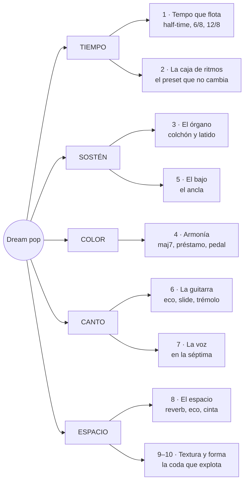

# Dream pop con Strudel, desde cero

> [!abstract] Qué es esta guía
> Cómo se arma una canción de dream pop al estilo de Beach House, capa por capa: la
> caja de ritmos que no cambia, el órgano que late, los acordes de luz difusa, el
> bajo que ancla, la guitarra que no suena a guitarra, la voz que se queda en la
> séptima, el espacio, la textura y la forma que guarda el clímax para el final.
> Cada idea trae **pentagrama** cuando hay notas, **rejilla** cuando hay golpes y un
> **bloque de Strudel** para oírla, y termina en **la decisión que te deja tomar en
> una pieza tuya**.
>
> Da por sabido [[4. Instrumento/2. Strudel/3. Beats/1. Beats desde cero|Beats desde cero]]
> y usa algunas piezas de [[4. Instrumento/2. Strudel/7. House/0. House desde cero|House desde cero]]
> (orbits, señales, `.transpose()`). No las vuelve a explicar.
>
> Es material de apoyo generado por IA. La síntesis, o sea qué es el dream pop *para
> ti* y qué te llevas a tus piezas, va en tus notas de concepto, y esas las escribes tú.

> [!tip] Cómo usarla
> - Dale play a cada bloque. Luego **cambia una sola cosa** y vuelve a escuchar.
> - **Los pentagramas son lo que suena**: cada bloque `music-abc` tiene las mismas
>   notas que el bloque de Strudel que lo acompaña.
> - Los bloques suenan **en Obsidian**. Los `gm_*` y los samples de órgano y piano
>   tardan en cargar la primera vez: si el primer compás sale mudo, dale play otra vez.
>   El motor local no carga samples; para Sonar ver §13.
> - Casi todo está en **re mayor**: es cómodo en la guitarra y en el teclado, y sus
>   séptimas mayores (do♯ sobre re, fa♯ sobre sol) se ven bien en el pentagrama.
> - Cada sección tiene su sesión práctica en `_lessons/` (§16).
> - El dream pop vive en la reverb. Con los parlantes del portátil se pierde la mitad:
>   usa audífonos.

---

## 0. El mapa

Una canción de dream pop contesta cinco preguntas: **a qué velocidad flota**, **qué
la sostiene**, **qué color tiene**, **qué canta** y **dónde suena**. La guía sigue
ese orden.



### 0.1 De dónde viene

El nombre se le atribuye a A.R. Kane, un dúo londinense de finales de los 80, y
describe una idea más que un sonido: **pop con la nitidez borrada**. Las canciones
tienen estrofas y estribillos, pero la voz se mezcla dentro de la música en lugar de
encima, los acordes no resuelven del todo y todo suena un poco lejos.

| Época | Qué pasó | Para escuchar |
|---|---|---|
| 80s | guitarras con chorus y eco, cajas de ritmos, la voz como textura | Cocteau Twins |
| 1988–91 | lento, mínimo, guitarras con eco | Galaxie 500 |
| 1989–90 | la televisión se vuelve sueño: sintes lentos y voz susurrada | Julee Cruise y Angelo Badalamenti (*Twin Peaks*) |
| 1990s | el shoegaze: un muro de guitarras; y el slide lentísimo | Slowdive · Mazzy Star |
| 2006 | Beach House graba su primer disco en dos días, en un sótano, en una grabadora de 4 pistas | Beach House, *Beach House* |
| 2010–15 | el sonido se agranda y luego vuelve a la caja de ritmos | Beach House, *Teen Dream*, *Bloom*, *Depression Cherry* |
| 2010s–hoy | minimalismo, guitarra limpia, voz susurrada | Cigarettes After Sex |

### 0.2 Beach House en cinco decisiones

Beach House es un dúo de Baltimore: Victoria Legrand (voz y teclados) y Alex Scally
(guitarra y teclados). Su sonido se puede resumir en cinco decisiones, y cada una es
una sección de esta guía:

| Decisión | Qué hacen | Sección |
|---|---|---|
| teclados baratos | órganos viejos y teclados de juguete; según ellos, todo su equipo junto no valía un Rhodes | §3 |
| ritmos simples | un patrón programado que casi no cambia; en sus primeros discos y en *Depression Cherry*, caja de ritmos | §2 |
| la guitarra disfrazada | slide, eco y chorus; Scally dice que busca que la guitarra no suene a guitarra | §6 |
| la voz grave | una contralto con mucha reverb, dentro de la mezcla | §7 |
| el clímax al final | la canción crece y guarda lo más grande para la coda | §10 |

> [!tip] Qué decide en tu pieza
> El dream pop no es un ritmo ni una progresión: es **una distancia**. La pregunta de
> cada capa es qué tan lejos suena. Si todo está cerca, es pop; si todo está lejos,
> es ambient. El dream pop elige qué se queda cerca (casi siempre la voz y el kick) y
> manda todo lo demás al fondo.

### 0.3 Seis cosas que te ahorran horas

> [!warning] 1 · `.bank()` solo en la batería
> Igual que en House: el banco se antepone a todo lo que toca. Pon la batería en su
> propio `stack` con su `.bank()`, y los sintes fuera.

> [!warning] 2 · Para transponer notas con nombre, `.transpose()`
> `note("d3").add(12)` **no mueve nada**. Usa `.transpose(12)`. Para desafinar un
> poquito (el chorus de §6.4) sí sirve `.add(note(.07))`.

> [!warning] 3 · Acordes: `D^7`, no `Dmaj7`; y sin barra
> `Dmaj7` da **silencio sin error**. `G/D` es peor: **rompe el bloque entero**. Los
> acordes con bajo se escriben en dos capas, el acorde y el bajo aparte (§4.4). Los
> que sí suenan, comprobados: `D` `D6` `Dadd9` `D^7` `D7` `Dsus` · `G^7` `G^9` `G69`
> `Gadd9` `Gm` `Gm6` · `Bm` `Bm7` `Bm9` · `Em7` `Em9` · `A6` `A7sus` `Asus` · `Bb^7` `C` `F#` `F#m7`.

> [!warning] 4 · Strudel escribe en bemoles
> Cuando un voicing de `D^7` sale como `D3 A3 Db4 Gb4 A4`, es re–la–**do♯**–**fa♯**–la.
> El pentagrama de esta guía lo escribe en sostenidos, como se escribe en re mayor.

> [!warning] 5 · La sala es del orbit
> El tamaño de la reverb (`roomsize`), su cola (`roomfade`) y su brillo (`roomlp`,
> `roomdim`) se calculan **una vez por orbit**: las capas que comparten orbit comparten
> sala. Para dos espacios distintos, dos orbits (§8). Y no los cambies en cada nota:
> cada cambio recalcula la reverb.

> [!warning] 6 · Vibrato y slide, en sintes y samples
> `.vib()` y `.penv()` funcionan en los sintes (`triangle`, `square`, `sawtooth`,
> `pulse`) y en los samples (`organ_full`, `piano1`, `vibraphone`…). En los `gm_*` no
> está garantizado: para algo que tiene que temblar, usa un sinte o un sample.

---

## 1. El tempo que flota

### 1.1 Tempo medido y tempo sentido

Una canción de dream pop casi nunca *corre*. Pero ojo: las bases de datos dicen que
*Space Song* va a **147 BPM**, y nadie la siente así. La caja suena una vez por
compás y los acordes duran compases enteros: el cuerpo siente la mitad, **unos 74**.
Es la sensación half-time de [[4. Instrumento/2. Strudel/3. Beats/1. Beats desde cero|Beats §4]],
llevada al extremo.

| Lo que mide el BPM | Lo que siente el cuerpo | Cómo se logra |
|---|---|---|
| 130–150 | 65–75 | caja en el 3, acordes de compás entero |
| 70–90 | 70–90 | caja en 2 y 4 suave, hats en corcheas |
| 50–70 (negra con punto) | balanceo | 6/8 o 12/8: el vaivén de cuna |

En esta guía se escribe el **tempo sentido**: `setcpm(74/4)` es un compás por ciclo a
74 negras. Es lo que vas a contar y lo que vas a tocar.

### 1.2 6/8 y 12/8: el balanceo

Muchas canciones tristes no van en cuatro sino en **dos o cuatro pulsos de tres**. El
pulso se siente como un columpio: fuerte-débil-débil. Las fórmulas de tempo ya están
en Beats §1.1; aquí las tres que vas a usar:

| Métrica | Un ciclo es | Tempo | Rejilla por compás |
|---|---|---|---|
| 4/4 | 4 negras | `setcpm(BPM/4)` | 16 semicorcheas |
| 12/8 | 4 negras con punto | `setcpm(BPM/4)` con el BPM de la negra con punto | 12 corcheas |
| 6/8 | 2 negras con punto | `setcpm(BPM/2)` | 6 corcheas |
| 3/4 | 3 negras | `setcpm(BPM/3)` | 6 corcheas |

El mismo acorde, en cuatro y en doce:

```strudel
setcpm(66/4)
stack(
  s("bd ~ sd ~").bank("KorgMinipops"),
  chord("<D^7>").voicing()
    .struct("<[x x x x x x x x] [x x x x x x x x x x x x]>")   // compás 1: 8 corcheas · compás 2: 12
    .s("organ_full").gain(.5),
)
```

Lo que cambia no es la velocidad del pulso (el kick y la caja caen igual): es
**cuántas notas caben dentro de cada pulso**. Dos por pulso camina; tres por pulso se mece.

> [!tip] Qué decide en tu pieza
> Antes que el BPM, decide **en cuántos se agrupa el pulso**: de a dos (caminar) o de
> a tres (mecerse). Tu Nocturno ya está en 12/8: es dream pop esperando la caja de
> ritmos de §2.

---

## 2. La caja de ritmos que no cambia

### 2.1 El preset

Los órganos domésticos de los 60 y 70 traían una caja de ritmos con botones: *Slow
Rock*, *Waltz*, *Bossa Nova*, *Rock*. Apretabas uno y sonaba igual toda la canción.
Esa caja barata, que nadie usaba en serio, es uno de los sonidos del dream pop. El
primer disco de Beach House usa ritmos programados así de simples, y *Depression
Cherry* vuelve a la caja de ritmos después de dos discos con batería real.

La idea musical es esta: **si el ritmo no cambia, todo el movimiento lo hacen la
armonía y la textura**. El preset es un reloj, no un baterista.

### 2.2 Cuatro presets

**Slow rock en 12/8.** El preset de balada: kick en 1 y 3, caja en 2 y 4, y los
platos en las doce corcheas.

```music-abc
X:1
T:Slow rock: el preset de balada, en 12/8
M:12/8
L:1/8
Q:3/8=66
K:C clef=perc
V:1 clef=perc stem=up name="Platos"
V:2 clef=perc stem=down name="Bombo y caja"
[V:1] !style=x!g!style=x!g!style=x!g !style=x!g!style=x!g!style=x!g !style=x!g!style=x!g!style=x!g !style=x!g!style=x!g!style=x!g |
[V:2] F3 c3 F3 c3 |
```

```strudel
setcpm(66/4)                                    // 12/8 a 66 negras con punto
stack(
  s("bd ~ bd ~"),                               // los pulsos 1 y 3
  s("~ sd ~ sd"),                               // los pulsos 2 y 4
  s("hh*12").velocity("[.6 .3 .4]*4"),          // las doce corcheas, de tres en tres
).bank("KorgMinipops")
```

**Vals en 3/4.** Kick en el 1; caja suave en el 2 y el 3.

```text
        1 . 2 . 3 .
hh      x x x x x x
caja    . . x . x .
kick    x . . . . .
```

```strudel
setcpm(84/3)                                    // 3/4 a 84 negras
stack(
  s("bd ~ ~"),
  s("~ sd sd").velocity(.5),
  s("hh*6").velocity("[.5 .25]*3"),
).bank("RolandCompurhythm78")
```

**Bossa nova.** El preset más elegante del órgano: kick de surdo y aro en la clave.

```text
        1 e & a 2 e & a 3 e & a 4 e & a
aro     x . . x . . x . . . x . . x . .     clave de bossa
hh      x . x . x . x . x . x . x . x .
kick    x . . . . . x . x . . . . . x .     negra con punto + corchea, dos veces
```

```strudel
setcpm(76/4)
stack(
  s("bd").beat("0,6,8,14", 16),
  s("rim").beat("0,3,6,10,13", 16).velocity(.6),
  s("hh*8").velocity("[.5 .25]*4"),
).bank("KorgKR55")
```

**Rock lento, half-time.** El de *Space Song* y de mucho dream pop: kick en el 1,
caja solo en el 3, hats en corcheas. Ver Beats §4.

```strudel
setcpm(74/4)
stack(
  s("[bd ~ ~ ~] ~ [bd ~ ~ bd] ~"),
  s("~ ~ sd ~").velocity(.7),
  s("hh*8").velocity("[.4 .15]*4"),
).bank("RhythmAce")
```

### 2.3 Las cajas viejas

Strudel trae muchas cajas de ritmos antiguas. Estas son las que suenan a órgano de
casa, a radio vieja o a juguete:

| Banco | Qué es | Trae | Carácter |
|---|---|---|---|
| `KorgMinipops` | la caja de los órganos Korg de los 70 | `bd` `sd` `hh` `oh` | frágil, lejana: **el** sonido |
| `RolandCompurhythm78` | la CR-78 | `bd` `sd` `hh` `oh` `cb` `tb` `perc` | cálida, de juguete caro |
| `RhythmAce` | de los 60 | `bd` `sd` `hh` `oh` `lt` `ht` `perc` | antigua, con toms |
| `KorgKR55` | de los 70 | `bd` `sd` `hh` `oh` `rim` `cb` `ht` `cr` | con aro: buena para bossa |
| `RolandCompurhythm1000` | otra Compurhythm | kit completo | más seca |
| `UnivoxMicroRhythmer12` | caja mínima | `bd` `sd` `hh` `oh` | casi un metrónomo |
| `CasioVL1` · `CasioSK1` | teclados de juguete | `bd` `sd` `hh` (y toms en el SK-1) | humor, lo-fi extremo |
| `LinnDrum` | los 80 | kit completo | Cocteau Twins, synth-pop |

El mismo preset (rock lento) pasando por cinco cajas, dos compases cada una:

```strudel
setcpm(74/4)
const preset = stack(
  s("[bd ~ ~ ~] ~ [bd ~ ~ bd] ~"),
  s("~ ~ sd ~").velocity(.7),
  s("hh*8").velocity("[.4 .15]*4"),
)

arrange(
  [2, preset.bank("KorgMinipops")],
  [2, preset.bank("RolandCompurhythm78")],
  [2, preset.bank("RhythmAce")],
  [2, preset.bank("UnivoxMicroRhythmer12")],
  [2, preset.bank("CasioVL1")],
)
```

### 2.4 Batería de verdad: mazas y platos que crecen

Cuando el dream pop usa batería real (como Beach House en *Teen Dream* y *Bloom*),
casi nunca la usa para golpear: **toms con mazas**, platos que crecen y una caja muy
lejos. En la biblioteca acústica (sin banco) hay de eso:

| Sonido | En Strudel | Para qué |
|---|---|---|
| tom con maza | `tom_mallet` · `tom2_mallet` | un latido grave y redondo |
| bombo de concierto | `bassdrum1` · `bassdrum2` | un golpe lejano |
| plato suspendido | `sus_cymbal` | olas de metal |
| plato al revés | `gm_reverse_cymbal` | crece hacia el compás siguiente |
| pandereta, shaker | `tambourine` · `shaker_small` | brillo, aire |

```strudel
setcpm(70/4)
stack(
  s("tom_mallet ~ [~ tom_mallet] ~").velocity(.7).room(.5),   // latido de mazas
  s("~ ~ snare_modern ~").velocity(.4).room(.8).roomsize(8),   // caja muy lejos
  s("tambourine*8").velocity("[.3 .12]*4").pan(.7),
  s("<~ ~ ~ gm_reverse_cymbal>").gain(.6),                     // compás 4: crece hacia el 1
)
```

> [!tip] Qué decide en tu pieza
> Elige **un preset y no lo cambies** durante toda la estrofa. Si sientes que la
> sección necesita otra batería, prueba primero a cambiar los acordes o a sumar una
> capa: es casi siempre lo que el dream pop haría.

---

## 3. El órgano: colchón y latido

El órgano es el instrumento central de Beach House. Hace dos trabajos, a veces a la
vez: **colchón** (el acorde sostenido que llena el fondo) y **latido** (el acorde
repetido que marca el pulso en lugar de la batería).

### 3.1 El colchón

Un acorde de compás entero, con entrada y salida suaves. Le falta algo para ser
dream pop: **que tiemble**. Un órgano viejo nunca está quieto: el altavoz giratorio
(Leslie) o el vibrato del circuito mueven la altura y el volumen.

```strudel
setcpm(70/4)
const organo = chord("<D^7 G^7>").voicing()
  .s("organ_full").attack(.15).release(.8).gain(.6)

arrange(
  [2, organo],                                   // quieto
  [2, organo.vib(5).vibmod(.08)],                // vibrato: la altura tiembla
  [2, organo.vib(5).vibmod(.08)
            .tremolo(6).tremolodepth(.3)],        // más trémolo: el volumen tiembla también
)
```

| Función | Qué hace | Para un órgano viejo |
|---|---|---|
| `.vib(hz)` | velocidad del vibrato | `4`–`6` |
| `.vibmod(semitonos)` | cuánto sube y baja | `.05`–`.15`; con `.5` (el de serie) marea |
| `.tremolo(hz)` | velocidad del trémolo de volumen | `5`–`7` |
| `.tremolodepth(0–1)` | cuánto baja el volumen | `.2`–`.4` |
| `.tremolosync(n)` | trémolo atado al compás: `n` pulsos por compás | `8` = corcheas |

### 3.2 El latido

El mismo acorde, repetido en corcheas, con los tiempos un poco más fuertes. Sustituye
a la batería o va encima de ella. Es el motor de mucho Beach House, y de tu *Dawn Chorus*.

```music-abc
X:2
T:El latido: el acorde repetido en corcheas
M:4/4
L:1/8
Q:1/4=70
K:D
V:1 clef=treble name="Derecha"
V:2 clef=bass name="Izquierda"
[V:1] "Dmaj7"[CFA][CFA][CFA][CFA] [CFA][CFA][CFA][CFA] | "Gmaj7"[FB][FB][FB][FB] [FB][FB][FB][FB] |
[V:2] [D,A,][D,A,][D,A,][D,A,] [D,A,][D,A,][D,A,][D,A,] | [D,G,B,][D,G,B,][D,G,B,][D,G,B,] [D,G,B,][D,G,B,][D,G,B,][D,G,B,] |
```

```strudel
setcpm(70/4)
stack(
  s("bd ~ ~ ~, ~ ~ sd ~").bank("KorgMinipops"),
  chord("<D^7 G^7>").voicing()
    .struct("x*8")                                 // ocho corcheas por compás
    .velocity("[.7 .4]*4")                         // el tiempo más fuerte que el "&"
    .s("organ_8inch").decay(.25).sustain(.3)
    .vib(5).vibmod(.06),
)
```

Fíjate en el `G^7`: Strudel lo arma con **re en el bajo** (re–sol–si–fa♯–si). La
nota re se queda de un acorde al otro, y eso es parte de la suavidad.

### 3.3 Teclados baratos

Cada teclado viejo tiene un sonido que lo hace único. Estos son los de Strudel que
más se acercan a esa paleta:

| Sonido | En Strudel | Carácter |
|---|---|---|
| órgano de iglesia pequeño | `organ_full` · `organ_8inch` · `organ_4inch` | cálido, aireado, con vibrato posible |
| órgano de tubos suave | `pipeorgan_quiet` | catedral lejana |
| órgano eléctrico | `gm_drawbar_organ` · `gm_reed_organ` | más brillante; el de lengüeta suena a armonio |
| órgano "combo" de los 60 | `square` + `.lpf(1500)` + `.vib()` | delgado, nasal, tipo Farfisa |
| cuerdas de sinte | `gm_synth_strings_1` · `gm_synth_strings_2` | las cuerdas de máquina de los 70 |
| arpegio fino | `pulse` con `.pw(.2)` | la línea delgada y brillante |
| piano viejo | `piano1` · `kawai` · `fmpiano` | gastado, cercano |
| piano eléctrico | `gm_epiano1` | suave |
| campanitas | `vibraphone` · `glockenspiel` · `gm_celesta` · `gm_music_box` | la luz de arriba |

```strudel
setcpm(70/4)
const acordes = chord("<D^7 G^7>").voicing().attack(.1).release(1)

arrange(
  [2, acordes.s("organ_full").vib(5).vibmod(.08)],
  [2, acordes.s("pipeorgan_quiet")],
  [2, acordes.s("gm_reed_organ")],
  [2, acordes.s("square").lpf(1500).vib(6).vibmod(.1).gain(.3)],
  [2, acordes.s("gm_synth_strings_2")],
  [2, acordes.s("piano1")],
)
```

> [!tip] Qué decide en tu pieza
> Dos decisiones: **qué teclado** (la época) y **qué trabajo hace** (colchón o latido).
> Si eliges latido, puedes quitar la batería del todo: el órgano ya marca el pulso.

---

## 4. Armonía: luz difusa

La armonía del dream pop **no empuja**. Evita el acorde de dominante con séptima,
que exige resolver, y prefiere acordes que se pueden quedar quietos para siempre:
séptimas mayores, novenas añadidas, sextas, suspensiones. Y le pone sombra a lo
mayor con acordes prestados del menor.

Las bases: [[1. Teoría/1. Armonía/8. Tensiones]] y [[1. Teoría/1. Armonía/3. Intercambios modales]].

### 4.1 Una nota de color

Mismo acorde, una sola nota cambia. El pentagrama es el voicing que elige Strudel:

```music-abc
X:3
T:Re mayor, cuatro colores: solo cambia una nota
M:4/4
L:1/1
Q:1/4=70
K:D
V:1 clef=treble name="Derecha"
V:2 clef=bass name="Izquierda"
[V:1] "D"[DFA] | "D6"[DFB] | "Dadd9"[EFA] | "Dmaj7"[CFA] |
[V:2] [D,A,] | [D,A,] | [D,A,] | [D,A,] |
```

```strudel
setcpm(66/4)
chord("<D D6 Dadd9 D^7>")
  .voicing().s("organ_full").vib(5).vibmod(.06).room(.6)
```

| Acorde | En Strudel | La nota de color | Cómo suena |
|---|---|---|---|
| mayor | `D` | — | claro, firme |
| sexta | `D6` | si (6.ª) | nostalgia de los 50, *doo-wop* |
| novena añadida | `Dadd9` | mi (9.ª) | abierto, aire |
| séptima mayor | `D^7` | do♯ (7.ª mayor) | **el** acorde del dream pop: luz con un roce |
| 6/9 | `G69` | mi y la | brillo suave |
| sus | `Dsus` | sol en lugar de fa♯ | ni mayor ni menor: suspendido |
| 7sus | `A7sus` | re y sol sobre la | la dominante que no exige |

### 4.2 La sombra: el iv menor

El préstamo más útil del dream pop: en re mayor, el IV (sol mayor) se vuelve **iv
menor** (sol menor). Una sola nota baja medio tono, si → si♭, y lo mayor se nubla.

```music-abc
X:4
T:La sombra: IV mayor, iv menor
M:4/4
L:1/1
Q:1/4=66
K:D
V:1 clef=treble name="Derecha"
V:2 clef=bass name="Izquierda"
[V:1] "D"[DFA] | "G"[DGB] | "Gm"[DG_B] | "D"[DFA] |
[V:2] [D,A,] | G, | [G,_B,] | [D,A,] |
```

```strudel
setcpm(66/4)
stack(
  s("bd ~ ~ ~, ~ ~ sd ~").bank("KorgMinipops"),
  chord("<D G Gm D>").voicing().s("organ_full").vib(5).vibmod(.06).gain(.6),
)
```

Escucha el compás 3: es el momento en que la canción "recuerda algo". Otros
préstamos del mismo modo menor: **♭VI^7** (`Bb^7`, luminoso y extraño) y **♭VII** (`C`,
el de la psicodelia y el rock).

### 4.3 La línea que baja por dentro

Un acorde que no cambia, y una voz interior que baja por semitonos: re → do♯ → do♮ → si.
Es un recurso viejísimo (se le llama *line cliché*), y en dream pop hace que un solo
acorde parezca una historia.

```music-abc
X:5
T:Una voz interior que baja: D, Dmaj7, D7, D6
M:4/4
L:1/1
Q:1/4=66
K:D
V:1 clef=treble name="Derecha"
V:2 clef=bass name="Izquierda"
[V:1] "D"[DF] | "Dmaj7"[CF] | "D7"[=CF] | "D6"[B,F] |
[V:2] [D,A,] | [D,A,] | [D,A,] | [D,A,] |
```

Aquí **no** sirve `chord().voicing()`: Strudel elegiría voicings distintos y la línea
se perdería. Se escriben las notas a mano, una forma por compás:

```strudel
setcpm(66/4)
note("<[d3,a3,d4,f#4] [d3,a3,c#4,f#4] [d3,a3,c4,f#4] [d3,a3,b3,f#4]>")
  .s("organ_full").vib(5).vibmod(.06).attack(.1).release(.8)
  .room(.6)
```

La versión menor (la, la con séptima mayor, la con séptima, la con sexta) es la de
mil bandas sonoras de espías. La conducción por grado conjunto es la de tus corales:
[[1. Teoría/2. Conducción/11. Guía de enlaces]].

### 4.4 El pedal y el bajo que baja

**Pedal:** el bajo se queda en re mientras los acordes cambian encima. Los acordes
"flotan" porque el suelo no se mueve. Es el drone de [[4. Instrumento/2. Strudel/4. Folk desde cero|Folk §2.4]].

**Bajo que baja:** el contrario. Los acordes casi no cambian de color, pero el bajo
desciende nota a nota y cada acorde queda en otra inversión. Strudel no acepta
acordes con barra (`A/C#`), así que se escriben **dos capas**: los acordes y el bajo.

```music-abc
X:6
T:El bajo que baja, de re a la
M:4/4
L:1/1
Q:1/4=70
K:D
V:1 clef=bass name="Bajo"
[V:1] "D"D, | "A/C#"C, | "Bm"B,, | "D/A"A,, | "G"G,, | "D/F#"F,, | "Em7"E,, | "A7sus"A,, |
```

```strudel
setcpm(70/4)
stack(
  chord("<D A Bm D G D Em7 A7sus>").voicing()             // los acordes, sin barra
    .s("organ_full").vib(5).vibmod(.06).gain(.5),
  note("<d3 c#3 b2 a2 g2 f#2 e2 a2>")                      // el bajo, aparte: baja por grados
    .s("sawtooth").lpf(400).attack(.05).release(.5),
)
```

```strudel
setcpm(66/4)
stack(
  chord("<D^7 Em7 G^7 D^7>").voicing()                     // los acordes cambian…
    .s("organ_full").vib(5).vibmod(.06).gain(.5),
  note("d2").s("sawtooth").lpf(300).gain(.8),              // …el bajo no: pedal de re
)
```

### 4.5 Progresiones de dream pop

Todas en re mayor.

| Nombre | Grados | En Strudel | Carácter |
|---|---|---|---|
| flotar | I^7 – IV^7 | `"<D^7 G^7>"` | dos luces, ninguna manda |
| pop triste | I^7 – vi7 – IV^7 – Vsus | `"<D^7 Bm7 G^7 A7sus>"` | la dominante que no llega |
| sombra | I – IV – iv – I | `"<D G Gm D>"` | lo mayor que recuerda algo |
| mediante | I^7 – ♭VI^7 | `"<D^7 Bb^7>"` | extraño, cinematográfico |
| mixolidio | I – ♭VII – IV – I | `"<D C G D>"` | psicodelia suave |
| espejo | vi9 – IV^7 | `"<Bm9 G^7>"` | el relativo menor, sin decidir |

```strudel
setcpm(70/4)
const prog = {
  flotar:    "<D^7 G^7>",
  triste:    "<D^7 Bm7 G^7 A7sus>",
  sombra:    "<D G Gm D>",
  mediante:  "<D^7 Bb^7>",
  mixolidio: "<D C G D>",
  espejo:    "<Bm9 G^7>",
}

stack(
  s("[bd ~ ~ ~] ~ [bd ~ ~ bd] ~, ~ ~ sd ~").bank("KorgMinipops"),
  chord(prog.triste)                       // ← cambia solo esta palabra
    .voicing().s("organ_full").vib(5).vibmod(.06).gain(.6),
)
```

Más progresiones tristes: [[1. Teoría/1. Armonía/Progresiones/0. Progresiones melancólicas]].
Cómo se arma un préstamo: [[1. Teoría/1. Armonía/4. Armonización de intercambios modales]].

### 4.6 Ritmo armónico: lento

El dream pop deja que cada acorde **suene hasta gastarse**. Dos compases por acorde es
lo normal; cuatro no es raro. Con `!` (ver House §6.4): `"<D^7!2 G^7!2>"`.

> [!tip] Qué decide en tu pieza
> Tres decisiones: **un color** (la nota que define tu sonido: ¿séptima mayor, sexta,
> novena?), **una sombra** (¿hay préstamo, y en qué compás?) y **un suelo** (¿el bajo
> se queda, baja o sigue la raíz?). La tercera es la que más se olvida y la que más cambia.

---

## 5. El bajo: el ancla

En dream pop el bajo no camina ni hace grooves: **sostiene**. Una nota larga por
acorde, casi siempre la raíz. En muchas canciones de Beach House ni siquiera es un
bajo eléctrico sino un sinte filtrado (así lo recrea el análisis de Reverb Machine
de *Space Song* y *Lazuli*).

El pentagrama del bajo está escrito **una octava arriba de lo que suena**, como se
escribe el bajo eléctrico: así no se llena de líneas adicionales.

```music-abc
X:7
T:Cuatro bajos para la misma progresión
M:4/4
L:1/4
Q:1/4=70
K:D
V:1 clef=bass name="Bajo"
[V:1] "Dmaj7"D,4 | "Bm7"B,,4 | "Gmaj7"G,,4 | "A7sus"A,,4 | "Dmaj7"D,4 | "Bm7"B,,3 A,, | "Gmaj7"G,,4 | "A7sus"A,,3 C, |
```

Los primeros cuatro compases son **raíz larga**; los cuatro siguientes, **con paso**: la
última negra del compás camina hacia la raíz siguiente (la → sol, do♯ → re).

| Tipo | Qué hace | En Strudel | Cuándo |
|---|---|---|---|
| raíz larga | una redonda por acorde | `note("<d2 b1 g1 a1>")` | casi siempre |
| con paso | la última negra camina | `note("<d2 [b1@3 a1] g1 [a1@3 c#2]>")` | para anunciar el cambio |
| pedal | una nota bajo todo | `note("d2")` | intros, estrofas que flotan (§4.4) |
| latido | la raíz en corcheas | `.struct("x*8")` | cuando no hay batería |

```strudel
setcpm(70/4)
const PROG = "<D^7 Bm7 G^7 A7sus>"
const bajo = x => x.s("sawtooth").lpf(350).attack(.03).release(.4).gain(.8)

stack(
  chord(PROG).voicing().s("organ_full").vib(5).vibmod(.06).gain(.45),
  arrange(
    [4, bajo(note("<d2 b1 g1 a1>"))],                             // raíz larga
    [4, bajo(note("<d2 [b1@3 a1] g1 [a1@3 c#2]>"))],              // con paso
    [4, bajo(note("d2"))],                                         // pedal: ojo con el compás 4
    [4, bajo(note("<d2 b1 g1 a1>").struct("x*8")).decay(.2).sustain(.4)],   // latido
  ),
)
```

En el pedal escucha el compás 4: re debajo de `A7sus` roza, y ese roce es justo lo
que hace que el pedal suene a pedal.

| Sonido | En Strudel | Carácter |
|---|---|---|
| sierra filtrada | `sawtooth` + `.lpf(250–450)` | redondo, de Minimoog |
| pulso estrecho | `pulse` + `.pw(.2)` + `.lpf()` | más hueco, más "de máquina" |
| triángulo | `triangle` | suave, casi una voz |
| seno | `sine` | sub: se siente más que se oye |
| bajo sin trastes | `gm_fretless_bass` | cálido, deslizado |

> [!tip] Qué decide en tu pieza
> El bajo decide **cuánto pesa** la canción. Raíz larga: estable. Pedal: suspendida.
> Con paso: con dirección. Elige uno por sección y cambia de tipo cuando cambies de
> sección: es un cambio de forma que casi no cuesta.

---

## 6. La guitarra que no suena a guitarra

Alex Scally ha dicho que busca que su guitarra **no suene a guitarra**. Las
herramientas para eso son cuatro: **eco**, **slide**, **trémolo** y **chorus**. Con
ellas una guitarra se vuelve órgano, voz o cuerda.

### 6.1 El arpegio con eco

Un arpegio lento con un eco de corchea con punto: cada nota se repite a contratiempo
y las repeticiones rellenan los huecos. Una línea de ocho notas suena a dieciséis.

```music-abc
X:8
T:Arpegio de guitarra: las notas del voicing, sin la raíz
M:4/4
L:1/8
Q:1/4=70
K:D
"Dmaj7"A,CFA FCA,C | "Gmaj7"G,B,FB FB,G,B, |
```

```strudel
setcpm(70/4)
stack(
  note("<d2 g2>").s("sawtooth").lpf(300).gain(.8),
  chord("<D^7 G^7>").voicing()
    .arp("1 2 3 4 3 2 1 2")                        // índices del voicing; el 0 se lo deja al bajo
    .s("gm_electric_guitar_clean")
    .delay(.45).delaysync(3/16).delayfeedback(.45) // eco en corchea con punto
    .room(.5),
)
```

### 6.2 El slide

Con un slide la nota no empieza en su altura: **llega deslizándose** desde abajo, y
luego tiembla. Strudel no tiene slide de guitarra, pero tiene una **envolvente de
altura**: `.penv(2).pattack(.12)` hace que cada nota empiece dos semitonos abajo y suba
hasta su altura en 0,12 segundos. Con un sinte suave y vibrato, eso es un slide.

```music-abc
X:9
T:Línea de slide: llega desde abajo y se queda
M:4/4
L:1/4
Q:1/4=70
K:D
"Dmaj7"A2 F2 | "Gmaj7"B3 F |
```

```strudel
setcpm(70/4)
stack(
  chord("<D^7 G^7>").voicing().s("organ_full").vib(5).vibmod(.06).gain(.4),
  note("<[a4@2 f#4@2] [b4@3 f#4]>")
    .s("triangle").lpf(1800)
    .penv(2).pattack(.12)                          // cada nota llega desde dos semitonos abajo
    .vib(5).vibmod(.12)                            // y tiembla
    .attack(.05).release(.6)
    .delay(.3).delaysync(1/4).delayfeedback(.4)
    .room(.7),
)
```

| Control | Qué hace | Para un slide |
|---|---|---|
| `.penv(n)` | de cuántos semitonos abajo viene la nota | `1`–`3`; `12` es un efecto de sirena |
| `.pattack(s)` | cuánto tarda en llegar | `.08`–`.2` |
| `.vib(hz)` · `.vibmod(st)` | el temblor al llegar | `5` · `.1` |

### 6.3 El trémolo de amplificador

Un acorde sostenido cuyo volumen late en corcheas: es el trémolo de los
amplificadores viejos. Sustituye al latido del órgano cuando quieres pulso sin ataque.

```strudel
setcpm(70/4)
chord("<D^7 G^7>").voicing()
  .s("gm_electric_guitar_clean").gain(.8)
  .tremolosync(8).tremolodepth(.7)                 // ocho pulsos de volumen por compás
  .room(.6)
```

### 6.4 El chorus: dos guitarras un poco desafinadas

El chorus (y el *ensemble* de las cuerdas de máquina de los 70) es **la misma línea
dos veces, una un poco más grave y otra un poco más aguda**, a los dos lados. Se
escribe así:

```strudel
setcpm(70/4)
const linea = chord("<D^7 G^7>").voicing()
  .arp("1 2 3 4 3 2 1 2")
  .s("triangle").lpf(2000).decay(.4).sustain(0).gain(.6)

arrange(
  [2, linea],                                      // una sola: plana
  [2, stack(
    linea.add(note(-.07)).pan(.2),                 // 7 centésimas de semitono abajo, a la izquierda
    linea.add(note(.07)).pan(.8),                  // 7 arriba, a la derecha
  )],
)
```

Aquí sí sirve `.add(note(…))`: con un número suelto no pasaría nada (§0.3).

| Sonido de "guitarra" | En Strudel | Carácter |
|---|---|---|
| eléctrica limpia | `gm_electric_guitar_clean` | la base |
| jazz | `gm_electric_guitar_jazz` | más oscura, redonda |
| armónicos | `gm_guitar_harmonics` | campanas de vidrio |
| nylon, acero | `gm_acoustic_guitar_nylon` · `gm_acoustic_guitar_steel` | dream folk (Folk §8) |
| "slide" | `triangle` o `sawtooth` + `penv` + `vib` | la guitarra que no suena a guitarra |

> [!tip] Qué decide en tu pieza
> La guitarra en dream pop casi nunca rasguea: **arpegia** o **canta**. Decide cuál de
> las dos, y elige **un** efecto como su firma: eco, slide, trémolo o chorus. Los
> cuatro a la vez son barro.

---

## 7. La voz y la melodía

### 7.1 Quedarse en la séptima

La melodía de dream pop **no resuelve**. Sus notas largas caen en las notas de color
del acorde (la séptima mayor, la novena), no en la raíz. El oído espera que bajen a
casa, y no bajan: esa espera es la melancolía.

```music-abc
X:10
T:La melodía que se queda en la séptima mayor
M:4/4
L:1/4
Q:1/4=66
K:D
"Dmaj7"A2 F2 | E C3 | "Gmaj7"B2 A2 | F4 |
```

| Compás | Nota larga | Sobre | Es la… |
|---:|---|---|---|
| 1 | la, fa♯ | `D^7` | 5.ª y 3.ª: el acorde, firme |
| 2 | **do♯** | `D^7` | **7.ª mayor**: el roce |
| 3 | si, la | `G^7` | 3.ª y 9.ª |
| 4 | **fa♯** | `G^7` | **7.ª mayor**: el roce, otra vez |

```strudel
setcpm(66/4)
stack(
  chord("<D^7!2 G^7!2>").voicing()
    .s("organ_full").vib(5).vibmod(.06).gain(.4),
  note("<d2!2 g2!2>").s("sawtooth").lpf(300).gain(.7),
  note("<[a4 f#4] [e4 c#4@3] [b4 a4] f#4>")
    .s("gm_voice_oohs").gain(.9)
    .room(.6),
)
```

La melodía y la armonía se tocan en la séptima mayor: do♯ de la voz contra re del
bajo, fa♯ contra sol. Es la misma idea de [[1. Teoría/1. Armonía/8. Tensiones]], pero
cantada. Más sobre construir la línea: [[1. Teoría/4. Melodía/1. Composición melódica]].

### 7.2 Grave y estrecha

La voz de Victoria Legrand es una **contralto**: grave, con cuerpo. Las melodías de
dream pop se mueven poco, casi siempre por grado conjunto y dentro de una sexta. No es
falta de ideas: una melodía que no salta deja que la escuches como un instrumento más.

| Decisión | Pop | Dream pop |
|---|---|---|
| ámbito | una octava o más | una sexta, a veces una quinta |
| movimiento | saltos para el gancho | grado conjunto, notas largas |
| final de frase | la tónica | la 7.ª, la 9.ª, la 3.ª |
| lugar en la mezcla | delante, seca | dentro, con reverb |

### 7.3 Doblada, y un poco tarde

Dos recursos de producción: **doblar la voz una octava abajo**, bajito, para darle
cuerpo, y **cantar un pelo detrás del tiempo** (`.late()`, Beats §6.2), que hace que
suene cansada, sin prisa.

```strudel
setcpm(66/4)
const voz = note("<[a4 f#4] [e4 c#4@3] [b4 a4] f#4>").s("gm_voice_oohs")

stack(
  chord("<D^7!2 G^7!2>").voicing().s("organ_full").vib(5).vibmod(.06).gain(.4),
  voz.late("<0 .02>").room(.6),                     // compás 1 a tiempo · compás 2 detrás
  voz.transpose(-12).gain(.4).room(.6)              // la misma, una octava abajo y bajita
    .mask("<0 0 1 1>"),                             // entra en el compás 3
)
```

### 7.4 La voz sin palabras

En dream pop el gancho muchas veces **no tiene letra**: es una melodía de "oh" o un
instrumento que canta. Los coros de Strudel sirven para probar, pero la voz de verdad
es la tuya: grábala en Sonar y súbele la reverb hasta que deje de ser *tu* voz y sea
*una* voz.

| Sonido | En Strudel |
|---|---|
| "oh" | `gm_voice_oohs` |
| coro | `gm_choir_aahs` · `gm_synth_choir` · `gm_pad_choir` |
| voz de sinte | `gm_lead_6_voice` |

> [!tip] Qué decide en tu pieza
> Dónde termina cada frase. Escribe la melodía y marca la última nota larga de cada
> frase: si todas son la tónica, la canción suena cerrada. Mueve **una** a la séptima o
> a la novena y escucha cómo se abre.

---

## 8. El espacio

En el dream pop la reverb no es un efecto: **es el lugar donde ocurre la canción**.

### 8.1 Cuatro salas

| Control | Qué hace | Valores |
|---|---|---|
| `.room(0–1)` | cuánto sonido manda a la sala | `.3` habitación · `.9` catedral |
| `.roomsize(0–10)` | el tamaño de la sala | `2` pequeña · `10` enorme |
| `.roomfade(s)` | cuánto dura la cola, en segundos | `2`–`10` |
| `.roomlp(hz)` | el brillo de la cola al empezar | `2000`–`5000`: oscura |
| `.roomdim(hz)` | el brillo de la cola al apagarse | `300`–`800`: se apaga en grave |

```strudel
setcpm(66/4)
const organo = chord("<D^7 G^7>").voicing()
  .s("organ_full").vib(5).vibmod(.06).gain(.6)

arrange(
  [2, organo],                                               // seco
  [2, organo.room(.4).roomsize(2)],                          // habitación
  [2, organo.room(.7).roomsize(6)],                          // sala
  [2, organo.room(.9).roomsize(10).roomfade(8)
            .roomlp(3000).roomdim(400)],                     // catedral oscura: 8 s de cola
)
```

Una reverb **oscura** (`roomlp` y `roomdim` bajos) es la que no ensucia: la cola queda
en el fondo en lugar de pelear con la voz.

### 8.2 Dos salas, dos orbits

La sala es del orbit (§0.3). Si la voz necesita una habitación y el órgano una
catedral, van en orbits distintos:

```strudel
setcpm(66/4)
stack(
  chord("<D^7 G^7>").voicing().s("organ_full").vib(5).vibmod(.06).gain(.5)
    .room(.9).roomsize(10).roomfade(8).orbit(2),            // el órgano: catedral, orbit 2
  note("<[a4 f#4] [e4 c#4@3]>").s("gm_voice_oohs")
    .room(.35).roomsize(2),                                  // la voz: habitación, orbit 1
  s("~ ~ sd ~").bank("KorgMinipops").velocity(.6)
    .room(.8).roomsize(6).orbit(3),                          // la caja: sala, orbit 3
)
```

### 8.3 El eco

| Eco | `.delaysync()` | `.delayfeedback()` | Para qué |
|---|---|---|---|
| corchea con punto | `3/16` | `.4` | arpegios: rellena los huecos |
| negra | `1/4` | `.5` | slide y voz: una respuesta |
| blanca | `1/2` | `.6` | notas sueltas que flotan |
| casi infinito | cualquiera | `.8` | colas que se acumulan (cuidado) |

### 8.4 La cinta

Lo que suena a recuerdo suena a cinta vieja: un poco desafinado, con poco brillo y
algo de polvo.

| Herramienta | En Strudel | Qué imita |
|---|---|---|
| *wow* | `.vib(.5).vibmod(.08)` | la cinta que gira desigual: la altura ondula despacio |
| poco brillo | `.lpf(3500)` al conjunto | una cinta gastada |
| polvo | `.crush(11)` | pocos bits |
| grano | `.coarse(2)` | menos muestras por segundo |
| lento | `.speed(.97)` en samples de batería | la cinta un pelo más lenta |

```strudel
setcpm(66/4)
stack(
  s("[bd ~ ~ ~] ~ [bd ~ ~ bd] ~, ~ ~ sd ~, hh*8").bank("KorgMinipops")
    .speed(.97).velocity(.6),
  chord("<D^7 G^7>").voicing().s("piano1")
    .vib(.5).vibmod(.08),                                    // la cinta ondula
).lpf(3500).crush(11)                                        // y todo pasa por ella
```

### 8.5 Mezclar por distancia

| Distancia | Qué capas | Cómo |
|---|---|---|
| cerca | voz, kick | poca reverb, sin filtro |
| medio | bajo, órgano que late | reverb media |
| lejos | caja, cuerdas, slide | mucha reverb, algo de `lpf` |
| muy lejos | campanas, texturas | `room(.9)`, `lpf` bajo, poco volumen |

> [!tip] Qué decide en tu pieza
> Antes de subir la reverb de algo, pregúntate **dónde está**: cerca, medio, lejos o
> muy lejos. Y deja seco el kick: si el suelo también flota, la canción se cae.

---

## 9. Textura: el colchón, el motor, la línea y la luz

### 9.1 Cada capa, un trabajo

Una canción de dream pop tiene pocas capas, y cada una tiene un trabajo y un
registro. Si dos capas hacen el mismo trabajo en el mismo registro, sobra una.

```text
registro
 agudo    ✦  ✦     ✦   campanas, armónicos            LUZ      aparece y se va
          ~~~~~~~~~~~   voz, slide                     LÍNEA    lo que se canta
 medio    ▒▒▒▒▒▒▒▒▒▒▒   órgano, cuerdas                COLCHÓN  lo que sostiene
          ⋯⋯⋯⋯⋯⋯⋯⋯⋯⋯⋯   arpegio, latido                MOTOR    lo que se mueve
 grave    ━━━━━━━━━━━   bajo, kick                     SUELO    lo que no se mueve
```

### 9.2 La luz y el aire

La capa de arriba es la que más cambia el carácter y la que menos se oye: unas notas
sueltas de campana que aparecen al azar, y un ruido de fondo que viene de afuera.

| Capa | En Strudel | Cómo |
|---|---|---|
| campanas | `vibraphone` · `glockenspiel` · `gm_celesta` · `gm_music_box` · `gm_guitar_harmonics` | pocas notas, `.degradeBy(.5)` |
| vidrio | `wineglass` · `vibraphone_bowed` | notas larguísimas |
| aire de afuera | `wind` · `insect` · `crow` · `gm_seashore` · `oceandrum` | muy bajo, con filtro |
| atmósfera | `gm_fx_atmosphere` · `gm_pad_halo` · `gm_pad_sweep` | un acorde que casi no se oye |

Las seis capas juntas, cada una en su registro:

```strudel
setcpm(66/4)
const PROG = "<D^7 G^7>"

stack(
  s("[bd ~ ~ ~] ~ [bd ~ ~ bd] ~").bank("KorgMinipops"),                      // SUELO
  note("<d2 g2>").s("sawtooth").lpf(300).gain(.7),                           // SUELO
  chord(PROG).voicing().s("organ_full").vib(5).vibmod(.06)
    .gain(.4).room(.8).roomsize(8).orbit(2),                                 // COLCHÓN
  chord(PROG).voicing().arp("1 2 3 4 3 2 1 2")
    .s("gm_electric_guitar_clean").gain(.5)
    .delay(.4).delaysync(3/16).delayfeedback(.4).orbit(2),                   // MOTOR
  n("[~ 4] [~ 6] ~ [~ 5]").scale("D5:major").degradeBy(.4)
    .s("vibraphone").gain(.35).room(.9).orbit(2),                            // LUZ
  s("wind").lpf(1200).gain(.15).orbit(2),                                    // AIRE
)
```

La línea (voz o slide) falta a propósito: ese hueco en el registro medio-agudo es
donde va lo tuyo.

### 9.3 Una capa por sección

La textura es la forma: cada sección **suma o quita una capa**, como en la forma por
densidad de Beats §11.2 y de House §11. Sobre cómo repartir los materiales entre
instrumentos: [[5. Referencias/3. Cursos/Cresciente/3. Ampliando lenguaje/5C. Distribuyendo los materiales - introducción al arreglo|Cresciente 5C]].

> [!tip] Qué decide en tu pieza
> Haz la tabla de cinco filas (suelo, motor, colchón, línea, luz) y pon **un solo
> instrumento** en cada una. Si una fila tiene dos, quita uno. Si una está vacía, puede
> que esa sea justo la sensación que buscas.

---

## 10. Forma: la coda que explota

### 10.1 Una canción, estirada

El dream pop usa la forma de canción (estrofa, estribillo, puente), pero la estira y
le cambia el centro de gravedad: en muchas canciones de Beach House **lo más grande
no es el estribillo sino la coda**. La canción crece capa a capa y guarda el clímax
para el final, a veces con una melodía que no había sonado antes.

| Sección | Compases | Minuto | Qué suena | Para qué |
|---|---|---:|---|---|
| intro | 1–8 | 0:00 | órgano solo, o órgano y caja | instalar el lugar |
| estrofa 1 | 9–24 | 0:27 | + bajo, + voz | la historia, en voz baja |
| estribillo | 25–32 | 1:22 | + guitarra o cuerdas; el gancho, con o sin letra | el color se abre |
| estrofa 2 | 33–48 | 1:50 | + una capa nueva (batería real, arpegio) | lo mismo, más lleno |
| estribillo | 49–56 | 2:45 | todo lo anterior | — |
| puente | 57–64 | 3:12 | se quita casi todo: órgano y voz | respirar antes del final |
| **coda** | 65–80 | 3:39 | todo, más una línea nueva (slide, voz, cuerdas) | **el clímax** |
| final | 81–84 | 4:34 | se apaga; la reverb es lo último | irse |

A 70 BPM un compás dura 3,4 segundos: 84 compases son unos 4:48.

```mermaid
gantt
  title Una canción de dream pop · 84 compases a 70 BPM
  dateFormat X
  axisFormat %s
  section Canción
  Intro · órgano              :0, 8
  Estrofa 1 · bajo y voz      :8, 24
  Estribillo · el gancho      :24, 32
  Estrofa 2 · una capa más    :32, 48
  Estribillo                  :48, 56
  Puente · casi nada          :56, 64
  section El final
  Coda · todo y una línea nueva :64, 80
  Final · se apaga            :80, 84
```



La curva de energía (cada columna son 4 compases). Compárala con la de House §11.2:
allí el pico está en el medio; aquí, al final.

```text
  alta  │                                ████████
        │            ████        ████    ████████
  media │    ████████████████████████    ████████
  baja  │██████████████████████████████████████████
        └──────────────────────────────────────────
         I   E       C   E       C   P   coda    F
```

I intro · E estrofa · C estribillo · P puente · F final. Lo que importa es la forma:
el puente **baja** justo antes del pico, igual que el breakdown antes del drop en
House §10. El contraste es el que hace subir la coda.

### 10.2 Qué hace grande a una coda

| Recurso | Cómo |
|---|---|
| la capa que faltaba | lo que no sonó en toda la canción entra aquí: el slide, las cuerdas, la batería real |
| una línea nueva | no el estribillo otra vez: una melodía que aparece por primera vez |
| el registro se abre | el bajo baja una octava, la línea sube una |
| la repetición | la misma frase cuatro, ocho veces: la insistencia es el clímax |
| el final que se apaga | todo se va menos la reverb, que se queda sonando |

Sobre intros, puentes y contraste en tus notas: [[1. Teoría/5. Forma/2. Composición binaria — contraste, intro y puente]].

### 10.3 Una canción a escala

El mapa de 10.1 con todo lo de la guía. `L` es el largo de la unidad: con `2` la
escuchas en minuto y medio.

```strudel
setcpm(70/4)
const L = 2      // compases por unidad · 2 para escuchar, 4 en una canción real

const ESTROFA    = "<D^7!2 G^7!2>"
const ESTRIBILLO = "<Bm7 G^7 D^7 A7sus>"

const caja    = s("[bd ~ ~ ~] ~ [bd ~ ~ bd] ~, ~ ~ sd ~, hh*8")
                  .bank("KorgMinipops").velocity(.6)
const organo  = x => chord(x).voicing().s("organ_full")
                  .vib(5).vibmod(.06).gain(.45).room(.8).roomsize(8).orbit(2)
const bajo    = x => chord(x).rootNotes(2).s("sawtooth").lpf(300).gain(.7)
const voz     = note("<[a4 f#4] [e4 c#4@3] [b4 a4] f#4>")
                  .s("gm_voice_oohs").room(.4)
const arpegio = x => chord(x).voicing().arp("1 2 3 4 3 2 1 2")
                  .s("gm_electric_guitar_clean").gain(.5)
                  .delay(.4).delaysync(3/16).delayfeedback(.4).orbit(2)
const slide   = note("<[d5@2 c#5@2] a4 [b4@3 a4] f#4>")                 // la línea nueva de la coda
                  .s("triangle").lpf(1800).penv(2).pattack(.12)
                  .vib(5).vibmod(.12).release(.6)
                  .delay(.3).delaysync(1/4).delayfeedback(.4).room(.6)

arrange(
  [2 * L, organo(ESTROFA)],                                              // intro
  [4 * L, stack(caja, organo(ESTROFA), bajo(ESTROFA), voz)],             // estrofa
  [2 * L, stack(caja, organo(ESTRIBILLO), bajo(ESTRIBILLO),
                arpegio(ESTRIBILLO))],                                    // estribillo
  [2 * L, stack(organo(ESTROFA), voz)],                                   // puente
  [4 * L, stack(caja, organo(ESTROFA), bajo(ESTROFA).transpose(-12),
                arpegio(ESTROFA), slide)],                                // coda
  [L,     organo("<D^7>").gain(saw.range(.45, 0).slow(L))],              // final: se apaga
)
```

`chord(x).rootNotes(2)` saca la raíz de cada acorde en la octava 2: es el bajo de
raíz larga de §5, escrito una sola vez para cualquier progresión. En la coda baja una
octava más (`.transpose(-12)`): el registro se abre.

> [!tip] Qué decide en tu pieza
> **Dónde está tu clímax.** Si es el estribillo, la canción es pop; si es la coda, es
> dream pop. Y la regla que lo hace funcionar: guarda **una** capa sin usar hasta la
> coda. Si todo sonó ya en el segundo estribillo, el final no tiene con qué crecer.

---

## 11. Arquetipos: Beach House y sus vecinos

No son plantillas para tu pieza: sirven para **oír qué decisión toma cada uno**.

### 11.1 Beach House, disco a disco

| Disco | Año | Batería | Lo que lo define |
|---|---|---|---|
| *Beach House* | 2006 | ritmos programados simples | grabado en dos días en un sótano, en 4 pistas: órgano, slide y teclados Casio |
| *Devotion* | 2008 | ritmos programados | la misma paleta; lo que cambia es la composición |
| *Teen Dream* | 2010 | batería real | más grande; producido con Chris Coady |
| *Bloom* | 2012 | batería real y cajas de ritmos | el sonido grande |
| *Depression Cherry* | 2015 | **vuelta a la caja de ritmos** | más simple, arreglos mínimos |
| *7* | 2018 | — | sin productor tradicional; coproducido con Sonic Boom (Spacemen 3) |

**A la manera de los primeros discos.** Caja de órgano, latido de órgano, slide y nada más.

```strudel
setcpm(72/4)
stack(
  s("bd ~ ~ ~, ~ ~ sd ~, hh*8").bank("KorgMinipops").velocity(.6),
  chord("<D^7 Bm7 G^7 A7sus>").voicing()
    .struct("x*8").velocity("[.6 .35]*4")
    .s("organ_8inch").decay(.3).sustain(.3).vib(5).vibmod(.06),
  note("<a4 [f#4@3 e4] d4 [e4@3 c#4]>")
    .s("triangle").lpf(1500).penv(2).pattack(.12).vib(5).vibmod(.12)
    .room(.7).delay(.3).delaysync(1/4),
)
```

**A la manera de *Teen Dream* y *Bloom*.** Batería real con toms, cuerdas, arpegio: más
lleno y más alto.

```strudel
setcpm(74/4)
stack(
  s("bassdrum1 ~ [~ bassdrum1] ~").velocity(.8),
  s("~ snare_modern ~ snare_modern").velocity(.6).room(.5),
  s("hihat*8").velocity("[.35 .15]*4"),
  s("~ ~ ~ [tom_mallet tom_mallet]").velocity(.6),
  chord("<D^7 Bm7 G^7 A7sus>").voicing()
    .s("gm_synth_strings_2").attack(.3).release(1).gain(.5).room(.8).orbit(2),
  chord("<D^7 Bm7 G^7 A7sus>").voicing().arp("1 2 3 4 3 2 1 2")
    .s("pulse").pw(.25).lpf(2500).decay(.25).sustain(0).gain(.35)
    .delay(.35).delaysync(3/16).orbit(2),
  chord("<D^7 Bm7 G^7 A7sus>").rootNotes(2).s("sawtooth").lpf(300).gain(.7),
)
```

**A la manera de *Depression Cherry*.** Un drone de órgano, una caja de ritmos mínima y
casi nada más: el ritmo armónico más lento posible.

```strudel
setcpm(66/4)
stack(
  s("[bd ~ ~ ~] ~ ~ ~, ~ ~ sd ~").bank("RolandCompurhythm78").velocity(.5),
  note("[d3,a3]").s("organ_full").vib(4).vibmod(.05).gain(.4)
    .room(.9).roomsize(10).orbit(2),                         // el drone: no cambia nunca
  chord("<D^7!4 G^7!4>").voicing()
    .s("gm_synth_strings_1").attack(1).release(2).gain(.4)
    .room(.9).orbit(2),                                      // cuatro compases por acorde
)
```

### 11.2 Los vecinos

| Artista | Qué robar | Dónde está en la guía |
|---|---|---|
| Cocteau Twins | guitarras con chorus y ecos que no se acaban; caja de los 80 | §6.4 · §8.3 · `LinnDrum` |
| Julee Cruise · Badalamenti | sintes lentísimos, voz susurrada, reverb oscura | §8.1 |
| Galaxie 500 | lento, mínimo, una guitarra con eco | §6.1 |
| Mazzy Star | slide lentísimo, voz cerca, mucho aire | §6.2 · §7.3 |
| Slowdive | el muro: muchas capas en el mismo registro | §9, al revés |
| Cigarettes After Sex | guitarra limpia, batería mínima, todo despacio | §2.4 · §6.1 |

**A la manera de Cocteau Twins.** Caja de los 80, arpegio con chorus y un eco que se
acumula.

```strudel
setcpm(84/4)
const arpegio = chord("<Bm9 G^7>").voicing().arp("1 2 3 4 3 2")
  .s("triangle").lpf(2500).decay(.3).sustain(0).gain(.45)

stack(
  s("bd ~ [~ bd] ~, ~ sd ~ sd, hh*8").bank("LinnDrum").velocity(.6),
  arpegio.add(note(-.08)).pan(.15).delay(.5).delaysync(3/16).delayfeedback(.6),
  arpegio.add(note(.08)).pan(.85).delay(.5).delaysync(1/4).delayfeedback(.6),
  chord("<Bm9 G^7>").rootNotes(2).s("sawtooth").lpf(400).gain(.6),
)
```

**A la manera de Cigarettes After Sex.** Lentísimo, casi sin batería, una guitarra limpia.

```strudel
setcpm(60/4)
stack(
  s("bd ~ ~ ~, ~ ~ rim ~").bank("KorgKR55").velocity(.4),
  chord("<D^7 F#m7 G^7 G^7>").voicing().arp("1 2 3 4")
    .s("gm_electric_guitar_clean").gain(.6).room(.7),
  chord("<D^7 F#m7 G^7 G^7>").rootNotes(2).s("triangle").gain(.6),
)
```

---

## 12. Tu frontera

El dream pop no es un territorio nuevo para ti: ya está en tus piezas.

**[[3. Composiciones/5. dawn-chorus/Dawn Chorus|Dawn Chorus]].** Tu strudel de *Dawn
Chorus* (`3. Beats/4.dawnchorus.strudel.js`) ya tiene tres de las cinco capas de §9: el
latido (motor), la niebla (colchón) y los pájaros (luz). En los términos de esta guía
le faltan **el suelo** (un preset de §2), **la línea** (un slide de §6.2 o tu voz) y
**la coda** (§10). No hace falta material nuevo para nada de eso.

**[[3. Composiciones/2. nocturno/Nocturno|Nocturno]].** Está en 12/8: el *slow rock*
de §2.2 es su caja de ritmos natural.

Y los puentes hacia los otros géneros de la carpeta:

| Puente | Desde | Mueve primero |
|---|---|---|
| dream folk | [[4. Instrumento/2. Strudel/4. Folk desde cero\|Folk §8]] | nylon, add9, reverb hasta que deje de sonar a habitación |
| dream house | [[4. Instrumento/2. Strudel/7. House/0. House desde cero\|House §13]] | kick en negras, bombeo, memoria de acorde |
| shoegaze | §9, al revés | todas las capas en el mismo registro, con `.distort()` |
| ambient | §8 | quitar el suelo: sin kick y sin bajo |

> [!tip] Qué decide en tu pieza
> Las reglas del sistema siguen valiendo: **una obra activa a la vez** y **una
> dificultad nueva por proyecto**. Si llevas una pieza tuya al dream pop, elige **una**
> capa de esta guía (el preset, el slide, la coda) y quédate con esa.

---

## 13. Llevarlo a Sonar

En Obsidian todo suena con los samples del plugin. En el estudio, Strudel manda
**notas** por MIDI y el sonido lo pone Analog Lab ([[4. Instrumento/2. Strudel/README|README]]).

Un dato útil: el análisis de Reverb Machine recrea los sonidos de Beach House con
instrumentos de Arturia (Solina, Prophet, Mini, un órgano B3), y varios de esos
instrumentos son los que hay detrás de tus presets:

| Capa | En el motor local | Pista | Presets sugeridos |
|---|---|---|---|
| bajo | `.midichan(2).midi(OUT)` | `STR - Bass` | *Fret Bass* o *Club Sub* (Mini V3) · *Mello Bass* ([[8. Setup/4. Presets/Analog Lab V/4. Bajo\|Bajo]]) |
| órgano, cuerdas | `.midichan(3).midi(OUT)` | `STR - Pad` | *Dirt Road* (VOX Continental) · *Cheap But So Good* (Farfisa) · *Air String 1* (Solina) · *Dream Strings* (Mellotron) ([[8. Setup/4. Presets/Analog Lab V/2. Teclas\|Teclas]], [[8. Setup/4. Presets/Analog Lab V/3. Pads\|Pads]]) |
| arpegio, latido | `.midichan(4).midi(OUT)` | `STR - Arp` | *PW Pluck* (pulso fino) · *Lofi Bells* · *Music Box* ([[8. Setup/4. Presets/Analog Lab V/5. Arpegios\|Arpegios]]) |
| slide, línea | la tocas en el KeyStep | `HUM - Lead` | *Lonely Lead* · *Resonant String* · *Kit Lead 2* (Solina) ([[8. Setup/4. Presets/Analog Lab V/7. Leads\|Leads]]) |
| batería | no se manda: la tocas | Batería, SMC-PAD canal 10 | *Beat Maker In The Air*: caja de los 70, suave ([[8. Setup/4. Presets/Analog Lab V/1. Beat Maker\|Beat Maker]]) |
| textura, luz | con *Latch* o *Hold* | ver [[8. Setup/5. Áreas/3. Atmósferas\|Atmósferas]] | *Moon* · *Longtemps* · *I Am a Replicant* ([[8. Setup/4. Presets/Analog Lab V/8. Texturas\|Texturas]]) |

```js
// en 1. Acompañamientos/, para el motor local
setcpm(70/4)

$: chord("<D^7 Bm7 G^7 A7sus>").rootNotes(2)
  .midichan(2).midi(OUT)                       // STR - Bass

$: chord("<D^7 Bm7 G^7 A7sus>").voicing()
  .midichan(3).midi(OUT)                       // STR - Pad: el colchón

$: chord("<D^7 Bm7 G^7 A7sus>").voicing().struct("x*8")
  .velocity("[.6 .35]*4")
  .midichan(4).midi(OUT)                       // STR - Arp: el latido
```

> [!warning] Lo que no viaja por MIDI
> - **La reverb, el eco y la cinta** (`.room`, `.delay`, `.crush`, `.lpf`) se quedan en
>   Strudel. En Sonar son los efectos del preset (perillas A 6 y 7 del SMC-PAD, como en
>   Atmósferas) o de la pista.
> - **El vibrato y el slide** (`.vib`, `.penv`) tampoco: en Analog Lab el vibrato es
>   del preset (la rueda o la macro *Movement*), y el slide lo haces tocando, con la
>   tira de *pitch bend* del KeyStep.
> - **La batería desde Strudel** sigue sin estar montada (ver House §14): se toca con el pad.
> - `.velocity()` **sí** viaja: el latido llega con sus acentos.

---

## 14. Cómo hacer una canción de dream pop: el método

| # | Paso | La pregunta | Ver |
|---:|---|---|---|
| 1 | Tiempo | ¿qué tempo sentido? ¿de a dos o de a tres? | §1 |
| 2 | Suelo | ¿qué preset de caja, o ninguno? | §2 |
| 3 | Órgano | ¿colchón o latido? ¿qué teclado? | §3 |
| 4 | Armonía | ¿qué color, qué sombra, qué suelo? | §4 |
| 5 | Bajo | ¿raíz, pedal o con paso? | §5 |
| 6 | **La prueba** | caja, órgano y bajo solos: ¿ya flota? | — |
| 7 | **Una** línea | voz o slide, que termine fuera de la tónica | §6, §7 |
| 8 | Espacio | ¿a qué distancia está cada capa? | §8 |
| 9 | Luz y aire | ¿qué aparece arriba, y cada cuánto? | §9 |
| 10 | Forma | ¿dónde está el clímax? ¿qué capa guardas para la coda? | §10 |
| 11 | Audio | graba, aunque sean 30 segundos | — |

El paso 7 es tu regla de **una dificultad nueva por proyecto**. Y el 6 es la prueba de
siempre: si lo de abajo no flota solo, la reverb no lo va a hacer flotar.

### Errores comunes

| Síntoma | Causa probable | Arreglo |
|---|---|---|
| suena a demo de teclado | todo seco, todo cerca | mezcla por distancia (§8.5) |
| suena a ambient, no a canción | no hay suelo o no hay línea | un preset y una melodía (§2, §7) |
| barro | reverb grande en todo, mismo orbit, capas en el mismo registro | reverb oscura, orbits, una capa por registro (§8, §9) |
| la melodía suena cerrada | termina en la tónica | una nota larga en la 7.ª o la 9.ª (§7.1) |
| un acorde no suena | `Dmaj7`, `Am13` | `D^7`; la lista de §0.3 |
| el bloque entero falla | un acorde con barra (`G/D`) | acorde y bajo en dos capas (§4.4) |
| el órgano no tiembla | vibrato en un `gm_*` | `organ_full` o un sinte (§0.3) |
| el vibrato marea | `vibmod` en su valor de serie (`.5`) | `.05`–`.15` |
| el slide suena a sirena | `penv` grande o `pattack` largo | `.penv(2).pattack(.12)` |
| la canción no crece | todo entra al principio | guarda una capa para la coda (§10) |
| la caja de ritmos cansa | no es la caja: nada se mueve encima | armonía y textura (§4, §9) |

---

## 15. Ejercicios

Son instrucciones, no respuestas: el tempo, la tonalidad, los acordes y la melodía los
decides tú. Las sesiones guiadas están en `_lessons/` (§16); estos son los proyectos.

**1 · Transcribir de oído.** Una canción de Beach House (o de §11.2). Primero el preset
de batería en rejilla; después los colores de los acordes, con el piano; después el
tipo de bajo. La melodía no.
*Hecho cuando* tu rejilla y tus acordes suenan junto a la grabación sin chocar.

**2 · Un acorde, una historia.** Un solo acorde durante ocho compases, con la línea que
baja por dentro (§4.3) y un pedal.
*Hecho cuando* alguien que lo escucha cree que cambiaron los acordes.

**3 · Tu sombra.** Una progresión tuya con **un** préstamo (§4.2) en un solo compás.
*Hecho cuando* puedes señalar el compás donde la canción "recuerda algo".

**4 · La melodía que no resuelve.** Cuatro compases donde todas las notas largas caen
en la 7.ª o la 9.ª del acorde, menos una.
*Hecho cuando* sabes por qué esa una sí resuelve, y dónde está.

**5 · Las cuatro distancias.** Una mezcla con una capa cerca, una media, una lejos y una
muy lejos (§8.5).
*Hecho cuando* con los ojos cerrados puedes decir dónde está cada una.

**6 · La coda.** Una canción corta que termine más grande que su estribillo.
*Hecho cuando* la coda es lo que recuerdas al día siguiente.

Y el audio: **semana sin audio es semana en blanco.** Graba 30 segundos de lo que
salga. Git ignora el audio en cualquier ruta.

### Dónde va lo que hagas

La regla de ruteo de [[Inicio]], aplicada al dream pop:

| Si lo que hiciste… | Va a |
|---|---|
| es práctica de esta guía | `4. Instrumento/2. Strudel/8. Dream pop/_lessons/` |
| nace de una lección de un curso | `2. Cursos/<fuente>/<lección>/Estudios/`, dentro de la nota |
| es para una pieza tuya (*Dawn Chorus*, *Nocturno*…) | `3. Composiciones/<obra>/` |
| es la transcripción de una canción de otro | `5. Referencias/` |
| es un acompañamiento para el motor local | `4. Instrumento/2. Strudel/1. Acompañamientos/` |
| ninguna de las anteriores | `0. Entrada/`, y se decide en la revisión semanal |

---

## 16. Las sesiones de `_lessons/`

Una sesión por bloque de la guía, de 30 a 45 minutos cada una. Cada archivo empieza
sonando, y luego trae **pasos con huecos** (`____`) que llenas tú, con su *hecho
cuando* y una línea de **decisión**.

| Archivo | Guía | Qué haces | Hecho cuando |
|---|---|---|---|
| `0. tempo_y_caja.strudel.js` | §1–2 | tempo sentido, 4 contra 12, cuatro presets, cajas | eliges un preset para una pieza tuya |
| `1. organo.strudel.js` | §3 | colchón, vibrato, latido, teclados | el órgano tiembla sin marear |
| `2. armonia.strudel.js` | §4 | color, sombra, línea que baja, pedal, bajo que baja | eliges color, sombra y suelo |
| `3. bajo_y_guitarra.strudel.js` | §5–6 | cuatro bajos; eco, slide, trémolo, chorus | la guitarra no suena a guitarra |
| `4. voz.strudel.js` | §7 | la melodía en la séptima, doblada, detrás del tiempo | cuatro compases que no resuelven |
| `5. espacio.strudel.js` | §8 | cuatro salas, dos orbits, eco, cinta, distancias | cada capa a su distancia |
| `6. textura.strudel.js` | §9 | las cinco capas, la luz y el aire | una capa por registro |
| `7. cancion.strudel.js` | §10–12 | tu tabla de forma, su `arrange` y la coda | un audio de tu canción |

Se tocan igual que los de House: pegados en un bloque ` ```strudel ` de una nota o en
[strudel.cc](https://strudel.cc). Ábrelos en VS Code con `code "4. Instrumento/2. Strudel"`.

---

## Chuleta

**Métricas**

| | |
|---|---|
| `setcpm(BPM/4)` | 4/4, o 12/8 con el BPM de la negra con punto |
| `setcpm(BPM/3)` · `setcpm(BPM/2)` | 3/4 · 6/8 |
| `s("hh*12")` · `s("bd ~ sd ~")` | 12/8: doce corcheas, cuatro pulsos |

**Lo nuevo de esta guía** (lo de Beats y House se da por sabido)

| | |
|---|---|
| `.vib(5).vibmod(.08)` | vibrato: velocidad en Hz · profundidad en semitonos |
| `.tremolo(6).tremolodepth(.3)` · `.tremolosync(8)` | trémolo de volumen · atado al compás |
| `.penv(2).pattack(.12)` | slide: la nota llega desde 2 semitonos abajo |
| `.add(note(.07))` | desafinar un poco: dos capas = chorus |
| `note("<[d3,a3,c#4,f#4] …>")` | voicings a mano, cuando importa la voz interior |
| `chord("<D^7 G^7>").rootNotes(2)` | la raíz de cada acorde, para el bajo |
| `"<D^7!2 G^7!2>"` | dos compases por acorde |
| `.room()` `.roomsize()` `.roomfade()` `.roomlp()` `.roomdim()` | la sala: cuánta, tamaño, cola, brillo |
| `.orbit(n)` | una sala por orbit |
| `.delay(.4).delaysync(3/16).delayfeedback(.45)` | eco en el tiempo |
| `.lpf(3500)` `.crush(11)` `.coarse(2)` `.speed(.97)` | la cinta |
| `.degradeBy(.4)` | la luz: notas que aparecen al azar |
| `.late(.02)` | detrás del tiempo |

**Sonidos**

| | |
|---|---|
| cajas de ritmos | `KorgMinipops` `RolandCompurhythm78` `RhythmAce` `KorgKR55` `UnivoxMicroRhythmer12` `CasioVL1` `LinnDrum` |
| batería acústica, sin banco | `bassdrum1` `snare_modern` `hihat` `tom_mallet` `sus_cymbal` `tambourine` `gm_reverse_cymbal` |
| órganos | `organ_full` `organ_8inch` `organ_4inch` `pipeorgan_quiet` `gm_reed_organ` `gm_drawbar_organ` |
| teclas | `piano1` `kawai` `fmpiano` `gm_epiano1` `gm_synth_strings_1` `gm_synth_strings_2` |
| guitarras | `gm_electric_guitar_clean` `gm_electric_guitar_jazz` `gm_guitar_harmonics` |
| sintes | `triangle` `square` `sawtooth` `pulse` (con `.pw()`) `sine` |
| voces | `gm_voice_oohs` `gm_choir_aahs` `gm_synth_choir` `gm_pad_choir` |
| luz | `vibraphone` `glockenspiel` `gm_celesta` `gm_music_box` `wineglass` `vibraphone_bowed` |
| aire | `wind` `insect` `crow` `gm_seashore` `oceandrum` `gm_fx_atmosphere` |

**Acordes que suenan:** `D` `D6` `Dadd9` `D^7` `D7` `Dsus` `G^7` `G^9` `G69` `Gm` `Gm6`
`Bm7` `Bm9` `Em7` `Em9` `A6` `A7sus` `Bb^7` `C` `F#m7`. **Sin barra.**

---

## Enlaces

**En la bóveda**

- Lo que se da por sabido: [[4. Instrumento/2. Strudel/3. Beats/1. Beats desde cero|Beats desde cero]] · [[4. Instrumento/2. Strudel/7. House/0. House desde cero|House desde cero]]
- Strudel: [[4. Instrumento/2. Strudel/0. Qué es y cómo se usa]] · [[4. Instrumento/2. Strudel/README|el motor local]] · [[4. Instrumento/2. Strudel/4. Folk desde cero|Folk desde cero]] (dream folk, §8)
- Armonía: [[1. Teoría/1. Armonía/8. Tensiones]] · [[1. Teoría/1. Armonía/3. Intercambios modales]] · [[1. Teoría/1. Armonía/4. Armonización de intercambios modales]] · [[1. Teoría/1. Armonía/Progresiones/0. Progresiones melancólicas]]
- Conducción: [[1. Teoría/2. Conducción/11. Guía de enlaces]]
- Melodía: [[1. Teoría/4. Melodía/1. Composición melódica]]
- Forma: [[1. Teoría/5. Forma/2. Composición binaria — contraste, intro y puente]]
- Arreglo: [[5. Referencias/3. Cursos/Cresciente/3. Ampliando lenguaje/5C. Distribuyendo los materiales - introducción al arreglo|Cresciente 5C]]
- Tus piezas: [[3. Composiciones/5. dawn-chorus/Dawn Chorus|Dawn Chorus]] · [[3. Composiciones/2. nocturno/Nocturno|Nocturno]]
- El estudio: [[8. Setup/5. Áreas/3. Atmósferas|Atmósferas]] · [[8. Setup/5. Áreas/4. Jam con Strudel|Jam con Strudel]] · [[8. Setup/1. Software/0. Cakewalk Sonar]]

**Fuera**

- [Beach House Synth Sounds](https://reverbmachine.com/blog/beach-house-synth-sounds/), de Reverb Machine: cómo recrear los teclados de *Space Song*, *Lazuli* y *Wishes*
- [*Beach House* (el disco)](https://en.wikipedia.org/wiki/Beach_House_(album)) · [*Depression Cherry*](https://en.wikipedia.org/wiki/Depression_Cherry) · [*7*](https://en.wikipedia.org/wiki/7_(Beach_House_album))
- Strudel: [Efectos](https://strudel.cc/learn/effects/) · [Señales](https://strudel.cc/learn/signals/) · [Funciones tonales](https://strudel.cc/learn/tonal/)
