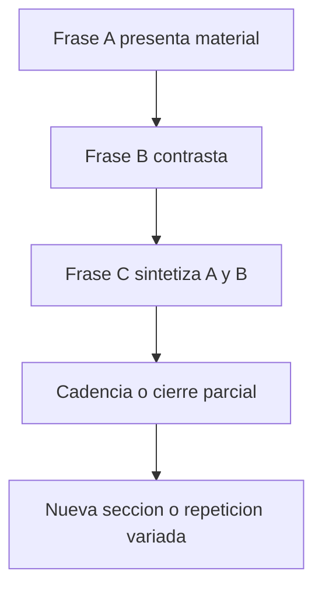

# Primera melodía: 
![[Pasted image 20260405121756.png]]


  

Tu propia marcación ya apunta a lo esencial:

1. Hay una **célula rítmica inicial** muy clara
    
2. Luego aparece una **repetición/variación interválica**
    
3. Se alternan sobre todo:
    
    - **terceras descendentes**
        
    - **saltos de un tono ascendente**
        
    - **terceras mayores descendentes**
        
    

  

O sea: **no estás viendo notas sueltas**, estás viendo un **patrón organizado**.

---

## **Mi diagnóstico directo**

  

Sí: **ahí sí hay motivo**.

  

Pero no es solo un motivo “de notas”.

Es un motivo formado por **3 capas al mismo tiempo**:

|**Capa**|**Qué veo en tu melodía**|**Por qué importa**|
|---|---|---|
|Rítmica|La célula azul se repite o se proyecta|Es la identidad más fácil de reconocer|
|Interválica|Terceras descendentes + paso de tono ascendente|Da el “gesto” melódico|
|De contorno|Baja por salto, luego corrige/sube un poco, luego vuelve a bajar|Eso le da dirección y coherencia|

Entonces, el motivo no es “estas 4 notas exactas” solamente.

El motivo es más bien:

  

> **una célula rítmica fija + una caída por tercera + una recuperación por grado conjunto o tono**

  

Ese es el verdadero ADN.

---

## **Tabla: qué probablemente sea el motivo principal**

|**Elemento**|**Observación**|**Función en el motivo**|
|---|---|---|
|Célula azul|Grupo rítmico corto y reconocible|Núcleo de identidad|
|Tercera descendente verde|Gesto melódico recurrente|Firma melódica|
|Tono ascendente rojo|Respuesta o compensación|Da continuidad|
|Repetición secuencial|El patrón vuelve varias veces|Confirma que no es accidente|

---

## **Cómo encontrar el motivo aquí**

  

### **Regla principal**

  

Un **motivo** suele ser la unidad más pequeña que:

- se **reconoce**
    
- se **repite**
    
- se **transforma**
    
- y sigue sonando como “la misma idea”
    

  

En tu melodía, yo lo buscaría así:

  

### **Opción A: motivo rítmico-melódico corto**

  

Tomar la **célula azul** como semilla, porque:

- aparece primero
    
- tiene identidad rítmica fuerte
    
- luego sus intervalos se expanden en el resto de la frase
    

  

### **Opción B: motivo interválico**

  

Tomar como motivo esta fórmula abstracta:

```
baja una 3ª  -> sube 1 tono -> baja una 3ª
```

Eso parece estar muy presente en el diseño.

  

### **Mi conclusión**

  

La mejor lectura es esta:

  

> **El motivo generador es la célula azul, pero su desarrollo real se reconoce por el patrón de terceras descendentes interrumpidas por pequeños ascensos conjuntos.**

---

## **Mermaid: cómo leer el proceso motívico**


---

## **Análisis más musical de tu frase**

  

## **1. Análisis rítmico**

  

La célula azul parece funcionar como **gatillo de la frase**.

  

Eso significa:

- no solo “empieza” la melodía
    
- también **establece el pulso interno**
    
- y hace que lo demás parezca continuación lógica
    

  

Entonces, cuando analices melodías, primero pregunta:

  

**¿qué célula rítmica podría sobrevivir aunque cambien las notas?**

  

En esta melodía, esa respuesta parece clara: **la azul**.

---

## **2. Análisis interválico**

  

Tú ya detectaste algo muy importante: no hay movimiento totalmente libre; hay una preferencia por ciertos saltos.

|**Tipo de movimiento**|**Presencia**|**Efecto**|
|---|---|---|
|3ª menor descendente|Alta|Color melancólico, cantable|
|3ª mayor descendente|Alta|Más brillo, pero sigue siendo estable|
|Ascenso de 1 tono|Recurrente|Compensa la caída|
|Movimiento conjunto corto|Sí|Une los fragmentos|

Eso produce esta sensación:

- la melodía **cae**
    
- luego **reacciona**
    
- luego **vuelve a caer**
    
- y así se construye una unidad
    

  

Eso es muy típico de una melodía bien organizada.

---

## **3. Análisis de contorno**

  

El contorno general no es lineal.

Tiene un comportamiento de tipo:

```
descenso por salto
-> pequeña recuperación
-> nuevo descenso
-> nueva recuperación
```

Eso da mucha unidad porque el oído no memoriza solo notas: memoriza **gestos**.

---

## **4. Análisis por repetición y variación**

  

Esto es lo más importante para decidir si hay motivo:

|**Pregunta**|**Respuesta en tu melodía**|
|---|---|
|¿Se repite el ritmo?|Sí|
|¿Se repite el tipo de salto?|Sí|
|¿Se repite el contorno?|Sí|
|¿Hay variación sin perder identidad?|Sí|

Entonces sí puedes decir técnicamente que hay un **trabajo motívico**.

---

## **Qué diría yo como análisis resumido formal**

  

Podrías describirla así:

  

> La melodía se construye a partir de una célula rítmica inicial claramente identificable, desarrollada mediante la reiteración de un gesto interválico basado en terceras descendentes compensadas por ascensos conjuntos o de tono. La unidad melódica no depende únicamente de la repetición literal de alturas, sino de la persistencia de su diseño rítmico, contorno y perfil interválico.

  

Eso ya suena a análisis musical serio.


### **Ejercicio pianístico**

|**Mano**|**Tarea**|**Objetivo**|
|---|---|---|
|RH|Tocar terceras descendentes legato|Sentir el gesto|
|RH|Insertar un tono ascendente entre saltos|Oír la compensación|
|LH|Mantener una nota pedal simple|Escuchar la melodía con apoyo|
|Ambas|Repetir el patrón en otras alturas|Entender la secuencia|

---


---
# Segunda melodía: 
![[Pasted image 20260405124350.png]]
![[Pasted image 20260405124457.png]]
  
1. **Aparece una nueva célula rítmica** al inicio
    
2. Luego **reaparece la célula de la primera melodía**
    
3. El discurso melódico usa más:
    
    - **bordaduras**
        
    - **saltos más expresivos** como la **5ª disminuida**
        
    - mezcla de **3ras menores y mayores**
        
    - un pequeño tramo de **grado conjunto**
        
    
4. Al final hay un **cierre armónico vertical** en acordes, así que la línea ya no queda “abierta” como puro discurso melódico

> **nueva célula + más variedad interválica + reuso de material anterior + cierre más estable**

---

## **Tabla general del análisis**

| **Capa**   | **Qué observo**                                                              | **Función musical**       |
| ---------- | ---------------------------------------------------------------------------- | ------------------------- |
| Ritmo      | Nueva célula azul al inicio + retorno de la célula de la primera melodía     | Contraste con unidad      |
| Intervalos | 5ª disminuida ascendente, 2ª mayor ascendente, 3ras bordadas, grado conjunto | Mayor tensión y color     |
| Contorno   | Más irregular y más “quebrado” que la primera                                | Da carácter contrastante  |
| Motivo     | No es totalmente nuevo: mezcla material nuevo y material derivado            | Relación con la melodía 1 |
| Cierre     | Termina con acordes verticales                                               | Sensación de conclusión   |


### **Estructura rítmica**

1. **Abre con identidad nueva**
    
2. **Desarrolla con material intermedio**
    
3. **Recupera el ADN rítmico anterior**

---

## **2. Análisis interválico**

  

Aquí el análisis se vuelve muy interesante.

  

Tus marcas indican:

- **5ª disminuida ascendente**
- **3ª menor bordada**
- **4ª justa descendente**
- **2ª mayor ascendente**
- **3ª mayor bordada**
- **3ª menor bordada**
- **grado conjunto**
    
- y finalmente una especie de extensión con **3ras menores** y cierre bordado con **5ª justa**
    

  

### **Qué significa eso musicalmente**

  

Esta melodía tiene más tensión que la primera porque incluye un intervalo muy marcado:

- **5ª disminuida ascendente**  

Ese salto cambia muchísimo el carácter.

Ya no estás solo en una melodía “cantable y suave” basada mayormente en terceras y tonos; ahora aparece un gesto más inestable.

---

## **Tabla interválica**

|**Intervalo / gesto**|**Presencia**|**Efecto expresivo**|
|---|---|---|
|5ª disminuida ascendente|Muy llamativa|Tensión, rareza, contraste|
|3ª menor bordada|Recurrente|Color melancólico|
|3ª mayor bordada|Recurrente|Más brillo, variedad|
|2ª mayor ascendente|Conectiva|Suaviza la línea|
|4ª justa descendente|Estructural|Da impulso de caída|
|Grado conjunto|Local|Relaja y conecta|

---

## **3. Análisis del contorno**
La primera melodía tenía una lógica más clara de:

- caída
- pequeña recuperación
- nueva caída
    
Esta segunda me parece más:

- **quiebre**
- **salto expresivo**
- **ornamentación**
- **respuesta**
 **reencuentro con material conocido**
    


## **¿Cuál es el motivo de esta segunda melodía?**

### **Motivo A: el nuevo gesto de apertura**

- nueva célula rítmica
    
- salto llamativo
    
- bordadura posterior
    ### **Motivo B: material heredado de la primera melodía**

- reaparición de la célula rítmica conocida
    
- uso de 3ras como elemento organizador
    
---

## **5. Análisis de contraste con la primera melodía**

## **En qué contrasta**

|**Elemento**|**Primera melodía**|**Segunda melodía**|
|---|---|---|
|Ritmo|Más uniforme en su identidad inicial|Introduce una nueva célula|
|Intervalos|Más centrada en 3ras y tonos|Incluye 5ª disminuida y más irregularidad|
|Contorno|Más estable y reconocible|Más quebrado y expresivo|
|Desarrollo|Repetición clara del gesto|Derivación y contraste|
|Final|Más lineal melódico|Cierre vertical con acordes|

## **En qué se mantiene relacionada**

|**Elemento**|**Relación**|
|---|---|
|Uso de 3ras|Sigue siendo central|
|Reaparición de célula|Une ambas melodías|
|Bordadura|Sigue habiendo elaboración alrededor de núcleos|
|Coherencia formal|No parece material ajeno, sino derivado|

---

## **6. Análisis formal**

Esta segunda melodía funciona muy bien como una **frase contrastante B** o como una **respuesta desarrollada** a A.

  

Podría entenderse así:

- **A** = primera melodía: presenta identidad básica
    
- **B** = segunda melodía: contrasta, intensifica, recuerda material anterior y cierra
    

  

Eso sirve mucho para composición binaria o frase periódica.

---

## **Tabla formal**

|**Sección**|**Función**|
|---|---|
|Inicio de melodía 2|Contraste|
|Zona media|Desarrollo|
|Reaparición de célula 1|Recuerdo / cohesión|
|Cierre en acordes|Resolución|

---

## **7. Cierre armónico final**

  

La segunda imagen muestra acordes al final, no solo línea melódica.

  

Eso cambia la función:

- ya no estamos solo en el plano horizontal
    
- aparece un **cierre vertical**
    
- se refuerza la conclusión
    

  

Eso suele indicar:

- final de frase
    
- final de sección
    
- o afirmación tonal
    

Podrías describir esta melodía así:

  

> La segunda melodía presenta un contraste respecto a la primera mediante una nueva célula rítmica de apertura y un diseño interválico más tenso e irregular, destacando el uso de bordaduras de terceras y un salto expresivo de quinta disminuida ascendente. Sin embargo, la unidad estructural se mantiene por la reaparición posterior de la célula rítmica inicial de la primera melodía y por la persistencia del trabajo interválico en torno a terceras. El cierre en acordes refuerza su función conclusiva dentro de la frase o sección.

  

Eso ya es un análisis bastante sólido.

---

# Análisis conjunto


Tus dos melodías **sí están emparentadas**.

No son dos ideas separadas al azar.

La relación principal es esta:

  

> **La primera melodía presenta el material básico. La segunda lo contrasta, lo estira, lo vuelve más expresivo, y luego recupera parte del ADN de la primera para que todo siga sonando como una sola pieza.**

  

Eso, compositivamente, está muy bien.

---

## **Tabla-resumen ultra clara**

|**Aspecto**|**Melodía 1**|**Melodía 2**|**Relación**|
|---|---|---|---|
|Función|Presentación|Contraste / desarrollo|B nace de A|
|Célula rítmica|Muy clara desde el inicio|Nueva al inicio, luego reaparece la de A|Contraste con unidad|
|Intervalos dominantes|3ras descendentes + tono ascendente|3ras bordadas + 2das + salto más tenso|B amplía el vocabulario|
|Contorno|Más estable y reconocible|Más quebrado y expresivo|B intensifica|
|Sensación|Más cantable / simple|Más dramática / desarrollada|Complementarias|
|Final|Más lineal|Más conclusivo, incluso vertical|B cierra mejor|

---

# **1. Análisis full de la** 

# **Melodía 1**

  

## **1.1 Qué hace musicalmente**

  

La primera melodía funciona como **material generador**.

  

No se siente como “una frase cualquiera”, sino como una frase que:

- presenta una **célula rítmica clara**
    
- organiza el discurso con **intervalos recurrentes**
    
- usa una lógica de **caída y recuperación**
    
- y deja una identidad fácil de recordar
    

---

## **1.2 Material principal**

|**Elemento**|**Observación**|**Función**|
|---|---|---|
|Célula rítmica inicial|Muy reconocible|Núcleo del motivo|
|3ras descendentes|Recurrentes|Firma melódica|
|Tono ascendente|Compensación|Continuidad|
|Repetición de gesto|Clara|Confirma el motivo|

---

## **1.3 Fórmula abstracta de la melodía 1**

  

La primera melodía se puede resumir así:

```
célula rítmica fija
+ caída por 3ª
+ recuperación por paso o tono
+ nueva caída por 3ª
```

Eso es casi su ADN.

---

## **1.4 Contorno de la melodía 1**

|**Rasgo**|**Descripción**|
|---|---|
|Dirección general|Ondulante, pero controlada|
|Gestos principales|Caída - pequeña subida - nueva caída|
|Nivel de tensión|Moderado|
|Cantabilidad|Alta|

---

## **1.5 Función formal de la melodía 1**

  

La melodía 1 cumple muy bien la función de:

- **Apertura**
    
- **Presentación**
    
- **Exposición del material motívico**
    

  

En otras palabras:

**aquí nace el lenguaje de la pieza**.

---

# **2. Análisis full de la** 

# **Melodía 2**

  

## **2.1 Qué hace musicalmente**

  

La segunda melodía no rompe la unidad.

Lo que hace es:

- abrir con un material rítmico distinto
    
- usar intervalos más tensos y más variados
    
- bordar más el material
    
- luego recuperar una célula conocida
    
- y cerrar con más estabilidad
    

  

Eso la vuelve una excelente **respuesta contrastante**.

---

## **2.2 Material principal**

|**Elemento**|**Observación**|**Función**|
|---|---|---|
|Nueva célula rítmica|Aparece al inicio|Contraste|
|5ª disminuida ascendente|Muy llamativa|Tensión|
|3ras bordadas|Muy presentes|Relación con A, pero más ornamentada|
|Grado conjunto breve|Zona de alivio|Conexión|
|Reaparición de la célula de A|Muy importante|Unidad|
|Cierre con acordes|Más estable|Conclusión|

---

## **2.3 Fórmula abstracta de la melodía 2**

```
nueva célula
+ salto expresivo más tenso
+ bordadura de 3ras
+ pequeño alivio por grado conjunto
+ retorno de material anterior
+ cierre más firme
```

---

## **2.4 Contorno de la melodía 2**

|**Rasgo**|**Descripción**|
|---|---|
|Dirección general|Más quebrada|
|Gestos principales|Salto tenso - bordadura - respuesta|
|Nivel de tensión|Más alto que en la melodía 1|
|Cantabilidad|Sí, pero más expresiva que simple|

---

## **2.5 Función formal de la melodía 2**

  

La melodía 2 funciona como:

- **contraste**
    
- **desarrollo**
    
- **intensificación**
    
- **cierre**
    

  

O sea, si la primera es **A**, la segunda puede ser perfectamente **B** o **A’ contrastante**.

---

# **3. Relación real entre las dos melodías**

  

## **La clave: contraste con parentesco**

  

La segunda melodía contrasta con la primera en tres dimensiones:

|**Dimensión**|**Cómo contrasta**|
|---|---|
|Ritmo|Nueva célula al inicio|
|Intervalos|Mayor tensión y más variedad|
|Contorno|Más irregular y expresivo|

Pero también conserva tres vínculos esenciales:

|**Dimensión**|**Cómo se mantiene unida**|
|---|---|
|Trabajo con 3ras|Sigue siendo central|
|Material rítmico heredado|Reaparece la célula de A|
|Lógica de derivación|No parece una idea ajena|

---

## **Tabla comparativa profunda**

|**Elemento**|**Melodía 1**|**Melodía 2**|**Lectura compositiva**|
|---|---|---|---|
|Identidad base|Clara y compacta|Más expandida|B desarrolla A|
|Ornamentación|Menor|Mayor|B es más rica|
|Tensión|Media|Alta|B empuja más|
|Claridad motívica|Muy directa|Más mixta|B transforma|
|Repetición literal|Más visible|Menos literal|B varía más|
|Función en la forma|Presenta|Contrasta y concluye|A → B|

---

## **Mermaid: cómo se relacionan A y B**


---

# **4. Qué estás haciendo bien sin darte cuenta**

  

Esto es importante para desbloquearte.

  

Ya hiciste varias cosas que **sí son composición real**:

|**Lo que hiciste**|**Por qué está bien**|
|---|---|
|Detectaste células rítmicas|Estás pensando en unidades, no en notas sueltas|
|Marcaste intervalos|Estás oyendo/viendo el gesto|
|Diferenciaste A y B|Ya estás trabajando forma|
|Reutilizaste material|Eso crea coherencia|
|Contrastaste sin romper la unidad|Eso es justo lo correcto|

Entonces el problema no parece ser “no sabes componer”.

El problema parece más bien:

> **te atoras en cómo continuar después de detectar el material inicial.**

  

Eso es normal.

---

## **Método práctico de continuación**

  ### **Paso 1: reduce ambas melodías a su esqueleto**

No pienses en todas las notas. Piensa en:

- célula rítmica
- salto característico
- contorno

| **Melodía** | **Esqueleto**                                    |
| ----------- | ------------------------------------------------ |
| A           | célula + 3ª descendente + recuperación           |
| B           | nueva célula + salto tenso + bordadura + retorno |
|             |                                                  |

### **Paso 2: decide qué quieres hacer con ese material**

Solo hay 4 movimientos básicos:

| **Opción** | **Qué haces**          |
| ---------- | ---------------------- |
| Repetir    | mantener casi igual    |
| Variar     | cambiar una parte      |
| Expandir   | hacerlo más largo      |
| Cerrar     | simplificar y resolver |

### **Paso 3: elige una sola**

Tu bloqueo muchas veces aparece porque intentas hacer las 4 a la vez.

---

## **Mi recomendación concreta**


Con el material que ya tienes, el mejor siguiente paso es:

> **hacer una tercera frase que tome el ritmo de A, el salto llamativo de B, y termine más estable que ambas.**

Eso te da continuidad y avance real.

---

# **6. Modelo de continuación para una tercera frase**

  

## **Opción buena para destrabarte**

  

### **Frase 3 = “síntesis”**

- empieza con la **célula rítmica de A**
    
- introduce **un solo salto expresivo heredado de B**
    
- vuelve al trabajo de **3ras**
    
- termina con un gesto más corto y claro
    

|**Sección**|**Material**|
|---|---|
|Inicio|ritmo de A|
|Centro|un gesto interválico de B|
|Final|simplificación + cierre|

Eso es mucho mejor que intentar inventar otra frase totalmente distinta.

---

## **Mermaid: estrategia para seguir componiendo**



---

# **7. Roadmap corto para salir del bloqueo**

  

## **Horizonte inmediato**

|**Tiempo**|**Tarea**|
|---|---|
|Hoy|reducir A y B a fórmula abstracta|
|Mañana|escribir una frase 3 de síntesis|
|Después|decidir si la forma será A-B-A’, A-B-C, o binaria|

## **La mejor forma ahora mismo**

  

Con lo que muestras, veo muy viable:

- **A – B – A’**
- o **A – B – cierre**

No intentaría una forma muy grande todavía.

---

# **8. Piano-specific application**

  

Te recomiendo este trabajo al piano, porque te va a ordenar la mente.

  

## **Ejercicio 1: tocar solo esqueletos**

  

Toca solo los puntos estructurales de cada melodía.

|**Melodía**|**Qué tocar**|
|---|---|
|A|notas de llegada de las 3ras|
|B|salto tenso + notas de llegada|
|C (nueva)|mezcla de ambas|

## **Ejercicio 2: tocar con una sola nota rítmica**

  

Haz esto:

- misma nota repetida
    
- primero con el ritmo de A
    
- luego con el ritmo de B
    

  

Eso te obliga a entender el ritmo como forma.

  

## **Ejercicio 3: componer una frase 3 en el teclado**

  

Regla:

- 1 célula de A
    
- 1 gesto de B
    
- cierre por grado conjunto o 3ª descendente
    

---

## **Tabla de práctica pianística**

|**Drill**|**Meta**|
|---|---|
|Ritmo solo de A|memorización estructural|
|Ritmo solo de B|sentir el contraste|
|Saltos clave de B|interiorizar tensión|
|Frase 3 de síntesis|desbloquear composición|

---

# **9. Qué elementos necesitas para hacer este análisis siempre**

|**Elemento**|**Qué debes mirar**|
|---|---|
|Célula rítmica|patrón reconocible|
|Intervalo principal|salto o movimiento característico|
|Intervalos recurrentes|lo que más se repite|
|Contorno|forma de la línea|
|Repetición|qué vuelve|
|Variación|qué cambia|
|Función formal|presenta, contrasta, desarrolla o cierra|
|Tipo de final|abierto o conclusivo|

---

# **10. Plantilla completa de análisis comparativo**

  

Puedes usar esto siempre:

|**Campo**|**Melodía A**|**Melodía B**|
|---|---|---|
|Célula rítmica principal|…|…|
|Intervalo más llamativo|…|…|
|Intervalos recurrentes|…|…|
|Contorno|…|…|
|Nivel de tensión|…|…|
|Relación con la otra|…|…|
|Función formal|…|…|
|Tipo de cierre|…|…|

---

## **Common mistakes**

- Creer que para contrastar necesitas material totalmente nuevo
    
- Intentar continuar sin reducir primero el material a su esqueleto
    
- Pensar en demasiadas notas y no en gestos
    
- No decidir la función de la siguiente frase antes de escribirla
    
- Querer “inspiración nueva” en vez de transformar lo que ya existe
    

---

## **Practice task**

  

### **Tarea de hoy**

  

Haz estas tres cosas por escrito:

|**Tarea**|**Meta concreta**|
|---|---|
|1. Resume A en una sola fórmula|máximo 1 línea|
|2. Resume B en una sola fórmula|máximo 1 línea|
|3. Diseña la frase 3|inicio de A + gesto de B + cierre claro|

### **Meta medible**

  

En **15 minutos**, debes terminar esta plantilla:

|**Campo**|**Respuesta**|
|---|---|
|Fórmula A|…|
|Fórmula B|…|
|Función de frase 3|…|
|Material de inicio de frase 3|…|
|Material de contraste en frase 3|…|
|Tipo de cierre|…|

### **Criterio de éxito**

  

Si puedes explicar tu frase 3 **antes de escribir cada nota**, ya estás componiendo con control real.

---

## **Next step**

  

El siguiente paso correcto es que hagamos juntos la **frase 3**, nota por nota, usando exactamente esta regla:

  

**ritmo de A + gesto interválico de B + cierre más estable**.


