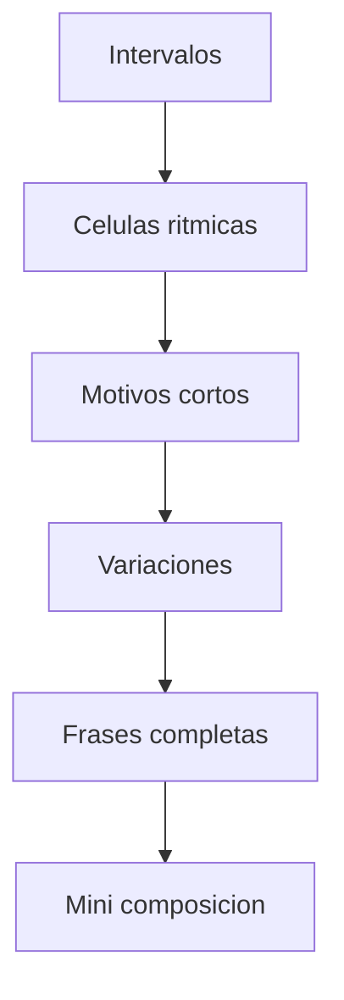
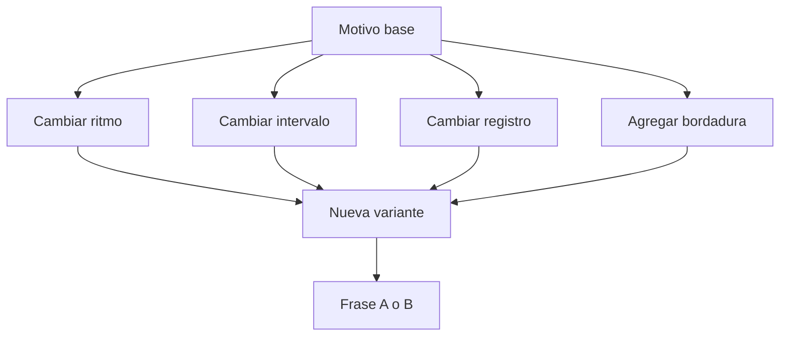

# **Enfoque general**

  

Tus dos melodías ya te dieron un material muy bueno:

| **Elemento**            | **Ya apareció en tus melodías** | **Lo vamos a practicar como** |
| ----------------------- | ------------------------------- | ----------------------------- |
| Célula rítmica A        | Sí                              | patrón base                   |
| Célula rítmica B        | Sí                              | patrón contrastante           |
| 3ras descendentes       | Sí                              | motivo melódico principal     |
| 2das ascendentes        | Sí                              | conexión                      |
| 3ras bordadas           | Sí                              | variación                     |
| Salto más tenso         | Sí, especialmente en B          | color / contraste             |
| Reaparición de material | Sí                              | forma y unidad                |

---

# **Plan de trabajo**

  

## **4 bloques de estudio**

|**Bloque**|**Qué entrenas**|**Resultado**|
|---|---|---|
|1|Intervalos aislados|Reconocer el gesto|
|2|Células rítmicas|Sentir identidad sin depender de alturas|
|3|Motivos y variaciones|Componer sin bloquearte|
|4|Frases completas|Construir A, B y una frase C|

---

## **Mermaid: mapa del estudio**



---

# **BLOQUE 1 — Ejercicios de intervalos**

  

## **1. Piano — terceras descendentes y ascendentes**

  

### **Ejercicio 1A: terceras puras**

  

Toca lentamente:

```music-abc
RH:
D5-B4 | C5-A4 | E5-C5 | F5-D5
```

Luego al revés:

```music-abc
RH:
B4-D5 | A4-C5 | C5-E5 | D5-F5
```

### **Objetivo**

  

Sentir:

- 3ra menor descendente
    
- 3ra mayor descendente
    
- 3ra menor ascendente
    
- 3ra mayor ascendente
    

|**Variante**|**Tempo**|**Meta**|
|---|---|---|
|Legato|60 bpm|oír el color|
|Staccato|72 bpm|sentir el gesto|
|Con acento en la primera nota|66 bpm|marcar el motivo|

---

## **2. Guitarra — terceras en dos cuerdas**

  

### **Ejercicio 1B: terceras en pares de cuerdas**

  

Toca terceras en cuerdas 1 y 2, luego 2 y 3.

  

Ejemplo simple en tonalidad de Bb o Gm:

```
e|--6-----5-----8-----6--
B|--6-----6-----8-----6--
```

Luego busca versiones donde una voz baje y la otra acompañe.

  

### **Objetivo**

  

Que la mano empiece a reconocer:

- forma visual de la 3ra
    
- diferencia entre 3ra mayor y menor
    
- sensación de “caída” melódica
    

|**Nivel**|**Tarea**|
|---|---|
|Básico|tocar dobles notas|
|Intermedio|arpegiarlas una por una|
|Compositivo|hacer una mini melodía con 4 terceras|

---

## **3. Piano y guitarra — salto tenso**

  

### **Ejercicio 1C: salto característico de contraste**

  

Como en tu melodía B apareció un salto más fuerte, practica:

- tocarlo aislado
    
- resolverlo
    
- usarlo una sola vez dentro de un motivo
    

  

### **Regla**

  

Nunca practiques el salto solo:

**salto + resolución**.

|**Fórmula**|**Ejemplo**|
|---|---|
|salto tenso + paso conjunto|X → salto → nota vecina|
|salto tenso + 3ra descendente|X → salto → caída|
|salto tenso + bordadura|X → salto → bordar la llegada|

---

# **BLOQUE 2 — Ejercicios de células rítmicas**

  

## **4. Piano — ritmo sin melodía**

  

### **Ejercicio 2A: una sola nota, dos células**

  

Toca una sola nota, por ejemplo **D4**, pero usando:

- primero la célula rítmica A
    
- luego la célula rítmica B
    

  

No cambies de nota todavía.

  

### **Objetivo**

  

Separar:

- **ritmo**
    
- de **altura**
    

  

Eso ayuda muchísimo a desbloquearse.

|**Fase**|**Qué haces**|
|---|---|
|1|una sola nota con célula A|
|2|una sola nota con célula B|
|3|alternas A / B|
|4|inventas una célula C derivada|

---

## **5. Guitarra — palma/rítmica + una nota**

  

### **Ejercicio 2B: púa o pulgar con una sola nota**

  

En una sola cuerda, por ejemplo cuerda 3, toca la misma nota con:

- célula A
    
- célula B
    
- A-A-B-A
    
- A-B-A’-cierre
    

  

### **Objetivo**

  

Entender que un motivo puede vivir aunque todavía no haya melodía compleja.

---

## **6. Music-abc: célula rítmica abstracta**

```music-abc
X:1
T:Celulas ritmicas abstractas
M:4/4
L:1/8
K:C
"D4 ritmo A" D2 D D2 D | "D4 ritmo B" D D2 D D D2 |
```

No importa si no coincide exactamente con tus compases reales: esto es para entrenar el concepto.

---

# **BLOQUE 3 — Motivos y bordaduras**

  

## **7. Piano — motivo A, luego 3 variaciones**

  

### **Ejercicio 3A**

  

Toma este esquema:

```
caida de 3ra -> subida por paso
```

Ejemplo:

```
D5-B4-C5
```

Ahora crea 3 variantes:

|**Variación**|**Ejemplo**|
|---|---|
|Literal|D5-B4-C5|
|Bordada|D5-B4-C5-B4|
|Expandida|D5-B4-C5-A4|

### **Regla**

  

La identidad debe seguir clara.

---

## **8. Guitarra — motivo corto en una cuerda, luego en dos cuerdas**

  

### **Ejercicio 3B**

  

Haz un motivo de 3 notas en una sola cuerda.

  

Ejemplo:

```
G|--7--4--5--
```

Luego llévalo a dos cuerdas con bordadura o doble nota.

  

### **Meta**

  

Que el motivo no dependa del lugar físico, sino de su gesto.

---

## **9. Piano — bordaduras de terceras**

  

### **Ejercicio 3C**

  

Como en tu segunda melodía aparecen **3ras bordadas**, practica esto:

```
E5-C5-D5-C5
F5-D5-E5-D5
D5-B4-C5-B4
```

### **Qué estás entrenando**

- nota estructural
    
- nota vecina
    
- regreso
    
- continuidad motívica
    

|**Meta**|**Resultado esperado**|
|---|---|
|5 min|que la bordadura te suene natural|
|10 min|crear tú 4 bordaduras distintas|
|15 min|usarlas dentro de una frase real|

---

# **BLOQUE 4 — Frases completas**

  

## **10. Piano — A, B y C**

  

### **Ejercicio 4A**

  

Haz tres frases cortas:

|**Frase**|**Regla**|
|---|---|
|A|usa la célula rítmica A y 3ras descendentes|
|B|usa célula B y un salto más tenso|
|C|mezcla inicio de A + gesto de B + cierre estable|

### **Estructura sugerida**

- 1 compás A
    
- 1 compás A’
    
- 1 compás B
    
- 1 compás Cierre
    

---

## **11. Guitarra — frase-respuesta**

  

### **Ejercicio 4B**

  

Haz esto como si fuera pregunta y respuesta:

|**Compás**|**Función**|
|---|---|
|1|pregunta (motivo A)|
|2|eco o secuencia|
|3|contraste (motivo B)|
|4|respuesta/cierre|

### **Reglas**

- máximo 5 notas por compás al principio
    
- no más de 1 salto grande por compás
    
- siempre debe haber al menos 1 gesto reconocible repetido
    

---

# **Ejercicios específicos por instrumento**

  

# **Piano — rutina de 20 minutos**

|**Minutos**|**Ejercicio**|**Objetivo**|
|---|---|---|
|5|terceras ascendentes y descendentes|oído + mano|
|5|células rítmicas con una nota|independencia rítmica|
|5|bordaduras y saltos|color|
|5|construir A-B-C|composición|

## **Piano-specific application**

  

Trabaja siempre en estas 3 capas:

```
1) Ritmo solo
2) Esqueleto interválico
3) Melodía completa
```

Y luego prueba estas distribuciones:

|**Mano izquierda**|**Mano derecha**|
|---|---|
|nota pedal|motivo|
|bajo en blancas|célula rítmica|
|raíz + quinta|melodía con bordaduras|

---

# **Guitarra — rutina de 20 minutos**

|**Minutos**|**Ejercicio**|**Objetivo**|
|---|---|---|
|5|terceras en pares de cuerdas|mapa visual|
|5|célula A y B en una cuerda|ritmo y articulación|
|5|motivo con bordaduras|fraseo|
|5|pregunta-respuesta A-B|composición|

### **Sugerencia técnica**

  

Alterna estas texturas:

|**Textura**|**Cómo practicarla**|
|---|---|
|Una sola cuerda|claridad melódica|
|Dos cuerdas|intervalos|
|Arpegio|célula rítmica|
|Acorde parcial|cierre|

---

# **Ejercicios creativos para desbloquearte**

  

## **12. Ejercicio: “solo cambia una cosa”**

  

Toma tu motivo y solo cambia una variable por vez.

|**Variable**|**Qué puedes cambiar**|
|---|---|
|Ritmo|misma altura, nuevo ritmo|
|Intervalo|mismo ritmo, nuevo salto|
|Dirección|mismo patrón, invertido|
|Registro|mismo motivo una octava arriba|
|Final|mismo inicio, cierre diferente|

Este ejercicio es oro para dejar de bloquearte.

---

## **13. Ejercicio: “3 versiones del mismo motivo”**

  

Haz tres versiones del mismo motivo:

|**Versión**|**Carácter**|
|---|---|
|1|suave|
|2|tensa|
|3|conclusiva|

### **Regla**

  

No puedes cambiar todo.

Solo 1 o 2 parámetros.

---

## **14. Ejercicio: “motivo sin instrumento”**

  

Antes de tocar, escribe en una línea:

```
ritmo A + 3ra descendente + paso ascendente
```

Luego tócala.

  

Eso obliga a componer con intención, no solo con dedos.

---

# **Mermaid: método para crear variaciones sin bloquearte**



---

# **Mini repertorio de micro-drills**

|**Drill**|**Piano**|**Guitarra**|
|---|---|---|
|3ra descendente|sí|sí|
|3ra bordada|sí|sí|
|2da ascendente conectiva|sí|sí|
|salto tenso + resolución|sí|sí|
|célula A en una nota|sí|sí|
|célula B en una nota|sí|sí|
|A-B-C de 1 compás|sí|sí|
|pregunta-respuesta|sí|sí|

---

# **Practice task**

  

## **Tarea semanal simple**

  

### **Día 1**

- 10 min ritmo
    
- 10 min terceras
    

  

### **Día 2**

- 10 min bordaduras
    
- 10 min salto + resolución
    

  

### **Día 3**

- 20 min construir A y A’
    

  

### **Día 4**

- 20 min construir B contrastante
    

  

### **Día 5**

- 20 min construir C de síntesis
    

  

### **Día 6**

- tocar A-B-C seguido
    

  

### **Día 7**

- grabarte y evaluar
    

---

## **Tabla de evaluación**

|**Criterio**|**1–5**|
|---|---|
|Claridad del motivo||
|Ritmo reconocible||
|Uso de intervalos||
|Contraste entre frases||
|Unidad entre frases||
|Comodidad en piano||
|Comodidad en guitarra||

---

## **Common mistakes**

- Practicar demasiadas notas y no el gesto
    
- No separar ritmo de altura
    
- Hacer saltos sin resolución
    
- Cambiar demasiadas cosas a la vez
    
- Querer “inspiración” antes de hacer micro-variaciones
    
- No grabarte
    
- No repetir un motivo suficiente para que exista de verdad
    

---

## **Next step**

  

El mejor siguiente paso es que te prepare una **rutina exacta de 7 días**, con ejercicios ya escritos en notas para **piano y guitarra**, basados específicamente en tus melodías A y B.