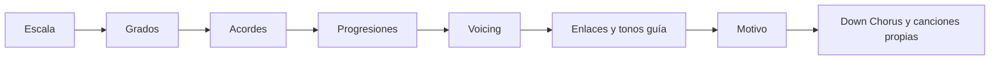

# Guía grande de repaso – 20 días

## 📋 Descripción

Esta carpeta contiene el plan completo de repaso dividido en **20 días** de ejercicios prácticos.

Cada día tiene su propio archivo con:
- ✅ Objetivos específicos
- ✅ Ejercicios estructurados
- ✅ Espacio para tu trabajo
- ✅ Sección de notas y aprendizajes
- ✅ Conexiones con otros temas

---

## 🗺️ Estructura del repaso

### **Semana 1: M0 Nomenclatura + M1 Tonalidades**
- [Día 1](0.%20Día%201%20-%20Acordes%20mayores%20y%20menores.md) – Acordes mayores y menores
- [Día 2](1.%20Día%202%20-%20Acordes%20con%20séptima.md) – Acordes con séptima
- [Día 3](2.%20Día%203%20-%20Extensiones%20y%20add.md) – Extensiones y "add"
- [Día 4](3.%20Día%204%20-%20Tonalidades%20mayores.md) – Tonalidades mayores
- [Día 5](4.%20Día%205%20-%20Tonalidades%20menores.md) – Tonalidades menores

### **Semana 2: M2 Modos + M3 Dominantes**
- [Día 6](5.%20Día%206%20-%207%20modos%20en%20C%20mayor.md) – 7 modos en C mayor
- [Día 7](6.%20Día%207%20-%20Intercambio%20modal.md) – Intercambio modal
- [Día 8](7.%20Día%208%20-%20Familias%20tonales.md) – Familias tonales
- [Día 9](8.%20Día%209%20-%20Dominantes%20secundarios.md) – Dominantes secundarios
- [Día 10](9.%20Día%2010%20-%20Sustituto%20de%20tritono.md) – Sustituto de tritono y tensiones

### **Semana 2 (continuación): M4 Voicing**
- [Día 11](10.%20Día%2011%20-%20Inversiones%20de%20triadas.md) – Inversiones de triadas
- [Día 12](11.%20Día%2012%20-%20Voicings%20de%20cuatríadas.md) – Voicings de cuatríadas
- [Día 13](12.%20Día%2013%20-%20Reglas%20de%20coral.md) – Reglas de coral

### **Semana 3: M5 Contrapunto**
- [Día 14](13.%20Día%2014%20-%20Contrapunto%20primera%20especie.md) – Contrapunto primera especie
- [Día 15](14.%20Día%2015%20-%20Segunda%20y%20tercera%20especie.md) – Segunda y tercera especie
- [Día 16](15.%20Día%2016%20-%20Cuarta%20especie%20retardos.md) – Cuarta especie (retardos)
- [Día 17](16.%20Día%2017%20-%20Quinta%20especie%20libre.md) – Quinta especie (contrapunto libre)

### **Semana 3 (final): M6 Enlaces + M7 Proyecto**
- [Día 18](17.%20Día%2018%20-%20Cadencias%20y%20tonos%20guía.md) – Cadencias y tonos guía
- [Día 19](18.%20Día%2019%20-%20Enlaces%20y%20motivo.md) – Enlaces y motivo
- [Día 20](19.%20Día%2020%20-%20Aplicación%20Dawn%20Chorus.md) – Aplicación a _Dawn Chorus_

---

## 🎯 Cómo usar esta guía

### 1. **Abre el día correspondiente**
   - Cada archivo tiene todo lo que necesitas para ese día

### 2. **Lee los objetivos**
   - Entiende qué vas a aprender ese día

### 3. **Completa los ejercicios**
   - Escribe directamente en el archivo
   - Usa las tablas y espacios en blanco

### 4. **Toma notas al final**
   - Sección "Notas y aprendizajes de la sesión"
   - Anota dudas, descubrimientos, conexiones

### 5. **Sigue los enlaces**
   - Cada día tiene links a temas relacionados
   - Profundiza según necesites

---

## 📊 Progreso

Marca con ✅ los días completados:

**Semana 1:**
- [ ] Día 1
- [ ] Día 2
- [ ] Día 3
- [ ] Día 4
- [ ] Día 5

**Semana 2:**
- [ ] Día 6
- [ ] Día 7
- [ ] Día 8
- [ ] Día 9
- [ ] Día 10
- [ ] Día 11
- [ ] Día 12
- [ ] Día 13

**Semana 3:**
- [ ] Día 14
- [ ] Día 15
- [ ] Día 16
- [ ] Día 17
- [ ] Día 18
- [ ] Día 19
- [ ] Día 20

---

## 🎓 Pipeline completo

Este repaso sigue el flujo natural de construcción musical:

---

## 💡 Consejos

1. **No te apures**: Es mejor hacer bien 1 día que apurar 3
2. **Practica en tu instrumento**: No solo escribas, toca y escucha
3. **Relaciona con tus canciones favoritas**: Busca estos conceptos en Beach House, Bon Iver, etc.
4. **Vuelve atrás si es necesario**: Los días están conectados, pero puedes repasar
5. **Comparte tus descubrimientos**: Anota todo en la sección de notas

---

## 🔗 Recursos relacionados

- **Guía completa original**: [[../1. Ejercicios repaso.md]]
- **Super guía de repaso**: [[../AI/12. Repaso/0. Repaso super guía.md]]
- **Temas expandidos**: [[../Tema/]]
- **Notas de clase**: [[../Notas/]]
- **Progresiones para practicar**: [[../Progresiones/]]

---

**¡Buena suerte en tu viaje de repaso! 🎵🎸**

*Recuerda: El objetivo no es solo completar, sino internalizar y sentir la música.*

