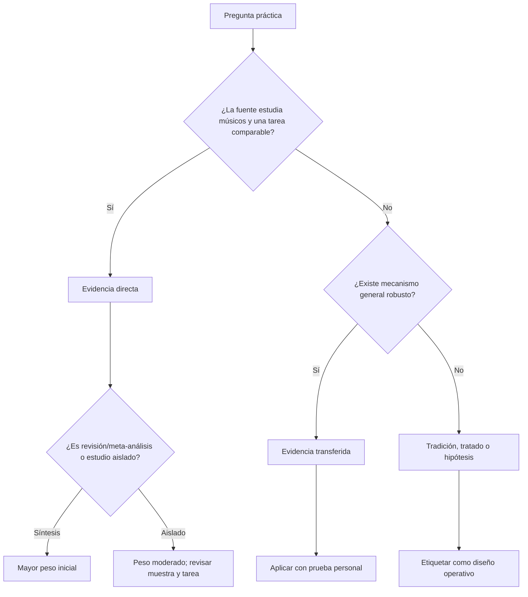
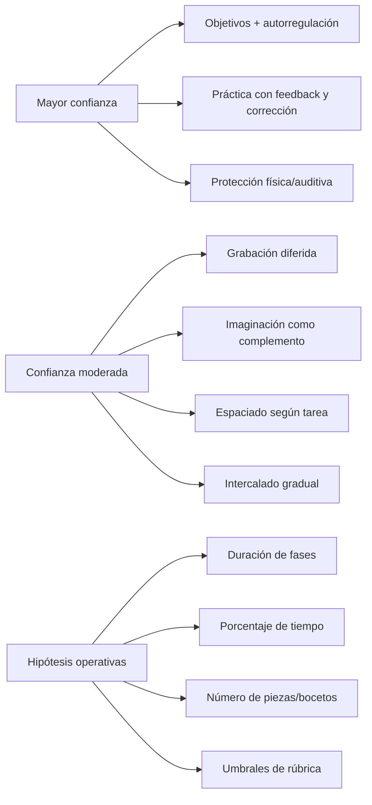

# Auditoría científica de segunda edición

> [!abstract] Dictamen
> El sistema está razonablemente alineado con investigación sobre práctica musical, autorregulación, feedback, memoria, imaginación e intervención pedagógica. Sin embargo, la ciencia **no valida directamente** un roadmap universal de 18 meses, sesiones de 45 minutos, revisiones 1–3–7–14, una pieza cada 2–4 semanas ni los porcentajes provisionales de nivel. Esos elementos son reglas operativas transparentes que deben ajustarse con evidencia personal.

## Conclusiones de la revisión

### Lo que tiene mejor apoyo directo

1. Definir objetivos, planear estrategias, monitorizar y reflexionar puede mejorar la práctica musical.
2. La calidad, organización y corrección de errores importan; contar horas no basta.
3. Grabar y reproducir puede modificar la autoevaluación y separar ejecución de observación.
4. Combinar audición, acción e imaginación es más defendible que aprender exclusivamente mediante gesto motor.
5. La práctica intercalada puede ayudar a retención, atención y detección de errores, pero la evidencia musical es pequeña y no uniforme.
6. La práctica física suele superar a la práctica puramente mental; la imaginación sirve como complemento.
7. La composición se beneficia de andamiaje, problemas de alcance controlado, reflexión, feedback y contacto con intérpretes.
8. El cuerpo y el oído necesitan protección; dolor y exposición elevada no son indicadores de aprendizaje.

### Lo que es una transferencia razonable, no prueba musical directa

1. Recuperación activa para fórmulas, vocabulario y reconstrucción.
2. Espaciado para conceptos, canciones y repertorio retenido.
3. Incubación y separación parcial entre generación y evaluación.
4. Revisar después de dormir o después de una pausa.
5. Usar tests de transferencia y retención diferida en vez de juzgar solo fluidez inmediata.

### Lo que es diseño de este curso

1. Fases de doce semanas.
2. Ciclos de cuatro semanas.
3. Cinco sesiones semanales.
4. Distribución 35/15/15/15/10/10.
5. Una obra cada 2–4 semanas.
6. Umbrales de 60%, 75%, 80% o puntuación 3/4.
7. Doce, dieciocho o veinticuatro meses como horizonte.

Estos diseños pueden ser útiles sin ser “descubiertos por la neurociencia”. Su validez depende de sostenibilidad, productos y mejora personal.

## Método de revisión

Se compararon las recomendaciones centrales de:

- [[Teoría musical/1. Curso cresciente/01. Principios científicos del aprendizaje musical]];
- [[Teoría musical/1. Curso cresciente/5. Investigación y roadmap/00. Roadmap maestro de 18 a 24 meses]];
- [[Teoría musical/1. Curso cresciente/5. Investigación y roadmap/01. Auditoría extendida de nivel y brechas]];
- [[Teoría musical/1. Curso cresciente/5. Investigación y roadmap/03. Plan de lectura y aplicación de 52 semanas]];
- [[Teoría musical/1. Curso cresciente/5. Investigación y roadmap/04. Evaluaciones trimestrales y puertas de dominio]].

Las fuentes se clasificaron por proximidad:



## Jerarquía utilizada

| Nivel | Fuente | Qué permite afirmar |
|---:|---|---|
| 1 | revisión sistemática/metaanálisis de tareas musicales comparables | tendencia general, aún dependiente de calidad y heterogeneidad |
| 2 | experimento controlado o intervención musical | efecto en población/tarea estudiada; generalización limitada |
| 3 | estudio observacional/correlacional musical | asociación, no causalidad |
| 4 | estudio de memoria o motor no musical | mecanismo posible; requiere traducción cauta |
| 5 | tratado, pedagogía experta o estudio de caso | hipótesis de oficio, vocabulario y diseño de ejercicios |
| 6 | regla de este curso | herramienta para organizar; debe medirse localmente |

El tamaño de muestra, la representatividad, la calidad de medición y la correspondencia con **componer música propia** importan tanto como el nombre del diseño.

---

# Matriz de afirmaciones auditadas

| Recomendación | Tipo | Confianza | Qué la sostiene | Límite principal |
|---|---|---|---|---|
| Objetivo observable por sesión | 🟢 directa | moderada-alta | autorregulación e intervención de Miksza | principalmente interpretación, no composición |
| Planear–ejecutar–reflexionar | 🟢 directa | moderada | estudios de SRL en músicos | muestras/intervenciones pequeñas |
| Calidad sobre tiempo bruto | 🟢 directa | moderada | Duke; Williamon/Valentine | pianistas y tareas específicas |
| Registrar errores y estrategia | 🟢 directa | moderada | práctica experta y SRL | no hay una plantilla universal |
| Grabar una toma completa | 🟢 directa | moderada | audio/video feedback | cambia autoevaluación; no garantiza mejora posterior |
| Recuperar sin mirar | 🟡 transferida | alta para memoria declarativa | testing effect general | transferencia parcial a oído/motor/composición |
| Espaciar conceptos | 🟡 transferida | alta para memoria | metaanálisis general | intervalo óptimo depende de material |
| Espaciar canciones/repertorio | 🟢 directa | moderada | estudio de retención de canción | una tarea y población |
| Espaciar minutos dentro de piano | 🟢 directa | baja/mixta | estudio sin efecto de 1–15 min | no permite concluir “espaciar nunca sirve” |
| Intercalar tareas | 🟢 directa | baja-moderada | clarinetistas; variabilidad pianística | muestras pequeñas y resultados por rater/tarea |
| Bloquear primero una habilidad nueva | 🟡/🔵 | moderada | carga y variabilidad dependiente de complejidad | no existe umbral universal |
| Pausas breves | 🟢/🟡 | moderada | descanso, fatiga, práctica musical | beneficio inmediato no siempre es aprendizaje duradero |
| Dormir antes de revisar | 🟡 transferida | moderada | consolidación motora/musical | sueño no mejora todo ni reemplaza práctica |
| Imaginar/cantar antes de tocar | 🟢 directa | moderada | aprendizaje auditivo-motor e imaginación | habilidad de imagen varía entre personas |
| Práctica mental como complemento | 🟢 directa | moderada | pianistas expertos | menor efecto que práctica física en varios estudios |
| Generar varias opciones | 🟡 transferida | moderada | fluidez/originalidad e improvisación | no fija un número óptimo de bocetos |
| Separar generar y editar | 🟡 transferida | moderada-baja | creatividad/incubación | poca evidencia directa en composición musical |
| Restricción de una dificultad nueva | 🔵 operativa | plausible | andamiaje y control de carga | no validada como “una exactamente” |
| Una pieza cada 2–4 semanas | 🔵 operativa | sin validación externa | fuerza ciclos completos | debe reducirse/aumentarse según alcance |
| Feedback específico | 🟢/🟡 | moderada | composición colaborativa y evaluación formativa | calidad del feedback varía |
| Oído contextual antes de etiquetas | 🟢/nivel 5 | moderada | Karpinski y pedagogía auditiva | métodos concretos tienen evidencia desigual |
| Cantar grados y bajos | nivel 2–5 | plausible | estrategia auditiva y práctica pedagógica | no existe prueba de superioridad universal |
| Analizar referencias y aplicar | nivel 2–5 | moderada | composición/escucha y aprendizaje situado | depende de calidad del análisis |
| Revisar macro antes de micro | nivel 5/🔵 | plausible | pedagogía de composición y diseño | principio de oficio, no RCT |
| Proteger oído y cuerpo | 🟢 directa | alta para prevención | OMS y revisión de lesiones | límites personales/contextuales varían |

---

# 1. Práctica deliberada: importante, no explicación total

Una síntesis de Platz y colegas reunió 13 estudios y 788 participantes y estimó una correlación corregida de `r = .61` entre práctica relevante acumulada y logro musical. [Artículo abierto](https://www.frontiersin.org/journals/psychology/articles/10.3389/fpsyg.2014.00646/full).

Macnamara, Hambrick y Oswald, usando definiciones y decisiones analíticas distintas en múltiples dominios, estimaron que la práctica deliberada explicaba aproximadamente 21% de la varianza en música. [Metaanálisis](https://journals.sagepub.com/doi/abs/10.1177/0956797614535810).

No son cifras que deban promediarse ingenuamente. Difieren en:

- definición de práctica relevante/deliberada;
- correcciones de fiabilidad;
- inclusión y selección de estudios;
- medida de logro;
- inferencia causal a partir de datos principalmente correlacionales.

**Conclusión válida:** la práctica específica tiene una asociación importante con logro musical, pero no explica por sí sola todas las diferencias ni convierte horas en garantía.

**Corrección aplicada al curso:** contar sesiones o minutos será indicador de exposición; audio retenido, transferencia y obras serán indicadores de capacidad.

# 2. Calidad, organización y errores

Duke, Simmons y Cash observaron pianistas avanzados aprendiendo un pasaje y encontraron que el tiempo total y el número de ensayos no distinguían bien la retención; los mejores resultados mostraban una mayor proporción de ensayos correctos y un patrón particular de trabajo sobre errores. [Estudio](https://journals.sagepub.com/doi/10.1177/0022429408328851).

Williamon y Valentine estudiaron a 22 pianistas y tampoco hallaron que la cantidad bruta predijera de forma simple la calidad final; ciertos patrones de organización de segmentos sí se relacionaron con mejores resultados. [Estudio](https://pubmed.ncbi.nlm.nih.gov/10958579/).

Ambos estudios son pequeños y de interpretación pianística. Respaldan preguntar “¿qué cambió entre intentos?”, pero no prueban que exista una única estrategia óptima.

**Decisión:** cada repetición debe tener comparación y ajuste. Repetir puede ser necesario; repetir sin información es el problema.

# 3. Autorregulación

El marco de previsión, ejecución y autorreflexión fue adaptado al estudio de práctica musical mediante microanálisis. Los autores destacan conducta, cognición y afecto, no solo minutos o repeticiones. [McPherson et al.](https://journals.sagepub.com/doi/10.1177/0305735617731614).

En una intervención aleatorizada pequeña con 28 instrumentistas de viento universitarios, ambos grupos aprendieron estrategias tradicionales; el grupo que además recibió instrucción de autorregulación obtuvo mayores ganancias en el día 5 y seleccionó objetivos musicales más matizados con mayor frecuencia. [Miksza](https://journals.sagepub.com/doi/10.1177/0305735613500832).

Una escala publicada en 2026 operacionaliza autorregulación de práctica en cinco subescalas y fue desarrollada con 290 músicos; aporta medición, pero su diseño correlacional no demuestra por sí solo que puntuar alto cause mejor interpretación. [Suzuki, Wolf y Ginsborg](https://journals.sagepub.com/doi/10.1177/03057356251410563).

**Conclusión:** el ciclo planear–monitorizar–evaluar tiene apoyo directo razonable. La plantilla del curso es una implementación posible, no la única.

# 4. Grabación y autoevaluación

En 112 estudiantes instrumentistas de secundaria, escuchar la propia grabación cambió evaluaciones de afinación y ritmo, con otra evaluación dos días después. [Silveira y Gavin](https://journals.sagepub.com/doi/abs/10.1177/0305735615596375).

En 16 guitarristas clásicos universitarios, el grupo que utilizó video modificó la forma de formular comentarios autoevaluativos, con cambios más marcados entre intérpretes de mayor rendimiento. [Boucher, Creech y Dubé](https://journals.sagepub.com/doi/abs/10.1177/0305735619842374).

Estos trabajos no prueban que grabarse siempre mejore la obra. Sí muestran que la observación diferida cambia el acceso a información evaluativa.

**Conclusión:** grabar → escuchar sin tocar → describir → probar un cambio es defendible. “Grabar una vez por semana” sigue siendo frecuencia operativa.

# 5. Recuperación activa

El testing effect tiene apoyo robusto en aprendizaje verbal: intentar recuperar puede mejorar retención diferida frente a reestudio. [Roediger y Karpicke](https://doi.org/10.1111/j.1467-9280.2006.01693.x).

La transferencia musical es más directa cuando la tarea recuperada es declarativa o simbólica:

- fórmulas de intervalos/acordes;
- nombres y funciones;
- reconstrucción de mapas formales;
- recordar un motivo;
- escribir de memoria un bajo ya estudiado.

Es menos directa para coordinación fina, afinación vocal o juicio estilístico. En esos casos debe existir práctica perceptiva y motora.

**Conclusión:** “cerrar apuntes y producir” es una buena regla; no sustituye tocar, cantar y escuchar.

# 6. Espaciado: evidencia positiva, pero no una fórmula única

La revisión cuantitativa de Cepeda y colegas muestra una ventaja general de distribuir estudio para memoria y que el intervalo útil depende del horizonte de retención. [Revisión](https://digitalcommons.usf.edu/psy_facpub/1771/).

En música aparecen resultados distintos:

- Un estudio de aprendizaje de una secuencia de piano no halló ventaja para intervalos de 1–15 minutos. [Wiseheart et al.](https://pmc.ncbi.nlm.nih.gov/articles/PMC5553926/).
- Un estudio de canción enseñada hasta 95% de criterio encontró mejor retención tres semanas después al espaciar sesiones dos días o una semana frente a práctica masiva. [Katz, Ando y Wiseheart](https://pubmed.ncbi.nlm.nih.gov/34894323/).

**Conclusión:** espaciar conceptos, canciones y revisión es sensato. La regla `1–3–7–14` es un recordatorio configurable, no el intervalo científicamente óptimo para todo.

# 7. Intercalado y variabilidad

Diez clarinetistas avanzados practicaron materiales en bloques o alternando cada tres minutos. Algunas valoraciones favorecieron el intercalado y los participantes reportaron ventajas en foco, objetivos y detección de errores, pero los resultados variaron entre jueces y no todos fueron significativos. [Carter y Grahn](https://pmc.ncbi.nlm.nih.gov/articles/PMC4989027/).

En pianistas novatos, Caramiaux y colegas mostraron que los efectos de variabilidad dependían del componente de habilidad y complejidad; una variación grande/aleatoria no produjo una ventaja uniforme. [Artículo](https://pmc.ncbi.nlm.nih.gov/articles/PMC5832267/).

**Conclusión:**

1. estabiliza una representación inicial;
2. introduce una variación;
3. intercala después;
4. evalúa retención al día siguiente, no solo sensación inmediata.

Esta secuencia es una síntesis prudente, no un umbral experimental exacto.

# 8. Pausas, fatiga y sueño

En experimentos con secuencia y melodía de teclado, quienes recibieron una pausa extendida temprana mostraron mayores ganancias entre final de entrenamiento y retest matutino. [Duke et al.](https://pubmed.ncbi.nlm.nih.gov/19673774/). No obstante, investigaciones recientes sobre microdescansos en secuencias motoras cuestionan interpretar toda mejora después de pausas breves como aprendizaje offline duradero; parte puede ser recuperación transitoria o planeación. [Estudio de 2025](https://pubmed.ncbi.nlm.nih.gov/41150724/).

El sueño interviene en consolidación motora, pero los efectos varían por tarea, grupo, momento y forma de medir. Por eso el curso usa el sueño principalmente para **separar producción y juicio**, no para prometer una ganancia automática.

**Conclusión:** pausa antes de que la fatiga degrade el feedback; vuelve al día siguiente para evaluar. Los bloques de 25–40 minutos son una convención ajustable.

# 9. Imaginación y acoplamiento auditivo-motor

Pianistas expertos recordaron mejor melodías después de aprendizaje auditivo o auditivo-motor que tras aprendizaje motor sin sonido; el acoplamiento normal produjo ventajas sobre escuchar solamente. Las capacidades de imaginación modularon resultados. [Brown y Palmer](https://pubmed.ncbi.nlm.nih.gov/22271265/).

En otro estudio con pianistas expertos, la práctica mental mejoró rendimiento y anticipación motora, aunque menos que la práctica física. [Bernardi et al.](https://pubmed.ncbi.nlm.nih.gov/23970859/). Un estudio clásico de memorización encontró también mejor resultado con práctica física y cierta ventaja de escuchar un modelo frente a inspección visual sola. [Lim y Lippman](https://pubmed.ncbi.nlm.nih.gov/28147907/).

**Conclusión:** cantar, imaginar y tocar deben cooperar. “Imaginar antes de tocar” es útil; “imaginar en vez de tocar siempre” no está respaldado.

# 10. Oído y solfeo

Karpinski integra percepción de rasgos, metro, memoria a corto plazo, inferencia tonal, dictado, lectura y ejecución; su propuesta conecta teoría, cognición y pedagogía. [*Aural Skills Acquisition*](https://academic.oup.com/book/48998).

Una investigación cualitativa de estrategias de sight-singing identificó 72 estrategias agrupadas en lectura, preparación/ejecución, adquisición de vocabulario y apoyo autorregulatorio. Esto respalda descomponer la tarea en subprocesos, no simplemente “hacer más dictados”. [Fournier et al.](https://journals.sagepub.com/doi/abs/10.1177/0305735617745149).

La literatura de pedagogía auditiva no establece un ganador universal entre todas las formas de solfeo o intervalos aislados. Por eso el laboratorio usa:

- centro tonal;
- grados en contexto;
- ritmo y contorno antes de altura exacta;
- bajo y puntos de cierre;
- canto, predicción y comprobación;
- fragmentos de repertorio real.

**Conclusión:** la dirección está respaldada por marcos y estudios de estrategia; la dosis diaria y orden exacto son operativos.

# 11. Generación, creatividad e incubación

Músicos improvisadores mostraron mayor fluidez y originalidad que músicos no improvisadores y no músicos en tareas divergentes, con posibles diferencias en control evaluativo. Es correlacional respecto a entrenamiento previo y no una prueba de que improvisar cause toda creatividad. [Kleinmintz et al.](https://pmc.ncbi.nlm.nih.gov/articles/PMC4092035/).

En tareas de creatividad general, producir más respuestas aumenta la posibilidad de obtener respuestas altamente valoradas; calidad y cantidad no son opuestos simples. [Beaty y Silvia](https://pubmed.ncbi.nlm.nih.gov/26161075/).

Una metaanálisis encontró un beneficio pequeño de incubación, moderado por tipo de tarea y pausa. [Sio y Ormerod](https://pubmed.ncbi.nlm.nih.gov/19210055/).

**Conclusión:** generar varias opciones, pausar y seleccionar es una traducción plausible. Cinco o diez bocetos no es un número científicamente óptimo; es suficiente para impedir que la primera idea gane por defecto.

# 12. Composición, andamiaje y feedback

La investigación directa sobre cómo formar compositores es menos abundante y suele usar estudios cualitativos, estudios de caso y contextos escolares.

- El *Oxford Handbook of Music Composition Pedagogy* reúne trabajos sobre escuchar para componer, seleccionar/desarrollar ideas, identidad, procesos y evaluación. [Índice](https://academic.oup.com/edited-volume/55824).
- Un capítulo de Wiggins y Medvinsky propone andamiaje que preserve la voz del estudiante, parta de experiencia previa y enmarque problemas alcanzables. [Capítulo](https://academic.oup.com/book/36244/chapter-abstract/316041576).
- Mielke y Andrews reportan conceptualizar, escribir y refinar, equilibrar repaso/reto y colaborar con maestros/intérpretes en composición educativa. [Artículo](https://journals.sagepub.com/doi/full/10.1177/1321103X221114613).
- Una investigación sobre habla de estudiantes al componer distingue exploración, descripción, opinión, respuesta afectiva, evaluación y resolución de problemas. [Major](https://www.cambridge.org/core/journals/british-journal-of-music-education/article/abs/talking-about-composing-in-secondary-school-music-lessons/E1817742A6B5ABD3719434F1BCD6A6E0).
- Marcos de evaluación compositiva pueden documentar crecimiento sin sustituir el juicio pedagógico ni imponer una sola filosofía de calidad. [Oxford](https://academic.oup.com/edited-volume/42059/chapter/355874972).

**Conclusión:** proyectos limitados, conversación descriptiva, versiones y feedback tienen buen fundamento pedagógico. La rúbrica del curso no es un instrumento psicométrico validado; organiza atención y comparación personal.

# 13. Salud física y auditiva

Una revisión sistemática documenta prevalencias elevadas pero heterogéneas de problemas musculoesqueléticos en músicos profesionales. [Kok et al.](https://pubmed.ncbi.nlm.nih.gov/26563718/). La OMS relaciona seguridad auditiva con nivel, duración y frecuencia acumulada y usa, entre otras referencias, 80 dB durante 40 horas semanales, reduciendo mucho el tiempo permitido al subir el nivel. [OMS](https://www.who.int/news-room/questions-and-answers/item/deafness-and-hearing-loss-safe-listening).

**Conclusión:** dolor, entumecimiento, pérdida de control, tinnitus o cambios auditivos persistentes requieren detener/ajustar y, cuando corresponda, evaluación profesional. El roadmap nunca tiene prioridad sobre salud.

---

# Correcciones y límites incorporados

## 1. Porcentajes de nivel

Las bandas `40–55%` y `25–35%` de la auditoría son estimaciones de planificación basadas en productos visibles. No son resultados de una prueba validada. Deben reemplazarse por audio, rúbricas y tendencias trimestrales.

## 2. Umbrales de aprobación

`80%`, `3/4` o “dos días/materiales” son criterios operativos para evitar avanzar por familiaridad. Pueden endurecerse o relajarse según la tarea.

## 3. Calendario

18–24 meses es una ventana administrativa. El avance depende de puertas y productos; la literatura no prescribe esa duración para “aprender composición”.

## 4. Frecuencia de obras

Una pieza cada 2–4 semanas se refiere a estudios de alcance pequeño. Una obra larga puede necesitar meses. La meta científica no es cantidad; la meta pedagógica es practicar el ciclo completo.

## 5. Revisión al día siguiente

Se recomienda por distancia perceptiva y consolidación posible, pero no existe prueba de que exactamente 24 horas sea superior para toda decisión compositiva.

## 6. Teoría nueva al 10%

Es una corrección del desequilibrio observado en la bóveda, no una proporción generalizable a todos los estudiantes.

# Registro de afirmaciones futuras

Antes de añadir una regla al sistema, completa:

```markdown
## Afirmación
- Recomendación:
- Población objetivo:
- Resultado buscado:

## Evidencia
- Fuente primaria o síntesis:
- ¿Tarea musical comparable?: sí/no/parcial
- Diseño y muestra:
- Resultado principal:
- Limitaciones:

## Traducción
- Qué se conserva de la fuente:
- Qué se infiere:
- Regla operativa propuesta:
- Cómo se probará personalmente:
- Cuándo se abandonará:
```

# Mapa de confianza final



# Decisión práctica

El sistema debe seguir este orden de autoridad:

1. salud y sostenibilidad;
2. evidencia directa relevante;
3. evidencia transferida con cautela;
4. oficio y repertorio;
5. resultados personales repetidos;
6. calendario.

Si tus datos contradicen una regla operativa, cambia la regla. Si una preferencia contradice una medida de seguridad, cambia la práctica.

Continúa en [[Teoría musical/1. Curso cresciente/6. Atlas visual y laboratorios/07. Experimentos personales N-of-1]] para probar estrategias sin fingir que una experiencia individual se convierte en ley universal.
