# Atlas Mermaid del aprendizaje musical

> [!note] Cómo usarlo
> No memorices los diagramas. Úsalos para localizar una relación, elegir una acción y volver al sonido. Cada mapa termina en una pregunta o producto.

# 1. Del conocimiento a la capacidad

```mermaid
flowchart LR
    A["Leer o recibir explicación"] --> B["Reconocer"]
    B --> C["Recuperar sin mirar"]
    C --> D["Escuchar o cantar"]
    D --> E["Reproducir en ejercicio"]
    E --> F["Elegir en pieza propia"]
    F --> G["Transferir a otro contexto"]
    G --> H["Diagnosticar y revisar"]
    H --> I["Integrar o evitar con criterio"]
```

**Uso:** marca el último nodo que puedes demostrar con audio. Todo lo que está a la derecha sigue siendo brecha, aunque el término resulte familiar.

# 2. Sistema completo de composición

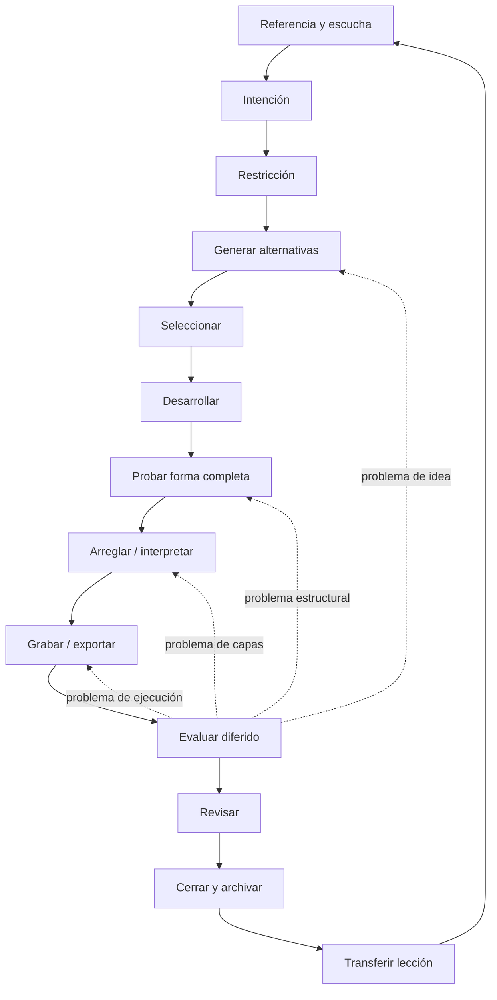

**Uso:** cuando te bloquees, señala dónde estás. No abras una etapa nueva si el problema real está dos nodos atrás.

# 3. Estado de una habilidad

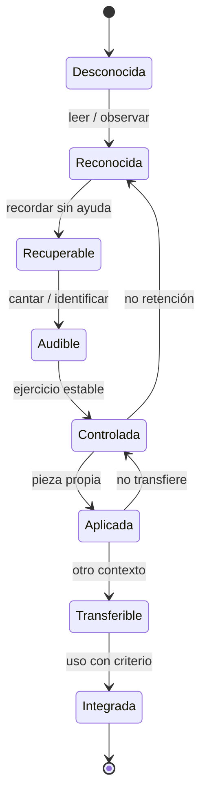

**Uso:** la regresión no es fracaso; muestra qué tipo de práctica faltó.

# 4. Sesión autorregulada

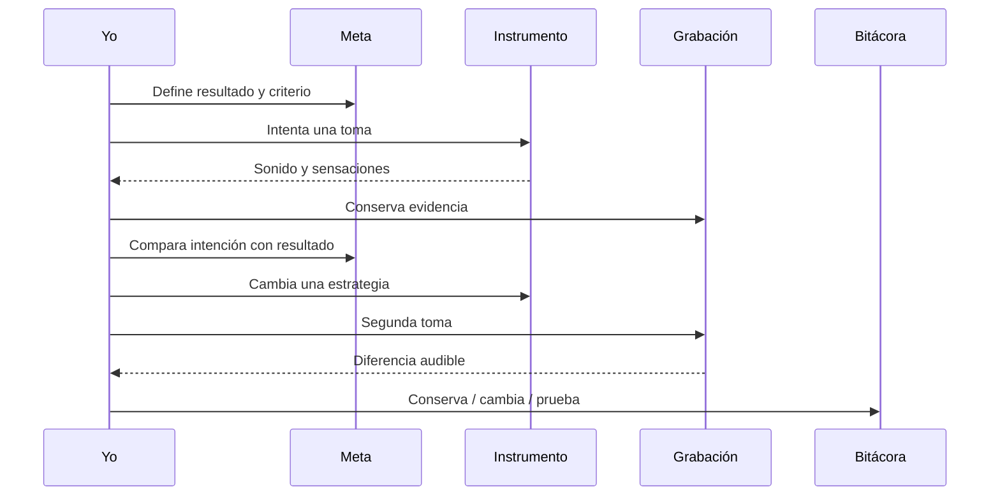

**Producto:** dos tomas comparables y una decisión.

# 5. Pirámide de composición

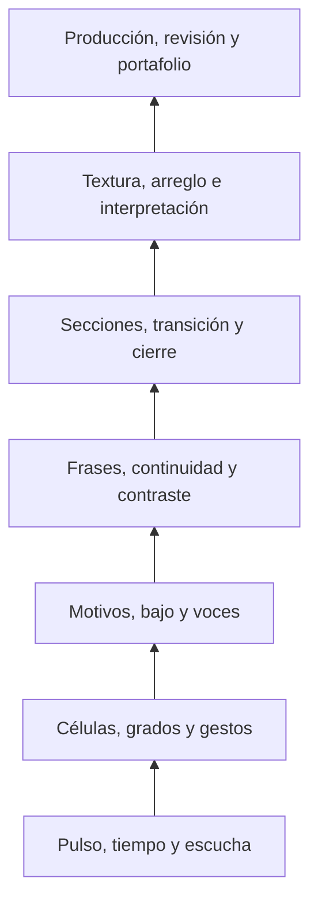

La pirámide no significa que debas “terminar” un piso para componer. Significa que un problema arriba puede originarse abajo.

# 6. Diagnóstico de una sección que no funciona

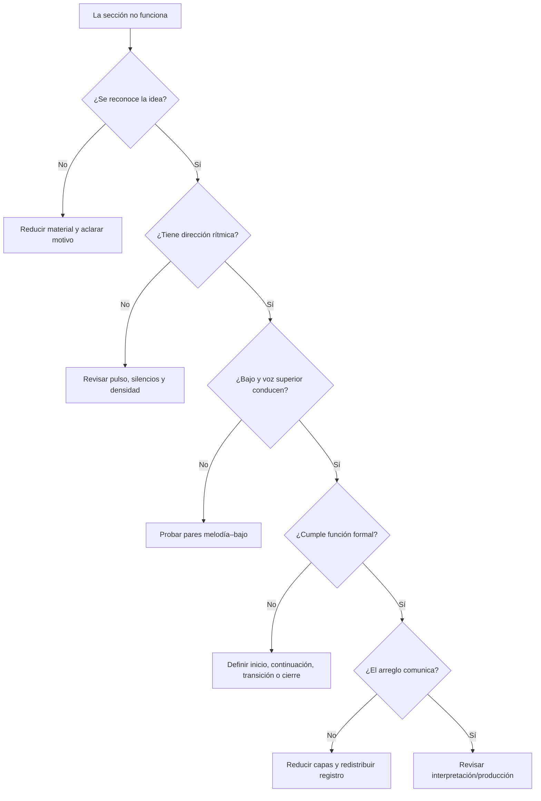

# 7. Capas de escucha

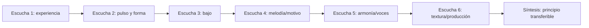

**Regla:** no transcribas todos los acordes antes de saber dónde están el pulso, el bajo y las llegadas.

# 8. Proceso de dictado melódico

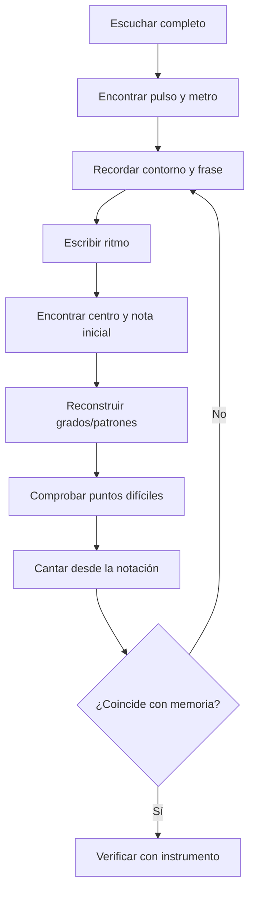

# 9. Escucha armónica por capas

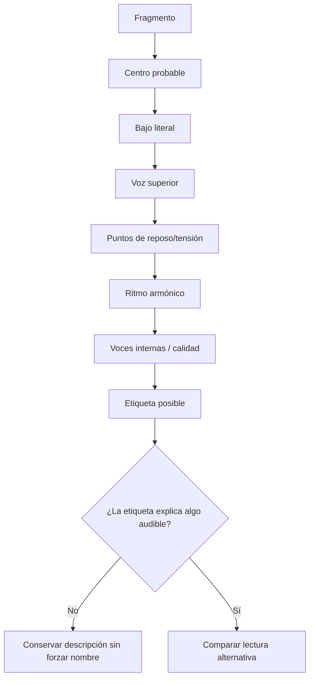

# 10. Desarrollo motívico

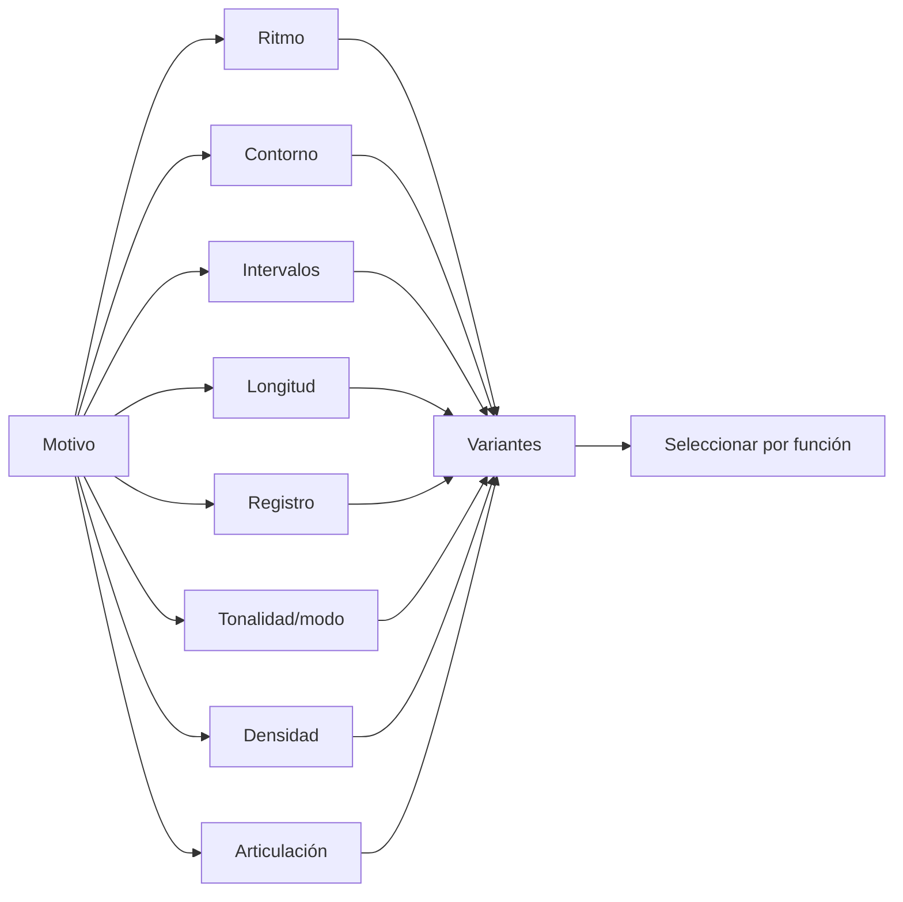

**Uso:** cambia una rama por vez antes de combinarlas.

# 11. Por qué A puede sonar final

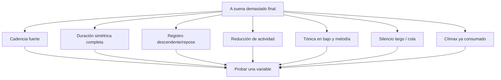

**Producto:** tres finales alternativos conservando el resto de A.

# 12. Energía formal

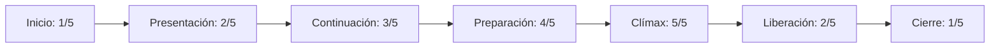

No toda pieza sigue este arco. Úsalo como modelo que puede confirmarse, invertirse o rechazarse.

# 13. Forma y variables de energía

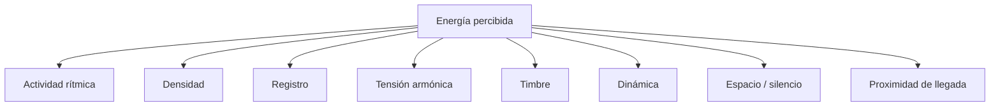

# 14. Arreglo antes que mezcla

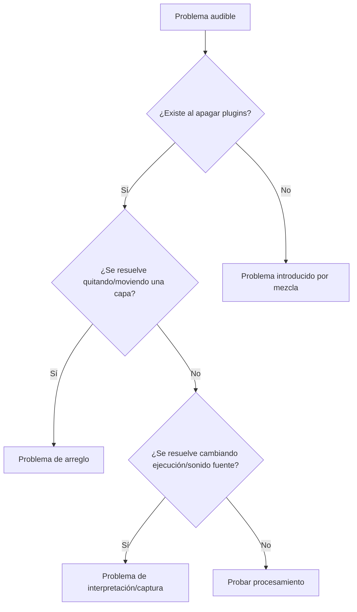

# 15. Cadena de producción

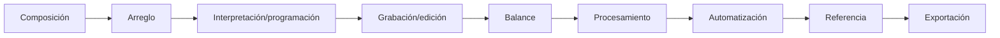

Un error temprano puede amplificarse en cada etapa. Vuelve al primer nodo donde aparece.

# 16. Feedback sin obediencia automática

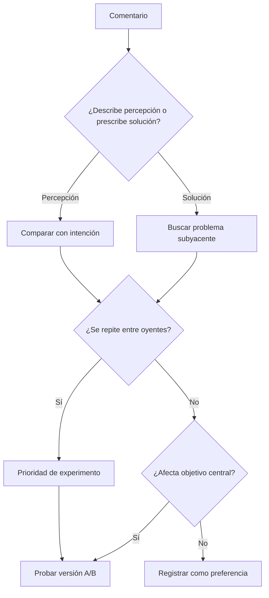

# 17. Revisión macro–meso–micro

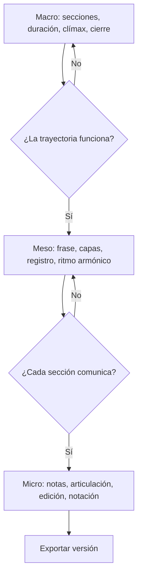

# 18. Ciclo trimestral

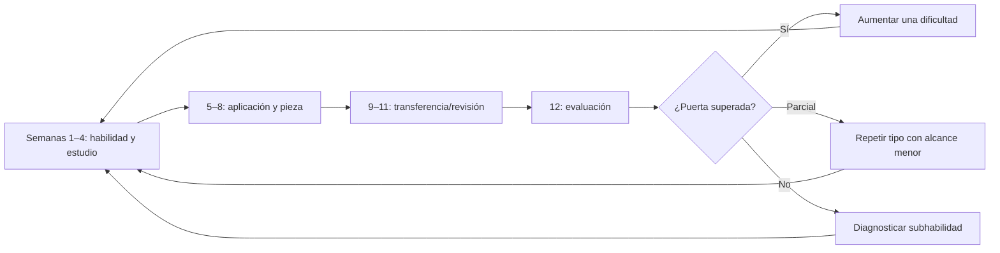

# 19. Carga mínima viable

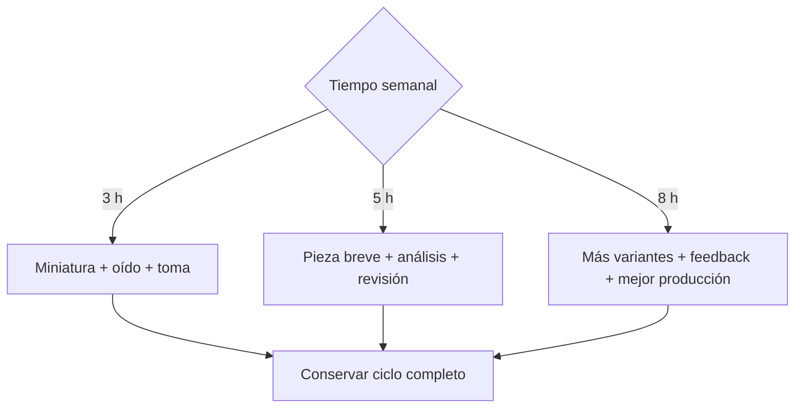

El tiempo modifica alcance, no la obligación de terminar.

# 20. Matriz de identidad artística

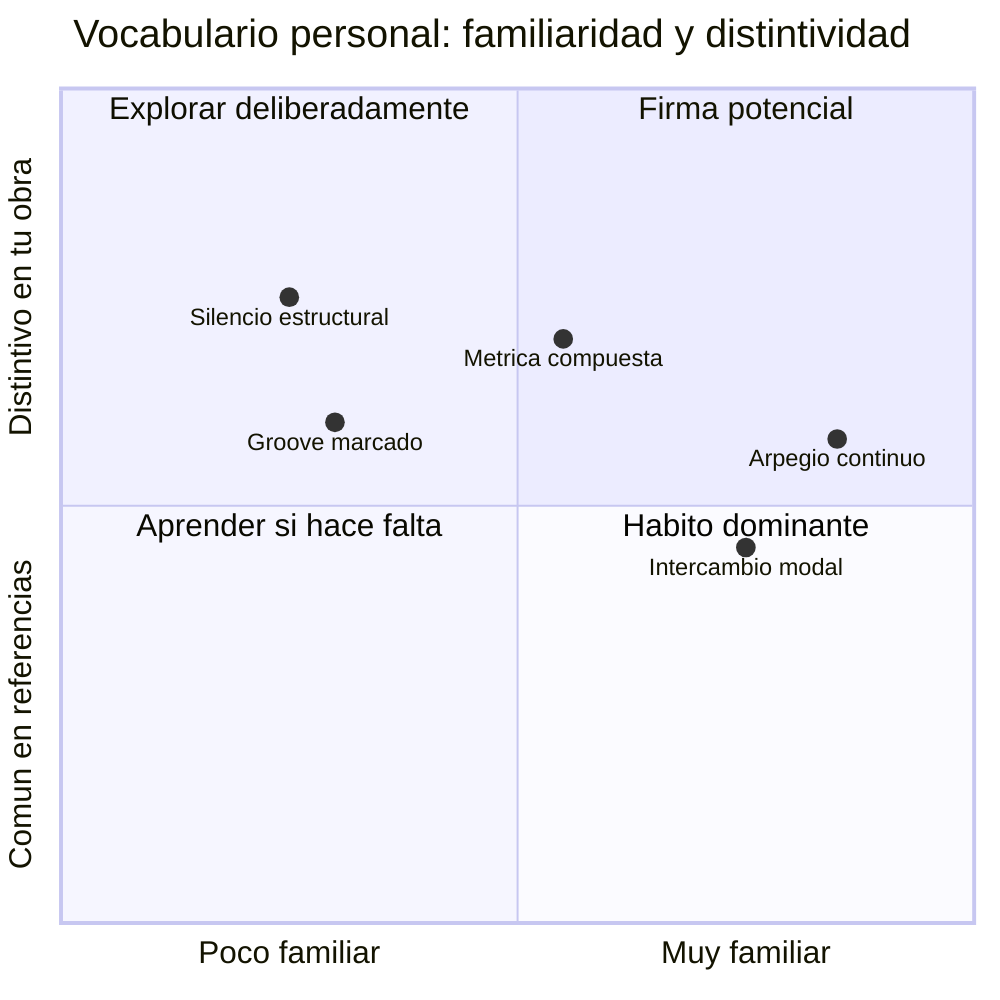

Los puntos son ejemplos basados en el diagnóstico provisional. Muévelos según tus obras, no según autopercepción solamente.

# 21. Qué medir

```mermaid
flowchart LR
    A["Exposición"] --> A1["minutos / sesiones"]
    B["Desempeño"] --> B1["toma inmediata"]
    C["Aprendizaje"] --> C1["retención diferida"]
    D["Transferencia"] --> D1["otro material/contexto"]
    E["Producción"] --> E1["piezas terminadas"]
    F["Sostenibilidad"] --> F1["dolor, fatiga, motivación"]
```

No confundas exposición con aprendizaje ni toma inmediata con retención.

# 22. Próxima acción universal

```mermaid
flowchart TD
    A["Escucha el resultado"] --> B["Describe un problema audible"] --> C["Elige una variable"] --> D["Haz un cambio mínimo"] --> E["Graba A/B"] --> F["Decide"]
```

Si no puedes formular la acción en menos de 20 minutos, el problema aún es demasiado amplio.

## Enlaces de acción

- Ritmo: [[Teoría musical/1. Curso cresciente/6. Atlas visual y laboratorios/03. Laboratorio Music ABC - Ritmo y métrica]].
- Oído/melodía: [[Teoría musical/1. Curso cresciente/6. Atlas visual y laboratorios/04. Laboratorio Music ABC - Oído, grados y melodía]].
- Armonía: [[Teoría musical/1. Curso cresciente/6. Atlas visual y laboratorios/05. Laboratorio Music ABC - Armonía y conducción]].
- Forma: [[Teoría musical/1. Curso cresciente/6. Atlas visual y laboratorios/06. Laboratorio Music ABC - Forma, transición y desarrollo]].
- Bloqueos: [[Teoría musical/1. Curso cresciente/6. Atlas visual y laboratorios/08. Diagnóstico interactivo y solución de bloqueos]].
