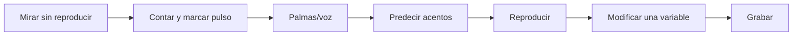

# Laboratorio Music ABC — Ritmo y métrica

> [!abstract] Objetivo
> Construir una cadena entre pulso corporal, lectura, memoria, variación y forma. Las alturas se mantienen deliberadamente simples para que puedas atender al tiempo.

## Fundamento y cautela

- La evidencia musical apoya metas específicas, feedback y evaluación diferida; no existe una secuencia rítmica universal que todos deban completar igual.
- Intercalar puede ayudar a retención y atención, pero la investigación musical es pequeña y variable. Empieza estable y alterna después. [Carter y Grahn](https://pmc.ncbi.nlm.nih.gov/articles/PMC4989027/).
- Cambiar demasiadas variables puede perjudicar componentes de aprendizaje en novatos. [Caramiaux et al.](https://pmc.ncbi.nlm.nih.gov/articles/PMC5832267/).

## Protocolo para cada ejemplo



Puntuación rápida:

- `0`: no mantengo la métrica;
- `1`: reconozco después de escuchar;
- `2`: reproduzco lento;
- `3`: leo y varío;
- `4`: lo uso en una pieza.

---

# Nivel 1 — Pulso y subdivisión

## 1. Negras: cuatro puntos de apoyo

```music-abc
X:1
T:1. Pulso de negras
M:4/4
L:1/8
Q:1/4=72
K:C
C2 C2 C2 C2 | C2 C2 C2 C2 |]
```

**Haz:** pie en cada nota; respira sin acelerar. Después cambia el tempo a 60 y 90.

## 2. Corcheas sobre el mismo pulso

```music-abc
X:2
T:2. Subdivisión en corcheas
M:4/4
L:1/8
Q:1/4=72
K:C
C C C C C C C C | C C C C C C C C |]
```

**Predice:** ¿qué notas coinciden con el pie? Marca `1 y 2 y 3 y 4 y`.

## 3. Alternancia negra–corcheas

```music-abc
X:3
T:3. Cambiar división sin perder pulso
M:4/4
L:1/8
Q:1/4=72
K:C
C2 C2 C C C C | C C C C C2 C2 | C2 C C C2 C C |]
```

**Criterio:** el pie no reacciona al número de notas.

## 4. Semicorcheas y reducción

```music-abc
X:4
T:4. Densidad creciente y decreciente
M:4/4
L:1/16
Q:1/4=68
K:C
C4 C4 C4 C4 | C2 C2 C2 C2 C2 C2 C2 C2 | C C C C C C C C C C C C C C C C | C4 C4 C4 C4 |]
```

**Forma audible:** baja densidad → media → alta → baja. Ya es una trayectoria sin armonía.

---

# Nivel 2 — Silencios, ligaduras y síncopa

## 5. Silencio en pulsos fuertes

```music-abc
X:5
T:5. Pulso interior con silencios
M:4/4
L:1/8
Q:1/4=72
K:C
C2 z2 C2 z2 | z2 C2 z2 C2 | C2 z2 z2 C2 |]
```

**Haz:** mantén el pie en todos los tiempos, incluyendo silencios.

## 6. Anticipación sencilla

```music-abc
X:6
T:6. Anticipación y síncopa
M:4/4
L:1/8
Q:1/4=72
K:C
C2 C C2 C C2 | C C2 C C2 C C | C2 z C C2 C2 |]
```

**Pregunta:** ¿qué notas ocurren entre los pulsos? Cántalas con una sílaba más brillante.

## 7. Ligadura a través del pulso

```music-abc
X:7
T:7. Duración atravesando el pulso
M:4/4
L:1/8
Q:1/4=68
K:C
C2-C C C2 C2 | C C-C2 C C2 C | C2 C-C C2 C2 |]
```

No ataques la segunda parte de una nota ligada. El pulso continúa aunque no exista nuevo ataque.

## 8. Motivo con silencio identitario

```music-abc
X:8
T:8. El silencio como parte del motivo
M:4/4
L:1/8
Q:1/4=76
K:C
C C z C C2 z2 | C C z C C2 z2 | C z C C z C C2 | C C z C C4 |]
```

**Variación:** mueve el silencio sin cambiar el número de ataques.

---

# Nivel 3 — Métrica compuesta y tresillos

## 9. Dos pulsos compuestos en 6/8

```music-abc
X:9
T:9. 6/8: dos pulsos, tres subdivisiones
M:6/8
L:1/8
Q:3/8=60
K:C
C3 C3 | C C C C C C | C2 C C2 C | C3 z3 |]
```

Marca solo dos pulsos grandes por compás. Evita sentir seis pulsos iguales.

## 10. Simple frente a compuesto

```music-abc
X:10
T:10. Contraste 3+3 y 2+2+2
M:6/8
L:1/8
Q:3/8=60
K:C
C3 C3 | C2 C2 C2 | C C C C C C | C2 C C2 C |]
```

**Escucha:** el segundo compás puede sugerir tres agrupaciones dentro del mismo total de seis corcheas.

## 11. Tresillos en 4/4

```music-abc
X:11
T:11. Tresillos contra pulso binario
M:4/4
L:1/8
Q:1/4=66
K:C
(3CCC (3CCC (3CCC (3CCC | C2 (3CCC C2 (3CCC | (3CCC C2 (3CCC C2 |]
```

**Haz:** pie en cuatro, voz en tres subdivisiones por tiempo.

---

# Nivel 4 — Métricas desiguales y agrupación

## 12. 5/8 como 2+3

```music-abc
X:12
T:12. Cinco octavos: 2+3
M:5/8
L:1/8
Q:1/8=150
K:C
C2 C3 | C2 C C C | C C C2 C | C2 z C2 |]
```

Marca acentos mentales `1–2 | 1–2–3`.

## 13. 5/8 como 3+2

```music-abc
X:13
T:13. Cinco octavos: 3+2
M:5/8
L:1/8
Q:1/8=150
K:C
C3 C2 | C C C C2 | C2 C C2 | C3 z2 |]
```

Compara 12 y 13 sin mirar títulos. ¿Cuál agrupación escuchas?

## 14. 7/8 como 2+2+3

```music-abc
X:14
T:14. Siete octavos: 2+2+3
M:7/8
L:1/8
Q:1/8=154
K:C
C2 C2 C3 | C2 C2 C C C | C C C2 C3 | C2 z2 C3 |]
```

## 15. 7/8 como 3+2+2

```music-abc
X:15
T:15. Siete octavos: 3+2+2
M:7/8
L:1/8
Q:1/8=154
K:C
C3 C2 C2 | C C C C2 C2 | C3 C C C2 | C3 z2 C2 |]
```

**Transferencia:** escribe una melodía de una sola nota que haga audible la agrupación sin acentos escritos.

---

# Nivel 5 — Motivo, transformación y forma

## 16. Motivo A y cuatro transformaciones

```music-abc
X:16
T:16. Motivo rítmico y transformaciones
M:4/4
L:1/8
Q:1/4=74
K:C
% A
C C C2 z C C2 |
% A1: desplazado
z C C C2 z C C |
% A2: aumentado
C2 C2 C4 |
% A3: fragmentado
C C C2 z4 |
% A4: liquidado
C C z2 C4 |]
```

**Análisis:** nombra qué se conserva en cada compás.

## 17. Forma A–A’–B–A’’

```music-abc
X:17
T:17. Forma breve con identidad rítmica
M:4/4
L:1/8
Q:1/4=76
K:C
P:A
C C z C C2 z2 | C C z C C4 |
P:A'
C C z C C C C2 | z C C z C4 |
P:B
C2 C2 C C C C | C C C C z2 C2 |
P:A''
C C z C C2 z2 | C C z C C4 |]
```

**Pregunta:** ¿B contrasta por ritmo, densidad o ambos?

## 18. Arco de energía por densidad

```music-abc
X:18
T:18. Arco de energía sin cambiar altura
M:4/4
L:1/16
Q:1/4=72
K:C
C4 z4 C4 z4 |
C4 C4 C4 C4 |
C2 C2 C2 C2 C2 C2 C2 C2 |
C C C C C C C C C C C C C C C C |
C2 C2 C2 C2 C2 C2 C2 C2 |
C4 C4 C4 C4 |
C4 z4 C8 |]
```

**Composición:** reescribe el arco usando silencios en vez de número de ataques.

---

# Pruebas a ciegas

<details>
<summary>Prueba 1 — No abras hasta intentar</summary>

Escucha los ejemplos 12 y 13 con los ojos cerrados. Anota si oyes `2+3` o `3+2`. Luego verifica contando corcheas.

</details>

<details>
<summary>Prueba 2 — Respuesta sugerida</summary>

En el ejemplo 17, B cambia principalmente densidad y distribución de ataques. No hace falta cambiar altura para establecer contraste formal.

</details>

<details>
<summary>Prueba 3 — Diagnóstico</summary>

Si puedes imitar después de escuchar pero no leer antes de escuchar, la brecha es símbolo → sonido. Si puedes leer pero pierdes el pie, la brecha es jerarquía métrica/pulso interior. Si ejecutas bien hoy pero no mañana, trabaja recuperación diferida.

</details>

# Generador manual de variaciones

Tira un dado físico o elige un número:

| Número | Modificación |
|---:|---|
| 1 | desplaza todo una corchea |
| 2 | convierte un ataque en silencio |
| 3 | aumenta una duración y compensa otra |
| 4 | fragmenta después del segundo pulso |
| 5 | cambia agrupación sin cambiar total |
| 6 | conserva ritmo y cambia dinámica/articulación al tocar |

## Registro

```markdown
### Ejemplo trabajado
- Número:
- Tempo inicial/final:
- Pude predecir: sí/parcial/no
- Pude palmear sin audio: sí/parcial/no
- Error recurrente:
- Variación creada:
- Archivo de audio:
- Aplicación en pieza:
```

# Puerta de salida

- [ ] Mantengo pulso mientras cambia subdivisión.
- [ ] Leo silencios sin detener el pulso.
- [ ] Distingo 6/8 de agrupación binaria simple.
- [ ] Produzco 2+3 y 3+2 sin depender de acentos escritos.
- [ ] Creo cuatro transformaciones de una célula.
- [ ] Construyo 30–45 segundos con forma audible.
- [ ] Retengo una célula y la reproduzco al día siguiente.

Después utiliza ese material en [[Teoría musical/1. Curso cresciente/3. Proyectos/Proyecto 01 - Microcomposición rítmica]] o pasa al [[Teoría musical/1. Curso cresciente/6. Atlas visual y laboratorios/04. Laboratorio Music ABC - Oído, grados y melodía]].
