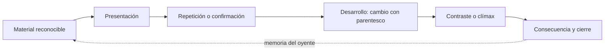
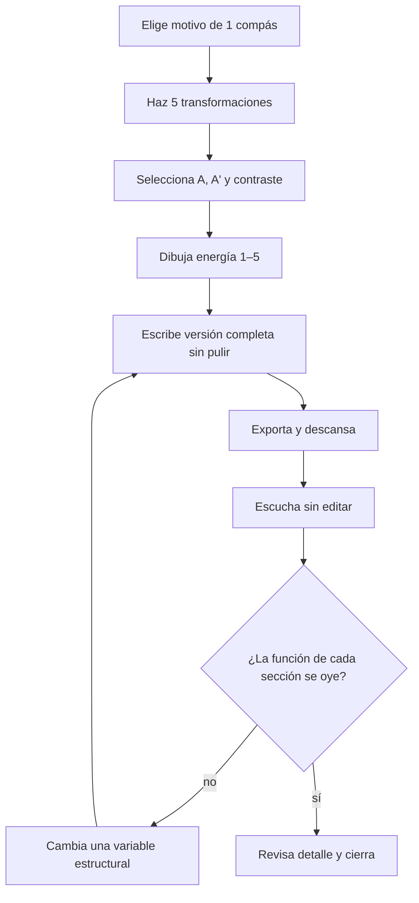

# Laboratorio Music ABC — Forma, transición y desarrollo

> [!abstract] Propósito
> Aprender forma como **cambio perceptible a lo largo del tiempo**, no como una lista de letras. Cada ejemplo se escucha, se predice, se modifica y termina en una miniatura propia.

## Qué está respaldado y qué es modelo de oficio

- 🟢 **Directo en educación compositiva:** el aprendizaje mejora cuando componer incluye modelos, andamiaje, conversación sobre decisiones, feedback y revisión; la literatura es más pequeña y cualitativa que la de práctica instrumental. Véanse [Mielke y Andrews (2023)](https://journals.sagepub.com/doi/full/10.1177/1321103X221114613), [Major y Cottle (2010)](https://www.cambridge.org/core/journals/british-journal-of-music-education/article/abs/talking-about-composing-in-secondary-school-music-lessons/E1817742A6B5ABD3719434F1BCD6A6E0) y *The Oxford Handbook of Music Composition Pedagogy*.
- 🟡 **Transferido:** predecir, recuperar sin mirar y comparar alternativas viene de ciencia general del aprendizaje; es plausible y útil, pero no cada ejercicio de aquí ha sido probado como paquete.
- 🔵 **Modelo operativo:** las categorías motivo, frase, periodo, sentencia, puente, clímax y cierre vienen de teoría y pedagogía de composición —Schoenberg, Caplin, Green, Berry, Hepokoski/Darcy—, no son leyes cognitivas universales.



## Protocolo de laboratorio

Para cada ejemplo:

1. Mira solo el título y predice qué cambiará.
2. Reproduce la partitura; haz clic para pausar/reanudar y doble clic para reiniciar.
3. Canta el elemento que permanece.
4. Nombra el cambio audible sin recurrir todavía a la etiqueta.
5. Copia el bloque y altera una sola variable.
6. Escúchalo de nuevo al menos diez minutos después y decide si la función formal sigue clara.

## 1. Identidad: el motivo mínimo

```music-abc
X:1
T:Motivo A — una identidad breve
M:4/4
L:1/4
Q:1/4=84
K:C
"I" C D E G | "I" C D E G |
```

El parentesco no exige repetición literal. Prueba reconocer `A` en las siguientes versiones.

## 2. Variación: mismo ritmo, otro final

```music-abc
X:2
T:A prima — conserva el gesto, cambia el destino
M:4/4
L:1/4
Q:1/4=84
K:C
C D E G | C D F E |
```

## 3. Secuencia: trasladar la misma relación

```music-abc
X:3
T:Secuencia ascendente
M:4/4
L:1/4
Q:1/4=84
K:C
C D E G | D E F A | E F G B | G2 E2 |
```

Pregunta: ¿en qué momento la previsibilidad de la secuencia pide interrupción?

## 4. Fragmentación: reducir antes del cambio

```music-abc
X:4
T:Fragmentación de cuatro a dos notas
M:4/4
L:1/4
Q:1/4=92
K:C
C D E G | C D E G | C D C D | D E D E | E4 |
```

## 5. Diminución: misma silueta, más velocidad

```music-abc
X:5
T:Diminución rítmica
M:4/4
L:1/8
Q:1/4=80
K:C
C2 D2 E2 G2 | C D E G C D E G | A2 G2 E2 D2 | C8 |
```

## 6. Aumentación: la identidad se vuelve apoyo

```music-abc
X:6
T:Aumentación rítmica
M:4/4
L:1/4
Q:1/4=72
K:C
C D E G | C2 D2 | E2 G2 | C4 |
```

## 7. Inversión de contorno

```music-abc
X:7
T:Original e inversión aproximada
M:4/4
L:1/4
Q:1/4=84
K:C
"Original" C D E G | "Inversión" G F E C | "Síntesis" C D F E | C4 |
```

> [!question] Recuperación
> Sin reproducir, escribe cuáles variables permanecieron en los ejemplos 2–7: ritmo, contorno, intervalos, longitud, armonía, registro o función.

## 8. Antecedente y consecuente

```music-abc
X:8
T:Periodo de ocho compases
M:4/4
L:1/4
Q:1/4=80
K:C
"Antecedente" C D E G | A G E2 | F E D G | D4 |
"Consecuente" C D E G | A G E2 | F E D B | C4 |
```

La pregunta no es solo “¿hay 4 + 4?”, sino: ¿el primer final deja deuda y el segundo la resuelve?

## 9. Sentencia: presentar, continuar, cadenciar

```music-abc
X:9
T:Sentencia simplificada
M:4/4
L:1/4
Q:1/4=88
K:C
"Idea" C D E G | "Repetición" C D E G |
"Continuación" E F G A | F G A B | A G F E | G F E D |
"Cadencia" F E D B | C4 |
```

## 10. A–A'–B–A: memoria y contraste

```music-abc
X:10
T:Forma breve A A prima B A
M:4/4
L:1/4
Q:1/4=90
K:C
"A" C D E G | E D C2 |
"A'" C D F A | G E C2 |
"B" A A G F | E F D G |
"A" C D E G | E D C2 |
```

## 11. Contraste de modo sin perder el ritmo

```music-abc
X:11
T:Contraste mayor–menor con célula común
M:4/4
L:1/4
Q:1/4=78
K:C
"A mayor" C D E G | E D C2 |
[K:Cm] "B menor" C D _E G | _A G F2 |
[K:C] "A regreso" C D E G | E D C2 |
```

## 12. Transición por dominante

```music-abc
X:12
T:Puente que acumula dirección hacia G
M:4/4
L:1/4
Q:1/4=92
K:C
"A" C D E G | E D C2 |
"Puente" F G A B | A B c A | G A B ^c | d4 |
[K:G] "B" B A G D | E D G2 |
```

## 13. Transición por nota común

```music-abc
X:13
T:E como bisagra entre C y A menor
M:4/4
L:1/4
Q:1/4=76
K:C
"C mayor" C E G E | D E C2 |
"Bisagra" E4 | E4 |
[K:Am] "A menor" A B c E | d c A2 |
```

## 14. Transición por fragmentación y aceleración

```music-abc
X:14
T:El motivo se comprime antes de B
M:4/4
L:1/8
Q:1/4=88
K:C
"A" C2 D2 E2 G2 | C2 D2 E2 G2 |
"Puente" C2 D2 C2 D2 | C D C D E F G A |
"B" B2 A2 G2 E2 | F2 E2 D4 |
```

## 15. Clímax por registro

```music-abc
X:15
T:La misma idea ocupa cada vez más altura
M:4/4
L:1/4
Q:1/4=84
K:C
C D E G | E D C2 | E F G B | A G E2 | G A B d | c B G2 | c d e g | e d c2 |
```

## 16. Clímax por densidad a dos voces

```music-abc
X:16
T:La segunda voz aparece como aumento de energía
M:4/4
L:1/4
Q:1/4=88
K:C
V:U clef=treble name="Melodía"
V:L clef=bass name="Bajo"
[V:U] C D E G | E D C2 | E F G A | G F E2 |
[V:L] z4 | z4 | C,2 F,2 | G,2 C,2 |
```

## 17. Cierre abierto y cierre cerrado

```music-abc
X:17
T:Dos finales para la misma frase
M:4/4
L:1/4
Q:1/4=80
K:C
"Inicio" C D E G | A G E2 |
"Abierto" F E D G | D4 |
"Reinicio" C D E G | A G E2 |
"Cerrado" F E D B | C4 |
```

## 18. Rondo mínimo: A–B–A–C–A

```music-abc
X:18
T:Rondo miniatura
M:4/4
L:1/4
Q:1/4=96
K:C
"A" C D E G | E D C2 |
"B" A G F E | D E G2 |
"A" C D E G | E D C2 |
"C" E E G A | c B G2 |
"A" C D E G | E D C2 |
```

## Laboratorio de decisiones: tres puentes para el mismo A y B

Usa como extremos:

```music-abc
X:19
T:Extremos fijos del experimento
M:4/4
L:1/4
Q:1/4=86
K:C
"A" C D E G | E D C2 |
"B" A c B A | G F E2 |
```

Crea tres versiones de dos compases entre ellos:

| Puente | Solo puedes cambiar | Pregunta perceptiva |
|---|---|---|
| 1 | fragmentación rítmica | ¿Aumenta la urgencia? |
| 2 | bajo y armonía | ¿El destino parece inevitable? |
| 3 | registro y densidad | ¿Se siente crecimiento sin acordes nuevos? |

No elijas por complejidad. Haz una escucha ciega de las tres exportaciones y puntúa:

- claridad del cambio, 1–5;
- parentesco con A, 1–5;
- preparación de B, 1–5;
- sorpresa útil, 1–5.

## Generador de una miniatura de 60–90 segundos



Restricciones recomendadas:

- un solo motivo generador;
- máximo cuatro acordes o un pedal;
- entre tres y cinco secciones funcionales;
- un clímax localizable;
- un final deliberadamente abierto o cerrado;
- una única dificultad nueva.

## Prueba de salida

- [ ] Reconozco auditivamente repetición, variación, secuencia, fragmentación y contraste.
- [ ] Puedo crear tres transiciones funcionalmente distintas entre el mismo A y B.
- [ ] Puedo dibujar la energía de una referencia y de una pieza propia.
- [ ] Terminé una miniatura de 60–90 segundos usando un motivo principal.
- [ ] Otra persona puede señalar cambio, clímax y final sin ver mi mapa.
- [ ] Después de 48 horas todavía puedo explicar qué permanece y qué cambia.

Continúa con [[Teoría musical/1. Curso cresciente/6. Atlas visual y laboratorios/07. Experimentos personales N-of-1]] o aplica el laboratorio en [[Teoría musical/1. Curso cresciente/3. Proyectos/Proyecto 04 - Forma, contraste y puente]].

