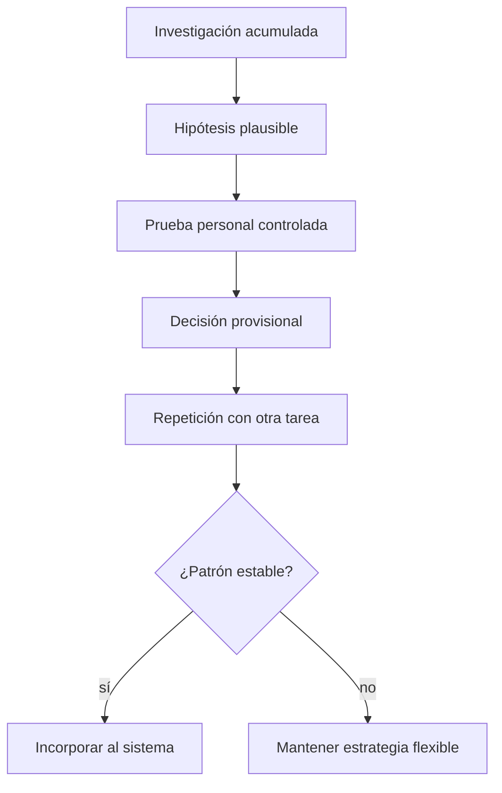
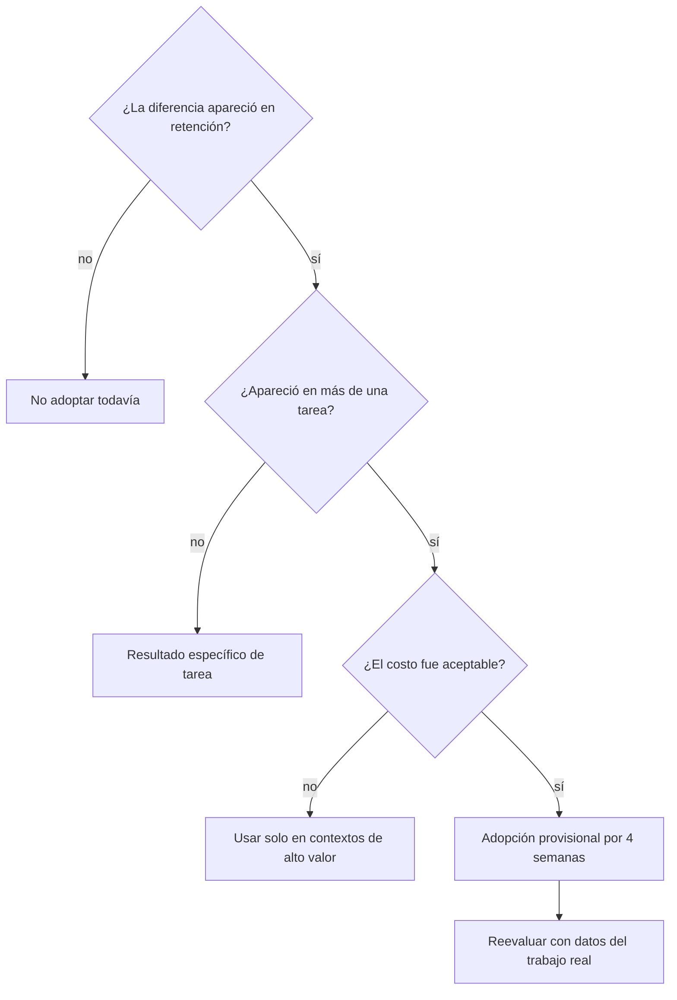

# Experimentos personales N-of-1

> [!abstract] Propósito
> Convertir recomendaciones generales en decisiones personales. Un experimento N-of-1 compara estrategias **en ti**, con tareas repetibles, medidas previas y criterios de decisión definidos antes de mirar el resultado.

## Advertencia epistemológica

Un experimento personal puede responder “¿qué me funciona mejor, en estas condiciones y para esta tarea?”. No demuestra qué funciona para todas las personas ni separa perfectamente expectativa, fatiga, dificultad y aprendizaje previo.

La jerarquía correcta es:



No uses estos protocolos para experimentar con dolor, exposición sonora riesgosa, privación de sueño ni sobrecarga. Si aparece dolor, entumecimiento, pérdida de control o zumbido persistente, detén la sesión y busca evaluación profesional pertinente.

## Principios de diseño

### 1. Cambia una variable principal

Si comparas sesión matutina con nocturna, instrumento distinto, pieza distinta y duración distinta, no sabrás qué produjo la diferencia.

### 2. Usa tareas equivalentes, no la misma tarea aprendida

Necesitas pares de dificultad aproximada: dos ritmos, dos melodías, dos pasajes o dos microencargos. Si A siempre ocurre primero, el orden puede confundirse con el tratamiento.

### 3. Alterna el orden

Para cuatro ensayos usa `ABBA` o `BAAB`; para ocho, lanza una moneda antes de cada par y conserva cantidades similares. No rediseñes el orden después de ver resultados.

### 4. Mide retención y transferencia

La fluidez al final de la sesión puede ser engañosa. Añade una prueba posterior y otra en material nuevo.

| Momento | Qué informa |
|---|---|
| Antes | dificultad inicial y experiencia previa |
| Inmediatamente después | adquisición y sensación de fluidez |
| 24–72 horas después | retención |
| Tarea relacionada nueva | transferencia |

### 5. Conserva evidencia

Audio, MIDI, partitura, tempo, número de intentos, errores observables y una escala subjetiva breve. No confíes solo en “sentí que salió mejor”.

## Plantilla maestra

Copia esta sección en una nota nueva.

```markdown
---
tipo: experimento
estado: planeado
fecha_inicio:
fecha_cierre:
habilidad_principal:
condicion_a:
condicion_b:
resultado:
tags:
  - curso-musica/experimento
---

# Experimento — pregunta concreta

## Pre-registro
- Pregunta:
- Hipótesis y por qué:
- Variable A:
- Variable B:
- Qué mantendré constante:
- Tareas equivalentes:
- Orden previsto:
- Medida primaria:
- Medidas secundarias:
- Momento de retención:
- Criterio de decisión:
- Condición para detener:

## Datos
| Ensayo | Fecha | Orden | Tarea | Condición | Pretest | Postest | Retención | Transferencia | Esfuerzo 1–5 | Archivo |
|---:|---|---|---|---|---:|---:|---:|---:|---:|---|

## Interpretación
- Resultado principal:
- Explicaciones alternativas:
- ¿Se replicó en más de una tarea?:
- Decisión provisional:
- Fecha de revalidación:
```

## Medidas musicales observables

Elige **una primaria** y máximo tres secundarias.

| Habilidad | Medida primaria posible | Secundarias útiles |
|---|---|---|
| Ritmo | ataques correctos / ataques totales | desviación del pulso, reinicios, tempo |
| Lectura | compases correctos en primera toma | pausas, autocorrecciones, continuidad |
| Melodía | grados o notas correctas | contorno, ritmo, número de escuchas |
| Memoria | compases recuperados sin ayuda | tiempo hasta primera pista, seguridad |
| Técnica | tempo máximo con criterio estable | tensión 1–5, errores por toma |
| Composición | oyentes que detectan función formal | tiempo de decisión, opciones generadas |
| Revisión | problemas detectados y corregidos | acuerdo con escucha posterior, tiempo |
| Oído armónico | bajo/función/cadencia correctos | latencia, confianza calibrada |

La “calidad de composición” completa es difícil de reducir a un número. Conviene medir una función concreta: reconocimiento del motivo, localización del clímax, claridad del contraste o recuerdo posterior.

## Experimento 1 — Recuperar vs releer

**Base:** la práctica de recuperación tiene apoyo robusto en aprendizaje verbal, y es razonable transferirla a etiquetas, formas y conceptos; la transferencia a ejecución musical compleja no debe darse por automática. Referencias: [Roediger y Karpicke (2006)](https://pubmed.ncbi.nlm.nih.gov/16507066/) y el análisis de evidencia en [[Teoría musical/1. Curso cresciente/6. Atlas visual y laboratorios/01. Auditoría científica de segunda edición]].

**Pregunta:** ¿recordar y reconstruir sin mirar produce más retención que releer la misma nota durante igual tiempo?

- A: relee cinco minutos y estudia un ejemplo.
- B: intenta explicar/cantar/escribir durante cuatro minutos sin mirar; corrige un minuto.
- Material: pares de conceptos semejantes, como cadencia auténtica/plagal o dos patrones métricos.
- Primaria: porcentaje de elementos correctos 48 horas después.
- Transferencia: identifica el principio en una obra o ejemplo no estudiado.
- Decisión: incorpora B si mejora retención sin empeorar claramente transferencia; usa releer solo como corrección.

## Experimento 2 — Bloques vs intercalado

**Base:** Carter y Grahn encontraron ventaja de práctica intercalada para retención de tres pasajes de clarinete en una muestra pequeña, N=10; la práctica variable en piano también sugiere beneficios bajo ciertas condiciones. No implica que todo principiante deba cambiar continuamente de tarea. Fuentes: [Carter y Grahn (2016)](https://pmc.ncbi.nlm.nih.gov/articles/PMC4989027/) y [Caramiaux et al. (2018)](https://pmc.ncbi.nlm.nih.gov/articles/PMC5832267/).

**Pregunta:** ¿intercalar tres microhabilidades mejora la retención comparado con terminarlas por bloques?

- A: `AAAA BBBB CCCC`.
- B: `ABC ABC ABC ABC`.
- Mantén iguales minutos e intentos.
- Usa tres pasajes de 2–4 compases con dificultad parecida.
- Primaria: primera toma 24 horas después.
- Registra costo: frustración, tiempo de reorientación y deterioro técnico.
- Si B sobrecarga, prueba bloques cortos `AABB CCAA BBCC`, no una dicotomía extrema.

## Experimento 3 — Grabación vs memoria inmediata

**Base:** la autoevaluación cambia al escuchar una grabación; estudios en educación musical han observado diferencias o mejoras en precisión de autoevaluación mediante audio o video. Fuentes: [Silveira y Gavin (2016)](https://journals.sagepub.com/doi/abs/10.1177/0305735615596375) y [Boucher, Dube y Creech (2020)](https://journals.sagepub.com/doi/abs/10.1177/0305735619842374).

**Pregunta:** ¿qué problemas detecto solo mediante grabación?

- Después de una toma, escribe tres observaciones sin reproducirla.
- Escucha audio sin editar y añade otras tres.
- Al día siguiente repite la escucha y clasifica cada observación: persistente, exagerada, nueva.
- Primaria: problemas persistentes detectados en cada condición.
- Transferencia: ¿la revisión basada en esos problemas mejora una toma ciega posterior?

## Experimento 4 — Revisión inmediata vs diferida

**Base:** el retraso puede reducir habituación y sesgo de intención, pero “revisar al día siguiente” es una regla de trabajo, no un intervalo óptimo universal demostrado para composición.

**Pregunta:** ¿mis decisiones estructurales son mejores después de un intervalo?

- Crea dos bocetos comparables.
- A: evalúa y revisa inmediatamente.
- B: exporta, no edites y revisa 24 horas después.
- Dos días más tarde haz una escucha ciega de ambas versiones.
- Primaria: cantidad de revisiones que aún consideras correctas.
- Secundaria: tiempo invertido, cambios revertidos y claridad formal percibida.

## Experimento 5 — Práctica física vs física + imaginación

**Base:** la práctica mental puede activar representaciones auditivo-motoras y complementar la práctica física, pero generalmente no sustituye por completo la información sensorial y motora real. Fuentes: [Bernardi et al. (2013)](https://pubmed.ncbi.nlm.nih.gov/23970859/) y [Brown y Palmer (2012)](https://pubmed.ncbi.nlm.nih.gov/22271265/).

**Pregunta:** ¿insertar ensayo mental mejora memoria o reduce intentos físicos?

- A: diez minutos de ejecución física.
- B: seis minutos físicos + cuatro minutos de imaginación auditiva y motora específica.
- Imaginación específica: oír cada nota internamente, sentir digitación y anticipar el siguiente gesto; no “pensar vagamente en la pieza”.
- Primaria: primera toma de memoria 24 horas después.
- No uses imaginación para atravesar dolor ni como prueba de recuperación física.

## Experimento 6 — Distribución de sesiones

**Base:** el espaciado tiene apoyo amplio, pero los intervalos y la tarea importan. En música existen resultados positivos y también estudios sin ventaja en ventanas cortas; por eso se debe probar, no absolutizar. Fuentes: [Cepeda et al. (2006)](https://pubmed.ncbi.nlm.nih.gov/16719566/), [Simone y Grafton (2021)](https://pubmed.ncbi.nlm.nih.gov/34894323/) y [Cash et al. (2017)](https://pmc.ncbi.nlm.nih.gov/articles/PMC5553926/).

**Pregunta:** para 40 minutos totales, ¿qué distribución retiene mejor?

- A: una sesión de 40 minutos.
- B: cuatro sesiones de 10 minutos durante dos días.
- Tareas: pasajes o dictados equivalentes.
- Primaria: retención después de 48 horas sin calentamiento específico.
- Secundaria: errores por minuto, tensión, tiempo de volver al contexto.

## Experimento 7 — Descanso breve dentro de la sesión

**Base:** existen hallazgos de mejora durante descansos en tareas motoras, pero investigaciones recientes cuestionan que las aparentes ganancias micro-offline siempre representen consolidación estable. Fuentes: [Brawn et al. (2010)](https://pubmed.ncbi.nlm.nih.gov/19673774/) y [Das et al. (2025)](https://pubmed.ncbi.nlm.nih.gov/41150724/).

**Pregunta:** ¿las pausas mejoran el siguiente bloque y la retención, o solo el rendimiento inmediato?

- A: 20 minutos continuos.
- B: cuatro bloques de 5 minutos con 60–90 segundos sin tocar.
- Durante la pausa no practiques encubiertamente; respira, cambia postura y anota una predicción.
- Primaria: primera toma al día siguiente.
- Secundaria: error en el primer intento posterior a cada descanso y fatiga 1–5.

## Experimento 8 — Objetivo de proceso vs “tocar mejor”

**Base:** estudios de Duke, Miksza y McPherson apoyan atender a estrategias y autorregulación, no solo al tiempo acumulado. Fuentes: [Duke, Simmons y Cash (2009)](https://journals.sagepub.com/doi/10.1177/0022429408328851), [Miksza (2015)](https://journals.sagepub.com/doi/10.1177/0305735613500832) y [McPherson et al. (2019)](https://journals.sagepub.com/doi/10.1177/0305735617731614).

**Pregunta:** ¿un objetivo observable reduce repeticiones improductivas?

- A: “practicar/tocar mejor este pasaje”.
- B: “hacer tres tomas a 72 bpm con ataques alineados y sin detener el pulso; después comparar compás 3”.
- Primaria: intentos hasta alcanzar el criterio.
- Secundarias: repeticiones idénticas, cambios de estrategia, calidad al día siguiente.

## Experimento 9 — Restricción compositiva vs libertad total

**Base:** la creatividad depende de generar y seleccionar; las restricciones pueden reducir el espacio de búsqueda, pero la “cantidad óptima” no es universal. Este protocolo es de oficio informado por investigación de creatividad, no un ensayo musical definitivo.

**Pregunta:** ¿una restricción produce más opciones útiles por minuto?

- A: compón libremente ocho compases.
- B: usa un motivo, tres alturas, un acorde/pedal y una transformación obligatoria.
- Tiempo: 12 minutos cada condición, orden alternado.
- Primaria: número de opciones que al día siguiente conservas como utilizables.
- Secundarias: identidad, sorpresa, bloqueo y tiempo hasta primera idea.
- Repite con restricciones distintas; una restricción mala no invalida la estrategia completa.

## Experimento 10 — Referencia analizada vs escucha casual

**Base:** modelar, comparar y explicar decisiones forma parte del andamiaje compositivo; la evidencia pedagógica favorece procesos explícitos y feedback, aunque no fija un protocolo único.

**Pregunta:** ¿extraer un principio de una referencia mejora su transferencia a una pieza propia?

- A: escucha una referencia dos veces y compón.
- B: dibuja forma, canta motivo/bajo, identifica una transformación y formula un principio antes de componer.
- Evita copiar alturas, progresión completa, instrumentación y tempo a la vez.
- Primaria: un oyente o tú 48 horas después puede señalar el principio transferido.
- Secundaria: semejanza superficial indeseada.

## Experimento 11 — Oído antes del instrumento

**Base:** la integración auditivo-motora es central para músicos; anticipar auditivamente puede ser útil, pero este protocolo no afirma que “cantar siempre primero” sea superior para toda tarea.

**Pregunta:** ¿cantar o imaginar antes de buscar reduce el ensayo aleatorio?

- A: encuentra directamente en el instrumento una melodía escuchada.
- B: canta grados/contorno, marca pulso y luego encuentra las notas.
- Primaria: número de ataques erróneos antes de completar la melodía.
- Secundarias: notas correctas, tiempo total y capacidad de transponer.

## Experimento 12 — Mezclar al construir vs separar composición y mezcla

**Base:** este es un experimento de flujo de trabajo; no existe una regla científica universal que obligue a separar etapas.

**Pregunta:** ¿separar decisiones compositivas de decisiones de sonido ayuda a terminar la estructura?

- A: permite editar plugins, timbre y mezcla mientras compones.
- B: usa paleta provisional fija hasta cerrar forma; mezcla después.
- Primaria: minutos hasta una versión escuchable de principio a fin.
- Secundarias: revisiones estructurales, fatiga decisional, calidad del arreglo al día siguiente.

## Lectura de resultados sin autoengaño



Evita estas conclusiones:

- “B ganó una vez, por tanto es mi estilo de aprendizaje”.
- “Se sintió más difícil, por tanto aprendí más”. La dificultad deseable puede ayudar, pero dificultad sin información también desperdicia práctica.
- “A fue más rápido al final de la sesión, por tanto retiene mejor”.
- “No hubo diferencia” cuando las tareas eran demasiado fáciles, las medidas tenían techo o solo hubo un ensayo.
- “La ciencia prueba mi rutina” cuando la rutina combina diez variables.

## Calendario recomendado de 12 semanas

No ejecutes todos a la vez.

| Semanas | Experimento | Razón |
|---:|---|---|
| 1–2 | Objetivo observable vs vago | mejora la calidad de cualquier sesión posterior |
| 3–4 | Grabación vs memoria | calibra autoevaluación |
| 5–6 | Recuperar vs releer | comprueba aprendizaje conceptual y auditivo |
| 7–8 | Bloques vs intercalado | ajusta organización de habilidades |
| 9–10 | Revisión inmediata vs diferida | mejora composición y edición |
| 11–12 | Restricción vs libertad | personaliza generación de ideas |

Al terminar, resume solo reglas que se hayan repetido. Una conclusión útil suena así:

> “En dos pares de melodías y dos de ritmos, la recuperación con corrección produjo mejor retención a 48 horas; la usaré al inicio de tres sesiones semanales y volveré a medir en seis semanas.”

No así:

> “Soy una persona de recuperación espaciada.”

## Puerta de salida

- [ ] He completado al menos dos comparaciones con pre-registro.
- [ ] Medí retención, no solo rendimiento inmediato.
- [ ] Guardé audio o datos observables.
- [ ] Puedo distinguir hallazgo científico, transferencia y decisión personal.
- [ ] Convertí un resultado repetido en una regla provisional.
- [ ] Descarté o suavicé una regla que mis datos no apoyaron.

Siguiente: [[Teoría musical/1. Curso cresciente/6. Atlas visual y laboratorios/08. Diagnóstico interactivo y solución de bloqueos]].

