# Diagnóstico interactivo y solución de bloqueos

> [!abstract] Regla central
> No repitas un intento fallido sin cambiar hipótesis, escala, información o estrategia. Primero clasifica el problema; después selecciona la intervención más pequeña que pueda producir evidencia.

## Diagnóstico de 90 segundos

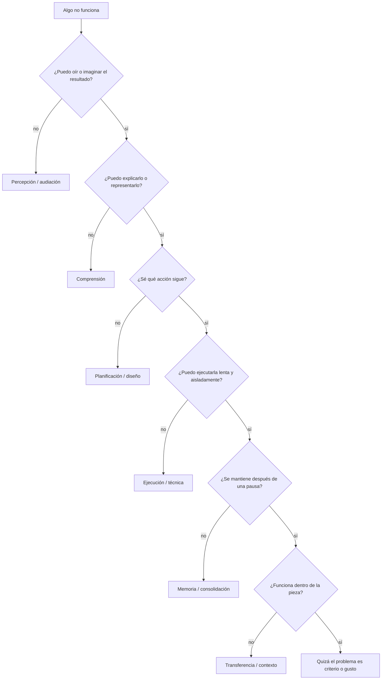

| Categoría | Señal típica | Primera intervención |
|---|---|---|
| Percepción | no distingues dos opciones al oírlas | contraste exagerado + cantar/señalar |
| Comprensión | reconoces el efecto, no sabes reconstruirlo | reducción + explicación propia |
| Planificación | tienes recursos, no una siguiente acción | encargo de 10 minutos + restricción |
| Ejecución | sabes qué quieres, el gesto falla | tempo bajo + fragmento + feedback |
| Memoria | sale ahora y desaparece después | recuperación espaciada + pistas decrecientes |
| Transferencia | ejercicio correcto, pieza confusa | aplicar a contexto nuevo y luego real |
| Criterio | todo “está bien” pero nada convence | alternativas A/B/C + escucha ciega |

## Árbol: “no puedo empezar a componer”

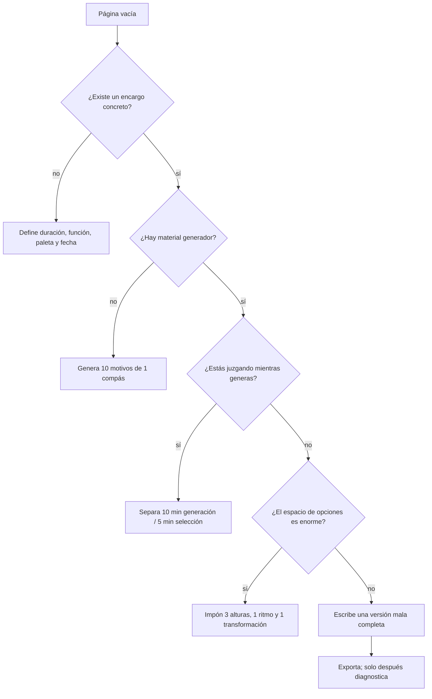

### Acción inmediata de 15 minutos

1. Escribe una intención de nueve palabras o menos.
2. Elige tres alturas y una célula rítmica.
3. Genera cinco motivos sin borrar.
4. Elige el que puedas cantar tras cerrar la nota.
5. Haz `A – A' – B – A` con un solo cambio por sección.
6. Exporta aunque dure veinte segundos.

## Árbol: “mis melodías suenan aleatorias”

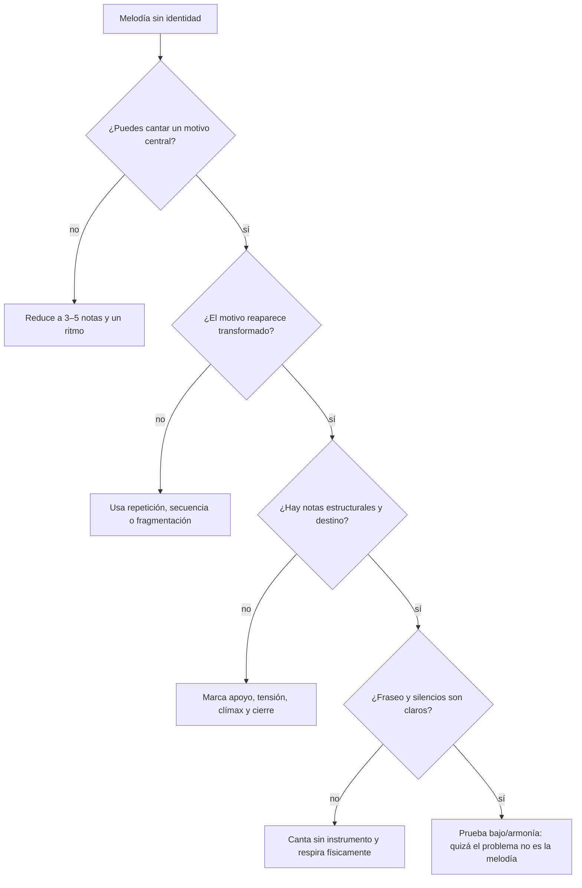

Intervenciones concretas:

- conserva el ritmo y cambia solo el contorno;
- conserva el contorno y cambia solo el ritmo;
- elimina el 30% de ataques menos necesarios;
- fija una nota de llegada por frase;
- retrasa la nota más aguda hasta el punto de máximo significado;
- reemplaza una idea nueva por una transformación de la anterior.

Laboratorio asociado: [[Teoría musical/1. Curso cresciente/6. Atlas visual y laboratorios/04. Laboratorio Music ABC - Oído, grados y melodía]].

## Árbol: “sé armonía, pero no sé qué acorde elegir”

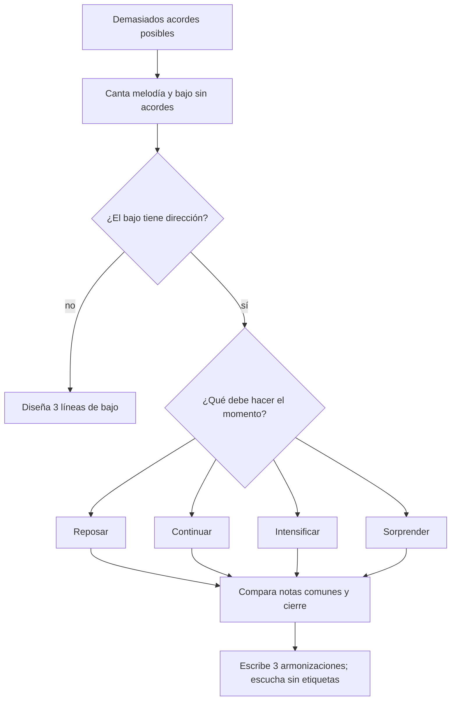

No empieces preguntando “¿qué sustitución sofisticada puedo usar?”. Pregunta:

- ¿qué nota de la melodía debe sentirse estable o activa?;
- ¿hacia dónde se mueve el bajo?;
- ¿qué voces pueden permanecer o moverse por paso?;
- ¿debe cerrar, prolongar o abrir?;
- ¿el cromatismo cambia una función audible o solo añade nombres?

Laboratorio: [[Teoría musical/1. Curso cresciente/6. Atlas visual y laboratorios/05. Laboratorio Music ABC - Armonía y conducción]].

## Árbol: “la pieza no avanza”

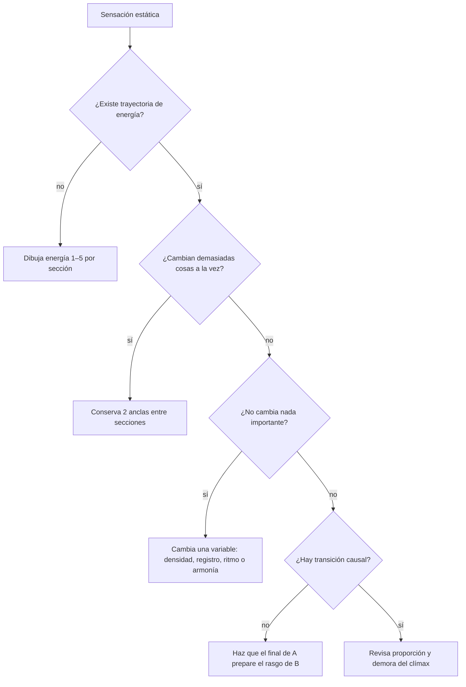

Matriz de energía:

| Variable | Reducir energía | Aumentar energía |
|---|---|---|
| Densidad | retirar capas | añadir voces/ataques |
| Registro | comprimir y bajar | expandir y elevar |
| Ritmo | valores largos, silencio | subdividir, anticipar |
| Dinámica | contener | crecer/acentuar |
| Armonía | pedal, estabilidad | ritmo armónico, tensión |
| Timbre | opaco, homogéneo | brillante, contrastante |
| Forma | prolongar | acelerar eventos/cortes |

Laboratorio: [[Teoría musical/1. Curso cresciente/6. Atlas visual y laboratorios/06. Laboratorio Music ABC - Forma, transición y desarrollo]].

## Árbol: “mis transiciones suenan pegadas”

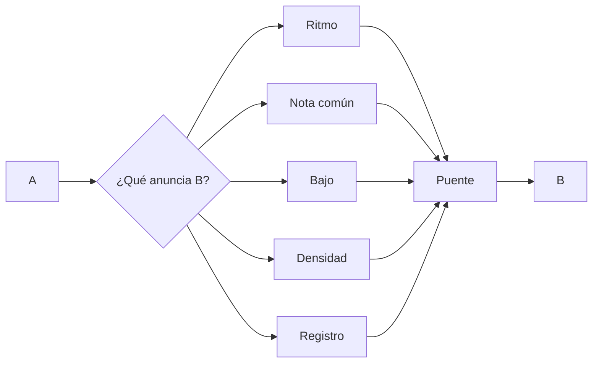

Tres pruebas:

1. **Causalidad:** el último gesto de A debe crear una pregunta que B responde.
2. **Parentesco:** conserva al menos una característica reconocible.
3. **Dirección:** modifica gradualmente o corta deliberadamente; evita un punto medio accidental.

Genera tres puentes distintos y compáralos. Una transición no tiene que ser suave: un corte puede ser excelente si su brusquedad tiene función.

## Árbol: “mi ritmo no tiene vida”

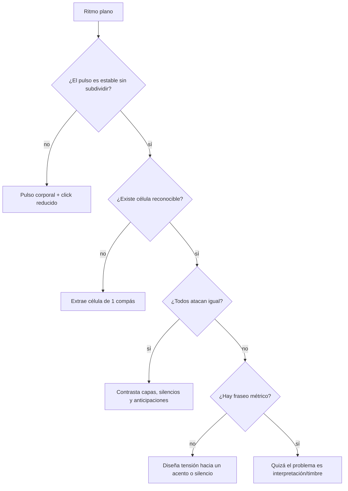

Prueba el material del [[Teoría musical/1. Curso cresciente/6. Atlas visual y laboratorios/03. Laboratorio Music ABC - Ritmo y métrica]].

## Árbol: “entiendo al leer, olvido al hacer”

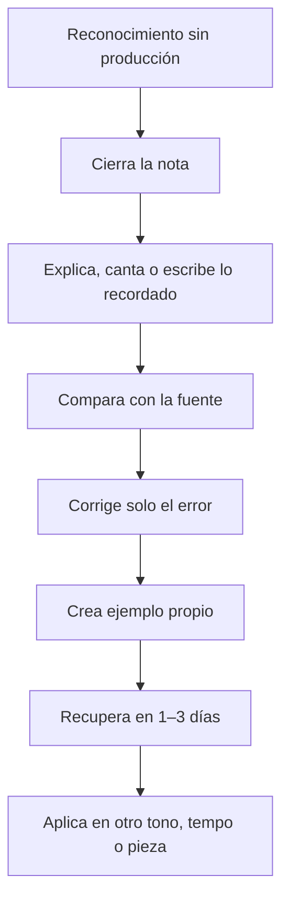

Señales de aprendizaje aparente:

- la explicación parece obvia con la nota abierta;
- el ejemplo del libro se entiende, pero no puedes producir otro;
- reconoces un acorde viendo el cifrado, no escuchándolo;
- completas ejercicios en un orden predecible, pero fallas al mezclarlos;
- el pasaje sale al décimo intento y falla como primera toma al día siguiente.

## Árbol: “practico mucho y progreso poco”

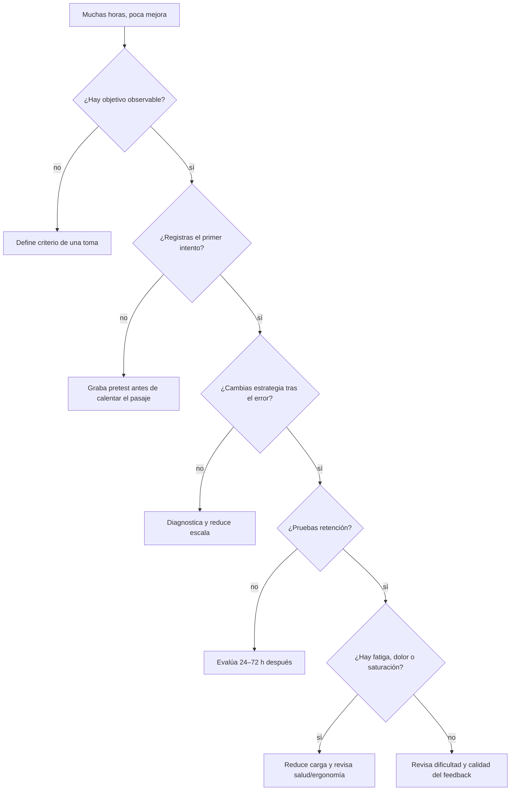

La cantidad de práctica explica parte del desempeño, pero no garantiza expertise. El metaanálisis de Platz et al. y el análisis de Macnamara et al. usan definiciones distintas y estiman relaciones distintas; juntos obligan a evitar dos errores: negar que la práctica importe y creer que las horas bastan.

## Árbol: “no termino piezas”

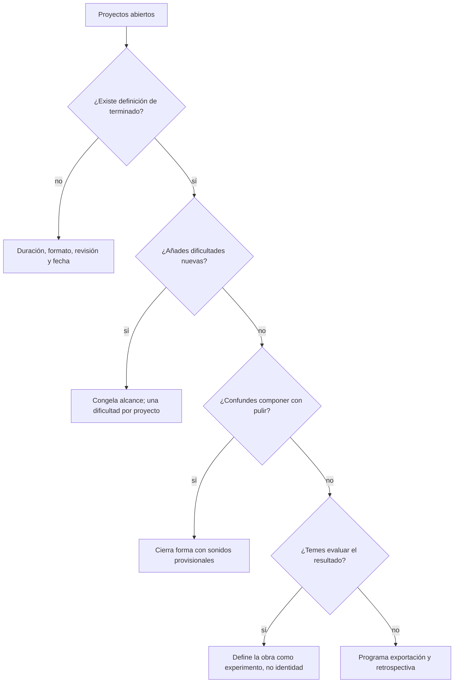

Protocolo de rescate en 45 minutos:

- 5 min: escribe qué función debe cumplir la pieza;
- 10 min: corta material redundante;
- 15 min: completa huecos con la solución más simple;
- 10 min: una toma/exportación completa;
- 5 min: rúbrica, próxima revisión y fecha de cierre.

## Árbol: “nada me gusta”

Puede ser criterio creciente, fatiga perceptiva, objetivo ambiguo o generación insuficiente.

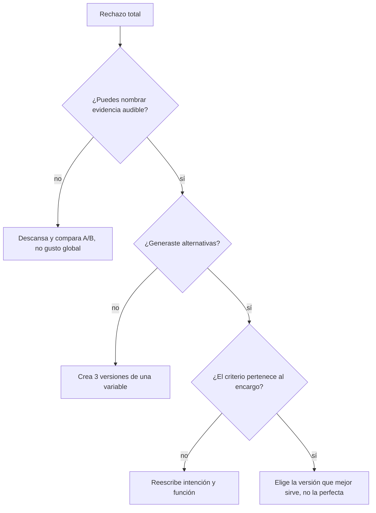

Convierte “no me gusta” en observaciones:

- “el clímax llega antes de que reconozca el motivo”;
- “el bajo cancela el movimiento de la melodía”;
- “B cambia armonía, ritmo, registro y timbre; ya no reconozco parentesco”;
- “el final usa la tónica, pero el ritmo no concluye”;
- “la textura ocupa siempre el mismo registro”.

## Árbol de salud y carga

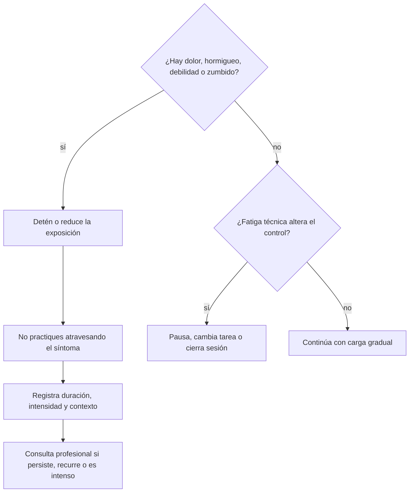

La revisión sistemática de Kok et al. documenta prevalencia relevante de problemas musculoesqueléticos en músicos; la [OMS](https://www.who.int/news-room/questions-and-answers/item/deafness-and-hearing-loss-safe-listening) ofrece principios de escucha segura. Este manual no diagnostica lesiones ni pérdida auditiva.

## Matriz de intervención mínima

| Si el problema es… | Reduce… | Añade… | Prueba posterior |
|---|---|---|---|
| perceptivo | complejidad | contraste exagerado | discriminar sin mirar |
| conceptual | cantidad de reglas | ejemplo y contraejemplo | explicar/producir |
| técnico | tempo y longitud | feedback inmediato | primera toma diferida |
| memoria | pistas externas | recuperación gradual | 24–72 h |
| compositivo | espacio de búsqueda | restricción y encargo | tres opciones completas |
| formal | detalle local | mapa temporal | oyente marca secciones |
| armónico | acordes disponibles | melodía + bajo | tres versiones ciegas |
| motivacional | tamaño de tarea | cierre visible | exportación de 20 s |
| fatiga | duración/intensidad | pausa y variación | ausencia de síntomas |

## Registro de bloqueo

```markdown
### Bloqueo — fecha
- Proyecto/compás:
- Síntoma observable:
- Categoría provisional:
- Evidencia que falta:
- Intervención mínima:
- Resultado tras un intento:
- ¿Cambió la hipótesis?:
- Próxima prueba de menos de 20 minutos:
```

## Cuándo pedir feedback externo

Pídelo cuando:

- no puedes discriminar entre alternativas después de descansar;
- la ejecución impide escuchar la idea compositiva;
- necesitas comprobar una función perceptiva —recuerdo, contraste, clímax—;
- llevas tres ciclos de revisión sobre el mismo problema sin información nueva;
- aparece dolor, tensión recurrente o señal auditiva de riesgo.

Formula preguntas estrechas:

- “¿en qué segundo sientes el cambio de sección?”;
- “tararea lo que recuerdas después de una escucha”;
- “¿cuál de tres bajos hace más clara la llegada?”;
- “¿dónde empieza a caer tu atención?”

Evita “¿te gusta?”.

## Puerta de salida

- [ ] Clasifiqué tres bloqueos antes de intervenir.
- [ ] Cambié estrategia, no solo repetí.
- [ ] Usé una prueba diferida en al menos uno.
- [ ] Convertí una opinión global en evidencia audible.
- [ ] Terminé o cerré conscientemente un proyecto bloqueado.

Siguiente: [[Teoría musical/1. Curso cresciente/6. Atlas visual y laboratorios/09. Panel dinámico, propiedades y consultas]].

