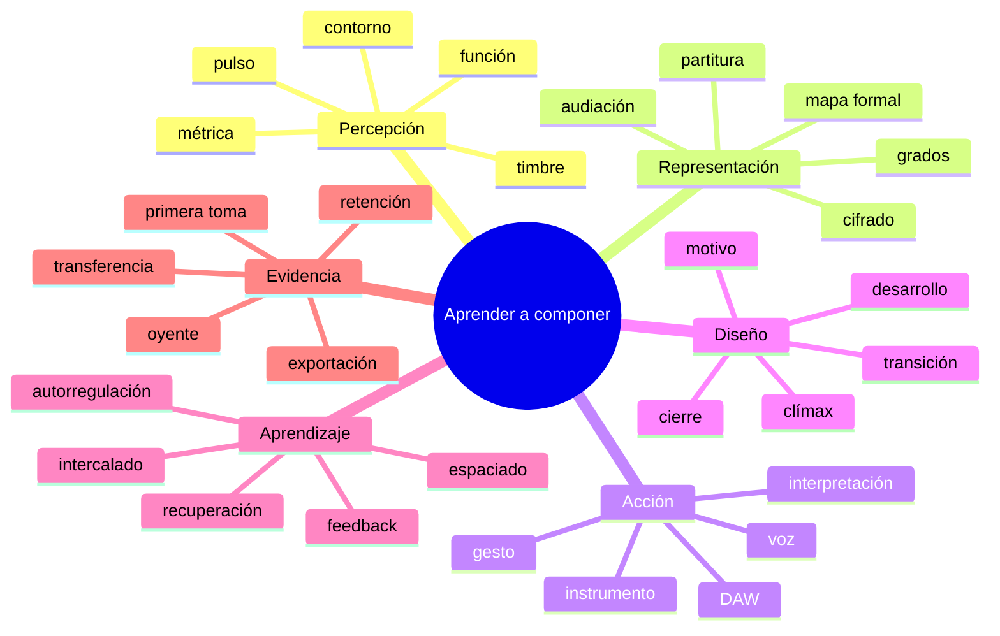
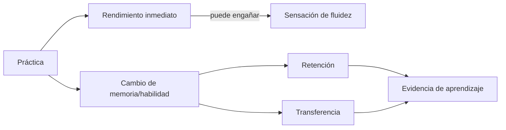
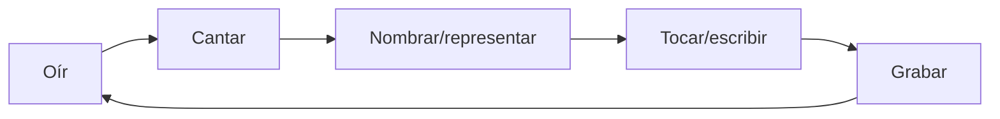
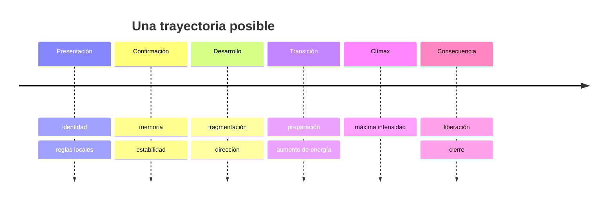
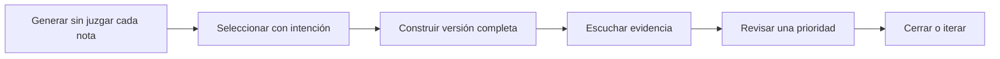
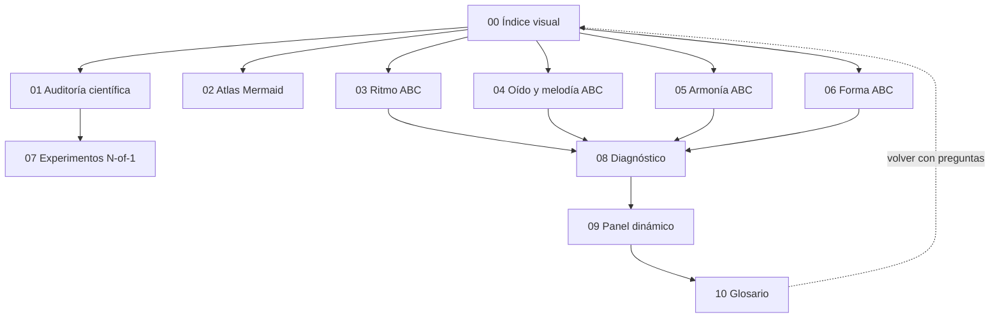

# Glosario visual y conexiones

> [!abstract] Cómo usarlo
> No memorices definiciones aisladas. Elige un término, escucha o crea un ejemplo, conéctalo con dos decisiones compositivas y recupéralo sin mirar dos días después.

## Mapa global



## Leyenda epistemológica

- 🟢 **Evidencia directa:** estudios con músicos o tareas musicales respaldan la relación general.
- 🟡 **Evidencia transferida:** proviene de aprendizaje, memoria o creatividad general y se aplica con cautela.
- 🔵 **Modelo de oficio:** herramienta teórica, analítica o pedagógica útil; no se presenta como descubrimiento experimental.
- ⚠️ **Límite:** término que suele exagerarse o confundirse.

## Aprendizaje y práctica

| Término | Definición operativa | Qué se vería en una sesión | Error común | Evidencia |
|---|---|---|---|---|
| Adquisición | mejora durante o justo al final de practicar | el pasaje sale tras varios intentos | confundirlo con aprendizaje estable | 🟢/🟡 |
| Retención | desempeño después de un intervalo sin práctica equivalente | primera toma 24–72 h después | calentar exactamente el pasaje antes de medir | 🟢/🟡 |
| Transferencia | usar la habilidad en material o contexto nuevo | reconocer la función en otra tonalidad | repetir el mismo ejemplo con otro nombre | 🟢/🟡 |
| Recuperación | producir información sin verla antes de corregir | cantar grados o reconstruir forma | releer y luego “recordar” | 🟡 fuerte |
| Espaciado | distribuir encuentros en el tiempo | volver al material en días distintos | convertir `1–3–7–14` en ley universal | 🟡 fuerte; música mixta según tarea |
| Intercalado | alternar categorías o pasajes durante práctica | `ABC–ABC`, no `AAA–BBB–CCC` | cambiar tan rápido que no se entiende nada | 🟢 limitado + 🟡 |
| Variabilidad | practicar bajo condiciones distintas | tono, tempo o entrada diferente | variar antes de establecer el patrón | 🟢 limitado |
| Feedback | información sobre diferencia entre intención y resultado | grabación, maestro, partitura, métrica | recibir opinión vaga sin acción | 🟢 |
| Autoevaluación | juzgar una toma con criterios y evidencia | observación antes y después de grabarse | calificar personalidad o talento | 🟢 |
| Autorregulación | planear, ejecutar, observar, ajustar y reflexionar | objetivo, estrategia, registro, siguiente acción | llamar “disciplina” a repetir sin diagnóstico | 🟢 |
| Práctica deliberada | trabajo enfocado en aspectos mejorables con feedback | criterio estrecho, dificultad apropiada, corrección | contar cualquier hora como deliberada | 🟢 con debate sobre magnitud |
| Práctica mental | imaginar sonido y acción de forma específica | oír/tocar internamente y anticipar | sustituir toda ejecución física | 🟢 como complemento |
| Dificultad deseable | reto que perjudica fluidez inmediata pero puede mejorar retención | recuperación, mezcla de categorías | suponer que toda frustración enseña | 🟡 |
| Consolidación | cambio por el cual una memoria se estabiliza/reorganiza con tiempo | mantenimiento o mejora tras intervalo | afirmar que cada pausa produce ganancia duradera | 🟢/⚠️ |
| Calibración | correspondencia entre confianza y desempeño real | seguridad 80% y acierto cercano | seguridad como equivalente de exactitud | 🟢/🟡 |
| Carga cognitiva | demanda sobre recursos limitados de atención/memoria de trabajo | demasiadas variables nuevas bloquean | usarla para justificar tareas siempre fáciles | 🟡 |

### Relación adquisición–aprendizaje



## Oído, representación y acción

| Término | Definición operativa | Pregunta de comprobación | Aplicación compositiva |
|---|---|---|---|
| Audiación | experimentar/anticipar sonido sin que esté físicamente presente | ¿puedo oír el siguiente evento antes de tocarlo? | componer antes de buscar al azar |
| Contorno | patrón general de ascenso, descenso o repetición | ¿puedo dibujarlo sin nombrar notas? | conservar identidad al cambiar tonalidad |
| Grado de escala | posición relativa respecto de una tónica/centro | ¿qué función tiene 2, 4 o 7 aquí? | transponer una idea conservando relación |
| Tónica perceptiva | altura o región sentida como referencia/retorno | ¿qué nota parece “casa” y por qué? | diseñar cierre, ambigüedad o desplazamiento |
| Solfeo funcional | sílabas/números ligados a relaciones tonales | ¿puedo cantar 1–3–5 desde varias tónicas? | internalizar función antes del instrumento |
| Dictado | reconstrucción externa de un evento escuchado | ¿capturo pulso, contorno y grados estructurales? | extraer recursos de referencias |
| Discriminación | decidir si dos eventos difieren en un rasgo | ¿A y B son iguales en ritmo pero no contorno? | seleccionar alternativas audibles |
| Identificación | asignar categoría a lo percibido | ¿es inversión, cadencia, metro? | nombrar después de escuchar |
| Transcripción | representación de una obra o fragmento por oído | ¿puedo cantar bajo/motivo antes de anotar? | modelar forma, textura y lenguaje |
| Integración auditivo-motora | acoplamiento entre sonido esperado, gesto y resultado | ¿el sonido anticipado guía el movimiento? | tocar y revisar con intención |



## Ritmo y métrica

| Término | Definición operativa | Ejemplo de decisión |
|---|---|---|
| Pulso | periodicidad de referencia | mantener movimiento aunque haya silencio |
| Subdivisión | división regular del pulso | sentir semicorcheas antes de una síncopa |
| Métrica | organización jerárquica de pulsos fuertes/débiles | hacer que el mismo patrón cambie de función |
| Agrupación | percepción de unidades por acento, duración o repetición | `3+2` dentro de 5/8 |
| Síncopa | énfasis o prolongación que contradice expectativa métrica | anticipar un ataque y ligarlo sobre pulso fuerte |
| Hemiola | reinterpretación temporal entre agrupaciones, comúnmente 3×2 y 2×3 | crear empuje al final de una sección |
| Desplazamiento | mover una célula respecto al compás | conservar identidad con nueva tensión |
| Densidad de ataques | cantidad de inicios por unidad temporal | elevar energía sin cambiar armonía |
| Cadencia rítmica | patrón de duración/acento que contribuye al cierre | valores largos y menos ataques al final |
| Groove | patrón temporal encarnado por relaciones entre capas, acentos y microtiempo | definir interacción bajo–percusión–melodía |

Escucha el mismo gesto como 3+3+2:

```music-abc
X:1
T:Agrupación 3+3+2 en 4/4
M:4/4
L:1/8
Q:1/4=96
K:perc
!accent!C C C !accent!C C C !accent!C C | !accent!C C C !accent!C C C !accent!C C |
```

## Melodía y desarrollo

| Término | Definición operativa | No confundir con | Operación |
|---|---|---|---|
| Motivo | unidad breve reconocible y transformable | cualquier grupo de notas | repetir, secuenciar, fragmentar |
| Frase | unidad con dirección y grado de cierre | cantidad fija de compases | respirar, culminar, cadenciar |
| Célula | fragmento mínimo rítmico o interválico | motivo completo | recombinar |
| Nota estructural | altura con peso por métrica, duración, registro o armonía | toda nota del acorde | reducir ornamentación |
| Nota objetivo | destino local preparado por la línea | nota necesariamente consonante | retrasar, anticipar, rodear |
| Clímax melódico | punto de máxima intensidad local/global | simplemente nota más aguda | preparar por registro, ritmo y armonía |
| Secuencia | repetición de un patrón a otra altura | transposición completa de una obra | generar dirección predecible |
| Fragmentación | uso de una parte cada vez menor del material | cortar arbitrariamente | acelerar desarrollo/transición |
| Aumentación | alargar valores de un patrón | tocar más lento toda la pieza | convertir figura en fondo o solemnidad |
| Disminución | acortar valores de un patrón | subir tempo global | aumentar actividad |
| Inversión de contorno | cambiar ascensos por descensos aproximados o exactos | inversión armónica | contraste con parentesco |
| Variación | cambio que conserva rasgos suficientes para reconocer parentesco | idea nueva | seleccionar qué permanece |

```music-abc
X:2
T:Motivo y cuatro operaciones
M:4/4
L:1/8
Q:1/4=82
K:C
"A" C2 D2 E2 G2 |
"Secuencia" D2 E2 F2 A2 |
"Fragmento" C2 D2 C2 D2 |
"Diminución" C D E G C D E G |
"Inversión" G2 F2 E2 C2 |
```

## Armonía y conducción

| Término | Definición operativa | Pregunta audible | Uso |
|---|---|---|---|
| Función | papel de estabilidad, preparación, tensión o retorno dentro de un contexto | ¿qué expectativa crea? | decidir dirección, no solo etiqueta |
| Inversión | nota del acorde distinta de la raíz en el bajo | ¿cómo cambia el bajo y la estabilidad? | líneas suaves o bajos dirigidos |
| Conducción de voces | movimiento de líneas individuales entre sonoridades | ¿qué permanece y qué se mueve por paso? | coherencia y economía |
| Nota común | altura conservada entre acordes/centros | ¿sirve de ancla perceptiva? | transiciones y reinterpretación |
| Tono guía | 3ª/7ª u otra nota que define calidad/dirección | ¿qué semitono pide resolución? | claridad con pocas voces |
| Ritmo armónico | frecuencia y colocación de cambios armónicos | ¿acelera hacia un evento? | energía formal |
| Cadencia | proceso de cierre armónico-melódico-rítmico | ¿realmente concluye al oírse? | puntuación formal |
| Pedal | nota sostenida/reiterada bajo armonías cambiantes | ¿estabiliza o acumula fricción? | cohesión, suspenso |
| Dominante secundaria | dominante temporal de un grado distinto de la tónica global | ¿intensifica una llegada local? | tonicización |
| Intercambio modal | préstamo de sonoridad de modo paralelo/relacionado | ¿qué color y conducción aporta? | contraste sin modulación extensa |
| Reharmonización | nuevo soporte armónico para una melodía relativamente estable | ¿cambia interpretación conservando identidad? | explorar alternativas |
| Planing | movimiento paralelo de una estructura de acordes | ¿prima color/contorno sobre función tonal? | textura y lenguaje modal |

```music-abc
X:3
T:Misma melodía, bajo distinto
M:4/4
L:1/4
Q:1/4=76
K:C
V:M clef=treble
V:B clef=bass
[V:M] E G A G | F E D2 | E G A B | C4 |
[V:B] C,2 F,2 | G,2 C,2 | A,2 D,2 | G,2 C,2 |
```

## Forma y tiempo

| Término | Definición operativa | Evidencia perceptiva |
|---|---|---|
| Sección | tramo con función y perfil relativamente distinguible | un oyente detecta cambio de estado |
| Función formal | lo que una unidad hace: presentar, continuar, contrastar, cerrar | se puede explicar el efecto temporal |
| Antecedente | unidad que plantea y suele cerrar de forma menos conclusiva | sensación de pregunta/deuda |
| Consecuente | unidad relacionada que responde y cierra con mayor fuerza | retorno + resolución |
| Sentencia | presentación de idea, repetición y continuación/cadencia | aceleración/fragmentación tras la presentación |
| Transición | proceso que conecta y prepara estados | el final de A hace legible B |
| Contraste | diferencia funcionalmente relevante | cambia percepción sin perder necesariamente parentesco |
| Clímax | máximo estructural de energía/importancia | convergen registro, densidad, dinámica o armonía |
| Proporción | relación de duración/peso entre unidades | una sección se siente demasiado breve/larga para su función |
| Retorno | reaparición reconocible tras contraste | memoria reorganiza lo escuchado |
| Coda | material posterior al cierre principal que confirma, expande o comenta | se percibe “después del final” funcional |
| Final abierto/cerrado | grado de expectativa pendiente o resuelta | deseo de continuación vs suficiencia |



## Textura, arreglo y producción

| Término | Definición operativa | Nivel de decisión |
|---|---|---|
| Textura | relación entre líneas/capas y su grado de independencia | composición/arreglo |
| Densidad | cantidad y actividad de eventos/capas | forma/arreglo |
| Registro | zona de alturas ocupada y su distribución | composición/arreglo |
| Doblaje | duplicación intencional de una línea | arreglo |
| Contrapunto | coexistencia de líneas con identidad relativa | composición/arreglo |
| Orquestación | asignación y combinación de material entre instrumentos | arreglo/orquestación |
| Timbre | cualidad espectral y temporal de un sonido | interpretación/sonido |
| Articulación | modo de iniciar, sostener y terminar notas | composición/interpretación |
| Balance | relación de niveles percibidos entre elementos | arreglo/mezcla |
| Profundidad | percepción de cercanía/lejanía | producción/mezcla |
| Panorama | ubicación lateral | mezcla |
| Automatización | cambio programado de parámetros en el tiempo | producción |
| Mezcla | organización del material ya compuesto/arreglado en el campo sonoro | producción |
| Masterización | preparación y coherencia final del conjunto/exportación | entrega |


## Creatividad y toma de decisiones

| Término | Definición operativa | Aplicación |
|---|---|---|
| Generación divergente | producir varias posibilidades antes de elegir | cinco motivos, tres bajos, tres puentes |
| Selección convergente | comparar posibilidades contra intención/criterio | escucha A/B/C diferida |
| Restricción | límite que reduce el espacio de búsqueda | tres alturas, un pedal, una transformación |
| Incubación | intervalo sin trabajo consciente continuo que puede favorecer reestructuración | dejar un problema y volver con prueba |
| Fijación | dependencia excesiva de una solución o ejemplo previo | cambiar representación/instrumento/restricción |
| Analogía estructural | transferir una relación, no la superficie | usar trayectoria de una referencia sin copiar notas |
| Iteración | ciclo de versión, escucha, decisión y nueva versión | `v01 → feedback → v02` |
| Criterio | propiedad relevante para escoger | claridad formal, recuerdo, dirección |
| Encargo | definición concreta de función, alcance y entrega | miniatura de 45 s con un clímax |
| Definición de terminado | condiciones observables para cerrar | exportación, rúbrica, revisión, archivo |



## Medición

| Término | Definición | Ejemplo correcto | Ejemplo incorrecto |
|---|---|---|---|
| Línea base | desempeño antes de la intervención | primera toma sin repasar | mejor toma tras 20 minutos |
| Variable | aspecto que cambia o se mide | orden bloque/intercalado | “todo mi método” |
| Medida primaria | resultado decidido antes y usado para concluir | notas correctas a 48 h | escoger después el dato favorable |
| Medida secundaria | contexto o posible mecanismo | esfuerzo, tiempo, tensión | veinte escalas sin prioridad |
| Fiabilidad | estabilidad de una medida bajo condiciones comparables | rubricar dos veces con criterios | impresión global cambiante |
| Validez | si la medida representa lo que afirmas | retención para memoria | horas para “talento” |
| Efecto techo | tarea tan fácil que estrategias parecen iguales | 100% en ambas condiciones | concluir equivalencia universal |
| Confusor | factor alternativo que explica el resultado | tarea B era más fácil | atribuir todo a la estrategia |
| Pre-registro | escribir hipótesis, medidas y criterio antes de datos | protocolo N-of-1 | decidir reglas después |
| Replicación | repetir la comparación en material nuevo | dos pares de tareas | repetir la misma tarea ya aprendida |

## Mitos que este sistema evita

| Mito | Corrección |
|---|---|
| “10,000 horas garantizan maestría” | la cantidad importa, pero estrategia, feedback, historia, oportunidades y otros factores también; ninguna cifra garantiza resultado |
| “Tengo un estilo de aprendizaje visual/auditivo” | las preferencias no prueban que enseñar según una etiqueta mejore aprendizaje; la modalidad debe corresponder a la habilidad musical |
| “Si se sintió fácil, ya lo aprendí” | mide retención y transferencia |
| “La teoría mata creatividad” | la teoría puede ampliar, describir y comparar opciones; se vuelve obstáculo si sustituye el oído o acumula etiquetas |
| “La creatividad es esperar inspiración” | puede entrenarse un proceso de generación, selección, desarrollo y revisión |
| “Más acordes significa más emoción” | emoción también depende de ritmo, melodía, registro, textura, interpretación, forma y contexto |
| “Una pieza termina cuando está perfecta” | termina cuando cumple encargo, entrega evidencia y recibe revisión suficiente para su propósito |
| “Dormir o pausar arregla automáticamente la práctica” | los intervalos ayudan bajo ciertas condiciones; no sustituyen codificación, feedback ni carga adecuada |
| “La grabación dice la verdad completa” | aporta evidencia diferente, pero micrófono, toma y criterios también sesgan |
| “La rúbrica mide valor artístico” | organiza atención; no valida universalmente calidad o significado |

## Red de documentos



## Prueba de uso del glosario

Elige cinco términos al azar y, sin mirar:

1. defínelos con tus palabras;
2. produce o señala un ejemplo audible;
3. crea un contraejemplo;
4. conecta cada uno con una decisión de una pieza propia;
5. recupera los cinco 48 horas después;
6. aplica dos en un tono, tempo o proyecto distinto.

Si solo puedes repetir la definición, todavía es conocimiento declarativo. Si puedes escuchar, producir, transformar y transferir el concepto, empieza a formar parte del oficio.

Vuelve a [[Teoría musical/1. Curso cresciente/6. Atlas visual y laboratorios/00. Índice visual e interactivo]] o abre [[Teoría musical/1. Curso cresciente/05. Tablero de progreso]].

