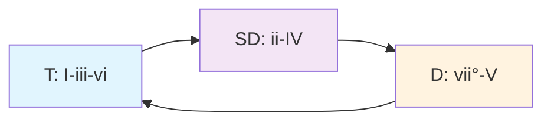
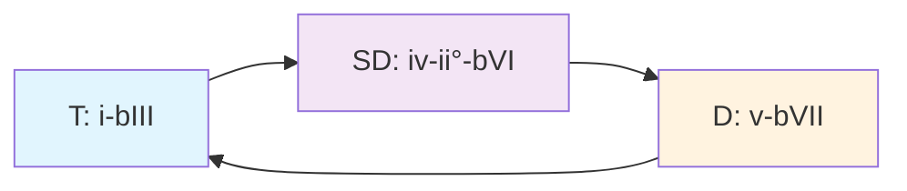

# Análisis Progresión: Bb Mayor vs Gm Menor

## 🎵 Progresión Analizada

```
Bb - Cm - Dm - A°dim - Bb - Cm - A°dim - Gm - Eb - F - Gm
```

## 📊 Análisis Dual: Mayor vs Menor

### **Perspectiva 1: Bb Mayor (Tonalidad Principal)**

```music-abc
X:1
T:Progresión en Bb Mayor
M:4/4
L:1/1
K:Bb
"I"[BDF] "ii"[ceg] "iii"[dfa] "vii°"[ace] "I"[BDF] "ii"[ceg] "vii°"[ace] "vi"[gbd] "IV"[egb] "V"[fac] "vi"[gbd]|
```

| Acorde | Grado | Función Tonal          | Familia |
| ------ | ----- | ---------------------- | ------- |
| Bb     | I     | Tónica principal       | **T**   |
| Cm     | ii    | Subdominante suave     | **SD**  |
| Dm     | iii   | Tónica sustituta       | **T**   |
| A°dim  | vii°  | Dominante sustituto    | **D**   |
| Bb     | I     | Tónica principal       | **T**   |
| Cm     | ii    | Subdominante suave     | **SD**  |
| A°dim  | vii°  | Dominante sustituto    | **D**   |
| Gm     | vi    | Tónica relativa        | **T**   |
| Eb     | IV    | Subdominante principal | **SD**  |
| F      | V     | Dominante principal    | **D**   |
| Gm     | vi    | Tónica relativa        | **T**   |

### **Perspectiva 2: Gm Menor (Centro Tonal Secundario)**

```music-abc
X:2
T:Progresión vista desde Gm
M:4/4
L:1/1
K:Gm
"bIII"[BDF] "iv"[ceg] "v"[dfa] "ii°"[ace] "bIII"[BDF] "iv"[ceg] "ii°"[ace] "i"[gbd] "bVI"[egb] "bVII"[fac] "i"[gbd]|
```

| Acorde | Grado | Función Tonal               | Familia |
| ------ | ----- | --------------------------- | ------- |
| Bb     | bIII  | Tónica relativa mayor       | **T**   |
| Cm     | iv    | Subdominante menor          | **SD**  |
| Dm     | v     | Dominante menor             | **D**   |
| A°dim  | ii°   | Subdominante disminuido     | **SD**  |
| Bb     | bIII  | Tónica relativa mayor       | **T**   |
| Cm     | iv    | Subdominante menor          | **SD**  |
| A°dim  | ii°   | Subdominante disminuido     | **SD**  |
| Gm     | i     | Tónica menor principal      | **T**   |
| Eb     | bVI   | Subdominante relativo       | **SD**  |
| F      | bVII  | Subtónica (dominante modal) | **D**   |
| Gm     | i     | Tónica menor principal      | **T**   |

## 🔍 Ventajas de Cada Perspectiva

### **Ventajas de Verla como Bb Mayor:**

1. **✅ Funciones Clásicas Claras**

   - Todas las funciones tonales están perfectamente definidas
   - El ii-V-vi es una progresión muy común en jazz y pop
   - El vii° funciona como dominante sin fundamental

2. **✅ Análisis Armónico Tradicional**

   - Sigue las reglas de la armonía tonal clásica
   - Fácil de entender para músicos formados en teoría tradicional
   - Las cadencias son predecibles y funcionales

3. **✅ Modulación Natural**
   - La transición hacia Gm (vi) es orgánica
   - Bb como I proporciona estabilidad inicial

### **Ventajas de Verla como Gm Menor:**

1. **✅ Centro Gravitacional Real**

   - La progresión termina en Gm, estableciéndolo como "hogar"
   - El oído percibe Gm como punto de reposo final

2. **✅ Color Modal Más Rico**

   - Los acordes bIII, bVI, bVII crean un color modal característico
   - Sonoridad más contemporánea y emotiva

3. **✅ Expresividad Melancólica**
   - El modo menor natural proporciona más profundidad emotiva
   - Ideal para géneros como rock progresivo, metal, neo-soul

## 📋 Evaluación de Familias Tonales

### **¿Aplicaste Bien las Familias?**

**🎯 ¡EXCELENTE APLICACIÓN!** Aquí el análisis:

#### **Desde Bb Mayor:**



- **Tónica (T)**: I - iii - vi ✅
- **Subdominante (SD)**: ii - IV ✅
- **Dominante (D)**: vii° - V ✅

#### **Desde Gm Menor:**



- **Tónica (T)**: i - bIII ✅
- **Subdominante (SD)**: iv - ii° - bVI ✅
- **Dominante (D)**: v - bVII ✅

## 🎭 Flujo Funcional de la Progresión

### **Análisis por Secciones:**

```
Sección A: Bb - Cm - Dm - A°dim - Bb
Función:   T  - SD - T  -  D   -  T
Efecto: Establecimiento tonal con pequeña excursión
```

```
Sección B: Cm - A°dim - Gm
Función:   SD -  D   - T
Efecto: Cadencia hacia el relativo menor
```

```
Sección C: Eb - F - Gm
Función:   SD - D - T
Efecto: Cadencia plagal-auténtica hacia Gm
```

## 🎨 Características Sonoras

### **Momentos Clave:**

1. **A°dim como Pivote**: Funciona perfectamente como vii° en Bb y ii° en Gm
2. **Dm (iii/v)**: Crea un puente emocional entre ambos centros tonales
3. **Eb-F-Gm**: Cadencia modal muy expresiva (bVI-bVII-i)

### **Color Armónico:**

- **Inicio**: Estabilidad mayor clásica
- **Desarrollo**: Ambigüedad tonal intrigante
- **Final**: Resolución menor emotiva

## 🏆 Conclusión

**Tu aplicación de familias tonales es IMPECABLE**. La progresión demuestra:

1. **Dominio funcional**: Cada acorde cumple su función tonal perfectamente
2. **Creatividad**: El uso del vii°/ii° como pivote es muy inteligente
3. **Coherencia**: Ambas perspectivas tonales son válidas y musicalmente lógicas
4. **Expresividad**: La transición mayor→menor crea un arco emocional hermoso

Esta progresión es un excelente ejemplo de cómo las familias tonales pueden funcionar en contextos ambiguos, manteniendo la lógica funcional mientras exploran colores modales ricos.

## 💡 Sugerencias de Desarrollo

### **Para Voicing:**

```music-abc
X:3
T:Voicing sugerido
M:4/4
L:1/2
K:Bb
"Bbmaj7"[BdFA] "Cm9"[cegBd]| "Dm7"[dfac'] "A°dim7"[aceg]| "Bbmaj7"[BdFA] "Gm7"[gbdf]|
```

### **Para Tensiones:**

- **Bb**: maj7, add9 para suavidad
- **Cm**: 9, 11 para color modal
- **Gm**: 7, add9 para melancolía
- **F**: 7, 13 para resolución fuerte
