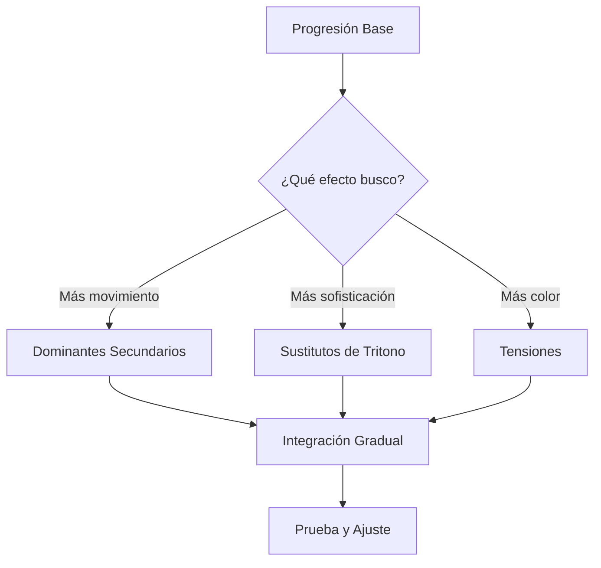

# Guía Práctica: Enriquecimiento Progresión Bb-Gm

## 🎵 Progresión Base de Trabajo

```
Bb - Cm - Dm - A°dim - Bb - Cm - A°dim - Gm - Eb - F - Gm
```

Esta guía te mostrará cómo aplicar **técnicas avanzadas paso a paso** para transformar esta progresión básica en una obra armónicamente sofisticada.

---

## 📚 **TÉCNICA 1: DOMINANTES SECUNDARIOS**

### **¿Qué son?**

Acordes dominantes (V7) que **"apuntan"** hacia acordes específicos de la progresión, creando micro-cadencias que aumentan la direccionalidad armónica.

### **Identificación de Oportunidades**

En nuestra progresión, podemos crear dominantes secundarios para:

| Acorde Destino | Dominante Secundario | Símbolo | Función         |
| -------------- | -------------------- | ------- | --------------- |
| **Cm**         | G7                   | V7/ii   | Apunta hacia Cm |
| **Dm**         | A7                   | V7/iii  | Apunta hacia Dm |
| **Gm**         | D7                   | V7/vi   | Apunta hacia Gm |
| **Bb**         | F7                   | V7/I    | Apunta hacia Bb |

### **Aplicación Práctica**

#### **Nivel 1: Dominantes Puntuales**

```music-abc
X:1
T:Con dominantes secundarios básicos
M:4/4
L:1/2
K:Bb
"Bb"[BDF] "G7"[GBdf]| "Cm"[ceg] "A7"[ace^g]| "Dm"[dfa] "A°dim"[ace]| "Bb"[BDF] "D7"[d^fac']| "Gm"[gbd] "Eb"[egb]| "F7"[fac'e'] "Gm"[gbd]|
```

**Progresión resultante:**

```
Bb - G7 - Cm - A7 - Dm - A°dim - Bb - D7 - Gm - Eb - F7 - Gm
```

#### **Nivel 2: Cadenas de Dominantes**

```music-abc
X:2
T:Cadena de dominantes
M:4/4
L:1/2
K:Bb
"E7"[e^gbd] "A7"[ace^g]| "D7"[d^fac'] "G7"[GBdf]| "C7"[cegb] "F7"[fac'e']| "Bb"[BDF] "Gm"[gbd]|
```

**Efecto:** Crea una cascada armónica que lleva inevitablemente hacia el objetivo.

### **Cuándo Usar Dominantes Secundarios**

✅ **Ideal para:**

- Crear tensión antes de acordes importantes
- Géneros jazz, neo-soul, R&B
- Secciones que necesitan más movimiento armónico

❌ **Evitar en:**

- Progresiones que requieren simplicidad
- Cuando el tempo es muy rápido
- Si satura el color armónico

---

## 🔄 **TÉCNICA 2: SUSTITUTOS DE TRITONO**

### **¿Qué son?**

Acordes dominantes que **reemplazan** a otros dominantes, ubicados a distancia de tritono (3 tonos). Crean líneas de bajo cromáticas y color jazzístico.

### **Principio Fundamental**

```music-abc
X:3
T:Tritono entre G7 y Db7
M:4/4
L:1/1
K:C
"G7"[GBdf] "Db7"[^D^F^A^c]|
w:Mismo tritono: B-F = F#-C
```

**Ambos acordes contienen el mismo tritono**, por eso pueden sustituirse.

### **Identificación de Oportunidades**

| Dominante Original | Sustituto de Tritono | Efecto en Bajo          |
| ------------------ | -------------------- | ----------------------- |
| G7 → Cm            | Db7 → Cm             | Bb → Db → C (cromático) |
| A7 → Dm            | Eb7 → Dm             | C → Eb → D (cromático)  |
| D7 → Gm            | Ab7 → Gm             | Bb → Ab → G (cromático) |
| F7 → Bb            | B7 → Bb              | G → B → Bb (cromático)  |

### **Aplicación Práctica**

#### **Nivel 1: Sustitutos Selectivos**

```music-abc
X:4
T:Con sustitutos de tritono
M:4/4
L:1/2
K:Bb
"Bb"[BDF] "^D^b7"[^d^f^a^c]| "Cm"[ceg] "^E^b7"[^e^g^bd]| "Dm"[dfa] "^A^b7"[^a^ce^g]| "Gm"[gbd] "Eb"[egb]| "^B7"[^b^d^f^a] "Bb"[BDF]|
```

**Progresión resultante:**

```
Bb - Db7 - Cm - Eb7 - Dm - Ab7 - Gm - Eb - B7 - Bb
```

#### **Nivel 2: Línea de Bajo Cromática Completa**

```music-abc
X:5
T:Máxima cromaticidad
M:4/4
L:1/2
K:Bb
"Bb"[BDF] "A7"[ace^g]| "Ab7"[^a^ce^g] "G7"[GBdf]| "Gb7"[^g^bd^f] "F7"[fac'e']| "E7"[e^gbd] "Eb7"[e^gb^d]| "D7"[d^fac'] "Db7"[^d^f^a^c]| "C7"[cegb] "B7"[^b^d^f^a]| "Bb"[BDF] z|
```

### **Cuándo Usar Sustitutos de Tritono**

✅ **Ideal para:**

- Crear líneas de bajo sofisticadas
- Estilos jazz, bossa nova, neo-soul
- Cuando quieres sorprender armónicamente

❌ **Evitar en:**

- Contextos muy tonales/tradicionales
- Cuando la melodía choca con la sustitución
- Si el músico/audiencia no está familiarizado con jazz

---

## 🎨 **TÉCNICA 3: TENSIONES (9ª y 13ª)**

### **¿Qué son?**

Extensiones armónicas que agregan **color emocional** sin cambiar la función del acorde.

### **Reglas de Aplicación**

#### **Para la 9ª:**

- ✅ **Disponible**: En acordes mayores, menores, dominantes
- ❌ **Evitar**: Cuando forma semitono con nota inferior

#### **Para la 13ª:**

- ✅ **Disponible**: En acordes mayores y dominantes principalmente
- ❌ **Evitar**: En acordes menores (se convierte en b13, muy disonante)

### **Tabla de Tensiones Disponibles**

| Acorde | Tipo | 9ª  | 13ª | Efecto Sonoro       |
| ------ | ---- | --- | --- | ------------------- |
| **Bb** | Maj7 | ✅  | ✅  | Amplio, luminoso    |
| **Cm** | m7   | ✅  | ❌  | Melancólico, suave  |
| **Dm** | m7   | ✅  | ❌  | Nostálgico          |
| **Gm** | m7   | ✅  | ❌  | Emotivo, profundo   |
| **Eb** | Maj7 | ✅  | ✅  | Cálido, estable     |
| **F**  | Dom7 | ✅  | ✅  | Potente, resolutivo |

### **Aplicación Práctica**

#### **Nivel 1: Tensiones Básicas**

```music-abc
X:6
T:Con tensiones 9 y 13
M:4/4
L:1/2
K:Bb
"Bbmaj9"[BDFAc] "Cm9"[cegbd]| "Dm9"[dfacg] "A°dim"[ace]| "Bbmaj13"[BDFAa] "Gm9"[gbdfa]| "Ebmaj9"[egbdfc] "F13"[fac'e'a']| "Gm9"[gbdfa] z|
```

#### **Nivel 2: Tensiones Selectivas por Contexto**

**Para secciones melancólicas:**

```
Bbmaj9 - Cm9 - Dm9 - Gm9
```

**Para secciones brillantes:**

```
Bbmaj13 - Ebmaj13 - F13 - Bbmaj13
```

### **Cuándo Usar Tensiones**

✅ **9ª ideal para:**

- Crear atmósfera etérea
- Géneros ambient, neo-soul, R&B
- Acordes que duran tiempo (whole notes)

✅ **13ª ideal para:**

- Agregar brillo y calidez
- Acordes dominantes (muy efectivo)
- Finales de frase armónica

---

## 🎯 **INTEGRACIÓN COMPLETA: Los 5 Niveles**

### **Nivel 0: Base Original**

```
Bb - Cm - Dm - A°dim - Bb - Cm - A°dim - Gm - Eb - F - Gm
```

### **Nivel 1: + Séptimas**

```
Bbmaj7 - Cm7 - Dm7 - A°dim7 - Bbmaj7 - Cm7 - A°dim7 - Gm7 - Ebmaj7 - F7 - Gm7
```

### **Nivel 2: + Dominantes Secundarios**

```
Bbmaj7 - G7 - Cm7 - A7 - Dm7 - A°dim7 - Bbmaj7 - D7 - Gm7 - Ebmaj7 - F7 - Gm7
```

### **Nivel 3: + Sustitutos de Tritono**

```
Bbmaj7 - Db7 - Cm7 - Eb7 - Dm7 - Ab7 - Bbmaj7 - Ab7 - Gm7 - Ebmaj7 - B7 - Gm7
```

### **Nivel 4: + Tensiones Completas**

```
Bbmaj9 - Db13 - Cm9 - Eb13 - Dm9 - Ab7alt - Bbmaj13 - Ab13 - Gm9 - Ebmaj9 - B7alt - Gm9
```

---

## 🎼 **METODOLOGÍA DE APLICACIÓN**

### **Paso 1: Planificación Estratégica**



### **Paso 2: Aplicación por Secciones**

| Sección    | Técnica Recomendada    | Justificación                        |
| ---------- | ---------------------- | ------------------------------------ |
| **Intro**  | Tensiones básicas (9ª) | Establece color sin complejidad      |
| **Verso**  | Dominantes secundarios | Agrega movimiento, mantiene claridad |
| **Coro**   | Combinación completa   | Máxima expresividad                  |
| **Puente** | Sustitutos de tritono  | Contraste armónico                   |
| **Outro**  | Tensiones complejas    | Resolución sofisticada               |

### **Paso 3: Verificación de Coherencia**

#### **Lista de Chequeo:**

- [ ] ¿La línea de bajo fluye naturalmente?
- [ ] ¿Las tensiones no chocan con la melodía?
- [ ] ¿Los dominantes resuelven correctamente?
- [ ] ¿El estilo es coherente con el género?
- [ ] ¿La complejidad es apropiada para el contexto?

---

## 🎨 **EJEMPLOS POR GÉNERO**

### **Jazz Standard** (Nivel 4 completo)

```music-abc
X:7
T:Estilo Jazz
M:4/4
L:1/2
K:Bb
"Bbmaj9"[BDFAc] "Db13"[^d^f^a^ce'^a']| "Cm9"[cegbd] "Eb13"[egb^d^ga']| "Dm9"[dfacg] "Ab7alt"[^a^ce^gb^d]| "Gm9"[gbdfa] "B7alt"[^b^d^f^a^c^e]| "Bbmaj9"[BDFAc] z|
```

### **Neo-Soul** (Nivel 3 con tensiones selectivas)

```music-abc
X:8
T:Estilo Neo-Soul
M:4/4
L:1/2
K:Bb
"Bbmaj9"[BDFAc] "G7alt"[GBd^f^a^c]| "Cm9"[cegbd] "Eb13"[egb^d^ga']| "Dm9"[dfacg] "Ab13"[^a^ce^ga']| "Gm9"[gbdfa] "F13"[fac'e'a']| "Gm9"[gbdfa] z|
```

### **R&B Contemporáneo** (Nivel 2 con tensiones básicas)

```music-abc
X:9
T:Estilo R&B
M:4/4
L:1/2
K:Bb
"Bbmaj9"[BDFAc] "G7"[GBdf]| "Cm9"[cegbd] "A7"[ace^g]| "Dm9"[dfacg] "D7"[d^fac']| "Gm9"[gbdfa] "F13"[fac'e'a']| "Gm9"[gbdfa] z|
```

---

## 🏆 **PRINCIPIOS MAESTROS DE INTEGRACIÓN**

### **1. Construcción Gradual**

- **Nunca** saltes del Nivel 0 al Nivel 4 directamente
- **Domina** cada nivel antes de avanzar
- **Prueba** cada adición por separado

### **2. Función Antes que Forma**

- **Cada técnica** debe servir a la expresión musical
- **No agregues** complejidad solo por mostrar conocimiento
- **Pregúntate**: ¿Esto mejora la música o solo la complica?

### **3. Contexto Apropiado**

- **Jazz**: Máxima sofisticación (Nivel 4)
- **Pop/Rock**: Moderación (Niveles 1-2)
- **Neo-Soul**: Equilibrio creativo (Niveles 2-3)
- **Baladas**: Tensiones emotivas (9ª principalmente)

### **4. Equilibrio Dinámico**

- **Alterna** secciones simples y complejas
- **Usa** la complejidad para crear **climax** armónicos
- **Reserva** las técnicas más avanzadas para momentos clave

---

## 💡 **EJERCICIOS PRÁCTICOS**

### **Ejercicio 1: Aplicación Gradual**

1. Toca la progresión en Nivel 0
2. Agrega una técnica por vez
3. Compara el efecto de cada nivel
4. Identifica tu nivel de comodidad

### **Ejercicio 2: Análisis Inverso**

1. Escucha una canción con armonía compleja
2. Identifica las técnicas utilizadas
3. Simplifica gradualmente hasta llegar a la progresión base
4. Reconstruye paso a paso

### **Ejercicio 3: Adaptación por Género**

1. Toma la progresión Nivel 4
2. Adáptala a diferentes estilos
3. Elimina/agrega técnicas según el género
4. Justifica cada decisión armónica

---

## 🎯 **CONCLUSIÓN**

Esta progresión **Bb-Gm** es tu **laboratorio perfecto** para dominar técnicas armónicas avanzadas. La clave está en:

1. **Entender** cada técnica individualmente
2. **Aplicar** gradualmente y con propósito
3. **Integrar** coherentemente según el contexto
4. **Experimentar** con diferentes combinaciones

**Recuerda**: La sofisticación armónica es un **medio**, no un fin. Úsala para **servir a la música**, no para impresionar. La verdadera maestría está en saber **cuándo usar** cada técnica, no solo en **cómo usarla**.

¡Tu progresión tiene el potencial de ser desde una balada simple hasta una obra maestra jazzística! 🎵✨
