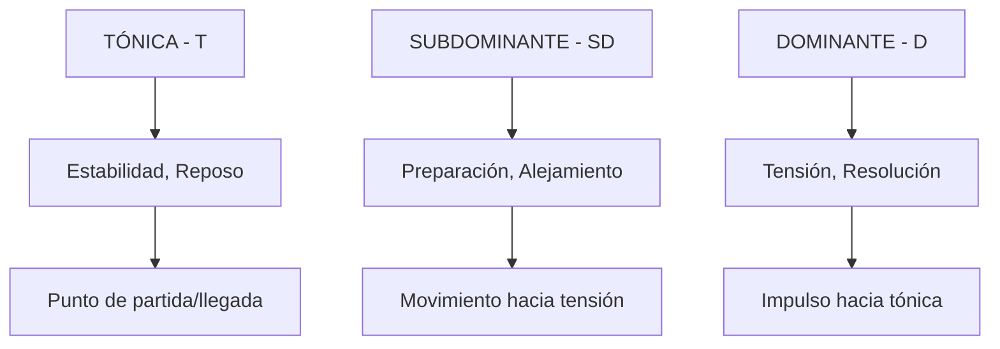
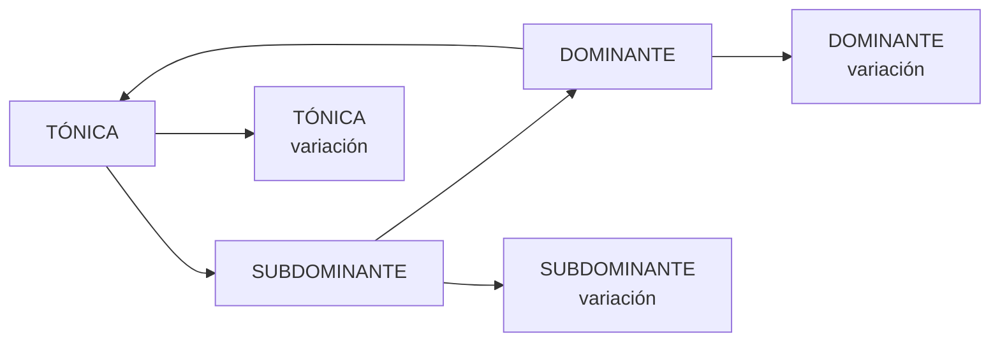

# Guía Construcción Progresiones con Familias Tonales

## 🎯 **OBJETIVO**

Dominar la construcción de progresiones usando **familias tonales** como base estructural, aplicando métodos específicos para contextos mayores y menores.

---

## 📚 **FUNDAMENTOS: FAMILIAS TONALES**

### **Concepto Base**

Las familias tonales agrupan acordes según su **función armónica**, creando un sistema de **tensión → relajación** que guía la construcción de progresiones.



---

## 🏗️ **FAMILIAS EN CONTEXTO MAYOR**

### **Armonización Completa con Familias**

```music-abc
X:1
T:Familias Tonales en C Mayor
M:4/4
L:1/1
K:C
"T-I"[CEG] "SD-ii"[DFA] "T-iii"[EGB] "SD-IV"[FAC] "D-V"[GBD] "T-vi"[ACE] "D-vii°"[BDF]|
```

| Grado    | Familia | Función Específica  | Uso Estratégico                        |
| -------- | ------- | ------------------- | -------------------------------------- |
| **I**    | **T**   | Tónica principal    | Inicio, final, puntos de reposo máximo |
| **ii**   | **SD**  | Subdominante suave  | Preparación melancólica hacia V        |
| **iii**  | **T**   | Tónica sustituta    | Variación emotiva de I                 |
| **IV**   | **SD**  | Subdominante fuerte | Preparación clásica, muy estable       |
| **V**    | **D**   | Dominante principal | Máxima tensión, resolución obligatoria |
| **vi**   | **T**   | Tónica relativa     | Puente hacia menor, color nostálgico   |
| **vii°** | **D**   | Dominante sustituto | Paso cromático, tensión sutil          |
|          |         |                     |                                        |

### **Métodos de Aplicación en Mayor**

#### **Método 1: Construcción por Familias Puras**

**Paso 1: Elige la secuencia funcional**

```
T → SD → D → T (Secuencia clásica)
```

**Paso 2: Selecciona acordes dentro de cada familia**

```
Opción A: I → IV → V → I (Fuerte y directo)
Opción B: vi → ii → V → I (Suave y emotivo)
Opción C: iii → IV → vii° → vi (Colorido y moderno)
```

**Paso 3: Aplicación práctica**

```music-abc
X:2
T:Secuencias por familias puras
M:4/4
L:1/1
K:C
"T"[CEG] "SD"[FAC] "D"[GBD] "T"[CEG]| "T"[ACE] "SD"[DFA] "D"[GBD] "T"[CEG]| "T"[EGB] "SD"[FAC] "D"[BDF] "T"[ACE]|
```

#### **Método 2: Construcción por Cadenas Familiares**

**Cadena Larga T-SD-D:**

```
I - iii - vi - ii - IV - V - vii° - I
T   T    T   SD  SD   D   D     T
```

**Aplicación:**

```music-abc
X:3
T:Cadena familiar extendida
M:4/4
L:1/2
K:C
"T-I"[CEG] "T-iii"[EGB]| "T-vi"[ACE] "SD-ii"[DFA]| "SD-IV"[FAC] "D-V"[GBD]| "D-vii°"[BDF] "T-I"[CEG]|
```

#### **Método 3: Sustituciones Intrafamiliares**

**Dentro de Tónica (T):**

| Acorde Base | Sustitutos | Efecto |
|-------------|------------|--------|
| **I** | **iii, vi** | Más emotivo, menos estable |
| **vi** | **I, iii** | Más brillante o melancólico |
| **iii** | **I, vi** | Más estable o nostálgico |

**Dentro de Subdominante (SD):**

| Acorde Base | Sustitutos | Efecto                      |
| ----------- | ---------- | --------------------------- |
| **IV**      | **ii**     | Más suave, menos directo    |
| **ii**      | **IV**     | Más fuerte, más tradicional |

**Dentro de Dominante (D):**

| Acorde Base | Sustitutos | Efecto |
|-------------|------------|--------|
| **V** | **vii°** | Más sutil, menos resolutivo |
| **vii°** | **V** | Más fuerte, más tradicional |

---

## 🌙 **FAMILIAS EN CONTEXTO MENOR**

### **Armonización Completa con Familias Menores**

```music-abc
X:4
T:Familias Tonales en Am Natural
M:4/4
L:1/1
K:Am
"T-i"[ACE] "SD-ii°"[BDF] "T-bIII"[CEG] "SD-iv"[DFA] "D-v"[EGB] "SD-bVI"[FAC] "D-bVII"[GBD]|
```

| Grado    | Acorde | Familia | Función Específica     | Uso Estratégico                       |
| -------- | ------ | ------- | ---------------------- | ------------------------------------- |
| **i**    | Am     | **T**   | Tónica menor principal | Centro emocional, hogar melancólico   |
| **ii°**  | Bdim   | **SD**  | Subdominante débil     | Paso cromático, inestabilidad         |
| **bIII** | C      | **T**   | Tónica relativa mayor  | Contraste luminoso, esperanza         |
| **iv**   | Dm     | **SD**  | Subdominante menor     | Preparación emotiva, nostalgia        |
| **v**    | Em     | **D**   | Dominante menor        | Resolución suave, modal               |
| **bVI**  | F      | **SD**  | Subdominante relativo  | Estabilidad cálida, soporte           |
| **bVII** | G      | **D**   | Subtónica              | Resolución modal, menos tensión que V |

### **Familias Menores con Escalas Múltiples**

#### **Menor Armónica (con V7):**

```music-abc
X:5
T:Familias con menor armónica
M:4/4
L:1/1
K:Am
"T-i"[ACE] "SD-iv"[DFA] "D-V7"[E^GBD] "T-i"[ACE]|
```

| Grado     | Acorde | Familia | Función Específica             |
| --------- | ------ | ------- | ------------------------------ |
| **V7**    | E7     | **D**   | Dominante clásico con sensible |
| **vii°7** | G#dim7 | **D**   | Dominante disminuido intenso   |

#### **Menor Melódica (con ii7 y IV7):**

```music-abc
X:6
T:Familias con menor melódica
M:4/4
L:1/1
K:Am
"T-i"[ACE] "SD-ii7"[BDF^A] "SD-IV7"[DF^AC] "D-V7"[E^GBD]|
```

### **Métodos de Aplicación en Menor**

#### **Método 1: Familias Puras Menores**

**Secuencia Modal Natural:**

```
T → SD → D → T
i → bVI → bVII → i
```

**Secuencia Clásica con Armónica:**

```
T → SD → D → T
i → iv → V7 → i
```

**Aplicación:**

```music-abc
X:7
T:Secuencias menores por familias
M:4/4
L:1/1
K:Am
"T-i"[ACE] "SD-bVI"[FAC] "D-bVII"[GBD] "T-i"[ACE]| "T-i"[ACE] "SD-iv"[DFA] "D-V7"[E^GBD] "T-i"[ACE]|
```

#### **Método 2: Cadenas Familiares Menores**

**Cadena Emotiva Extendida:**

```
i - bIII - bVI - iv - bVII - v - i
T   T     SD   SD   D     D   T
```

**Aplicación:**

```music-abc
X:8
T:Cadena familiar menor extendida
M:4/4
L:1/2
K:Am
"T-i"[ACE] "T-bIII"[CEG]| "SD-bVI"[FAC] "SD-iv"[DFA]| "D-bVII"[GBD] "D-v"[EGB]| "T-i"[ACE] z|
```

#### **Método 3: Sustituciones Intrafamiliares Menores**

**Dentro de Tónica Menor (T):**
| Acorde Base | Sustitutos | Efecto |
|-------------|------------|--------|
| **i** | **bIII** | Más luminoso, esperanzador |
| **bIII** | **i** | Más melancólico, introspectivo |

**Dentro de Subdominante Menor (SD):**
| Acorde Base | Sustitutos | Efecto |
|-------------|------------|--------|
| **iv** | **bVI, ii°** | Más estable o más inestable |
| **bVI** | **iv** | Más emotivo, menos estable |
| **ii°** | **iv, bVI** | Más estable, menos cromático |

**Dentro de Dominante Menor (D):**
| Acorde Base | Sustitutos | Efecto |
|-------------|------------|--------|
| **v** | **bVII, V7** | Más resolutivo o clásico |
| **bVII** | **v** | Más suave, menos resolutivo |
| **V7** | **v, bVII** | Más modal, menos clásico |

---

## ⚖️ **CONSTRUCCIÓN DUAL: FAMILIAS MAYOR↔MENOR**

### **Acordes Pivote por Familias**

#### **Tónicas Compartidas:**

```music-abc
X:9
T:Tónicas pivote entre C mayor y Am menor
M:4/4
L:1/2
K:C
"C=I(T)/bIII(T)"[CEG] "Am=vi(T)/i(T)"[ACE]| "Em=iii(T)/v(D)"[EGB] z|
```

| Acorde | En Mayor | En Menor | Familia Mayor | Familia Menor |
| ------ | -------- | -------- | ------------- | ------------- |
| **C**  | I        | bIII     | **T**         | **T**         |
| **Am** | vi       | i        | **T**         | **T**         |
| **Em** | iii      | v        | **T**         | **D**         |

#### **Subdominantes Compartidas:**

```music-abc
X:10
T:Subdominantes pivote
M:4/4
L:1/2
K:C
"F=IV(SD)/bVI(SD)"[FAC] "Dm=ii(SD)/iv(SD)"[DFA]| z z|
```

| Acorde | En Mayor | En Menor | Familia Mayor | Familia Menor |
| ------ | -------- | -------- | ------------- | ------------- |
| **F**  | IV       | bVI      | **SD**        | **SD**        |
| **Dm** | ii       | iv       | **SD**        | **SD**        |

#### **Dominantes Compartidas:**

```music-abc
X:11
T:Dominantes pivote
M:4/4
L:1/2
K:C
"G=V(D)/bVII(D)"[GBD] "Bdim=vii°(D)/ii°(SD)"[BDF]| z z|
```

### **Estrategias de Modulación por Familias**

#### **Estrategia 1: Modulación por Tónica Común**

```
Sección A (C Mayor): I - vi - IV - V (T-T-SD-D)
Transición:          vi = i (Am como pivote)
Sección B (A Menor): i - bVI - bVII - i (T-SD-D-T)
```

#### **Estrategia 2: Modulación por Subdominante Común**

```
Sección A (C Mayor): I - ii - V - I (T-SD-D-T)
Transición:          ii = iv (Dm como pivote)
Sección B (A Menor): iv - V7 - i (SD-D-T)
```

#### **Estrategia 3: Cadena Familiar Continua**

```
C - Am - F - G - Am - Dm - G - Am
T   T   SD  D   T   SD  D   T
(Mayor)     (Ambigua)    (Menor)
```

---

## 🛠️ **HERRAMIENTAS ESPECÍFICAS POR FAMILIAS**

### **Generador de Progresiones por Familia**

#### **Para Máxima Estabilidad (Familia T):**

```
Mayor: I - iii - vi - I
Menor: i - bIII - i
```

#### **Para Crear Preparación (Familia SD):**

```
Mayor: I - ii - IV - V
Menor: i - ii° - iv - bVI - V7
```

#### **Para Máxima Tensión (Familia D):**

```
Mayor: I - V - vii° - V - I
Menor: i - V7 - vii°7 - V7 - i
```

### **Matriz de Flujos Familiares**

#### **Flujos Naturales:**



#### **Flujos Excepcionales (Permitidos):**

```
D → SD: Resolución evitada (deceptiva)
SD → T: Cadencia plagal
T → D: Salto directo (poco común)
```

---

## 📋 **PLANTILLAS ESPECÍFICAS POR FAMILIAS**

### **Plantilla 1: Construcción Mayor por Familias**

```
Intro:     T-T-SD-D    (I-vi-ii-V)
Verso:     T-SD-D-T    (I-IV-V-vi)
Pre-Coro:  SD-SD-D-D   (ii-IV-V-vii°)
Coro:      T-D-T-SD-D-T (I-V-vi-IV-V-I)
Puente:    T-T-SD-SD-D-T (iii-vi-ii-IV-V-I)
Outro:     SD-D-T      (IV-V-I)
```

### **Plantilla 2: Construcción Menor por Familias**

```
Intro:     T-SD-D-T    (i-bVI-bVII-i)
Verso:     T-SD-SD-D   (i-iv-bVI-V7)
Pre-Coro:  T-T-SD-D    (bIII-i-iv-V7)
Coro:      T-SD-D-T-SD-D-T (i-bVI-bVII-i-iv-V7-i)
Puente:    SD-SD-D-D-T (ii°-iv-v-V7-i)
Outro:     SD-D-T      (iv-V7-i)
```

### **Plantilla 3: Construcción Dual por Familias**

```
Verso (Mayor):    T-T-SD-D (I-vi-ii-V)
Coro (Pivote):    T-SD-D-T (vi-ii-V-vi) [vi=i]
Puente (Menor):   T-SD-D-T (i-iv-V7-i)
Final (Menor):    SD-D-T   (iv-V7-i)
```

---

## 🎯 **METODOLOGÍA DE APLICACIÓN POR FAMILIAS**

### **Proceso de 7 Pasos:**

#### **1. Define la Intención Emocional**

- **Estable**: Usar más familia T
- **Preparatorio**: Usar más familia SD
- **Climático**: Usar más familia D

#### **2. Elige el Contexto Tonal**

- **Mayor**: Para luminosidad, optimismo
- **Menor**: Para introspección, melancolía
- **Dual**: Para arcos emocionales complejos

#### **3. Selecciona el Flujo Familiar Base**

```
Clásico: T → SD → D → T
Moderno: T → T → SD → D
Experimental: SD → D → T → SD
```

#### **4. Asigna Acordes Específicos**

- Dentro de cada familia, elige según color deseado
- Considera el registro y voicing

#### **5. Aplica Sustituciones Intrafamiliares**

- Mantén la función, cambia el color
- Prueba diferentes opciones dentro de cada familia

#### **6. Conecta con Acordes de Paso**

- Usa acordes cromáticos entre familias
- Mantén el flujo funcional subyacente

#### **7. Verifica Coherencia Familiar**

- Cada sección debe tener lógica funcional clara
- El arco emocional debe ser coherente

---

## 💡 **EJERCICIOS ESPECÍFICOS POR FAMILIAS**

### **Ejercicio 1: Construcción Pura por Familias**

1. Crea una progresión usando solo familia T
2. Crea otra usando solo familia SD
3. Crea otra usando solo familia D
4. Combina las tres manteniendo lógica funcional

### **Ejercicio 2: Sustituciones Intrafamiliares**

1. Toma la progresión I-vi-ii-V
2. Sustituye cada acorde por otro de su misma familia
3. Compara efectos emocionales
4. Identifica tus combinaciones favoritas

### **Ejercicio 3: Modulación por Familias**

1. Crea una progresión en mayor usando T-SD-D-T
2. Identifica acordes pivote con el relativo menor
3. Modula gradualmente manteniendo funciones familiares
4. Analiza el arco emocional resultante

---

## 🏆 **PRINCIPIOS MAESTROS DE FAMILIAS TONALES**

### **1. Función Antes que Sonoridad**

- La familia determina la función
- El acorde específico determina el color
- Mantén siempre la lógica funcional

### **2. Coherencia Familiar**

- Cada sección debe tener propósito funcional claro
- Las transiciones entre familias deben ser intencionales
- El flujo T→SD→D→T es el más natural

### **3. Flexibilidad Intrafamiliar**

- Dentro de cada familia, experimenta libremente
- Las sustituciones intrafamiliares mantienen la función
- Usa la variedad para crear interés sin perder dirección

### **4. Contexto Determina Elección**

- Mayor vs menor cambia significado de familias
- El género musical influye en elecciones familiares
- La sección de la canción determina complejidad familiar

---

## 🎵 **RECURSOS RÁPIDOS POR FAMILIAS**

### **Familias Mayor Esenciales:**

```
T: I, iii, vi
SD: ii, IV
D: V, vii°
```

### **Familias Menor Esenciales:**

```
T: i, bIII
SD: ii°, iv, bVI
D: v, bVII, V7
```

### **Flujos Familiares Más Efectivos:**

```
Clásico: T→SD→D→T
Popular: T→T→SD→D
Modal: T→SD→SD→T
Dramático: SD→D→T→D
```

### **Acordes Pivote por Familias:**

```
Mayor→Menor: vi(T)→i(T)
Menor→Mayor: bIII(T)→I(T)
Ambos: ii(SD)→iv(SD), IV(SD)→bVI(SD)
```

¡Con esta guía específica de familias tonales tienes el control total sobre la función armónica de tus progresiones! 🎼✨
