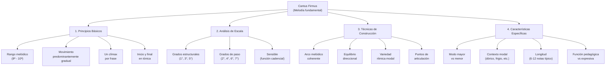

# Guía Práctica: Construcción de Cantus Firmus

_El arte de crear melodías fundamentales para el contrapunto_

El cantus firmus es la columna vertebral del contrapunto. Una melodía bien construida no solo facilita el trabajo contrapuntístico, sino que también determina el carácter y las posibilidades expresivas de toda la composición. Esta guía te enseñará a crear cantus firmus efectivos desde principios fundamentales hasta técnicas avanzadas.



## 1. Fundamentos del Cantus Firmus

### 1.1 Definición y Propósito

El **cantus firmus** (literalmente "canto fijo") es una melodía preexistente que sirve como base estructural para ejercicios de contrapunto. Históricamente, podía ser:

- **Melódico gregoriano**: Tomado del repertorio litúrgico
- **Melodía secular**: Adaptada de canciones populares
- **Composición original**: Creada específicamente para ejercicios pedagógicos

### 1.2 Características Universales

| Elemento       | Descripción                   | Rango/Límite       |
| -------------- | ----------------------------- | ------------------ |
| **Duración**   | Valores largos y uniformes    | Redondas o blancas |
| **Rango**      | Ámbito melódico moderado      | Octava a décima    |
| **Movimiento** | Predominio del grado conjunto | 70-80% gradual     |
| **Clímax**     | Un punto culminante           | Solo uno por frase |
| **Cadencia**   | Final conclusivo              | Siempre en tónica  |

### 1.3 Funciones Específicas

**Función Estructural:**

- Proporciona marco armónico implícito
- Define el modo y la tonalidad
- Establece los puntos de tensión y reposo

**Función Pedagógica:**

- Permite enfoque en técnica contrapuntística
- Facilita análisis de intervalos armónicos
- Desarrolla sensibilidad melódica

**Función Expresiva:**

- Transmite carácter modal específico
- Sugiere afectos y emociones básicas
- Crea contexto estético coherente

## 2. Análisis de Escala como Base Compositiva

### 2.1 Jerarquía de Grados en la Escala Mayor

#### Grados Estructurales (Pilares Armónicos)

| Grado              | Función              | Uso en Cantus Firmus       | Frecuencia |
| ------------------ | -------------------- | -------------------------- | ---------- |
| **I** (Tónica)     | Reposo absoluto      | Inicio y final obligatorio | Alta       |
| **III** (Mediante) | Estabilidad relativa | Puntos de apoyo intermedio | Media-Alta |
| **V** (Dominante)  | Tensión dirigida     | Clímax y pre-cadencia      | Alta       |

#### Grados de Transición

| Grado                   | Función               | Uso en Cantus Firmus  | Frecuencia |
| ----------------------- | --------------------- | --------------------- | ---------- |
| **II** (Supertónica)    | Paso hacia III o I    | Conexión melódica     | Media      |
| **IV** (Subdominante)   | Alejamiento de tónica | Desarrollo intermedio | Media      |
| **VI** (Superdominante) | Prolongación tonal    | Expansión melódica    | Media      |
| **VII** (Sensible)      | Resolución obligada   | Solo en cadencias     | Baja       |

### 2.2 Análisis Específico: Do Mayor

**Estructura básica recomendada:**

```
C (inicio) - D/E (desarrollo) - F/G (desarrollo) - A (clímax potencial) - G (pre-cadencia) - C (final)
```

**Patrones melódicos efectivos:**

1. **Arco ascendente simple:**

   ```
   C - D - E - F - G - F - E - D - C
   ```

2. **Clímax intermedio:**

   ```
   C - E - G - A - G - F - E - D - C
   ```

3. **Desarrollo por terceras:**

   ```
   C - E - D - F - E - G - F - D - C
   ```

### 2.3 Características de Escalas Menores

#### Menor Natural

- **Ventajas**: Carácter modal auténtico, movimiento natural
- **Desafíos**: Falta de tensión cadencial, séptimo grado no dirigido
- **Uso**: Contextos modales, expresión melancólica

#### Menor Armónica

- **Ventajas**: Sensible dirigida, cadencias efectivas
- **Desafíos**: Salto de segunda aumentada (VI-VII)
- **Uso**: Contextos tonales, cadencias conclusivas

#### Menor Melódica

- **Ventajas**: Flexibilidad direccional, evita problemas de la armónica
- **Desafíos**: Complejidad en el tratamiento ascendente/descendente
- **Uso**: Desarrollo melódico sofisticado

### 2.4 Modos Eclesiásticos

#### Modo Dórico (Re-Re)

```
Cantus firmus sugerido: D - F - G - A - Bb - A - G - F - E - D
Características: Sexto grado mayor, carácter nostálgico pero luminoso
```

#### Modo Frigio (Mi-Mi)

```
Cantus firmus sugerido: E - F - G - A - G - F - G - F - E
Características: Segundo grado menor, carácter sombrío y arcaico
```

#### Modo Mixolidio (Sol-Sol)

```
Cantus firmus sugerido: G - A - B - C - D - C - B - A - G
Características: Séptimo grado menor, carácter modal brillante
```

## 3. Técnicas de Construcción Paso a Paso

### 3.1 Método 1: Construcción por Arco Melódico

#### Paso 1: Definir Puntos Estructurales

1. **Inicio**: Siempre en tónica
2. **Clímax**: Nota más alta o más baja (preferiblemente única)
3. **Pre-cadencia**: Tensión dirigida hacia el final
4. **Final**: Retorno a tónica

#### Paso 2: Crear el Contorno General

```
Ejemplo en La menor:
A (inicio) → C (desarrollo) → E (clímax) → D (pre-cadencia) → A (final)
```

#### Paso 3: Completar con Grados Conjuntos

```
Resultado: A - B - C - D - E - D - C - B - A
```

#### Paso 4: Revisar y Ajustar

- Verificar que el clímax sea único
- Confirmar predominio de grado conjunto
- Evaluar balance direccional

### 3.2 Método 2: Construcción por Células Motívicas

#### Célula Inicial (2-3 notas)

```
Ejemplo: C - D - E (ascenso gradual)
```

#### Desarrollo por Variación

```
Célula 1: C - D - E
Célula 2: E - F - G (secuencia)
Célula 3: G - F - E (inversión)
Cadencia: E - D - C (retorno)
```

#### Resultado Completo

```
C - D - E - F - G - F - E - D - C
```

### 3.3 Método 3: Construcción por Grados Estructurales

#### Paso 1: Esqueleto Armónico

```
En Do mayor: C (I) - E (III) - G (V) - C (I)
```

#### Paso 2: Interpolación Melódica

```
C - D - E - F - G - F - E - D - C
```

#### Paso 3: Variación y Elaboración

```
Versión A: C - E - G - A - G - E - D - C
Versión B: C - D - F - G - F - E - D - C
```

### 3.4 Método 4: Construcción por Patrones Históricos

#### Patrón Palestrino (Ascenso-Descenso)

```
C - D - E - F - G - F - E - D - C
Características: Simetría, equilibrio, elegancia clásica
```

#### Patrón Bach (Clímax Desplazado)

```
C - E - G - A - F - E - D - C
Características: Clímax temprano, desarrollo asimétrico
```

#### Patrón Fux (Desarrollo Gradual)

```
C - D - E - D - E - F - E - D - C
Características: Movimiento ondulante, retornos frecuentes
```

## 4. Consideraciones Específicas por Contexto

### 4.1 Cantus Firmus para Primera Especie

**Características especiales:**

- Máxima simplicidad melódica
- Intervalos armónicos claros
- Cadencias obvias
- Longitud moderada (6-8 notas)

**Ejemplo optimizado:**

```
C - E - F - G - F - E - D - C
│   │   │   │   │   │   │   │
│   3ª  4ª  5ª  4ª  3ª  2ª  8ª (intervalos armónicos resultantes con C)
```

### 4.2 Cantus Firmus para Segunda Especie

**Características especiales:**

- Permitir síncopa interesante
- Variedad en tiempos fuertes/débiles
- Oportunidades para floreos
- Cadencias que soporten síncopa

**Ejemplo con síncopa:**

```
C - G - A - F - G - E - D - C
│   │   │   │   │   │   │   │
│   (permite síncopa G-F en el contrapunto)
```

### 4.3 Cantus Firmus para Tercera Especie

**Características especiales:**

- Soporte para elaboración melódica
- Intervalos que permitan notas de paso
- Espacios para cambiatas
- Desarrollo más extenso

**Ejemplo elaborable:**

```
C - D - F - G - E - F - D - C
│   │   │   │   │   │   │   │
│   (permite múltiples elaboraciones en tercera especie)
```

### 4.4 Cantus Firmus para Quinta Especie (Florido)

**Características especiales:**

- Máxima flexibilidad contrapuntística
- Variedad de contextos armónicos
- Soporte para técnicas mixtas
- Expresividad melódica propia

**Ejemplo florido:**

```
C - E - D - F - E - G - A - G - F - E - D - C
│   (permite integración de todas las especies)
```

## 5. Análisis de Calidad y Refinamiento

### 5.1 Lista de Verificación para Cantus Firmus

| Elemento       | Criterio                          | ¿Cumple? |
| -------------- | --------------------------------- | -------- |
| **Inicio**     | Comienza en tónica                | □        |
| **Final**      | Termina en tónica                 | □        |
| **Rango**      | No excede décima                  | □        |
| **Movimiento** | 70%+ por grado conjunto           | □        |
| **Clímax**     | Solo uno por cantus firmus        | □        |
| **Equilibrio** | Balance ascenso/descenso          | □        |
| **Cadencia**   | Aproximación convincente al final | □        |
| **Modalidad**  | Carácter del modo claro           | □        |
| **Saltos**     | Justificados y compensados        | □        |
| **Longitud**   | 6-12 notas (contexto pedagógico)  | □        |

### 5.2 Técnicas de Refinamiento

#### Eliminación de Monotonía

**Problema:**

```
C - D - E - F - G - F - E - D - C (demasiado simétrico)
```

**Solución:**

```
C - D - E - G - F - E - D - C (quitar simetría excesiva)
```

#### Creación de Puntos de Interés

**Básico:**

```
C - E - G - F - E - D - C
```

**Mejorado:**

```
C - E - F - G - A - G - F - E - D - C (clímax más efectivo)
```

#### Ajuste de Proporciones

**Desbalanceado:**

```
C - D - E - F - G (todo ascendente) - F - E - D - C
```

**Balanceado:**

```
C - E - D - F - G - E - F - D - C (movimiento ondulante)
```

## 6. Cantus Firmus por Género Musical

### 6.1 Para Música Sacra

**Características:**

- Carácter solemne y elevado
- Modalidad clara y auténtica
- Desarrollo pausado y contemplativo
- Evitar elementos seculares o danzables

**Ejemplo en modo dórico:**

```
D - F - G - A - Bb - A - G - F - E - D
```

### 6.2 Para Música Secular

**Características:**

- Mayor libertad expresiva
- Posibles elementos danzables
- Carácter más directo y accesible
- Flexibilidad en el tratamiento modal

**Ejemplo en Sol mayor:**

```
G - A - B - D - C - B - A - G
```

### 6.3 Para Estudios Pedagógicos

**Características:**

- Máxima claridad estructural
- Simplicidad que favorezca el aprendizaje
- Problemas contrapuntísticos específicos
- Progresión gradual de dificultad

**Serie progresiva:**

```
Nivel 1: C - E - D - C (ultra simple)
Nivel 2: C - D - E - D - C (introducir grado conjunto)
Nivel 3: C - E - F - G - F - E - D - C (desarrollo completo)
```

## 7. Errores Comunes y Soluciones

### 7.1 Rango Excesivo

**Error:**

```
C - E - G - C (octava) - E (décima) - G (duodécima) ❌
```

**Solución:**

```
C - E - G - A - G - E - D - C ✅
```

### 7.2 Falta de Dirección

**Error:**

```
C - D - C - E - D - F - E - G ❌ (demasiado errático)
```

**Solución:**

```
C - D - E - F - G - F - E - D - C ✅ (arco coherente)
```

### 7.3 Múltiples Clímax

**Error:**

```
C - E - G - E - F - A - F - D - C ❌ (G y A compiten)
```

**Solución:**

```
C - E - F - G - F - E - D - C ✅ (solo G como clímax)
```

### 7.4 Cadencia Débil

**Error:**

```
... F - G - E - C ❌ (resolución abrupta)
```

**Solución:**

```
... F - G - F - E - D - C ✅ (preparación gradual)
```

## 8. Ejercicios Prácticos Progresivos

### 8.1 Ejercicio Básico: Construcción Simple

**Instrucciones:**

1. Elige una escala mayor
2. Crea un cantus firmus de 6 notas
3. Usa solo grados conjuntos y una tercera
4. Incluye inicio y final en tónica

**Escalas sugeridas:** Do mayor, Fa mayor, Sol mayor

### 8.2 Ejercicio Intermedio: Desarrollo Modal

**Instrucciones:**

1. Elige un modo eclesiástico (dórico, mixolidio)
2. Crea un cantus firmus de 8-9 notas
3. Incluye el carácter específico del modo
4. Añade un salto de cuarta o quinta

**Modos sugeridos:** Re dórico, Sol mixolidio, La eólico

### 8.3 Ejercicio Avanzado: Cantus Firmus Expresivo

**Instrucciones:**

1. Elige un "afecto" específico (melancólico, jubiloso, solemne)
2. Crea un cantus firmus de 10-12 notas
3. Incluye técnicas de elaboración apropiadas
4. Planifica su uso en quinta especie

**Afectos sugeridos:** Lamentoso (menor armónico), Pastoral (mayor), Arcaico (frigio)

## 9. Cantus Firmus Históricos de Referencia

### 9.1 Modelos Clásicos

#### Fux - Gradus ad Parnassum

```
Ejemplo 1: D - F - E - D - G - F - E - D
Características: Desarrollo pausado, modalidad clara, cadencia efectiva
```

#### Palestrina - Adaptaciones

```
Ejemplo 2: C - D - E - C - F - E - D - C
Características: Elegancia melódica, equilibrio perfecto, fluidez natural
```

### 9.2 Modelos Modernos Pedagógicos

#### Estilo Knud Jeppesen

```
Ejemplo 3: G - A - B - C - B - A - G
Características: Claridad estructural, simplicidad efectiva
```

#### Estilo Heinrich Schenker

```
Ejemplo 4: C - E - D - F - E - G - F - E - D - C
Características: Elaboración estructural, desarrollo orgánico
```

## 10. Aplicación a Composición Moderna

### 10.1 Adaptación Jazz

**Principio:**
Usar cantus firmus como base para estándares jazz

**Ejemplo:**

```
Cantus tradicional: C - E - F - G - F - E - D - C
Armonización jazz: Cmaj7 - Em7 - Fmaj7 - G7 - Fmaj7 - Em7 - Dm7 - Cmaj7
```

### 10.2 Música Popular Contemporánea

**Principio:**
Extraer cantus firmus de canciones exitosas para análisis

**Método:**

1. Identificar la línea melódica principal
2. Reducir a estructura básica (eliminar ornamentación)
3. Analizar como cantus firmus efectivo
4. Aplicar principios a nuevas composiciones

### 10.3 Música de Cámara

**Principio:**
Usar cantus firmus como base para desarrollo temático

**Aplicación:**

- Tema principal de sonata
- Base para variaciones
- Estructura para desarrollo motívico

## Conclusión: El Cantus Firmus como Fundamento Compositivo

Un cantus firmus bien construido es mucho más que una melodía simple: es la semilla de toda la estructura contrapuntística que crecerá sobre él. Su calidad determina las posibilidades expresivas, las opciones técnicas y el éxito pedagógico de cualquier ejercicio de contrapunto.

Los principios aquí expuestos, desde el análisis de escala hasta las técnicas de refinamiento, proporcionan las herramientas necesarias para crear cantus firmus efectivos. Sin embargo, la verdadera maestría surge de la práctica constante y del análisis crítico de modelos históricos excelentes.

Recuerda que un cantus firmus efectivo debe ser:

- **Melódicamente satisfactorio** por sí mismo
- **Estructuralmente sólido** para soportar contrapunto
- **Expresivamente coherente** con su contexto musical
- **Pedagógicamente útil** para el desarrollo técnico

La construcción de cantus firmus es tanto un arte como una ciencia, que requiere equilibrar intuición musical con conocimiento técnico sistemático.

---

**Conexión con otros temas:** Esta guía se conecta directamente con todas las especies de contrapunto estudiadas, las reglas de voicing, y los principios de construcción melódica que aparecen en nuestros estudios de composición y armonía.
