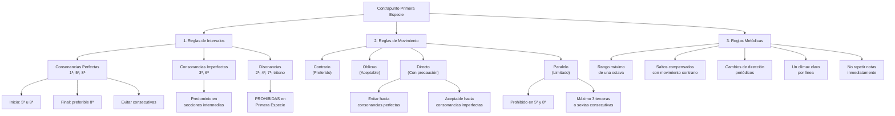

# Guía Específica: Contrapunto de Primera Especie

Esta guía se enfoca exclusivamente en el contrapunto de primera especie (nota contra nota), complementando la guía general de contrapunto. Aquí encontrarás reglas detalladas, ejemplos prácticos y un método sistemático para crear y revisar contrapunto de primera especie a partir de una progresión dada.



## 1. Fundamentos del Contrapunto de Primera Especie

### 1.1 Definición

El contrapunto de primera especie consiste en componer una línea melódica contra un canto dado (cantus firmus), donde cada nota del contrapunto corresponde exactamente a una nota del canto dado. Es la forma más básica de contrapunto y establece los fundamentos para las especies más complejas.

### 1.2 Características Principales

- **Relación 1:1**: Una nota en el contrapunto por cada nota en el canto dado
- **Solo consonancias**: Todos los intervalos armónicos deben ser consonantes
- **Independencia melódica**: Cada línea debe tener su propio contorno melódico
- **Movimiento complementario**: Las líneas deben moverse de manera complementaria

## 2. Reglas Específicas para Primera Especie

### 2.1 Reglas de Intervalos Armónicos

| Tipo de Intervalo        | Intervalos                     | Uso en Primera Especie                              |
| ------------------------ | ------------------------------ | --------------------------------------------------- |
| Consonancias Perfectas   | Unísono, 5ª justa, 8ª          | Permitidos al inicio y final; limitados en el medio |
| Consonancias Imperfectas | 3ª mayor/menor, 6ª mayor/menor | Preferidos para la mayor parte del contrapunto      |
| Disonancias              | 2ª, 4ª, 7ª, tritono            | Prohibidos en primera especie                       |

#### Reglas detalladas:

1. **Inicio**: Comenzar con consonancia perfecta (unísono, 5ª u 8ª)
2. **Final**: Terminar con unísono u 8ª (preferiblemente)
3. **Consonancias perfectas consecutivas**:
   - ❌ **Prohibido**: Dos quintas o dos octavas consecutivas
   - ❌ **Prohibido**: Dos unísonos consecutivos
   - ❌ **Prohibido**: Quinta seguida de octava o viceversa por movimiento directo
4. **Proporción de consonancias**:
   - ✅ **Recomendado**: Predominio de terceras y sextas (consonancias imperfectas)
   - ⚠️ **Limitado**: Uso moderado de quintas y octavas

### 2.2 Reglas de Movimiento entre Voces

| Tipo de Movimiento | Descripción                                 | Uso en Primera Especie                                           |
| ------------------ | ------------------------------------------- | ---------------------------------------------------------------- |
| Contrario          | Voces se mueven en direcciones opuestas     | Preferido (especialmente hacia consonancias perfectas)           |
| Oblicuo            | Una voz se mantiene, otra se mueve          | Muy bueno, siempre aceptable                                     |
| Directo            | Ambas voces se mueven en la misma dirección | Aceptable hacia consonancias imperfectas; evitar hacia perfectas |
| Paralelo           | Ambas voces mantienen el mismo intervalo    | Aceptable solo para terceras y sextas consecutivas (máx. 3)      |

#### Reglas detalladas:

1. **Movimiento hacia consonancias perfectas**:

   - ✅ **Preferido**: Movimiento contrario
   - ✅ **Aceptable**: Movimiento oblicuo
   - ❌ **Evitar**: Movimiento directo (excepto cuando la voz superior se mueve por grado conjunto)
   - ❌ **Prohibido**: Movimiento paralelo

2. **Quintas y octavas ocultas/directas**:

   - ❌ **Prohibido**: Movimiento directo hacia quinta u octava cuando la voz superior hace un salto
   - ⚠️ **Aceptable con precaución**: Movimiento directo hacia quinta u octava cuando la voz superior se mueve por grado conjunto

3. **Proporción de tipos de movimiento**:
   - ✅ **Recomendado**: Al menos 50% de movimiento contrario
   - ✅ **Aceptable**: 30-40% de movimiento oblicuo
   - ⚠️ **Limitado**: Máximo 20-30% de movimiento directo

### 2.3 Reglas Melódicas

| Aspecto Melódico | Regla                                             |
| ---------------- | ------------------------------------------------- |
| Rango            | No exceder una octava (preferiblemente)           |
| Saltos           | Compensar saltos grandes con movimiento contrario |
| Dirección        | Cambiar dirección periódicamente                  |
| Clímax           | Cada línea debe tener un punto culminante claro   |
| Repetición       | No repetir la misma nota inmediatamente           |

#### Reglas detalladas:

1. **Saltos melódicos**:

   - ✅ **Preferidos**: Segundas y terceras (grado conjunto)
   - ✅ **Aceptables**: Cuartas, quintas y sextas (con moderación)
   - ⚠️ **Limitados**: Séptimas y octavas (máximo uno por frase)
   - ❌ **Prohibidos**: Saltos mayores que octava
   - ❌ **Prohibidos**: Dos saltos grandes consecutivos en la misma dirección
   - ✅ **Requerido**: Después de un salto grande, moverse por grado conjunto en dirección contraria

2. **Contorno melódico**:

   - ✅ **Requerido**: Cada línea debe tener un único punto culminante (clímax)
   - ✅ **Requerido**: Equilibrio entre ascensos y descensos
   - ✅ **Requerido**: Cambio de dirección después de alcanzar extremos del rango
   - ❌ **Prohibido**: Patrones secuenciales obvios o repetitivos

3. **Intervalos melódicos prohibidos**:

   - ❌ **Prohibido**: Tritono melódico (cuarta aumentada/quinta disminuida)
   - ❌ **Prohibido**: Séptima mayor
   - ⚠️ **Evitar**: Saltos cromáticos

4. **Repetición**:
   - ❌ **Prohibido**: Repetir la misma nota inmediatamente
   - ⚠️ **Limitado**: Volver a una nota después de mínimo dos notas intermedias

## 3. Método Paso a Paso para Primera Especie

### 3.1 Análisis de la Progresión Base

1. **Identifica la tonalidad** de la progresión
2. **Extrae el bajo** como posible cantus firmus
3. **Identifica las funciones armónicas** (I, IV, V, etc.)
4. **Localiza los puntos cadenciales** importantes

**Ejemplo:**
Para una progresión en Do mayor: C - Am - F - G - C

- Tonalidad: Do mayor
- Bajo: C - A - F - G - C
- Funciones: I - vi - IV - V - I
- Cadencia: V-I al final

### 3.2 Planificación del Contrapunto

1. **Decide la posición** del contrapunto (superior o inferior)
2. **Establece los puntos de anclaje**:
   - Inicio: Quinta u octava
   - Final: Octava (preferible) o unísono
   - Cadencia: Conducción de sensible a tónica (7-1)
3. **Planifica el contorno general**:
   - Identifica el clímax (punto culminante)
   - Establece la dirección general (arco, ascendente, descendente)

### 3.3 Composición Sistemática

1. **Establece el inicio y final**
2. **Trabaja la cadencia final** (normalmente los últimos 2-3 compases)
3. **Completa los compases intermedios** siguiendo estas pautas:
   - Prioriza terceras y sextas
   - Alterna entre movimiento contrario, oblicuo y directo
   - Crea una línea melódica interesante con su propio contorno
   - Evita quintas y octavas consecutivas o directas

### 3.4 Lista de Verificación Exhaustiva

| Categoría                  | Elemento a Verificar                                                                     | ¿Cumple? |
| -------------------------- | ---------------------------------------------------------------------------------------- | -------- |
| **Intervalos Armónicos**   | Solo consonancias (3ª, 5ª, 6ª, 8ª)                                                       | □        |
|                            | Inicio con consonancia perfecta                                                          | □        |
|                            | Final con octava o unísono                                                               | □        |
|                            | No hay quintas u octavas consecutivas                                                    | □        |
|                            | No hay quintas u octavas directas problemáticas                                          | □        |
|                            | Predominio de terceras y sextas                                                          | □        |
| **Movimiento entre Voces** | Predominio de movimiento contrario                                                       | □        |
|                            | No hay movimiento paralelo hacia consonancias perfectas                                  | □        |
|                            | No más de tres terceras o sextas paralelas                                               | □        |
|                            | Movimiento directo hacia consonancias perfectas solo con voz superior por grado conjunto | □        |
| **Línea Melódica**         | Rango no excede una octava                                                               | □        |
|                            | Saltos grandes compensados con movimiento contrario                                      | □        |
|                            | No hay dos saltos grandes consecutivos en la misma dirección                             | □        |
|                            | No hay tritono melódico                                                                  | □        |
|                            | No hay repetición inmediata de notas                                                     | □        |
|                            | Contorno melódico con clímax claro                                                       | □        |
|                            | Cambios de dirección periódicos                                                          | □        |
| **Conducción Tonal**       | Sensible resuelve a tónica en cadencia final                                             | □        |
|                            | Progresión armónica clara y coherente                                                    | □        |

## 4. Ejemplos Detallados de Primera Especie

### 4.1 Ejemplo en Do Mayor (Contrapunto Superior)

**Canto Dado (bajo):**

```
C - G - A - F - G - C
```

**Contrapunto (soprano):**

```
G - B - C - A - B - C
```

**Análisis de intervalos:**

```
5ª - 3ª - 3ª - 3ª - 3ª - 8ª
```

**Análisis de movimientos:**

| Compases             | 1→2     | 2→3     | 3→4       | 4→5       | 5→6     |
| -------------------- | ------- | ------- | --------- | --------- | ------- |
| Soprano              | G→B     | B→C     | C→A       | A→B       | B→C     |
| Bajo                 | C→G     | G→A     | A→F       | F→G       | G→C     |
| Tipo de movimiento   | Directo | Directo | Contrario | Contrario | Directo |
| Intervalo resultante | 3ª      | 3ª      | 3ª        | 3ª        | 8ª      |

**Explicación detallada:**

1. **Compás 1**: Quinta justa (C-G) - consonancia perfecta adecuada para inicio
2. **Compás 2**: Tercera mayor (G-B) - consonancia imperfecta
3. **Compás 3**: Tercera menor (A-C) - consonancia imperfecta
4. **Compás 4**: Tercera mayor (F-A) - consonancia imperfecta
5. **Compás 5**: Tercera mayor (G-B) - consonancia imperfecta
6. **Compás 6**: Octava (C-C) - consonancia perfecta ideal para final

**Aspectos destacados:**

- Inicio con quinta y final con octava (regla cumplida)
- Predominio de terceras (consonancias imperfectas)
- Equilibrio entre movimiento directo y contrario
- Movimiento directo hacia octava final con soprano moviéndose por grado conjunto (B→C)
- Contorno melódico en arco (G→B→C→A→B→C) con clímax en el compás 3
- No hay quintas u octavas consecutivas
- No hay saltos mayores a una tercera en la línea del soprano

### 4.2 Ejemplo en La menor (Contrapunto Inferior)

**Canto Dado (soprano):**

```
A - B - C - D - C - B - A
```

**Contrapunto (bajo):**

```
A - G - A - D - E - G - A
```

**Análisis de intervalos:**

```
8ª - 3ª - 3ª - 8ª - 6ª - 3ª - 8ª
```

**Análisis detallado:**

- Inicio y final con octavas perfectas
- Uso de la sensible (G#) evitado para mantener la modalidad
- Movimiento contrario en momentos clave (compases 3-4 y 5-6)
- Salto de cuarta (G-D) compensado con movimiento por grado conjunto (D-E)
- Contorno melódico en forma de arco con punto bajo en el compás 2 y punto alto en el compás 5

## 5. Errores Comunes y Soluciones en Primera Especie

### 5.1 Quintas y Octavas Paralelas

**Error:**

```
Soprano: E - F - G
Bajo:    C - D - E
        3ª - 3ª - 3ª
```

**Problema:** Quintas paralelas (C-G y D-A) en movimiento directo.

**Solución:**

```
Soprano: E - D - G
Bajo:    C - D - E
        3ª - 8ª - 3ª
```

**Explicación:** Cambiamos la dirección del soprano para crear movimiento contrario, evitando las quintas paralelas.

### 5.2 Quintas u Octavas Ocultas

**Error:**

```
Soprano: E - G
Bajo:    C - G
        3ª - 8ª
```

**Problema:** Movimiento directo hacia octava con salto en soprano.

**Solución:**

```
Soprano: E - F
Bajo:    C - G
        3ª - 7ª
```

**Explicación:** Modificamos el soprano para moverse por grado conjunto o cambiamos a movimiento contrario.

### 5.3 Línea Melódica Problemática

**Error:**

```
Soprano: C - F - B - E
```

**Problema:** Múltiples saltos grandes consecutivos sin compensación.

**Solución:**

```
Soprano: C - F - E - D
```

**Explicación:** Después del salto de cuarta (C-F), continuamos con movimiento por grado conjunto.

## 6. Aplicación a Progresiones Modernas

### 6.1 Adaptación a Acordes con Séptimas

Para progresiones con acordes de séptima (ej. Cmaj7, G7), seguimos estos principios:

1. **Identifica las notas estructurales** de cada acorde (1-3-5-7)
2. **Selecciona una nota consonante** con el bajo para cada acorde:
   - Tercera (mayor o menor)
   - Quinta justa
   - Sexta (como inversión de la tercera)
3. **Evita colocar la séptima** en el contrapunto de primera especie (es disonante)

**Ejemplo con progresión moderna:**

```
Progresión: Cmaj7 - Am7 - Fmaj7 - G7 - Cmaj7
Bajo:       C     - A    - F     - G   - C
Soprano:    G     - C    - A     - B   - C
Intervalos: 5ª    - 3ª   - 3ª    - 3ª  - 8ª
```

### 6.2 Aplicación a Progresiones Modales

Para progresiones en modos eclesiásticos (dórico, frigio, etc.):

1. **Respeta las características interválicas** del modo
2. **Presta atención a las notas características** (ej. sexta mayor en dórico)
3. **Mantén la coherencia modal** en ambas voces

## 7. Ejercicios Prácticos de Primera Especie

### 7.1 Ejercicio Básico

**Instrucciones:**

1. Utiliza el siguiente canto dado en Do mayor
2. Crea un contrapunto superior siguiendo todas las reglas de primera especie
3. Verifica tu trabajo con la lista de comprobación

**Canto Dado:**

```
C - E - G - F - D - E - C
```

### 7.2 Ejercicio Intermedio

**Instrucciones:**

1. Convierte la siguiente progresión en un ejercicio de contrapunto de primera especie
2. Extrae el bajo como canto dado
3. Crea un contrapunto superior
4. Analiza todos los intervalos y movimientos

**Progresión (Sol mayor):**

```
G - Em - C - D - G
```

### 7.3 Ejercicio Avanzado

**Instrucciones:**

1. Utiliza el siguiente canto dado modal (dórico)
2. Crea un contrapunto inferior que respete las características del modo
3. Analiza detalladamente tu solución

**Canto Dado (dórico):**

```
D - E - F - G - A - G - F - E - D
```

## 8. Herramientas de Análisis para Primera Especie

### 8.1 Matriz de Análisis Completo

Para analizar exhaustivamente un contrapunto de primera especie, utiliza esta matriz:

| Compás | Canto Dado | Contrapunto | Intervalo | Movimiento | Observaciones                   |
| ------ | ---------- | ----------- | --------- | ---------- | ------------------------------- |
| 1      | C          | G           | 5ª        | -          | Inicio con consonancia perfecta |
| 2      | G          | B           | 3ª        | Directo    | Consonancia imperfecta          |
| 3      | A          | C           | 3ª        | Directo    | Consonancia imperfecta          |
| ...    | ...        | ...         | ...       | ...        | ...                             |

### 8.2 Diagrama de Contorno Melódico

Representa gráficamente el contorno de ambas líneas para visualizar:

- Puntos culminantes
- Equilibrio entre ascensos y descensos
- Complementariedad entre las voces

## Conclusión

El contrapunto de primera especie establece los fundamentos esenciales para todas las demás especies. Aunque es la forma más básica, dominar sus reglas es crucial antes de avanzar a especies más complejas. La práctica constante y la verificación sistemática te permitirán desarrollar intuición para crear líneas melódicas independientes que funcionen armónicamente juntas.

Al trabajar con progresiones dadas, recuerda que el objetivo no es simplemente armonizar verticalmente, sino crear dos líneas melódicas con personalidad propia que, al sonar simultáneamente, produzcan una textura musical rica y equilibrada.

---

**Nota:** Esta guía específica complementa la "Guía Práctica para Aplicar y Revisar Reglas de Contrapunto" general, enfocándose exclusivamente en la primera especie. Para avanzar a especies más complejas, consulta las guías correspondientes.
