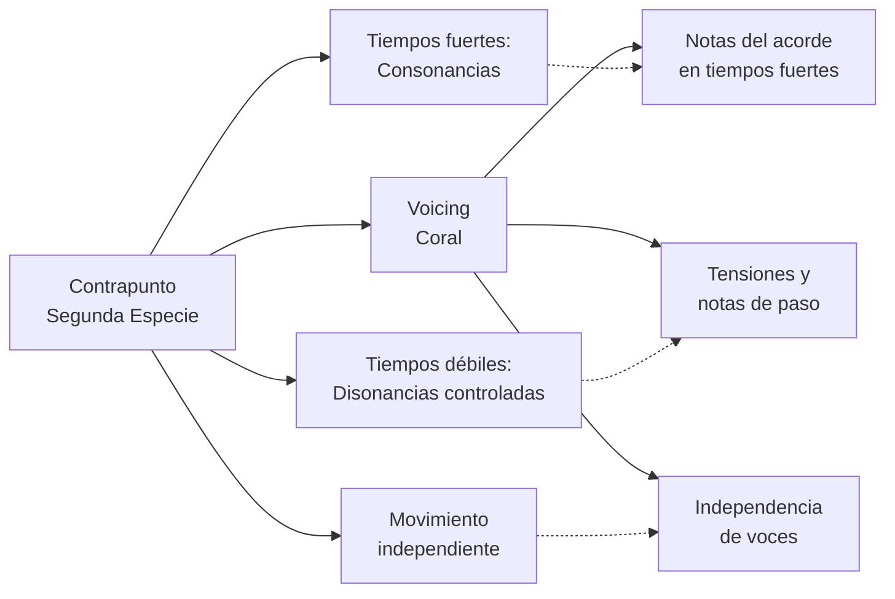
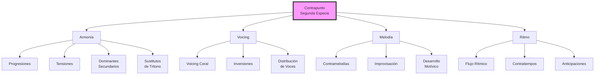

# Conexiones: Contrapunto Segunda Especie y Otros Temas Musicales

Este documento explora las conexiones entre el contrapunto de segunda especie y otros conceptos musicales que has estudiado, mostrando cómo esta técnica contrapuntística se relaciona con diversas áreas de la teoría y composición musical.

## 1. Conexión con Armonía y Progresiones

| Concepto Contrapuntístico                  | Conexión con Armonía                    | Aplicación Práctica                                   |
| ------------------------------------------ | --------------------------------------- | ----------------------------------------------------- |
| **Disonancias en tiempos débiles**         | Notas de paso en progresiones armónicas | Enriquecimiento de progresiones básicas como I-IV-V-I |
| **Consonancias en tiempos fuertes**        | Notas del acorde en tiempos fuertes     | Establece la estructura armónica fundamental          |
| **Movimiento melódico entre consonancias** | Conexión entre acordes en inversiones   | Facilita transiciones suaves entre acordes            |
| **Cadencias contrapuntísticas**            | Cadencias armónicas (auténtica, plagal) | Refuerza resoluciones armónicas                       |

### Ejemplo Práctico: Contrapunto y Progresión I-vi-IV-V-I en Do Mayor

```
Contrapunto:  -  G | E  D | A  G | B  C | C
              |    | |  | | |  | | |  | |
Canto dado:   C    | A    | F    | G    | C
Armonía:      I    | vi   | IV   | V    | I
```

**Análisis:**

- El contrapunto refuerza las funciones armónicas mientras mantiene independencia melódica
- Las notas en tiempos fuertes coinciden con notas del acorde correspondiente
- Las notas en tiempos débiles crean movimiento entre acordes
- La cadencia V-I se fortalece con el movimiento de sensible a tónica (B-C)

## 2. Conexión con Voicing y Composición Coral

| Aspecto del Contrapunto        | Aplicación en Voicing                | Relación con Reglas Corales              |
| ------------------------------ | ------------------------------------ | ---------------------------------------- |
| **Movimiento contrario**       | Evita paralelismos en voicing        | Regla coral de independencia de voces    |
| **Tratamiento de disonancias** | Notas de paso en acordes extendidos  | Preparación y resolución de tensiones    |
| **Saltos compensados**         | Distribución de voces en inversiones | Regla de conducción por camino más corto |
| **Quintas y octavas ocultas**  | Evitar quintas paralelas en voicing  | Misma regla en composición coral         |

### Conexión con Voicing Coral



**Ejemplo práctico:** Las reglas de voicing coral que estudiaste en "Repaso 11. Voicing 2 y reglas clásicas de composición" tienen su origen en los principios contrapuntísticos, especialmente en la conducción de voces y el tratamiento de disonancias.

## 3. Conexión con Tonalidades y Modos

| Concepto Contrapuntístico    | Relación con Tonalidades                 | Aplicación en Modos                                 |
| ---------------------------- | ---------------------------------------- | --------------------------------------------------- |
| **Consonancias/disonancias** | Varía según la tonalidad                 | Diferentes intervalos característicos según el modo |
| **Conducción melódica**      | Sensible a tónica en tonalidades mayores | Movimientos característicos en cada modo            |
| **Cadencias**                | Cadencias auténticas en tonalidades      | Cadencias modales específicas                       |
| **Notas de paso**            | Cromatismos en tonalidades menores       | Notas características del modo                      |

### Aplicación en Diferentes Contextos Tonales

| Tonalidad/Modo     | Características Contrapuntísticas Específicas                    |
| ------------------ | ---------------------------------------------------------------- |
| **Mayor**          | Énfasis en resolución sensible-tónica, disonancias como 4ª justa |
| **Menor Natural**  | Tratamiento especial del VII grado, flexibilidad en disonancias  |
| **Menor Armónica** | Sensible ascendida crea nuevas posibilidades de disonancias      |
| **Menor Melódica** | Diferentes tratamientos en movimiento ascendente y descendente   |
| **Modo Dórico**    | Sexto grado elevado crea nuevas opciones de notas de paso        |
| **Modo Mixolidio** | Séptimo grado rebajado afecta las cadencias contrapuntísticas    |

## 4. Conexión con Tensiones y Dominantes Secundarios

| Elemento Contrapuntístico          | Relación con Tensiones     | Aplicación en Dominantes Secundarios          |
| ---------------------------------- | -------------------------- | --------------------------------------------- |
| **Disonancias como notas de paso** | Tensiones como 9, 11, 13   | Tensiones características de dominantes       |
| **Resolución de disonancias**      | Resolución de tensiones    | Resolución de dominantes secundarios          |
| **Movimiento melódico**            | Aproximaciones a tensiones | Aproximaciones a notas objetivo en dominantes |
| **Cadencias**                      | Cadencia con tensiones     | Cadencias con dominantes secundarios          |

### Ejemplo: Contrapunto con Dominante Secundario

```
Contrapunto:  -  G | E  F# | G  F | E  D | C
              |    | |  |  | |  | | |  | |
Canto dado:   C    | C     | B    | G    | C
Armonía:      I    | V/V   | V    | I6   | I
```

**Análisis:**

- F# en tiempo débil funciona como sensible del dominante secundario (V/V)
- La resolución del dominante secundario se refleja en el movimiento contrapuntístico
- La tensión creada por el F# se resuelve de manera contrapuntística

## 5. Conexión con Sustitutos de Tritono

| Concepto Contrapuntístico     | Relación con Sustitutos de Tritono | Aplicación Práctica                           |
| ----------------------------- | ---------------------------------- | --------------------------------------------- |
| **Disonancias controladas**   | Tritono como elemento expresivo    | Uso del tritono en sustituciones              |
| **Resolución de disonancias** | Resolución del tritono             | Resolución de sustitutos                      |
| **Movimiento melódico**       | Aproximaciones cromáticas          | Aproximaciones a notas objetivo en sustitutos |

### Ejemplo de Aplicación:

El tritono (intervalo disonante por excelencia en el contrapunto) es precisamente el elemento que permite la sustitución tritónica. La forma en que el contrapunto maneja y resuelve esta disonancia establece las bases para entender cómo funcionan los sustitutos de tritono en contextos armónicos más modernos.

## 6. Conexión con Intercambios Modales

| Aspecto Contrapuntístico       | Relación con Intercambios Modales  | Aplicación                          |
| ------------------------------ | ---------------------------------- | ----------------------------------- |
| **Tratamiento de disonancias** | Diferentes disonancias según modo  | Coloración modal en contrapunto     |
| **Conducción melódica**        | Diferentes resoluciones según modo | Movimientos característicos modales |
| **Cadencias**                  | Cadencias específicas de cada modo | Cadencias con acordes prestados     |

### Ejemplo Práctico:

```
Contrapunto:  -  G | E  Eb | F  D | B  C | C
              |    | |  |  | |  | | |  | |
Canto dado:   C    | C     | Ab   | G    | C
Armonía:      I    | I     | bVI  | V    | I
```

**Análisis:**

- El Eb en tiempo débil anticipa el intercambio modal con el bVI (Ab)
- La conducción contrapuntística facilita la transición hacia y desde el acorde prestado
- La cadencia final mantiene las reglas contrapuntísticas tradicionales

## 7. Aplicación en Composición Moderna

| Técnica Contrapuntística           | Aplicación en Música Popular      | Aplicación en Jazz                   |
| ---------------------------------- | --------------------------------- | ------------------------------------ |
| **Dos notas contra una**           | Líneas de bajo en rock/pop        | Walking bass en jazz                 |
| **Disonancias en tiempos débiles** | Notas de aproximación en melodías | Aproximaciones cromáticas            |
| **Movimiento independiente**       | Contramelodías en arreglos        | Comping con movimiento independiente |
| **Silencio inicial**               | Entradas retrasadas en arreglos   | Frases con anticipación rítmica      |

### Ejemplos en Géneros Específicos:

1. **Dream Pop (Beach House)**:

   - Uso de contramelodías en segunda especie contra melodías sostenidas
   - Disonancias expresivas como elemento estilístico

2. **Folk (Lumineers, Bob Dylan)**:

   - Líneas de bajo en contrapunto de segunda especie contra melodías vocales
   - Movimiento constante en instrumentos acompañantes

3. **Música Indie (Andrew Bird, Radiohead)**:
   - Contrapunto entre instrumentos con diferentes ritmos
   - Uso de disonancias expresivas como elemento estilístico

## 8. Aplicación en Improvisación

| Concepto Contrapuntístico             | Aplicación en Improvisación                      |
| ------------------------------------- | ------------------------------------------------ |
| **Disonancias como notas de paso**    | Notas de aproximación en solos                   |
| **Movimiento constante**              | Desarrollo de líneas melódicas fluidas           |
| **Independencia melódica**            | Solos que complementan la armonía sin duplicarla |
| **Equilibrio consonancia/disonancia** | Tensión y resolución en frases improvisadas      |

### Guía Práctica para Improvisación Contrapuntística:

1. **Identifica las notas del acorde** (equivalente a consonancias en tiempos fuertes)
2. **Conecta estas notas con notas de paso** (equivalente a disonancias en tiempos débiles)
3. **Mantén un movimiento constante** similar al ritmo de segunda especie
4. **Resuelve las tensiones** siguiendo principios contrapuntísticos

---

## Diagrama de Síntesis: Contrapunto como Base de la Composición Musical



Esta visión integradora muestra cómo el contrapunto de segunda especie no es solo una técnica histórica, sino un fundamento que conecta con prácticamente todos los aspectos de la teoría musical y la composición que has estudiado hasta ahora.
