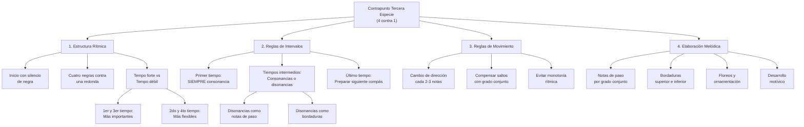

# Guía Específica: Contrapunto de Tercera Especie

Esta guía se enfoca exclusivamente en el contrapunto de tercera especie (cuatro notas contra una), complementando las guías anteriores de primera y segunda especie. Aquí encontrarás reglas detalladas, ejemplos prácticos y un método sistemático para crear y revisar contrapunto de tercera especie a partir de una progresión dada.



## 1. Fundamentos del Contrapunto de Tercera Especie

### 1.1 Definición

El contrapunto de tercera especie consiste en componer una línea melódica que contiene **cuatro notas (negras) contra cada nota del cantus firmus (redonda)**. Esta especie permite mayor elaboración melódica y flexibilidad rítmica que las especies anteriores, creando un flujo constante de movimiento musical.

### 1.2 Características Principales

- **Relación 4:1**: Cuatro notas en el contrapunto por cada nota en el canto dado
- **Inicio con silencio**: Comienza con un silencio de negra
- **Elaboración melódica**: Permite el uso de notas de paso, bordaduras y ornamentación
- **Flexibilidad en disonancias**: Permite disonancias en tiempos débiles como elaboración melódica
- **Movimiento constante**: Crea un flujo rítmico continuo

### 1.3 Estructura Temporal

En compás de 4/4 con redondas en el cantus firmus:

| Tiempo | Importancia | Tipo de nota permitida     | Observaciones                   |
| ------ | ----------- | -------------------------- | ------------------------------- |
| 1      | Fuerte      | Solo consonancias          | Base armónica del compás        |
| 2      | Débil       | Consonancias o disonancias | Como nota de paso o bordadura   |
| 3      | Semi-fuerte | Preferible consonancia     | Punto medio del compás          |
| 4      | Débil       | Consonancias o disonancias | Preparación al siguiente compás |

## 2. Reglas Específicas para Tercera Especie

### 2.1 Reglas de Inicio y Final

| Elemento             | Regla                                    | Ejemplo            |
| -------------------- | ---------------------------------------- | ------------------ |
| **Inicio**           | Silencio de negra + consonancia perfecta | Silencio + 5ª u 8ª |
| **Final**            | Conducción cadencial a octava            | 7ª → 8ª preferible |
| **Penúltimo compás** | Nota sensible en tiempo fuerte           | 7° grado → 1°      |

### 2.2 Reglas de Intervalos Armónicos por Tiempo

#### Primer Tiempo (Tempo Forte)

- ✅ **OBLIGATORIO**: Solo consonancias perfectas o imperfectas
- ✅ **Permitido**: 3ª, 5ª, 6ª, 8ª
- ❌ **Prohibido**: Cualquier disonancia (2ª, 4ª, 7ª, tritono)

#### Segundo y Cuarto Tiempo (Tiempos Débiles)

- ✅ **Permitido**: Consonancias perfectas e imperfectas
- ✅ **Permitido**: Disonancias como notas de paso o bordaduras
- ⚠️ **Condición**: Las disonancias deben estar entre movimientos por grado conjunto

#### Tercer Tiempo (Tempo Semi-forte)

- ✅ **Preferido**: Consonancias
- ⚠️ **Aceptable**: Disonancias ocasionales como notas de paso
- ❌ **Evitar**: Disonancias estáticas o no justificadas

### 2.3 Reglas de Movimiento Melódico

| Tipo de Movimiento              | Aplicación en Tercera Especie        | Frecuencia Recomendada |
| ------------------------------- | ------------------------------------ | ---------------------- |
| **Grado conjunto**              | Preferido para conectar consonancias | 60-70%                 |
| **Saltos pequeños** (3ª)        | Aceptables para variar el contorno   | 20-25%                 |
| **Saltos medianos** (4ª, 5ª)    | Con moderación, compensar después    | 10-15%                 |
| **Saltos grandes** (6ª, 7ª, 8ª) | Máximo uno por frase, compensar      | <5%                    |

#### Reglas específicas sobre saltos:

1. **Después de saltos de 3ª o mayores**: Cambiar dirección o continuar por grado conjunto
2. **Saltos consecutivos**: Evitar dos saltos en la misma dirección
3. **Compensación obligatoria**: Después de saltos de 5ª o mayores, moverse por grado conjunto en dirección contraria
4. **Cambio de dirección**: Requerido cada 2-3 notas para evitar monotonía

### 2.4 Tratamiento de Disonancias en Tercera Especie

#### Notas de Paso

- **Ubicación**: Solo en tiempos débiles (2º y 4º tiempo)
- **Aproximación**: Por grado conjunto
- **Resolución**: Por grado conjunto en la misma dirección
- **Ejemplo**: C-D-E (donde D es disonante como nota de paso)

#### Bordaduras (Floreos)

- **Bordadura superior**: Nota consonante → paso arriba (disonante) → vuelta a nota consonante
- **Bordadura inferior**: Nota consonante → paso abajo (disonante) → vuelta a nota consonante
- **Ubicación**: Segundo y/o cuarto tiempo

#### Escapadas (Cambiatas)

- **Patrón**: Grado conjunto → salto en dirección contraria
- **Uso**: Con moderación, para crear variedad melódica
- **Ubicación**: Preferiblemente en tiempos débiles

## 3. Método Paso a Paso para Tercera Especie

### 3.1 Análisis Preparatorio

1. **Identifica la tonalidad** y el modo de la progresión
2. **Extrae el cantus firmus** (normalmente el bajo)
3. **Planifica el contorno general** del contrapunto
4. **Identifica momentos clave**: cadencias, clímax, cambios de dirección

### 3.2 Estrategia de Composición

#### Paso 1: Establece la Estructura Básica

1. **Marca el inicio**: Silencio + consonancia perfecta
2. **Planifica el final**: Cadencia con sensible → tónica
3. **Establece puntos de anclaje**: Primer tiempo de cada compás con consonancias

#### Paso 2: Crea el Contorno Melódico

1. **Define el arco general**: Ascendente, descendente, o en forma de arco
2. **Identifica el clímax**: Punto más alto o más bajo de la línea
3. **Planifica cambios de dirección**: Cada 2-3 notas aproximadamente

#### Paso 3: Completa los Tiempos Débiles

1. **Añade notas de paso** para conectar consonancias por grado conjunto
2. **Introduce bordaduras** para crear variedad e interés melódico
3. **Asegura el flujo rítmico** constante de cuatro negras por compás

### 3.3 Lista de Verificación Exhaustiva

| Categoría                | Elemento a Verificar                             | ¿Cumple? |
| ------------------------ | ------------------------------------------------ | -------- |
| **Estructura Rítmica**   | Inicia con silencio de negra                     | □        |
|                          | Mantiene patrón 4:1 consistentemente             | □        |
|                          | Termina correctamente en tiempo fuerte           | □        |
| **Intervalos Armónicos** | Primer tiempo siempre consonante                 | □        |
|                          | Disonancias solo en tiempos débiles              | □        |
|                          | Disonancias correctamente preparadas y resueltas | □        |
|                          | Final con octava o unísono                       | □        |
| **Movimiento Melódico**  | Predominio de grado conjunto                     | □        |
|                          | Saltos compensados apropiadamente                | □        |
|                          | Cambios de dirección cada 2-3 notas              | □        |
|                          | No hay dos saltos grandes consecutivos           | □        |
|                          | Rango no excede octava y media                   | □        |
| **Contrapunto**          | No hay quintas u octavas paralelas               | □        |
|                          | Equilibrio entre movimiento contrario y directo  | □        |
|                          | Independencia melódica clara                     | □        |
|                          | Un clímax melódico por frase                     | □        |

## 4. Ejemplos Detallados de Tercera Especie

### 4.1 Ejemplo Básico en Do Mayor

**Cantus Firmus (bajo):**

```
C    |    G    |    A    |    F    |    G    |    C
(redonda) (redonda) (redonda) (redonda) (redonda) (redonda)
```

**Contrapunto de Tercera Especie (soprano):**

```
Silencio | G  A  B  C | C  B  A  G | A  G  F  G | F  E  D  E | D  C
         | 1  2  3  4 | 1  2  3  4 | 1  2  3  4 | 1  2  3  4 | 1  2
```

**Análisis de intervalos por tiempo fuerte:**

```
         | 5ª        | 3ª        | 3ª        | 6ª        | 8ª
```

**Análisis detallado compás por compás:**

**Compás 1** (sobre C):

- Tiempo 1: G (5ª justa) - consonancia perfecta ✓
- Tiempo 2: A (6ª mayor) - consonancia imperfecta ✓
- Tiempo 3: B (7ª mayor) - disonancia como nota de paso ✓
- Tiempo 4: C (8ª) - consonancia perfecta ✓

**Compás 2** (sobre G):

- Tiempo 1: C (4ª justa) - **Problema**: 4ª es disonante en tiempo fuerte ❌

**Corrección del Compás 2:**

```
C  B  A  G
1  2  3  4
3ª 3ª 2ª 8ª (donde la 2ª es nota de paso en tiempo débil)
```

### 4.2 Ejemplo Corregido Completo

**Cantus Firmus (bajo):**

```
C    |    G    |    A    |    F    |    G    |    C
```

**Contrapunto Corregido (soprano):**

```
Silencio | G  A  B  C | E  D  C  B | C  B  A  B | D  C  B  C | C
         | 1  2  3  4 | 1  2  3  4 | 1  2  3  4 | 1  2  3  4 | 1
```

**Análisis de intervalos en tiempos fuertes:**

```
         | 5ª        | 6ª        | 3ª        | 5ª        | 8ª
```

**Análisis de movimiento melódico:**

- Compás 1: Ascenso por grado conjunto con bordadura superior (B como nota de paso)
- Compás 2: Descenso por grado conjunto con movimiento contrario al bajo
- Compás 3: Bordadura inferior (B-A-B) creando interés melódico
- Compás 4: Preparación cadencial con movimiento hacia la resolución
- Compás 5: Resolución final en octava

### 4.3 Ejemplo con Diferentes Tipos de Elaboración

**Cantus Firmus:**

```
D    |    A    |    F    |    G    |    A    |    D
```

**Contrapunto con Elaboraciones Variadas:**

```
Silencio | A  B  C  D | C  B  A  G | A  G  F  E | F  G  A  B | A  D
         | 1  2  3  4 | 1  2  3  4 | 1  2  3  4 | 1  2  3  4 | 1  2
```

**Tipos de elaboración identificados:**

- **Compás 1**: Ascenso escalar (grado conjunto)
- **Compás 2**: Descenso escalar con cambio de dirección
- **Compás 3**: Nota de paso (F en tiempo 3) seguida de bordadura inferior (E en tiempo 4)
- **Compás 4**: Ascenso por grado conjunto con bordadura superior
- **Compás 5**: Cadencia final con salto de 4ª compensado

## 5. Técnicas Avanzadas en Tercera Especie

### 5.1 Uso de Secuencias Melódicas

Las secuencias pueden crear coherencia e interés en el contrapunto de tercera especie:

**Ejemplo de secuencia descendente:**

```
Cantus:     G    |    F    |    E    |    D
Contrapunto: E F G A | D E F G | C D E F | B C D E
```

**Reglas para secuencias:**

- Mantener la lógica armónica en los tiempos fuertes
- No extender más de 2-3 repeticiones
- Variar el patrón para evitar monotonía

### 5.2 Integración de Elementos de Especies Anteriores

**Combinación con Primera Especie:**
Ocasionalmente puedes usar valores largos para crear contraste:

```
Contrapunto: G  A  B  C | E  (blanca)  D | C  D  E  F | D
             1  2  3  4 | 1     2     3 | 1  2  3  4 | 1
```

**Combinación con Segunda Especie:**
Usar patrones de dos negras ocasionalmente:

```
Contrapunto: G  A  (blanca) | C  B  A  G | E  F  G  A | G
             1  2      3   4 | 1  2  3  4 | 1  2  3  4 | 1
```

### 5.3 Tratamiento de Modos y Cromatismo

En contextos modales o cromáticos:

1. **Respeta las características interválicas** del modo
2. **Usa alteraciones** coherentes con el estilo
3. **Mantén la integridad modal** en los puntos estructurales

## 6. Errores Comunes y Soluciones

### 6.1 Disonancias en Tiempo Fuerte

**Error:**

```
Cantus:      C
Contrapunto: F  G  A  B  (F en tiempo 1 = 4ª justa, disonante)
             1  2  3  4
```

**Solución:**

```
Cantus:      C
Contrapunto: E  F  G  A  (E en tiempo 1 = 3ª mayor, consonante)
             1  2  3  4
```

### 6.2 Falta de Dirección Melódica

**Error (monotonía ascendente):**

```
Contrapunto: C  D  E  F | G  A  B  C | D  E  F  G
             1  2  3  4 | 1  2  3  4 | 1  2  3  4
```

**Solución (con cambios de dirección):**

```
Contrapunto: C  D  E  D | E  F  E  D | E  F  G  F
             1  2  3  4 | 1  2  3  4 | 1  2  3  4
```

### 6.3 Saltos Excesivos sin Compensación

**Error:**

```
Contrapunto: C  G  D  A  (múltiples saltos grandes)
             1  2  3  4
```

**Solución:**

```
Contrapunto: C  G  F  E  (salto compensado con descenso gradual)
             1  2  3  4
```

## 7. Aplicación Creativa

### 7.1 Adaptación a Estilos Modernos

Para aplicar tercera especie en contextos modernos:

1. **Jazz**: Usar como línea de walking bass con elaboraciones rítmicas
2. **Popular**: Crear contramelodías elaboradas
3. **Clásico-romántico**: Base para desarrollos temáticos

### 7.2 Composición de Variaciones

Usar tercera especie para crear variaciones sobre temas dados:

**Tema original:**

```
C  -  G  -  A  -  F  -  G  -  C
```

**Variación en tercera especie:**

```
Silencio | G A B C | E D C B | C B A B | D C B C | C
```

## 8. Ejercicios Prácticos

### 8.1 Ejercicio Básico

**Cantus Firmus dado:**

```
F  -  C  -  D  -  Bb  -  C  -  F
```

**Tarea:**

1. Compón un contrapunto de tercera especie superior
2. Incluye al menos una nota de paso y una bordadura
3. Analiza todos los intervalos y tipos de elaboración

### 8.2 Ejercicio Intermedio

**Cantus Firmus modal (dórico):**

```
D  -  G  -  F  -  A  -  G  -  D
```

**Tarea:**

1. Compón un contrapunto de tercera especie inferior
2. Respeta las características del modo dórico
3. Crea un contorno melódico en forma de arco

### 8.3 Ejercicio Avanzado

**Progresión armónica moderna:**

```
Am7 - Dm7 - G7 - Cmaj7
```

**Tarea:**

1. Extrae un cantus firmus de la progresión
2. Compón un contrapunto de tercera especie
3. Adapta las reglas según el contexto armónico moderno

## Conclusión

El contrapunto de tercera especie representa un paso significativo hacia la elaboración melódica completa. Al dominar el flujo constante de cuatro notas contra una, desarrollas la habilidad de crear líneas melódicas elaboradas pero estructuralmente sólidas. La clave está en equilibrar el movimiento constante con la coherencia armónica, siempre respetando la jerarquía entre tiempos fuertes y débiles.

Este fundamento te preparará para abordar la cuarta especie (síncopa) y eventualmente la quinta especie (contrapunto florido), donde podrás combinar elementos de todas las especies anteriores para crear texturas contrapuntísticas complejas y expresivas.

---

**Nota:** Esta guía complementa las guías anteriores de primera y segunda especie. Se recomienda dominar completamente las especies anteriores antes de proceder con ejercicios avanzados de tercera especie.
