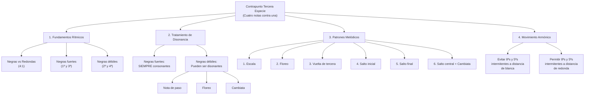

# Guía Específica Remasterizada: Contrapunto de Tercera Especie

_Basada en el método del Conservatorio Profesional de Getafe y la práctica polifónica del siglo XVI_

Esta guía remasterizada integra los principios académicos del contrapunto severo en tercera especie, enfocándose en los patrones melódicos históricos y las técnicas de composición del Renacimiento. La tercera especie representa quizá las mayores dificultades iniciales debido a que su flujo constante de negras contradice el uso establecido en la polifonía del siglo XVI, donde estos flujos eran ocasionales.



## 1. Principios Fundamentales de la Tercera Especie

### 1.1 Definición Histórica

El contrapunto de tercera especie consiste en componer una línea melódica que se mueve a **cuádruple velocidad** respecto al cantus firmus. En términos rítmicos: **negras contra redondas**. Esta especie, aunque técnicamente sencilla, presenta dificultades estilísticas particulares debido a la naturaleza excepcional de los flujos continuos de negras en la música del siglo XVI.

### 1.2 Características del Siglo XVI

En la polifonía renacentista, los flujos de negras (semínimas) eran:

- **Ocasionales**, no constantes
- **Decorativos**, para momentos de particular expresividad
- **Contextuales**, dependientes del texto y la estructura musical

El contrapunto severo en tercera especie, por tanto, representa una **abstracción pedagógica** que enfatiza el control del movimiento melódico continuo.

### 1.3 Jerarquía Temporal

| Posición en el Tactus | Denominación | Importancia | Tratamiento Armónico       |
| --------------------- | ------------ | ----------- | -------------------------- |
| **1ª negra**          | Tempo forte  | Máxima      | Solo consonancias          |
| **2ª negra**          | Tempo débil  | Mínima      | Consonancias o disonancias |
| **3ª negra**          | Tempo forte  | Alta        | Solo consonancias          |
| **4ª negra**          | Tempo débil  | Mínima      | Consonancias o disonancias |

## 2. Tratamiento de la Disonancia en Tercera Especie

### 2.1 Reglas Básicas de Disonancia

**Negras Fuertes (1ª y 3ª):**

- ✅ **OBLIGATORIO**: Siempre consonantes
- ✅ **Permitido**: 3ª, 5ª, 6ª, 8ª (incluir 4ª es disonancia)
- ❌ **Prohibido**: Cualquier disonancia

**Negras Débiles (2ª y 4ª):**

- ✅ **Permitido**: Consonancias
- ✅ **Permitido**: Disonancias correctamente tratadas
- ⚠️ **Condición**: Disonancias solo como elaboración melódica

### 2.2 Tipos de Disonancias Permitidas

#### A) Nota de Paso

- **Definición**: Disonancia formada al enlazar por grados conjuntos un marco consonante de tercera
- **Patrón**: Consonancia → grado conjunto (disonancia) → grado conjunto (consonancia)
- **Ejemplo**: C-D-E (donde D es disonante como nota de paso)

```abc
X:26
T:Ejemplo: Nota de Paso (D disonante en 2º tiempo)
M:4/4
L:1/4
K:C
V:1 clef=treble
C D E F |
V:2 clef=bass
C2 C2 |
w:Cons. Dis. Cons. Cons.
```

#### B) Floreo (Bordadura)

- **Definición**: Disonancia formada al realizar un movimiento de ida y vuelta a una nota vecina
- **Patrón**: Nota → vecina disonante → vuelta a la nota original
- **Tipos**: Floreo superior e inferior

```abc
X:27
T:Ejemplo: Floreo Superior (D disonante en 2º tiempo)
M:4/4
L:1/4
K:C
V:1 clef=treble
C D C E |
V:2 clef=bass
C2 C2 |
w:Cons. Dis. Cons. Cons.
```

#### C) Cambiata

- **Definición**: Caso especial de escapada que enlaza un marco consonante de cuarta descendente
- **Patrón**: Nota superior → segunda inferior → tercera inferior (marco de 4ª desc.)
- **Particularidad**: Técnica específica del siglo XVI de gran importancia estilística

```abc
X:28
T:Ejemplo: Cambiata (F-E-C-D característico del s. XVI)
M:4/4
L:1/4
K:C
V:1 clef=treble
F E C D |
V:2 clef=bass
C2 C2 |
w:Cons. Cons. Dis. Cons.
```

## 3. Los Seis Patrones Melódicos Fundamentales

Según la práctica del siglo XVI, el repertorio de fórmulas melódicas en tercera especie se reduce a **seis tipos fundamentales**:

### 3.1 Patrón 1: Escala

**Descripción**: Movimiento por grados conjuntos ascendente o descendente

```abc
X:1
T:Patrón 1 - Escala Ascendente (Tercera Especie)
M:4/4
L:1/4
K:C
C D E F |
```

```abc
X:2
T:Patrón 1 - Escala Descendente (Tercera Especie)
M:4/4
L:1/4
K:C
F E D C |
```

**Características:**

- Más simple y frecuente
- Permite integración natural de notas de paso
- Base para la mayoría de pasajes en tercera especie

### 3.2 Patrón 2: Floreo

**Descripción**: Movimiento de ornamentación alrededor de una nota central

```abc
X:3
T:Patrón 2 - Floreo Superior
M:4/4
L:1/4
K:C
C D C B |
```

```abc
X:4
T:Patrón 2 - Floreo Inferior
M:4/4
L:1/4
K:C
C B C D |
```

```abc
X:5
T:Patrón 2 - Floreo Descendente (Preferido s. XVI)
M:4/4
L:1/4
K:C
D C D E |
```

**Observaciones históricas:**

- El floreo descendente era predominante en la práctica renacentista
- Usado principalmente para momentos de particular elegancia melódica

### 3.3 Patrón 3: Vuelta de Tercera

**Descripción**: Recorrer una tercera de arriba a abajo por grados conjuntos y salto

```abc
X:6
T:Patrón 3 - Vuelta de Tercera (Versión USABLE)
M:4/4
L:1/4
K:C
E D C E |
```

```abc
X:7
T:Patrón 3 - Versión PROHIBIDA (salto ascendente en parte débil)
M:4/4
L:1/4
K:C
E C D E |
w:❌ ❌ ❌ ❌
```

```abc
X:8
T:Patrón 3 - Versión PROHIBIDA (salto ascendente en parte débil)
M:4/4
L:1/4
K:C
C D E C |
w:❌ ❌ ❌ ❌
```

```abc
X:9
T:Patrón 3 - Versión PROBLEMÁTICA (puede causar disonancias)
M:4/4
L:1/4
K:C
C E D C |
w:⚠️ ⚠️ ⚠️ ⚠️
```

**Limitaciones importantes:**

- Solo la primera versión es completamente usable en contrapunto severo
- Demuestra las restricciones específicas de la tercera especie
- La cuarta versión puede causar disonancias en tiempos fuertes

### 3.4 Patrón 4: Salto Inicial (2ª negra)

**Descripción**: Salto descendente en la segunda negra con diferentes continuaciones

```abc
X:10
T:Patrón 4 - Salto + Relleno
M:4/4
L:1/4
K:C
C G A B |
w:1 2 3 4
```

```abc
X:11
T:Patrón 4 - Salto + Compensación
M:4/4
L:1/4
K:C
C G F E |
w:1 2 3 4
```

```abc
X:12
T:Patrón 4 - Salto + Repetición
M:4/4
L:1/4
K:C
C G G A |
w:1 2 3 4
```

**Reglas:**

- Solo saltos descendentes en posiciones débiles
- Compensar con movimiento contrario posterior
- Evitar saltos de más de quinta

### 3.5 Patrón 5: Salto Final (4ª negra)

**Descripción**: Salto descendente en la cuarta negra como cierre de línea

```abc
X:13
T:Patrón 5 - Cierre con Tercera (PREFERIBLE)
M:4/4
L:1/4
K:C
C B A F |
w:1 2 3 4
```

```abc
X:14
T:Patrón 5 - Cierre con Cuarta (LÍMITE ESTILÍSTICO)
M:4/4
L:1/4
K:C
C B A E |
w:1 2 3 4
```

**Observaciones:**

- Saltos de cuarta están en el límite de lo permisible
- Requieren compensación ascendente posterior
- Los saltos de tercera son preferibles estilísticamente

### 3.6 Patrón 6: Salto Central + Cambiata

**Descripción**: Saltos en la tercera negra (mitad del compás) con énfasis en la técnica cambiata

```abc
X:15
T:Patrón 6 - Salto Central Simple
M:4/4
L:1/4
K:C
C D G F |
w:1 2 3 4
```

```abc
X:16
T:Patrón 6 - Cambiata Descendente (CARACTERÍSTICO s. XVI)
M:4/4
L:1/4
K:C
F E C D |
w:1 2 3 4
```

```abc
X:17
T:Patrón 6 - Cambiata Ascendente (menos común)
M:4/4
L:1/4
K:C
C D F E |
w:1 2 3 4
```

**Importancia estilística:**

- La cambiata es fundamental en el estilo del siglo XVI
- Crea elegantes conexiones melódicas
- Debe incluirse ocasionalmente para autenticidad histórica

## 4. Reglas Específicas de Movimiento Melódico

### 4.1 Restricciones en Saltos

**Saltos Ascendentes:**

- ✅ **Permitidos**: Solo en negras fuertes (1ª y 3ª)
- ❌ **Prohibidos**: En negras débiles (2ª y 4ª)
- **Objetivo**: Evitar efectos sincopados indeseados

**Saltos Descendentes:**

- ✅ **Permitidos**: En cualquier posición
- ⚠️ **Condición**: Siempre compensar con movimiento contrario
- **Límite**: Preferiblemente no más de quinta

### 4.2 Compensación Obligatoria

**Después de saltos de 3ª o mayores:**

- Cambiar dirección inmediatamente
- Continuar por grados conjuntos preferiblemente
- No realizar saltos compuestos (varios saltos consecutivos)

**Fórmulas de integración:**

- **Ascendente**: 3-2-2... o excepcionalmente 4-2-2...
- **Descendente**: ...2-2-3 o excepcionalmente ...2-2-4
- El salto debe estar siempre en la base del movimiento

### 4.3 Repertorio Melódico Limitado

Debido a las restricciones severas, el repertorio efectivo se reduce a:

1. **60%**: Movimientos escalares (patrón 1)
2. **20%**: Floreos y bordaduras (patrón 2)
3. **10%**: Vueltas de tercera (patrón 3, versión usable)
4. **5%**: Saltos iniciales compensados (patrón 4)
5. **3%**: Saltos finales (patrón 5)
6. **2%**: Cambiatas y saltos centrales (patrón 6)

## 5. Movimiento Armónico y Quintas/Octavas

### 5.1 Regla Específica de Tercera Especie

**Octavas y quintas intermitentes:**

- ❌ **Prohibidas**: A distancia de blanca (entre negras fuertes contiguas)
- ✅ **Permitidas**: A distancia de redonda (entre negras fuertes de diferentes compases)

### 5.2 Ejemplos de Aplicación

**Problemático (distancia de blanca):**

```
Compás 1:    C     vs    C
            1ª     3ª
            8ª     8ª  ❌ (octavas intermitentes a distancia de blanca)
```

**Correcto (distancia de redonda):**

```
Compás 1:     C              Compás 2:     G
             1ª                           1ª
             8ª                           5ª  ✅
```

## 6. Metodología de Trabajo: Secuencia de 3-4 Sesiones

### 6.1 Sesión 1: Ejercicios Preparatorios

**Objetivo**: Verificar asimilación de normas y entrenar la búsqueda de soluciones

**Material**: Fragmentos de cantus firmus de **tres notas**

**Tarea**: Encontrar **dos soluciones distintas** para cada fragmento

**Ejemplo:**

```abc
X:18
T:Ejercicio Preparatorio - Cantus Firmus
M:4/4
L:1/1
K:C
F | G | C |]
```

```abc
X:19
T:Solución A - Contrapunto Tercera Especie
M:4/4
L:1/4
K:C
z A B C D | E D C B | E D C z |]
w:Silencio 1 2 3 4 1 2 3 4 1 2 3
```

```abc
X:20
T:Solución B - Contrapunto Tercera Especie
M:4/4
L:1/4
K:C
z D E F G | C B A G | G E C z |]
w:Silencio 1 2 3 4 1 2 3 4 1 2 3
```

**Criterios:**

- Usar consonancias imperfectas también en notas inicial y final (no es cantus firmus completo)
- Escribir debajo de cada nota el intervalo formado
- Maximizar movimientos por grado conjunto
- Cumplir todas las reglas de saltos

### 6.2 Sesión 2: Cantus Firmus Convencional

**Objetivo**: Aplicar reglas en contexto formal completo

**Material**: Dos cantus firmus completos

**Criterios de evaluación**:

1. **ARMONÍA**: Corrección en el tratamiento de consonancias y disonancias
2. **VARIEDAD**: Uso equilibrado de los diferentes patrones melódicos
3. **CLÍMAX**: Un punto melódico más alto o más bajo por frase
4. **SORPRESA**: Elementos inesperados que enriquezcan el discurso

**Estructura formal:**

- **Inicio**: Consonancia perfecta obligatoria
- **Desarrollo**: Aplicación variada de los 6 patrones
- **Conclusión**: Fórmula cadencial característica (ver cuarta especie)
- **Nota final**: Redonda en consonancia perfecta

### 6.3 Sesión 3: Ejercicio de Disminución

**Objetivo**: Conocer técnica improvisatoria renacentista

**Concepto**: Adaptar un contrapunto de primera especie a tercera especie

**Método**:

1. Partir de un contrapunto simple (primera especie) ya compuesto
2. El nuevo contrapunto debe pasar por las mismas notas del original
3. Si no en la primera negra, sí en alguna posterior de cada compás
4. El resultado es una ornamentación del contrapunto original

**Ejemplo:**

```abc
X:21
T:Ejercicio de Disminución - Original (Primera Especie)
M:4/4
L:1/1
K:C
G | C | E | G |]
```

```abc
X:22
T:Ejercicio de Disminución - Tercera Especie (Ornamentado)
M:4/4
L:1/4
K:C
z G A B C | C B A G | E F G A | F E D G |]
w:Silencio 1 2 3 4 1 2 3 4 1 2 3 4 1 2 3 4
```

### 6.4 Sesión 4: Ejercicio Libre

**Objetivo**: Integración creativa de las tres primeras especies

**Libertades permitidas**:

- Combinar libremente primera, segunda y tercera especies
- Usar cadencias intermedias en distintos grados
- Introducir imitaciones sencillas
- Extender a piezas de mayor longitud

**Requisito práctico**: Las piezas deben poder ser cantadas o tocadas en grupo, preferiblemente con instrumentos monódicos

## 7. Análisis de Repertorio: Canciones Sacras de Orlando di Lasso

### 7.1 Material de Estudio Recomendado

**Fuente**: _Canciones sacras a dos voces_ (1577) de Orlando di Lasso

**Enfoque analítico**:

- Diseño melódico-rítmico de las voces
- Tratamiento específico de la disonancia
- Aplicación práctica de los 6 patrones melódicos
- Contexto estilístico real del siglo XVI

### 7.2 Elementos a Identificar

1. **Flujos de negras**: Cuándo y por qué se usan
2. **Patrones melódicos**: Cuáles de los 6 tipos aparecen
3. **Tratamiento de disonancias**: Notas de paso, floreos, cambiatas
4. **Integración textual**: Cómo la música sirve al texto
5. **Efectos expresivos**: Momentos de particular intensidad melódica

## 8. Ejercicios Progresivos

### 8.1 Ejercicio Básico: Cantus Firmus en Do Mayor

**Cantus Firmus dado:**

```abc
X:23
T:Ejercicio Básico - Cantus Firmus en Do Mayor
M:4/4
L:1/1
K:C
C | G | A | F | G | C |]
```

**Requisitos específicos:**

1. Usar al menos 4 de los 6 patrones melódicos
2. Incluir una cambiata
3. Crear un arco melódico coherente
4. Aplicar fórmula cadencial apropiada

### 8.2 Ejercicio Intermedio: Modo Dórico

**Cantus Firmus modal:**

```abc
X:24
T:Ejercicio Intermedio - Cantus Firmus en Modo Dórico
M:4/4
L:1/1
K:D dor
D | G | F | A | G | D |]
```

**Desafíos adicionales:**

1. Respetar las características interválicas del modo dórico
2. Usar el Si♭ apropiadamente según el contexto
3. Crear contraste entre secciones ascendentes y descendentes
4. Integrar floreos característicos del modo

### 8.3 Ejercicio Avanzado: Disminución Libre

**Base (Primera especie):**

```abc
X:25
T:Ejercicio Avanzado - Base para Disminución Libre
M:4/4
L:1/1
K:C
E | C | D | G | C |]
```

**Tarea de disminución:**

1. Crear versión en tercera especie que mantenga la estructura armónica
2. Usar ornamentación histórica apropiada
3. Integrar elementos de segunda especie ocasionalmente
4. Justificar cada decisión compositiva según el estilo del siglo XVI

## 9. Errores Comunes y Correcciones Históricas

### 9.1 Anachronismos Estilísticos

**Error**: Usar patrones melódicos de épocas posteriores

```
❌ Incorrecto: C D# E F G A B C (cromatismo moderno)
✅ Correcto:   C D  E F E D E F (patrón renacentista)
```

**Error**: Exceso de saltos "expresivos"

```
❌ Incorrecto: C G E C F D (demasiados saltos)
✅ Correcto:   C D E F E D C D (predominio escalar)
```

### 9.2 Problemas de Flujo Rítmico

**Error**: Crear acentos inadecuados

```
❌ Incorrecto: C E D F (saltos en tiempos débiles)
✅ Correcto:   C E F G (salto en tiempo fuerte)
```

### 9.3 Tratamiento Inadecuado de Disonancias

**Error**: Disonancias sin preparación

```
❌ Incorrecto: C F# G A (tritono sin tratamiento)
✅ Correcto:   C D  E F (nota de paso correcta)
```

## 10. Aplicación a Composición Moderna

### 10.1 Adaptación Jazz/Popular

**Principios aplicables:**

- Control del flujo melódico continuo
- Jerarquía entre tiempos fuertes y débiles
- Ornamentación sistemática de líneas básicas
- Integración de notas de paso y bordaduras

### 10.2 Líneas de Bajo Elaboradas

Usar tercera especie para crear walking bass lines:

```
Acorde: Cmaj7
Bajo básico: C
Elaboración 3ª especie: C D E F (manteniendo función armónica)
```

### 10.3 Contramelodías en Música Camerística

Aplicar patrones melódicos para crear contramelodías independientes pero complementarias en música de cámara moderna.

## 11. Ejemplo Completo de Tercera Especie

### 11.1 Contrapunto Modelo en Do Mayor

```abc
X:29
T:Ejemplo Completo - Cantus Firmus
M:4/4
L:1/1
K:C
V:1 clef=treble
%%staves {1 2}
z1 | z1 | z1 | z1 | z1 | z1 |
V:2 clef=bass
C | G | A | F | G | C |]
```

```abc
X:30
T:Ejemplo Completo - Contrapunto de Tercera Especie
M:4/4
L:1/4
K:C
V:1 clef=treble name="Contrapunto"
%%staves {1 2}
z G A B C | E D C B | C B A B | D C B C | B A G F | E D E C |]
w:- 1 2 3 4 1 2 3 4 1 2 3 4 1 2 3 4 1 2 3 4 1 2 3 4
V:2 clef=bass name="Cantus Firmus"
C1 | G1 | A1 | F1 | G1 | C1 |]
```

### 11.2 Análisis del Ejemplo

**Compás 1 (sobre C):**

- Patrón usado: Escala ascendente (Patrón 1)
- Intervalos: 5ª-6ª-7ª-8ª
- Nota de paso: B (7ª) en tiempo débil

**Compás 2 (sobre G):**

- Patrón usado: Escala descendente (Patrón 1)
- Intervalos: 6ª-5ª-4ª-3ª
- Movimiento contrario al cantus firmus

**Compás 3 (sobre A):**

- Patrón usado: Floreo (Patrón 2)
- Intervalos: 3ª-2ª-unísono-2ª
- Nota de paso: A (unísono) como punto de reposo

**Compás 4 (sobre F):**

- Patrón usado: Salto central (Patrón 6)
- Intervalos: 6ª-5ª-4ª-5ª
- Cambio de dirección en tiempo fuerte

**Compás 5 (sobre G):**

- Patrón usado: Escala descendente (Patrón 1)
- Intervalos: 3ª-2ª-unísono-7ª
- Preparación cadencial

**Compás 6 (sobre C):**

- Patrón usado: Cadencia con floreo
- Intervalos: 3ª-2ª-3ª-unísono
- Resolución final en octava

## Conclusión: La Tercera Especie como Puente Estilístico

El dominio de la tercera especie representa un momento crucial en el desarrollo contrapuntístico. A diferencia de las especies anteriores, aquí la técnica se encuentra directamente con las limitaciones y posibilidades expresivas del estilo histórico. Los seis patrones melódicos no son abstracciones teóricas, sino herramientas compositivas reales extraídas de la práctica musical del Renacimiento.

La aparente simplicidad del "cuatro contra uno" esconde una complejidad estilística que prepara para entender que el contrapunto no es solo técnica, sino **lenguaje musical específico de una época**. Esta comprensión será fundamental para abordar la cuarta especie (síncopa) y la quinta especie (floridus), donde la libertad compositiva debe equilibrarse con la coherencia estilística.

El repertorio limitado de fórmulas melódicas en tercera especie, lejos de ser una restricción, demuestra cómo la creatividad musical surge no de la libertad absoluta, sino del **dominio completo de un vocabulario específico**. Esta lección trasciende el contrapunto histórico y se aplica a cualquier idioma musical que se desee dominar con autenticidad y profundidad.

---

**Conexión con otros temas:** Esta guía se relaciona directamente con los contenidos de primera y segunda especie ya estudiados, y prepara para la comprensión de las reglas de voicing coral y las técnicas de ornamentación melódica que aparecen en nuestros estudios de composición moderna.
