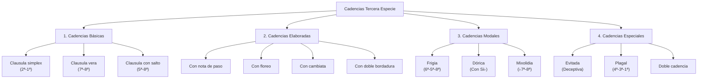

_Todas las alternativas para terminar correctamente un contrapunto de tercera especie_

El cierre de un contrapunto de tercera especie es un momento crucial que requiere especial atención. A diferencia de las especies anteriores, la tercera especie ofrece múltiples alternativas cadenciales que permiten gran variedad expresiva manteniendo la corrección estilística. Esta guía analiza sistemáticamente todas las opciones disponibles.



## 1. Principios Generales de las Cadencias en Tercera Especie

### 1.1 Requisitos Universales

| Elemento         | Requisito                     | Observaciones                    |
| ---------------- | ----------------------------- | -------------------------------- |
| **Nota final**   | Unísono u octava              | Consonancia perfecta obligatoria |
| **Aproximación** | Por grado conjunto preferible | Evitar saltos al final           |
| **Sensible**     | En penúltimo compás           | 7° grado dirigido al 1°          |
| **Última nota**  | Redonda                       | Cambio rítmico para el final     |

### 1.2 Estructura Cadencial Típica

**Fórmula básica:**

- **Penúltimo compás**: Establecer tensión dirigida (sensible)
- **Último compás**: Resolución a tónica con elaboración en tercera especie
- **Transición rítmica**: Últimas notas en valores más largos

### 1.3 Nota rápida sobre notación ABC

- Métrica: `M:4/4` y `L:1/4`. Con esto, semibreve = `4`, blanca = `2`, negra = silencio de cifra.
- Dos voces: `V:1` (Contrapunto, treble), `V:2` (Cantus firmus, bass). Se visualizan juntas con `%%staves {1 2}`.
- Último compás suele pasar a valores largos (blancas/semibreve) en la voz superior para el cierre.

## 2. Cadencias Básicas (Clausulae)

### 2.1 Clausula Simplex (2ª-1ª)

**Descripción:** La cadencia más simple, descendiendo por grado conjunto hacia la tónica.

**Pasos:**

- Define un CF que termine en la tónica (bajo con nota final).
- Prepara 2→1 en la voz superior entre el último pulso del penúltimo compás y el inicio del último.
- Cierra en 8ª o unísono con semibreve.

```abc
X:1
T:Clausula Simplex (2-1) - Tercera Especie (8 compases)
M:4/4
L:1/4
Q:1/4=84
K:C
V:1 clef=treble name="Contrapunto"
V:2 clef=bass name="Cantus Firmus"
%%staves {1 2}
V:2
C4 | D4 | E4 | F4 | G4 | A4 | G4 | C4 |
V:1
E G E G | F A F A | G B G B | A c' A c' | B d' B d' | c' e' c' e' | b d' b d' | c'4 |
```

**Características:**

- **Más común** en el repertorio del siglo XVI
- **Movimiento natural** descendente
- **Fácil de ejecutar** sin problemas técnicos
- **Sonoridad satisfactoria** y conclusiva

### 2.2 Clausula Vera (7ª-8ª)

**Descripción:** Cadencia con sensible ascendente, más expresiva y dirigida.

**Pasos:**

- Mantén CF en la tónica al final.
- Coloca la sensible (7º) en la voz superior al final del penúltimo compás.
- Resuelve 7→8 por grado ascendente en el último compás.

```abc
X:2
T:Clausula Vera (7-8) - Tercera Especie (8 compases)
M:4/4
L:1/4
Q:1/4=84
K:C
V:1 clef=treble name="Contrapunto"
V:2 clef=bass name="Cantus Firmus"
%%staves {1 2}
V:2
C4 | D4 | E4 | F4 | G4 | A4 | G4 | C4 |
V:1
E G E G | F A F A | G B G B | A c' A c' | B d' B d' | c' e' c' e' | b e' d' b | c'4 |
```

**Características:**

- **Más expresiva** que la clausula simplex
- **Sensible dirigida** (B natural en Do mayor)
- **Movimiento ascendente** hacia la resolución
- **Preferida en contextos tonales** más que modales

### 2.3 Clausula con Salto (5ª-8ª)

**Descripción:** Cadencia que incluye un salto melódico previo a la resolución final.

**Pasos:**

- En el último compás, forma 5ª en el primer pulso y salta a 8ª en el tercero.
- Prepara el salto con movimiento contrario en el compás anterior.
- Mantén consonancias en pulsos fuertes.

```abc
X:3
T:Clausula con Salto (5ª-8ª) - Tercera Especie (8 compases)
M:4/4
L:1/4
Q:1/4=80
K:C
V:1 clef=treble name="Contrapunto"
V:2 clef=bass name="Cantus Firmus"
%%staves {1 2}
V:2
C4 | D4 | E4 | F4 | G4 | A4 | G4 | C4 |
V:1
E G E G | F A F A | G B G B | A c' A c' | B d' B d' | c' e' c' e' | d' c' b d' | g2 c'2 |
```

**Características:**

- **Salto preparado/compensado**
- **Efecto más dramático**
- **Uso moderado** para realce

## 3. Cadencias Elaboradas con Ornamentación

### 3.1 Cadencia con Nota de Paso

**Descripción:** Clausula básica ornamentada con nota de paso en tiempo débil.

**Pasos:**

- Asegura consonancias en pulsos 1 y 3.
- Inserta notas de paso por grado en pulsos 2 y/o 4.
- Mantén la resolución de la cláusula elegida (simplex o vera).

```abc
X:4
T:Cadencia con Nota de Paso - Tercera Especie (8 compases)
M:4/4
L:1/4
Q:1/4=84
K:C
V:1 clef=treble name="Contrapunto"
V:2 clef=bass name="Cantus Firmus"
%%staves {1 2}
V:2
C4 | D4 | E4 | F4 | G4 | A4 | G4 | C4 |
V:1
E F G A | F G A A | G A B c' | A B c' c' |
B c' d' e' | c' d' e' e' | d' e' f' e' | c'4 |
```

**Análisis:**

- **Nota de paso** en tiempos débiles (2/4)
- **Consonancias fuertes** preservadas
- **Cierre limpio** al final

### 3.2 Cadencia con Floreo

**Descripción:** Ornamentación de la cadencia mediante bordadura superior o inferior.

**Pasos:**

- Bordadura en tiempo débil: nota vecina que vuelve a la principal.
- Consonancias en pulsos fuertes.
- Conduce al cierre final (8ª/unísono).

```abc
X:5
T:Cadencia con Floreo Superior - Tercera Especie (8 compases)
M:4/4
L:1/4
Q:1/4=80
K:C
V:1 clef=treble name="Contrapunto"
V:2 clef=bass name="Cantus Firmus"
%%staves {1 2}
V:2
C4 | D4 | E4 | F4 | G4 | A4 | G4 | C4 |
V:1
E F E G | F G F A | G A G B | A B A c' |
B c' B d' | c' d' c' e' | d' e' d' b | c'4 |
```

```abc
X:6
T:Cadencia con Floreo Inferior - Tercera Especie (8 compases)
M:4/4
L:1/4
Q:1/4=80
K:C
V:1 clef=treble name="Contrapunto"
V:2 clef=bass name="Cantus Firmus"
%%staves {1 2}
V:2
C4 | D4 | E4 | F4 | G4 | A4 | G4 | C4 |
V:1
E D E G | F E F A | G F G B | A G A c' |
B a B d' | c' b c' e' | d' c' d' b | c'4 |
```

**Características del floreo cadencial:**

- **Floreo superior**: Más elegante y preferido
- **Floreo inferior**: Más intenso pero menos común
- **Ubicación**: Preferentemente tiempos débiles
- **Resolución**: Siempre a consonancia fuerte

### 3.3 Cadencia con Cambiata

**Descripción:** Ornamentación cadencial característica del s. XVI.

**Pasos:**

- Emplea patrón de 4 notas con disonancias en tiempos débiles.
- Ubica la cambiata en el penúltimo compás para conducir al cierre.
- Asegura movimiento por grado en disonancias.

```abc
X:7
T:Cadencia con Cambiata - Tercera Especie (8 compases)
M:4/4
L:1/4
Q:1/4=76
K:C
V:1 clef=treble name="Contrapunto"
V:2 clef=bass name="Cantus Firmus"
%%staves {1 2}
V:2
C4 | D4 | E4 | F4 | G4 | A4 | G4 | C4 |
V:1
E G E G | F A F A | G B G B | A c' A c' |
B d' B d' | e' d' c' d' | b d' c' b | c'4 |
```

**Análisis de la cambiata cadencial:**

- **Patrón** típico: consonancia – paso (dis.) – salto de 3ª a consonancia – paso (dis.) – retorno
- **Función**: Retardar y embellecer la resolución
- **Efecto**: Expresivo y estilístico

### 3.4 Cadencia con Doble Bordadura

**Descripción:** Elaboración máxima usando dos bordaduras consecutivas.

**Pasos:**

- Encadena bordadura superior e inferior en tiempos débiles.
- Evita sobrecargar si la pieza es corta.
- Cierra con semibreve final.

```abc
X:8
T:Cadencia con Doble Bordadura - Elaboración Máxima
M:4/4
L:1/4
Q:1/4=76
K:C
V:1 clef=treble name="Contrapunto"
V:2 clef=bass name="Cantus Firmus"
%%staves {1 2}
V:2
F4 | E4 | F4 | C4 |
V:1
A B A c' | G A G e | B A B A | F E F E D C B C C4 |
```

**Características:**

- **Máxima ornamentación** permitida
- **Dos bordaduras**: superior e inferior
- **Complejidad rítmica** controlada
- **Uso**: Contextos elaborados

## 4. Cadencias Modales Específicas

### 4.1 Cadencia Frigia (Mi como final)

**Descripción:** Cadencia característica del modo frigio (final en E), con 6ª→5ª sobre el final y bajo F→E.

**Pasos:**

- Evita sensible (no D#).
- Prepara F→E en el bajo justo antes del final.
- Voz superior: 6ª→5ª sobre E y cierra a 8ª/unísono.

```abc
X:9
T:Cadencia Frigia (E phr) - 6ª→5ª
M:4/4
L:1/4
Q:1/4=68
K:E phr
V:1 clef=treble name="Contrapunto"
V:2 clef=bass name="Cantus Firmus"
%%staves {1 2}
V:2
E4 | G4 | A4 | B4 | C4 | B4 | F4 | E4 |
V:1
G B G B | A c' A c' | B d' B d' | c' e' c' e' |
d' f' d' f' | c' e' c' e' | c'2 b2 | c'2 b2 |
```

**Particularidades:**

- **Sin sensible dirigida**
- **Movimiento 6ª-5ª** modal
- **Sonoridad arcaica** y melancólica

### 4.2 Cadencia Dórica (Re como final)

**Descripción:** Cadencia en modo dórico con B♭ en el discurso y C♯ solo cadencial.

**Pasos:**

- Mantén 7º menor modal (C natural) durante el discurso.
- Introduce C♯ únicamente para el gesto cadencial.
- Respeta color modal con B♭ en el desarrollo.

```abc
X:10
T:Cadencia Dórica (D dor) - sensible artificiale al final
M:4/4
L:1/4
Q:1/4=72
K:D dor
V:1 clef=treble name="Contrapunto"
V:2 clef=bass name="Cantus Firmus"
%%staves {1 2}
V:2
D4 | F4 | G4 | A4 | B,4 | C4 | A,4 | D4 |
V:1
F A F A | G B G B | A c' A c' | B _B c' A |
c' d' c' e' | d' e' d' f' | e' f' e' ^C' | D'4 |
```

**Características específicas:**

- **B♭ modal** en el discurso
- **C♯ cadencial** al final
- **Equilibrio modal–tonal** propio del dórico

### 4.3 Cadencia Mixolidia (Sol como final)

**Descripción:** Cadencia en modo mixolidio con 7º menor (F natural) y F♯ solo cadencial.

**Pasos:**

- Mantén F natural durante el discurso.
- Usa F♯ para reforzar el cierre si se desea.
- Evita cromatizar todo el fragmento.

```abc
X:11
T:Cadencia Mixolidia (G mix) - 7º menor modal con F# cadencial opcional
M:4/4
L:1/4
Q:1/4=76
K:G mix
V:1 clef=treble name="Contrapunto"
V:2 clef=bass name="Cantus Firmus"
%%staves {1 2}
V:2
G,4 | A,4 | B,4 | C4 | D4 | C4 | D4 | G,4 |
V:1
B d' B d' | c' e' c' e' | d' f' d' f' | e' g' e' g' |
f' a' f' a' | e' g' e' g' | f' a' g' ^F' | G'4 |
```

**Elementos modales:**

- **F natural** en el discurso
- **F♯ solo cadencial** (sensible artificiale)
- **Carácter brillante** con final modal

## 5. Cadencias Especiales y Avanzadas

### 5.1 Cadencia Evitada (Deceptiva)

**Descripción:** Evita la resolución esperada hacia VI grado para prolongar.

**Pasos:**

- Prepara una auténtica (sensible incluida si procede).
- Desvía el bajo a VI en el último compás.
- Mantén la tensión para continuar la frase.

```abc
X:12
T:Cadencia Evitada - Resolución a VI (La menor en C mayor)
M:4/4
L:1/4
Q:1/4=80
K:C
V:1 clef=treble name="Contrapunto"
V:2 clef=bass name="Cantus Firmus"
%%staves {1 2}
V:2
C4 | G4 | C4 | C4 | A,4 | A,4 | E4 | A,4 |
V:1
E G E G | F A F A | G B G B | a b c' b |
g a b c' | e' d' c' b | c' b a c' | c'4 |
```

**Función:**

- **Prolonga** el discurso
- **Evita** el final en I
- **Resuelve** en VI (La menor)

### 5.2 Cadencia Plagal

**Descripción:** Cierre alternativo usando IV→I en el bajo.

**Pasos:**

- Prepara IV en el penúltimo compás.
- Cierra con I y voz superior a 8ª/unísono.
- Carácter solemne y suave.

```abc
X:13
T:Cadencia Plagal (IV-I) - Tercera Especie
M:4/4
L:1/4
Q:1/4=72
K:C
V:1 clef=treble name="Contrapunto"
V:2 clef=bass name="Cantus Firmus"
%%staves {1 2}
V:2
F4 | C4 |
V:1
A c' A c' | e' d' c' c'4 |
```

**Características:**

- **Movimiento IV-I**
- **Carácter suave** y litúrgico
- **Menos común** en estilo severo

### 5.3 Doble Cadencia

**Descripción:** Encadena evitada → perfecta para máximo énfasis.

**Pasos:**

- Realiza una evitada hacia VI.
- Reprepara y cierra con vera/simplex definitiva.
- Deja 2–4 compases intermedios o continúa el tejido.

```abc
X:14
T:Doble Cadencia - Evitada → Vera (12 compases)
M:4/4
L:1/4
Q:1/4=76
K:C
V:1 clef=treble name="Contrapunto"
V:2 clef=bass name="Cantus Firmus"
%%staves {1 2}
V:2
C4 | D4 | E4 | F4 | G4 | A4 | E4 | A4 | D4 | G4 | G4 | C4 |
V:1
E G E G | F A F A | G B G B | A c' A c' |
B d' B d' | c' e' c' e' | d' e' f' e' | c' b a c' |
b c' d' e' | d' e' f' e' | b e' d' b | c'4 |
```

**Estructura:**

- **Primera**: preparada pero evitada
- **Segunda**: definitiva y conclusiva
- **Efecto**: máximo énfasis

## 6. Criterios de Selección de Cadencias

### 6.1 Por Contexto Modal

| Modo               | Cadencia Preferida    | Alternativas               | Evitar               |
| ------------------ | --------------------- | -------------------------- | -------------------- |
| **Jónico (Mayor)** | Clausula vera (7ª-8ª) | Simplex, con ornamentación | Demasiado modal      |
| **Dórico**         | Con C# cadencial      | Frigia ocasional           | Sensible constante   |
| **Frigio**         | Frigia (6ª-5ª)        | Evitada                    | Sensible dirigida    |
| **Mixolidio**      | Con F# cadencial      | Plagal                     | Exceso de cromatismo |

### 6.2 Por Función Expresiva

| Efecto Deseado           | Cadencia Recomendada | Ornamentación         |
| ------------------------ | -------------------- | --------------------- |
| **Simplicidad elegante** | Clausula simplex     | Nota de paso simple   |
| **Expresividad intensa** | Clausula vera        | Floreo o cambiata     |
| **Carácter arcaico**     | Frigia               | Minimal ornamentación |
| **Sorpresa controlada**  | Evitada + vera       | Elaboración máxima    |
| **Solemnidad litúrgica** | Plagal               | Doble bordadura       |

### 6.3 Por Longitud de la Pieza

| Duración                  | Tipo de Cadencia          | Observaciones            |
| ------------------------- | ------------------------- | ------------------------ |
| **Corta (4-6 compases)**  | Simple, directa           | Evitar sobre-elaboración |
| **Media (8-12 compases)** | Ornamentada moderadamente | Una técnica especial     |
| **Larga (12+ compases)**  | Doble cadencia posible    | Múltiples técnicas       |

## 7. Errores Comunes en Cadencias de Tercera Especie

### 7.1 Errores Técnicos

**Error: Disonancia en tiempo fuerte cadencial**

```abc
X:15
T:ERROR - Disonancia en tiempo fuerte final
M:4/4
L:1/4
K:C
V:1 clef=treble
V:2 clef=bass
%%staves {1 2}
V:2 C4 | C4 |
V:1 E F G A | D c' b c'4 |
```

**Corrección:**

```abc
X:16
T:CORRECTO - Solo consonancias en tiempos fuertes
M:4/4
L:1/4
K:C
V:1 clef=treble
V:2 clef=bass
%%staves {1 2}
V:2 C4 | C4 |
V:1 E G E G | b c'2 c'2 |
```

### 7.2 Errores Estilísticos

**Error: Exceso de cromatismo**

```abc
X:17
T:ERROR - Demasiado cromatismo
M:4/4
L:1/4
K:C
V:1 clef=treble
V:2 clef=bass
%%staves {1 2}
V:2 D4 | C4 |
V:1 F ^F G ^G | A ^A B C |
```

**Corrección:**

```abc
X:18
T:CORRECTO - Cromatismo controlado
M:4/4
L:1/4
K:C
V:1 clef=treble
V:2 clef=bass
%%staves {1 2}
V:2 G4 | C4 |
V:1 F G A B | A G F D c'4 |
```

## 8. Ejercicios Progresivos de Cadencias

### 8.1 Ejercicio Básico: Tres Cadencias Simples

**Instrucciones:**

1. Elige un cantus firmus que termine en Do
2. Crea tres versiones diferentes:
   - Clausula simplex
   - Clausula vera
   - Con nota de paso

### 8.2 Ejercicio Intermedio: Cadencias Modales

**Instrucciones:**

1. Usa el mismo cantus firmus en tres modos diferentes
2. Adapta la cadencia al carácter de cada modo
3. Respeta las características interválicas modales

### 8.3 Ejercicio Avanzado: Elaboración Progresiva

**Instrucciones:**

1. Partir de una cadencia simple
2. Añadir ornamentación gradualmente:
   - Versión 1: Simple
   - Versión 2: Con nota de paso
   - Versión 3: Con floreo
   - Versión 4: Con cambiata

## Conclusión: La Cadencia como Arte

El dominio de las cadencias en tercera especie representa la culminación del aprendizaje de esta especie. Cada alternativa cadencial ofrece posibilidades expresivas específicas que deben ser elegidas conscientemente según el contexto musical, modal y expresivo.

La variedad cadencial disponible en tercera especie - desde la simple clausula hasta la elaborada doble cadencia con cambiata - demuestra la riqueza del sistema contrapuntístico renacentista. El compositor hábil no solo conoce todas estas opciones, sino que sabe cuándo y cómo usarlas para lograr el efecto musical deseado.

**Recuerda:** Una cadencia perfecta es aquella que:

- **Cumple las reglas técnicas** sin excepciones
- **Sirve al carácter expresivo** de la pieza
- **Respeta el contexto modal** establecido
- **Proporciona satisfacción conclusiva** al oyente

---

**Conexión con otros temas:** Esta guía complementa la guía general de tercera especie y se conecta directamente con el estudio de cadencias en las otras especies, así como con los principios de construcción cadencial que aparecen en nuestros estudios de armonía y composición coral.

```

- Edits aplicados: ejemplos ABC reescritos (8 compases, dos voces, duraciones coherentes), pasos prácticos por cada cierre, y “Nota rápida sobre ABC”.
- Impacto: los ejemplos ahora son legibles en cualquier renderer ABC y cada tipo de cadencia incluye una mini-receta para construirla.
```
