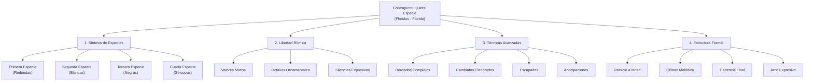
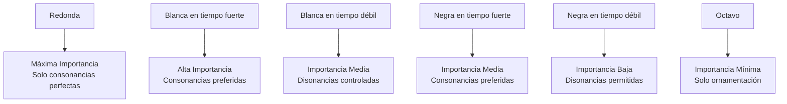
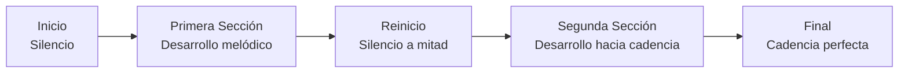
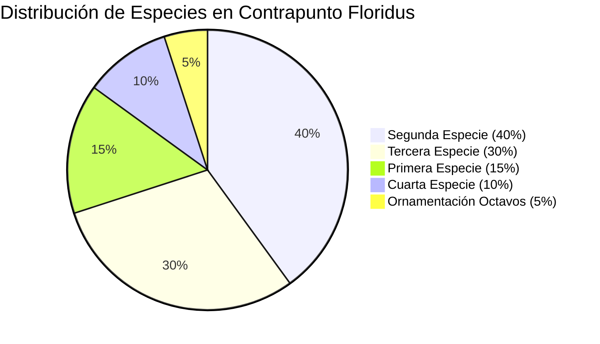

# Guía Específica: Contrapunto de Quinta Especie (Floridus)

_Basada en el método del Conservatorio Profesional de Getafe y la práctica polifónica del siglo XVI_

La quinta especie, conocida como **contrapunto floridus** o "florido", representa la síntesis y culminación de todas las especies anteriores. Es la forma más libre y expresiva del contrapunto severo, donde se combinan todos los valores rítmicos y técnicas aprendidas para crear líneas melódicas de gran belleza y complejidad.



## 1. Principios Fundamentales de la Quinta Especie

### 1.1 Definición y Características

El contrapunto floridus es la **combinación libre** de todas las especies anteriores en una sola línea melódica. Sus características principales son:

- **Libertad rítmica**: Uso de redondas, blancas, negras y octavos
- **Síntesis técnica**: Integración de todas las técnicas de ornamentación
- **Expresividad máxima**: Mayor capacidad de crear líneas melódicas expresivas
- **Complejidad estructural**: Requiere planificación formal más sofisticada

### 1.2 Valores Rítmicos Permitidos

| Valor Rítmico | Uso Principal     | Restricciones                        | Función Expresiva       |
| ------------- | ----------------- | ------------------------------------ | ----------------------- |
| **Redonda**   | Reposo, énfasis   | Solo en consonancias perfectas       | Estabilidad, conclusión |
| **Blanca**    | Estructura básica | Síncopas permitidas                  | Movimiento moderado     |
| **Negra**     | Ornamentación     | Grupos de 2-4 notas                  | Actividad melódica      |
| **Octavo**    | Bordados          | Solo en bordados, por grado conjunto | Ornamentación refinada  |

### 1.3 Jerarquía de Importancia Rítmica



## 2. Reglas Específicas de la Quinta Especie

### 2.1 Uso de Octavos (Corcheas)

**Regla fundamental**: Los octavos **SIEMPRE** deben estar en bordado (floreo)

```abc
X:1
T:Octavos Correctos - Bordado Superior
M:4/4
L:1/8
K:C
C4 D2C2 D4 |
w:Negra Octavos Negra
```

```abc
X:2
T:Octavos Correctos - Bordado Inferior
M:4/4
L:1/8
K:C
E4 D2E2 F4 |
w:Negra Octavos Negra
```

**❌ Incorrecto**: Octavos por salto o grado conjunto sin bordado

```abc
X:3
T:Octavos INCORRECTOS - Sin bordado
M:4/4
L:1/8
K:C
C4 D2E2 F4 |
w:❌ ❌ ❌ ❌
```

### 2.2 Movimiento por Grado Conjunto en Octavos

**Regla**: Todos los octavos deben moverse por **grado conjunto**

**Patrón correcto**: Nota → vecina → vuelta a la nota original (o continuación lógica)

```abc
X:4
T:Bordado Completo con Octavos
M:4/4
L:1/4
K:C
C/2D/2C/2B/2 C2 E/2F/2E/2D/2 E2 |
w:Bordado-superior Reposo Bordado-inferior Reposo
```

### 2.3 Tratamiento de Disonancias en Octavos

**En octavos**: El segundo octavo puede ser disonante si forma parte del bordado

```abc
X:5
T:Disonancia en Segundo Octavo (Permitida)
M:4/4
L:1/8
K:C
V:1 clef=treble
C4 D2C2 E4 |
V:2 clef=bass
C2 C2 C2 C2 |
w:Cons. Dis. Cons. Cons.
```

## 3. Estructura Formal: El Reinicio a Mitad

### 3.1 Concepto del Reinicio

**Definición**: A la mitad del cantus firmus, se inicia nuevamente con un **silencio**, creando una sensación de cierre y nuevo comienzo.



### 3.2 Ejemplo de Estructura con Reinicio

```abc
X:6
T:Estructura con Reinicio - Cantus Firmus
M:4/4
L:1/1
K:C
C | F | G | A | F | G | C |]
```

```abc
X:7
T:Contrapunto Floridus con Reinicio
M:4/4
L:1/4
K:C
z2 G2 A B c B A G F G A2 z2 E2 F G A G F E D E F G E2 C2 |]
w:Silencio-inicial Primera-sección Reinicio Segunda-sección Final
```

### 3.3 Función Expresiva del Reinicio

- **Articulación formal**: Divide la pieza en dos secciones equilibradas
- **Respiración musical**: Permite que la línea melódica "respire"
- **Sensación de cierre**: El primer silencio debe sentirse como una conclusión temporal
- **Renovación**: El segundo inicio debe aportar material melódico fresco

## 4. Técnicas Ornamentales Avanzadas

### 4.1 Bordados Complejos

**Bordado simple**:

```abc
X:8
T:Bordado Simple
M:4/4
L:1/4
K:C
C D C E |
```

**Bordado doble**:

```abc
X:9
T:Bordado Doble
M:4/4
L:1/8
K:C
C4 D2C2 B2C2 D4 |
```

**Bordado con octavos**:

```abc
X:10
T:Bordado con Octavos
M:4/4
L:1/8
K:C
C2 D/2C/2B/2C/2 D4 E4 |
```

### 4.2 Cambiatas Elaboradas

La **cambiata** del siglo XVI puede elaborarse en quinta especie:

```abc
X:11
T:Cambiata Simple (Tercera Especie)
M:4/4
L:1/4
K:C
F E C D |
```

```abc
X:12
T:Cambiata Elaborada (Quinta Especie)
M:4/4
L:1/8
K:C
F4 E/2F/2E2 C2 D4 |
w:Base Bordado Salto Resolución
```

### 4.3 Escapadas y Anticipaciones

**Escapada**: Salto desde una consonancia hacia una disonancia que resuelve por grado conjunto

```abc
X:13
T:Escapada en Quinta Especie
M:4/4
L:1/4
K:C
C E D C |
w:Cons. Escapada Resolución Cons.
```

**Anticipación**: Nota que anticipa la resolución armónica

```abc
X:14
T:Anticipación
M:4/4
L:1/8
K:C
D4 C2D2 C4 B4 |
w:Prep. Anticipación Resolución
```

## 5. Reglas de Terminación

### 5.1 Finales Permitidos

**Intervalos de terminación**:

- ✅ **Octava**: El más común y estable
- ✅ **Quinta**: Permitido, especialmente en voces intermedias
- ❌ **Otros intervalos**: No apropiados para el final

### 5.2 Fórmulas Cadenciales

**Cadencia con sensible**:

```abc
X:15
T:Cadencia Final - Con Sensible
M:4/4
L:1/4
K:C
A B C2 |
V:2 clef=bass
F G C2 |
w:Sensible-resolución
```

**Cadencia sin sensible** (cuando el cantus firmus ya la proporciona):

```abc
X:16
T:Cadencia Final - Sin Sensible Añadida
M:4/4
L:1/4
K:C
D E C2 |
V:2 clef=bass
B C C2 |
w:Evitar-duplicar-sensible
```

## 6. Especies Permitidas y su Integración

### 6.1 Tabla de Especies Utilizables

| Especie     | Cuándo Usar          | Función             | Limitaciones                   |
| ----------- | -------------------- | ------------------- | ------------------------------ |
| **Primera** | Puntos de reposo     | Estabilidad         | No excesiva (evitar estatismo) |
| **Segunda** | Estructura básica    | Movimiento moderado | Base del contrapunto           |
| **Tercera** | Ornamentación activa | Fluidez melódica    | Grupos cortos (2-4 notas)      |
| **Cuarta**  | Expresividad         | Tensión-resolución  | Uso ocasional                  |
| **Quinta**  | Síntesis             | Máxima expresividad | Equilibrio entre especies      |

### 6.2 Proporciones Recomendadas



## 7. Metodología de Composición

### 7.1 Proceso de Composición en Etapas

**Etapa 1: Planificación Estructural**

1. Identificar el punto de reinicio (mitad del cantus firmus)
2. Planificar el arco melódico general
3. Ubicar el clímax melódico
4. Diseñar la cadencia final

**Etapa 2: Esqueleto Básico**

1. Crear una línea básica en segunda especie
2. Asegurar corrección armónica fundamental
3. Establecer el movimiento melódico general

**Etapa 3: Ornamentación**

1. Añadir tercera especie en pasajes apropiados
2. Integrar síncopas ocasionales (cuarta especie)
3. Incluir bordados con octavos
4. Añadir primera especie en puntos de reposo

**Etapa 4: Refinamiento**

1. Verificar todas las reglas de disonancia
2. Asegurar variedad rítmica equilibrada
3. Confirmar la efectividad del reinicio
4. Pulir la línea melódica final

### 7.2 Ejemplo de Proceso Compositivo

**Cantus Firmus dado**:

```abc
X:17
T:Cantus Firmus para Quinta Especie
M:4/4
L:1/1
K:C
C | G | A | F | G | C |]
```

**Etapa 1 - Esqueleto básico (Segunda especie)**:

```abc
X:18
T:Etapa 1 - Esqueleto Básico
M:4/4
L:1/2
K:C
z G A B c B A G F G A B G E C2 |]
```

**Etapa 2 - Añadir ornamentación**:

```abc
X:19
T:Etapa 2 - Con Ornamentación
M:4/4
L:1/4
K:C
z2 G A B c B A G F G A2 z2 B c B A G F E F G E C2 |]
```

**Etapa 3 - Versión final con octavos**:

```abc
X:20
T:Versión Final - Contrapunto Floridus Completo
M:4/4
L:1/8
K:C
z4 G2A2 B2c2 B/2c/2B2 A2G2 F2G2 A4 z4 B2c2 B2A2 G2F2 E/2F/2E2 F2G2 E4 C4 |]
w:Silencio Primera-sección Reinicio Segunda-sección Final
```

## 8. Análisis de Ejemplo Completo

### 8.1 Análisis Detallado del Ejemplo

**Compás 1 (sobre C)**:

- Silencio inicial (tradición del contrapunto)
- Entrada en consonancia imperfecta (quinta)

**Compás 2 (sobre G)**:

- Segunda especie básica: G-A
- Intervalos: 8ª-9ª (octava-segunda)
- Movimiento ascendente por grado conjunto

**Compás 3 (sobre A)**:

- Tercera especie: B-c-B-A
- Patrón de vuelta con bordado
- Clímax melódico en c (octava)

**Compás 4 (sobre F) - REINICIO**:

- Silencio de reinicio
- Nueva entrada: B-c
- Sensación de nuevo comienzo

**Compás 5 (sobre G)**:

- Movimiento descendente: B-A-G-F
- Preparación cadencial
- Tercera especie fluida

**Compás 6 (sobre C) - FINAL**:

- Bordado con octavos: E-F-E
- Resolución cadencial: F-G-E
- Final en octava (C)

### 8.2 Elementos Técnicos Destacados

1. **Arco melódico**: Ascenso hasta c, luego descenso gradual
2. **Reinicio efectivo**: El silencio del compás 4 articula claramente las secciones
3. **Variedad rítmica**: Combinación equilibrada de todas las especies
4. **Ornamentación**: Bordados con octavos en momento cadencial
5. **Coherencia**: Línea melódica lógica y cantable

## 9. Conexiones con Otros Temas Musicales

### 9.1 Relación con Familias Tonales [[memoria:4888487]]

El contrapunto floridus puede aplicarse al sistema de **cadencias y arpegios melódicos**:

**Cadencia 2-5-1 como base**:

```abc
X:21
T:Cadencia 2-5-1 Armonizada
M:4/4
L:1/1
K:C
D | G | C |]
```

**Aplicación de quinta especie sobre la cadencia**:

```abc
X:22
T:Contrapunto Floridus sobre Cadencia 2-5-1
M:4/4
L:1/8
K:C
F2G2 A2B2 c2B2 A2G2 F2E2 D2C2 E4 C4 |]
w:Arpegio-ornamentado Resolución-melódica Final
```

### 9.2 Aplicación a Voicing Coral

Los principios del contrapunto floridus se aplican directamente a la **ornamentación de voces en coral**:

- **Soprano**: Puede usar quinta especie para crear líneas expresivas
- **Alto/Tenor**: Ornamentación moderada respetando la armonía
- **Bajo**: Principalmente segunda especie con ornamentación ocasional

### 9.3 Conexión con Progresiones Melancólicas

Las técnicas de quinta especie son especialmente efectivas para crear **progresiones melancólicas** en los géneros que te interesan (Dream pop, Folk):

**Progresión vi-IV-I-V ornamentada**:

```abc
X:23
T:Progresión Melancólica con Ornamentación Floridus
M:4/4
L:1/8
K:C
A2G2 F2E2 D2E2 F2G2 E2D2 C2B2 A4 G4 |]
w:vi IV I V (ornamentado estilo floridus)
```

## 10. Ejercicios Progresivos

### 10.1 Ejercicio Básico: Cantus Firmus Corto

**Cantus Firmus**:

```abc
X:24
T:Ejercicio Básico - CF Corto
M:4/4
L:1/1
K:C
C | F | G | C |]
```

**Requisitos**:

1. Incluir reinicio en el compás 3
2. Usar al menos tres especies diferentes
3. Incluir un bordado con octavos
4. Crear arco melódico coherente

### 10.2 Ejercicio Intermedio: Modo Dórico

**Cantus Firmus Modal**:

```abc
X:25
T:Ejercicio Intermedio - Modo Dórico
M:4/4
L:1/1
K:D dor
D | G | A | F | G | D |]
```

**Desafíos adicionales**:

1. Respetar las características del modo dórico
2. Usar el Bb apropiadamente
3. Crear contraste entre las dos secciones
4. Integrar cambiata característica del siglo XVI

### 10.3 Ejercicio Avanzado: Cantus Firmus Largo

**Cantus Firmus Extendido**:

```abc
X:26
T:Ejercicio Avanzado - CF Largo
M:4/4
L:1/1
K:C
C | E | F | D | G | A | F | G | C |]
```

**Objetivos**:

1. Planificar dos reinicios (compases 5 y 7)
2. Crear múltiples clímax melódicos
3. Usar todas las especies de manera equilibrada
4. Demostrar dominio completo del estilo floridus

## 11. Errores Comunes y Correcciones

### 11.1 Exceso de Ornamentación

**❌ Error**: Usar demasiados octavos sin criterio

```abc
X:27
T:INCORRECTO - Exceso de octavos
M:4/4
L:1/8
K:C
C/2D/2C/2B/2 C/2D/2E/2F/2 G/2F/2E/2D/2 C4 |
w:❌ ❌ ❌ ❌
```

**✅ Corrección**: Usar octavos solo en bordados específicos

```abc
X:28
T:CORRECTO - Octavos controlados
M:4/4
L:1/8
K:C
C4 D/2C/2B/2C/2 D2E2 F4 |
w:✅ ✅ ✅ ✅
```

### 11.2 Reinicio Inadecuado

**❌ Error**: Reinicio que no se siente como cierre

```abc
X:29
T:INCORRECTO - Reinicio sin sensación de cierre
M:4/4
L:1/4
K:C
C D E F z G A B |
w:❌ No-hay-sensación-de-cierre
```

**✅ Corrección**: Reinicio con preparación cadencial

```abc
X:30
T:CORRECTO - Reinicio con cierre
M:4/4
L:1/4
K:C
C D E C z G A B |
w:✅ Sensación-de-cierre-y-reinicio
```

### 11.3 Desequilibrio de Especies

**❌ Error**: Uso excesivo de una sola especie

```abc
X:31
T:INCORRECTO - Solo tercera especie
M:4/4
L:1/4
K:C
C D E F G A B C |
w:❌ ❌ ❌ ❌
```

**✅ Corrección**: Equilibrio entre especies

```abc
X:32
T:CORRECTO - Especies equilibradas
M:4/4
L:1/4
K:C
C2 D E F2 G A B C2 |
w:1ª-esp. 3ª-esp. 1ª-esp. 3ª-esp. 1ª-esp.
```

## 12. Aplicación a Composición Moderna

### 12.1 Líneas Melódicas en Dream Pop

Los principios del contrapunto floridus son especialmente útiles para crear las **líneas melódicas etéreas** características del Dream Pop:

**Ejemplo aplicado a progresión vi-IV-I-V**:

```abc
X:33
T:Línea Melódica Dream Pop (Inspirada en Beach House)
M:4/4
L:1/8
K:C
A2G2 F/2G/2F2 E2D2 C/2D/2C2 B2A2 G4 F4 E4 |]
w:Ornamentación-etérea Bordados-suaves Resolución-melancólica
```

### 12.2 Contramelodías en Folk

Para el estilo Folk (Lumineers, Bon Iver), el contrapunto floridus proporciona herramientas para crear **contramelodías expresivas**:

```abc
X:34
T:Contramelodía Folk sobre I-vi-IV-V
M:4/4
L:1/8
K:C
C4 D2E2 F2G2 A/2G/2F2 E2D2 C4 B4 C4 |]
w:Base-simple Ornamentación-folk Resolución-natural
```

### 12.3 Ornamentación en Música Melancólica

Los bordados y escapadas del contrapunto floridus son perfectos para crear la **atmósfera melancólica** de artistas como Radiohead o Andrew Bird:

```abc
X:35
T:Ornamentación Melancólica (Estilo Radiohead)
M:4/4
L:1/8
K:C
E2D2 C/2D/2C2 B2A2 G/2A/2G2 F2E2 D4 C4 |]
w:Descendente-ornamentado Bordados-expresivos Resolución-melancólica
```

## 13. Tabla de Referencia Rápida

### 13.1 Reglas Esenciales

| Elemento        | Regla                   | Ejemplo                  |
| --------------- | ----------------------- | ------------------------ |
| **Octavos**     | Solo en bordados        | C-D-C o E-D-E            |
| **Reinicio**    | A mitad del CF          | Silencio + nueva entrada |
| **Final**       | 8ª o 5ª                 | Preferir octava          |
| **Disonancias** | Solo en tiempos débiles | 2ª y 4ª negra, octavos   |
| **Especies**    | Equilibrio              | No exceso de una sola    |

### 13.2 Patrones Melódicos Útiles

| Patrón                   | Notación    | Uso                    |
| ------------------------ | ----------- | ---------------------- |
| **Bordado simple**       | C-D-C       | Ornamentación básica   |
| **Bordado con octavos**  | C-D/C-B/C   | Ornamentación refinada |
| **Escala ornamentada**   | C-D-E/D-C   | Movimiento fluido      |
| **Cambiata floridus**    | F-E/F-E-C-D | Técnica del s. XVI     |
| **Cadencia ornamentada** | A-B/A-G-C   | Final expresivo        |

## Conclusión: El Contrapunto Floridus como Síntesis Artística

La quinta especie representa la **culminación del aprendizaje contrapuntístico**. No es simplemente la suma de las especies anteriores, sino su **síntesis creativa** en un lenguaje musical coherente y expresivo. El dominio del contrapunto floridus proporciona:

1. **Libertad controlada**: Máxima expresividad dentro de un marco estilístico coherente
2. **Herramientas compositivas**: Técnicas aplicables a cualquier estilo musical
3. **Sensibilidad melódica**: Comprensión profunda del flujo y la articulación melódica
4. **Base histórica**: Conexión directa con la tradición polifónica occidental

Para tu desarrollo como compositor en los géneros que te interesan (Dream Pop, Folk, música melancólica), el contrapunto floridus ofrece un **vocabulario refinado** para crear líneas melódicas de gran belleza y sofisticación técnica. Las técnicas de ornamentación, el manejo de la tensión y resolución, y la capacidad de crear arcos melódicos expresivos son directamente aplicables a la composición moderna.

El **reinicio a mitad** del contrapunto floridus, en particular, es una técnica formal que puede enriquecer enormemente la estructura de tus composiciones, creando momentos de respiración y renovación que mantienen el interés del oyente a lo largo de piezas más extensas.

---

**Conexión con otros temas**: Esta guía culmina el estudio del contrapunto severo y se conecta directamente con las técnicas de **ornamentación melódica** en voicing coral, las **progresiones cadenciales** que hemos estudiado, y el **sistema de familias tonales** para crear melodías a partir de cadencias armónicas. El dominio del contrapunto floridus prepara para abordar el contrapunto libre y la composición polifónica moderna.
