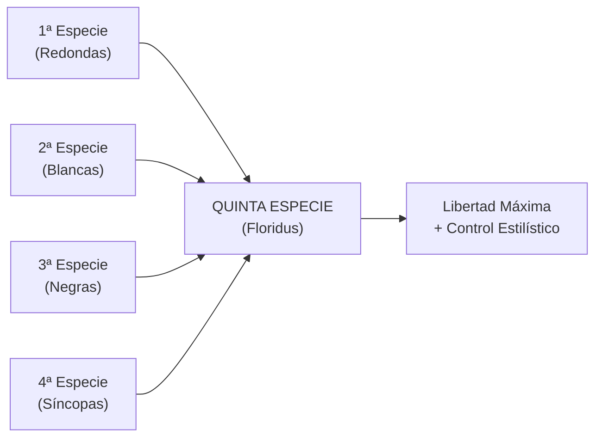

# Guía Rápida: Reglas Esenciales Contrapunto Quinta Especie (Floridus)

_Síntesis práctica para composición inmediata_

## 🎯 Concepto Fundamental

La **quinta especie** (contrapunto floridus) combina **todas las especies anteriores** en una línea melódica libre que utiliza redondas, blancas, negras y octavos contra el cantus firmus.



## 📋 Tabla de Reglas Esenciales

| Elemento     | Regla Fundamental           | Restricciones                 | Frecuencia  |
| ------------ | --------------------------- | ----------------------------- | ----------- |
| **Octavos**  | **SOLO en bordados**        | Por grado conjunto únicamente | 5-10%       |
| **Negras**   | Grupos de 2-4 notas         | Preferir grado conjunto       | 30-40%      |
| **Blancas**  | Base del contrapunto        | Pueden incluir síncopas       | 40-50%      |
| **Redondas** | Solo consonancias perfectas | Puntos de reposo              | 10-15%      |
| **Reinicio** | **Obligatorio a mitad**     | Silencio + nueva entrada      | 1 por pieza |

## 🔴 Reglas Críticas (No Negociables)

### 1. **Regla de Octavos**

```
✅ CORRECTO: C-D-C (bordado)
❌ PROHIBIDO: C-E (salto)
❌ PROHIBIDO: C-D-E (grado conjunto sin bordado)
```

### 2. **Reinicio Obligatorio**

```
Estructura: [Sección 1] → [SILENCIO] → [Sección 2]
Ubicación: Exactamente a la mitad del cantus firmus
Función: Debe sentirse como cierre y nuevo comienzo
```

### 3. **Jerarquía de Valores**

```
Redonda > Blanca en tiempo fuerte > Blanca en tiempo débil > Negra fuerte > Negra débil > Octavo
```

## ⚡ Reglas de Movimiento Melódico

### Saltos Permitidos por Valor Rítmico

| Valor       | Saltos Ascendentes          | Saltos Descendentes         | Compensación    |
| ----------- | --------------------------- | --------------------------- | --------------- |
| **Redonda** | Solo consonancias perfectas | Solo consonancias perfectas | No necesaria    |
| **Blanca**  | Hasta 5ª                    | Hasta 8ª                    | Recomendada     |
| **Negra**   | Solo en tiempos fuertes     | En cualquier posición       | Obligatoria >3ª |
| **Octavo**  | ❌ Prohibidos               | ❌ Prohibidos               | -               |

### Secuencia de Compensación

```
Después de salto ≥ 3ª: Cambiar dirección inmediatamente
Después de salto ≥ 5ª: Mínimo 2 notas por grado conjunto
```

## 🎵 Disonancias y Consonancias

### Por Valor Rítmico

| Valor       | Tiempo Fuerte         | Tiempo Débil     | Observaciones                 |
| ----------- | --------------------- | ---------------- | ----------------------------- |
| **Redonda** | Solo consonancias     | -                | 8ª, 5ª únicamente             |
| **Blanca**  | Cons. o dis. ligada   | Consonancias     | Síncopas permitidas           |
| **Negra**   | Preferir consonancias | Disonancias OK   | Como notas de paso            |
| **Octavo**  | Solo en bordados      | Solo en bordados | 2º octavo puede ser disonante |

### Tipos de Disonancias Permitidas

```
1. Notas de paso (grado conjunto)
2. Bordaduras/floreos (ida y vuelta)
3. Síncopas ligadas (4ª especie)
4. Cambiatas (salto + grado conjunto)
5. Escapadas (grado conjunto + salto)
```

## 📐 Estructura Formal

### Proporción Ideal de Especies

```
Segunda especie (blancas): 40-50%
Tercera especie (negras): 30-35%
Primera especie (redondas): 10-15%
Cuarta especie (síncopas): 5-10%
Ornamentación (octavos): 5%
```

### Esquema Formal Típico

```
INICIO → DESARROLLO 1 → [REINICIO] → DESARROLLO 2 → CADENCIA
  |           |              |            |           |
Silencio   Ascenso      Silencio a    Descenso    8ª final
8ª/5ª      clímax        mitad       cadencial
```

## 🚫 Errores Más Comunes

### Críticos (Invalidan el ejercicio)

1. **Octavos sin bordado**
2. **Falta de reinicio a mitad**
3. **Redonda en disonancia**
4. **Salto ascendente en octavo**

### Graves (Comprometen la calidad)

1. **Exceso de octavos** (>10%)
2. **Falta de variedad rítmica**
3. **Reinicio que no se siente como cierre**
4. **Línea melódica incoherente**

### Moderados (Mejorables)

1. **Proporciones desequilibradas entre especies**
2. **Falta de clímax melódico**
3. **Movimiento demasiado escalar**
4. **Cadencia final débil**

## ⚙️ Metodología Rápida de Composición

### Paso 1: Planificación (30 segundos)

```
1. Marcar punto de reinicio (mitad del CF)
2. Decidir registro general (alto/medio/bajo)
3. Ubicar clímax melódico
```

### Paso 2: Esqueleto (2 minutos)

```
1. Inicio: Silencio + 8ª/5ª
2. Primera sección: Línea básica en 2ª especie
3. Reinicio: Silencio a mitad
4. Segunda sección: Línea hacia cadencia
5. Final: 8ª
```

### Paso 3: Ornamentación (2 minutos)

```
1. Convertir algunas blancas en negras (grupos de 2-4)
2. Añadir 1-2 bordados con octavos
3. Incluir 1-2 síncopas ocasionales
4. Verificar proporciones
```

### Paso 4: Verificación (30 segundos)

```
✓ Octavos solo en bordados
✓ Reinicio efectivo presente
✓ Línea melódica cantable
✓ Variedad rítmica equilibrada
```

## 🎯 Checklist de Verificación Rápida

### Estructura ✓

- [ ] Inicio con silencio + consonancia perfecta
- [ ] Reinicio exacto a mitad del cantus firmus
- [ ] Final en octava (preferible) o quinta
- [ ] Arco melódico coherente

### Valores Rítmicos ✓

- [ ] Octavos: Solo bordados, por grado conjunto
- [ ] Negras: Grupos cortos, predominio grado conjunto
- [ ] Blancas: Base principal del contrapunto
- [ ] Redondas: Solo consonancias perfectas

### Disonancias ✓

- [ ] En tiempos débiles o como síncopas ligadas
- [ ] Resolución por grado conjunto cuando necesario
- [ ] Notas de paso y bordaduras correctas

### Movimiento ✓

- [ ] Saltos compensados apropiadamente
- [ ] Cambios de dirección cada 2-3 notas
- [ ] No más de 2 saltos consecutivos
- [ ] Equilibrio entre movimiento conjunto y saltos

## 🎼 Aplicación Práctica Inmediata

### Para Dream Pop/Ambient

```
Enfoque: Bordados etéreos con octavos, síncopas suaves
Valores preferidos: Blancas + octavos ornamentales
Evitar: Negras muy activas, saltos bruscos
```

### Para Folk Melancólico

```
Enfoque: Líneas descendentes, síncopas expresivas
Valores preferidos: Mezcla equilibrada, énfasis en 2ª especie
Evitar: Exceso de ornamentación
```

### Para Jazz/Standards

```
Enfoque: Síncopas características, líneas cromáticas
Valores preferidos: 4ª especie + ornamentación con negras
Evitar: Demasiada regularidad rítmica
```

## 💡 Consejos de Eficiencia

### Composición Rápida

1. **Piensa en 2ª especie primero**, luego ornamenta
2. **Un solo bordado con octavos** es suficiente
3. **El reinicio es más importante que la ornamentación**
4. **Menos es más**: Prefiere simplicidad elegante

### Solución de Problemas

```
Problema: "Suena demasiado ornamentado"
Solución: Reducir octavos, aumentar blancas

Problema: "El reinicio no se siente"
Solución: Hacer cadencia más clara antes del silencio

Problema: "Línea incoherente"
Solución: Simplificar a 2ª especie, luego añadir ornamentación mínima
```

---

## 🎯 Resumen Ultra-Conciso

**Lo que SÍ**: Octavos en bordados, reinicio a mitad, variedad controlada
**Lo que NO**: Saltos en octavos, exceso ornamentación, olvido del reinicio
**Secreto**: Piensa en segunda especie + ornamentación selectiva

**Fórmula de éxito**: 40% blancas + 30% negras + 20% ornamentación + 10% reposo = Contrapunto floridus perfecto

---

_Esta guía está diseñada para consulta rápida durante la composición. Para ejemplos detallados, consultar la Guía específica completa de Quinta Especie._
