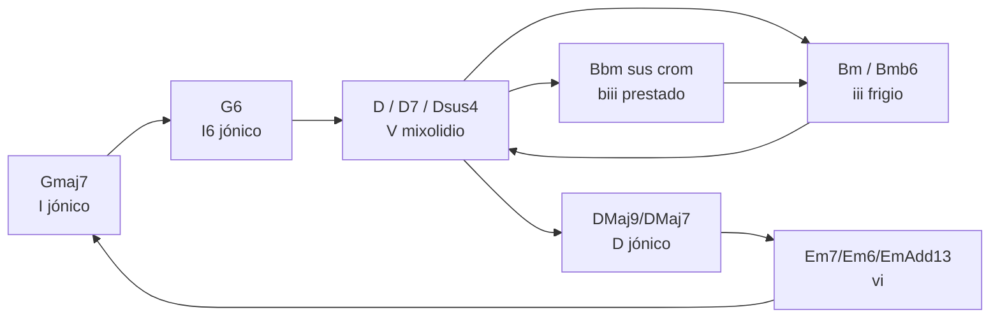

### 1. Qué es este ejercicio y qué estás practicando

Tu partitura **“17. Arpegios Down Chorus”** es básicamente un **laboratorio de enlaces** sobre la progresión de _Dawn Chorus_ en G mayor: arpegios en corcheas/semicorcheas en la mano derecha y la fundamental del acorde en blancas/semibreves en la izquierda.

Estás trabajando:

- **Tonalidad base:** G mayor.
    
- **Familias tonales:**
    
    - Tónica: Gmaj7, G6
        
    - Dominante: D, D7, D7sus4, Dsus4, Dsus2Add13
        
    - Relativos y vecinos: Bm, Bmb6, Bm7, Em7/Em6, DMaj7/9, Bbm (sus cromático)
        
- **Modos usados:** etiquetas Jónico, Frigio, Mixolidio, Locrio, D Jónico, etc., tomadas de tu hoja de **modos**.
    

A nivel de textura, es **contrapunto a dos voces**: bajo muy simple (pedales de fundamental) y línea superior muy activa, tal como se recomienda en el repaso de contrapunto (independencia melódica pero estructura clara).

---

### 2. Macroestructura del ejercicio

#### 2.1 Secciones

Podemos dividir lo escrito en tres bloques de 8 compases y luego la zona en blanco:

|Compases|Armonía principal|Comentario|
|---|---|---|
|1–8|Gmaj7 – G6 – D – D7sus4 / Bmb6 – Bm – D7 – Dsus2Add13|Presentación de la progresión y color modal básico.|
|9–16|Gmaj7–Gmaj – G6 – D7 – Dsus4 / Bbm – Bm – D7 – Dsus2Add13|Variación con intercambio modal (Bbm) y pequeños cambios de voicing.|
|17–28|Gmaj7 – G6 – DMaj9→DMaj7 – DMaj7 / Em7–Em6 – Bm7 – Em7 / Em→EmAdd13 – DMaj9→DMaj7 – DMaj7 – Gmaj7|Zona de prolongación de D y Em que prepara el regreso a Gmaj7.|
|30–fin|Pentagramas vacíos|Espacio perfecto para **motivos** y variaciones.|

#### 2.2 Diagrama de flujo armónico (mermaid)



---

### 3. Enlaces en este ejercicio: qué estás haciendo realmente

En tus apuntes de **Enlaces 1.0** planteas el procedimiento:

1. Anotar acordes y función.
    
2. Marcar 3ª y 7ª (tonos guía).
    
3. Elegir tipo de enlace (paso diatónico/cromático, vecina, enclosure…).
    
4. Llegar por semitono a 3ª o 7ª cuando sea posible.
    

Aquí lo estás aplicando pero de forma **implícita**, sobre todo con el patrón F# ↔ G que comentabas:

- **F#** = 3ª de D, 7ª de G
    
- **G** = 4ª de D (11) y tónica de G
    

Así, muchos compases terminan/cosen los arpegios **moviéndose entre F# y G por semitono/grado conjunto**, que es exactamente un enlace de **nota de paso / nota común** entre las funciones de dominante (D) y tónica (G).

#### 3.1 Ejemplo simplificado (texto)

_No es literal a tus notas, es un resumen de lo que haces:_

```text
Compás 1 (Gmaj7):  D – E – F# – G – A ...
Compás 2 (G6):     G – A – B – D – E ...
Enlace: último F# -> G en el cambio de acorde

Compás 3 (D):      A – B – C# – D – E – F#
Compás 4 (D7sus4): G – A – B – C – D ...
Enlace: F# -> G (3ª de D -> 4ª de D / 7ª de G)
```

Estás usando sobre todo:

- **Notas comunes:** G entre Gmaj7, G6 y Dsus4.
    
- **Notas de paso diatónicas:** E–F#–G dentro de la escala de G jónico / D mixolidio.
    
- Algún **cromatismo** puntual (Bbm→Bm) como enlace de intercambio modal.
    

---

### 4. Análisis sección por sección

#### 4.1 Compases 1–8: presentación

Armonía:

```text
1  Gmaj7 (Jónico, 9 13)
2  G6   (Jónico, 9 13)
3  D    (Mixolidio, 9 13)
4  D7sus4 (Mixolidio, 9 13)
5  Bmb6 (Frigio, 11 13)
6  Bm   (Frigio, 11 13)
7  D7   (Mixolidio, 9 13)
8  Dsus2→Dsus2Add13 (Mixolidio, 9 13)
```

**Qué funciona muy bien aquí**

- Se ve clarísima la lógica de **familias tonales**: I → V → iii → V otra vez (toda la zona sigue orbitando a G).
    
- Las tensiones que escribes (9 y 13 en maj7 y 7, 11 y 13 en Bm) coinciden con las “tensiones seguras” que enumera tu resumen de tensiones y modos.
    
- El bajo está en pedales de fundamental, lo que deja muy libre la voz superior para practicar enlaces sin perder la armonía.
    

**Puntos a mejorar**

- Casi todos los enlaces “apuntan” a F# o G. Está genial como primera capa, pero según la guía de **tonos guía** conviene perseguir también la **3ª y 7ª de cada acorde**, no solo la tónica.
    
    - Ej.: hacia D7 podrías intentar terminar en **F# (3ª)** o **C (7ª)**, y no siempre en G/F#.
        
- Rítmicamente todo es “motor de semicorcheas”. En **Tonos guías** y **Enlaces 2.0 y motivos** se sugiere fijar una célula rítmica reconocible y variarla (tresillo, 3-3-2, síncopa…).
    

#### 4.2 Compases 9–16: variación + Bbm

Armonía principal:

```text
9   Gmaj7→Gmaj
10  G6
11  D→D7
12  Dsus4
13  Bbm (sus cromático)
14  Bm
15  D→D7
16  Dsus2→Dsus2Add13
```

Aquí ya estás aplicando **intercambio modal**:

- **Bbm** puede leerse como **bIII** prestado (del modo eólico/frigio paralelo), exactamente uno de los acordes típicos de intercambio modal que aparecen en la tabla de familias tonales.
    
- El regreso a **Bm** y luego a **D** cierra el desvío cromático sin perder la tónica G.
    

**Muy positivo**

- Introduces color cromático sin romper el marco de G; textbook `bIII` dream-pop / Radiohead.
    
- Mantienes el mismo patrón de arpegios, pero el oído siente un “pliegue” armónico gracias a Bbm.
    

**A mejorar**

- Sería buen sitio para un enlace **claramente cromático dirigido**: por ejemplo, línea superior Ab–A (3ª de Bbm → 5ª de D) o Db–D (5ª → 3ª de Bm/D), siguiendo la regla de “cromatismo con objetivo claro”.
    

#### 4.3 Compases 17–28: zona D / Em y regreso

Armonía:

```text
17  Gmaj7
18  G6
19  DMaj9→DMaj7Add9 (D jónico)
20  DMaj7
21  Em→Em7 (Locrio según tu etiqueta)
22  Em6
23  Bm7
24  Em7
25  Em→EmAdd13
26  DMaj9→DMaj7Add9
27  DMaj7
28  Gmaj7
```

Musicalmente esto funciona como:

- Una **prolongación de V (D)** que se abre a **vi (Em)** y luego vuelve a I (G).
    
- Está muy alineado con las progresiones tipo I–iii–vi–V que se recomiendan para suavidad y sensación “flotante” en menor/relativo.
    

Notas:

- Etiquetar Em como **locrio** es discutible en G mayor (en teoría clásica sería **eólico** en relación a G). Pero como práctica lo que realmente estás marcando es que quieres usar **11 y 13b** (A y C) como tensiones, que sí son típicas de un m7b5 / locrio.
    
- DMaj9/DMaj7Add9 como **D jónico** está perfecto: es I de D mayor, que aquí funciona como **dominante secundario muy suavizado** hacia G.
    

---

### 5. Qué está muy bien, qué falta y cómo mejorar

#### 5.1 Lo muy bueno ✅

1. **Marco teórico sólido**  
    Estás usando conscientemente modos, tensiones y familias tonales, tal como está organizado en tus resúmenes (`Modos`, `Tensiones`, `Familias tonales`).
    
2. **Uso real de intercambio modal**  
    Bbm, Bmb6 y la zona Em/DMaj muestran que ya integraste los capítulos de `Intercambios modales` y `Familias tonales` (bIII, iv, etc.).
    
3. **Textura clara para practicar enlaces**  
    El bajo en blancas/semibreves es casi un **pedal por acordes**, que es exactamente la definición de “pedal” del diccionario: una base perfecta para experimentar con notas de paso y vecinas arriba.
    
4. **Secuencia lógica de dificultad**  
    Has pasado de acordes básicos (Gmaj7, G6, D) a sonoridades más ricas (DMaj9, EmAdd13), como recomienda la progresión de estudio de contrapunto/voicing: primero estabilidad, luego más libertad.
    

#### 5.2 Cosas mejorables ⚠️

1. **Enlaces demasiado concentrados en F#–G**
    
    - Buenísimo como primer paso, pero ahora conviene expandir el mapa de objetivos:
        
        - En Gmaj7: busca también B (3ª) y F# (7ª).
            
        - En D7: F# (3ª), C (7ª).
            
        - En Em7: G (3ª), D (7ª).
            
    - Esto viene directamente del capítulo de **Tonos guía (3ª y 7ª)**.
        
2. **Ritmo “demasiado perfecto”**
    
    - Todo son semicorcheas regulares. En `Enlaces 2.0 y motivos` tienes un montón de células rítmicas (tresillo, Euclidean 5/8, etc.) para generar motivos rítmicos encima de tus arpegios.
        
3. **Poca diferenciación entre secciones**
    
    - Armónicamente sí hay secciones, pero la **línea superior se siente igual** en todas. Podrías:
        
        - Cambiar de registro (una octava más alta en la zona Em/DMaj).
            
        - Introducir notas largas / silencios en los compases de llegada (Gmaj7 final), como en los ejemplos de líneas melódicas y cadencias.
            

---

### 6. Estrategias concretas para mejorar tus enlaces aquí

#### 6.1 Plantilla de análisis (aplicando Enlaces 1.0)

Para cada cambio de acorde, rellena algo así (resumen de la plantilla de tu guía):

```text
Compás 7 → 8
Acordes: D7 → Dsus2Add13
Modo activo: D mixolidio
Tono guía de llegada: E (9 sobre D, pero también 4 sobre Bm si piensas en el siguiente)
Tipo de enlace: nota de paso cromática (F#–F–E)
Notas usadas: ... (escríbelas)
Ritmo: enlace en parte débil, llegada en parte fuerte
Observaciones: evité quintas paralelas, mantuve nota común D en una voz...
```

Haz esto para 2–3 enlaces por día y en una semana tendrás un control brutal de cómo estás conectando.

#### 6.2 Propuesta de nuevos enlaces para tu propia partitura

Te propongo tres “familias” de enlaces para probar en tu ejercicio:

1. **Enlaces a 3ª de cada acorde (tono guía)**
    
    - Gmaj7 → G6: terminar en **B**, luego B→A (3ª de G → 3ª de Em imaginaria / 2ª de G).
        
    - D7 → Gmaj7: C#–D–B (3ª de D→ tónica → 3ª de G).
        
2. **Cromatismos dirigidos en los cromáticos**
    
    - Bbm → Bm: Ab–A, Db–D o F–F# en la voz superior.
        
    - Em6 → Bm7: C–C# (13b locrio → 5ª de Bm).
        
3. **Enlaces con notas vecinas y anticipaciones**
    
    - Mantener un F# como nota **retenida** mientras el acorde cambia (tipo retardación suave), luego caer a E o G.
        
    - Anticipar una nota del siguiente acorde 1/8 antes del cambio (estrategia de ritmo armónico del capítulo de tonos guía).
        

---

### 7. Ejemplos en `music-abc` para experimentar

#### 7.1 Versión “actual” simplificada (I–V en G)

```music-abc
X:1
T:Down Chorus simple - actual
M:4/4
L:1/8
K:G
%% score (Mel|Bass)
V:Mel clef=treble
"Gmaj7" D E F G A B c | "D7" a b c d e f g f |
V:Bass clef=bass
"Gmaj7" G,4 G,4 | "D7" D,4 D,4 |
```

#### 7.2 Versión con enlaces a 3ª y cromatismo

```music-abc
X:2
T:Down Chorus - enlaces mejorados
M:4/4
L:1/8
K:G
%% score (Mel|Bass)
V:Mel clef=treble
"Gmaj7" d e f g a b a g | "D7" ^c d e f e d c B |
V:Bass clef=bass
"Gmaj7" G,4 G,4 | "D7" D,4 D,4 |
```

- Aquí fuerzo llegadas en **B (3ª de G)** y **F# / C (3ª/7ª de D)** con pequeñas aproximaciones cromáticas.
    

Usa estos miniejemplos como “laboratorio” antes de reescribir barras completas de tu partitura.

---

### 8. Cómo empezar a crear un **motivo** (texto largo con referencia a tus archivos)

En tu **Diccionario** se define _motivo_ como una **pequeña unidad melódica o rítmica** que puede repetirse y transformarse. En `Enlaces 2.0 y motivos` amplías la idea con una biblioteca de células rítmicas en `music-abc` (tresillo, Euclidean 5/8, 7/8, tihai, etc.), pensadas justo para ser semillas de motivos.

Si juntamos eso con:

- la importancia de los **tonos guía (3ª y 7ª)** como puntos de llegada,
    
- el marco de **familias tonales** e **intercambio modal** para elegir acordes y colores,
    
- y el procedimiento de **Enlaces 1.0** para planear notas de paso y tensiones,
    

puedes diseñar una estrategia bastante clara para construir un motivo encima de tu “Down Chorus”:

---

#### 8.1 Paso 1 – Elegir el material armónico y modal

Ya lo tienes: G mayor como tónica; usas G jónico, D mixolidio, B frigio, regioncita Em “locria” y algún prestado cromático (Bbm). Piensa en esto como el **campo de juego**: todas las notas que has usado como arpegios son el “alfabeto” de tu motivo.

Checklist rápido (sacado de Enlaces 1.0):

1. Apunta la progresión resumida (G – G – D – Dsus – Bm – D – etc.).
    
2. Marca 3ª y 7ª de cada acorde (B/F# en Gmaj7, F#/C en D7, D/A en Bm, etc.).
    
3. Decide qué modo está “activo” en cada sección (G jónico, D mixolidio, B frigio, D jónico, etc.).
    

---

#### 8.2 Paso 2 – Escoger una **célula rítmica**

En `Enlaces 2.0 y motivos` tienes muchas plantillas. Por ejemplo, el **tresillo 3-3-2** en 4/4:

```abc
X:101
T:Tresillo (3-3-2)
M:4/4
L:1/8
Q:1/4=100
K:C
C z2 C z2 C z |
```

Traducción a tu contexto:

- Usa esa malla rítmica (nota – silencio – tresillo…) pero toca alturas de tu escala de G.
    
- Mantén esa misma célula en varios compases, cambiando solo las notas → eso ya es un **motivo rítmico-melódico**.
    

---

#### 8.3 Paso 3 – Definir el “núcleo” melódico

Empieza con **2 o 3 notas**, máximo 4, preferiblemente relacionadas con tonos guía:

- Por ejemplo, para Gmaj7: **B–D–G** (3ª–5ª–1ª).
    
- Encájalas en la célula rítmica escogida (tresillo, 3-3-2, lo que quieras).
    

Tu motivo podría ser algo tan simple como:

```music-abc
X:3
T:Motivo núcleo
M:4/4
L:1/8
K:G
"Gmaj7" B d g z B d g z |
```

Lo importante no es que sea espectacular, sino que **puedas reconocerlo** cuando lo repites o lo transformas.

---

#### 8.4 Paso 4 – Variaciones (las “trampas” buenas del motivo)

Apoyándote en tus resúmenes de contrapunto y líneas melódicas, puedes transformar el motivo sin perder identidad:

1. **Transposición diatónica**
    
    - Mismo motivo pero en D mixolidio (para los compases de D7) o en B frigio (para Bm/Bmb6).
        
2. **Inversión parcial**
    
    - Si el motivo sube B–D–G, haz una versión que baje G–E–D pero con el mismo ritmo.
        
3. **Diminución / augmentación**
    
    - Usa la versión de célula `L:1/16` (diminución) o `L:1/4` (augmentación) que aparece en tu biblioteca ABC.
        
4. **Desplazamiento rítmico (phase / síncopa)**
    
    - Desplaza el motivo un 1/8 hacia la derecha, o empieza en la segunda parte del compás (fuera de tiempo fuerte), como en los ejemplos de sincopa en contrapunto 4ª especie.
        

---

#### 8.5 Paso 5 – Integrar el motivo a tus enlaces

Ahora sí, vuelve a tu partitura:

- En los primeros 8 compases, reemplaza una de las pasadas de arpegio por tu **motivo** (Gmaj7 y D7, por ejemplo).
    
- Asegúrate de que **al menos una nota del motivo sea un tono guía** del acorde actual o del siguiente (3ª o 7ª).
    
- Usa el motivo como **enlace**: que la última nota caiga exactamente en la 3ª/7ª del próximo acorde, a veces por semitono.
    

De esta forma:

- Los **arpegios** siguen dando la textura “Dawn Chorus”.
    
- Los **enlaces** se vuelven expresivos y dirigidos (no solo F#–G).
    
- El **motivo** da identidad: algo que se puede cantar o reconocer aunque cambien acordes, modos e intercambios modales.
    

---

### 9. Conclusión rápida

Vas muy bien:

- El marco armónico y modal está súper sólido.
    
- Ya estás haciendo enlaces funcionales entre G y D usando F#–G.
    
- Has integrado intercambio modal (Bbm, Bmb6) y extensiones (9, 13).
    

Lo que sigue no es “más teoría”, sino **refinar la intención**:

1. Pensar cada enlace como viaje hacia una 3ª o 7ª concreta.
    
2. Escoger una célula rítmica y 2–3 notas para construir un **motivo**.
    
3. Repetir, variar y desplazar ese motivo por toda la pieza, usando tus guías de `Enlaces 1.0`, `Enlaces 2.0 y motivos`, `Tonos guía`, `Modos` y `Familias tonales` como mapa.
    

Si quieres, en el siguiente paso podemos diseñar **un motivo específico** para compases 1–4 y escribir juntos una versión 2.0 de tu página 1 con esos cambios.