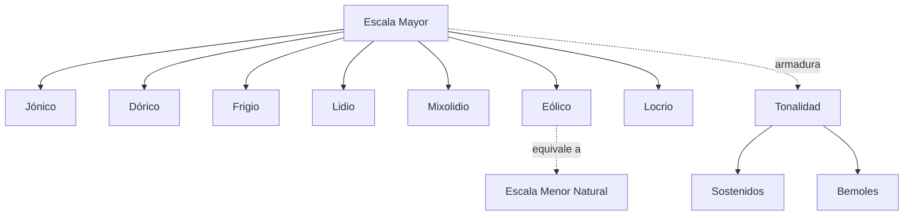
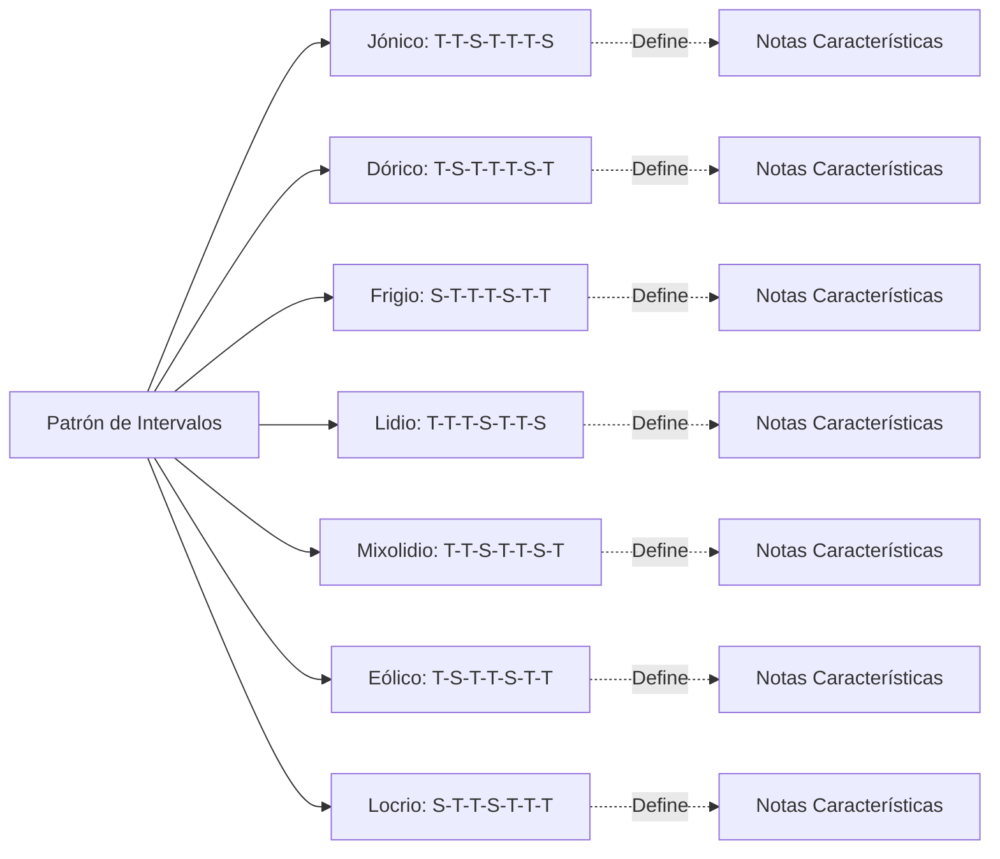
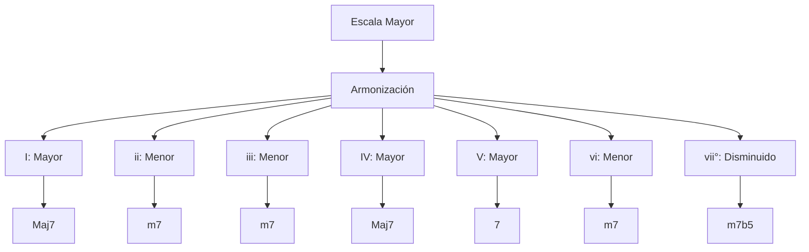
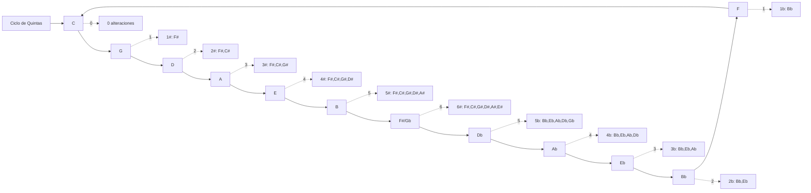
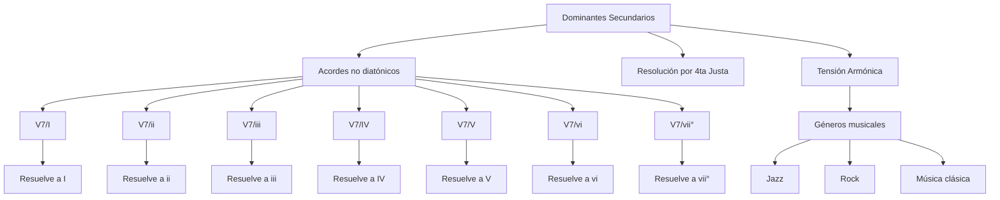
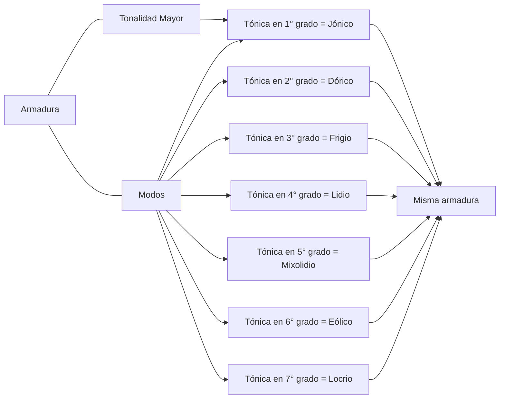
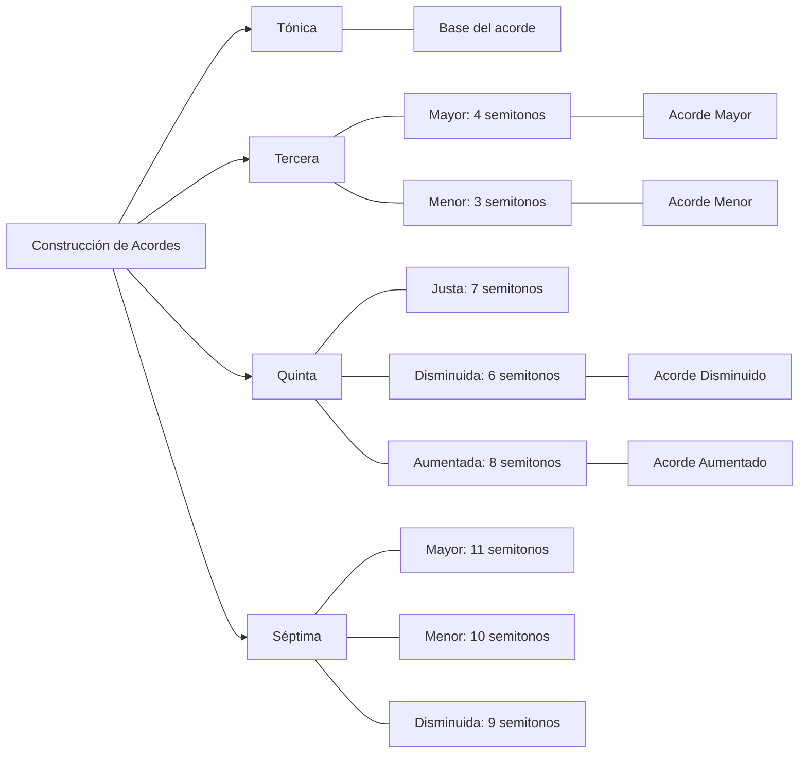
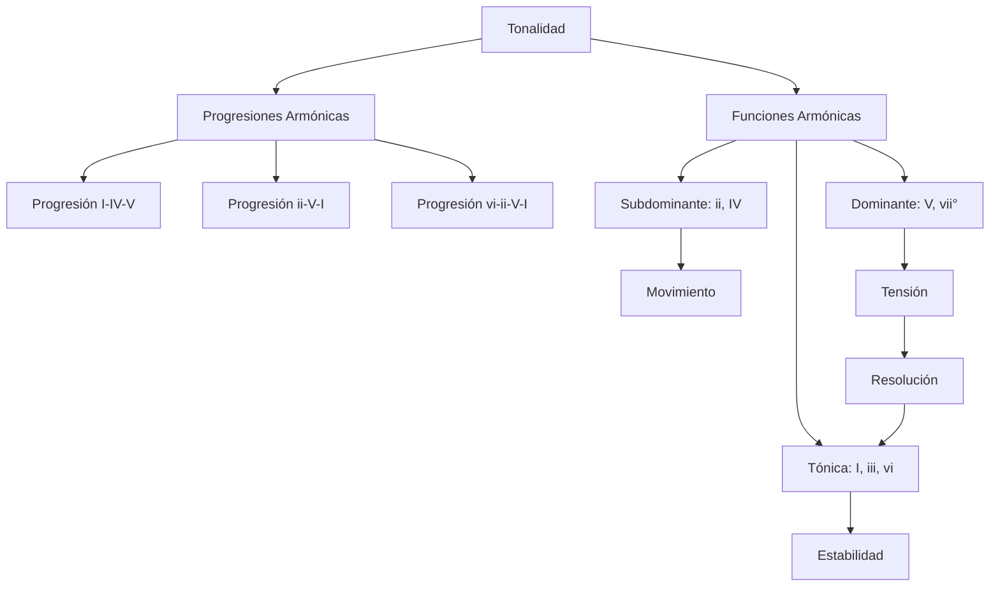
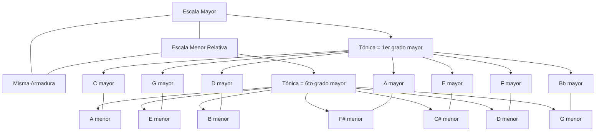
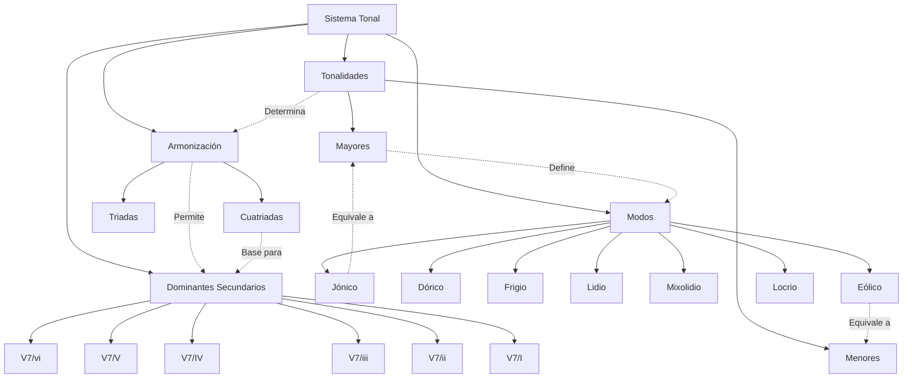

Aquí tienes 10 diagramas en formato mermaid.js que muestran las interrelaciones entre los conceptos musicales que hemos analizado en los documentos de repaso:

### 1. Jerarquía de las escalas y modos

### 2. Estructura de intervalos en los modos

### 3. Armonización de escalas mayores

### 4. Ciclo de quintas y armaduras

### 5. Dominantes secundarios y su resolución

### 6. Relación entre modos y tonalidades

### 7. Construcción de acordes en armonización

### 8. Relación entre acordes dentro de una tonalidad

### 9. Interrelación entre escalas mayores y sus relativos menores

### 10. Sistema completo de relaciones entre tonalidades, modos y dominantes

Estos diagramas muestran visualmente cómo se relacionan los conceptos de tonalidades, modos, armonización y dominantes secundarios en el sistema musical.
