# Diagramas de Composición Coral a 4 Voces - Mapa Visual

## Panorama General de la Composición Coral

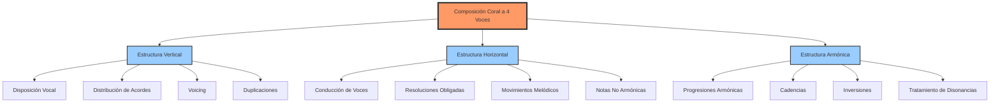

## Tesituras y Rangos Vocales

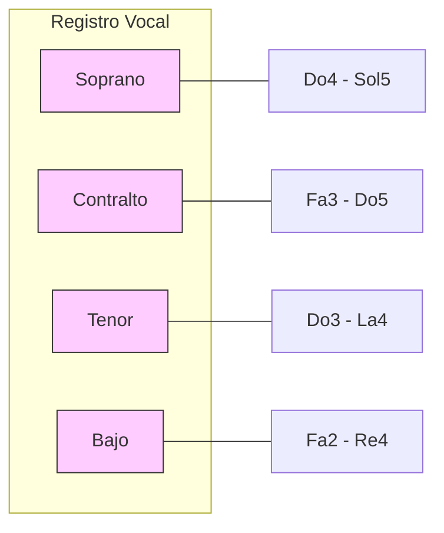

## Tipos de Movimiento entre Voces

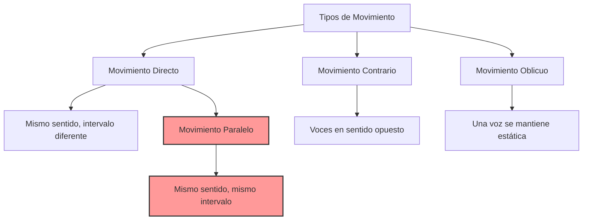

## Movimientos Prohibidos

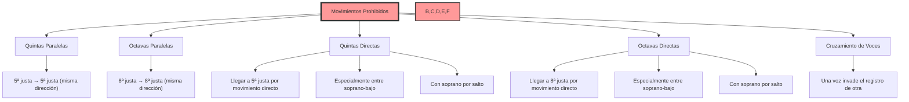

## Relación entre Intervalos y Movimientos

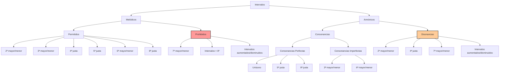

## Métodos de Enlace de Acordes

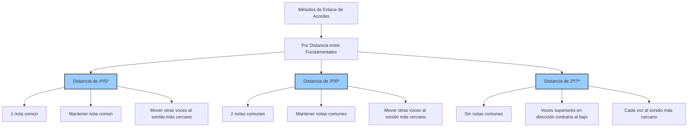

## Estructura de Cadencias

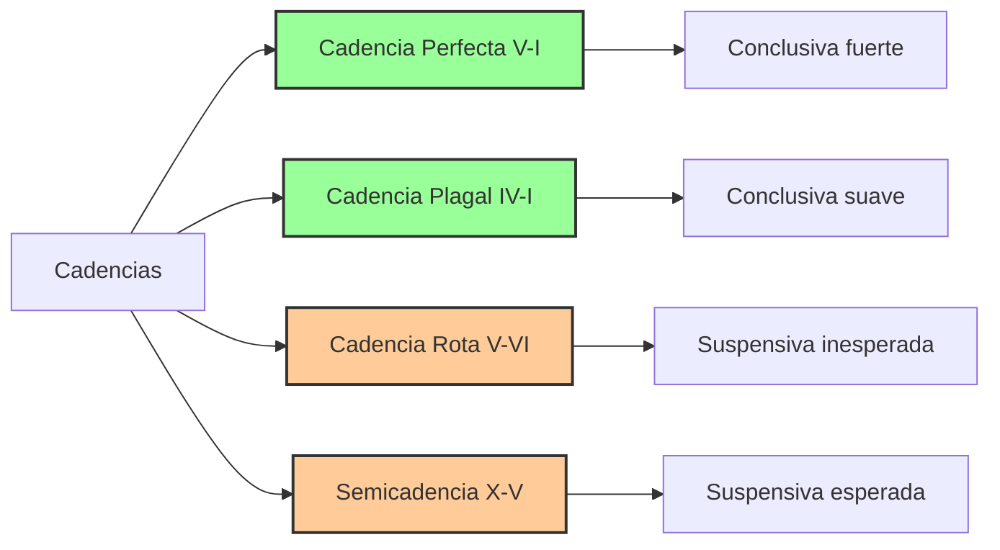

## Inversiones de Acordes

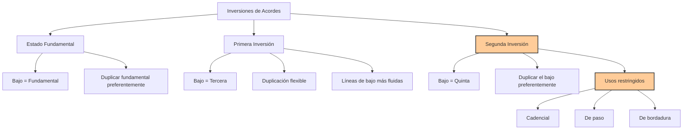

## Técnicas de Voicing

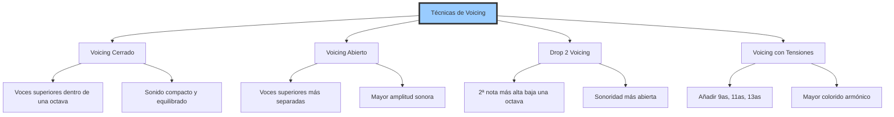

## Resoluciones Obligadas

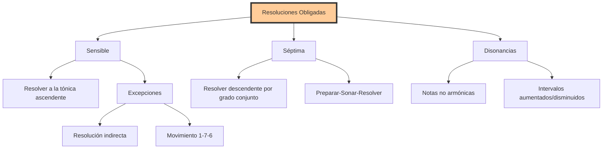

## Notas No Armónicas

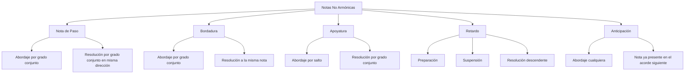

## Proceso de Composición

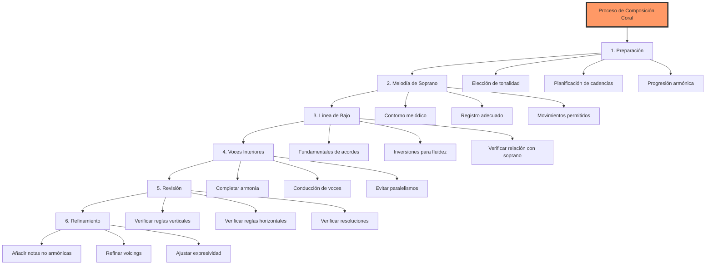

## Verificación Sistemática

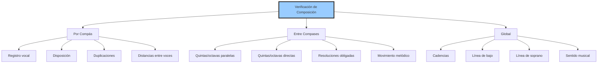

## Relaciones entre Tipos de Acordes

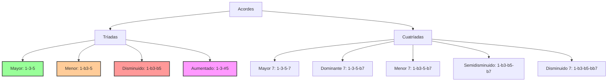

## Grados de la Escala y sus Funciones

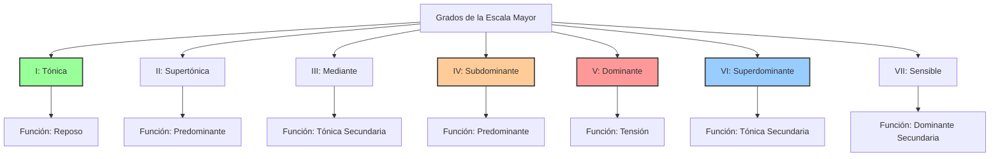

## Conexión entre Reglas y Resultado Musical

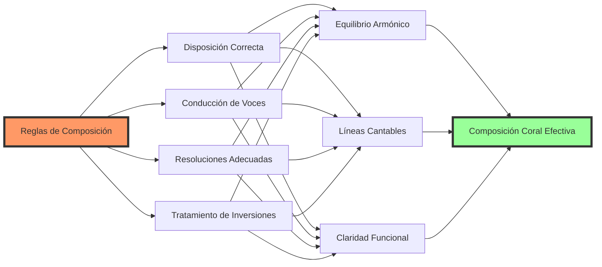
