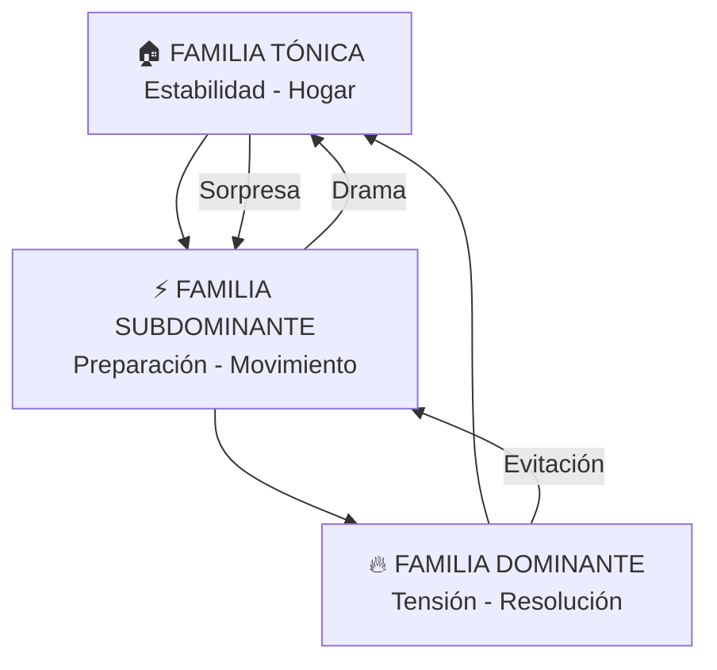
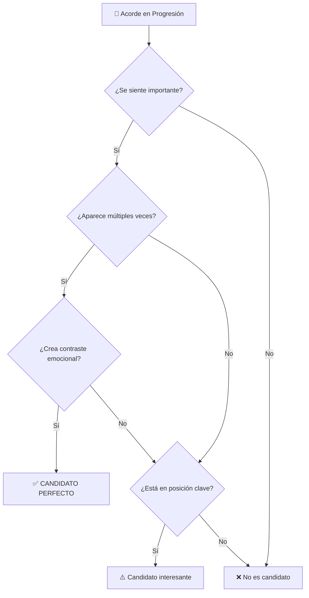
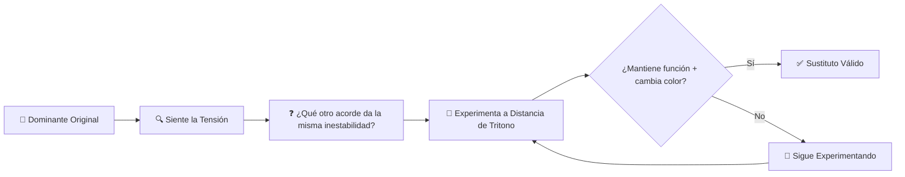
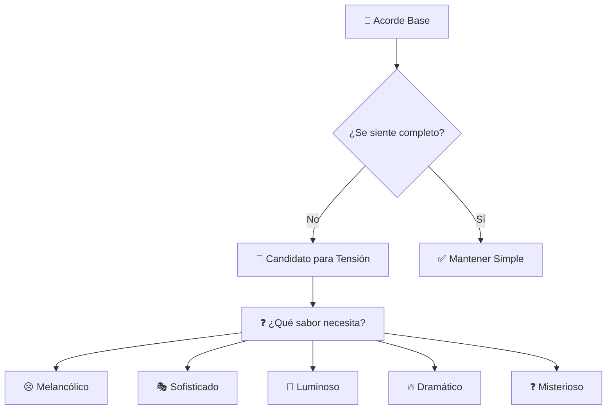
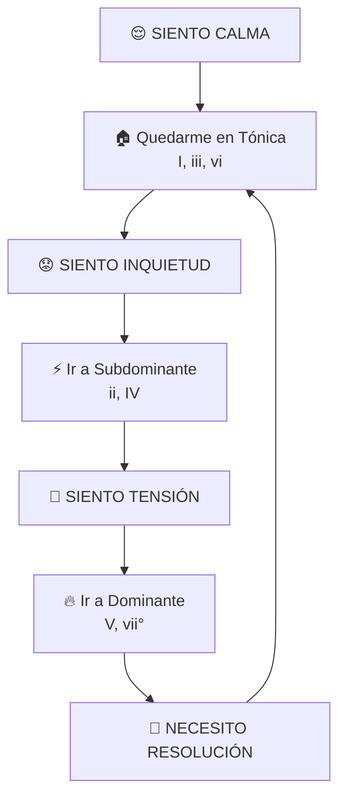
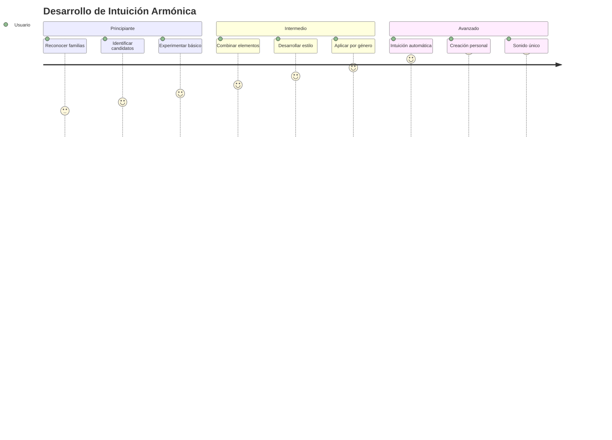

# 📊 **DIAGRAMAS Y TABLAS - GUÍAS INTUITIVAS**

## 🏛️ **1. FAMILIAS TONALES - DIAGRAMA VISUAL**

### **Mapa Emocional de Familias**

### **Tabla de Funciones por Escala**

| Escala             | Tónica       | Subdominante    | Dominante   | Color Característico |
| ------------------ | ------------ | --------------- | ----------- | -------------------- |
| **Mayor Natural**  | I - iii - vi | ii - IV         | V - vii°    | Luminoso, estable    |
| **Menor Natural**  | i - bIII     | iv - bVI        | v - bVII    | Melancólico, modal   |
| **Menor Armónica** | i - bIII     | ii° - iv - bVI  | V7 - vii°7  | Dramático, exótico   |
| **Menor Melódica** | i - bIII     | ii7 - IV7 - bVI | V7 - vii7b5 | Sofisticado, jazz    |

---

## 🎪 **2. DOMINANTES SECUNDARIOS - SISTEMA VISUAL**

### **Diagrama de Identificación de Candidatos**

### **Tabla de Candidatos por Prioridad**

| Prioridad       | Criterios                                                                                                 | Ejemplos    | Uso Intuitivo                      |
| --------------- | --------------------------------------------------------------------------------------------------------- | ----------- | ---------------------------------- |
| **🔥 ALTA**     | • Se siente importante • Aparece múltiples veces • Contraste emocional • Posición estructural | A#m, D#m, B | Intensificar emociones principales |
| **⚡ MEDIA**    | • Aparece múltiples veces • Posición estructural                                                      | F# (centro) | Dramatizar "vuelta a casa"         |
| **🎨 ESPECIAL** | • Ya es tenso • Posición de climax                                                                    | E#dim       | Maximizar tensión existente        |

### **Preguntas de Verificación**

| Fase        | Pregunta Clave                                                           | Objetivo              |
| ----------- | ------------------------------------------------------------------------ | --------------------- |
| **ANTES**   | ¿Qué acorde haría que el siguiente se sienta como LLEGADA más dramática? | Identificar necesidad |
| **DURANTE** | ¿Este acorde mantiene la función pero cambia el color?                   | Verificar efectividad |
| **DESPUÉS** | ¿La emoción se intensifica sin confundir la progresión?                  | Confirmar éxito       |

---

## 🔄 **3. SUSTITUTOS DE TRITONO - MAPA CONCEPTUAL**

### **Diagrama de Búsqueda Intuitiva**

### **Tabla de Colores de Sustitutos**

| Color Buscado      | Característica            | Cuándo Usar              | Efecto                   |
| ------------------ | ------------------------- | ------------------------ | ------------------------ |
| **🎨 CROMÁTICO**   | Movimiento fluido en bajo | Transiciones             | Línea melódica suave     |
| **🎭 SOFISTICADO** | Sonido "jazz" o elegante  | Reexposiciones           | Refinamiento armónico    |
| **⚡ SORPRESIVO**  | Giro inesperado           | Cadencias                | Elemento sorpresa        |
| **🌊 SUAVE**       | Tensión más sutil         | Progresiones repetitivas | Variedad sin agresividad |

### **Contextos Ideales**

| Contexto         | Aplicación         | Pregunta Guía                                           |
| ---------------- | ------------------ | ------------------------------------------------------- |
| **CADENCIAS**    | Finales de frases  | ¿Qué sustituto haría esta cadencia más elegante?        |
| **REPETICIONES** | Evitar monotonía   | ¿Qué sustituto agregaría variedad sin romper el patrón? |
| **TRANSICIONES** | Conexiones fluidas | ¿Qué sustituto haría esta transición más cromática?     |
| **VARIACIONES**  | Segundas veces     | ¿Qué sustituto haría que esta repetición suene fresca?  |

---

## 🎨 **4. TENSIONES - SISTEMA DE SABORES**

### **Diagrama de Identificación de Necesidades**

### **Tabla de Sabores por Tipo de Acorde**

| Tipo de Acorde  | Sabores Disponibles                       | Preguntas Guía                                   | Efecto Buscado                  |
| --------------- | ----------------------------------------- | ------------------------------------------------ | ------------------------------- |
| **MENORES**     | Melancólico Nostálgico Misterioso | ¿Qué tensión haría esta melancolía más profunda? | Intensificar emoción            |
| **MAYORES**     | Luminoso Sofisticado Brillante    | ¿Qué tensión haría esta luz más radiante?        | Realzar luminosidad             |
| **DISMINUIDOS** | Dramático Tenso Inestable         | ¿Qué tensión maximizaría esta inestabilidad?     | Amplificar tensión              |
| **DOMINANTES**  | Sofisticado Urgente Colorido      | ¿Qué tensión agregaría color sin quitar función? | Enriquecer sin perder dirección |

### **Método "Prueba y Siente"**

| Paso  | Acción                | Pregunta Clave                  |
| ----- | --------------------- | ------------------------------- |
| **1** | Toca acorde básico    | ¿Cómo se siente ahora?          |
| **2** | Agrega nota intuitiva | ¿Esto mejora el sabor buscado?  |
| **3** | Compara versiones     | ¿Cuál cuenta mejor la historia? |
| **4** | Verifica cantabilidad | ¿Puedo cantarlo naturalmente?   |

---

## 🎯 **5. PROGRESIONES INTUITIVAS - NAVEGACIÓN EMOCIONAL**

### **Mapa de Navegación por Sensaciones**

### **Tabla de Movimientos Emocionales**

| Movimiento  | Sensación             | Ejemplo             | Cuándo Usar          |
| ----------- | --------------------- | ------------------- | -------------------- |
| **I → ii**  | Suave preparación     | Tomar impulso       | Inicio de desarrollo |
| **I → iii** | Melancolía ascendente | Nostalgia que crece | Giro emotivo         |
| **I → IV**  | Fuerza que se alza    | Determinación       | Preparación fuerte   |
| **I → V**   | Tensión máxima        | Climax emocional    | Momento dramático    |
| **I → vi**  | Sorpresa melancólica  | Giro inesperado     | Cambio de mood       |
| **V → I**   | Llegada a casa        | Resolución perfecta | Cadencia final       |
| **V → vi**  | Sorpresa suave        | Evitación hermosa   | Evitar resolución    |

---

## 🎪 **6. INTEGRACIÓN - COMBINANDO ELEMENTOS**

### **Matriz de Combinaciones**

| Base                  | + Dominante Secundario | + Sustituto Tritono  | + Tensión          | Resultado           |
| --------------------- | ---------------------- | -------------------- | ------------------ | ------------------- |
| **Progresión Simple** | Intensifica llegadas   | Agrega sofisticación | Enriquece color    | Progresión rica     |
| **Acorde Repetido**   | Varía segunda vez      | Alterna versiones    | Evoluciona tensión | Desarrollo dinámico |
| **Cadencia Final**    | Dramatiza resolución   | Sorprende elegante   | Colorea acordes    | Climax sofisticado  |

### **Orden de Aplicación Sugerido**

| Paso  | Elemento               | Objetivo               | Verificación                     |
| ----- | ---------------------- | ---------------------- | -------------------------------- |
| **1** | Dominantes Secundarios | Intensificar emociones | ¿Se siente más dramático?        |
| **2** | Sustitutos de Tritono  | Agregar sofisticación  | ¿Mantiene función + nuevo color? |
| **3** | Tensiones              | Enriquecer acordes     | ¿Suena más interesante?          |
| **4** | Integración            | Balancear elementos    | ¿Cuenta una historia coherente?  |

---

## 🏆 **7. SEÑALES DE ÉXITO - CHECKLIST VISUAL**

### **✅ Indicadores Positivos**

| Aspecto       | Señal de Éxito                           | Verificación           |
| ------------- | ---------------------------------------- | ---------------------- |
| **Emocional** | Quieres escuchar esa parte repetidamente | ¿Te emociona?          |
| **Funcional** | Mantiene dirección armónica clara        | ¿Sabes hacia dónde va? |
| **Natural**   | Puedes cantarlo intuitivamente           | ¿Es cantable?          |
| **Integrado** | Se siente como "siempre debió sonar así" | ¿Suena inevitable?     |

### **⚠️ Señales de Alerta**

| Problema        | Síntoma                       | Solución                              |
| --------------- | ----------------------------- | ------------------------------------- |
| **Académico**   | Suena forzado o teórico       | Simplificar, confiar en oído          |
| **Confuso**     | Pierde dirección armónica     | Reducir elementos, clarificar función |
| **Complejo**    | Demasiados elementos juntos   | Aplicar "menos es más"                |
| **Distractivo** | Llama atención sobre sí mismo | Hacer más sutil o eliminar            |

---

## 💫 **OBJETIVO FINAL - MAPA DE DESARROLLO**

