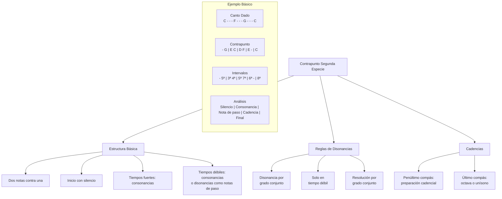
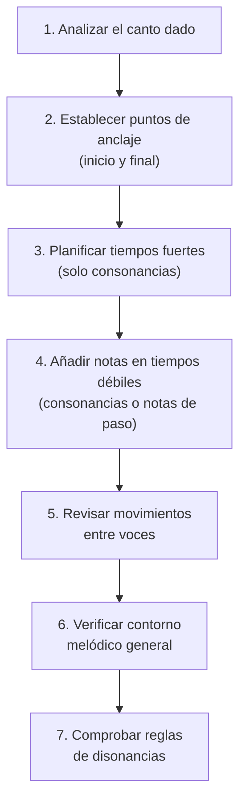

# Contrapunto Segunda Especie - Diagrama Visual

## Estructura Básica



## Notación Musical - Ejemplos Visuales

### Ejemplo 1: Contrapunto Segunda Especie en Do Mayor

```
Soprano (contrapunto):   -  G | E  C | F  E | D  C | E  D | C
                         |    | |  | | |  | | |  | | |  | |
Bajo (canto dado):       C    | G    | A    | F    | G    | C
```

#### Análisis:

1. **Compás 1**: Inicio con silencio y 5ª (consonancia perfecta)
2. **Compás 2**: 6ª (consonancia) y 4ª (disonancia como nota de paso)
3. **Compás 3**: 6ª (consonancia) y 5ª (consonancia)
4. **Compás 4**: 6ª (consonancia) y 5ª (consonancia)
5. **Compás 5**: 6ª (consonancia) y 5ª (consonancia)
6. **Compás 6**: 8ª (consonancia perfecta para final)

### Ejemplo 2: Uso Correcto de Disonancias

```
Contrapunto:  E  F  G    (F es disonante, conecta E y G por grado conjunto)
              |  |  |
Canto dado:   C     C
Intervalos:   3ª 4ª 5ª    (4ª es disonancia en tiempo débil como nota de paso)
```

### Ejemplo 3: Uso Incorrecto de Disonancias

```
Contrapunto:  C  A  G    (A es disonante y viene por salto desde C) ❌
              |  |  |
Canto dado:   F     F
Intervalos:   5ª 3ª 2ª    (3ª es disonancia en tiempo débil por salto)
```

### Ejemplo 4: Quintas Paralelas (Incorrecto)

```
Contrapunto:  G  A  E  F    ❌
              |     |
Canto dado:   C     A
Intervalos:   5ª    5ª      (Quintas paralelas en tiempos fuertes)
```

### Ejemplo 5: Cadencia Final Correcta

```
Contrapunto:  B  C  C
              |  |  |
Canto dado:   G     C
Intervalos:   3ª 8ª 8ª    (Movimiento hacia octava en final)
```

## Tabla Comparativa: Primera vs. Segunda Especie

| Característica        | Primera Especie        | Segunda Especie                                  |
| --------------------- | ---------------------- | ------------------------------------------------ |
| **Relación de notas** | 1:1 (nota contra nota) | 2:1 (dos notas contra una)                       |
| **Inicio**            | Consonancia perfecta   | Silencio + consonancia                           |
| **Disonancias**       | Prohibidas             | Permitidas en tiempos débiles como notas de paso |
| **Movimiento**        | Más estático           | Mayor fluidez melódica                           |
| **Final**             | Octava o unísono       | Octava o unísono                                 |

## Diagrama de Flujo: Proceso de Composición



## Aplicación Práctica: Transformación de Primera a Segunda Especie

### Primera Especie Original:

```
Contrapunto:  G  E  F  D  C
              |  |  |  |  |
Canto dado:   C  A  F  G  C
Intervalos:   5ª 5ª 8ª 5ª 8ª
```

### Transformación a Segunda Especie:

```
Contrapunto:  -  G | E  C | F  A | D  B | C
              |    | |  | | |  | | |  | |
Canto dado:   C    | A    | F    | G    | C
Intervalos:   -  5ª| 5ª 3ª| 8ª 3ª| 5ª 3ª| 8ª
```

#### Análisis de la transformación:

1. Se añadió un silencio al inicio
2. Se insertaron notas intermedias (C, A, B) para crear movimiento
3. Se mantuvieron las consonancias en tiempos fuertes
4. Se creó un contorno melódico más fluido y dinámico
