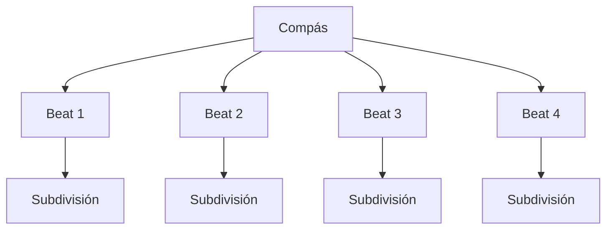
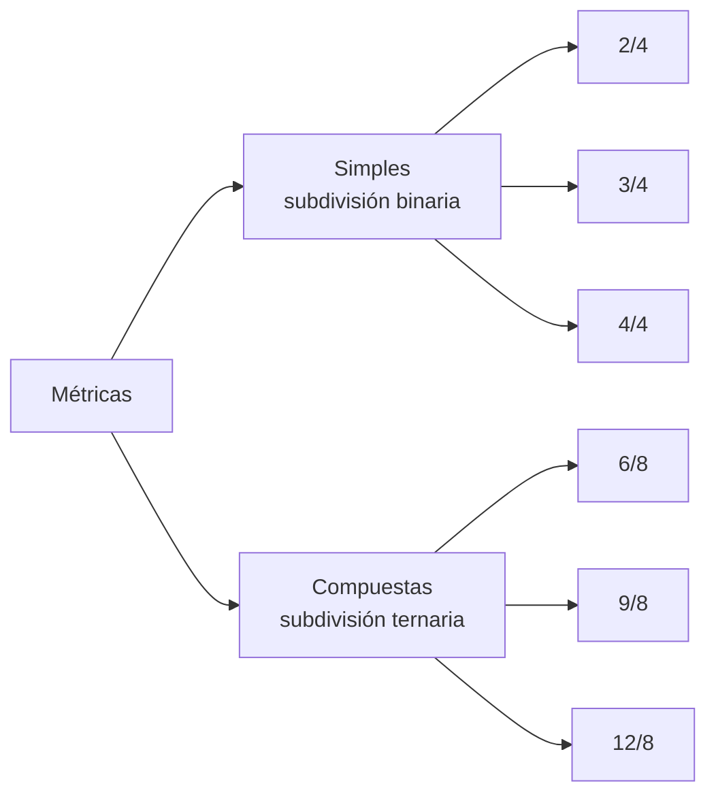
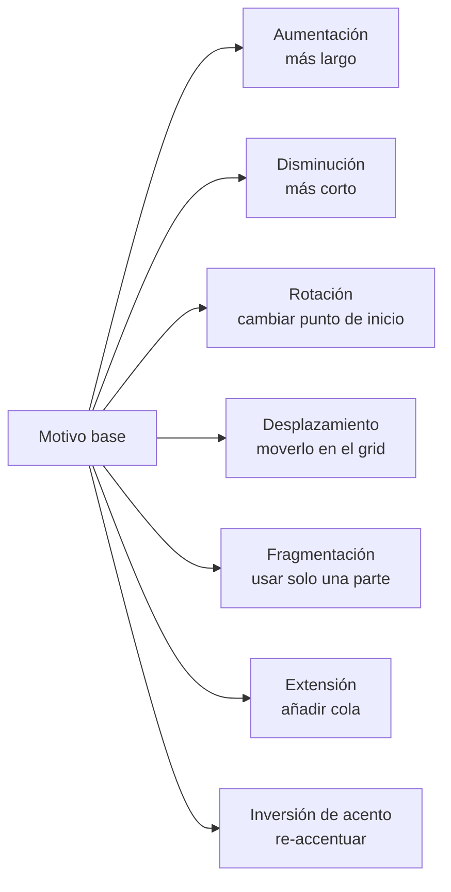
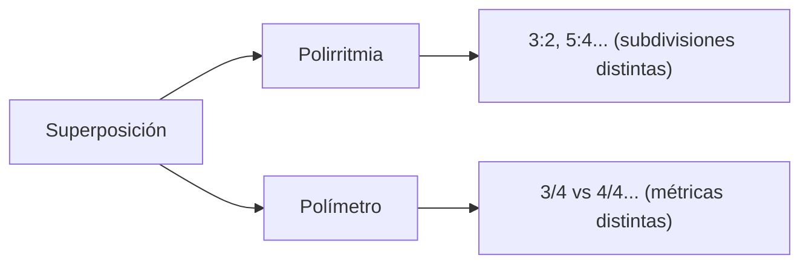

Aquí tienes la **guía completa y súper extendida de Ritmo como Lenguaje**, ahora **con ejemplos en `music-abc`** y **diagramas en `mermaid.js`**, pensada para que puedas **leer**, **entender**, y **usar** el ritmo como un sistema con **reglas**, **jerarquías** y **recursos expresivos** (no solo “patrones”).  
(La base de ejemplos ABC y transformaciones rítmicas está alineada con tu playbook de motivos rítmicos en ABC).

---

# Guía Súper Extendida: Ritmo como Lenguaje

## 0) Cómo usar esta guía

- **Ritmo = lenguaje**: tiene _fonética_ (subdivisión), _gramática_ (métrica y acento), _sintaxis_ (frases), _semántica_ (energía/expectativa) y _pragmática_ (estilo/contexto).
    
- Los ejemplos `music-abc` están **con una sola nota (C)** muchas veces para que el foco sea el **timing** (ataques y silencios). Puedes reemplazar “C” por notas reales o mapearlo a **kick/snare/hat**.
    

---

## 1) Ritmo como lenguaje: qué “dice” cada cosa

### 1.1 Mapa del lenguaje rítmico

```mermaid
flowchart TD
A[Ritmo como Lenguaje] --> B[Fonología<br/>subdivisión, duración, silencio]
A --> C[Gramática<br/>métrica, acento, jerarquía fuerte-débil]
A --> D[Sintaxis<br/>motivos, frases, periodos, forma]
A --> E[Semántica<br/>energía, tensión, estabilidad, dirección]
A --> F[Pragmática<br/>estilo: swing, clave, backbeat, etc.]

B --> B1["Pulso (beat)"]
B --> B2["Subdivisión (8vos, 16vos, tresillos)"]
B --> B3["Duración (sostener vs cortar)"]
B --> B4["Silencio (puntuación)"]

C --> C1["Compás y acentos naturales"]
C --> C2["Síncopa y contratiempo"]
C --> C3["Hiper-métrica (frases de 2/4/8 compases)"]

D --> D1["Motivo (unidad)"]
D --> D2["Repetición + variación"]
D --> D3["Call/response"]
D --> D4["Cadencias rítmicas"]

E --> E1["Densidad (más notas = más energía)"]
E --> E2["Anticipación (empuje)"]
E --> E3["Retardo (suspensión)"]
E --> E4["Regularidad vs sorpresa"]
```



### 1.2 Semántica práctica: “qué comunica qué”

|Recurso|Qué suele comunicar|Cómo se siente|
|---|---|---|
|**Regularidad** (hits en tiempos fuertes)|estabilidad / certeza|“en el piso”, firme|
|**Síncopa** (acento en débil)|impulso / deseo de avanzar|“hacia delante”|
|**Anticipación** (llegar antes)|prisa / intención / groove|“empuja”|
|**Retardo** (llegar tarde/ligar)|peso / sensualidad / suspensión|“flota” o “se cuelga”|
|**Silencio**|puntuación / dramatismo / respiración|“corte” expresivo|
|**Aumentación** (valores largos)|grandeza / calma / “espacio”|cinematográfico|
|**Disminución** (valores cortos)|urgencia / brillo / drive|nervio|
|**Polirritmia**|complejidad / trance / expansión|“dos mundos”|

---

## 2) La jerarquía del tiempo: pulso, subdivisión y capas

### 2.1 La regla madre

**Todo ritmo se entiende mejor como una jerarquía:**

- Compás (macro)
    
- Pulso / beats (medio)
    
- Subdivisión (micro)
    



### 2.2 Ejemplo: pulso “neutral” (cuartos en 4/4)

```music-abc
X:1
T:Pulso básico (4/4) - cuartos
M:4/4
L:1/4
Q:1/4=90
K:C
C C C C |
```

### 2.3 Subdivisión en 8vos (misma música, más resolución)

```music-abc
X:2
T:Subdivisión en 8vos (4/4)
M:4/4
L:1/8
Q:1/4=90
K:C
C C C C C C C C |
```

**Idea clave:** la subdivisión es como aumentar los “pixeles” del ritmo: no cambia el compás, cambia la definición.

---

## 3) Métrica: el “marco gramatical” del ritmo

### 3.1 Qué es la métrica (y por qué manda)

La métrica define:

- **qué se siente “fuerte”** y qué “débil”
    
- qué agrupaciones son “naturales”
    
- cómo se interpreta una síncopa
    

### 3.2 Simple vs compuesta

- **Métrica simple**: el beat se subdivide en **2** (2/4, 3/4, 4/4).
    
- **Métrica compuesta**: el beat se subdivide en **3** (6/8, 9/8, 12/8).
    



### 3.3 Tabla: acentos típicos

|Compás|Conteo típico|Acento natural (fuerte→débil)|
|---|---|---|
|4/4|1 & 2 & 3 & 4 &|**1** fuerte, 3 medio, 2/4 débiles|
|3/4|1 2 3|**1** fuerte, 2/3 débiles|
|2/4|1 2|**1** fuerte, 2 débil|
|6/8|1 la li 2 la li|**1** fuerte, 2 medio (dos beats grandes)|
|12/8|1..2..3..4.. (en tresillos)|1 fuerte, 3 medio, etc|

### 3.4 Ejemplos ABC: 4/4 vs 6/8 “se sienten diferente”

**4/4 (binario)**

```music-abc
X:3
T:4/4 - sensación binaria
M:4/4
L:1/8
Q:1/4=96
K:C
C z C z C z C z |
```

**6/8 (ternario)**

```music-abc
X:4
T:6/8 - sensación compuesta (2 beats grandes)
M:6/8
L:1/8
Q:3/8=84
K:C
C z z C z z |
```

---

## 4) Lectura rítmica: “alfabeto” y “ortografía” (sin dolor)

### 4.1 Tabla esencial de valores (para leer y escribir)

|Nombre|En 4/4|En ABC (si L:1/8)|Comentario|
|---|--:|---|---|
|Negra|1 beat|`C2`|2×1/8 = 1/4|
|Corchea|1/2 beat|`C`|1/8|
|Blanca|2 beats|`C4`|4×1/8 = 1/2|
|Redonda|4 beats|`C8`|8×1/8 = 1|
|Silencio|—|`z`|mismo valor que nota|

### 4.2 Tres herramientas que cambian TODO

1. **Ligadura (tie)** = sostener y crear síncopa real
    
2. **Puntillo** = alargar 50%
    
3. **Tresillo (tuplet)** = “3 en el tiempo de 2”
    

**Ligadura (síncopa por tie)**

```music-abc
X:5
T:Ligadura creando síncopa (4/4)
M:4/4
L:1/8
Q:1/4=90
K:C
C2- C z2 C2 z |
```

**Tresillos**

```music-abc
X:6
T:Tresillos sobre 4/4 (sensación ternaria encima)
M:4/4
L:1/8
Q:1/4=84
K:C
(3 C C C (3 C C C (3 C C C (3 C C C |
```

---

## 5) Groove: acento + repetición + microvariación

### 5.1 El groove no es “complicación”

Groove = **claridad repetida** + **pequeñas variaciones** que hacen que respire.

```mermaid
flowchart TD
G[Groove] --> P[Pulso claro]
G --> A[Acentos consistentes]
G --> R[Repetición (loop)]
G --> V[Variación mínima]
G --> S[Silencios estratégicos]
V --> V1["ghost / huecos"]
V --> V2["anticipaciones pequeñas"]
V --> V3["fills cortos"]
```

### 5.2 Backbeat (2 y 4): “gramática pop/rock”

```music-abc
X:7
T:Backbeat (2 y 4) - esqueleto
M:4/4
L:1/8
Q:1/4=100
K:C
z2 C2 z2 C2 |
```

### 5.3 Swing / shuffle (aproximación práctica en ABC)

**Dotted-pair “swingish” (no es swing perfecto, pero sirve para ilustrar)**

```music-abc
X:8
T:Par punteado (swing emulado)
M:4/4
L:1/8
Q:1/4=90
K:C
C>D C>D C>D C>D |
```

**Shuffle 12/8 (muy claro)**

```music-abc
X:9
T:12/8 shuffle skeleton
M:12/8
L:1/8
Q:3/8=52
K:C
C z z  C z  C  z  C  z  C  z  z |
```

---

## 6) Motivo rítmico: la unidad mínima con identidad

Un **motivo rítmico** es una “palabra”: un patrón reconocible de **ataques** (y silencios) que puedes transportar a melodía, bajo, acordes o percusión.

### 6.1 Tresillo (3–3–2): una palabra extremadamente útil

```music-abc
X:10
T:Tresillo 3-3-2 (4/4 en 8vos)
M:4/4
L:1/8
Q:1/4=96
K:C
C z2 C z2 C z |
```

### 6.2 Off-beats: “aire” + empuje

```music-abc
X:11
T:Off-beat 8ths (contratiempo constante)
M:4/4
L:1/8
Q:1/4=108
K:C
z C z C z C z C |
```

### 6.3 Long–Short–Short: recurso universal para hooks

```music-abc
X:12
T:Long-Short-Short (negra + dos corcheas)
M:4/4
L:1/8
Q:1/4=92
K:C
C2 C C z2 C2 z |
```

---

## 7) Transformaciones: “morfología” del ritmo (cómo haces que evolucione sin perder identidad)

### 7.1 Las 7 transformaciones más productivas



### 7.2 Aumentación y disminución (misma idea, distinto zoom)

```music-abc
X:13
T:Aumentación/Disminución del pulso
M:4/4
K:C
%% Base (cuartos)
L:1/4
C C C C |
%% Disminución (8vos)
L:1/8
C C C C C C C C |
%% Aumentación (blancas)
L:1/2
C C |
```

### 7.3 Desplazamiento (displacement): mismo patrón, otro “piso”

```music-abc
X:14
T:Desplazamiento de tresillo (por 1 corchea)
M:4/4
L:1/8
Q:1/4=96
K:C
%% Base
C z2 C z2 C z |
%% Desplazado
z C z2 C z2 C |
```

### 7.4 Rotación (otra sílaba se vuelve “inicio”)

```music-abc
X:15
T:Rotación del tresillo (arranca en el último golpe)
M:4/4
L:1/8
Q:1/4=96
K:C
C z C z2 C z2 |
```

---

## 8) Síncopa: la “disonancia rítmica” (y sus reglas)

### 8.1 Qué es, de verdad

Síncopa = cuando tu oído espera que el peso caiga en un lugar (fuerte), pero:

- el ataque cae en **débil**, o
    
- se sostiene (tie) desde débil hacia fuerte, o
    
- se acentúa un “entre”.
    

> Importante: la síncopa **no es caos**. Funciona porque existe una **jerarquía fuerte-débil** previa.

### 8.2 Reglas prácticas de síncopa (para que suene “musical”)

- **Regla de claridad**: si sincopas todo el tiempo, dejas de sincopar.
    
- **Regla de respiración**: la síncopa necesita _espacios_ (silencios o notas largas) para que se entienda.
    
- **Regla de resolución**: mucha síncopa se “resuelve” cuando vuelves a aterrizar en fuerte (aunque sea 1 golpe).
    

### 8.3 Síncopa por ligadura (la más clásica y controlable)

```music-abc
X:16
T:Síncopa por ligadura (ataque en débil, sostén al fuerte)
M:4/4
L:1/8
Q:1/4=92
K:C
z C- C z z C- C z |
```

### 8.4 Anticipación: “llegar antes” (empuje)

```music-abc
X:17
T:Anticipación (pickup al siguiente beat)
M:4/4
L:1/8
Q:1/4=96
K:C
C z C z C z z C |
```

### 8.5 Conexión oro con melodía y armonía

En escritura tonal/contrapuntística, una regla de oro es:

- **tensiones/enlaces** en partes débiles
    
- **consonancias/anclas** en partes fuertes  
    Esto aplica tanto a notas no armónicas como a síncopas: coloca “movimiento” en débil y “estructura” en fuerte.
    

---

## 9) Hemiola, cross-accents y “cambiar el lente” sin cambiar el compás

### 9.1 Hemiola: sentir 3 sobre un marco de 2 (o viceversa)

Ejemplo típico: en 4/4, agrupar en 3+3+2 o acentuar cada 3 corcheas.

```music-abc
X:18
T:Hemiola de acentos (3s sobre 4/4 en 8vos)
M:4/4
L:1/8
Q:1/4=92
K:C
!accent!C C C  !accent!C C C  !accent!C C |
```

**Qué comunica:** “cambio de gravedad” sin cambiar la métrica escrita.

---

## 10) Polirritmia vs Polímetro: dos fenómenos distintos

### 10.1 Diferencia esencial

- **Polirritmia**: misma duración de compás, pero subdivisiones distintas al mismo tiempo (3:2, 5:4).
    
- **Polímetro**: cada capa tiene distinto compás (3/4 contra 4/4), se realinean más tarde.
    



### 10.2 3 contra 2 (polirritmia)

```music-abc
X:19
T:3:2 (polirritmia básica en 2/4)
M:2/4
L:1/8
Q:1/4=92
K:C
V:1 name=Triplets
V:2 name=Straight
%%score (V1 V2)
V:1 (3 C C C (3 C C C |
V:2 C C C C |
```

### 10.3 Polímetro (3/4 contra 4/4): se alinea después

```music-abc
X:20
T:Polímetro (idea): 4/4 vs 3/4
M:4/4
L:1/8
Q:1/4=96
K:C
V:1 name=4-4
V:2 name=3-4
%%score (V1 V2)
V:1 C z2 C z2 C z |
V:2 M:3/4 C z C z C z |
```

---

## 11) Ritmo armónico: cuándo cambian los acordes (y por qué es tu “pacing”

### 11.1 Ritmo armónico = edición cinematográfica

Aunque no cambies tu groove, el simple hecho de cambiar:

- **cada compás**, o
    
- **cada 2 compases**, o
    
- **a contratiempo**,  
    cambia el discurso completo.
    

### 11.2 Diagrama (ii–V–I con respiro en I)

```mermaid
gantt
title Ritmo armónico (ii–V–I) + capas (concepto)
dateFormat  X
axisFormat  %L
section Acordes
Dm7      :a1, 0, 1
G7       :a2, 1, 1
Cmaj7    :a3, 2, 2
section Capas
Bajo (pulso)     :b1, 0, 4
Acomp (pads)     :b2, 0, 4
Melodía (motivo) :b3, 0, 4
```



Esto se alinea con tu enfoque de integrar ritmo por capas (bajo/pad/melodía) y planear el pacing armónico.

---

## 12) Capas: cómo repartir el ritmo para que suene grande sin saturar

### 12.1 La regla de orquestación rítmica

Un groove sólido casi siempre tiene estas funciones:

|Capa|Rol rítmico|Qué debe hacer|
|---|---|---|
|**Pulso**|“reloj”|dar referencia (a veces mínimo)|
|**Ancla**|“suelo”|marcar 1 / 2&4 / patrón base|
|**Contrapunto**|“movimiento”|síncopas, respuestas, fills|
|**Colchón**|“espacio”|notas largas / pads / drones|
|**Motivo**|“identidad”|frase rítmica repetible|

### 12.2 Matriz de capas (ejemplo con tresillo)

```mermaid
flowchart TD
A[Motivo: tresillo 3-3-2] --> B[Melodía: motivo literal]
A --> C[Bajo: aumentación (más lento)]
A --> D[Percusión: fragmentación (solo golpes 1 y 2)]
A --> E[Pad: blancas (espacio)]
```

**ABC: tresillo arriba + bajo más lento**

```music-abc
X:21
T:Capas: tresillo arriba + bajo en aumentación
M:4/4
L:1/8
Q:1/4=96
K:C
V:1 name=Top
V:2 name=Bass
%%score (V1 V2)
V:1 C z2 C z2 C z |
V:2 C2 z2 C2 z2 |
```

---

## 13) Ritmo y melodía: “anclas” y “relleno” (la regla más útil)

Piensa la melodía rítmicamente como:

- **Anclas** (notas estructurales) en tiempos fuertes
    
- **Enlaces** (pasos, vecinas, cromáticos) en tiempos débiles
    

Eso es literalmente el puente entre ritmo y conducción de voces: colocar el “enlace” donde no destruye el acento estructural.

**Ejemplo: anclas en beats, enlaces en offbeats**

```music-abc
X:22
T:Anclas (fuertes) + enlaces (débiles)
M:4/4
L:1/8
Q:1/4=96
K:C
%% Acentos: 1 2 3 4 (anclas), los "&" (enlace)
C D C D  C D C D |
```

_(Aquí “D” podría ser nota de paso/vecina; la idea es el esquema rítmico.)_

---

## 14) Additive meters: cuando la gramática es “3+2+2” en vez de 4

### 14.1 7/8 como 3+2+2

```music-abc
X:23
T:7/8 (3+2+2) - agrupación clara
M:7/8
L:1/8
Q:1/8=176
K:C
C C C  C C  C C |
```

### 14.2 7/8 como 2+2+3 (cambia la frase)

```music-abc
X:24
T:7/8 (2+2+3)
M:7/8
L:1/8
Q:1/8=176
K:C
C C  C C  C C C |
```

**Regla:** en compases aditivos, lo importante no es “contar hasta 7”, sino **sentir los grupos**.

---

## 15) Puntuación rítmica: comas, puntos y signos de interrogación

### 15.1 Cómo se “cierra” una idea sin cambiar armonía

Puntuación rítmica típica:

- **nota larga** al final (cadencia rítmica)
    
- **silencio** al final (corte)
    
- **break**: quitar el pulso un instante y volver
    
- **respuesta**: mini fill que “contesta” y reinicia
    

**Ejemplo: cerrar con silencio**

```music-abc
X:25
T:Puntuación: cierre con silencio
M:4/4
L:1/8
Q:1/4=96
K:C
C C C C  C C z2 |
```

**Ejemplo: cierre con nota larga**

```music-abc
X:26
T:Puntuación: cierre con nota larga
M:4/4
L:1/8
Q:1/4=96
K:C
C C C C  C2 z2 |
```

---

## 16) Reglas de “buen ritmo” en composición (checklists reales)

### 16.1 Checklist de claridad (si falla esto, nada importa)

- ¿Se entiende **dónde está el 1**?
    
- ¿Tu patrón tiene un **motivo identificable** (aunque sea simple)?
    
- ¿Hay **respiración** (espacios/silencios/notas largas) o es una ametralladora constante?
    

### 16.2 Checklist de interés (lo que hace que no sea aburrido)

- ¿Tienes **repetición + variación** (no una sola de las dos)?
    
- ¿Tu variación es **pequeña** (micro) la mayor parte del tiempo y **grande** (macro) solo en momentos clave?
    
- ¿El ritmo “cuenta una historia” (crece / afloja / vuelve)?
    

### 16.3 Checklist de coherencia entre capas

- ¿Las capas compiten por el mismo espacio rítmico?
    
- ¿Alguna capa debería ser “colchón” (espacio) en vez de “contrapunto”?
    
- ¿Tu motivo aparece en **más de una capa** (aunque transformado)? Eso crea unidad.
    

---

## 17) Ruta para avanzar (sin ejercicios, pero con mapa claro)

```mermaid
flowchart TD
A[Nivel 0: Pulso y subdivisión] --> B[Nivel 1: Métrica y acentos]
B --> C[Nivel 2: Motivos (células) y repetición]
C --> D[Nivel 3: Variación (desplazar, rotar, fragmentar)]
D --> E[Nivel 4: Groove por capas + ritmo armónico]
E --> F[Nivel 5: Polirritmia, compases aditivos, modulación métrica]
```

### Qué significa “dominar” cada nivel

- **Nivel 0**: puedes escribir/leer un patrón en 4/4 y 6/8 sin perderte.
    
- **Nivel 1**: puedes decidir dónde están los acentos (y sostenerlos).
    
- **Nivel 2**: puedes inventar 3–5 motivos simples que suenen distintos.
    
- **Nivel 3**: puedes hacer que un motivo dure 16 compases sin aburrir.
    
- **Nivel 4**: puedes distribuir el ritmo entre bajo/armonía/melodía.
    
- **Nivel 5**: puedes usar complejidad sin perder claridad.
    

---

## 18) Mini-glosario de términos rítmicos (para que todo sea consistente)

- **Anacrusa**: notas antes del primer tiempo fuerte (pickup).
    
- **Contratiempo**: acento en “&” u otras partes débiles.
    
- **Síncopa**: ataque/acentuación que contradice el acento natural.
    
- **Hemiola**: sensación de 3 sobre 2 (o 2 sobre 3).
    
- **Ostinato**: patrón repetitivo persistente.
    
- **Polirritmia**: distintas subdivisiones simultáneas.
    
- **Polímetro**: distintos compases simultáneos.
    

---

## 19) Conexión directa con tu path de composición (armonía/voicings/contrapunto)

Tu material previo refuerza una idea poderosa: **el ritmo decide dónde “pesan” las cosas**. En conducción de voces y enlaces, eso se traduce en:

- **enlaces/tensiones** en débiles
    
- **resoluciones/consonancias** en fuertes  
    y eso vale igual para melodía, voces internas y bajo.
    

---

Si quieres, en el siguiente paso (sin convertirlo en “ejercicios”), puedo:

- armarte una **biblioteca por estilos** (dream pop / folk / neo-soul / latin / funk) con **8–12 grooves base** en `music-abc`,
    
- y un set de **diagramas mermaid** por estilo (capas, acentos, ritmo armónico típico),  
    todo manteniendo esta misma lógica de “ritmo como lenguaje”.