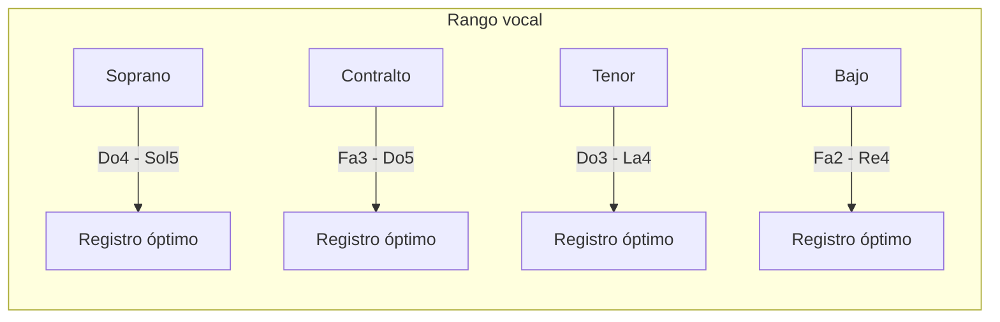
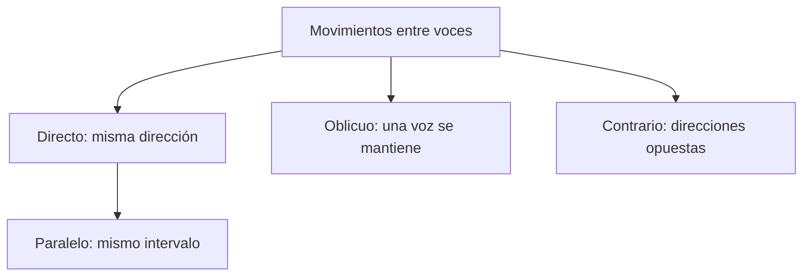
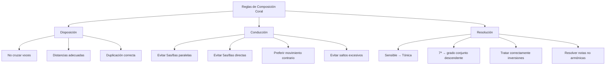

# Reglas de Composición Coral a 4 Voces

## 1. Reglas fundamentales de disposición vocal

### Rangos vocales

Cada voz debe mantenerse dentro de su registro natural:

| Voz       | Registro óptimo | Registro extremo |
| --------- | --------------- | ---------------- |
| Soprano   | Do4 - Sol5      | Si3 - La5        |
| Contralto | Fa3 - Do5       | Mi3 - Re5        |
| Tenor     | Do3 - La4       | Si2 - Si4        |
| Bajo      | Fa2 - Re4       | Mi2 - Mi4        |



### Distancia entre voces

1. **Regla básica**: Las voces no deben cruzarse ni solaparse
2. **Distancia máxima**:
   - Entre soprano y contralto: no más de una octava
   - Entre contralto y tenor: no más de una octava
   - Entre tenor y bajo: puede exceder una octava

```music-abc
X:1
T:Distancia correcta entre voces
M:C
L:1/1
K:C
[CEGc]|]
```

```music-abc
X:1
T:Distancia incorrecta (soprano-contralto > octava)
M:C
L:1/1
K:C
[Ce'Gc]|]
```

## 2. Reglas de distribución de los acordes

### Distribución de acordes tríada (3 notas) entre 4 voces

1. **Duplicación prioritaria**:
   - Primera opción: Duplicar la fundamental
   - Segunda opción: Duplicar la quinta
   - Evitar duplicar la tercera (excepto en acordes de primera inversión)
   - Nunca duplicar la sensible (7º grado)

```music-abc
X:1
T:Duplicación correcta (fundamental)
M:C
L:1/1
K:C
[CEGc]|]
W: C-E-G-C
```

```music-abc
X:1
T:Duplicación correcta (quinta)
M:C
L:1/1
K:C
[CEGg]|]
W: C-E-G-G
```

### Disposiciones de acordes

1. **Disposición cerrada**: Las tres voces superiores están dentro del intervalo de una octava
2. **Disposición abierta**: Las tres voces superiores abarcan más de una octava

```music-abc
X:1
T:Disposición cerrada
M:C
L:1/1
K:C
[CEGc]|]
```

```music-abc
X:1
T:Disposición abierta
M:C
L:1/1
K:C
[CEgc]|]
```

## 3. Reglas básicas de conducción de voces

### Tipos de movimiento



### Movimientos prohibidos

1. **Quintas paralelas**: Prohibido mover dos voces formando quintas justas consecutivas
2. **Octavas paralelas**: Prohibido mover dos voces formando octavas justas consecutivas

```music-abc
X:1
T:Quintas paralelas (PROHIBIDO)
M:C
L:1/2
K:C
[C,CG] [D,DA]|]
W: 5J    5J
```

```music-abc
X:1
T:Octavas paralelas (PROHIBIDO)
M:C
L:1/2
K:C
[C,C] [D,D]|]
W: 8J  8J
```

3. **Quintas directas**: Prohibidas entre voces extremas (soprano y bajo) cuando:
   - Ambas voces se mueven en la misma dirección
   - La soprano se mueve por salto

```music-abc
X:1
T:Quintas directas (PROHIBIDO)
M:C
L:1/2
K:C
[C,E] [G,,D]|]
W: 3M  5J
```

4. **Octavas directas**: Misma regla que las quintas directas

## 4. Reglas de movimiento melódico

### Movimientos permitidos

1. Grados conjuntos (2ª mayor o menor): ✓ Siempre permitidos
2. Saltos de 3ª, 4ª justa, 5ª justa, 6ª menor/mayor, 8ª justa: ✓ Permitidos con moderación

### Movimientos prohibidos o restringidos

1. Saltos de 7ª: ✗ Generalmente prohibidos
2. Saltos mayores que una octava: ✗ Prohibidos
3. Intervalos aumentados o disminuidos: ✗ Prohibidos (excepto 4ª aumentada en casos específicos)
4. Dos saltos consecutivos en la misma dirección cuya suma exceda una octava: ✗ Prohibidos

```music-abc
X:1
T:Movimientos melódicos permitidos
M:C
L:1/4
K:C
C D E F | G E C2 | E F G C | E C G,2 |]
W: 2M 2M 2m 2M 3m 3M  4J 2M 4J 5J 3M
```

```music-abc
X:1
T:Movimientos melódicos prohibidos
M:C
L:1/4
K:C
C B, A G | C ^F G2 | C B _B G | C _B, G,2 |]
W: 2M 2M 2M  4A   7m    2m  4D
```

## 5. Reglas de enlace de acordes

### Enlace de acordes en estado fundamental

1. **Cuando las fundamentales están a distancia de 4ª o 5ª**:
   - Mantener la nota común en la misma voz
   - Las otras voces al sonido más cercano del siguiente acorde

```music-abc
X:1
T:Enlace I-V (4ª/5ª)
M:C
L:1/2
K:C
[C,CEG] [G,,DBG]|]
W: I       V
```

2. **Cuando las fundamentales están a distancia de 3ª o 6ª**:
   - Mantener las dos notas comunes en las mismas voces
   - La otra voz al sonido más cercano del siguiente acorde

```music-abc
X:1
T:Enlace I-VI (3ª/6ª)
M:C
L:1/2
K:C
[C,CEG] [A,,CEA]|]
W: I      VI
```

3. **Cuando las fundamentales están a distancia de 2ª**:
   - No hay notas comunes
   - Las tres voces superiores se mueven en dirección contraria al bajo
   - Cada voz se mueve al sonido más cercano del siguiente acorde

```music-abc
X:1
T:Enlace I-II (2ª)
M:C
L:1/2
K:C
[C,CEG] [D,DFA]|]
W: I      II
```

## 6. Reglas de resolución obligada

### La sensible (7º grado)

1. **Regla básica**: La sensible debe resolver a la tónica (grado conjunto ascendente)
2. **Excepciones**:
   - Resolución indirecta: Cuando la sensible está en una voz interior y otra voz superior lleva la tónica
   - Conducción melódica: En el movimiento descendente 1-7-6

```music-abc
X:1
T:Resolución correcta de la sensible
M:C
L:1/2
K:C
[G,,GBD] [C,CEG]|]
W: V      I
```

```music-abc
X:1
T:Resolución indirecta (permitida)
M:C
L:1/2
K:C
[G,,GBD] [C,GCE]|]
W: V      I
```

### Duplicaciones prohibidas

1. Sensible (7º grado): ✗ No duplicar
2. Notas alteradas cromáticamente: ✗ No duplicar
3. Tercera del acorde en segunda inversión: ✗ No duplicar
4. Cualquier nota de resolución obligada: ✗ No duplicar

## 7. Reglas específicas para inversiones

### Primera inversión (acorde de sexta)

1. **Duplicación**: Se puede duplicar cualquier nota (preferentemente la fundamental o la soprano)
2. **Uso**: Para crear líneas de bajo más fluidas y evitar saltos

```music-abc
X:1
T:Primera inversión (I6)
M:C
L:1/2
K:C
[E,CEG]|]
W: C/E (I6)
```

### Segunda inversión (acorde de cuarta y sexta)

1. **Duplicación**: Preferentemente duplicar la quinta (nota del bajo)
2. **Usos limitados**:
   - Cuarta y sexta cadencial (V-I)
   - Cuarta y sexta de paso (entre inversiones del mismo acorde)
   - Cuarta y sexta de bordadura (entre diferentes inversiones del mismo acorde)

```music-abc
X:1
T:Segunda inversión cadencial
M:C
L:1/2
K:C
[G,CEG] [G,DFG] [C,CEG]|]
W: I64   V      I
```

## 8. Reglas de cadencias

### Cadencia perfecta (V-I)

1. La sensible debe resolver a la tónica
2. El bajo debe moverse por salto de 4ª ascendente o 5ª descendente
3. La soprano debe terminar en la fundamental o la tercera del acorde de tónica

```music-abc
X:1
T:Cadencia perfecta
M:C
L:1/2
K:C
[G,,GBD] [C,CEG]|]
W: V      I
```

### Cadencia plagal (IV-I)

1. El 4º grado debe resolver descendiendo al 3º
2. La soprano puede terminar en cualquier nota del acorde de tónica

```music-abc
X:1
T:Cadencia plagal
M:C
L:1/2
K:C
[F,,FAC] [C,CEG]|]
W: IV     I
```

## 9. Reglas avanzadas de conducción de voces

### Tratamiento de notas no armónicas

1. **Nota de paso**:
   - Debe conectar dos notas armónicas por grado conjunto
   - El abordaje y la resolución deben ser por grado conjunto

```music-abc
X:1
T:Nota de paso
M:C
L:1/4
K:C
[C,CEG] [C,CFA] [C,CEG]|]
W: I     (F=NP)  I
```

2. **Bordadura**:
   - Rodea una nota armónica a distancia de 2ª
   - Vuelve a la misma nota

```music-abc
X:1
T:Bordadura
M:C
L:1/4
K:C
[C,CEG] [C,CFA] [C,CEG]|]
W: I     (F=B)   I
```

3. **Retardo**:
   - Prolonga una nota del acorde anterior
   - Resuelve por grado conjunto descendente

```music-abc
X:1
T:Retardo 4-3
M:C
L:1/2
K:C
[G,,GBD] [C,CFG]4|[C,CEG]4|]
W: V      I (4-3)  I
```

## 10. Reglas de tratamiento de acordes disonantes

### Acordes de séptima

1. **Preparación**: La séptima debe estar preparada (aparecer como consonancia en el acorde anterior)
2. **Resolución**: La séptima debe resolver por grado conjunto descendente

```music-abc
X:1
T:Resolución de la séptima
M:C
L:1/2
K:C
[C,CEG] [G,,BFG] [C,CEG]|]
W: I     V7       I
```

### Acordes disminuidos

1. La quinta disminuida debe resolver por grado conjunto descendente
2. Evitar duplicar cualquier nota del acorde disminuido

```music-abc
X:1
T:Resolución acorde disminuido
M:C
L:1/2
K:C
[B,,BDF] [C,CEG]|]
W: viio    I
```

## Resumen visual de reglas principales



## Ejercicios recomendados

1. **Nivel Básico**: Armonizar una melodía simple usando solo acordes en estado fundamental
2. **Nivel Intermedio**: Armonizar un bajo dado usando inversiones y acordes de séptima
3. **Nivel Avanzado**: Realizar una progresión armónica añadiendo notas no armónicas

> **Consejo final**: Las reglas existen para garantizar un buen resultado sonoro. A medida que domines estas reglas, aprenderás cuándo puedes flexibilizarlas para lograr efectos expresivos específicos.
