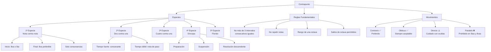

# Guía Completa de Contrapunto - Repaso y Práctica

## Introducción

El contrapunto es el arte de combinar líneas melódicas independientes que suenan simultáneamente, creando una textura musical rica y equilibrada. Esta guía proporciona un repaso completo de los fundamentos del contrapunto, basada en el sistema de especies tradicional.

## Parte 1: Conceptos Fundamentales

### ¿Qué es el Contrapunto?

El contrapunto (del latín "punctus contra punctum" - nota contra nota) es una técnica compositiva que se enfoca en la relación entre líneas melódicas independientes. A diferencia de la armonía tradicional que se centra en acordes verticales, el contrapunto prioriza el movimiento horizontal de las voces.

### Elementos Básicos

1. **Canto Dado (Cantus Firmus)**

   - Melodía preexistente que sirve como base
   - Generalmente en valores largos (redondas o blancas)
   - Debe ser melódicamente equilibrada y tonalmente clara

2. **Contrapunto**
   - La línea melódica que se compone contra el canto dado
   - Puede estar por encima (contra alto) o por debajo (bajo)
   - Debe mantener independencia melódica

## Parte 2: Reglas Fundamentales del Contrapunto

### Reglas Generales

1. **Intervalos Consecutivos**

   - ❌ **Prohibido**: Más de 3 intervalos del mismo tipo consecutivos
   - ✅ **Permitido**: Máximo 3 terceras, sextas, etc. seguidas

2. **Repetición de Notas**

   - ❌ **Prohibido**: Repetir la misma nota en cualquiera de las voces
   - ✅ **Excepción**: Solo en casos específicos para resolver problemas melódicos

3. **Rango Melódico**

   - ❌ **Prohibido**: Salirse del rango de una octava
   - ✅ **Permitido**: Saltos de octava cuando sean necesarios

4. **Saltos Melódicos**
   - ✅ **Permitido**: Saltos de octava
   - ⚠️ **Cuidado**: Después de un salto grande, preferir movimiento contrario

### Intervalos Permitidos y Prohibidos

```abc
X:1
T:Intervalos en Contrapunto
M:4/4
L:1/1
K:C
%%score (T1 T2)
V:T1 clef=treble
V:T2 clef=bass
[V:T1] C D E F G A B c |
[V:T2] C, B, A, F, E, F, G, C, |
w: 8va 3ra 6ta 3ra 3ra 3ra 3ra 8va
```

**Intervalos Consonantes (Permitidos)**:

- **Consonancias Perfectas**: Unísono, 4ª justa, 5ª justa, 8ª
- **Consonancias Imperfectas**: 3ª mayor/menor, 6ª mayor/menor

**Intervalos Disonantes (Restringidos)**:

- 2ª mayor/menor, 7ª mayor/menor, 4ª aumentada, 5ª disminuida

## Parte 3: Las Cinco Especies del Contrapunto

### Primera Especie: Nota contra Nota

La especie más básica donde cada nota del canto dado corresponde a una nota del contrapunto.

#### Reglas Específicas de Primera Especie

1. **Inicio y Final**

   - ✅ **Inicio**: Octava o quinta perfecta
   - ✅ **Final**: Octava perfecta (preferible)

2. **Intervalos Intermedios**

   - ✅ **Preferidos**: Terceras y sextas
   - ⚠️ **Limitados**: Quintas y octavas (no consecutivas)

3. **Movimiento Melódico**
   - ✅ **Regla de las dos notas**: Mínimo dos notas intermedias antes de regresar a una nota ya usada
   - ❌ **Prohibido**: Arpegios en la fundamental (movimiento de abajo hacia arriba por grados del acorde)

#### Ejemplo de Primera Especie

```abc
X:2
T:Primera Especie - Ejemplo
M:4/4
L:1/1
K:C
%%score (T1 T2)
V:T1 clef=treble name="Contrapunto"
V:T2 clef=bass name="Canto Dado"
[V:T1] G A F G E F D C |
[V:T2] C, F, D, E, C, D, B,, C, |
w: 5ta 3ra 3ra 3ra 3ra 3ra 3ra 8va
```

### Segunda Especie: Dos Notas contra Una

En esta especie, el contrapunto tiene dos notas por cada nota del canto dado.

#### Reglas Específicas de Segunda Especie

1. **Tiempo Fuerte vs. Débil**

   - Tiempo fuerte: Debe ser consonante
   - Tiempo débil: Puede ser disonante (nota de paso)

2. **Notas de Paso**
   - Conectan dos consonancias por grado conjunto
   - Solo en tiempo débil

#### Ejemplo de Segunda Especie

```abc
X:3
T:Segunda Especie - Ejemplo
M:4/4
L:1/2
K:C
%%score (T1 T2)
V:T1 clef=treble name="Contrapunto"
V:T2 clef=bass name="Canto Dado"
[V:T1] G A | F G | E F | D C |
[V:T2] C,2 | F,2 | C,2 | C,2 |
```

### Tercera Especie: Cuatro Notas contra Una

El contrapunto tiene cuatro notas por cada nota del canto dado.

#### Reglas Específicas de Tercera Especie

1. **Primer y Tercer Tiempo**: Deben ser consonantes
2. **Segundo y Cuarto Tiempo**: Pueden ser disonantes (notas de paso)
3. **Cambio de Dirección**: Recomendado cada 2-3 notas

### Cuarta Especie: Síncopa

Introduce el concepto de suspensión y resolución.

#### Reglas de Síncopa

1. **Preparación**: La disonancia debe estar preparada como consonancia
2. **Suspensión**: La nota se mantiene creando disonancia
3. **Resolución**: La disonancia resuelve descendentemente por grado conjunto

### Quinta Especie: Contrapunto Florido

Combina elementos de todas las especies anteriores, permitiendo mayor libertad rítmica.

## Parte 4: Análisis de Movimientos

### Tipos de Movimiento entre Voces

Los movimientos entre voces son fundamentales para crear un contrapunto efectivo:

1. **Movimiento Contrario** ✅

   - Una voz sube mientras la otra baja
   - Es el movimiento preferido en contrapunto
   - Crea independencia melódica

2. **Movimiento Oblicuo** ✅

   - Una voz se mantiene mientras la otra se mueve
   - Siempre aceptable
   - Útil para evitar problemas de conducción

3. **Movimiento Directo** ⚠️

   - Ambas voces se mueven en la misma dirección
   - Cuidado con quintas y octavas ocultas
   - Aceptable si se evitan intervalos perfectos

4. **Movimiento Paralelo** ❌
   - Ambas voces mantienen el mismo intervalo
   - Prohibido en quintas y octavas perfectas
   - Permitido en terceras y sextas (limitadamente)

### Errores Comunes a Evitar

#### Quintas y Octavas Paralelas

```abc
X:4
T:Quintas Paralelas - INCORRECTO
M:4/4
L:1/1
K:C
%%score (T1 T2)
V:T1 clef=treble name="❌ Incorrecto"
V:T2 clef=bass name="Canto Dado"
[V:T1] G A B c |
[V:T2] C, D, E, F, |
w: 5ta 5ta 5ta 5ta
```

```abc
X:5
T:Quintas Paralelas - CORREGIDO
M:4/4
L:1/1
K:C
%%score (T1 T2)
V:T1 clef=treble name="✅ Correcto"
V:T2 clef=bass name="Canto Dado"
[V:T1] G F G A |
[V:T2] C, D, E, F, |
w: 5ta 3ra 3ra 3ra
```

#### Quintas y Octavas Ocultas

Las quintas y octavas ocultas ocurren cuando dos voces se mueven en movimiento directo hacia una quinta u octava perfecta.

```abc
X:6
T:Octavas Ocultas - Ejemplo
M:4/4
L:1/1
K:C
%%score (T1 T2)
V:T1 clef=treble name="⚠️ Oculta"
V:T2 clef=bass name="Canto Dado"
[V:T1] F G |
[V:T2] B, C, |
w: 5ta 8va
```

## Parte 5: Metodología de Práctica

### Proceso Paso a Paso para Escribir Contrapunto

#### Paso 1: Análisis del Canto Dado

1. **Identifica la tonalidad**
2. **Marca los puntos cadenciales**
3. **Observa el contorno melódico**
4. **Identifica las notas importantes** (inicio, clímax, final)

#### Paso 2: Planificación del Contrapunto

1. **Decide la posición** (superior o inferior)
2. **Establece los puntos de inicio y final**
3. **Planifica el contorno general**
4. **Identifica momentos de tensión y relajación**

#### Paso 3: Composición por Frases

1. **Trabaja frase por frase**
2. **Verifica cada intervalo**
3. **Comprueba el movimiento melódico**
4. **Revisa la independencia de las voces**

#### Paso 4: Verificación Sistemática

Utiliza esta lista de verificación:

- [ ] **Intervalos**: Solo consonancias (excepto notas de paso)
- [ ] **Movimiento**: Preferir contrario y oblicuo
- [ ] **Quintas/Octavas**: No paralelas ni ocultas problemáticas
- [ ] **Rango**: Dentro de una octava
- [ ] **Repeticiones**: Evitar repetición de notas
- [ ] **Independencia**: Cada voz tiene carácter propio

## Parte 7: Recursos Adicionales

### Compositores de Referencia

1. **Giovanni Pierluigi da Palestrina** (1525-1594)

   - Maestro del contrapunto renacentista
   - Estilo equilibrado y fluido

2. **Johann Sebastian Bach** (1685-1750)

   - Contrapunto barroco
   - "El Arte de la Fuga" como referencia suprema

3. **Johann Joseph Fux** (1660-1741)
   - "Gradus ad Parnassum" - tratado fundamental
   - Sistematización de las especies

### Términos Clave

- **Cantus Firmus**: Melodía base preexistente
- **Consonancia**: Intervalo estable y en reposo
- **Disonancia**: Intervalo inestable que requiere resolución
- **Nota de Paso**: Disonancia que conecta dos consonancias por grado conjunto
- **Síncopa**: Desplazamiento rítmico que crea suspensión
- **Imitación**: Repetición de un motivo melódico en otra voz

### Progresión de Estudio Recomendada

1. **Semanas 1-2**: Primera especie (nota contra nota)
2. **Semanas 3-4**: Segunda especie (dos contra una)
3. **Semanas 5-6**: Tercera especie (cuatro contra una)
4. **Semanas 7-8**: Cuarta especie (síncopa)
5. **Semanas 9-10**: Quinta especie (florido)
6. **Semanas 11-12**: Contrapunto a tres voces

## Conclusión

El contrapunto es una disciplina que requiere práctica constante y atención al detalle. Los principios fundamentales son:

1. **Independencia melódica** de cada voz
2. **Control riguroso** de consonancias y disonancias
3. **Movimiento preferentemente contrario** entre voces
4. **Equilibrio** entre libertad expresiva y reglas estructurales



4 horas mínimo de espera
