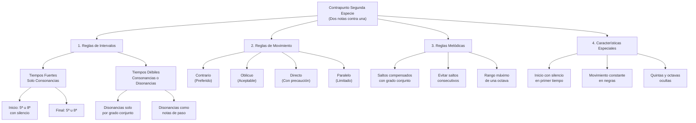

# Guía Específica: Contrapunto de Segunda Especie

Esta guía se enfoca exclusivamente en el contrapunto de segunda especie (dos notas contra una), complementando la guía general de contrapunto. Aquí encontrarás reglas detalladas, ejemplos prácticos y un método sistemático para crear y revisar contrapunto de segunda especie.



## 1. Fundamentos del Contrapunto de Segunda Especie

### 1.1 Definición

El contrapunto de segunda especie consiste en componer una línea melódica contra un canto dado (cantus firmus), donde por cada nota del canto dado hay dos notas en el contrapunto. Esta especie introduce el concepto de tiempo fuerte y tiempo débil, así como el uso controlado de disonancias.

### 1.2 Características Principales

- **Relación 2:1**: Dos notas en el contrapunto por cada nota en el canto dado
- **Inicio con silencio**: La primera nota del contrapunto se omite, comenzando con un silencio
- **Tiempos fuertes y débiles**: Distinción entre consonancias obligatorias (tiempos fuertes) y posibles disonancias (tiempos débiles)
- **Movimiento constante**: La línea contrapuntística mantiene un flujo constante de negras
- **Uso controlado de disonancias**: Introducción de disonancias como notas de paso en tiempos débiles

## 2. Reglas Específicas para Segunda Especie

### 2.1 Reglas de Intervalos Armónicos

| Posición            | Intervalos Permitidos                  | Intervalos Prohibidos               |
| ------------------- | -------------------------------------- | ----------------------------------- |
| **Tiempos Fuertes** | Unísono, 3ª, 5ª, 6ª, 8ª (consonancias) | 2ª, 4ª, 7ª, tritono (disonancias)   |
| **Tiempos Débiles** | Todos los intervalos                   | Disonancias solo como notas de paso |

#### Reglas detalladas

1. **Inicio**:

   - Comenzar con un silencio en el primer tiempo
   - Primera nota del contrapunto en tiempo débil (debe ser consonante)

2. **Final**:

   - Penúltimo compás: Puede tener dos posibilidades:
     - Opción 1: Sensible en tiempo fuerte y tónica en tiempo débil
     - Opción 2: 2º grado en tiempo fuerte y sensible en tiempo débil
   - Último compás: Unísono u octava (una sola nota que coincide con el canto dado)

3. **Consonancias y disonancias**:
   - ✅ **Tiempos fuertes**: Solo consonancias (3ª, 5ª, 6ª, 8ª)
   - ✅ **Tiempos débiles**: Consonancias o disonancias como notas de paso
   - ❌ **Prohibido**: Disonancias en tiempos fuertes
   - ❌ **Prohibido**: Disonancias en tiempos débiles que no sean por grado conjunto

Progresiones: 
- Resolución engañosa
- Tercera de picardia 
- Si mi - sol sotenido 

### 2.2 Reglas para el Uso de Disonancias

Las disonancias en segunda especie solo pueden aparecer como notas de paso en tiempos débiles y deben cumplir estas condiciones:

1. **Aproximación**: La disonancia debe venir por grado conjunto (desde una consonancia)
2. **Continuación**: La disonancia debe resolver por grado conjunto (hacia una consonancia)
3. **Posición**: Solo en tiempos débiles

**Ejemplo de nota de paso disonante correcta:**

```
Contrapunto: E  F  G  (F es disonante, pero conecta E y G por grado conjunto)
Canto dado:  C     C
Intervalos:  3ª 4ª 5ª  (4ª es disonancia en tiempo débil como nota de paso)
```

### 2.3 Reglas de Movimiento entre Voces

| Tipo de Movimiento | Descripción                                 | Uso en Segunda Especie                             |
| ------------------ | ------------------------------------------- | -------------------------------------------------- |
| **Contrario**      | Voces se mueven en direcciones opuestas     | Preferido, especialmente para resolver disonancias |
| **Oblicuo**        | Una voz se mantiene, la otra se mueve       | Aceptable en cualquier situación                   |
| **Directo**        | Ambas voces se mueven en la misma dirección | Con precaución, evitar hacia intervalos perfectos  |
| **Paralelo**       | Ambas voces mantienen el mismo intervalo    | Limitado, prohibido en quintas y octavas           |

#### Quintas y octavas ocultas o directas

En segunda especie, debemos prestar especial atención a las quintas y octavas ocultas entre tiempos fuertes consecutivos:

- ❌ **Prohibido**: Quintas u octavas paralelas entre tiempos fuertes consecutivos
- ❌ **Prohibido**: Quintas u octavas ocultas por movimiento directo (cuando ambas voces saltan)
- ✅ **Permitido**: Quintas u octavas ocultas si la voz superior se mueve por grado conjunto

### 2.4 Reglas Melódicas

1. **Saltos**:

   - ✅ **Preferidos**: Segundas y terceras (grado conjunto)
   - ✅ **Aceptables**: Cuartas, quintas y sextas (con moderación)
   - ⚠️ **Limitados**: Séptimas y octavas (máximo uno por frase)
   - ❌ **Prohibidos**: Saltos mayores que octava
   - ❌ **Prohibidos**: Dos saltos grandes consecutivos en la misma dirección
   - ✅ **Requerido**: Después de un salto grande, moverse por grado conjunto en dirección contraria

2. **Contorno melódico**:

   - ✅ **Requerido**: Equilibrio entre ascensos y descensos
   - ✅ **Requerido**: Cambio de dirección periódico
   - ❌ **Prohibido**: Patrones secuenciales obvios o repetitivos

3. **Intervalos melódicos prohibidos**:
   - ❌ **Prohibido**: Tritono melódico (cuarta aumentada/quinta disminuida)
   - ❌ **Prohibido**: Séptima mayor
   - ⚠️ **Evitar**: Saltos cromáticos

## 3. Método Paso a Paso para Segunda Especie

### 3.1 Análisis del Canto Dado

1. **Identifica la tonalidad** del canto dado
2. **Localiza los puntos cadenciales** importantes
3. **Analiza el contorno melódico** para crear un contrapunto complementario

### 3.2 Planificación del Contrapunto

1. **Decide la posición** del contrapunto (superior o inferior)
2. **Establece los puntos de anclaje**:
   - Inicio: Silencio seguido de consonancia en tiempo débil
   - Final: Planifica la cadencia final (sensible-tónica)
   - Puntos intermedios: Identifica momentos para disonancias de paso

### 3.3 Proceso de Composición

1. **Primer compás**: Comienza con silencio y una consonancia en tiempo débil
2. **Compases intermedios**:
   - Asegura consonancias en todos los tiempos fuertes
   - Introduce disonancias como notas de paso en tiempos débiles
   - Varía entre grados conjuntos y saltos compensados
3. **Cadencia final**:
   - Penúltimo compás: Sensible en tiempo débil
   - Último compás: Resolución a unísono u octava

## 4. Ejemplos Prácticos de Segunda Especie

### 4.1 Ejemplo en Do Mayor (Contrapunto Superior)

**Canto Dado (bajo):**

```
C - G - A - F - G - C
```

**Contrapunto (soprano):**

```
- G | E C | F E | D C | E D | C
```

**Análisis de intervalos:**

```
- 5ª | 6ª 3ª | 6ª 7ª | 6ª 4ª | 6ª 5ª | 8ª
```

**Tabla de análisis detallado:**

| Compás | Tiempo | Canto Dado | Contrapunto | Intervalo | Observación                     |
| ------ | ------ | ---------- | ----------- | --------- | ------------------------------- |
| 1      | 1      | C          | (silencio)  | -         | Inicio con silencio             |
| 1      | 2      | C          | G           | 5ª        | Consonancia perfecta            |
| 2      | 1      | G          | E           | 6ª        | Consonancia imperfecta          |
| 2      | 2      | G          | C           | 4ª        | Disonancia como nota de paso    |
| 3      | 1      | A          | F           | 6ª        | Consonancia imperfecta          |
| 3      | 2      | A          | E           | 5ª        | Consonancia perfecta            |
| 4      | 1      | F          | D           | 6ª        | Consonancia imperfecta          |
| 4      | 2      | F          | C           | 5ª        | Consonancia perfecta            |
| 5      | 1      | G          | E           | 6ª        | Consonancia imperfecta          |
| 5      | 2      | G          | D           | 5ª        | Consonancia perfecta            |
| 6      | 1      | C          | C           | 8ª        | Consonancia perfecta para final |

**Aspectos destacados:**

- Inicio con silencio y consonancia perfecta (5ª)
- Uso de disonancia (4ª) como nota de paso en tiempo débil (compás 2)
- Movimiento mayormente por grado conjunto
- Cadencia final con movimiento hacia la octava
- No hay quintas u octavas paralelas entre tiempos fuertes

### 4.2 Ejemplo en La menor (Contrapunto Inferior)

**Canto Dado (soprano):**

```
A - B - C - D - C - B - A
```

**Contrapunto (bajo):**

```
- E | F D | E G | A F | E G | E E | A
```

**Análisis de intervalos:**

```
- 4ª | 4ª 6ª | 6ª 4ª | 4ª 6ª | 6ª 3ª | 5ª 5ª | 8ª
```

**Aspectos destacados:**

- Inicio con silencio seguido de consonancia (4ª)
- Alternancia entre grados conjuntos y saltos compensados
- Disonancias como notas de paso en tiempos débiles
- Cadencia final con movimiento hacia la octava
- Contorno melódico complementario al canto dado

## 5. Errores Comunes y Soluciones en Segunda Especie

### 5.1 Disonancias Mal Empleadas

**Error:**

```
Contrapunto: C  A  G  (A es disonante y viene por salto desde C)
Canto dado:  F     F
Intervalos:  5ª 3ª 2ª  (3ª es disonancia en tiempo débil por salto)
```

**Solución:**

```
Contrapunto: C  B  G  (B es consonante)
Canto dado:  F     F
Intervalos:  5ª 4ª 2ª  (4ª es consonancia en este contexto)
```

### 5.2 Quintas u Octavas Paralelas entre Tiempos Fuertes

**Error:**

```
Contrapunto: G  A  E  F
Canto dado:  C     A
Intervalos:  5ª    5ª
```

**Solución:**

```
Contrapunto: G  A  C  B
Canto dado:  C     A
Intervalos:  5ª    3ª
```

### 5.3 Falta de Silencio Inicial

**Error:**

```
Contrapunto: E  F  G  A
Canto dado:  C     C
```

**Solución:**

```
Contrapunto: -  E  F  G
Canto dado:  C     C
```

## 6. Conexiones con Otros Conceptos Musicales

### 6.1 Relación con el Voicing y la Armonía

El contrapunto de segunda especie establece fundamentos importantes para:

- **Conducción de voces en acordes**: La distinción entre tiempos fuertes y débiles refleja la estructura de acordes y notas de paso en la armonía tradicional.
- **Tensión y resolución**: El uso controlado de disonancias en tiempos débiles establece el principio de tensión-resolución que es fundamental en la música tonal.
- **Voicing coral**: Las reglas de movimiento entre voces son aplicables directamente al voicing coral.

### 6.2 Conexión con Otras Especies de Contrapunto

| Especie     | Relación con Segunda Especie                                               |
| ----------- | -------------------------------------------------------------------------- |
| **Primera** | Base fundamental; segunda especie añade movimiento rítmico                 |
| **Tercera** | Extensión natural; aumenta la proporción de notas (4:1)                    |
| **Cuarta**  | Introduce síncopas y suspensiones donde la segunda introduce notas de paso |
| **Quinta**  | Incorpora elementos de segunda especie con mayor libertad rítmica          |

### 6.3 Aplicación en Composición Moderna

El contrapunto de segunda especie tiene aplicaciones prácticas en:

- **Líneas de bajo en música popular**: Creación de líneas de bajo con movimiento constante contra melodías más estáticas
- **Contramelodías**: Desarrollo de contramelodías que complementan la melodía principal
- **Arreglos instrumentales**: Distribución de voces en arreglos para conjuntos pequeños

## 7. Lista de Verificación para Segunda Especie

- [ ] **Inicio**: Silencio en primer tiempo, consonancia en tiempo débil
- [ ] **Tiempos fuertes**: Solo consonancias
- [ ] **Tiempos débiles**: Consonancias o disonancias como notas de paso
- [ ] **Disonancias**: Solo por grado conjunto en ambas direcciones
- [ ] **Quintas y octavas**: No paralelas ni directas entre tiempos fuertes
- [ ] **Movimiento melódico**: Predominantemente por grado conjunto
- [ ] **Saltos**: Compensados con movimiento contrario por grado conjunto
- [ ] **Final**: Cadencia apropiada con resolución a octava o unísono
- [ ] **Rango**: No excede una octava
- [ ] **Independencia**: Contrapunto tiene contorno melódico propio y complementario

## 8. Ejercicios Prácticos Recomendados

1. **Ejercicio básico**: Componer contrapunto de segunda especie sobre un canto dado de 4-6 notas
2. **Ejercicio de identificación**: Analizar ejemplos existentes e identificar consonancias, disonancias y notas de paso
3. **Ejercicio de corrección**: Identificar y corregir errores en ejemplos de contrapunto de segunda especie
4. **Ejercicio de transformación**: Convertir un contrapunto de primera especie a segunda especie
5. **Ejercicio de cadencia**: Practicar diferentes opciones de cadencia para contrapunto de segunda especie

---

Esta guía te proporcionará las herramientas necesarias para comprender, analizar y crear contrapunto de segunda especie, estableciendo una base sólida para especies más complejas y aplicaciones musicales más avanzadas.
