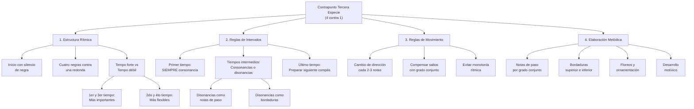
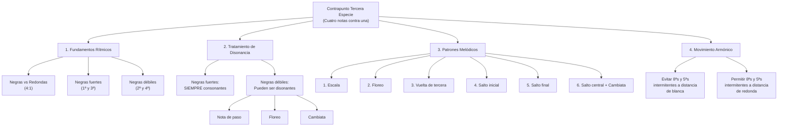

# Guía Específica: Contrapunto de Tercera Especie

Esta guía se enfoca exclusivamente en el contrapunto de tercera especie (cuatro notas contra una), complementando las guías anteriores de primera y segunda especie. Aquí encontrarás reglas detalladas, ejemplos prácticos y un método sistemático para crear y revisar contrapunto de tercera especie a partir de una progresión dada.



## 1. Fundamentos del Contrapunto de Tercera Especie

### 1.1 Definición

El contrapunto de tercera especie consiste en componer una línea melódica que contiene **cuatro notas (negras) contra cada nota del cantus firmus (redonda)**. Esta especie permite mayor elaboración melódica y flexibilidad rítmica que las especies anteriores, creando un flujo constante de movimiento musical.

### 1.2 Características Principales

- **Relación 4:1**: Cuatro notas en el contrapunto por cada nota en el canto dado
- **Inicio con silencio**: Comienza con un silencio de negra
- **Elaboración melódica**: Permite el uso de notas de paso, bordaduras y ornamentación
- **Flexibilidad en disonancias**: Permite disonancias en tiempos débiles como elaboración melódica
- **Movimiento constante**: Crea un flujo rítmico continuo

### 1.3 Estructura Temporal

En compás de 4/4 con redondas en el cantus firmus:

| Tiempo | Importancia | Tipo de nota permitida     | Observaciones                   |
| ------ | ----------- | -------------------------- | ------------------------------- |
| 1      | Fuerte      | Solo consonancias          | Base armónica del compás        |
| 2      | Débil       | Consonancias o disonancias | Como nota de paso o bordadura   |
| 3      | Semi-fuerte | Preferible consonancia     | Punto medio del compás          |
| 4      | Débil       | Consonancias o disonancias | Preparación al siguiente compás |

## 2. Reglas Específicas para Tercera Especie

### 2.1 Reglas de Inicio y Final

| Elemento             | Regla                                    | Ejemplo            |
| -------------------- | ---------------------------------------- | ------------------ |
| **Inicio**           | Silencio de negra + consonancia perfecta | Silencio + 5ª u 8ª |
| **Final**            | Conducción cadencial a octava            | 7ª → 8ª preferible |
| **Penúltimo compás** | Nota sensible en tiempo fuerte           | 7° grado → 1°      |
|                      |                                          |                    |

### 2.2 Reglas de Intervalos Armónicos por Tiempo

#### Primer Tiempo (Tempo Forte)

- ✅ **OBLIGATORIO**: Solo consonancias perfectas o imperfectas
- ✅ **Permitido**: 3ª, 5ª, 6ª, 8ª
- ❌ **Prohibido**: Cualquier disonancia (2ª, 4ª, 7ª, tritono)

#### Segundo y Cuarto Tiempo (Tiempos Débiles)

- ✅ **Permitido**: Consonancias perfectas e imperfectas
- ✅ **Permitido**: Disonancias como notas de paso o bordaduras
- ⚠️ **Condición**: Las disonancias deben estar entre movimientos por grado conjunto

#### Tercer Tiempo (Tempo Semi-forte)

- ✅ **Preferido**: Consonancias
- ⚠️ **Aceptable**: Disonancias ocasionales como notas de paso
- ❌ **Evitar**: Disonancias estáticas o no justificadas

### 2.3 Reglas de Movimiento Melódico

| Tipo de Movimiento              | Aplicación en Tercera Especie        | Frecuencia Recomendada |
| ------------------------------- | ------------------------------------ | ---------------------- |
| **Grado conjunto**              | Preferido para conectar consonancias | 60-70%                 |
| **Saltos pequeños** (3ª)        | Aceptables para variar el contorno   | 20-25%                 |
| **Saltos medianos** (4ª, 5ª)    | Con moderación, compensar después    | 10-15%                 |
| **Saltos grandes** (6ª, 7ª, 8ª) | Máximo uno por frase, compensar      | <5%                    |

#### Reglas específicas sobre saltos

1. **Después de saltos de 3ª o mayores**: Cambiar dirección o continuar por grado conjunto
2. **Saltos consecutivos**: Evitar dos saltos en la misma dirección
3. **Compensación obligatoria**: Después de saltos de 5ª o mayores, moverse por grado conjunto en dirección contraria
4. **Cambio de dirección**: Requerido cada 2-3 notas para evitar monotonía

### 2.4 Tratamiento de Disonancias en Tercera Especie

#### Notas de Paso

- **Ubicación**: Solo en tiempos débiles (2º y 4º tiempo)
- **Aproximación**: Por grado conjunto
- **Resolución**: Por grado conjunto en la misma dirección
- **Ejemplo**: C-D-E (donde D es disonante como nota de paso)

#### Bordaduras (Floreos)

- **Bordadura superior**: Nota consonante → paso arriba (disonante) → vuelta a nota consonante
- **Bordadura inferior**: Nota consonante → paso abajo (disonante) → vuelta a nota consonante
- **Ubicación**: Segundo y/o cuarto tiempo

#### Escapadas (Cambiatas)

- **Patrón**: Grado conjunto → salto en dirección contraria
- **Uso**: Con moderación, para crear variedad melódica
- **Ubicación**: Preferiblemente en tiempos débiles

## 3. Método Paso a Paso para Tercera Especie

### 3.1 Análisis Preparatorio

1. **Identifica la tonalidad** y el modo de la progresión
2. **Extrae el cantus firmus** (normalmente el bajo)
3. **Planifica el contorno general** del contrapunto
4. **Identifica momentos clave**: cadencias, clímax, cambios de dirección

### 3.2 Estrategia de Composición

#### Paso 1: Establece la Estructura Básica

1. **Marca el inicio**: Silencio + consonancia perfecta
2. **Planifica el final**: Cadencia con sensible → tónica
3. **Establece puntos de anclaje**: Primer tiempo de cada compás con consonancias

#### Paso 2: Crea el Contorno Melódico

1. **Define el arco general**: Ascendente, descendente, o en forma de arco
2. **Identifica el clímax**: Punto más alto o más bajo de la línea
3. **Planifica cambios de dirección**: Cada 2-3 notas aproximadamente

#### Paso 3: Completa los Tiempos Débiles

1. **Añade notas de paso** para conectar consonancias por grado conjunto
2. **Introduce bordaduras** para crear variedad e interés melódico
3. **Asegura el flujo rítmico** constante de cuatro negras por compás

### 3.3 Lista de Verificación Exhaustiva

| Categoría                | Elemento a Verificar                             | ¿Cumple? |
| ------------------------ | ------------------------------------------------ | -------- |
| **Estructura Rítmica**   | Inicia con silencio de negra                     | □        |
|                          | Mantiene patrón 4:1 consistentemente             | □        |
|                          | Termina correctamente en tiempo fuerte           | □        |
| **Intervalos Armónicos** | Primer tiempo siempre consonante                 | □        |
|                          | Disonancias solo en tiempos débiles              | □        |
|                          | Disonancias correctamente preparadas y resueltas | □        |
|                          | Final con octava o unísono                       | □        |
| **Movimiento Melódico**  | Predominio de grado conjunto                     | □        |
|                          | Saltos compensados apropiadamente                | □        |
|                          | Cambios de dirección cada 2-3 notas              | □        |
|                          | No hay dos saltos grandes consecutivos           | □        |
|                          | Rango no excede octava y media                   | □        |
| **Contrapunto**          | No hay quintas u octavas paralelas               | □        |
|                          | Equilibrio entre movimiento contrario y directo  | □        |
|                          | Independencia melódica clara                     | □        |
|                          | Un clímax melódico por frase                     | □        |

## 4. Ejemplos Detallados de Tercera Especie

### 4.1 Ejemplo Básico en Do Mayor

**Cantus Firmus (bajo):**

```
C    |    G    |    A    |    F    |    G    |    C
(redonda) (redonda) (redonda) (redonda) (redonda) (redonda)
```

**Contrapunto de Tercera Especie (soprano):**

```
Silencio | G  A  B  C | C  B  A  G | A  G  F  G | F  E  D  E | D  C
         | 1  2  3  4 | 1  2  3  4 | 1  2  3  4 | 1  2  3  4 | 1  2
```

**Análisis de intervalos por tiempo fuerte:**

```
         | 5ª        | 3ª        | 3ª        | 6ª        | 8ª
```

**Análisis detallado compás por compás:**

**Compás 1** (sobre C):

- Tiempo 1: G (5ª justa) - consonancia perfecta ✓
- Tiempo 2: A (6ª mayor) - consonancia imperfecta ✓
- Tiempo 3: B (7ª mayor) - disonancia como nota de paso ✓
- Tiempo 4: C (8ª) - consonancia perfecta ✓

**Compás 2** (sobre G):

- Tiempo 1: C (4ª justa) - **Problema**: 4ª es disonante en tiempo fuerte ❌

**Corrección del Compás 2:**

```
C  B  A  G
1  2  3  4
3ª 3ª 2ª 8ª (donde la 2ª es nota de paso en tiempo débil)
```

### 4.2 Ejemplo Corregido Completo

**Cantus Firmus (bajo):**

```
C    |    G    |    A    |    F    |    G    |    C
```

**Contrapunto Corregido (soprano):**

```
Silencio | G  A  B  C | E  D  C  B | C  B  A  B | D  C  B  C | C
         | 1  2  3  4 | 1  2  3  4 | 1  2  3  4 | 1  2  3  4 | 1
```

**Análisis de intervalos en tiempos fuertes:**

```
         | 5ª        | 6ª        | 3ª        | 5ª        | 8ª
```

**Análisis de movimiento melódico:**

- Compás 1: Ascenso por grado conjunto con bordadura superior (B como nota de paso)
- Compás 2: Descenso por grado conjunto con movimiento contrario al bajo
- Compás 3: Bordadura inferior (B-A-B) creando interés melódico
- Compás 4: Preparación cadencial con movimiento hacia la resolución
- Compás 5: Resolución final en octava

### 4.3 Ejemplo con Diferentes Tipos de Elaboración

**Cantus Firmus:**

```
D    |    A    |    F    |    G    |    A    |    D
```

**Contrapunto con Elaboraciones Variadas:**

```
Silencio | A  B  C  D | C  B  A  G | A  G  F  E | F  G  A  B | A  D
         | 1  2  3  4 | 1  2  3  4 | 1  2  3  4 | 1  2  3  4 | 1  2
```

**Tipos de elaboración identificados:**

- **Compás 1**: Ascenso escalar (grado conjunto)
- **Compás 2**: Descenso escalar con cambio de dirección
- **Compás 3**: Nota de paso (F en tiempo 3) seguida de bordadura inferior (E en tiempo 4)
- **Compás 4**: Ascenso por grado conjunto con bordadura superior
- **Compás 5**: Cadencia final con salto de 4ª compensado

## 5. Técnicas Avanzadas en Tercera Especie

### 5.1 Uso de Secuencias Melódicas

Las secuencias pueden crear coherencia e interés en el contrapunto de tercera especie:

**Ejemplo de secuencia descendente:**

```
Cantus:     G    |    F    |    E    |    D
Contrapunto: E F G A | D E F G | C D E F | B C D E
```

**Reglas para secuencias:**

- Mantener la lógica armónica en los tiempos fuertes
- No extender más de 2-3 repeticiones
- Variar el patrón para evitar monotonía

### 5.2 Integración de Elementos de Especies Anteriores

**Combinación con Primera Especie:**
Ocasionalmente puedes usar valores largos para crear contraste:

```
Contrapunto: G  A  B  C | E  (blanca)  D | C  D  E  F | D
             1  2  3  4 | 1     2     3 | 1  2  3  4 | 1
```

**Combinación con Segunda Especie:**
Usar patrones de dos negras ocasionalmente:

```
Contrapunto: G  A  (blanca) | C  B  A  G | E  F  G  A | G
             1  2      3   4 | 1  2  3  4 | 1  2  3  4 | 1
```

### 5.3 Tratamiento de Modos y Cromatismo

En contextos modales o cromáticos:

1. **Respeta las características interválicas** del modo
2. **Usa alteraciones** coherentes con el estilo
3. **Mantén la integridad modal** en los puntos estructurales

## 6. Errores Comunes y Soluciones

### 6.1 Disonancias en Tiempo Fuerte

**Error:**

```
Cantus:      C
Contrapunto: F  G  A  B  (F en tiempo 1 = 4ª justa, disonante)
             1  2  3  4
```

**Solución:**

```
Cantus:      C
Contrapunto: E  F  G  A  (E en tiempo 1 = 3ª mayor, consonante)
             1  2  3  4
```

### 6.2 Falta de Dirección Melódica

**Error (monotonía ascendente):**

```
Contrapunto: C  D  E  F | G  A  B  C | D  E  F  G
             1  2  3  4 | 1  2  3  4 | 1  2  3  4
```

**Solución (con cambios de dirección):**

```
Contrapunto: C  D  E  D | E  F  E  D | E  F  G  F
             1  2  3  4 | 1  2  3  4 | 1  2  3  4
```

### 6.3 Saltos Excesivos sin Compensación

**Error:**

```
Contrapunto: C  G  D  A  (múltiples saltos grandes)
             1  2  3  4
```

**Solución:**

```
Contrapunto: C  G  F  E  (salto compensado con descenso gradual)
             1  2  3  4
```

## 7. Aplicación Creativa

### 7.1 Adaptación a Estilos Modernos

Para aplicar tercera especie en contextos modernos:

1. **Jazz**: Usar como línea de walking bass con elaboraciones rítmicas
2. **Popular**: Crear contramelodías elaboradas
3. **Clásico-romántico**: Base para desarrollos temáticos

### 7.2 Composición de Variaciones

Usar tercera especie para crear variaciones sobre temas dados:

**Tema original:**

```
C  -  G  -  A  -  F  -  G  -  C
```

**Variación en tercera especie:**

```
Silencio | G A B C | E D C B | C B A B | D C B C | C
```

## 8. Ejercicios Prácticos

### 8.1 Ejercicio Básico

**Cantus Firmus dado:**

```
F  -  C  -  D  -  Bb  -  C  -  F
```

**Tarea:**

1. Compón un contrapunto de tercera especie superior
2. Incluye al menos una nota de paso y una bordadura
3. Analiza todos los intervalos y tipos de elaboración

### 8.2 Ejercicio Intermedio

**Cantus Firmus modal (dórico):**

```
D  -  G  -  F  -  A  -  G  -  D
```

**Tarea:**

1. Compón un contrapunto de tercera especie inferior
2. Respeta las características del modo dórico
3. Crea un contorno melódico en forma de arco

### 8.3 Ejercicio Avanzado

**Progresión armónica moderna:**

```
Am7 - Dm7 - G7 - Cmaj7
```

**Tarea:**

1. Extrae un cantus firmus de la progresión
2. Compón un contrapunto de tercera especie
3. Adapta las reglas según el contexto armónico moderno

## Conclusión

El contrapunto de tercera especie representa un paso significativo hacia la elaboración melódica completa. Al dominar el flujo constante de cuatro notas contra una, desarrollas la habilidad de crear líneas melódicas elaboradas pero estructuralmente sólidas. La clave está en equilibrar el movimiento constante con la coherencia armónica, siempre respetando la jerarquía entre tiempos fuertes y débiles.

Este fundamento te preparará para abordar la cuarta especie (síncopa) y eventualmente la quinta especie (contrapunto florido), donde podrás combinar elementos de todas las especies anteriores para crear texturas contrapuntísticas complejas y expresivas.

---

**Nota:** Esta guía complementa las guías anteriores de primera y segunda especie. Se recomienda dominar completamente las especies anteriores antes de proceder con ejercicios avanzados de tercera especie.

---

# Guía Específica Remasterizada: Contrapunto de Tercera Especie

_Basada en el método del Conservatorio Profesional de Getafe y la práctica polifónica del siglo XVI_

Esta guía remasterizada integra los principios académicos del contrapunto severo en tercera especie, enfocándose en los patrones melódicos históricos y las técnicas de composición del Renacimiento. La tercera especie representa quizá las mayores dificultades iniciales debido a que su flujo constante de negras contradice el uso establecido en la polifonía del siglo XVI, donde estos flujos eran ocasionales.



## 1. Principios Fundamentales de la Tercera Especie

### 1.1 Definición Histórica

El contrapunto de tercera especie consiste en componer una línea melódica que se mueve a **cuádruple velocidad** respecto al cantus firmus. En términos rítmicos: **negras contra redondas**. Esta especie, aunque técnicamente sencilla, presenta dificultades estilísticas particulares debido a la naturaleza excepcional de los flujos continuos de negras en la música del siglo XVI.

### 1.2 Características del Siglo XVI

En la polifonía renacentista, los flujos de negras (semínimas) eran:

- **Ocasionales**, no constantes
- **Decorativos**, para momentos de particular expresividad
- **Contextuales**, dependientes del texto y la estructura musical

El contrapunto severo en tercera especie, por tanto, representa una **abstracción pedagógica** que enfatiza el control del movimiento melódico continuo.

### 1.3 Jerarquía Temporal

| Posición en el Tactus | Denominación | Importancia | Tratamiento Armónico       |
| --------------------- | ------------ | ----------- | -------------------------- |
| **1ª negra**          | Tempo forte  | Máxima      | Solo consonancias          |
| **2ª negra**          | Tempo débil  | Mínima      | Consonancias o disonancias |
| **3ª negra**          | Tempo forte  | Alta        | Solo consonancias          |
| **4ª negra**          | Tempo débil  | Mínima      | Consonancias o disonancias |

## 2. Tratamiento de la Disonancia en Tercera Especie

### 2.1 Reglas Básicas de Disonancia

**Negras Fuertes (1ª y 3ª):**

- ✅ **OBLIGATORIO**: Siempre consonantes
- ✅ **Permitido**: 3ª, 5ª, 6ª, 8ª (incluir 4ª es disonancia)
- ❌ **Prohibido**: Cualquier disonancia

**Negras Débiles (2ª y 4ª):**

- ✅ **Permitido**: Consonancias
- ✅ **Permitido**: Disonancias correctamente tratadas
- ⚠️ **Condición**: Disonancias solo como elaboración melódica

### 2.2 Tipos de Disonancias Permitidas

#### A) Nota de Paso

- **Definición**: Disonancia formada al enlazar por grados conjuntos un marco consonante de tercera
- **Patrón**: Consonancia → grado conjunto (disonancia) → grado conjunto (consonancia)
- **Ejemplo**: C-D-E (donde D es disonante como nota de paso)

#### B) Floreo (Bordadura)

- **Definición**: Disonancia formada al realizar un movimiento de ida y vuelta a una nota vecina
- **Patrón**: Nota → vecina disonante → vuelta a la nota original
- **Tipos**: Floreo superior e inferior

#### C) Cambiata

- **Definición**: Caso especial de escapada que enlaza un marco consonante de cuarta descendente
- **Patrón**: Nota superior → segunda inferior → tercera inferior (marco de 4ª desc.)
- **Particularidad**: Técnica específica del siglo XVI de gran importancia estilística

## 3. Los Seis Patrones Melódicos Fundamentales

Según la práctica del siglo XVI, el repertorio de fórmulas melódicas en tercera especie se reduce a **seis tipos fundamentales**:

### 3.1 Patrón 1: Escala

**Descripción**: Movimiento por grados conjuntos ascendente o descendente

```
Ascendente:  C  D  E  F
Descendente: F  E  D  C
```

**Características:**

- Más simple y frecuente
- Permite integración natural de notas de paso
- Base para la mayoría de pasajes en tercera especie

### 3.2 Patrón 2: Floreo

**Descripción**: Movimiento de ornamentación alrededor de una nota central

```
Floreo superior:     C  D  C  B
Floreo inferior:     C  B  C  D
Floreo descendente:  D  C  D  E  (preferido en el s. XVI)
```

**Observaciones históricas:**

- El floreo descendente era predominante en la práctica renacentista
- Usado principalmente para momentos de particular elegancia melódica

### 3.3 Patrón 3: Vuelta de Tercera

**Descripción**: Recorrer una tercera de arriba a abajo por grados conjuntos y salto

```
Versión 1:  E  D  C  E  ✅ (Usable)
Versión 2:  E  C  D  E  ❌ (Salto ascendente en parte débil)
Versión 3:  C  D  E  C  ❌ (Salto ascendente en parte débil)
Versión 4:  C  E  D  C  ⚠️  (Problemática con cantus firmus de redondas)
```

**Limitaciones importantes:**

- Solo la primera versión es completamente usable en contrapunto severo
- Demuestra las restricciones específicas de la tercera especie
- La cuarta versión puede causar disonancias en tiempos fuertes

### 3.4 Patrón 4: Salto Inicial (2ª negra)

**Descripción**: Salto descendente en la segunda negra con diferentes continuaciones

```
Salto + relleno:      C  G  A  B
Salto + compensación: C  G  F  E
Salto + repetición:   C  G  G  A
```

**Reglas:**

- Solo saltos descendentes en posiciones débiles
- Compensar con movimiento contrario posterior
- Evitar saltos de más de quinta

### 3.5 Patrón 5: Salto Final (4ª negra)

**Descripción**: Salto descendente en la cuarta negra como cierre de línea

```
Cierre con tercera:   C  B  A  F  (seguir ascendente)
Cierre con cuarta:    C  B  A  E  (límite estilístico)
```

**Observaciones:**

- Saltos de cuarta están en el límite de lo permisible
- Requieren compensación ascendente posterior
- Los saltos de tercera son preferibles estilísticamente

### 3.6 Patrón 6: Salto Central + Cambiata

**Descripción**: Saltos en la tercera negra (mitad del compás) con énfasis en la técnica cambiata

```
Salto central simple:    C  D  G  F
Cambiata descendente:    F  E  C  D  (patrón característico)
Cambiata ascendente:     C  D  F  E  (menos común)
```

**Importancia estilística:**

- La cambiata es fundamental en el estilo del siglo XVI
- Crea elegantes conexiones melódicas
- Debe incluirse ocasionalmente para autenticidad histórica

## 4. Reglas Específicas de Movimiento Melódico

### 4.1 Restricciones en Saltos

**Saltos Ascendentes:**

- ✅ **Permitidos**: Solo en negras fuertes (1ª y 3ª)
- ❌ **Prohibidos**: En negras débiles (2ª y 4ª)
- **Objetivo**: Evitar efectos sincopados indeseados

**Saltos Descendentes:**

- ✅ **Permitidos**: En cualquier posición
- ⚠️ **Condición**: Siempre compensar con movimiento contrario
- **Límite**: Preferiblemente no más de quinta

### 4.2 Compensación Obligatoria

**Después de saltos de 3ª o mayores:**

- Cambiar dirección inmediatamente
- Continuar por grados conjuntos preferiblemente
- No realizar saltos compuestos (varios saltos consecutivos)

**Fórmulas de integración:**

- **Ascendente**: 3-2-2... o excepcionalmente 4-2-2...
- **Descendente**: ...2-2-3 o excepcionalmente ...2-2-4
- El salto debe estar siempre en la base del movimiento

### 4.3 Repertorio Melódico Limitado

Debido a las restricciones severas, el repertorio efectivo se reduce a:

1. **60%**: Movimientos escalares (patrón 1)
2. **20%**: Floreos y bordaduras (patrón 2)
3. **10%**: Vueltas de tercera (patrón 3, versión usable)
4. **5%**: Saltos iniciales compensados (patrón 4)
5. **3%**: Saltos finales (patrón 5)
6. **2%**: Cambiatas y saltos centrales (patrón 6)

## 5. Movimiento Armónico y Quintas/Octavas

### 5.1 Regla Específica de Tercera Especie

**Octavas y quintas intermitentes:**

- ❌ **Prohibidas**: A distancia de blanca (entre negras fuertes contiguas)
- ✅ **Permitidas**: A distancia de redonda (entre negras fuertes de diferentes compases)

### 5.2 Ejemplos de Aplicación

**Problemático (distancia de blanca):**

```
Compás 1:    C     vs    C
            1ª     3ª
            8ª     8ª  ❌ (octavas intermitentes a distancia de blanca)
```

**Correcto (distancia de redonda):**

```
Compás 1:     C              Compás 2:     G
             1ª                           1ª
             8ª                           5ª  ✅
```

## 6. Metodología de Trabajo: Secuencia de 3-4 Sesiones

### 6.1 Sesión 1: Ejercicios Preparatorios

**Objetivo**: Verificar asimilación de normas y entrenar la búsqueda de soluciones

**Material**: Fragmentos de cantus firmus de **tres notas**

**Tarea**: Encontrar **dos soluciones distintas** para cada fragmento

**Ejemplo:**

```
Cantus firmus: F - G - C

Solución A: Silencio | A B C D | E D C B | E D C
Solución B: Silencio | D E F G | C B A G | G E C
```

**Criterios:**

- Usar consonancias imperfectas también en notas inicial y final (no es cantus firmus completo)
- Escribir debajo de cada nota el intervalo formado
- Maximizar movimientos por grado conjunto
- Cumplir todas las reglas de saltos

### 6.2 Sesión 2: Cantus Firmus Convencional

**Objetivo**: Aplicar reglas en contexto formal completo

**Material**: Dos cantus firmus completos

**Criterios de evaluación**:

1. **ARMONÍA**: Corrección en el tratamiento de consonancias y disonancias
2. **VARIEDAD**: Uso equilibrado de los diferentes patrones melódicos
3. **CLÍMAX**: Un punto melódico más alto o más bajo por frase
4. **SORPRESA**: Elementos inesperados que enriquezcan el discurso

**Estructura formal:**

- **Inicio**: Consonancia perfecta obligatoria
- **Desarrollo**: Aplicación variada de los 6 patrones
- **Conclusión**: Fórmula cadencial característica (ver cuarta especie)
- **Nota final**: Redonda en consonancia perfecta

### 6.3 Sesión 3: Ejercicio de Disminución

**Objetivo**: Conocer técnica improvisatoria renacentista

**Concepto**: Adaptar un contrapunto de primera especie a tercera especie

**Método**:

1. Partir de un contrapunto simple (primera especie) ya compuesto
2. El nuevo contrapunto debe pasar por las mismas notas del original
3. Si no en la primera negra, sí en alguna posterior de cada compás
4. El resultado es una ornamentación del contrapunto original

**Ejemplo:**

```
Original (1ª especie):  G    -    C    -    E    -    G
Disminución (3ª esp.):  Silencio | G A B C | C B A G | E F G A | F E D G
```

### 6.4 Sesión 4: Ejercicio Libre

**Objetivo**: Integración creativa de las tres primeras especies

**Libertades permitidas**:

- Combinar libremente primera, segunda y tercera especies
- Usar cadencias intermedias en distintos grados
- Introducir imitaciones sencillas
- Extender a piezas de mayor longitud

**Requisito práctico**: Las piezas deben poder ser cantadas o tocadas en grupo, preferiblemente con instrumentos monódicos

## 7. Análisis de Repertorio: Canciones Sacras de Orlando di Lasso

### 7.1 Material de Estudio Recomendado

**Fuente**: _Canciones sacras a dos voces_ (1577) de Orlando di Lasso

**Enfoque analítico**:

- Diseño melódico-rítmico de las voces
- Tratamiento específico de la disonancia
- Aplicación práctica de los 6 patrones melódicos
- Contexto estilístico real del siglo XVI

### 7.2 Elementos a Identificar

1. **Flujos de negras**: Cuándo y por qué se usan
2. **Patrones melódicos**: Cuáles de los 6 tipos aparecen
3. **Tratamiento de disonancias**: Notas de paso, floreos, cambiatas
4. **Integración textual**: Cómo la música sirve al texto
5. **Efectos expresivos**: Momentos de particular intensidad melódica

## 8. Ejercicios Progresivos

### 8.1 Ejercicio Básico: Cantus Firmus en Do Mayor

**Cantus Firmus dado:**

```
C  -  G  -  A  -  F  -  G  -  C
```

**Requisitos específicos:**

1. Usar al menos 4 de los 6 patrones melódicos
2. Incluir una cambiata
3. Crear un arco melódico coherente
4. Aplicar fórmula cadencial apropiada

### 8.2 Ejercicio Intermedio: Modo Dórico

**Cantus Firmus modal:**

```
D  -  G  -  F  -  A  -  G  -  D
```

**Desafíos adicionales:**

1. Respetar las características interválicas del modo dórico
2. Usar el Si♭ apropiadamente según el contexto
3. Crear contraste entre secciones ascendentes y descendentes
4. Integrar floreos característicos del modo

### 8.3 Ejercicio Avanzado: Disminución Libre

**Base (Primera especie):**

```
E  -  C  -  D  -  G  -  C
```

**Tarea de disminución:**

1. Crear versión en tercera especie que mantenga la estructura armónica
2. Usar ornamentación histórica apropiada
3. Integrar elementos de segunda especie ocasionalmente
4. Justificar cada decisión compositiva según el estilo del siglo XVI

## 9. Errores Comunes y Correcciones Históricas

### 9.1 Anachronismos Estilísticos

**Error**: Usar patrones melódicos de épocas posteriores

```
❌ Incorrecto: C D# E F G A B C (cromatismo moderno)
✅ Correcto:   C D  E F E D E F (patrón renacentista)
```

**Error**: Exceso de saltos "expresivos"

```
❌ Incorrecto: C G E C F D (demasiados saltos)
✅ Correcto:   C D E F E D C D (predominio escalar)
```

### 9.2 Problemas de Flujo Rítmico

**Error**: Crear acentos inadecuados

```
❌ Incorrecto: C E D F (saltos en tiempos débiles)
✅ Correcto:   C E F G (salto en tiempo fuerte)
```

### 9.3 Tratamiento Inadecuado de Disonancias

**Error**: Disonancias sin preparación

```
❌ Incorrecto: C F# G A (tritono sin tratamiento)
✅ Correcto:   C D  E F (nota de paso correcta)
```

## 10. Aplicación a Composición Moderna

### 10.1 Adaptación Jazz/Popular

**Principios aplicables:**

- Control del flujo melódico continuo
- Jerarquía entre tiempos fuertes y débiles
- Ornamentación sistemática de líneas básicas
- Integración de notas de paso y bordaduras

### 10.2 Líneas de Bajo Elaboradas

Usar tercera especie para crear walking bass lines:

```
Acorde: Cmaj7
Bajo básico: C
Elaboración 3ª especie: C D E F (manteniendo función armónica)
```

### 10.3 Contramelodías en Música Camerística

Aplicar patrones melódicos para crear contramelodías independientes pero complementarias en música de cámara moderna.

## Conclusión: La Tercera Especie como Puente Estilístico

El dominio de la tercera especie representa un momento crucial en el desarrollo contrapuntístico. A diferencia de las especies anteriores, aquí la técnica se encuentra directamente con las limitaciones y posibilidades expresivas del estilo histórico. Los seis patrones melódicos no son abstracciones teóricas, sino herramientas compositivas reales extraídas de la práctica musical del Renacimiento.

La aparente simplicidad del "cuatro contra uno" esconde una complejidad estilística que prepara para entender que el contrapunto no es solo técnica, sino **lenguaje musical específico de una época**. Esta comprensión será fundamental para abordar la cuarta especie (síncopa) y la quinta especie (floridus), donde la libertad compositiva debe equilibrarse con la coherencia estilística.

El repertorio limitado de fórmulas melódicas en tercera especie, lejos de ser una restricción, demuestra cómo la creatividad musical surge no de la libertad absoluta, sino del **dominio completo de un vocabulario específico**. Esta lección trasciende el contrapunto histórico y se aplica a cualquier idioma musical que se desee dominar con autenticidad y profundidad.

---

**Conexión con otros temas:** Esta guía se relaciona directamente con los contenidos de primera y segunda especie ya estudiados, y prepara para la comprensión de las reglas de voicing coral y las técnicas de ornamentación melódica que aparecen en nuestros estudios de composición moderna.
