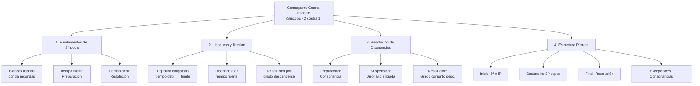

# Guía Específica: Contrapunto de Cuarta Especie (Síncopa)

_Basada en el método del Conservatorio Profesional de Getafe y la práctica polifónica del siglo XVI_

La cuarta especie, conocida como **contrapunto sincopado**, representa uno de los aspectos más expresivos y técnicamente desafiantes del contrapunto severo. Se caracteriza por el uso sistemático de **ligaduras** que crean tensiones y resoluciones, generando un efecto de suspensión armónica que ha sido fundamental en el desarrollo de la música occidental.



## 1. Principios Fundamentales de la Cuarta Especie

### 1.1 Definición y Características

El contrapunto de cuarta especie consiste en componer una línea melódica que utiliza **blancas ligadas** contra las redondas del cantus firmus, creando un patrón rítmico de **dos contra uno** con énfasis en la **síncopa**.

**Características principales:**

- **Relación 2:1**: Dos blancas contra cada redonda del cantus firmus
- **Ligaduras sistemáticas**: La segunda blanca se liga con la primera del siguiente compás
- **Disonancias expresivas**: Permitidas y deseadas en tiempo fuerte cuando están ligadas
- **Resolución obligatoria**: Toda disonancia debe resolver por grado conjunto descendente

### 1.2 Estructura Rítmica Fundamental

```abc
X:1
T:Estructura Básica de Cuarta Especie
M:4/4
L:1/2
K:C
V:1 clef=treble name="Contrapunto"
G2 A-A B-B C-C B2 |
w:1ª 2ª-ligada 1ª-ligada 2ª-ligada 1ª-ligada 2ª
V:2 clef=bass name="Cantus Firmus"
C1 F1 G1 C1 |
```

### 1.3 Jerarquía Temporal en Cuarta Especie

| Posición      | Denominación  | Importancia | Tratamiento Armónico            | Función                |
| ------------- | ------------- | ----------- | ------------------------------- | ---------------------- |
| **1ª blanca** | Tiempo fuerte | Máxima      | Consonancia o disonancia ligada | Preparación/Suspensión |
| **2ª blanca** | Tiempo débil  | Media       | Consonancia (preparación)       | Resolución/Preparación |

## 2. Reglas Específicas de la Síncopa

### 2.1 Regla Fundamental de Ligadura

**OBLIGATORIO**: La segunda blanca de cada compás **SIEMPRE** debe ligarse con la primera blanca del compás siguiente.

```abc
X:2
T:Ligadura Correcta
M:4/4
L:1/2
K:C
G2 A-A B-B C2 |
w:✅ ✅ ✅ ✅
```

```abc
X:3
T:ERROR - Sin ligadura
M:4/4
L:1/2
K:C
G2 A2 B2 C2 |
w:❌ ❌ ❌ ❌
```

### 2.2 Tratamiento de Disonancias en Tiempo Fuerte

**Regla revolucionaria**: En cuarta especie, las **disonancias están PERMITIDAS en tiempo fuerte** si están **ligadas** desde el tiempo débil anterior.

#### Patrón de Preparación-Suspensión-Resolución

```abc
X:4
T:Patrón P-S-R (Preparación-Suspensión-Resolución)
M:4/4
L:1/2
K:C
V:1 clef=treble
C2 D-D C2 |
w:Prep. Susp. Res.
V:2 clef=bass
C1 G1 |
w:Consonancia Disonancia→Consonancia
```

**Análisis del ejemplo:**

1. **Preparación**: C (8ª) - consonancia en tiempo débil
2. **Suspensión**: D (5ª aumentada/4ª) - disonancia ligada en tiempo fuerte
3. **Resolución**: C (3ª) - consonancia por grado conjunto descendente

### 2.3 Tipos de Síncopas Principales

#### A) Síncopa de 4ª (Suspensión de 4ª)

La más común y expresiva de las síncopas:

```abc
X:5
T:Síncopa de 4ª - Ejemplo en Do Mayor
M:4/4
L:1/2
K:C
V:1 clef=treble
G2 F-F E2 |
w:Prep.(5ª) Susp.(4ª) Res.(3ª)
V:2 clef=bass
C1 C1 |
```

#### B) Síncopa de 7ª (Suspensión de 7ª)

Menos común pero muy expresiva:

```abc
X:6
T:Síncopa de 7ª - Ejemplo
M:4/4
L:1/2
K:C
V:1 clef=treble
B2 B-B A2 |
w:Prep.(7ª) Susp.(7ª) Res.(6ª)
V:2 clef=bass
C1 C1 |
```

#### C) Síncopa de 2ª (Suspensión de 2ª)

Muy disonante, uso ocasional:

```abc
X:7
T:Síncopa de 2ª - Ejemplo
M:4/4
L:1/2
K:C
V:1 clef=treble
D2 D-D C2 |
w:Prep.(2ª) Susp.(2ª) Res.(unísono)
V:2 clef=bass
C1 C1 |
```

## 3. Reglas de Inicio y Final

### 3.1 Inicio del Contrapunto

**Regla**: El contrapunto de cuarta especie debe comenzar con una **consonancia perfecta** (8ª o 5ª).

```abc
X:8
T:Inicios Correctos
M:4/4
L:1/2
K:C
V:1 clef=treble name="Opción 1 (8ª)"
C2 D-D E2 |
V:2 clef=treble name="Opción 2 (5ª)"
G2 A-A B2 |
V:3 clef=bass name="Cantus Firmus"
C1 F1 |
```

### 3.2 Final del Contrapunto

**Regla**: El contrapunto debe terminar con una **consonancia perfecta** (preferiblemente 8ª).

#### Fórmulas Cadenciales Típicas

**Cadencia con sensible:**

```abc
X:9
T:Cadencia Final - Con Sensible
M:4/4
L:1/2
K:C
V:1 clef=treble
D2 B-B C2 |
w:Prep. Sensible→Tónica
V:2 clef=bass
G1 C1 |
```

**Cadencia sin sensible añadida:**

```abc
X:10
T:Cadencia Final - Sin Sensible Añadida
M:4/4
L:1/2
K:C
V:1 clef=treble
E2 D-D C2 |
w:Prep. Susp.→Resolución
V:2 clef=bass
C1 C1 |
```

## 4. Excepciones y Variaciones

### 4.1 Consonancias en Tiempo Fuerte

**Excepción permitida**: Ocasionalmente se pueden usar **consonancias** en tiempo fuerte sin ligadura para crear variedad.

```abc
X:11
T:Consonancias Excepcionales
M:4/4
L:1/2
K:C
V:1 clef=treble
G2 A-A G2 E-E F2 |
w:Síncopa Consonancia-excepción Síncopa
V:2 clef=bass
C1 F1 G1 C1 |
```

**Reglas para las excepciones:**

- Usar con moderación (máximo 20% del contrapunto)
- Preferir consonancias imperfectas (3ª, 6ª)
- Mantener el carácter sincopado general

### 4.2 Versión "Fácil" - Disonancias sin Resolver

**Concepto**: En ejercicios preparatorios, se pueden usar disonancias en tiempo débil sin resolución obligatoria.

```abc
X:12
T:Versión Fácil - Disonancias en Tiempo Débil
M:4/4
L:1/2
K:C
V:1 clef=treble
C2 D-D E-E F2 |
w:Cons. Dis.(no-resuelve) Cons.
V:2 clef=bass
C1 C1 G1 C1 |
```

## 5. Metodología de Composición

### 5.1 Proceso de Composición en Etapas

**Etapa 1: Planificación Estructural**

1. Identificar tonalidad y modo del cantus firmus
2. Planificar inicio (8ª o 5ª) y final (8ª preferible)
3. Ubicar puntos de máxima tensión (síncopas más disonantes)
4. Diseñar el arco melódico general

**Etapa 2: Esqueleto Básico**

1. Establecer las primeras blancas de cada compás (tiempos fuertes)
2. Asegurar que el contorno melódico sea coherente
3. Planificar las resoluciones de las principales disonancias

**Etapa 3: Completar las Ligaduras**

1. Añadir las segundas blancas (tiempos débiles)
2. Crear las ligaduras sistemáticamente
3. Verificar que todas las disonancias resuelvan correctamente

**Etapa 4: Refinamiento**

1. Añadir excepciones consonantes para variedad
2. Verificar el equilibrio entre tensión y reposo
3. Asegurar la cantabilidad de la línea melódica

### 5.2 Ejemplo de Proceso Compositivo

**Cantus Firmus dado:**

```abc
X:13
T:Cantus Firmus para Cuarta Especie
M:4/4
L:1/1
K:C
C | G | A | F | G | C |]
```

**Etapa 1 - Planificación (solo tiempos fuertes):**

```abc
X:14
T:Etapa 1 - Esqueleto (Tiempos Fuertes)
M:4/4
L:1/2
K:C
V:1 clef=treble
G2 z2 E2 z2 A2 z2 D2 z2 B2 z2 C2 |
V:2 clef=bass
C1 G1 A1 F1 G1 C1 |
w:8ª→5ª 6ª→3ª 8ª→5ª 6ª→3ª 3ª→8ª Final
```

**Etapa 2 - Completar con ligaduras:**

```abc
X:15
T:Etapa 2 - Con Ligaduras Completas
M:4/4
L:1/2
K:C
V:1 clef=treble
G2 E-E A-A D-D B-B C2 |
w:Inicio Síncopa Síncopa Síncopa Síncopa Final
V:2 clef=bass
C1 G1 A1 F1 G1 C1 |
```

**Etapa 3 - Versión final con excepciones:**

```abc
X:16
T:Versión Final - Con Variaciones
M:4/4
L:1/2
K:C
V:1 clef=treble
G2 E-E F2 D-D B-B C2 |
w:Inicio Síncopa Excepción-consonante Síncopa Síncopa Final
V:2 clef=bass
C1 G1 A1 F1 G1 C1 |
```

## 6. Análisis de Ejemplo Completo

### 6.1 Análisis Detallado del Ejemplo

**Compás 1 (sobre C)**:

- 1ª blanca: G (5ª justa) - consonancia perfecta de inicio ✓
- 2ª blanca: E (3ª mayor) - preparación para la siguiente síncopa ✓

**Compás 2 (sobre G)**:

- 1ª blanca: E ligada (6ª mayor) - consonancia, pero crea tensión melódica ✓
- 2ª blanca: F (7ª menor) - **EXCEPCIÓN**: consonancia sin ligadura para variedad ✓

**Compás 3 (sobre A)**:

- 1ª blanca: F (6ª menor) - consonancia imperfecta ✓
- 2ª blanca: D (4ª justa) - preparación para síncopa disonante ✓

**Compás 4 (sobre F)**:

- 1ª blanca: D ligada (6ª mayor) - consonancia ligada ✓
- 2ª blanca: B (4ª aumentada/tritono) - preparación muy disonante ✓

**Compás 5 (sobre G)**:

- 1ª blanca: B ligada (3ª mayor) - resolución de la disonancia anterior ✓
- 2ª blanca: C (4ª justa) - preparación para cadencia final ✓

**Compás 6 (sobre C)**:

- Final: C (8ª) - resolución cadencial perfecta ✓

### 6.2 Elementos Técnicos Destacados

1. **Arco melódico**: Ascenso gradual hasta F, luego descenso hacia la resolución
2. **Variedad rítmica**: Combinación de síncopas y excepciones consonantes
3. **Tensión controlada**: Uso del tritono (B sobre F) como punto de máxima tensión
4. **Resolución cadencial**: Preparación y resolución final efectiva

## 7. Conexiones con Otros Temas Musicales

### 7.1 Relación con el Jazz y la Armonía Moderna

El contrapunto de cuarta especie es **fundamental** para entender:

**Suspensiones en jazz**:

```abc
X:17
T:Suspensión 4-3 en Jazz (Cmaj7sus4 → Cmaj7)
M:4/4
L:1/2
K:C
V:1 clef=treble
F2 F-F E2 |
w:Sus4 Resolución-a-3ª
V:2 clef=bass
C1 C1 |
```

**Walking bass con síncopas**:

```abc
X:18
T:Walking Bass Sincopado
M:4/4
L:1/2
K:C
V:1 clef=treble
G2 A-A B-B C2 |
V:2 clef=bass
C2 F-F G-G C2 |
w:Línea-sincopada-en-bajo
```

### 7.2 Aplicación a Géneros de tu Interés

**Dream Pop (estilo Beach House)**:
Las síncopas crean la **atmósfera etérea** característica:

```abc
X:19
T:Síncopa Etérea - Estilo Dream Pop
M:4/4
L:1/2
K:C
V:1 clef=treble
E2 F-F E-E D2 |
w:Suspensión-suave Resolución-melancólica
V:2 clef=bass
C1 Am1 |
```

**Folk Melancólico (estilo Bon Iver)**:
Síncopas que crean **tensión emocional**:

```abc
X:20
T:Síncopa Folk - Estilo Melancólico
M:4/4
L:1/2
K:C
V:1 clef=treble
G2 A-A G-G F2 |
w:Tensión-nostálgica Resolución-descendente
V:2 clef=bass
C1 F1 |
```

### 7.3 Conexión con Familias Tonales [[memoria:4888487]]

Las síncopas pueden aplicarse sobre **cadencias básicas**:

**Cadencia 2-5-1 con síncopas**:

```abc
X:21
T:Cadencia 2-5-1 Sincopada
M:4/4
L:1/2
K:C
V:1 clef=treble
A2 B-B C2 |
w:ii V-I con-síncopa
V:2 clef=bass
D1 G1 C1 |
```

## 8. Ejercicios Progresivos

### 8.1 Ejercicio Básico: Cantus Firmus Corto

**Cantus Firmus:**

```abc
X:22
T:Ejercicio Básico - CF Corto
M:4/4
L:1/1
K:C
C | F | G | C |]
```

**Requisitos:**

1. Comenzar con consonancia perfecta (8ª o 5ª)
2. Incluir al menos dos síncopas disonantes
3. Terminar con cadencia en octava
4. Usar una excepción consonante

### 8.2 Ejercicio Intermedio: Modo Menor

**Cantus Firmus en La menor:**

```abc
X:23
T:Ejercicio Intermedio - La Menor
M:4/4
L:1/1
K:Am
A | E | F | G | E | A |]
```

**Desafíos adicionales:**

1. Respetar las características del modo menor
2. Usar la sensible (G#) apropiadamente en la cadencia
3. Crear contraste entre secciones tensas y relajadas
4. Integrar al menos una síncopa de 7ª

### 8.3 Ejercicio Avanzado: Cantus Firmus Modal

**Cantus Firmus en Modo Dórico:**

```abc
X:24
T:Ejercicio Avanzado - Modo Dórico
M:4/4
L:1/1
K:D dor
D | G | F | A | G | D |]
```

**Objetivos:**

1. Mantener el carácter modal (evitar sensible moderna)
2. Usar el Bb característico del modo dórico
3. Crear múltiples puntos de tensión sincopada
4. Demostrar dominio completo de la cuarta especie

## 9. Errores Comunes y Correcciones

### 9.1 Falta de Ligaduras

**❌ Error**: Usar blancas sin ligar

```abc
X:25
T:INCORRECTO - Sin ligaduras
M:4/4
L:1/2
K:C
G2 A2 B2 C2 |
w:❌ ❌ ❌ ❌
```

**✅ Corrección**: Ligar sistemáticamente

```abc
X:26
T:CORRECTO - Con ligaduras
M:4/4
L:1/2
K:C
G2 A-A B-B C2 |
w:✅ ✅ ✅ ✅
```

### 9.2 Resolución Incorrecta de Disonancias

**❌ Error**: Disonancia que no resuelve por grado conjunto descendente

```abc
X:27
T:INCORRECTO - Resolución por salto
M:4/4
L:1/2
K:C
V:1 clef=treble
C2 D-D E2 |
w:❌ Salto-ascendente
V:2 clef=bass
C1 G1 |
```

**✅ Corrección**: Resolución por grado conjunto descendente

```abc
X:28
T:CORRECTO - Resolución descendente
M:4/4
L:1/2
K:C
V:1 clef=treble
E2 D-D C2 |
w:✅ Grado-conjunto-descendente
V:2 clef=bass
C1 G1 |
```

### 9.3 Exceso de Excepciones

**❌ Error**: Demasiadas consonancias sin ligar

```abc
X:29
T:INCORRECTO - Exceso de excepciones
M:4/4
L:1/2
K:C
G2 A2 B2 C2 E2 F2 |
w:❌ Pierde-carácter-sincopado
```

**✅ Corrección**: Equilibrio entre síncopas y excepciones

```abc
X:30
T:CORRECTO - Equilibrio apropiado
M:4/4
L:1/2
K:C
G2 A-A B2 C-C E-E F2 |
w:✅ Síncopa Excepción Síncopa Síncopa
```

## 10. Aplicación a Composición Moderna

### 10.1 Suspensiones en Progresiones Contemporáneas

**Progresión vi-IV-I-V con suspensiones**:

```abc
X:31
T:Progresión Moderna con Suspensiones
M:4/4
L:1/2
K:C
V:1 clef=treble
G2 A-A G-G F2 |
w:Sus4→3 Sus2→1 Sus4→3
V:2 clef=bass
Am1 F1 C1 G1 |
```

### 10.2 Líneas de Bajo Sincopadas

Para crear **walking bass** con carácter sincopado:

```abc
X:32
T:Walking Bass Sincopado - Estilo Jazz
M:4/4
L:1/2
K:C
V:1 clef=treble
C2 D-D E-E F2 |
V:2 clef=bass
C2 F-F G-G C2 |
w:Líneas-paralelas-sincopadas
```

### 10.3 Contramelodías Expresivas

Usar cuarta especie para crear **contramelodías** en música camerística:

```abc
X:33
T:Contramelodía Sincopada
M:4/4
L:1/2
K:C
V:1 clef=treble name="Melodía Principal"
C2 D2 E2 F2 |
V:2 clef=treble name="Contramelodía Sincopada"
E2 F-F G-G A2 |
```

## 11. Tabla de Referencia Rápida

### 11.1 Reglas Esenciales

| Elemento        | Regla                                   | Ejemplo                 |
| --------------- | --------------------------------------- | ----------------------- |
| **Ligaduras**   | Siempre 2ª blanca → 1ª blanca siguiente | G2 A-A                  |
| **Inicio**      | 8ª o 5ª                                 | C o G sobre C           |
| **Final**       | 8ª preferible                           | C sobre C               |
| **Disonancias** | Solo si están ligadas                   | D-D sobre C (4ª ligada) |
| **Resolución**  | Grado conjunto descendente              | D-D C sobre C-G         |
| **Excepciones** | Máximo 20% consonancias sin ligar       | Ocasional               |

### 11.2 Tipos de Síncopas

| Tipo   | Intervalo | Preparación  | Suspensión | Resolución | Uso       |
| ------ | --------- | ------------ | ---------- | ---------- | --------- |
| **4ª** | 4ª justa  | 5ª o 3ª      | 4ª         | 3ª         | Muy común |
| **7ª** | 7ª menor  | 8ª o 6ª      | 7ª         | 6ª         | Moderado  |
| **2ª** | 2ª mayor  | 3ª o unísono | 2ª         | unísono    | Ocasional |
| **9ª** | 9ª mayor  | 8ª           | 9ª         | 8ª         | Raro      |

## 12. Análisis de Repertorio Recomendado

### 12.1 Fuentes Históricas

**Palestrina - Missa Papae Marcelli**:

- Uso magistral de suspensiones 4-3
- Integración con otras especies
- Efectos expresivos en el texto

**J.S. Bach - Invenciones a dos voces**:

- Adaptación de la síncopa al estilo barroco
- Combinación con ornamentación
- Desarrollo motívico con síncopas

### 12.2 Aplicaciones Modernas

**Jazz Standards**:

- "Body and Soul" - suspensiones características
- "Autumn Leaves" - líneas sincopadas
- "All The Things You Are" - resoluciones cromáticas

**Música Popular Contemporánea**:

- Beach House - "Space Song" (síncopas etéreas)
- Bon Iver - "Holocene" (suspensiones melancólicas)
- Radiohead - "Exit Music" (tensiones sincopadas)

## Conclusión: La Síncopa como Lenguaje Expresivo

El contrapunto de cuarta especie representa un **punto de inflexión** en el aprendizaje contrapuntístico. Por primera vez, las disonancias no solo están permitidas en tiempo fuerte, sino que son **deseadas** y **expresivamente necesarias**. Esta aparente contradicción con las especies anteriores enseña una lección fundamental: **las reglas musicales no son absolutas, sino contextuales**.

La síncopa, como técnica compositiva, trasciende épocas y estilos. Desde las suspensiones de Palestrina hasta las tensiones del jazz moderno, desde las líneas etéreas del Dream Pop hasta las melancolías del Folk contemporáneo, la cuarta especie proporciona un **vocabulario expresivo** que conecta directamente con la **emoción musical**.

Para tu desarrollo como compositor en los géneros que te interesan, el dominio de la síncopa te permitirá:

1. **Crear tensión controlada**: Fundamental para la música melancólica
2. **Desarrollar líneas expresivas**: Esencial para contramelodías sofisticadas
3. **Comprender la suspensión armónica**: Base para progresiones emotivas
4. **Integrar tradición y modernidad**: Conectar técnicas históricas con sonoridades contemporáneas

El **reinicio emocional** que crea cada síncopa - esa sensación de suspensión seguida de resolución - es análogo al **reinicio formal** que estudiamos en quinta especie, pero opera a nivel **micro-estructural**, creando un pulso expresivo que da vida a la música.

---

**Conexión con otros temas**: Esta guía se conecta directamente con el **sistema de familias tonales** para crear melodías sincopadas sobre cadencias básicas, con las **técnicas de voicing coral** para integrar suspensiones en texturas homofónicas, y con el **contrapunto floridus** donde las síncopas se combinan con otras especies para crear texturas de máxima complejidad expresiva.
