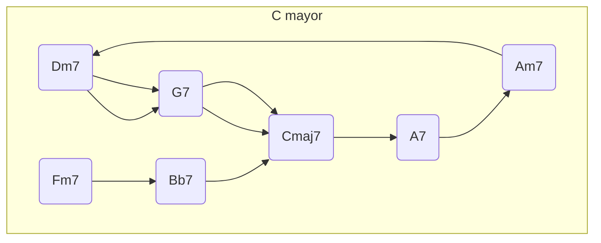
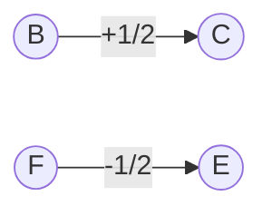

## Síntesis técnica y objetivos

- **Qué son**: 3ª y 7ª de cada acorde; definen modalidad (mayor/menor) y dirección de resolución.
- **Para qué sirven**:
  - **Bajo**: diseñar líneas caminantes, cromáticas o pedal con anclajes de función.
  - **Armonía**: voicings que preservan y conducen 3ª–7ª de forma suave y funcional.
  - **Melodía**: anclar puntos estructurales (tiempos fuertes) y “rellenar” con paso/vecinas/enclosures.
  - **Tensiones**: escoger 9/11/13 (y alteradas) según función y línea superior.
- **Conexiones**: ver `Repaso 6. Acordes Dominantes.md`, `Repaso 7. Sustitutos de tritono.md`, `Repaso 9. Tensiones.md`, `Repaso 11.x Voicing...`, `Repaso 17. Cadencias, progresiones y líneas melódicas.md`.

---

## Librería de usos de tonos guías (bajo, armonía, melodía)

### A) Líneas de bajo (función y diseño)

- **Caminante (walking)**: conecta raíces por 2ª/3ª; apunta a guías superiores. Usa cromatismos hacia raíces/terceras.
- **Cromático funcional**: G→Gb→F→E (V→subV→I); ancla los cambios de función con semitonos en el bajo.
- **Pedal**: fija tónica o dominante; deja que 3ª/7ª “pinten” arriba (dream pop/pad).
- **Arpegios direccionales**: asciende hacia la 3ª del siguiente acorde (dominante empujando a tónica).
- Regla rápida: compás previo al reposo, “apunta” el bajo a la nota estructural del siguiente acorde (1 o 3) por ½ o 1 tono.
- 

### B) Armonía (voicings y conducción)

- Piano:
  - Shells LH (1+7 o 1+3), RH (3+7+tensión). Drop-2/4 para aire. #11 en I lidio, 13 en V mixolidio.
- Guitarra:
  - 3ª/7ª en cuerdas 3–2, bajo en 6/5, 9/13 en 1ª. Desplazamientos por semitono entre dominantes/subV.
- Coral (clásico):
  - Guías en voces medias (A/T), evita paralelos, duplica tónica/5ª (evita duplicar sensible en menor).

### C) Melodía (anclas y color)

- Tiempos fuertes: 3ª o 7ª (o anticipadas con retardos 4–3, 9–8).
- Tiempos débiles: notas de paso, vecinas, enclosures (sup–inf–objetivo), apoyaturas.
- Clímax por registro y densidad 1–2 compases antes del final; resolución suave en tónica/3ª.

### D) Tensiones (elección por función)

- V7: 9, 13 (mixolidio); alterado: b9/#9/#11/b13 (superlocrio).
- SubV7: 9, 13, b9; comparte tritono con V7.
- Imaj7: 9, 6/9, #11 (lidia) para brillo etéreo (dream pop).
- i(maj7): 9, 11; maneja 13 con cautela.

---

## Procedimiento ultra-detallado (pipeline)

```mermaid
flowchart LR
A[Analiza tonalidad y función] --> B[Extrae 3ª y 7ª por acorde]
B --> C[Plan micro de resoluciones<br/>1/2 tono en dominantes/subV]
C --> D[Diseña bajo<br/>raíz / pedal / cromático]
D --> E[Elige voicings que preserven guías]
E --> F[Compón melodía anclando guías en tiempos fuertes]
F --> G[Asigna tensiones según función/modo]
G --> H[Verifica contrapunto<br/>paralelos / rangos]
H --> I[Refina ritmo y textura<br/>ostinato / arpegio / pad]
```




- Tipos de cadencia: auténtica (V→I), plagal (IV→I), deceptiva (V→vi), backdoor (ivm7→bVII7→I).

---

## Tablas de referencia

### Tabla 1. Tonos guías por función (C mayor y A menor)

| Función     | Acorde (C) | 3ª  | 7ª    | Acorde (Am)    | 3ª  | 7ª  |
| ----------- | ---------- | --- | ----- | -------------- | --- | --- |
| Predominant | Dm7        | F   | C     | Bø             | D   | A   |
| Dominant    | G7         | B   | F     | E7             | G#  | D   |
| Tónica      | Cmaj7      | E   | B     | Am(maj7)       | C   | G#  |
| SubV        | Db7        | F   | Cb(B) | Bb7 (backdoor) | D   | Ab  |

### Tabla 2. Tensiones típicas por función

| Función | Modo            | Tensiones seguras | Alteradas útiles |
| ------- | --------------- | ----------------- | ---------------- |
| V7      | Mixolidio       | 9, 13             | b9, #9, #11, b13 |
| SubV7   | Mezcla          | 9, 13             | b9               |
| Imaj7   | Lidio/Ión       | 9, 6/9, #11       | —                |
| i(maj7) | Menor arm./mel. | 9, 11             | —                |
| iiø     | Locrio ♮2       | 11                | b9 opcional      |

### Tabla 3. Células rítmicas (para melodía y bajo)

| Estilo    | Célula (1 compás 4/4)                         | Uso                |
| --------- | --------------------------------------------- | ------------------ |
| Folk      | negra – dos corcheas – negra – corchea        | Melodía cantable   |
| Dream pop | blanca – blanca                               | Pad/ostinato largo |
| Walking   | 4 negras (lineal)                             | Bajo caminante     |
| Groove    | corchea – corchea – negra – corchea – corchea | Hook melódico      |

---

## Ritmo: cómo meterlo

### Armonic rhythm (cuándo cambian los acordes)

- Cambia cada compás para claridad; duplica duración en tónica para “respiro”.
- Inserta dominantes de paso en tiempos débiles (V/ii, V/V) para empuje.

### Integración rítmica por capas

- Bajo: negras (walking) o blanca (pedal). Anticipa 1/8 el cambio a V para empuje.
- Armonía: arpegio 1–7–3–9 o pad en blancas.
- Melodía: célula rítmica fija con variación de alturas; acentos preparados por apoyaturas/retardos.

```mermaid
gantt
title Ritmo armónico (ii–V–I en 4 compases)
dateFormat  X
axisFormat  %L
section Acordes
Dm7      :a1, 0, 1
G7       :a2, 1, 1
Cmaj7    :a3, 2, 2
section Capas
Bajo (negras)   :b1, 0, 4
Pad (blancas)   :b2, 0, 4
Melodía (motivo):b3, 0, 4
```



---

## Ejemplos music-abc (con voz de guías y/o bajo)

### 1) ii–V–I (C) con melodía anclada y guías

```music-abc
X:1
T:ii-V-I C mayor (Mel + Guías)
M:4/4
L:1/8
K:C
%% score (Mel|Gui)
V:Mel clef=treble
"Dm7" F E D C | "G7" B A G F | "Cmaj7" E G F E |
V:Gui clef=treble
"Dm7" F C z2 z2 | "G7" B F z2 z2 | "Cmaj7" E B z2 z2 |
```

### 2) iiø–V7alt–i (Am) con cromatismos en guías

```music-abc
X:2
T:iiø-V7alt-i (Am)
M:4/4
L:1/8
K:Am
%% score (Mel|Gui)
V:Mel
"Bø" D E F E | "E7#9" ^G A G F | "Am(maj7)" C B A ^G |
V:Gui
"Bø" D A z2 z2 | "E7#9" ^G D z2 z2 | "Am(maj7)" C ^G z2 z2 |
```

### 3) V→subV→I (G7→Db7→Cmaj7) con bajo cromático

```music-abc
X:3
T:V→subV→I con bajo cromático
M:4/4
L:1/8
K:C
%% score (Mel|Bajo)
V:Mel
"G7" B c B A | "Db7" F F^F G E | "Cmaj7" E G F E |
V:Bajo clef=bass
"G7" G, G, G, G, | "Db7" _D, _D, _D, _D, | "Cmaj7" C, B, A, G, |
```

### 4) Backdoor (ivm7→bVII7→I) en C

```music-abc
X:4
T:Backdoor (C)
M:4/4
L:1/8
K:C
%% score (Mel|Gui)
V:Mel
"Fm7" Ab G F Eb | "Bb7" D C B Ab | "Cmaj7" E B G E |
V:Gui
"Fm7" Ab Eb z2 z2 | "Bb7" D Ab z2 z2 | "Cmaj7" E B z2 z2 |
```

### 5) V→vi (deceptiva) con rutas de guías claras

```music-abc
X:5
T:Deceptiva V→vi (C)
M:4/4
L:1/8
K:C
%% score (Mel|Gui)
V:Mel
"G7" B c d c | "Am7" C B A G | "Dm7" F E D C | "G7" B A G F |
V:Gui
"G7" B F z2 z2 | "Am7" C G z2 z2 | "Dm7" F C z2 z2 | "G7" B F z2 z2 |
```

### 6) Secundarios (I–V/vi–vi–V/V–V–I) en C

```music-abc
X:6
T:Secundarios en C
M:4/4
L:1/8
K:C
%% score (Mel|Gui)
V:Mel
"C" E D C B | "A7" C^C D E F | "Am7" C B A G | "D7" F^F G A B |
"G7" B A G F | "Cmaj7" E D C B |
V:Gui
"C" E B z2 z2 | "A7" C# G z2 z2 | "Am7" C G z2 z2 | "D7" F# C z2 z2 |
"G7" B F z2 z2 | "Cmaj7" E B z2 z2 |
```

### 7) Intercambio modal (Imaj7–ivm7–bVII7–Imaj7) dream pop

```music-abc
X:7
T:Intercambio modal (C)
M:4/4
L:1/4
K:C
%% score (Mel|Gui)
V:Mel
"Cmaj7(6/9)" E D C A | "Fm7(9)" Ab G F Eb | "Bb7(13)" D C Bb Ab | "Cmaj7(9/#11)" E D C ^F |
V:Gui
"Cmaj7" E B z z | "Fm7" Ab Eb z z | "Bb7" D Ab z z | "Cmaj7" E B z z |
```

### 8) Folk (G–D–Em–C) con guías cantables

```music-abc
X:8
T:Pop/Folk (G)
M:4/4
L:1/8
K:G
%% score (Mel|Gui)
V:Mel
"G" B A G F# | "D" F# E D C# | "Em" G F# E D | "C" E D C B |
V:Gui
"G" B F# z2 z2 | "D" F# C z2 z2 | "Em" G D z2 z2 | "C" E B z2 z2 |
```

---

## Visualizaciones mermaid (función y rutas)

### Funciones y rutas típicas



### Rutas de guías en V→I (C)



---

## Ejercicios aplicados

1. Escribe 8 compases ii–V–I anclando 3ª/7ª en tiempos fuertes; añade al menos un enclosure en la melodía.
2. Repite en menor (iiø–V7alt–i) usando dos cromatismos dirigidos a las guías.
3. Diseña un backdoor ivm7→bVII7→I manteniendo una nota común en voces internas.
4. Toma I–V–vi–IV y obliga que cada “aterrizaje” melódico sea 3ª/7ª del acorde.
5. Arregla para guitarra: guías en cuerdas 3–2, bajo en 6–5; añade 9/13 en 1ª.
6. Construye una línea de bajo: una versión caminante (4 negras), otra con pedal tónico, y una cromática G→Gb→F hacia I.

---

## Conexiones con otras notas de `Tema`

- `Repaso 6. Acordes Dominantes.md`: funciones y resoluciones canónicas de V.
- `Repaso 7. Sustitutos de tritono.md`: equivalencia de tritono y rutas intercambiadas.
- `Repaso 9. Tensiones.md`: selección de 9/11/13 y alteraciones por contexto modal.
- `Repaso 11. Voicing 2 y reglas clásicas de composición.md`, `Repaso 11.1 Voicing y reglas clásicas de coral.md`, `Repaso 11.3 Reglas voicing.md`, `Repaso 11.4 Voicing Coral paso a paso.md`: conducción clásica y duplicaciones.
- `Repaso 17. Cadencias, progresiones y líneas melódicas.md`: cierres, fraseo, dirección.

---

## Checklist final

- 3ª/7ª de cada acorde escritas y conectadas (½ tono cuando aplica).
- Bajo y textura definidos (pedal/caminante/cromático) y coherentes con el estilo.
- Voicings respetan rutas internas; sin paralelos evidentes; rangos controlados.
- Melodía ancla guías en tiempos fuertes y usa conectores claros (paso/vecinas/enclosures/retardos).
- Tensiones coherentes con función (mixolidio/alterado/lidio/menor armónica).
- Clímax y resolución planificados (1–2 compases antes del final).

- ¿Quieres que además genere una versión “por 12 tonalidades” de los ejemplos ii–V–I y iiø–V7alt–i, o preferimos transponer a Bb y E que son tonalidades frecuentes para guitarra/voz?
