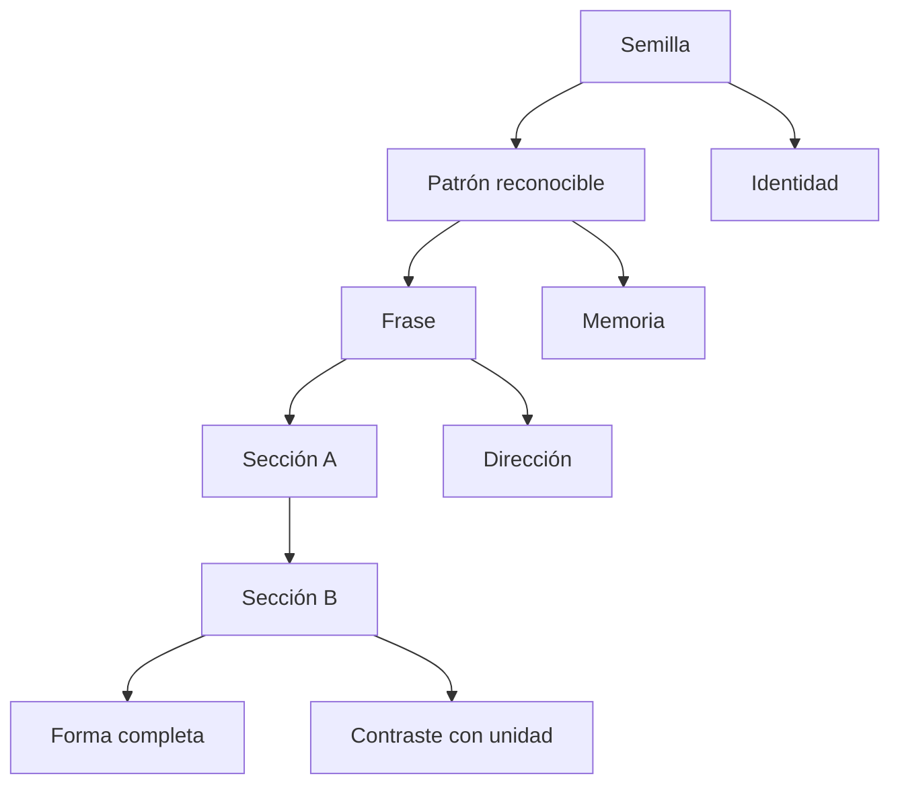
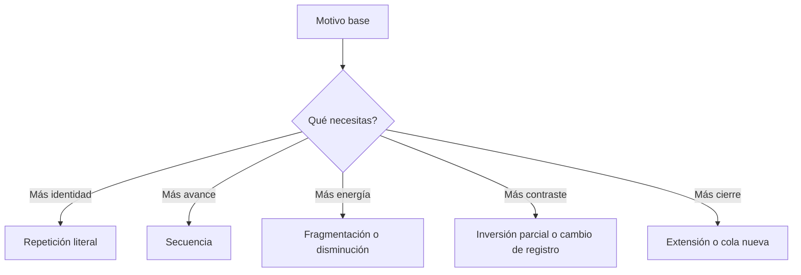
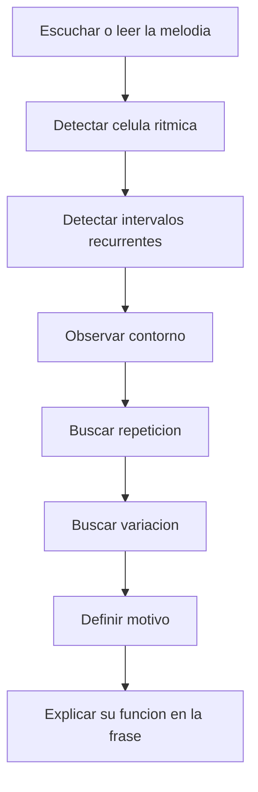

# Repaso 26: Composición melódica

> Guía extendida para entender, reconocer y construir melodías con foco en **patrones**, **componentes internos** y aplicación directa a una **forma AB**.
>
> Este repaso conecta especialmente con:
> - `Repaso 17. Cadencias, progresiones y líneas melódicas.md`
> - `Repaso 23. Enlaces 2.0 y motivos.md`
> - `Repaso 24. Composición binaria.md`
> - `Repaso 25. Composición binaria — Contraste, Intro y Puente.md`

## Índice

1. [Qué es componer una melodía](#qué-es-componer-una-melodía)
2. [La idea central: patrón antes que “muchas notas”](#la-idea-central-patrón-antes-que-muchas-notas)
3. [Qué significa componer melódicamente en forma AB](#qué-significa-componer-melódicamente-en-forma-ab)
4. [Anatomía completa de una melodía](#anatomía-completa-de-una-melodía)
5. [Sección exclusiva: reconocer los elementos de la melodía y detectar patrones](#sección-exclusiva-reconocer-los-elementos-de-la-melodía-y-detectar-patrones)
6. [Células melódicas: interválicas, rítmicas y de contorno](#células-melódicas-interválicas-rítmicas-y-de-contorno)
7. [Cómo construir la Parte A](#cómo-construir-la-parte-a)
8. [Cómo construir la Parte B sin perder unidad](#cómo-construir-la-parte-b-sin-perder-unidad)
9. [Relación entre melodía y primer acorde que escuchas](#relación-entre-melodía-y-primer-acorde-que-escuchas)
10. [Librería de transformaciones melódicas](#librería-de-transformaciones-melódicas)
11. [Plantillas prácticas para escribir melodías AB](#plantillas-prácticas-para-escribir-melodías-ab)
12. [Ejemplos guiados](#ejemplos-guiados)
13. [Piano-lab: probar la melodía al teclado](#piano-lab-probar-la-melodía-al-teclado)
14. [Ejercicios y checklist de revisión](#ejercicios-y-checklist-de-revisión)

---

## Qué es componer una melodía

Componer una melodía **no** es simplemente escoger notas “bonitas” sobre acordes.  
Componer una melodía es diseñar una **línea con identidad**, dirección, respiración y memoria.

Una buena melodía suele tener estas cuatro cualidades al mismo tiempo:

| Cualidad | Qué significa | Cómo se percibe |
|---|---|---|
| **Identidad** | Tiene un gesto reconocible | La recuerdas después de oírla una o dos veces |
| **Dirección** | Va hacia algún sitio | Sientes pregunta, avance, llegada o cierre |
| **Coherencia** | Sus partes se relacionan | No parece una cadena de ideas desconectadas |
| **Variedad** | No se queda estática | Mantiene interés sin perder unidad |

La melodía vive en el cruce de:
- **ritmo**
- **contorno**
- **intervalos**
- **puntos de apoyo armónicos**
- **fraseo**
- **tensión / resolución**

Si cualquiera de estas capas falla, la melodía suele sentirse:
- aleatoria
- plana
- demasiado “cuadrada”
- demasiado hablada y poco cantable
- técnicamente correcta pero sin identidad

---

## La idea central: patrón antes que “muchas notas”

La mayoría de melodías convincentes no nacen como una frase larga de ocho compases completa.  
Nacen de una **semilla pequeña**:

- una célula rítmica
- una célula interválica
- un contorno
- una nota objetivo
- una combinación corta de las anteriores

### Regla práctica

> **Primero se diseña el patrón. Luego se expande.**

Si empiezas “improvisando notas” sin una semilla clara:
- la melodía cambia de idioma cada compás
- no hay memoria temática
- A y B parecen materiales distintos

Si empiezas con una semilla clara:
- puedes repetirla
- variarla
- secuenciarla
- fragmentarla
- desplazarla
- invertirla
- contrastarla sin perder identidad

### La melodía como sistema



---

## Qué significa componer melódicamente en forma AB

En forma **AB**, la melodía debe cumplir dos tareas distintas:

| Sección | Función principal | Qué debe lograr |
|---|---|---|
| **A** | Presentar identidad | Definir el “idioma” melódico |
| **B** | Contrastar y desarrollar | Sonar nueva, pero emparentada con A |

### Lo más importante en AB

La Parte B **no** debe sentirse como una melodía totalmente nueva salvo que ese sea el objetivo estético.  
En composición tonal, popular, cinematográfica o instrumental, normalmente buscas:

- **misma familia**
- **otro punto de vista**

### Fórmula práctica para AB

> **A = presentar patrón**  
> **B = cambiar 1–3 parámetros del patrón**

### Qué puede mantenerse y qué puede cambiar

| Mantener | Cambiar |
|---|---|
| Célula rítmica | Registro |
| Contorno base | Intervalos |
| Cabeza del motivo | Densidad |
| Nota de llegada | Armonía debajo |
| Tipo de fraseo | Longitud de la cola |

### Error típico

Muchos problemas de composición melódica vienen de aquí:

- A tiene una lógica
- B ignora esa lógica
- entonces la forma existe “en papel”, pero no en el oído

---

## Anatomía completa de una melodía

Aquí está la parte clave del tema.  
Para componer bien, tienes que aprender a escuchar la melodía como un conjunto de **componentes distinguibles**.

## 1. Ritmo

El ritmo es la dimensión más fácil de reconocer y una de las más importantes para la identidad.

| Elemento | Qué observar | Qué preguntas hacer |
|---|---|---|
| Duraciones | negras, corcheas, semicorcheas, silencios | ¿qué figura domina? |
| Ubicación | tiempos fuertes o débiles | ¿entra en el 1, en contratiempo o con anacrusa? |
| Densidad | pocas o muchas notas | ¿la línea respira o se satura? |
| Repetición | patrón fijo o cambiante | ¿hay una célula rítmica estable? |
| Acento | natural o desplazado | ¿qué notas se sienten “importantes”? |

## 2. Contorno

El contorno es la forma general del movimiento melódico.

| Tipo de contorno | Sensación típica | Reconocimiento rápido |
|---|---|---|
| Ascendente | crecimiento, impulso | cada gesto sube más de lo que baja |
| Descendente | relajación, caída, respuesta | termina bajando o cediendo tensión |
| Arco | apertura y regreso | sube a un pico y vuelve |
| Onda | flexibilidad, conversación | alterna subida y bajada |
| Estático / nota pivote | mantra, suspensión | gira alrededor de 1–2 notas |
| Salto + compensación | énfasis expresivo | salto notable seguido de paso contrario |

## 3. Intervalos

Los intervalos son el esqueleto expresivo del motivo.

| Tipo de intervalo | Efecto frecuente | Uso típico |
|---|---|---|
| 2ª | natural, cantable | líneas fluidas |
| 3ª | dulce, clara, muy usable | motivos cantables, pop, folk |
| 4ª | abierta, firme | aperturas, llamados |
| 5ª | estable, amplia | gesto fuerte, himno, fanfarria |
| 6ª | expresiva, amplia | lirismo, salto memorable |
| 7ª / tritono | tensión fuerte | color especial, evitar si no está controlado |

## 4. Nota de apoyo o anclaje

No toda nota pesa igual. Algunas notas “sostienen” la melodía.

| Tipo de nota | Función |
|---|---|
| Nota estructural | define el acorde o el punto de reposo |
| Nota de paso | conecta dos notas estructurales |
| Bordadura | rodea una nota principal |
| Anticipación | aparece antes del acorde al que pertenece |
| Retardo | se queda de más y resuelve después |
| Escape / apoyatura | añade tensión expresiva breve |

## 5. Relación con la armonía

La melodía no flota sola: dialoga con el acorde y con el bajo.

| Situación | Efecto |
|---|---|
| Nota melódica = fundamental / 3ª / 5ª | estabilidad |
| Nota melódica = 7ª / 9ª / 11ª | color o tensión |
| Melodía contradice el bajo con intención | fricción expresiva |
| Melodía y bajo se mueven juntos todo el tiempo | menos independencia |

## 6. Registro y rango

| Concepto | Definición | Qué revisar |
|---|---|---|
| Registro | zona del instrumento donde cae la melodía | grave, medio, agudo |
| Rango | distancia entre nota más baja y más alta | ¿es cantable o demasiado amplio? |
| Tesitura útil | zona donde la línea “vive” cómodamente | ¿se sostiene el carácter? |

## 7. Fraseo y respiración

| Elemento | Qué significa |
|---|---|
| Inicio | cómo arranca la idea |
| Desarrollo interno | cómo se mueve entre su inicio y su meta |
| Punto alto | dónde sube la energía |
| Cadencia | cómo aterriza |
| Silencio | dónde respira |

## 8. Repetición y variación

| Recurso | Función |
|---|---|
| Repetición literal | fijar identidad |
| Repetición secuencial | trasladar el material |
| Variación mínima | mantener unidad y evitar monotonía |
| Fragmentación | concentrar energía |
| Extensión | cerrar o expandir |

## 9. Tensión y relajación

Una melodía casi siempre alterna estos dos polos:

| Genera tensión | Genera relajación |
|---|---|
| notas agudas | descenso |
| notas largas sobre tensión | resolución |
| intervalos amplios | paso conjunto posterior |
| cromatismo | nota estable |
| síncopa / contratiempo | aterrizaje en tiempo fuerte |

---

## Sección exclusiva: reconocer los elementos de la melodía y detectar patrones

Esta es la parte más importante del repaso si tu objetivo es **entender el patrón** y no solo “copiar el resultado”.

## Método de observación: qué mirar primero

Cuando escuches o analices una melodía, haz estas preguntas en este orden:

| Orden | Pregunta | Qué buscas |
|---|---|---|
| 1 | ¿Qué se repite? | ritmo, notas, dirección, longitud |
| 2 | ¿Qué cambia? | final, registro, armonía, densidad |
| 3 | ¿Dónde respira? | silencios, notas largas, cadencias |
| 4 | ¿Dónde cae el peso? | notas estructurales y acentos |
| 5 | ¿Cuál es el gesto base? | subida, bajada, arco, pivote |
| 6 | ¿Qué hace la Parte B con ese gesto? | contraste, secuencia, inversión, expansión |

## Cómo detectar si de verdad hay un patrón

Un patrón existe si puedes describirlo sin depender de notas exactas.

Ejemplos de descripción correcta:

- “dos corcheas y una negra, subiendo por terceras”
- “salto inicial y luego descenso conjunto”
- “misma célula rítmica, pero la segunda vez arranca una nota antes”
- “la cabeza es igual y la cola resuelve distinto”

Ejemplos de descripción pobre:

- “suena bonito”
- “parece parecida”
- “usa varias notas”

## Test de reconocimiento rápido

Si quieres saber si entendiste una melodía, intenta completar esta ficha:

| Campo | Ejemplo de respuesta |
|---|---|
| Célula rítmica | corchea-corchea-negra |
| Célula interválica | +3, +2, -2 |
| Contorno | ascenso corto y caída |
| Nota pivote | G |
| Punto de llegada | E sobre C |
| Recurso de repetición | secuencia descendente |
| Tipo de cierre | abierto en A, cerrado en B |

Si no puedes completar esta ficha, aún no entendiste la melodía desde dentro.

### Proceso visual de reconocimiento


## Cómo empezar a reconocer patrones en la práctica

### 1. Quita la armonía por un momento

Primero mira solo la línea.  
Muchos alumnos intentan entender la melodía pensando primero en los acordes. Eso ayuda, pero **antes** necesitas reconocer la lógica interna del gesto.

### 2. Reduce la línea a su esqueleto

Convierte una melodía compleja en:

- ataque principales
- notas estructurales
- dirección general

Ejemplo:

```
Melodía original: E4 G4 A4 G4 F4 E4 D4
Esqueleto:       E4    A4    F4    D4
Contorno:        sube, pico, baja
```

### 3. Distingue “cabeza” y “cola”

Muchas melodías funcionan así:

| Parte | Función |
|---|---|
| **Cabeza** | lo que la hace reconocible |
| **Cola** | lo que la adapta al contexto y la lleva al cierre |

Si reconoces la cabeza, podrás construir muchas variantes.

### 4. Aprende a oír lo constante y lo variable

En buena composición melódica, no todo cambia ni todo se repite.

| Se mantiene | Se modifica |
|---|---|
| ritmo | final |
| contorno | registro |
| primera mitad del motivo | armonía debajo |
| nota pivote | resolución |

### 5. Haz análisis “por capas”

No analices solo notas. Analiza por separado:

1. ritmo
2. dirección
3. intervalos
4. apoyo armónico
5. fraseo

---

## Células melódicas: interválicas, rítmicas y de contorno

Una **célula** es una unidad pequeña con identidad reconocible.  
Las melodías convincentes se construyen uniendo y transformando células.

## 1. Células interválicas

No se definen por notas exactas, sino por **distancias** y **direcciones**.

### Tabla base de células interválicas

| Tipo | Fórmula | Sensación | Uso frecuente |
|---|---|---|---|
| Conjunta | `+2, -2, +2` | fluida | líneas cantables |
| Por terceras | `+3, -3` o `+3, +3` | clara, estable | folk, pop, piano |
| Arpegiada | `+3, +3, -2` | más armónica | melodías sobre tríadas |
| Salto + relleno | `+5, -2, -2, -1` | expresiva | tema principal memorable |
| Vecina | `0, +2, 0` o `0, -2, 0` | suspensión | giros sencillos |
| Cromática | `+1, +1, -1` | tensión fina | transición, color |
| Ondulante | `+2, -2, +2, -2` | insistente | motivos cortos |

### Cómo reconocerlas

| Si escuchas esto | Probablemente hay |
|---|---|
| notas que “caminaron” | célula conjunta |
| sensación de acorde dibujado | célula arpegiada |
| salto claro seguido de compensación | salto + relleno |
| sensación de insistencia alrededor de una nota | célula vecina |
| color de tensión fina o “deslizamiento” | célula cromática |

## 2. Células rítmicas

La identidad muchas veces está más en el ritmo que en las notas.

| Nombre práctico | Fórmula simple | Sensación | Comentario |
|---|---|---|---|
| Paso básico | negra - negra - negra - negra | neutral | útil para bosquejar |
| Célula cantable | corchea - corchea - negra | muy usable | excelente para motivos |
| Entrada con pickup | silencio de corchea + corchea + negra | impulso | crea arrastre |
| Cola activa | negra + corchea + corchea | respuesta | útil para finales |
| Síncopa suave | corchea ligada a negra | suspensión | genera aire |
| Densificación | 4 semicorcheas | empuje | cuidado con exceso |
| Tresillo 3-3-2 | ataque irregular en 4/4 | insistencia | más rítmico y moderno |

## 3. Células de contorno

| Tipo | Dibujo verbal | Función |
|---|---|---|
| Escalón ascendente | sube poco a poco | presentación |
| Caída escalonada | baja por grados | respuesta o cierre |
| Arco | sube y vuelve | frase completa |
| Pico tardío | se guarda el punto alto | intensificación |
| Giro de vecindad | ronda una nota | fijación |
| Salto inicial | énfasis inmediato | inicio fuerte |

## 4. Células de apoyo armónico

| Tipo | Qué hace |
|---|---|
| 3ª del acorde | define el color del acorde |
| 7ª del acorde | define dirección y tensión |
| 9ª como color | embellece si resuelve o se sostiene con intención |
| Retardo 4-3 | tensión clásica y expresiva |
| Anticipación | conecta dos acordes sin cortar la línea |

## 5. Células combinadas

Lo verdaderamente útil es combinar capas:

| Célula combinada | Ejemplo |
|---|---|
| Rítmica + interválica | corchea-corchea-negra con terceras |
| Contorno + apoyo | arco que aterriza en la 3ª del acorde |
| Rítmica + cromática | patrón fijo con una nota cromática de llegada |
| Arpegiada + síncopa | salto armónico con entrada desplazada |

### Regla práctica de diseño

> Si una célula funciona, no la cambies completa.  
> Cambia solo una capa a la vez.

Por ejemplo:
- mismo ritmo, otros intervalos
- mismo contorno, otra resolución
- misma cabeza, otra cola
- misma célula interválica, otra colocación métrica

---

## Cómo construir la Parte A

La Parte A debe establecer el idioma.  
Si A no está clara, B tampoco podrá contrastar con sentido.

## Objetivos de A

| Objetivo | Explicación |
|---|---|
| Presentar la semilla | mostrar el patrón principal |
| Fijar una lógica | que el oyente entienda “cómo habla” la pieza |
| Crear una pequeña pregunta | dejar espacio para el desarrollo |
| Definir el clima | estable, melancólico, brillante, tenso, etc. |

## Método paso a paso para A

### Paso 1. Elige una célula principal

Ejemplo:
- ritmo: `corchea-corchea-negra`
- intervalos: `+3, +2, -2`

### Paso 2. Escríbela dos veces

La segunda vez puede ser:
- literal
- secuencial
- con otra nota final

### Paso 3. Decide si A cierra o deja abierta la puerta

| Tipo de final de A | Efecto |
|---|---|
| Cierre débil / abierto | invita a B |
| Cierre medio | da pequeña pausa |
| Cierre fuerte | hace A más autónoma |

### Paso 4. Diseña una pequeña jerarquía interna

Dentro de A debe sentirse:

1. inicio
2. repetición o eco
3. intensificación pequeña
4. llegada provisional

### Plantilla mínima de A (4 compases)

| Compás | Función |
|---|---|
| 1 | presentación del motivo |
| 2 | repetición o respuesta cercana |
| 3 | secuencia o mini-variación |
| 4 | cierre abierto o semicierre |

### Qué revisar en A

- ¿la primera idea se puede cantar?
- ¿se reconoce el patrón en el compás 2 o 3?
- ¿el cierre deja ganas de seguir?
- ¿hay demasiadas notas?
- ¿la melodía depende demasiado de la armonía para funcionar?

---

## Cómo construir la Parte B sin perder unidad

La Parte B no es “otra melodía”: es una **respuesta, ampliación o contraste** de A.

## Funciones posibles de B

| Tipo de B | Qué hace |
|---|---|
| Desarrollo | toma el patrón y lo expande |
| Respuesta | responde la pregunta de A |
| Contraste | cambia clima, registro o densidad |
| Reencuadre | vuelve a mirar el mismo material desde otra armonía |
| Recapitulación parcial | vuelve a la cabeza de A pero la cierra distinto |

## Qué cambiar en B

### Contraste controlado

| Parámetro | Cambio posible |
|---|---|
| Registro | subir o bajar |
| Ritmo | densificar o espaciar |
| Intervalos | pasar de segundas a terceras, o de terceras a arpegios |
| Armonía | cambiar la función debajo |
| Longitud | extender la cola |
| Direccionalidad | si A subía, B puede caer o expandirse |

### Qué conviene mantener

| Para conservar unidad | Qué mantener |
|---|---|
| Identidad rítmica | misma célula o variante cercana |
| Identidad de contorno | misma cabeza o misma curva |
| Identidad interválica | mismo tipo de salto |
| Identidad formal | misma longitud básica de frase |

## Estrategias fuertes para B

| Estrategia | Resultado |
|---|---|
| Misma cabeza, otra cola | unidad inmediata |
| Misma rítmica, otra altura | contraste limpio |
| Secuencia | desarrollo claro |
| Fragmentación | intensificación |
| Cambio de registro | expansión emocional |
| Inversión parcial | respuesta inteligente |
| Densificación rítmica | más energía |
| Ampliación rítmica | más espacio, más peso |

### Plantilla útil de B (4 compases)

| Compás | Función |
|---|---|
| 5 | reentrada con parentesco claro con A |
| 6 | variación o secuencia |
| 7 | intensificación / preparación del cierre |
| 8 | resolución clara |

### Error común en B

- cambiar ritmo, registro, armonía, contorno e intervalos al mismo tiempo

Eso genera contraste, sí, pero rompe parentesco.

---

## Relación entre melodía y primer acorde que escuchas

En tus notas aparece esta idea mínima pero muy importante:

> **Primer acorde que escuchas**

Eso importa mucho porque el primer acorde:
- enmarca cómo se interpreta la primera nota
- define si una nota suena estable o tensa
- condiciona la percepción del color general

## La misma nota cambia según el acorde

| Nota melódica | Acorde debajo | Cómo se siente |
|---|---|---|
| E | C mayor | 3ª estable y definitoria |
| E | Am | 5ª estable pero más oscura |
| E | F | 7ª mayor muy colorida |
| E | Dm | 9ª suave y abierta |

Conclusión:

> La melodía no se entiende del todo sin su contexto armónico, y el **primer acorde** condiciona la primera lectura emocional.

## Aplicación directa

Antes de escribir la melodía de A, responde:

| Pregunta | Para qué sirve |
|---|---|
| ¿Cuál es el primer acorde? | fija el marco emocional |
| ¿Qué nota quiero arriba? | define color inicial |
| ¿Será estable o tensa? | define si la pieza entra asentada o en suspenso |

## Regla práctica

- Si quieres claridad desde el inicio: empieza con 1, 3 o 5 del acorde
- Si quieres intriga: empieza con 7, 9, 4/sus o una anticipación

---

## Librería de transformaciones melódicas

Aquí está el arsenal central para desarrollar una melodía a partir de un patrón.

| Transformación | Qué conserva | Qué cambia | Uso fuerte |
|---|---|---|---|
| Repetición literal | todo | nada | fijar identidad |
| Secuencia | ritmo y contorno | altura | desarrollo |
| Variación de cola | cabeza | final | respuesta |
| Fragmentación | parte del motivo | longitud | intensificación |
| Extensión | cabeza + dirección | duración | cierre más fuerte |
| Inversión | ritmo | dirección interválica | contraste |
| Retrogradación parcial | material | orden | color raro / recurso puntual |
| Desplazamiento métrico | patrón | punto de entrada | empuje o sorpresa |
| Diminución | perfil | velocidad | energía |
| Augmentación | perfil | amplitud temporal | peso, reposo |
| Cambio de registro | patrón | altura global | expansión |
| Cambio armónico | melodía similar | función debajo | recontextualización |

### Diagrama de decisión



### Jerarquía recomendada

Para no perder el control:

1. repetición
2. variación de cola
3. secuencia
4. fragmentación
5. cambio de registro
6. inversión / desplazamiento

Si empiezas por transformaciones muy agresivas, la melodía pierde claridad demasiado pronto.

---

## Plantillas prácticas para escribir melodías AB

## Plantilla 1: AB básico de 4 + 4 compases

| Compases | Objetivo | Recurso |
|---|---|---|
| 1-2 | presentar motivo | repetición literal o eco |
| 3-4 | cerrar A provisionalmente | pequeña secuencia o cola abierta |
| 5-6 | reabrir con parentesco claro | mismo ritmo, otro registro |
| 7-8 | cerrar B | extensión + resolución |

## Plantilla 2: AB de 8 + 8 compases

| Bloque | Función |
|---|---|
| A1 (1-4) | presentación |
| A2 (5-8) | confirmación y salida |
| B1 (9-12) | contraste / desarrollo |
| B2 (13-16) | regreso / conclusión |

## Plantilla 3: AB por “cabeza y cola”

| Sección | Cabeza | Cola |
|---|---|---|
| A | X | Y |
| B | X' o X igual | Z |

Esta es una de las mejores maneras de mantener unidad:

- `X` = identidad
- `Y/Z` = función distinta

## Plantilla 4: AB por células

| Sección | Célula rítmica | Célula interválica | Resultado |
|---|---|---|---|
| A | misma | misma | identidad plena |
| B | misma | distinta | contraste limpio |
| B | distinta | misma | contraste más rítmico |
| B | parecida | parecida | relación más sutil |

---

## Ejemplos guiados

## Ejemplo 1: A partir de una célula de terceras

Idea:
- ritmo: `corchea-corchea-negra`
- intervalos: terceras y paso conjunto

### Descripción analítica

| Capa | Diseño |
|---|---|
| Ritmo | corchea-corchea-negra |
| Intervalos | +3, +2, -2 |
| Contorno | ascenso corto y caída |
| Armonía | estable sobre I y V |
| Función | A presenta, B amplía |

### Melodía de ejemplo

```music-abc
X:1
T:Ejemplo AB - celula de terceras
M:4/4
L:1/8
Q:1/4=84
K:C
V:1 clef=treble
%%score { V }
% A
E G A2 G2 | E G A2 F2 |
E G A2 G2 | D E F2 E2 |
% B
G B c'2 B2 | G B c'2 a2 |
G A G E D2 | D E F2 C2 |
```

### Qué está pasando

| Compás | Función |
|---|---|
| 1 | presenta la cabeza |
| 2 | misma lógica, cola distinta |
| 3 | confirma patrón |
| 4 | deja A relativamente abierta |
| 5 | B sube de registro |
| 6 | intensifica |
| 7 | reduce y prepara cierre |
| 8 | cierra en C |

## Ejemplo 2: misma rítmica, otro contorno en B

| Sección | Ritmo | Contorno |
|---|---|---|
| A | fijo | ascendente |
| B | fijo | descendente |

Esto es útil cuando quieres que el contraste sea claro, pero la identidad rítmica permanezca.

## Ejemplo 3: misma cabeza, diferente cola

```
Cabeza: E4 G4 A4
Cola A: G4 F4 E4
Cola B: B4 A4 G4 C5
```

Esto suele funcionar muy bien porque el oyente reconoce la apertura de inmediato.

---

## Piano-lab: probar la melodía al teclado

Aunque este repaso está centrado en melodía, el piano es una herramienta excelente para comprobar si la línea funciona de verdad.

## Método rápido al piano

| Mano | Qué toca |
|---|---|
| Mano izquierda | fundamental o voicing simple del acorde |
| Mano derecha | melodía sola |

### Test mínimo

1. toca la melodía sola
2. tócala con bajo
3. tócala con acorde simple
4. canta la melodía mientras tocas la armonía

Si falla en alguno de estos puntos, hay algo que revisar.

## Qué escuchar al tocarla

| Señal | Posible problema |
|---|---|
| La melodía solo funciona con el acorde completo | falta identidad propia |
| La mano derecha se siente torpe o poco natural | intervalos o ritmo poco idiomáticos |
| El punto alto llega demasiado pronto | frase mal dosificada |
| La melodía y el bajo chocan demasiado | notas objetivo mal elegidas |
| B parece otro tema | cambiaste demasiadas capas |

### Versión mínima para probar una A y una B

```text
LH: C    G    Am   G
RH: E4 G4 A4 G4 | E4 G4 A4 F4 | G4 B4 C5 B4 | D4 E4 F4 C4
```

### Aplicación útil

Prueba tres variantes de la misma idea:

| Variante | Qué cambias |
|---|---|
| 1 | solo ritmo |
| 2 | solo intervalo |
| 3 | solo final |

Eso te obliga a entender la melodía por componentes, no por intuición vaga.

---

## Ejercicios y checklist de revisión

## Ejercicio 1: detectar patrón

Escoge una melodía que te guste y completa esta tabla:

| Pregunta | Tu respuesta |
|---|---|
| Célula rítmica principal |  |
| Célula interválica principal |  |
| Contorno dominante |  |
| Nota pivote |  |
| Punto alto |  |
| Cierre de A |  |
| Cambio principal en B |  |

## Ejercicio 2: crear A desde una célula

### Restricciones

| Parámetro | Condición |
|---|---|
| Longitud | 4 compases |
| Ritmo | usa solo dos tipos de figuras |
| Intervalos | máximo un salto grande |
| Cierre | deja A abierta |

## Ejercicio 3: construir B con parentesco

Parte de la misma A y elige solo **dos** cambios:

| Opción | Cambio |
|---|---|
| 1 | subir registro |
| 2 | densificar ritmo |
| 3 | cambiar cola |
| 4 | secuenciar |
| 5 | invertir parcialmente |

## Ejercicio 4: análisis de componentes

Toma una melodía tuya y marca:

- notas estructurales
- notas de paso
- células rítmicas
- contorno por compás
- dónde aparece la cabeza
- dónde cambia la cola

## Checklist profesional de revisión

- [ ] ¿Puedo describir el patrón sin nombrar notas exactas?
- [ ] ¿La Parte A establece una lógica clara?
- [ ] ¿La Parte B contrasta sin borrar la identidad?
- [ ] ¿Hay una célula rítmica reconocible?
- [ ] ¿Hay una célula interválica reconocible?
- [ ] ¿La melodía tiene notas de apoyo claras?
- [ ] ¿El punto alto está bien colocado?
- [ ] ¿La respiración está clara?
- [ ] ¿La melodía funciona sin acompañamiento denso?
- [ ] ¿El primer acorde y la primera nota se sienten intencionales?

## Regla final de composición melódica

> Una melodía buena no es la que tiene más notas ni más “sorpresas”.  
> Es la que convierte una pequeña idea en una experiencia reconocible, variada y dirigida.

## Resumen operativo

| Paso | Acción |
|---|---|
| 1 | diseña una semilla |
| 2 | nombra su patrón |
| 3 | construye A con repetición y pequeña variación |
| 4 | construye B cambiando 1–3 capas |
| 5 | verifica contorno, ritmo, apoyo armónico y cierre |
| 6 | toca, canta, reduce y reescribe |

---

## Frase-resumen para recordar todo el tema

**Componer melodía = escuchar patrón + controlar componentes + transformar una semilla dentro de una forma.**


---

## **Cómo encontrar el motivo en cualquier melodía**
  

## **Método de análisis melódico paso a paso**

|**Paso**|**Qué buscar**|**Pregunta clave**|
|---|---|---|
|1|Célula rítmica|¿Cuál es el grupo rítmico más reconocible?|
|2|Intervalos recurrentes|¿Qué saltos o grados conjuntos se repiten?|
|3|Contorno|¿La melodía sube, baja, ondula, rebota?|
|4|Repetición|¿Qué vuelve literal o casi literal?|
|5|Variación|¿Qué cambia sin perder identidad?|
|6|Función formal|¿Eso abre, desarrolla, responde o cierra?|

---

## **Plantilla simple que puedes usar siempre**

  

Cuando analices otra melodía, escribe esto:

|**Elemento**|**Mi respuesta**|
|---|---|
|Célula rítmica principal|…|
|Intervalo o gesto principal|…|
|Contorno principal|…|
|Repetición literal|…|
|Variación|…|
|Motivo resultante|…|

---

## **Qué elementos necesitas para hacer el mismo análisis tú solo**

  

Necesitas observar estas 6 cosas:

|**Elemento**|**Qué significa**|
|---|---|
|Ritmo|Duraciones y acentos|
|Intervalos|Distancia entre notas consecutivas|
|Contorno|Dirección general de la línea|
|Repetición|Lo que vuelve|
|Variación|Lo que cambia pero sigue relacionado|
|Función|Qué papel cumple dentro de la frase|

Si te falta uno, casi siempre el análisis queda incompleto.

---

## **Mermaid: plantilla universal de análisis melódico**



---

## **Un mini modelo de motivo abstracto para tu caso**

```music-abc
X:1
T:Modelo abstracto del gesto motívico
M:4/4
L:1/8
K:Bb
d c Bb c | a g f g |
```

No lo tomes como transcripción exacta de tu imagen, sino como **modelo del comportamiento** que estás usando:

- caída
- pequeña recuperación
- nueva caída
- pequeña recuperación
    

---

## **Common mistakes**

- Creer que el motivo son solo las primeras notas exactas
    
- Ignorar el ritmo y mirar solo alturas
    
- Ver intervalos aislados pero no el contorno
    
- Confundir secuencia con motivo
    
- Pensar que si cambia una nota ya no es el mismo motivo
    
- No distinguir entre repetición literal y variación motívica
    

---


### **Criterio de éxito**

  

Si puedes explicar la melodía **sin nombrar todas las notas**, ya entendiste el motivo de verdad.

---

## **Next step**

  

El siguiente paso correcto es que hagamos esto juntos sobre tu misma imagen:

  

**compás por compás**, sacando:

- notas exactas
    
- intervalos exactos
    
- motivo
    
- secuencias
    
- y después convertirlo en una **composición binaria A–A’**.
    

  

Si quieres, en el siguiente mensaje te hago el análisis **compás 1, 2, 3 y 4** de forma totalmente detallada.