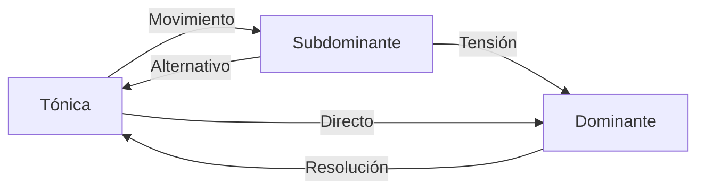

# Guía Completa: Creación de Progresiones con Armonía Tonal

Esta guía proporciona una explicación clara y sistemática para crear progresiones armónicas efectivas utilizando la armonía tonal, basada en los conceptos fundamentales de la teoría musical.

## 1. Seleccionar escala que se usará 

## 2. Familias Tonales

Seleccionar una familia tonal:
### 2.1 Familia Tónica (I, iii, vi)
- **Función**: Estabilidad y reposo
- **Acordes en Do mayor**: C, Em, Am
- Contienen la nota tónica y proporcionan sensación de resolución
### 2.2 Familia Subdominante (ii, IV)
- **Función**: Movimiento, alejamiento del reposo
- **Acordes en Do mayor**: Dm, F
- Generan tensión moderada, creando movimiento
### 2.3 Familia Dominante (V, vii°)
- **Función**: Tensión fuerte, necesidad de resolución
- **Acordes en Do mayor**: G, Bdim
- Contienen la sensible (7º grado) que impulsa la resolución hacia la tónica

## 3. Principios para Crear Progresiones Tonales

### 3.1 El Viaje Armónico Básico

```
Tónica → Subdominante → Dominante → Tónica
```


### 3.2 Diagrama de Flujo Funcional



## 4. Progresiones Básicas y su Análisis


### 5.1 Utilización de Inversiones

Las inversiones permiten crear líneas de bajo fluidas y mejorar la conducción de voces:

```music-abc
X:1
T:Progresión con Inversiones
M:4/4
L:1
K:C
"C (I)"[CEG] | "F/C (IV/I)"[CFAc] | "G/B (V/VII)"[BGd] | "C (I)"[CEG] |
```

### 5.2 Acordes con Séptima

Añadir séptimas enriquece el color armónico:

```music-abc
X:1
T:Progresión con Séptimas
M:4/4
L:1
K:C
"Cmaj7 (Imaj7)"[CEGb] | "Dm7 (ii7)"[DFAc] | "G7 (V7)"[GBdF] | "Cmaj7 (Imaj7)"[CEGb] |
```

## 7. Aplicación Práctica por Tonalidades

### 7.1 Progresiones en Do Mayor (C)

| Acordes Diatónicos | Familia Tonal |
| ------------------ | ------------- |
| C (I)              | Tónica        |
| Dm (ii)            | Subdominante  |
| Em (iii)           | Tónica        |
| F (IV)             | Subdominante  |
| G (V)              | Dominante     |
| Am (vi)            | Tónica        |
| Bdim (vii°)        | Dominante     |

### 7.2 Progresiones en Re Mayor (D)

| Acordes Diatónicos | Familia Tonal |
| ------------------ | ------------- |
| D (I)              | Tónica        |
| Em (ii)            | Subdominante  |
| F#m (iii)          | Tónica        |
| G (IV)             | Subdominante  |
| A (V)              | Dominante     |
| Bm (vi)            | Tónica        |
| C#dim (vii°)       | Dominante     |

## 8. Consejos Prácticos para Composición

1. **Comienza con una estructura sencilla**: I-IV-V-I o I-vi-IV-V
2. **Decide el carácter emocional** que deseas transmitir:
   - Mayor: Normalmente brillante, alegre
   - Menor: Suele transmitir melancolía, dramatismo
3. **Experimenta con diferentes voicings** e inversiones
4. **Usa acordes de séptima** para enriquecer el color
5. **Incorpora técnicas avanzadas gradualmente**
6. **Estudia progresiones de canciones que te gusten**

## 9. Ejemplos de Progresiones Melancólicas

Como se menciona en tus apuntes sobre progresiones melancólicas, puedes crear efectos emotivos específicos:

- Utiliza el modo dórico para un tono melancólico con un toque de esperanza
- En tonalidad mayor, incorpora intercambios modales del modo menor paralelo
- Coloca notas específicas (como la 9ª) en registros agudos para resaltar su emotividad

## 10. Recursos para Práctica

1. **Análisis de canciones populares** con progresiones tonales claras
2. **Ejercicios de identificación de familias tonales**
3. **Práctica de conducción de voces** entre acordes
4. **Experimentación con diferentes ritmos armónicos**

## Conclusión

La armonía tonal proporciona un marco estructurado para crear progresiones musicales efectivas. Comprender las familias tonales y sus funciones te permitirá desarrollar progresiones que transmitan exactamente la emoción que deseas, desde la estabilidad hasta la tensión y la resolución.

Al dominar estos conceptos, podrás moverte conscientemente entre los diferentes niveles de tensión y reposo, creando música que guíe al oyente a través de un viaje armónico satisfactorio.

---
# Familias Tonales en Escalas Menores

## 1. Estructura de Familias en Modo Menor Natural

En una tonalidad menor natural, los acordes también se agrupan en tres familias funcionales, pero con características distintas al modo mayor:

### 1.1 Familia Tónica (i, III, VI)
- **Función**: Estabilidad y reposo
- **Acordes en Re menor**: Dm, F, B♭
- **Características**: 
  - Contienen la nota tónica (D)
  - Proporcionan el centro de gravedad armónico
  - El acorde VI (B♭) tiene un carácter más brillante que en modo mayor

### 1.2 Familia Subdominante (iv, VI, ii°)
- **Función**: Movimiento, alejamiento moderado
- **Acordes en Re menor**: Gm, B♭, Edim
- **Características**: 
  - El iv (Gm) es el principal acorde subdominante
  - El VI (B♭) tiene doble función (tónica/subdominante)
  - El ii° (Edim) tiene un color más oscuro que su equivalente en mayor

### 1.3 Familia Dominante (v, VII)
- **Función**: Tensión, impulso hacia la resolución
- **Acordes en Re menor**: Am, C
- **Características**:
  - El v (Am) es menor, no mayor como en la tonalidad armónica
  - Genera menos tensión que un acorde dominante con tercera mayor
  - El VII (C) actúa como dominante sustituto

## 2. Particularidades del Modo Menor Armónico

En el modo menor armónico, la familia dominante adquiere mayor fuerza:

### 2.1 Familia Dominante Reforzada (V, vii°)
- **Acordes en Re menor armónico**: A (mayor), C♯dim
- **Características**:
  - El V grado se vuelve mayor (A en lugar de Am)
  - Contiene la sensible (C♯) que impulsa fuertemente hacia la tónica
  - El vii° se convierte en totalmente disminuido (C♯dim)
  - Genera mayor tensión que en el modo menor natural

## 3. Particularidades del Modo Menor Melódico

En el modo menor melódico ascendente, las familias se modifican:

### 3.1 Familia Subdominante Ampliada (IV, ii)
- **Acordes en Re menor melódico**: G (mayor), Em
- **Características**:
  - El IV se vuelve mayor (G en lugar de Gm)
  - El ii se vuelve semidisminuido (Em en lugar de Edim)
  - Aporta un color más brillante que en menor natural

### 3.2 Familia Dominante Expandida (V, vii°)
- **Acordes en Re menor melódico**: A (mayor), C♯m7♭5
- **Características**:
  - Mantiene el V grado mayor como en la menor armónica
  - El vii° cambia a semidisminuido (C♯m7♭5)
  - Ofrece más opciones para la conducción hacia la tónica

## 4. Diferencias Clave con las Familias en Modo Mayor

1. **Ambigüedad Tonal**: En menor, hay mayor ambigüedad entre funciones
2. **Familia Tónica**: Incluye acordes mayores (III, VI) que aportan contraste
3. **Familia Subdominante**: Contiene un acorde disminuido (ii°) en menor natural
4. **Familia Dominante**: En menor natural es más débil que en mayor o menor armónica
5. **Flexibilidad**: Las escalas menores armónica y melódica permiten adaptar estas familias según necesidades expresivas

## 5. Aplicaciones Prácticas

### 5.1 Progresiones Características en Menor Natural
- **i-VII-VI-V**: Dm-C-B♭-Am (flujo descendente típico)
- **i-iv-VII-i**: Dm-Gm-C-Dm (equivalente al I-IV-V-I en mayor)

### 5.2 Progresiones con Dominante Armónica
- **i-iv-V-i**: Dm-Gm-A-Dm (incorpora la tensión del V mayor)
- **i-VI-V-i**: Dm-B♭-A-Dm (movimiento entre tónica y dominante)

### 5.3 Progresiones con Elementos Melódicos
- **i-IV-V-i**: Dm-G-A-Dm (usa el IV mayor del modo melódico)
- **i-ii-V-i**: Dm-Em-A-Dm (evita el acorde disminuido, usando el ii menor)

Las familias tonales en modo menor ofrecen una riqueza expresiva ampliada, con más posibilidades de coloración armónica y tensión que en el modo mayor, permitiendo generar desde atmósferas oscuras y melancólicas hasta contrastes dramáticos y resoluciones intensas.
