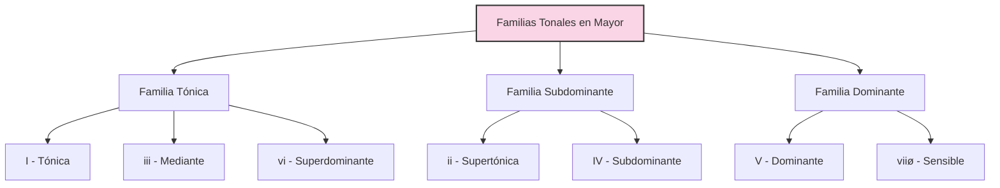
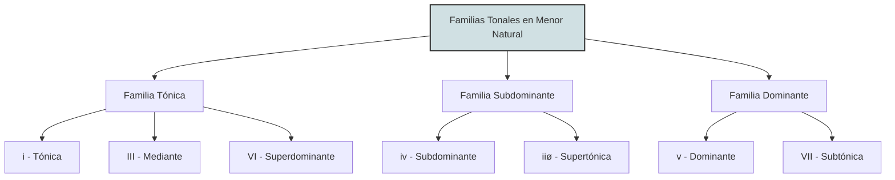
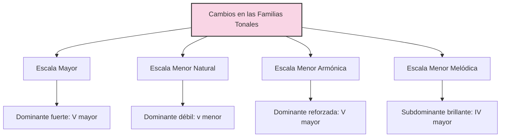

# Familias Tonales y Creación de Progresiones

Las familias tonales son grupos de acordes que comparten una función armónica similar dentro de una tonalidad. Estas familias son fundamentales para crear progresiones efectivas.

## Familias Tonales Básicas

Existen tres familias tonales principales:

1. **Familia Tónica** (I, iii, vi)

   - Función: Estabilidad, reposo
   - En C mayor: C, Em, Am
   - Características: Contienen la nota tónica, proporcionan sensación de resolución

2. **Familia Subdominante** (IV, ii)

   - Función: Movimiento, alejamiento
   - En C mayor: F, Dm
   - Características: Contienen la nota subdominante (4º grado), crean tensión moderada

3. **Familia Dominante** (V, vii°)
   - Función: Tensión, necesidad de resolución
   - En C mayor: G, Bdim
   - Características: Contienen la nota sensible (7º grado), generan máxima tensión

## Creación de Progresiones con Familias Tonales

### Principio de Movimiento Armónico

Las progresiones efectivas suelen seguir este patrón:

```
Tónica → Subdominante → Dominante → Tónica
```

Esto crea un "viaje armónico" de estabilidad → movimiento → tensión → resolución.

### Progresiones Comunes Usando Familias Tonales

En C mayor:

1. **I-IV-V-I** (C-F-G-C)
   Progresión clásica que muestra el movimiento entre las tres familias tonales

2. **I-vi-IV-V** (C-Am-F-G)
   Comienza en la familia tónica, pasa por subdominante y termina en dominante

3. **ii-V-I** (Dm-G-C)
   Progresión de jazz que va de subdominante a dominante a tónica

### Aplicación de Inversiones

Como explican tus apuntes sobre voicings e inversiones, puedes mejorar estas progresiones usando inversiones para:

1. **Crear líneas de bajo más fluidas**

   - Ejemplo: C-Am/C-F/C-G (mantiene C en el bajo)

2. **Suavizar la conducción de voces**

   - Como se muestra en tu ejemplo de conducción de voces II-V-I:

   ```music-abc
   X:1
   T:Conducción de Voces II-V-I
   M:4/4
   L:1/1
   K:C
   "Dm7" [D F A c] | "G7" [D F G B] | "Cmaj7" [E G C e] |
   ```

## Enriquecimiento con Intercambios Modales

Según tus apuntes sobre intercambios modales, puedes expandir las familias tonales tradicionales incorporando acordes "prestados" de otros modos:

1. **Familia Tónica Expandida**

   - Añadir bIII (Eb en C mayor, tomado del modo eólico/frigio)
   - Ejemplo: C → Eb → C

2. **Familia Subdominante Expandida**

   - Añadir bVI (Ab en C mayor, del modo eólico)
   - Ejemplo: F → Ab → F

3. **Familia Dominante Expandida**
   - Añadir bII (Db en C mayor, del modo frigio)
   - Ejemplo: G7 → Db → G7

### Ejemplo de Progresión con Intercambios Modales

En C mayor:

```
C (I) → Ab (bVI) → Fm (iv) → G7 (V) → C (I)
```

Aquí, Ab y Fm son préstamos del modo eólico (C menor).

## Aplicación a Tus Ejemplos

En tus apuntes sobre D mayor, puedes crear progresiones usando sus familias tonales:

```
Tónica: D, F#m, Bm
Subdominante: G, Em
Dominante: A7, C#m7b5
```

Por ejemplo:

```music-abc
X:1
T:Progresión en D Mayor con Familias Tonales
M:4/4
L:1/1
K:D
"D" [DF^A] | "Em" [EGB] | "A7" [^CEG] | "D" [DF^A] |
```

Sumando inversiones y voicings como muestran tus apuntes, puedes crear progresiones más interesantes con movimientos de bajo fluidos y buena conducción de voces.

---

## Familias modales

### 🧭 1. **Centro Modal**

Este es el **imán auditivo**. No se define por tensión y resolución, sino por repetición, pedal, inicio/final, o centro melódico.

- **Dm7**: es el acorde que establece el modo y se presenta como base.

  - Tiene las notas D – F – A – C

  - No contiene ni la sensible (C#), ni la sexta (B), por eso es **neutral** y central.

---

### 🎨 2. **Colores Modales**

Son acordes que contienen la **nota característica del modo**. En dórico, esa nota es la **sexta mayor** (B natural).  
Estos acordes **acentúan el color dórico** y deben usarse para **brillar** ese color distintivo.

- **Em7**: E – G – B – D → contiene la B natural (color dorico directo)

- **Bm7♭5**: B – D – F – A → también incluye B, D, F (con función cromática más grisácea, interesante)

📌 Usarlos en contextos suaves, medios, flotantes. No producen tensión-resolución, sino **iluminación modal**.

---

### 🌊 3. **Movimiento Modal Sin Tensión Fuerte**

Estos acordes pueden generar variación armónica sin alterar el centro modal. A veces se mueven más lejos armónicamente, pero no provocan cadencias funcionales.

- **G7**: G – B – D – F → contiene la B natural y el F (interesante fricción suave con Dm7)

- **Am7**: A – C – E – G → se siente como **una expansión natural** desde Dm7

- **Cmaj7**: C – E – G – B → puede sonar más lejano, pero aún suave, aporta atmósfera

- **Fmaj7**: F – A – C – E → conecta muy bien con Dm7 por compartir A y C, y da una sensación **pastel/etérea**

💡 Son perfectos para progresiones más amplias, sin necesidad de “volver a casa”.

---

### 💥 Tensión lateral o cromática suave

Si bien D dórico no tiene acordes dominantes, **puedes agregar acordes fuera del modo**, siempre que no quiebren el centro modal. Por ejemplo:

- **A7**: sería **tensión funcional** (NO deseada aquí si quieres mantener modo)

- Pero **Ebmaj7** o **Bbmaj7** (prestados de D menor o F mayor) podrían ser usados para **coloración momentánea lateral** si se usan con cuidado, sin cadenciar.

---

# Guía Completa de Familias Tonales y Progresiones

## 1. Fundamentos de las Familias Tonales

Las familias tonales son grupos de acordes con funciones armónicas similares dentro de una tonalidad. Este sistema permite entender las relaciones entre acordes y crear progresiones musicalmente efectivas.

### 1.1 Principio de las Familias Tonales

Cada escala o modo genera un conjunto de acordes que pueden agruparse en tres familias principales:

- **Familia Tónica**: Acordes que proporcionan estabilidad y sensación de reposo
- **Familia Subdominante**: Acordes que generan movimiento moderado
- **Familia Dominante**: Acordes que crean tensión y necesidad de resolución

Esta clasificación funcional es fundamental para entender cómo construir progresiones con dirección musical clara.

## 2. Familias Tonales en Escalas Mayores

### 2.1 Estructura de la Escala Mayor

La escala mayor tiene el siguiente patrón de tonos (T) y semitonos (S):

```
T-T-S-T-T-T-S
```

En Do Mayor: C-D-E-F-G-A-B-C

### 2.2 Acordes Diatónicos en Escala Mayor

| Grado | Cifrado | Tipo de Acorde | Ejemplo en C |
| ----- | ------- | -------------- | ------------ |
| I     | Imaj7   | Mayor 7        | Cmaj7        |
| ii    | ii7     | Menor 7        | Dm7          |
| iii   | iii7    | Menor 7        | Em7          |
| IV    | IVmaj7  | Mayor 7        | Fmaj7        |
| V     | V7      | Dominante 7    | G7           |
| vi    | vi7     | Menor 7        | Am7          |
| vii°  | viiø7   | Semidisminuido | Bm7b5        |

### 2.3 Familias Tonales en Modo Mayor



| Familia      | Acordes (Do Mayor)       | Función                 | Características                                                              |
| ------------ | ------------------------ | ----------------------- | ---------------------------------------------------------------------------- |
| Tónica       | I (C), iii (Em), vi (Am) | Estabilidad, reposo     | Contienen la nota tónica, proporcionan sensación de resolución               |
| Subdominante | ii (Dm), IV (F)          | Movimiento, alejamiento | Contienen la subdominante (4º grado), crean tensión moderada                 |
| Dominante    | V (G), viiø (Bm7b5)      | Tensión, impulso        | Contienen la sensible (7º grado), generan máxima tensión hacia la resolución |

### 2.4 Progresiones Comunes en Modo Mayor

| Progresión | Ejemplo (C mayor) | Función Tonal | Efecto Musical                      |
| ---------- | ----------------- | ------------- | ----------------------------------- |
| I-IV-V-I   | C-F-G-C           | T-SD-D-T      | Ciclo completo, estable, conclusivo |
| I-vi-IV-V  | C-Am-F-G          | T-T-SD-D      | Fluido, popular, ascendente         |
| ii-V-I     | Dm-G-C            | SD-D-T        | Conciso, jazz, conclusivo           |
| I-V-vi-IV  | C-G-Am-F          | T-D-T-SD      | Moderno, cíclico, emotivo           |
| I-IV-I-V   | C-F-C-G           | T-SD-T-D      | Balanceado, rock, fuerte            |
| vi-ii-V-I  | Am-Dm-G-C         | T-SD-D-T      | Sofisticado, jazz, completo         |
| I-iii-IV-V | C-Em-F-G          | T-T-SD-D      | Expresivo, balada, ascendente       |

## 3. Familias Tonales en Escalas Menores

### 3.1 Escala Menor Natural (Eólica)

Patrón de tonos y semitonos:

```
T-S-T-T-S-T-T
```

En La menor natural: A-B-C-D-E-F-G-A

#### 3.1.1 Acordes Diatónicos en Menor Natural

| Grado | Cifrado | Tipo de Acorde | Ejemplo en Am |
| ----- | ------- | -------------- | ------------- |
| i     | i7      | Menor 7        | Am7           |
| ii°   | iiø7    | Semidisminuido | Bm7b5         |
| III   | IIImaj7 | Mayor 7        | Cmaj7         |
| iv    | iv7     | Menor 7        | Dm7           |
| v     | v7      | Menor 7        | Em7           |
| VI    | VImaj7  | Mayor 7        | Fmaj7         |
| VII   | VII7    | Dominante 7    | G7            |

#### 3.1.2 Familias Tonales en Menor Natural



| Familia      | Acordes (La Menor Natural) | Función                   | Características                                      |
| ------------ | -------------------------- | ------------------------- | ---------------------------------------------------- |
| Tónica       | i (Am), III (C), VI (F)    | Estabilidad, reposo       | Contienen la tónica, dan sensación de centro tonal   |
| Subdominante | iv (Dm), iiø (Bm7b5)       | Movimiento, alejamiento   | Contienen la subdominante, crean movimiento moderado |
| Dominante    | v (Em), VII (G)            | Tensión moderada, impulso | Dominante menor tiene tensión más suave que en mayor |

### 3.2 Escala Menor Armónica

Patrón: Menor natural con 7º grado elevado

```
T-S-T-T-S-T+S-S
```

En La menor armónica: A-B-C-D-E-F-G#-A

#### 3.2.1 Acordes Diatónicos en Menor Armónica

| Grado | Cifrado  | Tipo de Acorde    | Ejemplo en Am |
| ----- | -------- | ----------------- | ------------- |
| i     | im/M7    | Menor/Mayor 7     | AmM7          |
| ii°   | iiø7     | Semidisminuido    | Bm7b5         |
| III+  | III+maj7 | Aumentado Mayor 7 | Caug/maj7     |
| iv    | iv7      | Menor 7           | Dm7           |
| V     | V7       | Dominante 7       | E7            |
| VI    | VImaj7   | Mayor 7           | Fmaj7         |
| vii°  | vii°7    | Disminuido 7      | G#dim7        |

#### 3.2.2 Familias Tonales en Menor Armónica

| Familia      | Acordes (La Menor Armónico) | Función                 | Cambios vs. Menor Natural                       |
| ------------ | --------------------------- | ----------------------- | ----------------------------------------------- |
| Tónica       | i (AmM7), III+ (Caug)       | Estabilidad alterada    | i con séptima mayor, III aumentado              |
| Subdominante | iv (Dm), iiø (Bm7b5)        | Movimiento, sin cambios | Igual que en menor natural                      |
| Dominante    | V (E7), vii° (G#dim7)       | Tensión fuerte, impulso | Dominante se vuelve mayor, genera mayor tensión |

### 3.3 Escala Menor Melódica (Ascendente)

Patrón: Menor natural con 6º y 7º grados elevados (ascendente)

```
T-S-T-T-T-T-S
```

En La menor melódica ascendente: A-B-C-D-E-F#-G#-A

#### 3.3.1 Acordes Diatónicos en Menor Melódica

| Grado | Cifrado    | Tipo de Acorde    | Ejemplo en Am |
| ----- | ---------- | ----------------- | ------------- |
| i     | im/M7      | Menor/Mayor 7     | AmM7          |
| ii    | ii7        | Menor 7           | Bm7           |
| III+  | III+maj7#5 | Aumentado Mayor 7 | Caug/maj7     |
| IV    | IV7        | Dominante 7       | D7            |
| V     | V7         | Dominante 7       | E7            |
| vi°   | viø7       | Semidisminuido    | F#m7b5        |
| vii°  | viiø7      | Semidisminuido    | G#m7b5        |

#### 3.3.2 Familias Tonales en Menor Melódica

| Familia      | Acordes (La Menor Melódica) | Función                 | Cambios vs. Menor Natural                     |
| ------------ | --------------------------- | ----------------------- | --------------------------------------------- |
| Tónica       | i (AmM7)                    | Estabilidad             | i con séptima mayor                           |
| Subdominante | ii (Bm7), IV (D7)           | Movimiento enriquecido  | IV se vuelve mayor, ii se vuelve menor normal |
| Dominante    | V (E7), viiø (G#m7b5)       | Tensión fuerte, impulso | Ambos contienen la sensible                   |

### 3.4 Progresiones Comunes en Escalas Menores

| Progresión   | Modo Menor       | Ejemplo (A menor) | Efecto Musical                         |
| ------------ | ---------------- | ----------------- | -------------------------------------- |
| i-iv-V-i     | Armónico         | Am-Dm-E-Am        | Clásico, conclusivo, dramático         |
| i-VI-III-VII | Natural          | Am-F-C-G          | Suave, descendente, contemplativo      |
| i-iv-VII-III | Natural          | Am-Dm-G-C         | Modal, flotante, narrativo             |
| i-VI-VII-V   | Natural/Armónico | Am-F-G-E          | Contraste, sorpresa, intensidad        |
| i-iv-i-V     | Armónico         | Am-Dm-Am-E        | Tensión concentrada, clásico           |
| i-V-VI-III   | Armónico         | Am-E-F-C          | Movimiento, desarrollo, dinámico       |
| i-bII-bVII-V | Frigio/Armónico  | Am-Bb-G-E         | Exótico, tensión, resolución dramática |
| i-II-V-i     | Melódico         | Am-B-E-Am         | Jazz menor, sofisticado                |
| i-IV-V-i     | Melódico         | Am-D-E-Am         | Brillante, conclusivo, contraste       |

## 4. Técnicas para Expandir las Progresiones Tonales

### 4.1 Intercambios Modales

Los intercambios modales permiten "pedir prestados" acordes de modos paralelos, expandiendo las posibilidades expresivas sin cambiar la tónica.

#### 4.1.1 Tabla de Intercambios Modales Comunes en Mayor

| Acorde prestado | En C Mayor | Origen                 | Función                  | Efecto Expresivo       |
| --------------- | ---------- | ---------------------- | ------------------------ | ---------------------- |
| bIII            | Eb         | Modo eólico/frigio     | Tónica alternativa       | Oscuro, sorpresivo     |
| bVI             | Ab         | Modo eólico            | Subdominante alternativa | Emotivo, melancólico   |
| bVII            | Bb         | Modo mixolidio/eólico  | Dominante alternativa    | Relajado, bluesy       |
| iv              | Fm         | Modo eólico/dórico     | Subdominante oscura      | Sombrío, tensión suave |
| iiø             | Dm7b5      | Modo locrio/frigio     | Subdominante con tensión | Inquietante, inestable |
| bII             | Db         | Modo frigio/napolitano | Subdominante especial    | Dramático, exótico     |

#### 4.1.2 Tabla de Intercambios Modales Comunes en Menor

| Acorde prestado | En A Menor | Origen                 | Función                      | Efecto Expresivo     |
| --------------- | ---------- | ---------------------- | ---------------------------- | -------------------- |
| IV              | D          | Modo melódico/dórico   | Subdominante brillante       | Elevación, contraste |
| V               | E          | Modo armónico          | Dominante fuerte             | Tensión direccional  |
| bII             | Bb         | Modo frigio            | Subdominante especial        | Exótico, oscuro      |
| VI              | F#m        | Modo dórico            | Tónica alternativa brillante | Inesperado, luminoso |
| i∆7             | AmM7       | Modo melódico/armónico | Tónica enriquecida           | Sofisticado, jazz    |
| bVII7           | G7         | Modo eólico natural    | Dominante suave              | Folclórico, relajado |

### 4.2 Progresiones con Intercambios Modales

| Progresión    | Tonalidad Base | Ejemplo    | Efecto                          |
| ------------- | -------------- | ---------- | ------------------------------- |
| I-bVI-bVII-I  | Mayor          | C-Ab-Bb-C  | Épico, cinematográfico          |
| I-iv-bVII-IV  | Mayor          | C-Fm-Bb-F  | Blues, emotivo                  |
| i-IV-v-i      | Menor          | Am-D-Em-Am | Brillante pero melancólico      |
| i-bII-bVII-i  | Menor          | Am-Bb-G-Am | Exótico, tenso                  |
| I-iii-bIII-ii | Mayor          | C-Em-Eb-Dm | Movimiento cromático colorido   |
| i-V-bVI-bVII  | Menor          | Am-E-F-G   | Contraste de brillante a oscuro |

## 5. Aplicación de las Familias Tonales según el Tipo de Escala

### 5.1 Cambios en las Familias Tonales según la Escala

Este diagrama muestra cómo varían las familias tonales según el tipo de escala:



#### 5.1.1 Efecto en las Progresiones

| Tipo de Escala | Cambio Principal                | Efecto en Progresiones                          | Ejemplo en A/Am      |
| -------------- | ------------------------------- | ----------------------------------------------- | -------------------- |
| Mayor          | V con séptima menor (dominante) | Fuerte dirección hacia la tónica                | E7 → A               |
| Menor Natural  | v menor, VII mayor              | Carácter modal, menos direccional               | Em → Am, G → Am      |
| Menor Armónica | V mayor, vii° disminuido        | Fuerte impulso hacia la tónica, sabor "español" | E7 → Am, G#dim7 → Am |
| Menor Melódica | IV mayor, ii menor, V mayor     | Jazz sofisticado, brillo con melancolía         | D → Am, Bm → E7 → Am |

### 5.2 Cambios Progresivos entre Tipos de Escala

| Progresión Escala-Mezclada | Ejemplo (A menor) | Técnica                        | Efecto                           |
| -------------------------- | ----------------- | ------------------------------ | -------------------------------- |
| i-iv-V-i                   | Am-Dm-E7-Am       | Natural → Armónica             | Oscuro → Tensión → Resolución    |
| i-iv-VII-i                 | Am-Dm-G-Am        | Totalmente Natural             | Modal, flotante                  |
| i-IV-V-i                   | Am-D-E7-Am        | Melódica → Melódica → Armónica | Brillante → Tensión → Resolución |
| i-bII-V-i                  | Am-Bb-E7-Am       | Frigio → Armónica              | Exótico → Tensión → Resolución   |
| i-VI-iv-V                  | Am-F-Dm-E7        | Natural → Natural → Armónica   | Estable → Movimiento → Tensión   |
| i-II-V-i                   | Am-B-E7-Am        | Melódica todo el camino        | Jazz menor, sofisticado          |

## 6. Creación de Progresiones por Tonalidades

### 6.1 Progresiones en Do Mayor (C)

| Acordes Diatónicos | Familia Tonal | Ejemplos de Progresiones | Uso de Variantes de Escala       |
| ------------------ | ------------- | ------------------------ | -------------------------------- |
| C (I)              | Tónica        | C-F-G-C, C-Am-F-G        | Base tonal, estabilidad          |
| Dm (ii)            | Subdominante  | Dm-G-C, C-Dm-G-C         | Movimiento hacia dominante       |
| Em (iii)           | Tónica        | C-Em-Am, Em-Am-Dm-G      | Color menor dentro de mayor      |
| F (IV)             | Subdominante  | C-F-C-G, F-G-Em-Am       | Tensión moderada, alejamiento    |
| G (V)              | Dominante     | G-C, Dm-G-C              | Tensión principal, resolución    |
| Am (vi)            | Tónica        | Am-F-C-G, C-Am-Dm-G      | Relativo menor, emotividad       |
| Bm7b5 (viiø)       | Dominante     | Em-Bm7b5-C, Am-Bm7b5-C   | Pre-dominante, tensión indirecta |

#### 6.1.1 Intercambios Modales en C Mayor

| Acorde Modal | Origen      | Ejemplos de Progresiones | Efecto Expresivo                |
| ------------ | ----------- | ------------------------ | ------------------------------- |
| Eb (bIII)    | C menor     | C-Eb-Bb-C, Am-Eb-G       | Oscuro, épico                   |
| Ab (bVI)     | C menor     | C-Ab-G-C, Fm-Ab-G-C      | Dramático, melancólico          |
| Bb (bVII)    | C mixolidio | C-Bb-F-C, C-Bb-Eb-F      | Blues, rock, relajado           |
| Fm (iv)      | C menor     | C-Fm-C-G, C-Fm-Bb-C      | Sombra emocional, contraste     |
| Db (bII)     | C frigio    | C-Db-C, G-Db-C           | Napolitano, exótico, sorpresivo |

### 6.2 Progresiones en La Menor (Am)

| Acordes Diatónicos (Natural) | Familia Tonal | Ejemplos de Progresiones    | Efecto                             |
| ---------------------------- | ------------- | --------------------------- | ---------------------------------- |
| Am (i)                       | Tónica        | Am-Dm-Em-Am, Am-F-C-G-Am    | Centro tonal, melancolía           |
| Bm7b5 (iiø)                  | Subdominante  | Am-Bm7b5-E7-Am, Dm-Bm7b5-E7 | Movimiento tenso hacia dominante   |
| C (III)                      | Tónica        | Am-C-G-F, C-Am-Dm-E         | Brillo dentro de menor, contraste  |
| Dm (iv)                      | Subdominante  | Am-Dm-Am-E, Dm-G-C          | Movimiento, desarrollo             |
| Em (v)                       | Dominante     | Am-Em-Am, C-Em-Am           | Dominante suave, modal             |
| F (VI)                       | Tónica        | Am-F-G-Am, F-G-Am-Em        | Tónica alternativa, estabilidad    |
| G (VII)                      | Dominante     | Am-G-F-E, G-C-Dm-E          | Dominante natural, dirección suave |

#### 6.2.1 Variantes de Escalas en La Menor

| Acorde por Variante | Escala            | Ejemplos de Progresiones     | Efecto                                |
| ------------------- | ----------------- | ---------------------------- | ------------------------------------- |
| E (V)               | Armónica/Melódica | Am-Dm-E-Am, Am-F-E-Am        | Tensión clara, resolución tradicional |
| G#dim7 (vii°)       | Armónica          | Am-Dm-G#dim7-Am, E-G#dim7-Am | Tensión cromática intensa             |
| D (IV)              | Melódica          | Am-D-E-Am, Am-D-Bm-E         | Brillo, contraste, jazz               |
| Bm (ii)             | Melódica          | Am-Bm-E-Am, D-Bm-E-Am        | Movimiento fluido, sofisticado        |
| F#m7b5 (vi°)        | Melódica          | Am-F#m7b5-Bm-E, Am-F#m7b5-E  | Color modal distintivo, inquieto      |

## 7. Progresiones con Propósitos Específicos

### 7.1 Progresiones para Generar Emociones Específicas

| Emoción             | Tonalidad      | Progresión           | Técnica                             |
| ------------------- | -------------- | -------------------- | ----------------------------------- |
| Melancolía suave    | Mayor          | vi-IV-I-V            | Comienzo en relativo menor          |
| Melancolía intensa  | Menor          | i-bVI-bIII-bVII      | Intercambios tonales en menor       |
| Épico, grandioso    | Mayor          | I-bVI-bVII-I         | Intercambios modales épicos         |
| Tensión dramática   | Menor Armónica | i-V-bVI-V            | Dominante mayor contra bVI          |
| Esperanza, anhelo   | Menor a Mayor  | i-VI-III-V/III → III | Modulación al relativo mayor        |
| Nostalgia           | Mayor          | I-iii-IV-iv          | Subdominante menor dentro de mayor  |
| Júbilo, celebración | Mayor          | I-V-vi-iii-IV-I      | Ciclo completo con movimiento       |
| Misterio, intriga   | Menor          | i-bII-i-v            | Napolitano y dominante modal        |
| Paz, serenidad      | Mayor          | Imaj7-IVmaj7-Imaj7   | Séptimas mayores, movimiento suave  |
| Pasión, intensidad  | Menor Armónica | i-iv-V+-i            | Dominante aumentada, tensión fuerte |

### 7.2 Progresiones para Diferentes Estilos Musicales

| Estilo            | Progresión Característica | Tonalidad Típica    | Técnica Tonal Especial                   |
| ----------------- | ------------------------- | ------------------- | ---------------------------------------- |
| Rock Clásico      | I-IV-V                    | Mayor               | Uso de power chords, simplicidad         |
| Pop Contemporáneo | I-V-vi-IV                 | Mayor               | Loop de 4 acordes, optimismo             |
| Balada Pop        | vi-IV-I-V                 | Mayor (desde vi)    | Comienzo en relativo menor               |
| Jazz Estándar     | ii-V-I                    | Mayor/Menor         | Dominantes secundarias, extensiones      |
| Blues             | I7-IV7-V7                 | Mayor (con b3 y b7) | Acordes dominantes en todos los grados   |
| Folk Tradicional  | I-V-IV-I                  | Mayor               | Simplicidad, cadencia plagal             |
| Metal Progresivo  | i-bVI-bIII-bVII           | Menor               | Intercambios modales, riffs en paralelo  |
| Bossa Nova        | Imaj7-iv7-iiim7-bIImaj7   | Mayor               | Mezcla de mayor/menor, cadencias débiles |
| Música Flamenca   | i-bII-V                   | Frigio/Menor        | Cadencia andaluza, tensión exótica       |
| Country           | I-IV-V-IV                 | Mayor               | Cadencia plagal extendida                |
| Reggae            | I-bVII-I-bVI              | Mayor               | Intercambios modales, ritmo específico   |

## 8. Conclusión: Construcción de Progresiones Efectivas

Para crear progresiones armónicas efectivas utilizando las familias tonales:

1. **Definir la tonalidad y tipo de escala**: Mayor, menor natural, armónica o melódica
2. **Identificar las familias tonales** correspondientes a esa escala
3. **Establecer el propósito emocional** de la progresión
4. **Seleccionar acordes de cada familia** siguiendo el flujo Tónica → Subdominante → Dominante → Tónica
5. **Considerar intercambios modales** para enriquecer la expresión
6. **Experimentar con inversiones** para mejorar la conducción de voces
7. **Añadir acordes con séptimas** para enriquecer el color armónico

Las familias tonales proporcionan un marco estructural que permite crear progresiones con dirección y propósito musical claro, independientemente del estilo o género musical que se desee explorar.
