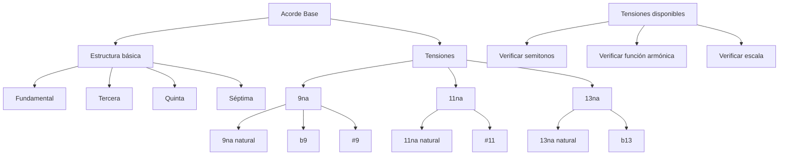

### ¿Qué son las tensiones?

Las tensiones son extensiones de la armonía que corresponden a los grados 9, 11 y 13 de la escala, contados a partir de la fundamental del acorde. Estas notas equivalen a:

- **9**: II una octava arriba (9 grados desde la tónica)
- **11**: IV una octava arriba (11 grados desde la tónica)
- **13**: VI una octava arriba (13 grados desde la fundamental)

```music-abc
X:1
T:Grados sobre C
M:4/4
L:1/4
K:C
"C"[Cc] "D"[dD] "E=3"E "F=11"[fF] "G=5"G "A=13"[Aa] "B=7"B|
w:1o8 2o9 3 4o11 5 6o13 7
```

## Proceso para determinar tensiones disponibles

Para determinar si una tensión está disponible para un acorde:

1. Identificar la tensión deseada (9, 11 o 13)
2. Colocar esta nota mentalmente dentro del acorde
	1. Prácticamente es revisar si la nota inferior tiene o no un semitono
3. Verificar que no forme intervalos de semitono con la nota inferior9119

## Tensiones disponibles por tipo de acorde

| Grado | Tipo de acorde   | Símbolo | 9   | 11  | 13  |
| ----- | ---------------- | ------- | --- | --- | --- |
| I     | Mayor 7          | Cmaj7   | ✓   | ×   | ✓   |
| II    | Menor 7          | Dm7     | ✓   | ✓   | ✓   |
| III   | Menor 7          | Em7     | ×   | ✓   | ×   |
| IV    | Mayor 7          | Fmaj7   | ✓   | ✓#  | ✓   |
| V     | Dominante        | G7      | ✓   | ×   | ✓   |
| VI 7  | Menor 7          | Am7     | ✓   | ✓   | ×   |
| VII 7 | Semidisminuido 7 | Bm7b5   | ×   | ✓   | ✓b  |

## Nomenclatura y notación

Las tensiones se indican en la cifra del acorde de varias maneras:

1. **Tensiones añadidas**: Se usa el término "add" cuando solo se agrega una tensión **==sin incluir la séptima==**
   - Ejemplo: `Cadd9` = C + E + G + **D** (sin la séptima)
1. **Acordes con tensión y séptima**: Se indica el tipo de séptima seguido de la tensión
   - Ejemplo: `Cmaj9`
   - Ejemplo: `G9` 
1. **Alteraciones de tensiones**: Si la tensión está alterada, se indica con # o b
   - Ejemplo: `Fmaj7#11` = la 11 está aumentada
   - Ejemplo: `Bm7b5b13` = la 13 está disminuida


## Mapa conceptual de tensiones




```music-abc
X:1
T:Grados sobre G
M:4/4
L:1/4
K:C
"G"[Gg] "A"[aA] "B"B "C"[Cc] "D"D "E"[eE] "F"F|
w:1o8 2o9 3 4o11 5 6o13 7
```

### G mayor (Sol mayor)

| Tónica | Tercera | Conteo | Quinta | Conteo | Nombre                | Séptima | Conteo | Nombre                       | 9   | 11  | 13  |
| ------ | ------- | ------ | ------ | ------ | --------------------- | ------- | ------ | ---------------------------- | --- | --- | --- |
| G      | B       | 4      | D      | 7      | G mayor (G)           | F#      | 11     | G mayor 7 (Gmaj7)            | A   |     | E   |
| A      | C       | 3      | E      | 7      | A menor (Am)          | G       | 10     | A menor 7 (Am7)              | B   | D   | F#  |
| B      | D       | 3      | F#     | 7      | B menor (Bm)          | A       | 10     | B menor 7 (Bm7)              |     | G   |     |
| C      | E       | 4      | G      | 7      | C mayor (C)           | B       | 11     | C mayor 7 (Cmaj7)            |     | F#  | A   |
| D      | F#      | 4      | A      | 7      | D mayor (D)           | C       | 10     | D dominante 7 (D7)           |     |     |     |
| E      | G       | 3      | B      | 7      | E menor (Em)          | D       | 10     | E menor 7 (Em7)              |     |     |     |
| F#     | A       | 3      | C      | 6      | F# disminuido (F#dim) | E       | 10     | F# semidisminuido 7 (F#m7b5) |     |     |     |

  

```music-abc
X:1
T:Progresión con tensiones en C mayor
M:4/4
L:1/2
K:C
"Cmaj9"[CEGBd] "Dm11"[DFAcg]| "G13"[GBdfae'] "Cmaj13"[CEGBda']|
```


### Funcionalidades

- **Tensión 9 (segunda)**: Para suavidad, aire, amplitud (muy usada en dream pop).
- **Tensión 11 (cuarta)**: Da un color más "etéreo" o misterioso (muy usada en jazz modal).
- **Tensión 13 (sexta)**: Agrega calidez y brillo (ideal en acordes mayores o dominantes).
- **♭13 o ♭9**: Más disonantes, se usan en acordes menores o semidisminuidos, con cuidado.