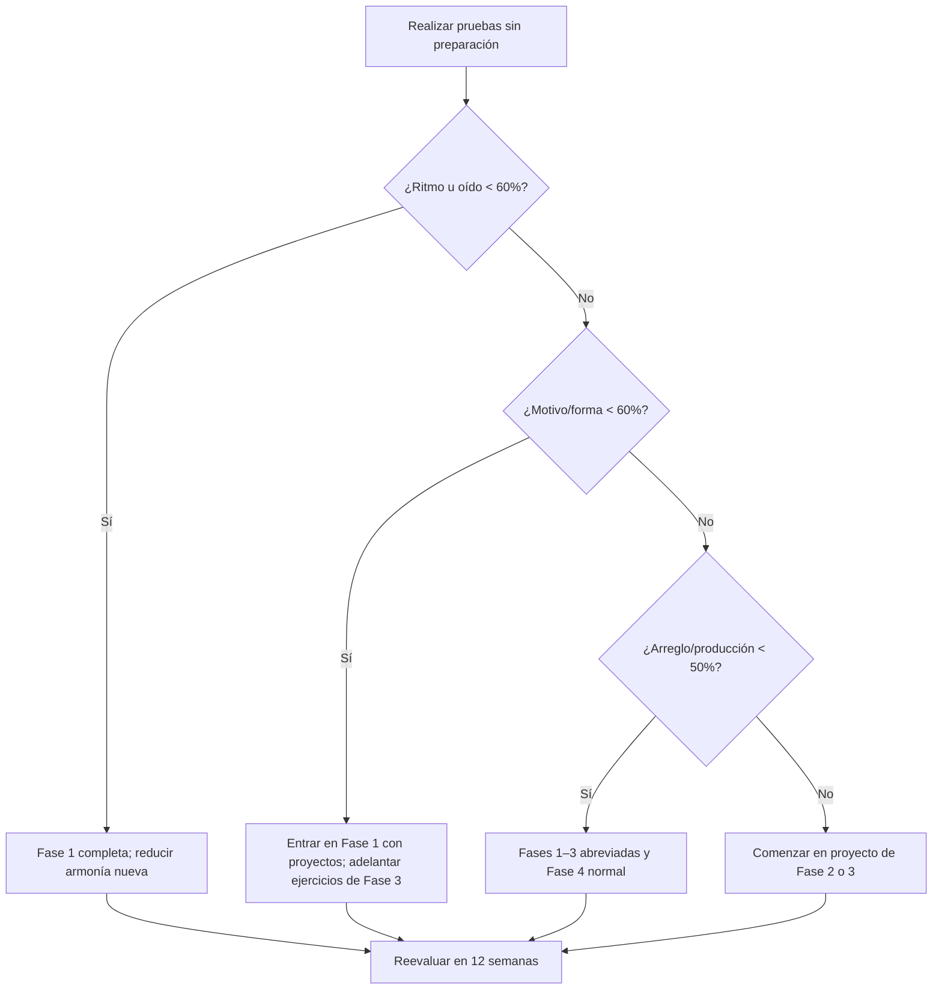

# Auditoría extendida de nivel y brechas

Fecha de auditoría: 2026-08-10.

> [!warning] Qué puede y qué no puede concluir esta auditoría
> La bóveda permite medir exposición, temas recurrentes y algunos productos. No permite verificar por sí sola afinación, pulso, fluidez instrumental, memoria auditiva ni calidad de una interpretación. Las puntuaciones son **hipótesis de planificación**, no calificaciones clínicas ni equivalencias con grados académicos. Deben sustituirse por los resultados de las pruebas base.

## Respuesta breve: ¿qué tanto falta?

Depende de la meta.

| Meta | Preparación provisional | Qué falta principalmente |
|---|---:|---|
| Empezar a componer | Ya estás listo | Empezar, cerrar y revisar con regularidad |
| Miniaturas coherentes de 30–90 s | 40–55% de las capacidades estabilizadas | ritmo, oído, desarrollo y terminación |
| Piezas convincentes de 2–4 min | 25–35% estabilizado | forma, transición, arreglo, escucha crítica y revisiones |
| Portafolio independiente de 3 obras | 20–30% del proceso consolidado | volumen de piezas, feedback, interpretación/producción y selección |
| Dominio avanzado o profesional | No es responsable asignar porcentaje | años de repertorio, especialización, colaboración y criterio situado |

Estas bandas no calculan “talento” ni horas restantes. Comparan la evidencia disponible con las competencias observables definidas en este curso. La incertidumbre es grande porque hay muchos apuntes y pocos audios o productos cerrados.

La conclusión más importante es esta:

> No te falta principalmente otro bloque enorme de teoría. Te faltan muchos ciclos completos de escuchar → hacer → terminar → recibir feedback → revisar → transferir.

## Método de la auditoría

Se revisaron las notas fuera de `1. Curso cresciente` y se agruparon por función. El conteo aproximado fue:

| Capa | Archivos | Palabras aproximadas | Lo que demuestra |
|---|---:|---:|---|
| Repasos temáticos | 41 | 98,909 | exposición y elaboración conceptual |
| Guías generadas con AI | 37 | 71,297 | disponibilidad de explicaciones; no dominio personal |
| Notas de clase | 34 | 14,606 | trayectoria y temas trabajados |
| Ejercicios | 31 | 13,110 | intención de recuperación/aplicación; depende de respuestas reales |
| Otros | 18 | 12,413 | contexto variado |
| Carpeta `Composiciones` | 8 | 9,736 | mezcla de bocetos propios y explicaciones AI |
| Ritmo | 11 | 9,352 | material de estudio amplio |
| Instrumento | 8 | 2,500 | orientación básica de guitarra/piano |
| Solfeo | 2 | 335 | evidencia documentada muy escasa |
| Análisis/referencias | 2 | 86 | evidencia directa muy escasa |

### Conteo temático aproximado

Los temas se solapan; un archivo puede pertenecer a más de una categoría.

| Área | Archivos relacionados | Palabras aproximadas | Lectura |
|---|---:|---:|---|
| Armonía y progresiones | 60 | 81,510 | sobreexposición relativa |
| Contrapunto | 30 | 47,502 | exposición académica considerable |
| Voicing y conducción | 23 | 31,725 | base conceptual prometedora |
| Forma y composición | 19 | 30,632 | mucha explicación, menos productos |
| Fundamentos/tonalidad | 19 | 28,493 | material suficiente para consulta |
| Ritmo | 14 | 13,913 | material presente; falta medir ejecución |
| Melodía/motivo | 7 | 11,787 | base útil, aplicación incipiente |
| Análisis/referencia | 7 | 7,361 | volumen bajo frente a teoría |
| Instrumento | 9 | 3,937 | desarrollo temprano |
| Oído/solfeo | 4 | 1,651 | brecha documental fuerte |
| Producción/arreglo | 0 | 0 | brecha casi total en la bóveda auditada |

### Evidencia directa de composición encontrada

- [[3. Composiciones/1. cyclone/Cyclone]] — boceto breve.
- [[3. Composiciones/2. nocturno/Nocturno]] — intención expresiva, métrica y color.
- [[3. Composiciones/3. melódica/1. Desarrollo/0. Desarrollo]] — A, A’ y B; reflexión sobre transición y cierre.
- [[3. Composiciones/4. melódica II/0. Desarrollo]] — proceso de generación desde guitarra, acordes y ritmo imaginado.
- Varias notas extensas bajo `Composiciones/.../AI` son material explicativo, no evidencia de que una habilidad ya esté disponible sin ayuda.
- [[5. Referencias/0. Análisis/Radiohead/True love waits]] es un inicio muy breve de análisis, insuficiente aún para demostrar un método de extracción.

## Escala común de dominio

Para evitar etiquetas vagas como “principiante” o “intermedio”, cada competencia usa seis niveles.

| Nivel | Nombre | Evidencia requerida |
|---:|---|---|
| 0 | No observado | no hay material o prueba |
| 1 | Reconocimiento | identificas el concepto con ayuda o después de leerlo |
| 2 | Reproducción controlada | lo ejecutas en un ejercicio familiar y lento |
| 3 | Aplicación autónoma | lo eliges y utilizas sin guía en una pieza breve |
| 4 | Transferencia y diagnóstico | lo adaptas a otros contextos, detectas errores y revisas |
| 5 | Integración artística | lo usas o evitas con criterio estable en obras completas y puedes enseñarlo |

Ninguna carpeta o número de palabras concede automáticamente un nivel 3. Para nivel 3 debe existir producción autónoma; para nivel 4, transferencia y revisión.

## Matriz provisional por competencias

| Competencia | Exposición | Evidencia aplicada | Nivel provisional | Confianza | Meta a 6 meses | Prioridad |
|---|---|---|---:|---|---:|---|
| Notación y fundamentos | amplia | errores puntuales, uso en apuntes | 2.0/5 | media | 3 | media |
| Pulso, subdivisión y lectura rítmica | amplia en notas | poca grabación verificable | 1.5–2.0/5 | baja | 3 | muy alta |
| Oído tonal y solfeo | baja | casi no documentada | 1.0–1.5/5 | baja | 2.5–3 | muy alta |
| Transcripción | baja | análisis muy breves | 1.0/5 | media | 2.5 | muy alta |
| Melodía y motivo | media | A/A’/B y variación consciente | 2.5/5 | media | 3.5 | alta |
| Armonía tonal | muy amplia | bocetos y análisis con imprecisiones | 2.5–3.0/5 | media | 3.5 | media-alta |
| Conducción/voicing | amplia | ejercicios, transferencia parcial | 2.5/5 | media | 3.5 | alta |
| Contrapunto de especie | muy amplia | trabajo hasta quinta especie | 3.0/5 | media | mantener | baja |
| Contrapunto libre | amplia indirectamente | pocas piezas que lo integren | 2.0/5 | baja | 3 | media |
| Forma y desarrollo | amplia en lectura | bloqueo explícito en A→B | 2.0/5 | alta | 3.5 | máxima |
| Arreglo y textura | baja | sensibilidad en bocetos, poca comparación | 1.5/5 | baja | 3 | alta |
| Producción/mezcla | no observada | casi ninguna evidencia | 1.0/5 | media | 2.5 | alta después del mes 6 |
| Guitarra | experiencia inicial/intermedia | prototipos y acordes | 2.0/5 | baja | 3 | media |
| Piano | en desarrollo | poca evidencia | 1.0/5 | baja | 2 | media |
| Flujo de composición | varios inicios | pocas obras cerradas | 2.0/5 | alta | 3.5 | máxima |
| Revisión y feedback | poca documentación | reflexión, pocas versiones | 1.5–2.0/5 | media | 3 | máxima |
| Portafolio | bocetos | no hay tres obras pulidas verificables | 1.0/5 | alta | 2.5 | alta |

## Lectura del perfil

### Fortalezas reales

1. **Curiosidad y tolerancia a complejidad.** Has abordado temas que muchas rutas introductorias posponen: tensiones, intercambio modal, dominantes secundarias, voicing y cinco especies.
2. **Pensamiento explícito sobre el proceso.** Las notas de desarrollo muestran que detectas problemas de cierre y transición; nombrar el problema ya permite diseñar un ejercicio.
3. **Sensibilidad por color y ambigüedad.** El interés por Radiohead, arpegios, nocturnos, cromatismo y acordes `add`/`sus` sugiere un territorio estético coherente.
4. **Generación por varios canales.** Aparecen ideas desde guitarra, acordes, ritmo e imaginación; esto evita depender de una sola puerta de entrada.
5. **Experiencia contrapuntística.** Aunque falta transferencia libre, la especie ofrece una base útil para escuchar independencia, dirección y disonancia.

### Fortalezas que todavía pueden ser “frágiles”

- Conocer fórmulas de modos y tensiones no garantiza reconocerlos o cantar sus grados.
- Resolver ejercicios de especie no garantiza escribir dos líneas libres expresivas.
- Nombrar funciones no garantiza que el centro tonal o la función se hayan escuchado correctamente.
- Tener muchos apuntes no garantiza recuperación a 48 horas.
- Comenzar varias piezas no demuestra control de proporción o cierre.

## Brechas prioritarias

### 1. Conversión de símbolo a sonido

**Señal:** vocabulario armónico avanzado frente a muy poco solfeo/documentación auditiva.

**Riesgo:** elegir recursos por nombre, analizar de más y no detectar que la etiqueta contradice lo que se oye.

**Intervención:** cantar grados, bajos, terceras y séptimas; predecir antes de tocar; transcribir fragmentos breves; armonizar la misma melodía de varias formas.

**Evidencia de cierre:** 20 transcripciones de 2–8 compases, 10 melodías cantadas y comprobadas, y capacidad de describir centro/bajo/cierre sin instrumento.

### 2. Ritmo como generador de identidad

**Señal:** material rítmico abundante pero pocos productos donde el ritmo sea la variable principal.

**Riesgo:** que la identidad dependa siempre de color armónico o arpegio continuo.

**Intervención:** piezas de percusión/una altura, desplazamiento de célula, silencios, síncopa, métrica simple/compuesta y contraste sin cambiar armonía.

**Evidencia de cierre:** tres estudios rítmicos terminados, lectura fiable de ocho compases y dos piezas cuya sección B se distingue solo por ritmo/textura.

### 3. Desarrollo con material limitado

**Señal:** duda sobre cómo conectar A y B; tendencia posible a añadir materiales.

**Riesgo:** sucesión de buenas ideas sin necesidad interna.

**Intervención:** fragmentación, secuencia, liquidación, aumento/disminución, desplazamiento métrico, cambio de registro y reducción de densidad.

**Evidencia de cierre:** una pieza de 90 segundos con una sola familia motívica y un análisis que traza cada derivación.

### 4. Función formal y control del cierre

**Señal:** A puede sonar como final antes de tiempo.

**Riesgo:** intentar resolver el problema con cromatismo o acordes adicionales cuando nace de cadencia, hipermetro, densidad o duración.

**Intervención:** versiones alternativas de los cuatro últimos compases de A; distinguir cierre local/global; mapas de energía; escuchar cadencias en repertorio del estilo.

**Evidencia de cierre:** oyentes identifican la función transicional sin explicación y A conduce a B en dos piezas distintas.

### 5. Terminación y revisión

**Señal:** pocos productos cerrados frente a mucha preparación.

**Riesgo:** no desarrollar criterio sobre proporción, interpretación, mezcla ni desapego.

**Intervención:** definiciones pequeñas de terminado, una pieza cada 2–4 semanas, toma completa temprana, escucha al día siguiente y revisión macro antes de micro.

**Evidencia de cierre:** seis piezas terminadas en seis meses, tres revisadas y tres compartidas.

### 6. Análisis que produce música

**Señal:** muy pocos análisis de referencia documentados.

**Riesgo:** estudiar teoría descontextualizada o copiar superficies.

**Intervención:** análisis por capas con una regla extraída, un ejercicio y una microcomposición.

**Evidencia de cierre:** doce análisis, seis transcripciones parciales y doce ejercicios derivados.

### 7. Arreglo, producción y presentación

**Señal:** cero material temático identificado en la auditoría automática.

**Riesgo:** que una idea compositiva nunca llegue a una forma escuchable o que la mezcla intente reparar el arreglo.

**Intervención:** funciones de capa, reducción/reconstrucción, balance estático, referencia de nivel, exportación y prueba en varios sistemas.

**Evidencia de cierre:** tres arreglos del mismo material y tres mezclas reproducibles fuera del DAW.

## Conceptos que conviene consolidar antes de añadir más

### Errores detectados

- En [[1. Teoría/0. Fundamentos/Intro composición]] se describe F–A como tres semitonos; son cuatro y forman una tercera mayor.
- En [[3. Composiciones/5. dawn-chorus/Dawn Chorus]] aparece Em descrito como locrio dentro de G mayor. La lectura diatónica ordinaria de E–G–B en G mayor es vi o centro eólico sobre E, a menos que notas adicionales justifiquen otra colección.
- Algunas notas alternan “modo”, “función”, “familia tonal” y “nombre de acorde” como si fueran equivalentes.

Estos errores no implican retroceder todo el curso. Indican que cada análisis debe atravesar este filtro:

1. ¿Qué alturas suenan literalmente?
2. ¿Qué bajo suena y en qué registro?
3. ¿Qué centro se percibe antes de nombrarlo?
4. ¿Dónde ocurre reposo, continuidad o tensión?
5. ¿Qué etiqueta describe mejor ese efecto y qué alternativa existe?
6. ¿La etiqueta cambia alguna decisión compositiva?

## Qué no priorizar ahora

- Memorizar más listas de tensiones disponibles.
- Añadir sustituciones sin oír primero la línea de bajo y el cierre.
- Repetir quinta especie durante meses si no se traslada a una obra.
- Empezar orquestación sin una pieza que necesite instrumentos específicos.
- Estudiar masterización avanzada antes de controlar arreglo, ganancia y balance.
- Buscar “el acorde de Radiohead” en lugar de transcribir ritmo, voz superior, bajo, textura y forma.
- Leer dos tratados de forma a la vez sin analizar repertorio.

## Evaluación base detallada

Guarda cada resultado en una carpeta fechada. No borres las primeras tomas.

### A. Ritmo — 20 puntos

| Prueba | 0 | 1 | 2 | 3 | 4 |
|---|---|---|---|---|---|
| Pulso 60 s | se pierde | múltiples reinicios | deriva clara | estable con fallos menores | estable y relajado |
| Subdivisión | no se sostiene | solo una figura | figuras aisladas | cambia entre divisiones | cambia con precisión musical |
| Lectura nueva | <40% | 40–59% | 60–74% | 75–89% | ≥90% |
| Síncopa/silencio | borra métrica | muchos errores | patrón reconocible | pocos errores | control expresivo |
| Invención | copia/repite | una célula sin forma | dos células | desarrollo claro | dirección y contraste |

### B. Oído y solfeo — 24 puntos

Seis pruebas de 0–4:

1. encontrar tónica;
2. cantar grados;
3. retener dos compases;
4. transcribir ritmo;
5. transcribir alturas;
6. escuchar bajo y tipo de cierre.

No uses afinación absoluta como criterio. Evalúa relación tonal, memoria, proceso y capacidad de corregir.

### C. Armonía y conducción — 20 puntos

1. tres armonizaciones realmente distintas;
2. línea de bajo cantable;
3. voz superior intencional;
4. control de notas comunes/tendencias;
5. explicación auditiva y corrección de errores.

### D. Motivo y forma — 24 puntos

1. identidad del motivo;
2. variedad derivada;
3. continuidad;
4. contraste;
5. trayectoria/clímax;
6. cierre global.

### E. Instrumento — 16 puntos por instrumento

1. pulso;
2. coordinación;
3. dinámica/articulación;
4. lectura o reproducción de oído.

Guitarra y piano se puntúan por separado. El objetivo no es virtuosismo: es disponer de interfaces fiables para imaginar y probar.

### F. Producción y revisión — 24 puntos

1. grabación limpia suficiente;
2. balance;
3. función de capas;
4. contraste y automatización;
5. traducción entre sistemas;
6. calidad de la revisión.

## Conversión de puntuaciones a decisiones

No sumes todo en un “nivel musical”. Usa cada dominio:

| Resultado en un dominio | Decisión |
|---:|---|
| 0–39% | empezar con tareas muy limitadas y feedback frecuente |
| 40–59% | practicar habilidad base y aplicarla en miniaturas |
| 60–74% | avanzar con una dificultad nueva por proyecto |
| 75–89% | transferir a estilos/tonalidades/contextos distintos |
| 90–100% | mantener y utilizar en obras; buscar matices, no más ejercicios básicos |

Una puerta se considera estable cuando se alcanza el criterio en **dos días y materiales diferentes**.

## Árbol de decisión después de las pruebas

## Metas cuantificables a seis meses

- 6–9 piezas o estudios terminados.
- 20 transcripciones breves; al menos cinco con bajo.
- 12 análisis de referencia; al menos seis convierten un principio en ejercicio.
- 30 sesiones de canto contextual.
- 12 tomas completas sin detenerse.
- 3 piezas revisadas después de una escucha diferida.
- 2 piezas compartidas para feedback específico.
- 1 pieza de dos minutos con transición y cierre convincentes.

## Metas a doce meses

- 12–15 productos cerrados en total.
- Tres arreglos del mismo material.
- Tres producciones exportadas y comparadas con referencia.
- Doce análisis adicionales.
- Una pieza de 2–3 minutos revisada estructuralmente.
- Capacidad de transcribir por capas un minuto de una referencia con complejidad apropiada.
- Una matriz de recursos personales: frecuentes, evitados, en desarrollo y prohibidos temporalmente.

## Metas a dieciocho meses

- 18 productos cerrados, sin exigir que todos sean “obras mayores”.
- Portafolio de tres piezas pulidas.
- Al menos una colaboración con intérprete u otro músico, si es posible.
- Proceso documentado desde referencia/restricción hasta revisión.
- Capacidad de iniciar un proyecto, establecer su alcance y terminarlo sin un temario externo.
- Elección informada de una especialización para los meses 19–24.

## Cómo actualizar la auditoría

Cada doce semanas:

1. Conserva la puntuación anterior.
2. Repite solo una muestra comparable, no exactamente el mismo ejercicio memorizado.
3. Añade enlaces a audio, partitura y nota de proceso.
4. Cambia el nivel únicamente si hay dos pruebas o una obra clara.
5. Escribe una frase por competencia: “ahora puedo…”.
6. Selecciona la brecha que más limita la siguiente obra.

## Dictamen actual

Tu perfil puede describirse como **compositor principiante con exposición teórica intermedia desigual**. Eso no es una contradicción: la composición integra dominios que se desarrollan a velocidades distintas.

El mejor movimiento no es esperar a “saber suficiente”. Ya sabes suficiente para escribir. El movimiento correcto es hacer piezas más pequeñas, escuchar mejor lo que realmente ocurrió, y aumentar la dificultad solo cuando el ciclo de terminación sea estable.

Continúa en [[_legacy/Curso creciente 2026-08/5. Investigación y roadmap/00. Roadmap maestro de 18 a 24 meses]] y registra resultados en [[_legacy/Curso creciente 2026-08/5. Investigación y roadmap/04. Evaluaciones trimestrales y puertas de dominio]].
