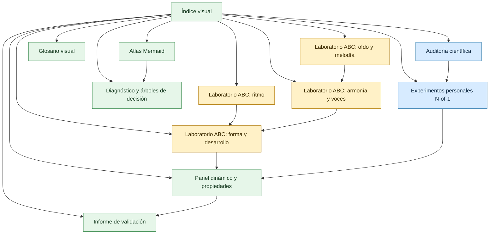
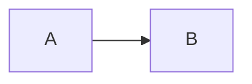
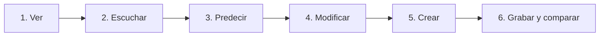
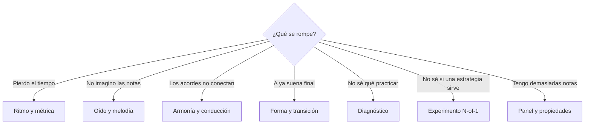
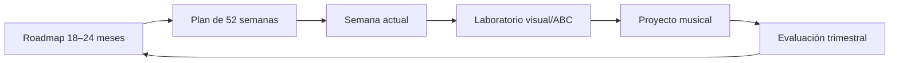

# Índice visual e interactivo

> [!abstract] Propósito
> Esta carpeta convierte el roadmap en objetos que puedes **ver, escuchar, tocar, modificar y medir**. No reemplaza las etapas ni el plan anual: funciona como laboratorio, mapa de decisiones y capa de comprobación científica.

## Mapa completo



## Documentos

Vista espacial: [[_legacy/Curso creciente 2026-08/6. Atlas visual y laboratorios/Mapa maestro del curso.canvas|Mapa maestro del curso — Canvas]].

| Documento | Pregunta que resuelve | Elementos dinámicos |
|---|---|---|
| [[_legacy/Curso creciente 2026-08/6. Atlas visual y laboratorios/01. Auditoría científica de segunda edición]] | ¿Qué afirmaciones tienen apoyo y cuánto? | matriz de evidencia, semáforos, enlaces |
| [[_legacy/Curso creciente 2026-08/6. Atlas visual y laboratorios/02. Atlas Mermaid del aprendizaje musical]] | ¿Cómo se relacionan todas las habilidades? | flowcharts, estados, secuencias, cronogramas |
| [[_legacy/Curso creciente 2026-08/6. Atlas visual y laboratorios/03. Laboratorio Music ABC - Ritmo y métrica]] | ¿Cómo convierto ritmo en sonido y forma? | partituras reproducibles y variaciones |
| [[_legacy/Curso creciente 2026-08/6. Atlas visual y laboratorios/04. Laboratorio Music ABC - Oído, grados y melodía]] | ¿Cómo entreno audición interna en contexto? | cantar–predecir–reproducir–transcribir |
| [[_legacy/Curso creciente 2026-08/6. Atlas visual y laboratorios/05. Laboratorio Music ABC - Armonía y conducción]] | ¿Cómo escucho bajo, voces, función y color? | progresiones y voces reproducibles |
| [[_legacy/Curso creciente 2026-08/6. Atlas visual y laboratorios/06. Laboratorio Music ABC - Forma, transición y desarrollo]] | ¿Cómo hago que una idea continúe, contraste y cierre? | versiones A/B, puentes y mapas |
| [[_legacy/Curso creciente 2026-08/6. Atlas visual y laboratorios/07. Experimentos personales N-of-1]] | ¿Qué estrategia me funciona realmente? | protocolos A/B, hojas de resultados |
| [[_legacy/Curso creciente 2026-08/6. Atlas visual y laboratorios/08. Diagnóstico interactivo y solución de bloqueos]] | ¿Qué hago cuando algo no funciona? | árboles por síntoma y pruebas mínimas |
| [[_legacy/Curso creciente 2026-08/6. Atlas visual y laboratorios/09. Panel dinámico, propiedades y consultas]] | ¿Cómo veo proyectos y evidencia sin otro plugin? | propiedades, búsquedas embebidas, paneles |
| [[_legacy/Curso creciente 2026-08/6. Atlas visual y laboratorios/10. Glosario visual y conexiones]] | ¿Cómo se conectan conceptos que suelo confundir? | mapas conceptuales y ejemplos auditivos |
| [[_legacy/Curso creciente 2026-08/6. Atlas visual y laboratorios/11. Informe de validación técnica y mantenimiento]] | ¿Cómo sé que enlaces, diagramas y partituras funcionan? | conteos, validación y protocolo de mantenimiento |

## Cómo funcionan las partituras

La bóveda tiene activo el complemento **ABC Music Notation**. En estos documentos:

- un bloque `music-abc` se renderiza como partitura;
- un clic sobre la partitura inicia o pausa la reproducción;
- doble clic reinicia;
- puedes copiar el bloque, cambiar notas, ritmo, tempo o tonalidad y volver a escucharlo;
- el audio necesita cargar soundfonts externos; si la partitura aparece pero no suena, revisa conexión y permisos de audio.

Ejemplo de comprobación:

```music-abc
X:1
T:Prueba del reproductor ABC
M:4/4
L:1/4
Q:1/4=80
K:C
C D E G | c2 G2 | E D C2 |]
```

> [!exercise] Hazlo interactivo
> Cambia `Q:1/4=80` a `Q:1/4=60`, reemplaza el primer `E` por `F` y escucha qué cambió en energía y dirección.

## Cómo funcionan los diagramas

La bóveda también tiene activo **Mermaid Tools**. El identificador compatible es:

````markdown

````

Las cinco apariciones antiguas de `mermaid.js` en la bóveda quedaron normalizadas a `mermaid`, que es el bloque reconocido por Obsidian.

## Cinco modos de uso



### 1. Ver

Observa partitura, voces, forma o diagrama. Describe lo visible sin reproducir.

### 2. Escuchar

Reproduce una vez sin instrumento. Marca pulso y localiza reposo, tensión o cambio.

### 3. Predecir

Pausa antes del último compás. Canta o imagina la continuación antes de escucharla.

### 4. Modificar

Cambia **una sola variable**: ritmo, altura, bajo, registro, densidad o cierre.

### 5. Crear

Escribe un ejemplo nuevo que conserve el principio pero no la superficie.

### 6. Grabar y comparar

Graba tu versión y compara intención con resultado al día siguiente.

## Ruta rápida por problema



## Ruta rápida por tiempo

### Tengo 15 minutos

1. Elige un ejemplo ABC.
2. Predice antes de escuchar.
3. Modifica una variable.
4. Guarda una grabación o nota de dos frases.

### Tengo 45 minutos

1. 10 min: oído/ritmo con ABC.
2. 10 min: análisis de una referencia.
3. 20 min: aplicar a pieza.
4. 5 min: grabar y definir siguiente acción.

### Tengo 90 minutos

1. 15 min: calentamiento auditivo/rítmico.
2. 20 min: generar cinco alternativas.
3. 35 min: desarrollar una.
4. 10 min: toma completa.
5. 10 min: registro y cierre.

## Contrato de evidencia

Los documentos usan tres etiquetas:

| Etiqueta | Significado |
|---|---|
| 🟢 **Directa** | estudio en músicos o tarea musical comparable |
| 🟡 **Transferida** | evidencia sólida en memoria/aprendizaje motor, aplicada con cautela |
| 🔵 **Operativa** | regla diseñada para organizar este curso; debe probarse personalmente |

No se utilizará “científicamente demostrado” para una frecuencia semanal, duración de sesión, porcentaje de nivel o secuencia curricular que la literatura no haya validado directamente.

## Empieza aquí hoy

- [ ] Reproduce el ejemplo ABC de esta página.
- [ ] Lee la sección “Conclusiones de la revisión” en [[_legacy/Curso creciente 2026-08/6. Atlas visual y laboratorios/01. Auditoría científica de segunda edición]].
- [ ] Elige un laboratorio según el árbol de problema.
- [ ] Guarda una versión modificada o una grabación.
- [ ] Registra el resultado en [[_legacy/Curso creciente 2026-08/6. Atlas visual y laboratorios/09. Panel dinámico, propiedades y consultas]].

## Relación con el curso principal



- Visión larga: [[_legacy/Curso creciente 2026-08/5. Investigación y roadmap/00. Roadmap maestro de 18 a 24 meses]].
- Calendario: [[_legacy/Curso creciente 2026-08/5. Investigación y roadmap/03. Plan de lectura y aplicación de 52 semanas]].
- Evidencia de nivel: [[_legacy/Curso creciente 2026-08/5. Investigación y roadmap/01. Auditoría extendida de nivel y brechas]].
- Puertas: [[_legacy/Curso creciente 2026-08/5. Investigación y roadmap/04. Evaluaciones trimestrales y puertas de dominio]].
