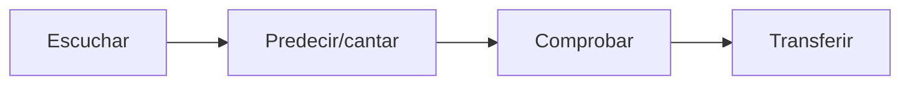
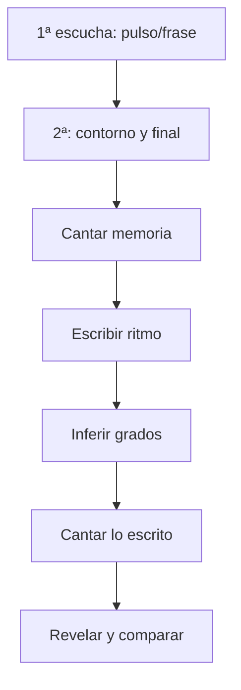

# Laboratorio Music ABC — Oído, grados y melodía

> [!abstract] Objetivo
> Reducir la distancia entre “sé la fórmula” y “puedo imaginar, cantar, reconocer, encontrar y utilizar ese sonido”.

## Fundamento

Karpinski trata la habilidad auditiva como una combinación de percepción de rasgos, memoria, métrica, inferencia tonal, dictado, lectura y ejecución. [*Aural Skills Acquisition*](https://academic.oup.com/book/48998). Estudios auditivo-motores con pianistas muestran ventajas de combinar sonido y acción frente a aprendizaje puramente motor, moduladas por imaginación individual. [Brown y Palmer](https://pubmed.ncbi.nlm.nih.gov/22271265/).

Esto no demuestra que “do móvil” sea el único sistema correcto ni que cantar grados diariamente tenga una dosis universal. Aquí se usa porque hace explícitas relaciones tonales transferibles.

## Protocolo E–P–C–T



1. **Escuchar:** una vez, sin instrumento.
2. **Predecir:** canta la siguiente nota o la tónica.
3. **Comprobar:** reproduce y localiza diferencia.
4. **Transferir:** canta en otra tonalidad o crea una frase propia.

---

# Nivel 1 — Centro y grados

## 1. Escala mayor como relaciones

```music-abc
X:1
T:1. Grados de Do mayor
M:4/4
L:1/4
Q:1/4=72
K:C
C D E F | G A B c | c B A G | F E D C |]
```

Canta números `1 2 3 4 | 5 6 7 1` antes de usar nombres de notas.

## 2. Tónica, tercera y quinta

```music-abc
X:2
T:2. Estructura 1–3–5
M:3/4
L:1/4
Q:1/4=68
K:C
C E G | c G E | C3 | G E C |]
```

**Haz:** escucha una vez; canta 1, 3 y 5 sobre un drone de C en tu instrumento.

## 3. Grados activos hacia reposo

```music-abc
X:3
T:3. Tendencias dentro de una frase
M:4/4
L:1/4
Q:1/4=68
K:C
D E F E | D2 B2 | c2 B2 | C4 |]
```

Pausa antes del último compás. Canta la resolución que esperas. La tendencia depende de contexto y estilo; no es una fuerza física universal.

## 4. Patrones transferibles

```music-abc
X:4
T:4. Patrones de grados
M:4/4
L:1/4
Q:1/4=72
K:C
C D E G | E D C2 | C E D F | E G C2 |]
```

Patrones: `1–2–3–5–3–2–1` y `1–3–2–4–3–5–1`.

## 5. Los mismos grados en Sol mayor

```music-abc
X:5
T:5. Transferencia a Sol mayor
M:4/4
L:1/4
Q:1/4=72
K:G
G A B d | B A G2 | G B A c | B d G2 |]
```

**Criterio:** no calcules nota por nota. Conserva sensación de grado y comprueba después.

---

# Nivel 2 — Ritmo, contorno y memoria

## 6. Contorno ascendente–descendente

```music-abc
X:6
T:6. Arco melódico
M:4/4
L:1/8
Q:1/4=72
K:C
C D E F G2 E2 | D E F G A2 G2 | F E D C D2 B,2 | C8 |]
```

Después de una escucha dibuja una línea del contorno, sin escribir alturas.

## 7. Mismo ritmo, tres contornos

```music-abc
X:7
T:7. Comparar contorno conservando ritmo
M:4/4
L:1/8
Q:1/4=70
K:C
% Ascendente
C C D E G2 E2 |
% Descendente
G G F E D2 E2 |
% Arco
C E G A G2 E2 |]
```

¿Cuál produce mayor sensación de llegada? La respuesta depende también de tonalidad y nota final.

## 8. Mismo contorno, ritmo diferente

```music-abc
X:8
T:8. Contorno estable, identidad rítmica variable
M:4/4
L:1/8
Q:1/4=70
K:C
C D E G E2 D2 | C2 D E2 G E D | C C D2 E G E2 |]
```

**Transferencia:** decide qué versión tiene mejor identidad y explica por ataque/silencio/duración.

## 9. Memoria por fragmentos

```music-abc
X:9
T:9. Dos fragmentos y combinación
M:4/4
L:1/8
Q:1/4=68
K:C
P:a
C D E2 G E D2 |
P:b
E F G2 A G E2 |
P:a+b
C D E2 G E D2 | E F G2 A G E2 |]
```

Escucha `a`, pausa y canta. Haz lo mismo con `b`. Después canta la combinación sin audio.

---

# Nivel 3 — Motivo y transformación

## 10. Motivo base

```music-abc
X:10
T:10. Motivo base
M:4/4
L:1/8
Q:1/4=72
K:C
E G A2 G E D2 |]
```

Memoriza como contorno y ritmo, no como seis nombres aislados.

## 11. Variación rítmica

```music-abc
X:11
T:11. Mismas alturas, otro ritmo
M:4/4
L:1/8
Q:1/4=72
K:C
E2 G A G2 E D | E G2 A G E2 D |]
```

## 12. Variación interválica

```music-abc
X:12
T:12. Ritmo conservado, intervalos expandidos
M:4/4
L:1/8
Q:1/4=72
K:C
E A c2 A E D2 |]
```

## 13. Fragmentación y secuencia

```music-abc
X:13
T:13. Fragmento secuenciado
M:4/4
L:1/8
Q:1/4=74
K:C
E G A2 E G A2 | F A B2 F A B2 | G B c2 B A G2 |]
```

**Análisis:** el fragmento inicial tiene cuatro unidades de corchea y se desplaza por grado.

## 14. Liquidación

```music-abc
X:14
T:14. Reducir hasta una llegada
M:4/4
L:1/8
Q:1/4=72
K:C
E G A2 G E D2 | E G A2 G2 E2 | E G A2 E4 | E G E2 D2 C2 |]
```

**Escucha:** el material pierde elementos progresivamente antes de cerrar.

---

# Nivel 4 — Menor, modo y nota característica

## 15. La menor natural

```music-abc
X:15
T:15. La menor natural
M:4/4
L:1/4
Q:1/4=68
K:Am
A B c d | e f g a | a g f e | d c B A |]
```

## 16. Sensible alterada en contexto

```music-abc
X:16
T:16. Sol sostenido orientando hacia La
M:4/4
L:1/8
Q:1/4=68
K:Am
A B c2 e d c2 | B c d2 e ^g a2 | a g f e d c B2 | A8 |]
```

No deduzcas “menor armónica” de una sola nota sin observar frase, armonía y centro. Describe primero qué hace G♯ en este contexto.

## 17. Color dórico sobre Re

```music-abc
X:17
T:17. Re dórico y sexta característica
M:4/4
L:1/8
Q:1/4=70
K:Ddor
D E F2 A G E2 | D F A2 B A G2 | F E D2 C D E2 | D8 |]
```

Compara B natural con B♭ sustituyéndolo en una copia. ¿Cambia el color sin cambiar el centro?

---

# Nivel 5 — Frase, clímax y cierre

## 18. Punto culminante preparado

```music-abc
X:18
T:18. Ascenso, clímax y liberación
M:4/4
L:1/8
Q:1/4=72
K:C
C D E2 D E F2 | E F G2 F G A2 | G A B2 c4 | B A G E D2 C2 |]
```

Marca el clímax. Después crea una versión donde el clímax sea rítmico, no la nota más alta.

## 19. Final abierto y final cerrado

```music-abc
X:19
T:19. Dos cierres para la misma frase
M:4/4
L:1/8
Q:1/4=70
K:C
P:Frase
E G A2 G E D2 |
P:Abierto
F E D2 B,4 |
P:Cerrado
F E D2 C4 |]
```

El primero no es “objetivamente abierto” en todo estilo; aquí B sobre contexto de C deja mayor expectativa que C.

## 20. Pregunta y respuesta

```music-abc
X:20
T:20. Pregunta, variación y respuesta
M:4/4
L:1/8
Q:1/4=72
K:C
P:Pregunta
C D E2 G E D2 | E F G2 B4 |
P:Respuesta
C D E2 A G E2 | F E D2 C4 |]
```

---

# Dictado autogestionado

Elige un ejemplo que no hayas trabajado y oculta la pantalla después de pulsar reproducción.



Registra errores por categoría:

- memoria;
- ritmo;
- centro;
- grado inicial;
- salto;
- alteración;
- notación;
- afinación vocal.

No escribas “mal oído” como diagnóstico; no indica qué practicar.

# Pruebas ocultas

<details>
<summary>¿Qué conviene hacer si solo encuentro notas por ensayo aleatorio?</summary>

Reduce a final, centro y contorno. Canta la frase, encuentra la primera nota y busca relaciones desde ella. Limita el número de intentos instrumentales antes de volver a cantar.

</details>

<details>
<summary>¿Qué conviene hacer si canto bien pero escribo mal?</summary>

La representación auditiva puede estar mejor que la traducción simbólica. Separa duración, posición métrica y nombre de grado; canta desde lo escrito para detectar la discrepancia.

</details>

<details>
<summary>¿Qué conviene hacer si reconozco después de escuchar el instrumento?</summary>

Eso es reconocimiento apoyado, no producción autónoma. Vuelve a predecir antes de la comprobación y repite con otro centro tonal.

</details>

# Generador de melodías limitadas

Elige una opción de cada columna:

| Variable | A | B | C |
|---|---|---|---|
| alturas | 1–2–3–5 | 1–3–4–6 | pentatónica 1–2–3–5–6 |
| ritmo | negras/corcheas | síncopa | 6/8 |
| contorno | arco | descenso | ondas |
| clímax | mitad | 3/4 | penúltima frase |
| cierre | tónica | grado 2/5 | nota común a siguiente sección |

Escribe 8–16 compases y limita el proyecto a esas decisiones.

# Puerta de salida

- [ ] Encuentro y canto tónica en fragmentos sencillos.
- [ ] Canto dos patrones de grados en tres tonalidades.
- [ ] Separo ritmo, contorno y alturas durante dictado.
- [ ] Recuerdo un motivo al día siguiente.
- [ ] Creo variación rítmica, interválica, fragmentación y liquidación.
- [ ] Diseño un clímax y dos tipos de cierre.
- [ ] Inserto una melodía resultante en una pieza.

Continúa en [[_legacy/Curso creciente 2026-08/6. Atlas visual y laboratorios/05. Laboratorio Music ABC - Armonía y conducción]].
